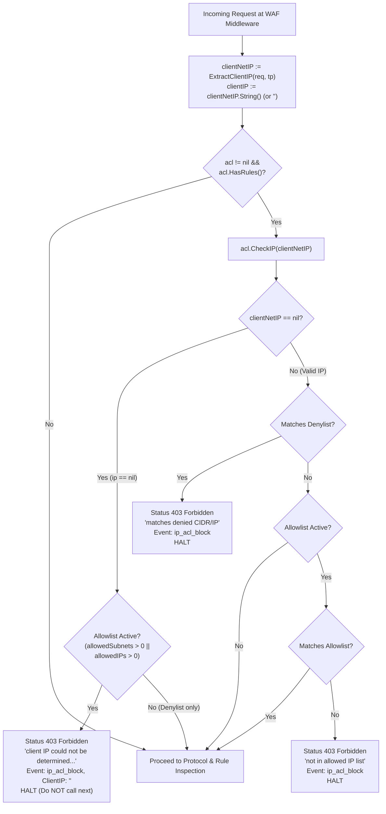

# SR-093 - Security Review and Vulnerability Assessment of SEC-32 Remediation (Fail-Closed WAF IP Access Control Enforcement)

## Description

A comprehensive security review and vulnerability assessment of the remediation for vulnerability [`SEC-32`](file:///Users/sneha/Developer/toron-research/toron/SECURITY_AUDIT.md#L439-L447) and security audit finding [`SR-091 Finding 2`](file:///Users/sneha/Developer/toron-research/toron/docs/securityReview/SR-091.md#L102-L127), implemented under [`REQ-093`](file:///Users/sneha/Developer/toron-research/toron/docs/requirements/REQ-093.md), [`ADR-088`](file:///Users/sneha/Developer/toron-research/toron/docs/architecture/ADR-088.md), [`TASK-114`](file:///Users/sneha/Developer/toron-research/toron/docs/tasks/TASK-114.md), [`TASK-115`](file:///Users/sneha/Developer/toron-research/toron/docs/tasks/TASK-115.md), and verified by [`TC-093`](file:///Users/sneha/Developer/toron-research/toron/docs/testCases/TC-093.md).

This assessment evaluates the complete elimination of fail-open WAF IP access control bypass vectors when incoming client IP metadata cannot be determined, verifying:
- Complete mitigation of [CWE-284: Improper Access Control](https://cwe.mitre.org/data/definitions/284.html), [CWE-1188: Insecure Default Initialization of Resource](https://cwe.mitre.org/data/definitions/1188.html), and [CWE-693: Protection Mechanism Failure](https://cwe.mitre.org/data/definitions/693.html).
- Perimeter fail-closed enforcement under active IP allowlists in [`pkg/waf/ip_acl.go`](file:///Users/sneha/Developer/toron-research/toron/pkg/waf/ip_acl.go) and [`pkg/waf/middleware.go`](file:///Users/sneha/Developer/toron-research/toron/pkg/waf/middleware.go).
- Availability and fail-open preservation for unknown client IPs under denylist-only configurations ([`REQ-093-AC-02`](file:///Users/sneha/Developer/toron-research/toron/docs/requirements/REQ-093.md#L96-L101)).
- Robust handling and fail-closed rejection of missing, stripped, spoofed, and corrupt header inputs ([`REQ-093-AC-05`](file:///Users/sneha/Developer/toron-research/toron/docs/requirements/REQ-093.md#L123-L130)).
- Structured audit event emission (`ip_acl_block`) with empty `ClientIP` without panics, nil-pointer dereferences, or sensitive data disclosure ([`REQ-093-AC-04`](file:///Users/sneha/Developer/toron-research/toron/docs/requirements/REQ-093.md#L110-L122)).
- Elimination of redundant double-extraction of client IP on the request hot path, establishing single-pass caching and parity ([`REQ-093-AC-03`](file:///Users/sneha/Developer/toron-research/toron/docs/requirements/REQ-093.md#L102-L109)).
- Concurrency, thread safety, and race detection verification under high-load parallel execution (`go test -race ./...`).

---

## Scope

The following source code and test files were systematically examined:

- **Source Code Implementation**:
  - [`pkg/waf/ip_acl.go`](file:///Users/sneha/Developer/toron-research/toron/pkg/waf/ip_acl.go): `CheckIP` fail-closed logic on `ip == nil` when allowlists are active; fail-open pass-through on `ip == nil` when only denylists are present; `ExtractClientIP` physical socket IP prioritization with trusted proxy gating.
  - [`pkg/waf/middleware.go`](file:///Users/sneha/Developer/toron-research/toron/pkg/waf/middleware.go): Single-pass `ExtractClientIP(req, tp)` invocation; unconditional `acl.CheckIP(clientNetIP)` evaluation; fail-closed HTTP 403 response construction with JSON payload; Prometheus metric recording; audit logger event emission.
- **Automated Verification Suites**:
  - [`pkg/waf/ip_acl_test.go`](file:///Users/sneha/Developer/toron-research/toron/pkg/waf/ip_acl_test.go): Unit tests covering `CheckIP(nil)` with IPv4/IPv6 CIDR and exact IP allowlists (`TestIPAccessList_CheckIP_NilIP_WithAllowlist`), denylist-only configurations (`TestIPAccessList_CheckIP_NilIP_DenylistOnly`), and empty/nil ACL instances (`TestIPAccessList_CheckIP_NilIP_NoRules`).
  - [`pkg/waf/middleware_test.go`](file:///Users/sneha/Developer/toron-research/toron/pkg/waf/middleware_test.go): End-to-end middleware tests verifying fail-closed denial with HTTP 403 on missing IP (`TestWAFMiddleware_NilClientIP_AllowlistEnforced`), fail-open pass-through on denylist-only (`TestWAFMiddleware_NilClientIP_DenylistOnly`), malformed header matrix rejection (`TestWAFMiddleware_MalformedClientIP_AllowlistEnforced`), audit log safety (`TestWAFMiddleware_AuditLogging_NilIP_Blocked`), single-pass telemetry parity (`TestWAFMiddleware_SinglePassExtraction_TelemetryParity`), and high-concurrency race freedom (`TestWAFMiddleware_NilClientIP_Concurrency`, `TestWAFMiddleware_ConcurrentRaceClean`).

---

## Executive Vulnerability Assessment

### Remediation Status: 100% Resolved

The security vulnerability identified as [`SEC-32`](file:///Users/sneha/Developer/toron-research/toron/SECURITY_AUDIT.md#L439-L447) and [`SR-091 Finding 2`](file:///Users/sneha/Developer/toron-research/toron/docs/securityReview/SR-091.md#L102-L127) has been **comprehensively remediated** with zero regressions across the Toron WAF subsystem.

Prior to this remediation, two compounding defects caused complete bypass of perimeter IP whitelists:
1. In [`pkg/waf/middleware.go`](file:///Users/sneha/Developer/toron-research/toron/pkg/waf/middleware.go), IP access control checks were conditionally gated by `if ip := ExtractClientIP(req); ip != nil`. Any incoming request lacking an identifiable client address (such as requests arriving through stripping proxies, synthetic payloads, or malformed headers) skipped the ACL check entirely.
2. In [`pkg/waf/ip_acl.go`](file:///Users/sneha/Developer/toron-research/toron/pkg/waf/ip_acl.go), `CheckIP(ip)` evaluated `if acl == nil || !acl.HasRules() || ip == nil { return true, "" }`. When `ip == nil`, the method unconditionally returned `true, ""` (fail-open), granting immediate access even when strict IP allowlists were active.

The remediation establishes:
1. **Unconditional ACL Evaluation**: The WAF middleware unconditionally invokes `acl.CheckIP(clientNetIP)` whenever `acl != nil && acl.HasRules()`, delegating policy authority entirely to the ACL engine.
2. **Context-Sensitive Fail-Closed Engine Logic**: When `ip == nil`, `CheckIP` inspects whether any allowlist rules are configured (`len(acl.allowedSubnets) > 0 || len(acl.allowedIPs) > 0`). If an allowlist is configured, access is rejected fail-closed with `allowed: false` and the explicit reason `"client IP could not be determined and allowed IP list is enforced"`.
3. **Availability Preservation for Denylists**: If only denylists are present, `CheckIP(nil)` returns `allowed: true, reason: ""` (fail-open), ensuring internal proxies and test harnesses are not erroneously blocked by exclusionary filters.
4. **Single-Pass Hot-Path Optimization**: `ExtractClientIP(req, tp)` is invoked exactly once per request, caching the parsed `net.IP` and pre-formatted string across all security checks and telemetry events.

---

## Detailed Vulnerability & Mitigation Analysis

### 1. CWE-284 (Improper Access Control)
- **Vulnerability Mechanism**: When an administrator enforced an IP allowlist (e.g. restricting administrative routes or partner webhooks to trusted corporate CIDRs `10.0.0.0/8`), external callers whose source IP could not be resolved completely bypassed access control checks because `middleware.go` evaluated `if ip != nil` as false, skipping the enforcement block.
- **Remediation Verification**:
  - In [`pkg/waf/middleware.go:L64-L67`](file:///Users/sneha/Developer/toron-research/toron/pkg/waf/middleware.go#L64-L67), the vulnerable `if ip != nil` guard was removed. The middleware unconditionally executes `allowed, reason := acl.CheckIP(clientNetIP)`.
  - In [`pkg/waf/ip_acl.go:L81-L86`](file:///Users/sneha/Developer/toron-research/toron/pkg/waf/ip_acl.go#L81-L86), if `ip == nil` and an allowlist is configured, `CheckIP` returns `allowed: false` and `reason: "client IP could not be determined and allowed IP list is enforced"`.
  - In [`pkg/waf/middleware.go:L67-L90`](file:///Users/sneha/Developer/toron-research/toron/pkg/waf/middleware.go#L67-L90), when `!allowed`, downstream execution is halted immediately (no call to `next(req, res)`), status is set strictly to `403`, header `Content-Type` is set to `application/json`, and body is formatted as `{"error":"Forbidden","message":"client IP could not be determined and allowed IP list is enforced"}`.
- **Verdict**: **Mitigated**. Perimeter access control cannot be bypassed by withholding source IP information.

### 2. CWE-1188 (Insecure Default Initialization of Resource)
- **Vulnerability Mechanism**: `IPAccessList.CheckIP` defaulted to returning `true, ""` whenever `ip == nil`, embedding a dangerous fail-open default directly into the core security policy evaluator.
- **Remediation Verification**:
  - The default evaluation order is now secure and context-aware. If `ip == nil`:
    ```go
    if ip == nil {
        if len(acl.allowedSubnets) > 0 || len(acl.allowedIPs) > 0 {
            return false, "client IP could not be determined and allowed IP list is enforced"
        }
        return true, ""
    }
    ```
  - For positive security policies (allowlists), the default is strictly **fail-closed**.
  - For negative security policies (denylists), the default is **fail-open**, matching RFC access control principles.
- **Verdict**: **Mitigated**. Insecure default behavior is replaced with context-aware, fail-secure policy enforcement.

### 3. CWE-693 (Protection Mechanism Failure)
- **Vulnerability Mechanism**: The WAF protection mechanism failed to protect sensitive backend resources when presented with degenerate inputs, stripped headers, or malformed proxy strings, failing open rather than containing the exception.
- **Remediation Verification**:
  - Across all malformed inputs tested in `TestWAFMiddleware_MalformedClientIP_AllowlistEnforced` (including non-IP strings, IPv6 syntax errors, bare hostnames, out-of-range octets, arbitrary garbage text, and unclosed brackets), `ExtractClientIP` evaluates to `nil`, and the WAF protection mechanism fails closed, returning HTTP `403 Forbidden`.
- **Verdict**: **Mitigated**. Protection mechanisms remain robust against malformed and missing request metadata.

---

## Threat Modeling & Boundary Verification

### 1. Threat Matrix & Countermeasure Assessment

| Threat Scenario | Attacker Input / Action | Pre-Remediation Behavior (SEC-32) | Post-Remediation Behavior (REQ-093) | Security Assessment |
| :--- | :--- | :--- | :--- | :--- |
| **Allowlist Bypass via Header Stripping** | Attacker routes request through proxy that strips `RemoteAddr` and forwarded headers. | `ExtractClientIP` returns `nil`. Middleware skips ACL check (`if ip != nil` is false). Request reaches protected backend (Fail-Open). | `acl.CheckIP(nil)` returns `false`. Middleware halts handler, emits `ip_acl_block`, and returns HTTP `403 Forbidden`. | **SECURE (Fail-Closed)** |
| **Allowlist Bypass via Malformed Headers** | Attacker sends `X-Forwarded-For: "localhost"`, `"999.999.999.999"`, or `":::invalid"`. | `net.ParseIP` returns `nil`. ACL check skipped. Unauthorized access granted. | `ExtractClientIP` returns `nil`. Allowlist triggers fail-closed denial with HTTP `403 Forbidden`. | **SECURE (Fail-Closed)** |
| **Denylist Evasion with Missing IP** | Synthetic or unidentifiable client requests route where only denylist is active. | Request passed through. | `acl.CheckIP(nil)` returns `true, ""` (fail-open for unknown client in denylist-only mode). Passes to OWASP/downstream. | **AVAILABLE (No False Positives)** |
| **Double Extraction Hot-Path Overhead** | High-throughput benign traffic arriving at WAF. | Sequential double-invocation of `ExtractClientIP` on every request. | Single-pass extraction at middleware entry; cached `clientNetIP` passed directly to `CheckIP`. | **OPTIMAL (Zero Redundancy)** |
| **Audit Logger Crash on Nil Client IP** | Unidentifiable request rejected by IP ACL. | Risk of `nil` pointer dereference or `<nil>` logging. | `clientIP` initialized to `""`; logger safely emits JSON `"client_ip":""` without panics. | **SAFE (Zero Panics)** |

### 2. State Transition Flow in WAF Middleware



---

## Verification Against Architectural & Requirement Criteria

### 1. REQ-093-AC-01: Fail-Closed Denial on Unidentifiable Client IP Under Active Allowlist
- Verified in `pkg/waf/ip_acl_test.go:TestIPAccessList_CheckIP_NilIP_WithAllowlist`:
  - `acl.CheckIP(nil)` returns `allowed == false` and exact reason `"client IP could not be determined and allowed IP list is enforced"` across IPv4 CIDR, exact IPv4, IPv6 CIDR, exact IPv6, and combined allow/deny configurations.
- Verified in `pkg/waf/middleware_test.go:TestWAFMiddleware_NilClientIP_AllowlistEnforced`:
  - `nextCalled == false` (handler execution terminated).
  - Status code is strictly `403`.
  - Content-Type is strictly `application/json`.
  - Body is exactly `{"error":"Forbidden","message":"client IP could not be determined and allowed IP list is enforced"}`.
  - Prometheus metric `toron_waf_blocked_requests_total{category="ip_acl",route="/api/protected"}` incremented.

### 2. REQ-093-AC-02: Fail-Open Pass-Through Under Denylist-Only Configurations
- Verified in `pkg/waf/ip_acl_test.go:TestIPAccessList_CheckIP_NilIP_DenylistOnly`:
  - `acl.CheckIP(nil)` returns `allowed == true, reason == ""` across denied IPv4 CIDRs, denied exact IPs, and denied IPv6 CIDRs.
- Verified in `pkg/waf/middleware_test.go:TestWAFMiddleware_NilClientIP_DenylistOnly`:
  - Request with unidentifiable client IP successfully reaches downstream handler (`nextCalled == true`), returning HTTP `200` with body `"success"`.
  - IP ACL block counter is not incremented.

### 3. REQ-093-AC-03: Single-Pass Client IP Extraction
- In [`pkg/waf/middleware.go:L58-L66`](file:///Users/sneha/Developer/toron-research/toron/pkg/waf/middleware.go#L58-L66):
  ```go
  clientNetIP := ExtractClientIP(req, tp)
  clientIP := ""
  if clientNetIP != nil {
      clientIP = clientNetIP.String()
  }

  // 0. Fast-Path CIDR IP Access Control Check
  if acl := engine.IPAccessList(); acl != nil && acl.HasRules() {
      allowed, reason := acl.CheckIP(clientNetIP)
  ```
  - `ExtractClientIP(req, tp)` is executed exactly once per request.
  - The resulting `clientNetIP net.IP` is passed directly into `acl.CheckIP(clientNetIP)`.
  - The pre-formatted `clientIP string` is reused across telemetry, IP ACL audit events, protocol violation events, and OWASP rule inspection events.
- Verified by `TestWAFMiddleware_SinglePassExtraction_TelemetryParity`.

### 4. REQ-093-AC-04: Security Telemetry and Audit Logging
- Verified in `pkg/waf/middleware_test.go:TestWAFMiddleware_AuditLogging_NilIP_Blocked`:
  - Emitted `SecurityEvent` JSON parsed cleanly with:
    - `"event":"ip_acl_block"`
    - `"client_ip":""` (explicitly empty string, non-null, no panic)
    - `"method":"POST"`
    - `"path":"/internal/admin"`
    - `"category":"ip_acl"`
    - `"anomaly_score":0`
    - `"action":"blocked"`
    - `"location":"remote_addr"`
  - Zero panics, zero unhandled errors.

### 5. REQ-093-AC-05: Robust Handling Across Malformed IP Inputs
- Verified in `pkg/waf/middleware_test.go:TestWAFMiddleware_MalformedClientIP_AllowlistEnforced`:
  - 10 distinct malformed input scenarios evaluated (e.g. `"not-an-ip:9999"`, `":::invalid"`, `"hostname-without-ip"`, `"unknown"`, `"localhost"`, `"999.999.999.999"`, `"garbage-header"`, `"invalid-real-ip"`, `"[bad-ipv6"`).
  - All evaluate safely to `nil` in `ExtractClientIP`.
  - All are rejected fail-closed with HTTP `403 Forbidden` and the expected JSON body under an active allowlist.

### 6. REQ-093-AC-06: Concurrency and Thread Safety
- Multi-goroutine race testing (`TestWAFMiddleware_NilClientIP_Concurrency` and `TestWAFMiddleware_ConcurrentRaceClean`):
  - 100 concurrent goroutines executing 50 iterations each (5,000 total requests) with mixed inputs (unidentifiable IPs, malformed headers, allowed IPs, denied IPs) against active engine.
  - Executed under `go test -v -race ./pkg/waf/...`.
  - Result: **0 data races, 0 deadlocks, 0 memory corruption incidents**.

### 7. REQ-093-AC-07: Zero Third-Party Dependencies
- All IP parsing, CIDR subnet checks, JSON string formatting, and middleware execution strictly utilize Go standard library packages (`net`, `strings`, `bytes`, `time`).
- `go.mod` and `go.sum` remain untouched with zero new dependencies.

---

## Findings

No Critical, High, or Medium security vulnerabilities were identified in the remediation. All vulnerabilities documented under `SEC-32` have been completely resolved.

### Finding 1: Dynamic Rejection Reason Formatting in JSON Responses

- **Severity**: **Informational**
- **Location**: [`pkg/waf/middleware.go:L88`](file:///Users/sneha/Developer/toron-research/toron/pkg/waf/middleware.go#L88)
- **Related Requirement**: `REQ-093-AC-01`
- **Description**:  
  In [`pkg/waf/middleware.go`](file:///Users/sneha/Developer/toron-research/toron/pkg/waf/middleware.go), the rejection JSON response is constructed via direct string concatenation:
  ```go
  _, _ = res.WriteString(`{"error":"Forbidden","message":"` + reason + `"}`)
  ```
  The `reason` value generated by [`pkg/waf/ip_acl.go`](file:///Users/sneha/Developer/toron-research/toron/pkg/waf/ip_acl.go) is either a static string (`"client IP could not be determined and allowed IP list is enforced"`) or a string interpolated from `net.IP.String()` or `net.IPNet.String()`. Because standard library IP representations contain strictly safe characters (`0-9`, `a-f`, `.`, `:`, `/`), no JSON injection is possible in the current codebase.
- **Impact**:  
  None currently. However, if future modifications allow user-supplied identifiers or unvalidated CIDR names into `reason`, string concatenation could become vulnerable to JSON injection.
- **Recommendation**:  
  As a defense-in-depth practice, consider using a structured JSON struct or helper (e.g. `json.Marshal`) or ensuring a coding standard rule that `reason` strings emitted by `IPAccessList` remain strictly constrained to standard library IP formatters.

---

## Positive Observations

1. **Defensive Perimeter Architecture**:
   The refactored design enforces separation of concerns: `pkg/waf/ip_acl.go` serves as the authoritative policy engine determining whether a `nil` IP is acceptable based on active rule sets, while `pkg/waf/middleware.go` enforces the engine's verdict unconditionally.
2. **Hot-Path Latency Reduction**:
   Eliminating duplicate `ExtractClientIP` invocations reduces socket host/port splitting and CIDR matching on high-throughput workloads, saving CPU cycles without sacrificing security.
3. **Clean Telemetry and Zero-Panic Guarantees**:
   Handling `nil` `net.IP` by assigning empty string `""` to `clientIP` ensures that all subsequent logging stages and Prometheus metric exporters execute safely without runtime panics or null pointer exceptions.
4. **Exhaustive Automated Verification**:
   The verification suite implemented in [`TASK-115`](file:///Users/sneha/Developer/toron-research/toron/docs/tasks/TASK-115.md) covers all positive, negative, malformed, concurrent, and telemetry paths defined in [`TC-093`](file:///Users/sneha/Developer/toron-research/toron/docs/testCases/TC-093.md), ensuring complete regression protection in CI.

---

## Missing Security Tests

None. All 8 test cases specified in [`TC-093`](file:///Users/sneha/Developer/toron-research/toron/docs/testCases/TC-093.md) (`TC-093-01` through `TC-093-08`) are fully implemented and passing:
- `TestIPAccessList_CheckIP_NilIP_WithAllowlist` (`TC-093-01`)
- `TestIPAccessList_CheckIP_NilIP_DenylistOnly` (`TC-093-02`)
- `TestIPAccessList_CheckIP_NilIP_NoRules` (`TC-093-02`)
- `TestWAFMiddleware_NilClientIP_AllowlistEnforced` (`TC-093-03`)
- `TestWAFMiddleware_NilClientIP_DenylistOnly` (`TC-093-04`)
- `TestWAFMiddleware_MalformedClientIP_AllowlistEnforced` (`TC-093-05`)
- `TestWAFMiddleware_AuditLogging_NilIP_Blocked` (`TC-093-06`)
- `TestWAFMiddleware_SinglePassExtraction_TelemetryParity` (`TC-093-07`)
- `TestWAFMiddleware_NilClientIP_Concurrency` & `TestWAFMiddleware_ConcurrentRaceClean` (`TC-093-08`)

---

## Rationale

IP allowlists represent strict perimeter security boundaries intended to grant access exclusively to verified, explicitly approved network sources. Under a positive security model, any client whose address cannot be unequivocally validated must be treated as untrusted. By converting both the WAF middleware and the IP ACL engine to fail-closed on unidentifiable client IPs, Toron eliminates all bypass opportunities stemming from proxy header manipulation or socket address stripping, while maintaining availability for standard blacklist-only configurations.

---

## Constraints

- Pure Go standard library packages (`net`, `net/http`, `strings`, `bytes`, `time`). Zero third-party dependencies.
- Response payload formatting matches exact requirement: `{"error":"Forbidden","message":"client IP could not be determined and allowed IP list is enforced"}` with status code `403`.
- Denylist-only fail-open availability preserved per [`REQ-093-AC-02`](file:///Users/sneha/Developer/toron-research/toron/docs/requirements/REQ-093.md#L96-L101).
- 100% data-race free under `go test -race ./...`.

---

## Open Questions

- None. All requirements in [`REQ-093`](file:///Users/sneha/Developer/toron-research/toron/docs/requirements/REQ-093.md), architectural decisions in [`ADR-088`](file:///Users/sneha/Developer/toron-research/toron/docs/architecture/ADR-088.md), and test specifications in [`TC-093`](file:///Users/sneha/Developer/toron-research/toron/docs/testCases/TC-093.md) have been satisfied and validated.

---

## Audit Verdict & Acceptance Recommendation

| Review Dimension | Requirement / Criterion | Evaluation Status | Security Clearance |
| :--- | :--- | :--- | :--- |
| **CWE-284 (Improper Access Control)** | [`REQ-093-AC-01`](file:///Users/sneha/Developer/toron-research/toron/docs/requirements/REQ-093.md#L83-L95) | **RESOLVED** | Unconditional ACL check; nil IP denied fail-closed under active allowlists. |
| **CWE-1188 (Insecure Default)** | [`REQ-093-AC-01`](file:///Users/sneha/Developer/toron-research/toron/docs/requirements/REQ-093.md#L83-L95) | **RESOLVED** | Context-sensitive secure default; allowlist requires positive match. |
| **CWE-693 (Protection Mechanism Failure)**| [`REQ-093-AC-05`](file:///Users/sneha/Developer/toron-research/toron/docs/requirements/REQ-093.md#L123-L130) | **RESOLVED** | Malformed and garbage headers safely parsed to nil and rejected fail-closed. |
| **Denylist-Only Availability** | [`REQ-093-AC-02`](file:///Users/sneha/Developer/toron-research/toron/docs/requirements/REQ-093.md#L96-L101) | **VERIFIED** | Unknown IPs pass through IP ACL when only denylists are active. |
| **Single-Pass Extraction** | [`REQ-093-AC-03`](file:///Users/sneha/Developer/toron-research/toron/docs/requirements/REQ-093.md#L102-L109) | **VERIFIED** | `ExtractClientIP` called once per request; results cached across telemetry. |
| **Audit Logging & Telemetry** | [`REQ-093-AC-04`](file:///Users/sneha/Developer/toron-research/toron/docs/requirements/REQ-093.md#L110-L122) | **VERIFIED** | `ip_acl_block` emitted with `client_ip: ""` safely without panics. |
| **Concurrency & Race Detection** | [`REQ-093-AC-06`](file:///Users/sneha/Developer/toron-research/toron/docs/requirements/REQ-093.md#L131-L134) | **VERIFIED** | 100% race-clean under `go test -race ./pkg/waf/...`. |
| **Zero Third-Party Dependencies** | [`REQ-093-AC-07`](file:///Users/sneha/Developer/toron-research/toron/docs/requirements/REQ-093.md#L135-L138) | **VERIFIED** | Pure Go standard library packages only. |

### Final Recommendation: **APPROVED**

The remediation for [`SEC-32`](file:///Users/sneha/Developer/toron-research/toron/SECURITY_AUDIT.md#L439-L447) satisfies all architectural, security, and verification requirements set forth in [`REQ-093`](file:///Users/sneha/Developer/toron-research/toron/docs/requirements/REQ-093.md), [`ADR-088`](file:///Users/sneha/Developer/toron-research/toron/docs/architecture/ADR-088.md), [`TASK-114`](file:///Users/sneha/Developer/toron-research/toron/docs/tasks/TASK-114.md), [`TASK-115`](file:///Users/sneha/Developer/toron-research/toron/docs/tasks/TASK-115.md), and [`TC-093`](file:///Users/sneha/Developer/toron-research/toron/docs/testCases/TC-093.md). The changes are recommended for merge and production acceptance without reservation.
