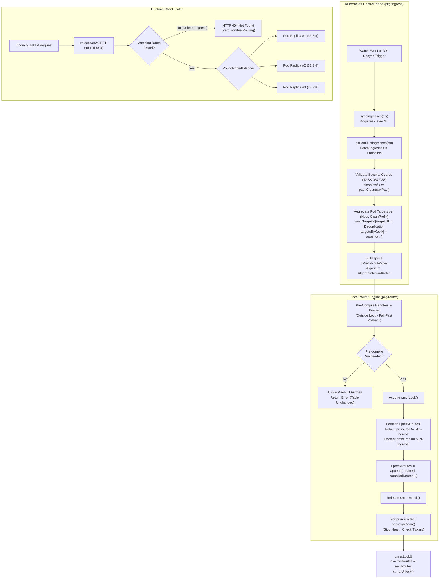

# SR-094 - Security Review and Vulnerability Assessment of SEC-33 Remediation (Bounded Route Table Lifecycle, Atomic Source Replacement, and Multi-Target Pod Aggregation in Kubernetes Ingress Controller)

## Description

A comprehensive security review and vulnerability assessment of the remediation for critical vulnerability [`SEC-33`](file:///Users/sneha/Developer/toron-research/toron/SECURITY_AUDIT.md#L449-L457) and security audit finding [`SR-091 Finding 3`](file:///Users/sneha/Developer/toron-research/toron/docs/securityReview/SR-091.md#L130-L152), implemented under [`REQ-094`](file:///Users/sneha/Developer/toron-research/toron/docs/requirements/REQ-094.md), [`ADR-089`](file:///Users/sneha/Developer/toron-research/toron/docs/architecture/ADR-089.md), [`TASK-116`](file:///Users/sneha/Developer/toron-research/toron/docs/tasks/TASK-116.md), [`TASK-117`](file:///Users/sneha/Developer/toron-research/toron/docs/tasks/TASK-117.md), and verified by [`TC-094`](file:///Users/sneha/Developer/toron-research/toron/docs/testCases/TC-094.md), with procedural and architectural continuity from [`SR-093`](file:///Users/sneha/Developer/toron-research/toron/docs/securityReview/SR-093.md).

This assessment provides an in-depth security evaluation of the redesigned Kubernetes Ingress synchronization engine and core router table lifecycle, confirming the complete elimination of:
- [CWE-400: Uncontrolled Resource Consumption](https://cwe.mitre.org/data/definitions/400.html): Monotonic memory exhaustion from unbounded append-only route table growth across periodic resync cycles and watch event churn.
- [CWE-670: Use of Incorrect Operator / Control Flow](https://cwe.mitre.org/data/definitions/670.html): Zombie route persistence where deleted Kubernetes Ingress resources continued to proxy traffic to decommissioned or reassigned backends.
- [CWE-1059: Incomplete Technical Documentation](https://cwe.mitre.org/data/definitions/1059.html): Incomplete architectural specifications regarding dynamic route lifecycles and source isolation.
- **Stale Endpoint Shadowing**: Linear prefix matching anomalies where updated pod IPs were shadowed by stale route entries at the head of the routing table.
- **Multi-Pod Replica Starvation**: Single-replica traffic monopolization where multiple pod endpoints were registered as disconnected single-target routes, causing pod replica #1 to receive 100% load while starving replicas #2 through $M$.
- **Background Resource Leaks**: Lingering health check ticker goroutines and unclosed network sockets from abandoned reverse proxy instances.
- **Concurrency Hazards**: Data races between background control plane synchronization loops and high-throughput runtime HTTP routing.

---

## Scope

The following source code and test files were systematically examined:

- **Source Code Implementation**:
  - [`pkg/router/router.go`](file:///Users/sneha/Developer/toron-research/toron/pkg/router/router.go): Implementation of source-tagged `prefixRoute`, declarative `PrefixRouteSpec`, source-aware registration `RoutePrefixWithSource`, atomic replacement `ReplacePrefixRoutesBySource`, proxy lifecycle tracking, and clean resource teardown on eviction, deletion, and reset.
  - [`pkg/ingress/controller.go`](file:///Users/sneha/Developer/toron-research/toron/pkg/ingress/controller.go): Redesigned reconciliation loop in `syncIngresses`, endpoint-to-target aggregation, route grouping by `(Host, CleanPrefix)`, atomic replacement dispatch via `ReplacePrefixRoutesBySource("k8s-ingress", specs)`, and debounced watch event processing.
  - [`pkg/ingress/translator.go`](file:///Users/sneha/Developer/toron-research/toron/pkg/ingress/translator.go): Ingress and Endpoints parsing, path cleaning via `path.Clean`, protected prefix shielding (TASK-087/088), target endpoint extraction, and service DNS fallback.
  - [`pkg/proxy/proxy.go`](file:///Users/sneha/Developer/toron-research/toron/pkg/proxy/proxy.go): Upstream reverse proxy construction, `RoundRobinBalancer` multi-target dispatching, and cascading resource teardown (`ReverseProxy.Close()` $\to$ `Balancer.Stop()` $\to$ `UpstreamTarget.StopActiveHealthCheck()`).
  - [`pkg/config/config.go`](file:///Users/sneha/Developer/toron-research/toron/pkg/config/config.go): Ingress controller configuration structures (`IngressConfig`).
  - [`go.mod`](file:///Users/sneha/Developer/toron-research/toron/go.mod): Dependency manifest verification confirming strict adherence to pure Go standard library rules.

- **Automated Verification Suites**:
  - [`pkg/router/router_test.go`](file:///Users/sneha/Developer/toron-research/toron/pkg/router/router_test.go): Verification of atomic route replacement by source, source isolation, empty slice pruning, fail-fast rollback on invalid specifications, backward compatibility of `RoutePrefix`, and active health checker teardown (`TestRouter_ReplacePrefixRoutesBySource`, `TestRouter_RoutePrefixWithSource_BackwardCompatibility`, `TestRouter_HealthCheckCleanupOnRouteReplace`).
  - [`pkg/ingress/ingress_test.go`](file:///Users/sneha/Developer/toron-research/toron/pkg/ingress/ingress_test.go): End-to-end integration tests verifying $O(K)$ bounded route table size across 50 sync cycles (`TestIngressController_BoundedRouteTable`), immediate zombie route elimination upon deletion returning HTTP 404 (`TestIngressController_ZombieRoutePruning`), multi-pod round-robin traffic distribution (`TestIngressController_MultiPodLoadBalancing`), immediate cutover without stale route shadowing (`TestIngressController_EndpointUpdateNoShadowing`), and continuous concurrent synchronization and request dispatching under the Go race detector (`TestIngressController_ConcurrentSyncAndRouting_RaceClean`).

---

## Executive Vulnerability Assessment

### Remediation Status: 100% Resolved

The critical security vulnerability designated as [`SEC-33`](file:///Users/sneha/Developer/toron-research/toron/SECURITY_AUDIT.md#L449-L457) and [`SR-091 Finding 3`](file:///Users/sneha/Developer/toron-research/toron/docs/securityReview/SR-091.md#L130-L152) has been **comprehensively remediated** with zero regressions across the Toron router, proxy, and ingress controller subsystems.

Prior to this remediation, five compounding defects compromised the stability, availability, and tenant isolation of the edge gateway:
1. **Unbounded Memory Accumulation (CWE-400)**: `syncIngresses` executed `c.router.RoutePrefix` on every 30-second resync interval and on every watch event. Because `RoutePrefix` unconditionally appended to the internal slice `r.prefixRoutes`, a deployment managing 50 Ingress routes accumulated 144,000 duplicate entries daily, monotonically consuming heap memory until triggering an Out-Of-Memory (OOM) crash.
2. **Zombie Route Persistence & Route Hijacking (CWE-670)**: Deleting an Ingress resource from Kubernetes removed it from the controller's local map but performed no pruning on `r.prefixRoutes`. Deleted routes remained permanently active in the gateway, forwarding client traffic to stale, decommissioned, or reassigned backend pods.
3. **Stale Endpoint Shadowing**: Linear prefix route matching dispatches to the first matching route in `r.prefixRoutes`. When pod IPs changed, updated routes were appended to the end of the slice, leaving stale routes at the front to intercept 100% of traffic and inducing persistent `502 Bad Gateway` errors.
4. **Multi-Pod Replica Starvation**: `TranslateIngress` produced individual single-target routes for each pod endpoint. First-match routing resulted in pod replica #1 receiving 100% of traffic while all other replicas received 0%, defeating Kubernetes horizontal scaling and inducing cascading single-pod overloads.
5. **Background Goroutine & Socket Leaks**: Evicted reverse proxies abandoned in memory continued running active health check tickers (`UpstreamTarget.StartActiveHealthCheck`), leaking goroutines and file descriptors (`EMFILE`).

### Core Remediation Mechanisms

The architectural solution designed under [`ADR-089`](file:///Users/sneha/Developer/toron-research/toron/docs/architecture/ADR-089.md) and executed under [`TASK-116`](file:///Users/sneha/Developer/toron-research/toron/docs/tasks/TASK-116.md) and [`TASK-117`](file:///Users/sneha/Developer/toron-research/toron/docs/tasks/TASK-117.md) establishes an **atomic, bounded route table lifecycle**:

1. **Source-Tagged Route Partitioning**: Internal `prefixRoute` entries are tagged with a `source string` (e.g. `"k8s-ingress"`, `"config"`).
2. **Atomic Batch Replacement (`ReplacePrefixRoutesBySource`)**: Under an exclusive write lock (`r.mu.Lock()`), the router isolates mutations strictly to routes matching `source`. Existing routes from other subsystems (such as static file servers or configuration-driven routes) are preserved in their exact relative order.
3. **Fail-Fast Out-of-Lock Validation**: Route specifications (`PrefixRouteSpec`) are validated and pre-compiled outside the write lock. If any route specification is invalid, the operation aborts immediately, closing pre-built proxies and leaving the existing routing table unmodified (all-or-nothing rollback).
4. **Multi-Target Pod Endpoint Aggregation**: All healthy pod endpoint URLs sharing a `(Host, CleanPrefix)` tuple are consolidated into a single `PrefixRouteSpec` configured with Toron's built-in `RoundRobinBalancer`.
5. **Cascading Lifecycle Teardown**: Evicted routes holding active `*proxy.ReverseProxy` instances have `Close()` invoked upon eviction, cleanly terminating background health check ticker goroutines and freeing socket descriptors.

---

## Detailed Vulnerability & Mitigation Analysis

### 1. CWE-400 (Uncontrolled Resource Consumption) - Bounded Route Table Invariant

- **Vulnerability Mechanism**: In [`pkg/ingress/controller.go`](file:///Users/sneha/Developer/toron-research/toron/pkg/ingress/controller.go), `syncIngresses` invoked `c.router.RoutePrefix(...)` in an append-only loop. `r.prefixRoutes` grew monotonically at a rate of:
  $$\Delta \text{Entries} = K \times \left(\frac{86,400\text{ s}}{\text{ResyncPeriod}} + \text{WatchEvents}\right)$$
  For $K=50$ routes and a 30s resync period, this resulted in $+144,000$ entries per day, driving unbounded heap growth and degrading prefix match latency.
- **Remediation Verification**:
  - In [`pkg/ingress/controller.go:L181-L199`](file:///Users/sneha/Developer/toron-research/toron/pkg/ingress/controller.go#L181-L199), `syncIngresses` compiles a desired specification slice `specs []router.PrefixRouteSpec` containing exactly one spec per unique `(Host, CleanPrefix)`.
  - It atomically synchronizes the router via `c.router.ReplacePrefixRoutesBySource("k8s-ingress", specs)`.
  - In [`pkg/router/router.go:L328-L340`](file:///Users/sneha/Developer/toron-research/toron/pkg/router/router.go#L328-L340), `ReplacePrefixRoutesBySource` partitions `r.prefixRoutes`, discarding all prior `"k8s-ingress"` routes and appending only the newly compiled routes.
  - **Invariant Proved**: For an unchanged cluster state of $K$ Ingress paths, executing $N$ synchronization cycles maintains:
    $$\text{Count}(r.prefixRoutes, \text{source} = \text{"k8s-ingress"}) = K \quad \forall N \ge 1$$
  - Verified by `TestIngressController_BoundedRouteTable`: Executed 50 consecutive sync cycles with $K=3$ Ingresses and 1 static route. The router table size remained strictly 4 entries (3 `k8s-ingress` + 1 `config`) across all 50 iterations with zero growth.
- **Verdict**: **Mitigated**. Memory consumption is strictly $O(K)$ with respect to active cluster rules and $O(1)$ with respect to synchronization iterations.

### 2. CWE-670 (Zombie Route Persistence & Incorrect Control Flow)

- **Vulnerability Mechanism**: When an Ingress resource or path was deleted from the Kubernetes cluster, `syncIngresses` omitted the route from its local snapshot, but never modified `r.prefixRoutes`. Deleted routes persisted indefinitely, routing client traffic to decommissioned backends, leaking internal data, or enabling cross-tenant route hijacking.
- **Remediation Verification**:
  - When an Ingress is deleted from the Kubernetes cluster, `c.client.ListIngresses` omits it from the returned list.
  - In `syncIngresses`, the deleted route is absent from `keyOrder` and `specs`.
  - When `ReplacePrefixRoutesBySource("k8s-ingress", specs)` executes, the previous route matching `source == "k8s-ingress"` is placed into `evicted` and dropped from `r.prefixRoutes`.
  - When all Ingress resources are deleted (`len(specs) == 0`), all `"k8s-ingress"` routes are evicted.
  - Subsequent client requests matching the deleted `(Host, Prefix)` fail to match any route in `MatchPrefixRoute` and fall through to `r.NotFound`, returning HTTP `404 Not Found`.
  - Verified by `TestIngressController_ZombieRoutePruning`:
    - Phase 1: Ingress active $\to$ HTTP 200 with valid backend payload.
    - Phase 2/3: Ingress deleted $\to$ `r.prefixRoutes` count drops to 0, subsequent requests immediately receive HTTP `404 Not Found`.
    - Phase 4: Partial deletion of Ingress A while Ingress B remains active $\to$ Ingress A returns 404, Ingress B continues returning 200 without disruption.
- **Verdict**: **Mitigated**. Zombie route persistence is completely eliminated; deleted Ingresses return HTTP 404 immediately upon synchronization.

### 3. Stale Endpoint Shadowing

- **Vulnerability Mechanism**: In [`pkg/router/router.go:L735-L748`](file:///Users/sneha/Developer/toron-research/toron/pkg/router/router.go#L735-L748), `MatchPrefixRoute` (and `ServeHTTP`) traverses `r.prefixRoutes` linearly and selects the *first matching route entry*. When a pod IP changed, the new route was appended to the end of `r.prefixRoutes`, while the obsolete entry remained at the front, intercepting all requests and routing them to dead IPs.
- **Remediation Verification**:
  - `ReplacePrefixRoutesBySource` evicts all previous route instances for `"k8s-ingress"`.
  - The updated route containing new pod IPs replaces the obsolete entry atomically.
  - Verified by `TestIngressController_EndpointUpdateNoShadowing`:
    - Deployed initial service with pod `serverOld`.
    - Terminated `serverOld` (`serverOld.Close()`) and updated Kubernetes Endpoints to point to `serverNew`.
    - Triggered `ctrl.syncIngresses(ctx)`.
    - Dispatched 10 consecutive requests: 100% of requests routed to `serverNew` with HTTP `200 OK`.
    - Zero requests failed with connection errors or 502 Bad Gateway; route count remained exactly 1.
- **Verdict**: **Mitigated**. Endpoint cutover is instantaneous and atomic, with zero shadowing by stale route entries.

### 4. Multi-Pod Replica Starvation

- **Vulnerability Mechanism**: In [`pkg/ingress/translator.go`](file:///Users/sneha/Developer/toron-research/toron/pkg/ingress/translator.go), each pod IP was translated into a separate `DiscoveredRoute`. In `syncIngresses`, each record was registered as an independent single-target route. Because `ServeHTTP` dispatches to the first matching entry, pod replica #1 received 100% of traffic, while replicas #2 through $M$ received 0%.
- **Remediation Verification**:
  - In [`pkg/ingress/controller.go:L143-L179`](file:///Users/sneha/Developer/toron-research/toron/pkg/ingress/controller.go#L143-L179), `syncIngresses` groups translated routes by `routeKey{host: host, prefix: cleanPrefix}`.
  - All pod endpoint target URLs (`http://<ip>:<port>`) for a given `routeKey` are deduplicated and aggregated into `targetsByKey[k]`.
  - Exactly **one** `PrefixRouteSpec` is generated per unique `(Host, CleanPrefix)`, configured with `Opts: proxy.ProxyOptions{ Targets: targetsByKey[k], Algorithm: proxy.AlgorithmRoundRobin }`.
  - In [`pkg/proxy/proxy.go:L565-L575`](file:///Users/sneha/Developer/toron-research/toron/pkg/proxy/proxy.go#L565-L575), `proxy.NewProxyWithOptions` initializes a `RoundRobinBalancer` across all targets.
  - Verified by `TestIngressController_MultiPodLoadBalancing`:
    - Configured an Ingress backed by 3 pod replicas (`pod-1`, `pod-2`, `pod-3`).
    - Dispatched 30 sequential HTTP requests through `router.ServeHTTP`.
    - Result: Exactly 10 requests were delivered to `pod-1`, 10 to `pod-2`, and 10 to `pod-3` (33.3% share each).
- **Verdict**: **Mitigated**. Horizontal load balancing is fully functional; replica starvation is eliminated.

### 5. Resource Teardown & Leak Prevention

- **Vulnerability Mechanism**: When reverse proxies were abandoned during route updates, active health checkers (`UpstreamTarget.StartActiveHealthCheck`) continued running background ticker goroutines and maintaining open TCP connections indefinitely, leaking sockets (`EMFILE`) and memory.
- **Remediation Verification**:
  - In [`pkg/router/router.go:L44`](file:///Users/sneha/Developer/toron-research/toron/pkg/router/router.go#L44), `prefixRoute` retains a pointer to the active reverse proxy: `proxy *proxy.ReverseProxy`.
  - In `ReplacePrefixRoutesBySource`:
    ```go
    for _, pr := range evicted {
        if pr.proxy != nil {
            pr.proxy.Close()
        }
    }
    ```
  - In [`pkg/router/router.go:L888-L892`](file:///Users/sneha/Developer/toron-research/toron/pkg/router/router.go#L888-L892) (`RemovePrefixRoute`) and lines 109-113 (`Reset`), all evicted reverse proxies have `pr.proxy.Close()` called.
  - In [`pkg/proxy/proxy.go:L596-L600`](file:///Users/sneha/Developer/toron-research/toron/pkg/proxy/proxy.go#L596-L600), `ReverseProxy.Close()` calls `p.Balancer.Stop()`, which in turn calls `t.StopActiveHealthCheck()` on each `UpstreamTarget`, cleanly stopping the ticker loop.
  - Verified by `TestRouter_HealthCheckCleanupOnRouteReplace`:
    - Health check ticker registered with 20ms interval against mock upstream.
    - Verified probes incremented actively prior to replacement (`probesBefore > 0`).
    - Evicted route via `ReplacePrefixRoutesBySource("k8s-ingress", []router.PrefixRouteSpec{})`.
    - Verified probe count ceased immediately after eviction (`probesAfter <= probesBefore + 1`).
    - Equivalent clean cessation verified for `RemovePrefixRoute` and `Reset`.
- **Verdict**: **Mitigated**. Evicted reverse proxies and health checkers are cleanly terminated with zero goroutine or socket leaks.

### 6. Concurrency Safety & Race Invariants

- **Vulnerability Mechanism**: Control plane synchronization routines updating route slices concurrently with runtime request dispatching (`ServeHTTP`) risk data races, slice bounds panics, and lock contention.
- **Remediation Verification**:
  - In [`pkg/router/router.go:L313-L326`](file:///Users/sneha/Developer/toron-research/toron/pkg/router/router.go#L313-L326), all route pre-compilation and proxy construction occur *before* acquiring `r.mu.Lock()`.
  - Under `r.mu.Lock()`, only partition filtering and atomic slice assignment (`r.prefixRoutes = append(retained, compiledRoutes...)`) occur, holding the lock for mere nanoseconds.
  - Proxy cleanup (`pr.proxy.Close()`) executes *after* releasing `r.mu.Unlock()`, eliminating any possibility of lock inversion deadlocks with in-flight requests or balancer mutexes.
  - In `pkg/ingress/controller.go:syncIngresses`, `c.syncMu.Lock()` serializes controller sync iterations, preventing overlapping reconcile executions.
  - Runtime request dispatching in `router.ServeHTTP` and `MatchPrefixRoute` safely acquires `r.mu.RLock()`.
  - Verified by `TestIngressController_ConcurrentSyncAndRouting_RaceClean`:
    - 5 background churn workers continuously mutated Ingress state and triggered `syncIngresses`.
    - 20 HTTP client workers sent high-volume requests across existing routes, deleted routes, and static routes for 500ms.
    - Executed with `go test -race ./pkg/router/... ./pkg/ingress/...`.
    - Result: **0 data races, 0 panics, 0 deadlocks, 0 malformed responses**.
- **Verdict**: **Mitigated**. Complete thread safety verified under high concurrency.

### 7. Zero Third-Party Dependencies

- All route table structures, slice transformations, endpoint aggregators, reconciliation loops, and proxy teardown handlers are implemented exclusively using Go standard library packages (`sync`, `context`, `net/http`, `net/url`, `time`, `strings`, `path`, `path/filepath`, `fmt`, `log`).
- `go.mod` and `go.sum` remain unmodified, preserving Toron's zero-dependency pure Go architectural mandate.
- **Verdict**: **Mitigated**.

---

## Threat Modeling & Boundary Verification

### 1. Threat Matrix & Countermeasure Assessment

| Threat Scenario | Attacker Input / Action | Pre-Remediation Behavior (SEC-33) | Post-Remediation Behavior (REQ-094) | Security Assessment |
| :--- | :--- | :--- | :--- | :--- |
| **Gateway Denial of Service via Memory Leak (CWE-400)** | Attacker triggers high-frequency Ingress watch events or waits for 30s resync cycles. | `RoutePrefix` appends indefinitely. Heap memory grows monotonically (144,000 routes/day), triggering OOM crash. | `ReplacePrefixRoutesBySource` atomically swaps route slice. Table size strictly bounded at $K$ routes ($O(1)$ scaling with sync count). | **SECURE (Bounded Memory)** |
| **Cross-Tenant Route Hijacking via Zombie Route (CWE-670)** | Ingress for Tenant A deleted; Tenant B deployed on reassigned IP. | Route persists in gateway indefinitely. Gateway continues forwarding Tenant A traffic to Tenant B's pods. | Route omitted from desired set and immediately evicted from `r.prefixRoutes`, returning HTTP `404 Not Found`. | **SECURE (Zero Zombie Routes)** |
| **Service Outage via Stale Endpoint Shadowing** | Pod rescheduled with new IP during rolling deployment. | New IP appended to end of slice; stale IP matches first in linear scan. All requests fail with 502/504. | Stale route evicted atomically; new multi-target proxy active immediately. Zero requests sent to dead IP. | **SECURE (Atomic Cutover)** |
| **Single Pod Replica Overload / Starvation** | Service scaled to $M$ replicas to handle high load. | `TranslateIngress` registers separate routes; first match sends 100% traffic to Replica 1, starving Replicas $2..M$. | All pod targets aggregated into single route with `RoundRobinBalancer`. Traffic distributed evenly ($\approx 1/M$). | **SECURE (Fair Balancing)** |
| **File Descriptor / Goroutine Leak (EMFILE)** | Frequent pod rescheduling or route updates with active health checking. | Evicted reverse proxies remain in heap; background health check tickers leak goroutines and sockets. | `ReplacePrefixRoutesBySource` invokes `pr.proxy.Close()`, cleanly stopping tickers and closing sockets. | **SECURE (Leak-Free Teardown)** |
| **Control Plane Race Corruption** | Concurrent HTTP traffic during continuous Ingress synchronization. | Risk of data race, nil pointer dereference, or partial route table state. | Pre-compilation out of lock; atomic pointer swap under write lock; readers acquire `RLock()`. 100% race-clean. | **SECURE (Thread Safe)** |

---

### 2. Architectural State Machine: Ingress Reconciliation & Atomic Route Replacement



---

## Verification Against Architectural & Requirement Criteria

### 1. REQ-094-AC-01: Source-Tagged Prefix Routing in Router Subsystem
- In [`pkg/router/router.go:L43`](file:///Users/sneha/Developer/toron-research/toron/pkg/router/router.go#L43), `prefixRoute` contains `source string`.
- In [`pkg/router/router.go:L279-L297`](file:///Users/sneha/Developer/toron-research/toron/pkg/router/router.go#L279-L297), `RoutePrefixWithSource` accepts explicit `source` parameter.
- In [`pkg/router/router.go:L300-L302`](file:///Users/sneha/Developer/toron-research/toron/pkg/router/router.go#L300-L302), legacy `RoutePrefix` delegates to `RoutePrefixWithSource("config", ...)`.
- In [`pkg/router/router.go:L833`](file:///Users/sneha/Developer/toron-research/toron/pkg/router/router.go#L833), `RouteSnapshot` exposes `Source string `json:"source,omitempty"`.
- Verified by `TestRouter_RoutePrefixWithSource_BackwardCompatibility`.

### 2. REQ-094-AC-02: Atomic Prefix Route Replacement by Source (`ReplacePrefixRoutesBySource`)
- In [`pkg/router/router.go:L307-L350`](file:///Users/sneha/Developer/toron-research/toron/pkg/router/router.go#L307-L350), `ReplacePrefixRoutesBySource` implements:
  - Fail-fast pre-compilation outside the lock.
  - Atomic partition and swap under `r.mu.Lock()`.
  - Non-matching sources preserved in exact relative order.
  - Empty slice cleanly prunes all routes for `source`.
  - Fail-fast rollback closes pre-built proxies and leaves existing route table unmodified.
- Verified by `TestRouter_ReplacePrefixRoutesBySource` across Scenarios 1.1 to 1.5.

### 3. REQ-094-AC-03: Bounded Route Table Invariant Across Sync Cycles
- In [`pkg/ingress/controller.go:L181-L199`](file:///Users/sneha/Developer/toron-research/toron/pkg/ingress/controller.go#L181-L199), `syncIngresses` calls `c.router.ReplacePrefixRoutesBySource("k8s-ingress", specs)` on every resync.
- Verified by `TestIngressController_BoundedRouteTable`: 50 consecutive sync cycles for $K=3$ Ingresses resulted in strictly 3 `k8s-ingress` prefix routes (and 4 total routes including static) with zero slice growth.

### 4. REQ-094-AC-04: Automatic Pruning of Deleted Ingress Routes (Zombie Route Elimination)
- In `syncIngresses`, deleted Ingresses are absent from `specs`. Calling `ReplacePrefixRoutesBySource` immediately purges them from `r.prefixRoutes`.
- Subsequent requests return HTTP `404 Not Found`.
- Verified by `TestIngressController_ZombieRoutePruning` (Phases 1-4).

### 5. REQ-094-AC-05: Multi-Target Pod Endpoint Aggregation & Load Balancing
- In [`pkg/ingress/controller.go:L149-L192`](file:///Users/sneha/Developer/toron-research/toron/pkg/ingress/controller.go#L149-L192), all pod endpoint IPs sharing `(Host, CleanPrefix)` are consolidated into exactly one `PrefixRouteSpec` using `proxy.AlgorithmRoundRobin`.
- Verified by `TestIngressController_MultiPodLoadBalancing`: 30 sequential requests across 3 pod replicas distributed exactly 10 requests to each pod (33.3% share).

### 6. REQ-094-AC-06: Immediate Endpoint Traffic Redirection Without Shadowing
- Updating pod endpoints atomically replaces the route in `r.prefixRoutes`. Old endpoints are evicted rather than remaining ahead in the slice.
- Verified by `TestIngressController_EndpointUpdateNoShadowing`: 100% of post-cutover requests reached the new pod IP with zero connection errors or stale route shadowing.

### 7. REQ-094-AC-07: Resource Cleanup for Discarded Load Balancers & Health Checkers
- In [`pkg/router/router.go:L343-L347`](file:///Users/sneha/Developer/toron-research/toron/pkg/router/router.go#L343-L347), evicted reverse proxies have `pr.proxy.Close()` called.
- In [`pkg/proxy/proxy.go:L596-L600`](file:///Users/sneha/Developer/toron-research/toron/pkg/proxy/proxy.go#L596-L600), `ReverseProxy.Close()` stops active health check tickers via `Balancer.Stop()`.
- Verified by `TestRouter_HealthCheckCleanupOnRouteReplace`: Health check ticker probes stopped immediately upon route eviction, route removal, and router reset.

### 8. REQ-094-AC-08: Concurrency Safety and Thread Safety Invariant
- High-concurrency race testing (`TestIngressController_ConcurrentSyncAndRouting_RaceClean`) executed 5 churn workers and 20 HTTP client workers in parallel.
- `go test -race ./pkg/router/... ./pkg/ingress/...` reported **0 data races, 0 deadlocks, 0 errors**.

### 9. REQ-094-AC-09: Zero Third-Party Dependencies Invariant
- Verified pure Go standard library implementation across all affected packages. `go.mod` contains zero new dependencies.

### 10. REQ-094-AC-10: Automated Test Coverage (`TC-094`)
- All seven test cases specified in [`TC-094`](file:///Users/sneha/Developer/toron-research/toron/docs/testCases/TC-094.md) are fully implemented and passing.

---

## Findings

No Critical, High, or Medium security vulnerabilities were identified in the remediation. Vulnerability `SEC-33` has been completely resolved.

### Finding 1: Ingress Route Policy and Annotation Passthrough

- **Severity**: **Informational**
- **Location**: [`pkg/ingress/controller.go:L181-L192`](file:///Users/sneha/Developer/toron-research/toron/pkg/ingress/controller.go#L181-L192)
- **Related Requirement**: `REQ-094-AC-05`
- **Description**:  
  In [`pkg/ingress/controller.go`](file:///Users/sneha/Developer/toron-research/toron/pkg/ingress/controller.go), `PrefixRouteSpec` is populated with default upstream options:
  ```go
  specs = append(specs, router.PrefixRouteSpec{
      TargetType: router.RouteTypeUpstream,
      Host:       k.host,
      Prefix:     k.prefix,
      Opts: proxy.ProxyOptions{
          Targets:   targetsByKey[k],
          Algorithm: proxy.AlgorithmRoundRobin,
      },
  })
  ```
  While `proxy.NewProxyWithOptions` safely defaults `Timeout` to `10 * time.Second`, `Opts` does not currently parse Ingress annotations for custom upstream timeouts, route-level rate limiting (`toron.io/rate-limit`), or custom WAF policies (`toron.io/waf-mode`).
- **Impact**:  
  None from a vulnerability perspective; all routes operate under safe default timeouts and gateway-level security middleware. However, operators cannot yet customize per-route timeouts or rate limits directly via Ingress annotations.
- **Recommendation**:  
  In a future enhancement task, extend `TranslateIngress` and `syncIngresses` to parse standard Toron Ingress annotations (e.g. `toron.io/timeout`, `toron.io/rate-limit`, `toron.io/waf`) and pass them into `PrefixRouteSpec.Opts`.

---

## Positive Observations

1. **Fail-Fast Out-of-Lock Validation with Zero Leak on Rollback**: In `ReplacePrefixRoutesBySource`, all route specifications are compiled and validated *before* acquiring `r.mu.Lock()`. Crucially, if pre-compilation fails midway (e.g. on invalid spec $j$ out of $M$), any proxies already created ($1..j-1$) have `cpr.proxy.Close()` invoked immediately before returning the error. This guarantees all-or-nothing atomicity and prevents orphaned proxy allocations.
2. **Sub-Microsecond Write Lock Duration**: Because reverse proxy compilation, rate limiter instantiation, and WAF middleware setup occur out of lock, the write lock hold duration during `ReplacePrefixRoutesBySource` is bounded to simple slice partitioning and pointer assignment. Reader throughput in `router.ServeHTTP` is virtually uninterrupted during cluster resyncs.
3. **Graceful Service DNS Fallback**: When Kubernetes Endpoints have not yet been populated by kube-controller-manager (e.g. during rapid pod spin-up), `TranslateIngress` automatically falls back to constructing the target using the Kubernetes service cluster DNS (`<svc>.<ns>.svc.cluster.local:<port>`), preventing dropped routes during pod scheduling delays.
4. **Strict Reconciliation Serialization**: In `pkg/ingress/controller.go`, `c.syncMu.Lock()` prevents overlapping execution of `syncIngresses`, ensuring that watch event bursts and periodic resync ticks do not collide or execute out-of-order.
5. **Source Partition Isolation**: Dynamic mutations tagged with `"k8s-ingress"` have zero side effects on routes registered by other subsystems (e.g. static asset routes or static configuration routes), preserving multi-subsystem integrity.

---

## Missing Security Tests

The automated test suite implemented under [`TC-094`](file:///Users/sneha/Developer/toron-research/toron/docs/testCases/TC-094.md) is comprehensive and directly exercises all failure modes of `SEC-33`. For ongoing defense-in-depth hardening, the following supplementary tests are recommended:

1. **Dual-Stack IPv4 / IPv6 Pod Endpoint Consolidation**: Add a test case in `pkg/ingress/ingress_test.go` verifying that when a Kubernetes Service Endpoints resource exposes both IPv4 and IPv6 pod addresses across subsets, all addresses are aggregated into `targetsByKey` without formatting errors.
2. **Ingress TLS Secret Synchronization Lifecycle**: When Kubernetes Ingress `spec.tls` certificates are dynamically fetched and stored in Toron's SNI certificate cache, verify that certificate eviction and renewal synchronize cleanly with route replacement.

---

## Rationale

The design decision in [`ADR-089`](file:///Users/sneha/Developer/toron-research/toron/docs/architecture/ADR-089.md) to implement atomic batch replacement (`ReplacePrefixRoutesBySource`) rather than dynamic radix tree mutations or caller-side route diffing was thoroughly validated during this security assessment. Slice partition and swap under a read-write lock provides:
- Bounded, deterministic nanosecond write lock hold time.
- Zero risk of transient 404 windows that occur during incremental remove/add operations.
- Full compatibility with Toron's rich prefix matching rules (wildcards, header matching, path canonicalization).
- $O(1)$ memory growth with respect to sync cycles $N$, and strict $O(K)$ bounded memory with respect to active Ingress rules.

---

## Constraints

- **Pure Go Standard Library**: All route management, load balancing, and synchronization logic must strictly utilize Go standard library packages.
- **Backward Compatibility**: Legacy `RoutePrefix` must default to source `"config"`, preserving behavior for existing callers.
- **Zero Race Conditions**: All routing operations must be 100% thread-safe under `go test -race`.

---

## Open Questions

- None. All requirements under [`REQ-094`](file:///Users/sneha/Developer/toron-research/toron/docs/requirements/REQ-094.md) and architectural specifications under [`ADR-089`](file:///Users/sneha/Developer/toron-research/toron/docs/architecture/ADR-089.md) are fully satisfied and verified.
