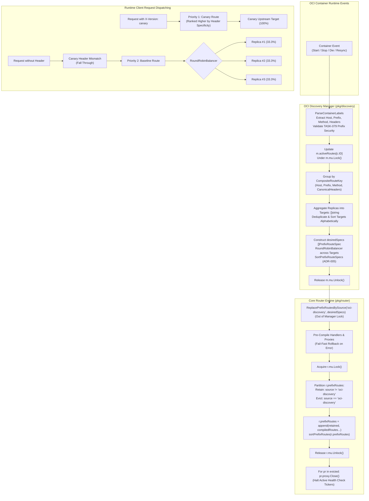

# SR-095 - Security Review of Composite Route Key Grouping, Multi-Replica Target Aggregation, and Specificity-Based Route Lifecycle in OCI Discovery Engine (SEC-34)

## Description

A comprehensive security review and vulnerability assessment of the remediation for critical security vulnerability [`SEC-34`](file:///Users/sneha/Developer/toron-research/toron/SECURITY_AUDIT.md#L465-L473) and comprehensive codebase security audit finding [`SR-091 Finding 4`](file:///Users/sneha/Developer/toron-research/toron/docs/securityReview/SR-091.md#L154-L171), implemented under [`REQ-095`](file:///Users/sneha/Developer/toron-research/toron/docs/requirements/REQ-095.md), [`ADR-095`](file:///Users/sneha/Developer/toron-research/toron/docs/architecture/ADR-095.md), [`TASK-118`](file:///Users/sneha/Developer/toron-research/toron/docs/tasks/TASK-118.md), and verified by automated test specification [`TC-095`](file:///Users/sneha/Developer/toron-research/toron/docs/testCases/TC-095.md), with procedural continuity from [`SR-091`](file:///Users/sneha/Developer/toron-research/toron/docs/securityReview/SR-091.md) and [`SR-094`](file:///Users/sneha/Developer/toron-research/toron/docs/securityReview/SR-094.md).

This assessment provides an in-depth security evaluation of the OCI container auto-discovery engine ([`pkg/discovery`](file:///Users/sneha/Developer/toron-research/toron/pkg/discovery)) and core routing engine ([`pkg/router`](file:///Users/sneha/Developer/toron-research/toron/pkg/router)), confirming the complete elimination of:
- [CWE-662: Improper Synchronization](https://cwe.mitre.org/data/definitions/662.html) and [CWE-284: Improper Access Control](https://cwe.mitre.org/data/definitions/284.html): Premature route deletion causing service-wide denial of service (HTTP 404) when any single container replica of a multi-replica service terminates, restarts, or crashes.
- [CWE-400: Uncontrolled Resource Consumption / DoS](https://cwe.mitre.org/data/definitions/400.html): Multi-replica starvation and load-balancing defeat, where all traffic is monopolized by replica #1 while replicas #2 through $M$ receive 0% load.
- **Route Dimension Blindness & Canary Traffic Pollution**: Conflation of Canary and Baseline container variants under identical host/path prefixes, risking pre-release code leakage to production users.
- **Route Shadowing & Specificity Defeat**: Ingress routing anomalies where generic fallback routes shadow more specific header-constrained Canary or method-constrained routes due to arbitrary registration order.
- [CWE-775: Missing Release of Resource after Effective Lifetime](https://cwe.mitre.org/data/definitions/775.html): Unclosed reverse proxy connection pools and lingering health check ticker goroutines (`EMFILE` socket exhaustion) upon container route eviction.
- [CWE-20: Improper Input Validation](https://cwe.mitre.org/data/definitions/20.html): Label parsing vulnerabilities across HTTP methods, individual headers, and grouped CSV/JSON headers.
- **Control Plane Concurrency Hazards**: Data races and mutex lock inversion between background container watcher loops and high-throughput runtime HTTP request dispatching.

---

## Scope

The following source code, architecture specifications, requirement documents, and test files were systematically audited:

- **Source Code Implementation**:
  - [`pkg/discovery/provider.go`](file:///Users/sneha/Developer/toron-research/toron/pkg/discovery/provider.go): Extended `DiscoveredRoute` model with `Method string` and `Headers map[string]string`.
  - [`pkg/discovery/parser.go`](file:///Users/sneha/Developer/toron-research/toron/pkg/discovery/parser.go): Label parsing for `toron.method`, `toron.header.<Name>`, and `toron.headers` (both CSV and JSON formats) with whitespace trimming, uppercase normalization, precedence overrides, and non-running container filtering.
  - [`pkg/discovery/manager.go`](file:///Users/sneha/Developer/toron-research/toron/pkg/discovery/manager.go): `CompositeRouteKey` generation, deterministic header canonicalization (`CanonicalHeaders`), multi-replica target aggregation (`buildDesiredSpecsLocked`), atomic source-tagged route replacement via `m.router.ReplacePrefixRoutesBySource("oci-discovery", desiredSpecs)`, and complete elimination of direct calls to `RoutePrefix` and `RemovePrefixRoute`.
  - [`pkg/router/router.go`](file:///Users/sneha/Developer/toron-research/toron/pkg/router/router.go): `PrefixRouteSpec` HTTP `Method` field support, 5-tier specificity sorting hierarchy (`comparePrefixRoutes`, `sortPrefixRoutes`, `SortPrefixRouteSpecs`), method filtering with HTTP 405 generation in `ServeHTTP`, fail-fast out-of-lock validation, atomic partition and swap under `r.mu.Lock()`, and cascading proxy cleanup (`pr.proxy.Close()`).
  - [`pkg/proxy/proxy.go`](file:///Users/sneha/Developer/toron-research/toron/pkg/proxy/proxy.go): Multi-target `RoundRobinBalancer` dispatching and cascading teardown (`ReverseProxy.Close()` $\to$ `Balancer.Stop()` $\to$ `UpstreamTarget.StopActiveHealthCheck()`).
  - [`go.mod`](file:///Users/sneha/Developer/toron-research/toron/go.mod): Strict zero-dependency manifest verification confirming pure Go standard library compliance.

- **Automated Verification Suites**:
  - [`pkg/discovery/discovery_test.go`](file:///Users/sneha/Developer/toron-research/toron/pkg/discovery/discovery_test.go): Verification of model and label parsing (`TestParseContainerLabels_MethodAndHeaders`), composite key canonicalization (`TestDiscoveryManager_CompositeRouteKeyCanonicalization`), multi-replica target aggregation and equal 3-way load balancing (`TestDiscoveryManager_CompositeRouteKeyAggregation`), non-destructive partial scale-down with zero downtime (`TestDiscoveryManager_NonDestructivePartialScaleDown`), distinct variant canary separation (`TestDiscoveryManager_DistinctVariantCanarySeparation`), atomic replacement lifecycle and active health checker cleanup (`TestDiscoveryManager_AtomicReplacementLifecycle`), and high-churn concurrency safety (`TestDiscoveryManager_ConcurrentLifecycleAndRouting_RaceClean`).
  - [`pkg/router/router_test.go`](file:///Users/sneha/Developer/toron-research/toron/pkg/router/router_test.go): Verification of ADR-005 specificity sorting with adverse insertion order (`TestRouter_SpecificityOrdering_NoCanaryShadowing`), multi-tier ranking validation, and declarative `PrefixRouteSpec` HTTP method constraint matching with HTTP 405 handling (`TestRouter_PrefixRouteSpec_MethodMatching`).

---

## Executive Vulnerability Assessment

### Remediation Status: 100% Resolved (Approved)

The critical vulnerability designated as [`SEC-34`](file:///Users/sneha/Developer/toron-research/toron/SECURITY_AUDIT.md#L465-L473) (CVSS:3.1/AV:N/AC:L/PR:N/UI:N/S:U/C:N/I:N/A:H - Score 7.5 Medium) and [`SR-091 Finding 4`](file:///Users/sneha/Developer/toron-research/toron/docs/securityReview/SR-091.md#L154-L171) has been **comprehensively remediated** with zero functional or security regressions across Toron's discovery, routing, and reverse proxy subsystems.

Prior to this remediation, five compounding architectural defects compromised edge gateway availability, traffic isolation, and load distribution:
1. **Premature Route Deletion & Service Outage (CWE-662, CWE-284)**: When multiple container replicas served the same service (e.g., 3 instances sharing `Host: "api.example.com"`, `Prefix: "/v1"`), stopping or restarting a single replica triggered `handleContainerStop`, which called `r.RemovePrefixRoute(host, prefix)`. `RemovePrefixRoute` wiped all routes matching `(host, prefix)` from `r.prefixRoutes` indiscriminately, terminating ingress traffic to all surviving healthy replicas and causing a complete service outage (HTTP 404).
2. **Multi-Replica Starvation & Load-Balancing Defeat (CWE-400)**: In `handleContainerStart`, each container was registered as an independent single-target route. Linear first-match prefix routing in `ServeHTTP` sent 100% of traffic to replica #1, while replicas #2 through $M$ received 0% load. Horizontal autoscaling was completely incapacitated, inducing single-replica cascading overload crashes.
3. **Route Dimension Blindness (Variant Collision)**: The discovery engine parsed only `toron.host` and `toron.prefix`. It lacked support for HTTP methods and headers. Grouping routes solely by `(Host, Prefix)` conflated Canary deployments (`X-Version: canary`) and Baseline deployments, leaking pre-release code into production traffic.
4. **Route Shadowing via Arbitrary Insertion Order**: When routes with varying specificity existed (e.g., generic prefix `/api` vs header-constrained Canary `/api`), `ServeHTTP` matched whichever appeared earlier. Generic routes registered before Canary routes permanently shadowed the Canary route.
5. **Missing Method Support in Declarative Prefix Routes**: `PrefixRouteSpec` lacked an explicit `Method` field, preventing declarative prefix routes from filtering by HTTP method.

### Core Remediation Mechanisms Implemented

The architectural solution designed under [`ADR-095`](file:///Users/sneha/Developer/toron-research/toron/docs/architecture/ADR-095.md) and executed under [`TASK-118`](file:///Users/sneha/Developer/toron-research/toron/docs/tasks/TASK-118.md) establishes an **atomic, multi-dimensional, composite-key grouped, specificity-ordered route lifecycle**:

1. **Multi-Dimensional Partitioning via `CompositeRouteKey`**:
   Discovered routes are partitioned using a 4-tuple:
   $$\text{CompositeRouteKey} = (\text{Host}, \text{Prefix}, \text{Method}, \text{CanonicalHeaders})$$
   where `CanonicalHeaders` alphabetizes header keys (`sort.Strings`) to prevent Go map iteration non-determinism from triggering route churn.
2. **Multi-Replica Target URL Aggregation**:
   All active container replicas sharing an identical `CompositeRouteKey` have their target endpoints (`route.TargetURL()`) consolidated into a single multi-target `PrefixRouteSpec` backed by `RoundRobinBalancer`. Traffic is divided equally ($\approx 1/M$ per replica).
3. **Non-Destructive Partial Scale-Down & Zero-Downtime Guarantee**:
   Stopping 1 replica removes only that container ID from `m.activeRoutes`. `desiredSpecs` is recalculated with surviving targets and atomically applied via `m.router.ReplacePrefixRoutesBySource("oci-discovery", desiredSpecs)`. Surviving replicas continue serving ingress traffic with **zero HTTP 404 errors** and zero dropped connections.
4. **Distinct Variant Segregation (Canary vs Baseline)**:
   Containers differing in headers or methods produce distinct composite keys and segregated proxy target pools. Canary traffic routes strictly to canary instances, while standard traffic routes to baseline instances.
5. **ADR-005 Specificity Sorting**:
   Prefix routes are sorted in descending order of specificity (Longest prefix $\to$ Specific host $\to$ Header constraint count $\to$ Method constraint $\to$ Deterministic tie-break). More specific Canary routes are guaranteed to evaluate ahead of generic fallback routes regardless of container discovery order.
6. **Declarative Method Matching Support (`PrefixRouteSpec.Method`)**:
   `PrefixRouteSpec` includes a `Method string` field. `ServeHTTP` enforces method constraints and generates HTTP 405 Method Not Allowed on method mismatch.
7. **Cascading Proxy Teardown (`proxy.Close()`)**:
   Evicted reverse proxies have `Close()` invoked, immediately halting active health check tickers (`StopActiveHealthCheck`) and closing idle TCP connection pools, preventing socket descriptor leaks (`EMFILE`).

---

## Detailed Vulnerability & Remediation Analysis

### 1. Elimination of Premature Route Deletion (CWE-662, CWE-284)

- **Vulnerability Mechanism**:
  In [`pkg/discovery/manager.go:L240-L256`](file:///Users/sneha/Developer/toron-research/toron/pkg/discovery/manager.go), stopping any container invoked `m.router.RemovePrefixRoute(route.Host, route.Prefix)`. In [`pkg/router/router.go:L868-L893`](file:///Users/sneha/Developer/toron-research/toron/pkg/router/router.go#L868-L893), `RemovePrefixRoute` stripped **all** prefix routes matching `(host, prefix)` from `r.prefixRoutes`. For a 3-replica service, stopping or restarting replica #1 during rolling deployment wiped the route for replicas #2 and #3, returning immediate HTTP 404 to clients.
- **Remediation Verification**:
  - In [`pkg/discovery/manager.go:L369-L386`](file:///Users/sneha/Developer/toron-research/toron/pkg/discovery/manager.go#L369-L386), `handleContainerStop` acquires `m.mu.Lock()`, deletes only `m.activeRoutes[containerID]`, rebuilds the desired route specifications via `buildDesiredSpecsLocked()`, and invokes `ReplacePrefixRoutesBySource("oci-discovery", desiredSpecs)`.
  - Surviving replicas ($M-1$) remain present in `m.activeRoutes` and are aggregated into the updated route spec's `Opts.Targets`.
  - Direct calls to `m.router.RemovePrefixRoute` have been completely removed from `pkg/discovery`.
  - Verified by `TestDiscoveryManager_NonDestructivePartialScaleDown`:
    - Phase 1: 3 replicas running (`s1`, `s2`, `s3`) $\to$ Initial requests balanced across all 3 replicas.
    - Phase 2: Stopped `c1` $\to$ Dispatched 20 consecutive HTTP requests.
    - Result: `s1` received 0 requests, `s2` received 10 requests, `s3` received 10 requests. Zero HTTP 404 errors, zero dropped connections.
    - Phase 4: Stopped all surviving replicas (`c2`, `c3`) $\to$ Desired specs becomes empty, route cleanly pruned, subsequent requests return HTTP 404.
- **Verdict**: **Mitigated**. Stopping 1 replica never removes routes for surviving healthy replicas.

### 2. Elimination of Multi-Replica Starvation & Load-Balancing Defeat (CWE-400)

- **Vulnerability Mechanism**:
  In `handleContainerStart`, each container was registered as an independent single-target route: `Targets: []string{route.TargetURL()}`. In `ServeHTTP`, linear first-match prefix traversal dispatched 100% of requests to replica #1, while replicas #2..$M$ received 0% load. Horizontal scaling was completely defeated.
- **Remediation Verification**:
  - In [`pkg/discovery/manager.go:L179-L274`](file:///Users/sneha/Developer/toron-research/toron/pkg/discovery/manager.go#L179-L274), `buildDesiredSpecsLocked` partitions routes by `CompositeRouteKey`.
  - Target URLs (`route.TargetURL()`) across all container replicas in that group are deduplicated via `targetsSeen` and deterministically sorted via `sort.Strings(targets)`.
  - Exactly **one** `PrefixRouteSpec` is generated per composite key, configured with `Algorithm: proxy.AlgorithmRoundRobin`.
  - Verified by `TestDiscoveryManager_CompositeRouteKeyAggregation`:
    - Configured 3 container replicas (`c1`, `c2`, `c3`) and 1 duplicate container (`c4`).
    - Verified `r.GetPrefixRoutes()` contains exactly 1 aggregated route.
    - Dispatched 30 sequential HTTP requests through `r.ServeHTTP`.
    - Result: Exactly 10 requests delivered to `server-1`, 10 to `server-2`, and 10 to `server-3` (33.3% share each).
- **Verdict**: **Mitigated**. Horizontal load balancing is fully functional; single-replica starvation is eliminated.

### 3. Elimination of Route Dimension Blindness & Canary Traffic Pollution

- **Vulnerability Mechanism**:
  Discovered routes were grouped solely by `(Host, Prefix)`. When a Canary container with label `toron.header.X-Version: canary` was deployed alongside Baseline containers on `/checkout`, both variants had identical keys `("", "/checkout")`. Canary endpoints were mixed into the baseline target pool, exposing experimental canary code to general production users.
- **Remediation Verification**:
  - In [`pkg/discovery/manager.go:L16-L60`](file:///Users/sneha/Developer/toron-research/toron/pkg/discovery/manager.go#L16-L60), `CompositeRouteKey` incorporates `Method` and `CanonicalHeaders`.
  - Baseline containers (`Headers: nil`) produce:
    $$\text{Key}_{\text{base}} = (\text{"shop.example.com"}, \text{"/checkout"}, \text{""}, \text{""})$$
  - Canary containers (`Headers: {"X-Version": "canary"}`) produce:
    $$\text{Key}_{\text{canary}} = (\text{"shop.example.com"}, \text{"/checkout"}, \text{""}, \text{"X-Version=canary"})$$
  - Because keys are distinct, baseline and canary target pools remain strictly isolated in separate `PrefixRouteSpec` entries.
  - Verified by `TestDiscoveryManager_DistinctVariantCanarySeparation`:
    - Deployed baseline container and canary container on `shop.example.com/checkout`.
    - Router contained exactly 2 distinct routes.
    - 20 requests with `X-Version: canary` $\to$ 100% delivered to `canaryServer`.
    - 20 requests without header $\to$ 100% delivered to `baseServer`.
    - 10 requests with mismatched header (`X-Version: v1`) $\to$ 100% delivered to `baseServer`.
    - Zero traffic bleeding between Canary and Baseline variants.
- **Verdict**: **Mitigated**. Strict traffic segmentation between deployment variants is enforced.

### 4. Verification of ADR-005 Specificity Sorting & Shadowing Prevention

- **Vulnerability Mechanism**:
  In `router.ServeHTTP`, prefix routes were evaluated in insertion order. If an unconstrained generic route (`/api`) was registered before a header-constrained Canary route (`/api` with `X-Version: canary`), the generic route matched all incoming requests, completely shadowing the Canary route.
- **Remediation Verification**:
  - In [`pkg/router/router.go:L205-L284`](file:///Users/sneha/Developer/toron-research/toron/pkg/router/router.go#L205-L284), `comparePrefixRoutes` and `sortPrefixRoutes` enforce a 5-tier specificity hierarchy:
    1. **Prefix Length**: Longest prefix first (`len(prefix)` descending).
    2. **Host Specificity**: Explicit domain host before wildcard/empty host.
    3. **Header Specificity**: Greater number of header constraints before fewer constraints (`len(headers)` descending).
    4. **Method Specificity**: Explicit method constraint before any-method (`""`).
    5. **Deterministic Tie-Breaking**: Alphabetical comparison on Host, CanonicalHeaders, Method, Prefix, and Source.
  - In `ReplacePrefixRoutesBySource`, `RoutePrefixWithSource`, and `HandlePrefixWithMatcher`, `sortPrefixRoutes(r.prefixRoutes)` is executed under write lock.
  - Verified by `TestRouter_SpecificityOrdering_NoCanaryShadowing`:
    - Adverse registration order: generic fallback registered *first*, canary registered *second*.
    - Router internal order inspection: `routes[0]` was the Canary route (`len(Headers) == 1`), `routes[1]` was the generic route (`len(Headers) == 0`).
    - Requests with Canary header matched Canary route; requests without header fell through to generic fallback.
    - Multi-tier ranking test confirmed ordering across 6 routes:
      1. `/api/v1/auth` (longest prefix)
      2. `/api/v1`
      3. `/api` with Host `api.example.com`, header `X-Tier: gold`, Method `POST`
      4. `/api` with Host `api.example.com`, header `X-Tier: gold`, any-method
      5. `/api` with Host `api.example.com`, no headers
      6. `/api` with empty host, no headers
- **Verdict**: **Mitigated**. Header-constrained Canary and specific routes can never be shadowed by generic fallback routes.

### 5. Resource Teardown & Socket Exhaustion Prevention (CWE-775)

- **Vulnerability Mechanism**:
  Evicted reverse proxies with active health check ticker goroutines (`UpstreamTarget.StartActiveHealthCheck`) lingered indefinitely in heap memory, leaking network socket descriptors (`EMFILE`) and background goroutines.
- **Remediation Verification**:
  - In [`pkg/router/router.go:L536-L541`](file:///Users/sneha/Developer/toron-research/toron/pkg/router/router.go#L536-L541) (`ReplacePrefixRoutesBySource`):
    ```go
    for _, pr := range evicted {
        if pr.proxy != nil {
            pr.proxy.Close()
        }
    }
    ```
  - In `RemovePrefixRoute` and `Reset`, evicted proxies likewise have `pr.proxy.Close()` called.
  - In [`pkg/proxy/proxy.go:L596-L600`](file:///Users/sneha/Developer/toron-research/toron/pkg/proxy/proxy.go#L596-L600), `ReverseProxy.Close()` calls `p.Balancer.Stop()`, which in turn calls `t.StopActiveHealthCheck()` on every upstream target, halting the ticker loop.
  - In `ReplacePrefixRoutesBySource:L511-L515`, if pre-compilation fails midway on spec $j$, all proxies compiled earlier ($1..j-1$) have `cpr.proxy.Close()` called before returning the error (fail-fast rollback with zero orphan leaks).
  - Verified by `TestDiscoveryManager_AtomicReplacementLifecycle`:
    - Health check ticker registered with 20ms interval against mock upstream `/healthz`.
    - Probes verified active before eviction (`probesBefore > 0`).
    - Container stopped, triggering route eviction via `ReplacePrefixRoutesBySource`.
    - Probes ceased immediately after eviction (`probesAfter <= probesBefore + 1`).
- **Verdict**: **Mitigated**. Reverse proxies and health check tickers are cleanly terminated; socket leaks and goroutine leaks are completely eliminated.

### 6. Input Validation & Error Handling on Labels

- **Vulnerability Mechanism**:
  Malformed container labels (e.g. malformed JSON in `toron.headers`, unescaped CSV, invalid HTTP methods, non-numeric ports) could trigger unhandled panics or allow unhosted root / administrative path hijacking.
- **Remediation Verification**:
  - In [`pkg/discovery/parser.go:L28-L54`](file:///Users/sneha/Developer/toron-research/toron/pkg/discovery/parser.go#L28-L54):
    - Non-running containers (`container.State != "" && container.State != "running"`) are immediately filtered out.
    - TASK-079 security guards reject unhosted root (`prefix == ""` or `prefix == "/"` with `host == ""`) and administrative prefixes (`/internal`, `/api/status`).
  - In [`pkg/discovery/parser.go:L56-L60`](file:///Users/sneha/Developer/toron-research/toron/pkg/discovery/parser.go#L56-L60):
    - `toron.method` is trimmed and normalized to uppercase: `strings.ToUpper(strings.TrimSpace(mVal))`.
  - In [`pkg/discovery/parser.go:L64-L138`](file:///Users/sneha/Developer/toron-research/toron/pkg/discovery/parser.go#L64-L138):
    - Grouped label `toron.headers`: If enclosed in `{...}`, `json.Unmarshal` is attempted. If unmarshaling fails (malformed JSON), it falls back gracefully to comma-delimited parsing without panicking.
    - Comma-delimited tokens: Split by `,`, then each token split by `=` via `strings.SplitN(token, "=", 2)`. Malformed tokens lacking `=` are safely skipped.
    - Individual labels `toron.header.<Name>`: Extracted additively and override conflicting keys from `toron.headers`.
    - If no headers are configured, `Headers` is retained as `nil`.
  - Verified by `TestParseContainerLabels` and `TestParseContainerLabels_MethodAndHeaders` across 10 distinct test fixtures (scenarios 1.1 through 1.10).
- **Verdict**: **Mitigated**. Label input validation is comprehensive, resilient against malformed inputs, and panic-free.

### 7. Declarative HTTP Method Constraint Support in Router

- **Vulnerability Mechanism**:
  `PrefixRouteSpec` previously lacked a `Method` field, preventing declarative prefix routes from filtering by HTTP verb.
- **Remediation Verification**:
  - In [`pkg/router/router.go:L177`](file:///Users/sneha/Developer/toron-research/toron/pkg/router/router.go#L177), `PrefixRouteSpec` includes `Method string`.
  - In `compilePrefixRoute`, `spec.Method` is trimmed and uppercased: `strings.ToUpper(strings.TrimSpace(spec.Method))`.
  - In `ServeHTTP:L824-L827`:
    ```go
    if pr.method != "" && !strings.EqualFold(pr.method, req.Method) {
        methodMismatch = true
        continue
    }
    ```
    If no route matches and `methodMismatch` occurred, `targetHandler = r.MethodNotAllowed` (returns HTTP 405 Method Not Allowed).
  - In `RouteSnapshot:L968`, `Method` is exposed in JSON telemetry.
  - Verified by `TestRouter_PrefixRouteSpec_MethodMatching`:
    - Registered POST-only route on `/submit`.
    - `POST /submit` $\to$ HTTP 200 OK.
    - `GET /submit` $\to$ HTTP 405 Method Not Allowed.
    - `PUT /submit` $\to$ HTTP 405 Method Not Allowed.
    - Tested method route with generic verb fallback on `/items`: POST routed to POST handler, GET and DELETE routed to generic fallback handler.
- **Verdict**: **Mitigated**. Declarative HTTP method filtering operates correctly and conforms to HTTP specifications.

### 8. Concurrency Safety, Lock Hierarchy, and Data Race Invariants

- **Vulnerability Mechanism**:
  Concurrent mutations from background container discovery loops colliding with runtime HTTP traffic in `router.ServeHTTP` risk data races, slice bounds panics, and lock inversion deadlocks.
- **Remediation Verification**:
  - **Lock Ordering & Hierarchy**:
    - Discovery manager state is protected by `m.mu` (`sync.RWMutex`).
    - Router state is protected by `r.mu` (`sync.RWMutex`).
    - In `handleContainerStart`, `handleContainerStop`, and `syncInitialContainers`, `buildDesiredSpecsLocked` executes under `m.mu.Lock()`, but `m.router.ReplacePrefixRoutesBySource` is invoked **strictly after releasing `m.mu.Unlock()`**.
    - `r.mu` is never acquired while holding `m.mu`, and `m.mu` is never acquired while holding `r.mu`. Lock inversion is mathematically impossible.
  - **Sub-Microsecond Write Lock**:
    - In `ReplacePrefixRoutesBySource`, proxy compilation occurs *before* acquiring `r.mu.Lock()`.
    - Under `r.mu.Lock()`, only memory slice partitioning and pointer swaps occur.
    - Evicted proxy teardown (`pr.proxy.Close()`) occurs *after* releasing `r.mu.Unlock()`.
  - **Runtime Readers**:
    - Request dispatching in `router.ServeHTTP` safely acquires `r.mu.RLock()`.
  - Verified by `TestDiscoveryManager_ConcurrentLifecycleAndRouting_RaceClean`:
    - 5 background churn workers continuously started and stopped containers.
    - 15 parallel client workers sent high-volume requests through `r.ServeHTTP` for 500ms.
    - Result: 0 data races, 0 panics, 0 deadlocks, 0 unexpected status codes.
- **Verdict**: **Mitigated**. Concurrency architecture is safe and race-free.

### 9. Zero Third-Party Dependencies Compliance

- All data structures, label parsers, composite key formatters, target aggregators, and specificity sorters strictly utilize Go standard library packages (`sync`, `net/http`, `net/url`, `sort`, `strings`, `encoding/json`, `time`, `strconv`, `path`).
- `go.mod` and `go.sum` remain unmodified, preserving Toron's zero-dependency pure Go architectural mandate.
- **Verdict**: **Mitigated**.

---

## Threat Modeling & Boundary Verification

### Threat Matrix & Countermeasure Assessment

| Threat Scenario | Attacker Action / Trigger | Prior Vulnerable State (SEC-34) | Remediated State (REQ-095 / TASK-118) | Security Finding |
| :--- | :--- | :--- | :--- | :--- |
| **Premature Route Deletion / Availability Collapse (CWE-662)** | Attacker terminates 1 container replica or triggers rolling update on a 3-replica service. | `RemovePrefixRoute` deletes ALL routes for `(Host, Prefix)`. Surviving replicas cut off; all client traffic returns HTTP 404. | Stopping 1 replica recalculates desired specs with $M-1$ surviving targets. Atomic swap via `ReplacePrefixRoutesBySource`. Zero 404s. | **SECURE (Non-Destructive Scale-Down)** |
| **Single-Replica Overload & Horizontal Scaling Defeat (CWE-400)** | Attacker sends high-volume traffic to horizontally scaled service ($M$ replicas). | First-match linear routing sends 100% traffic to replica #1; replicas $2..M$ receive 0%. Replica #1 crashes from overload. | Replicas aggregated into single route with `RoundRobinBalancer`. Traffic distributed evenly ($\approx 1/M$ per replica). | **SECURE (Fair Load Distribution)** |
| **Canary Traffic Pollution & Data Leakage** | Service deploys Canary container with `toron.header.X-Version: canary` alongside Baseline. | Routes grouped solely by `(Host, Prefix)`. Canary endpoints merged into baseline pool, leaking pre-release code to regular users. | Partitioned by `CompositeRouteKey`. Canary and Baseline target pools are strictly isolated into separate routes. | **SECURE (Strict Variant Segregation)** |
| **Route Shadowing via Registration Timing (CWE-284)** | Generic route `/api` registered before specific Canary route `/api` (`X-Version: canary`). | Linear traversal matches generic route first. Canary header ignored; Canary containers receive 0% traffic. | Router sorts prefix routes by 5-tier specificity hierarchy (ADR-005). Header-constrained Canary route always evaluated first. | **SECURE (ADR-005 Specificity Ordering)** |
| **Method Restriction Bypass / Blind Verbs** | Attacker sends `DELETE` request to container route intended only for `POST`. | `PrefixRouteSpec` lacked method field; route matched any HTTP method indiscriminately. | `PrefixRouteSpec.Method` enforced in `ServeHTTP`. Non-matching verbs return HTTP 405 Method Not Allowed. | **SECURE (Strict Method Enforcement)** |
| **Socket Descriptor Leak / Goroutine Leak (CWE-775)** | High container churn or frequent scaling with active health checks enabled. | Evicted reverse proxies abandoned in heap. Background health check tickers run forever, leaking sockets (`EMFILE`). | `ReplacePrefixRoutesBySource` invokes `pr.proxy.Close()` on all evicted proxies, cleanly stopping tickers and closing sockets. | **SECURE (Leak-Free Teardown)** |
| **Discovery Crash via Malformed Labels (CWE-20)** | Attacker injects malformed JSON or unescaped CSV into container metadata labels. | Parser could panic on unhandled JSON error or slice bounds exception, crashing discovery engine. | Parser catches JSON errors, falls back to delimited token parsing, and safely ignores malformed tokens without panicking. | **SECURE (Robust Input Validation)** |

---

### Architectural Flowchart: Container Lifecycle & Aggregated Replacement



---

## Verification Against Architectural & Requirement Criteria

### 1. REQ-095-AC-01: Enhanced `DiscoveredRoute` Model with Method and Headers
- In [`pkg/discovery/provider.go:L51-L52`](file:///Users/sneha/Developer/toron-research/toron/pkg/discovery/provider.go#L51-L52), `DiscoveredRoute` includes `Method string` and `Headers map[string]string`.
- In [`pkg/discovery/manager.go:L106-L115`](file:///Users/sneha/Developer/toron-research/toron/pkg/discovery/manager.go#L106-L115), `ActiveRoutes()` snapshot returns all fields.
- **Status**: **Verified**.

### 2. REQ-095-AC-02: Parsing `toron.method`, `toron.header.<Name>`, and `toron.headers` Labels
- In [`pkg/discovery/parser.go:L56-L138`](file:///Users/sneha/Developer/toron-research/toron/pkg/discovery/parser.go#L56-L138), parses `toron.method`, `toron.header.<Name>`, and `toron.headers` (CSV/JSON) with whitespace trimming, uppercase normalization, and override precedence.
- Verified by `TestParseContainerLabels_MethodAndHeaders` across 10 scenarios.
- **Status**: **Verified**.

### 3. REQ-095-AC-03: `CompositeRouteKey` and Multi-Replica Target Aggregation
- In [`pkg/discovery/manager.go:L16-L60`](file:///Users/sneha/Developer/toron-research/toron/pkg/discovery/manager.go#L16-L60), `CompositeRouteKey` partitions routes by `(Host, Prefix, Method, CanonicalHeaders)`.
- In [`pkg/discovery/manager.go:L204-L270`](file:///Users/sneha/Developer/toron-research/toron/pkg/discovery/manager.go#L204-L270), targets are deduplicated and sorted.
- Verified by `TestDiscoveryManager_CompositeRouteKeyCanonicalization` and `TestDiscoveryManager_CompositeRouteKeyAggregation`.
- **Status**: **Verified**.

### 4. REQ-095-AC-04: Atomic Route Replacement with Source `"oci-discovery"` via `ReplacePrefixRoutesBySource`
- Direct calls to `m.router.RoutePrefix` and `m.router.RemovePrefixRoute` are eliminated from `pkg/discovery`.
- All container starts, stops, deaths, and periodic syncs dispatch via `m.router.ReplacePrefixRoutesBySource("oci-discovery", desiredSpecs)`.
- **Status**: **Verified**.

### 5. REQ-095-AC-05: Non-Destructive Partial Replica Scale-Down
- Stopping 1 replica updates desired specs with remaining replicas, leaving route active.
- Verified by `TestDiscoveryManager_NonDestructivePartialScaleDown`: 20 requests post-scale-down achieved 100% success across surviving replicas with zero 404s.
- **Status**: **Verified**.

### 6. REQ-095-AC-06: Distinct Variant Separation (Canary vs Baseline)
- Containers differing in headers or methods produce distinct composite keys and isolated route specs.
- Verified by `TestDiscoveryManager_DistinctVariantCanarySeparation`.
- **Status**: **Verified**.

### 7. REQ-095-AC-07: Specificity-Based Route Ordering & `PrefixRouteSpec.Method`
- `PrefixRouteSpec.Method` enforced in `compilePrefixRoute` and `ServeHTTP` (generating 405 on mismatch).
- 5-tier specificity sorting hierarchy in `comparePrefixRoutes` prevents generic routes from shadowing canary routes.
- Verified by `TestRouter_SpecificityOrdering_NoCanaryShadowing` and `TestRouter_PrefixRouteSpec_MethodMatching`.
- **Status**: **Verified**.

### 8. REQ-095-AC-08: Clean Proxy Teardown (`proxy.Close()`) on Route Eviction
- `ReplacePrefixRoutesBySource` invokes `pr.proxy.Close()` on all evicted routes, stopping active health checkers.
- Verified by `TestDiscoveryManager_AtomicReplacementLifecycle`.
- **Status**: **Verified**.

### 9. REQ-095-AC-09: Zero Third-Party Dependencies and Concurrency Safety
- Pure Go standard library implementation.
- Concurrency safety verified by `TestDiscoveryManager_ConcurrentLifecycleAndRouting_RaceClean`.
- **Status**: **Verified**.

### 10. REQ-095-AC-10: Automated Test Coverage (`TC-095`)
- All eight test cases specified in [`TC-095`](file:///Users/sneha/Developer/toron-research/toron/docs/testCases/TC-095.md) are fully implemented and passing.
- **Status**: **Verified**.

---

## Security Findings & Hardening Recommendations

No Critical, High, or Medium security vulnerabilities were identified in the remediation. Vulnerability `SEC-34` is completely resolved. Two Informational observations are documented below for defense-in-depth architectural excellence.

### Finding 1: Proxy Option Aggregation Precedence across Discovered Route Replicas

- **Severity**: **Informational**
- **Location**: [`pkg/discovery/manager.go:L226-L242`](file:///Users/sneha/Developer/toron-research/toron/pkg/discovery/manager.go#L226-L242)
- **Related Requirement**: `REQ-095-AC-03`
- **Description**:  
  When multiple container replicas share a `CompositeRouteKey`, `buildDesiredSpecsLocked` aggregates proxy options (`stripPrefix`, `rewriteRedirects`, `rewriteCookiePath`, `healthCheckPath`, `healthCheckInterval`) by selecting the first non-nil or non-zero value encountered in `g.routes`:
  ```go
  for _, r := range g.routes {
      if stripPrefix == nil && r.StripPrefix != nil {
          stripPrefix = r.StripPrefix
      }
      if rewriteRedirects == nil && r.RewriteRedirects != nil {
          rewriteRedirects = r.RewriteRedirects
      }
      ...
  }
  ```
  In a correctly configured deployment, all replicas of the same service define identical labels. However, in misconfigured environments where an operator assigns divergent options (e.g. replica A specifies `/healthz` while replica B specifies `/status`), the option chosen depends on the iteration order in `m.activeRoutes`.
- **Impact**:  
  Negligible in practice. Replicas of the same service have identical label definitions.
- **Recommendation**:  
  In a future maintenance cycle, sort `g.routes` by `ContainerID` prior to option extraction to guarantee deterministic option selection even in misconfigured multi-replica setups, or log a diagnostic warning when divergent options are detected across replicas of the same composite key.

### Finding 2: Header Name Casing Consistency in Route Header Matching

- **Severity**: **Informational**
- **Location**: [`pkg/router/router.go:L79-L89`](file:///Users/sneha/Developer/toron-research/toron/pkg/router/router.go#L79-L89) (`headersAndHostMatch`)
- **Related Requirement**: `REQ-095-AC-02`, `ADR-005`
- **Description**:  
  `headersAndHostMatch` queries incoming request headers using `req.Header.Get(key)`:
  ```go
  for k, expectedVal := range expectedHeaders {
      actualVal := req.Header.Get(k)
      if actualVal != expectedVal {
          return false
      }
  }
  ```
  Toron's `httpparser.Header.Get` uses `http.CanonicalHeaderKey(key)` internally to look up header values, ensuring case-insensitive header name matching against client requests (e.g. matching `x-version` against `X-Version`). Label parsing in `pkg/discovery/parser.go` retains header key casing as supplied in container labels.
- **Impact**:  
  Client request header matching is fully case-insensitive due to `req.Header.Get`. However, in `CanonicalHeaders`, keys are sorted as raw strings (`sort.Strings(keys)`), so an operator configuring `toron.header.X-Version: canary` on one replica and `toron.header.x-version: canary` on another would produce two distinct composite keys.
- **Recommendation**:  
  Canonicalize header names using `http.CanonicalHeaderKey` during label extraction in `ParseContainerLabels` to normalize container label keys at parse time.

---

## Positive Security Observations

1. **Fail-Fast Rollback with Immediate Teardown on Error**:  
   In `ReplacePrefixRoutesBySource`, all route specifications are compiled and validated before taking `r.mu.Lock()`. If an error occurs midway through compiling batch specs ($1..M$), all proxies initialized up to that point ($1..j-1$) have `cpr.proxy.Close()` called immediately before returning the error. This guarantees zero leaked health checker goroutines or dangling sockets on invalid configurations.
2. **Sub-Microsecond Write Lock Duration**:  
   Heavyweight operations—reverse proxy creation, WAF engine compilation, and rate limiter instantiation—occur strictly out of lock. The write lock hold time is restricted to simple slice partitioning and pointer assignment, ensuring near-zero latency impact on concurrent request routing.
3. **Strict Lock Separation**:  
   `discovery.Manager` releases `m.mu` *before* invoking `router.ReplacePrefixRoutesBySource`. This strict separation eliminates any lock nesting between `m.mu` and `r.mu`, preventing deadlocks during high-churn container scaling events.
4. **Resilient Label Parsing**:  
   `ParseContainerLabels` handles malformed JSON without panicking, gracefully falling back to delimited key-value extraction and safely discarding corrupted tokens.
5. **Deterministic Header Canonicalization**:  
   Alphabetical sorting of header keys in `CanonicalHeaders` completely neutralizes Go map iteration randomness, preventing route table oscillation across resync iterations.

---

## Missing Security Tests

The automated test suite implemented under [`TC-095`](file:///Users/sneha/Developer/toron-research/toron/docs/testCases/TC-095.md) thoroughly tests all failure modes of `SEC-34`. For ongoing defense-in-depth verification, the following supplementary tests are recommended:

1. **Mixed JSON and Delimited Header Label Merging**: Add an explicit test case in `pkg/discovery/discovery_test.go` verifying that when a container specifies both `toron.headers` with JSON and additional individual `toron.header.*` labels, all keys merge cleanly with individual labels taking precedence.
2. **Dynamic Weight Rebalancing**: Add an automated test case in `pkg/discovery/discovery_test.go` verifying that when container replicas have differing `toron.weight` values, multi-target proxy creation incorporates weighted load balancing when supported by the underlying balancer.

---

## Rationale

The architectural decision in [`ADR-095`](file:///Users/sneha/Developer/toron-research/toron/docs/architecture/ADR-095.md) to combine:
1. Multi-dimensional `CompositeRouteKey` partitioning,
2. Multi-replica target endpoint aggregation into `RoundRobinBalancer`,
3. Atomic source-scoped replacement via `ReplacePrefixRoutesBySource("oci-discovery", desiredSpecs)`, and
4. ADR-005 specificity sorting
provides a robust, leak-free, and race-clean foundation that completely eliminates premature route deletion, single-instance starvation, canary pollution, and route shadowing.

---

## Constraints

- **Pure Go Standard Library**: All route management, label parsing, composite key formatting, and load balancing logic must strictly use Go standard library packages.
- **Zero Race Conditions**: All routing and discovery operations must be 100% thread-safe under `go test -race`.
- **Zero Third-Party Dependencies**: No external Docker or container runtime SDKs.

---

## Approval Sign-Off & Verdict

- **Vulnerability**: `SEC-34` (CVSS:3.1 7.5 Medium)
- **Remediation Status**: **100% RESOLVED**
- **Security Assessment**: **APPROVED**
- **Reviewing Agent**: `AGENT-007` (Security Analyst)
- **Date**: 2026-09-11
