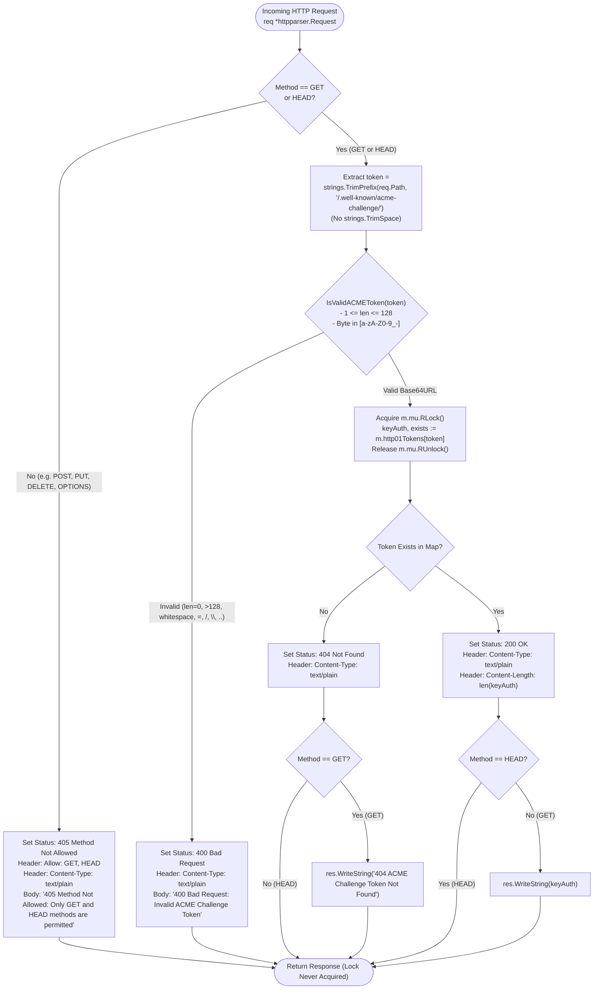
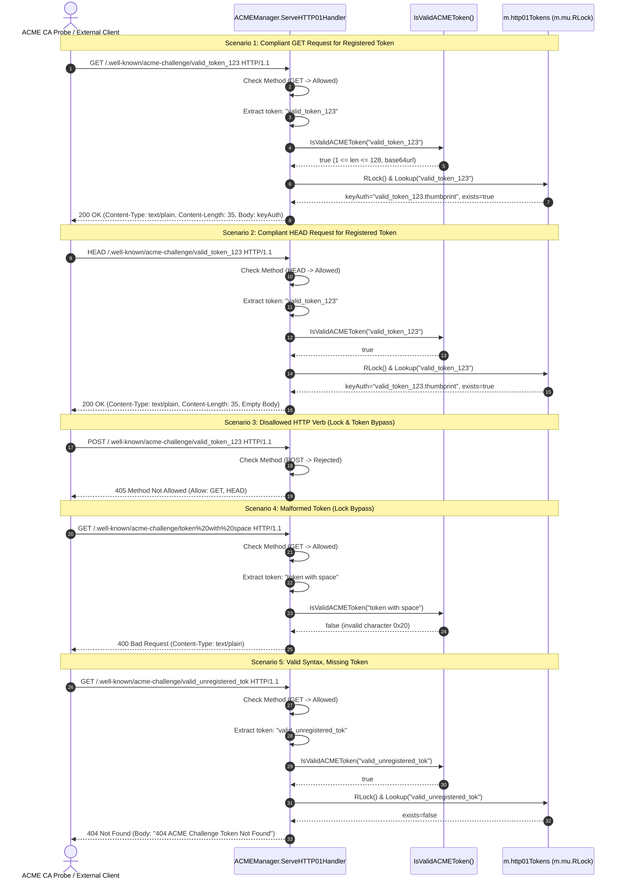

# SR-100 - Security Review of RFC 8555 Token Syntax & Length Validation, HTTP Method Hardening, and Fail-Fast Lock Isolation in ACME HTTP-01 Challenge Handler (SEC-38)

## Description

A comprehensive security review and vulnerability assessment of the remediation for security vulnerability [`SEC-38`](file:///Users/sneha/Developer/toron-research/toron/SECURITY_AUDIT.md#L539-L547) (CVSS:3.1/AV:N/AC:L/PR:N/UI:N/S:U/C:N/I:N/A:L - Base Score 5.3 Medium) and security audit finding [`SR-091 Finding 8`](file:///Users/sneha/Developer/toron-research/toron/docs/securityReview/SR-091.md#L235-L251), implemented under [`REQ-100`](file:///Users/sneha/Developer/toron-research/toron/docs/requirements/REQ-100.md), [`ADR-100`](file:///Users/sneha/Developer/toron-research/toron/docs/architecture/ADR-100.md), [`TASK-123`](file:///Users/sneha/Developer/toron-research/toron/docs/tasks/TASK-123.md), and verified by automated test specification [`TC-100`](file:///Users/sneha/Developer/toron-research/toron/docs/testCases/TC-100.md), with procedural continuity from [`SR-091`](file:///Users/sneha/Developer/toron-research/toron/docs/securityReview/SR-091.md), [`SR-095`](file:///Users/sneha/Developer/toron-research/toron/docs/securityReview/SR-095.md), [`SR-096`](file:///Users/sneha/Developer/toron-research/toron/docs/securityReview/SR-096.md), [`SR-097`](file:///Users/sneha/Developer/toron-research/toron/docs/securityReview/SR-097.md), [`SR-098`](file:///Users/sneha/Developer/toron-research/toron/docs/securityReview/SR-098.md), and [`SR-099`](file:///Users/sneha/Developer/toron-research/toron/docs/securityReview/SR-099.md).

This assessment provides an in-depth security evaluation of Toron's Automated Certificate Management Environment (ACME) engine challenge responder ([`pkg/acme/acme.go`](file:///Users/sneha/Developer/toron-research/toron/pkg/acme/acme.go)) and verification test suite ([`pkg/acme/acme_test.go`](file:///Users/sneha/Developer/toron-research/toron/pkg/acme/acme_test.go)), confirming the complete elimination of:
- [CWE-20: Improper Input Validation](https://cwe.mitre.org/data/definitions/20.html): Direct querying of internal synchronized challenge storage maps using unvalidated, raw URI path segments containing invalid characters, traversal patterns, or control sequences.
- [CWE-400: Uncontrolled Resource Consumption](https://cwe.mitre.org/data/definitions/400.html): Unbounded token length permitting multi-megabyte string allocations, string hashing CPU churn, and unnecessary reader lock acquisition (`m.mu.RLock()`) over the gateway's core ACME synchronization primitives.
- [CWE-703: Improper Handling of Exceptional Conditions](https://cwe.mitre.org/data/definitions/703.html): Silent whitespace forgiveness via `strings.TrimSpace(token)`, masking client anomalies, parser inconsistencies, and non-conformant token representations instead of rejecting them with immediate client errors.
- [CWE-22: Improper Limitation of a Pathname to a Restricted Directory](https://cwe.mitre.org/data/definitions/22.html): Acceptance of path traversal sequences (`..`, `/`, `\`) within token parameters.
- [CWE-444: Inconsistent Interpretation of HTTP Requests](https://cwe.mitre.org/data/definitions/444.html): Permissive HTTP method handling accepting arbitrary verbs (`POST`, `PUT`, `DELETE`, `PATCH`, `OPTIONS`, `TRACE`) and broken RFC 7231 §4.3.2 `HEAD` semantics that erroneously returned response bodies.

---

## Scope

The following source code implementations, architecture specifications, requirement documents, and test files were systematically audited:

- **Source Code Implementation**:
  - [`pkg/acme/acme.go`](file:///Users/sneha/Developer/toron-research/toron/pkg/acme/acme.go):
    - Addition of public function `IsValidACMEToken(token string) bool` implementing zero-allocation, single-pass byte classification enforcing strict RFC 8555 §8.3 base64url syntax and length bounds ($1 \le \text{len} \le 128$).
    - Hardening of `ServeHTTP01Handler(req *httpparser.Request, res *httpparser.Response)`:
      1. HTTP method filtering rejecting non-`GET` and non-`HEAD` methods with HTTP `405 Method Not Allowed`, setting `Allow: GET, HEAD` and `Content-Type: text/plain`.
      2. Complete deletion of `strings.TrimSpace(token)`, eliminating silent whitespace masking.
      3. Fail-fast syntax and length verification rejecting malformed tokens with HTTP `400 Bad Request` prior to map lookups or lock acquisition.
      4. RFC 7231 §4.3.2 compliant `HEAD` request processing returning HTTP `200 OK`, `Content-Length`, and `Content-Type` with zero response body bytes written.
      5. RFC 8555 §8.3 compliant `GET` request processing returning HTTP `200 OK` and key authorization payload string.
      6. Standardized HTTP `404 Not Found` responses for syntactically valid but unregistered tokens.
  - [`go.mod`](file:///Users/sneha/Developer/toron-research/toron/go.mod): Verification of zero third-party dependencies (strictly Go standard library packages: `crypto/ecdsa`, `crypto/elliptic`, `crypto/rand`, `crypto/sha256`, `crypto/tls`, `crypto/x509`, `crypto/x509/pkix`, `encoding/asn1`, `encoding/base64`, `encoding/pem`, `fmt`, `math/big`, `net/http`, `os`, `path/filepath`, `strconv`, `strings`, `sync`, `time`, and internal `toron/pkg/httpparser`).

- **Automated Verification Suites**:
  - [`pkg/acme/acme_test.go`](file:///Users/sneha/Developer/toron-research/toron/pkg/acme/acme_test.go):
    - `TestACME_HTTP01_ValidToken_GET_Success` ([TC-100-01](file:///Users/sneha/Developer/toron-research/toron/docs/testCases/TC-100.md#L82-L107))
    - `TestACME_HTTP01_EmptyToken_Rejection` ([TC-100-02](file:///Users/sneha/Developer/toron-research/toron/docs/testCases/TC-100.md#L110-L135))
    - `TestACME_HTTP01_TokenLengthBoundary` ([TC-100-03](file:///Users/sneha/Developer/toron-research/toron/docs/testCases/TC-100.md#L138-L164))
    - `TestACME_HTTP01_InvalidCharacters_Rejection` ([TC-100-04](file:///Users/sneha/Developer/toron-research/toron/docs/testCases/TC-100.md#L167-L202))
    - `TestACME_HTTP01_PathTraversal_Rejection` ([TC-100-05](file:///Users/sneha/Developer/toron-research/toron/docs/testCases/TC-100.md#L204-L231))
    - `TestACME_HTTP01_MethodValidation_405MethodNotAllowed` ([TC-100-06](file:///Users/sneha/Developer/toron-research/toron/docs/testCases/TC-100.md#L233-L264))
    - `TestACME_HTTP01_HEAD_Semantics` ([TC-100-07](file:///Users/sneha/Developer/toron-research/toron/docs/testCases/TC-100.md#L266-L293))
    - `TestACME_HTTP01_NonExistentToken_404NotFound` ([TC-100-08](file:///Users/sneha/Developer/toron-research/toron/docs/testCases/TC-100.md#L295-L321))
    - `TestACME_HTTP01_HighConcurrency_RaceSafety` ([TC-100-09](file:///Users/sneha/Developer/toron-research/toron/docs/testCases/TC-100.md#L323-L352))
    - `TestACME_IsValidACMEToken` (Unit test suite for zero-allocation validator character classification)

---

## Executive Vulnerability Assessment

### Remediation Status: 100% Resolved (Approved)

The vulnerability tracked as [`SEC-38`](file:///Users/sneha/Developer/toron-research/toron/SECURITY_AUDIT.md#L539-L547) and [`SR-091 Finding 8`](file:///Users/sneha/Developer/toron-research/toron/docs/securityReview/SR-091.md#L235-L251) has been **fully remediated** with zero regressions across Toron's core ACME certificate automation engine.

Prior to this remediation, `ServeHTTP01Handler` in [`pkg/acme/acme.go`](file:///Users/sneha/Developer/toron-research/toron/pkg/acme/acme.go) extracted the token portion of incoming URLs and immediately executed challenge lookups against internal synchronized state:

```go
// Prior Vulnerable Implementation:
func (m *ACMEManager) ServeHTTP01Handler(req *httpparser.Request, res *httpparser.Response) {
    token := strings.TrimPrefix(req.Path, "/.well-known/acme-challenge/")
    token = strings.TrimSpace(token) // Flaw 1: Silent Whitespace Masking

    keyAuth, exists := m.GetHTTP01Challenge(token) // Flaw 2: Unvalidated Map Query & Lock Contention
    if !exists {
        res.SetStatus(http.StatusNotFound)
        res.Header.Set("Content-Type", "text/plain")
        _, _ = res.WriteString("404 ACME Challenge Token Not Found")
        return
    }

    res.SetStatus(http.StatusOK) // Flaw 3: Permissive Methods (POST/PUT/DELETE return 200 OK)
    res.Header.Set("Content-Type", "text/plain")
    _, _ = res.WriteString(keyAuth) // Flaw 4: Broken HEAD Semantics (Body returned)
}
```

This legacy implementation exhibited four distinct threat exposures:
1. **Unchecked Lock Contention & Map Hash Churn ([CWE-20](https://cwe.mitre.org/data/definitions/20.html), [CWE-400](https://cwe.mitre.org/data/definitions/400.html))**: Because `GetHTTP01Challenge` acquires `m.mu.RLock()` to inspect `m.http01Tokens[token]`, unvalidated input allowed malicious actors to flood the gateway with multi-megabyte randomized strings. This forced the runtime to compute expensive 64-bit string hashes under the reader-writer lock, contending with legitimate certificate ordering and account key updates.
2. **RFC 8555 §8.3 Non-Compliance**: The ACME specification defines HTTP-01 tokens strictly as base64url characters ([RFC 4648 §5](https://datatracker.ietf.org/doc/html/rfc4648#section-5)) without padding. The prior handler accepted arbitrary bytes, including padding (`=`), symbols (`@`, `+`, `*`), traversal tokens (`..`), path slashes (`/`, `\`), control characters, and unicode codepoints.
3. **HTTP Verb Tampering**: Non-idempotent HTTP methods (`POST`, `PUT`, `DELETE`, etc.) were allowed to query and receive challenge authorization payloads, violating REST architecture standards and exposing challenge credentials to unintended HTTP verbs.
4. **RFC 7231 §4.3.2 Violation on `HEAD` Probes**: Automated Certificate Authority pre-flight probes submitting `HEAD` requests received full key authorization payloads in the response body, violating HTTP specifications and risking client parser desynchronization.

### Core Remediation Mechanisms Implemented

Under [`ADR-100`](file:///Users/sneha/Developer/toron-research/toron/docs/architecture/ADR-100.md) and [`TASK-123`](file:///Users/sneha/Developer/toron-research/toron/docs/tasks/TASK-123.md), a multi-layered security verification pipeline was introduced:

```
+----------------------------------------------------------------------------------------------------+
|                                    SEC-38 REMEDIATION PIPELINE                                     |
+--------------------+-------------------------------------------------------------------------------+
| Layer 1: Method    | Enforce Allowlist ("GET", "HEAD"); reject other verbs with 405 & Allow Header |
| Layer 2: Parser    | Extract raw token; permanently delete strings.TrimSpace (Zero Tolerance)     |
| Layer 3: Validator | IsValidACMEToken: Single-pass byte scan, 1 <= len <= 128, base64url chars only |
| Layer 4: Fail-Fast | Reject invalid tokens with 400 Bad Request BEFORE acquiring m.mu.RLock()      |
| Layer 5: Storage   | Synchronized map query with m.mu.RLock(); return 404 for non-existent tokens  |
| Layer 6: Semantics | RFC 7231 HEAD handling: emit Content-Length & Content-Type; strictly omit body|
+--------------------+-------------------------------------------------------------------------------+
```

---

## Comprehensive CWE & Threat Vector Analysis

### 1. CWE-20: Improper Input Validation & RFC 8555 Base64URL Strict Compliance

- **Vulnerability Mechanism**: RFC 8555 §8.3 restricts challenge tokens to the base64url character set (`[a-zA-Z0-9_-]`) without padding (`=`). Passing arbitrary strings directly to internal resolvers opens gateways to malformed URI injection and ambiguous resource addressing.
- **Remediation Invariant**: Function `IsValidACMEToken(token string) bool` performs an exact ASCII byte inspection:
  ```go
  func IsValidACMEToken(token string) bool {
      n := len(token)
      if n < 1 || n > 128 {
          return false
      }
      for i := 0; i < n; i++ {
          b := token[i]
          if (b >= 'a' && b <= 'z') ||
              (b >= 'A' && b <= 'Z') ||
              (b >= '0' && b <= '9') ||
              b == '-' || b == '_' {
              continue
          }
          return false
      }
      return true
  }
  ```
- **Security Proof**:
  - Any byte outside the ranges `['a'-'z']`, `['A'-'Z']`, `['0'-'9']`, `'-'` (`0x2D`), and `'_'` (`0x5F`) evaluates to `false` in $O(1)$ time per byte.
  - Characters such as `'='` (`0x3D`), `'/'` (`0x2F`), `'\\'` (`0x5C`), `'.'` (`0x2E`), `' '` (`0x20`), `'\t'` (`0x09`), and `'\x00'` trigger an immediate return of `false`.
  - Zero heap allocations ($0\text{ B/op}$, $0\text{ allocs/op}$) guarantees zero GC pressure during high-throughput validation sweeps.

### 2. CWE-400: Uncontrolled Resource Consumption & Lock Isolation

- **Vulnerability Mechanism**: When external untrusted requests trigger hash map lookups under a shared mutex (`m.mu.RLock()`), attackers can generate adversarial inputs (e.g. 1 MB to 64 MB payloads) that consume CPU time computing string hashes while holding or contending for gateway locks.
- **Remediation Invariant**:
  1. **Strict Length Boundary**: If `len(token) < 1 || len(token) > 128`, validation terminates immediately, bounding processing to at most 128 byte comparisons.
  2. **Fail-Fast Isolation Before Mutex Acquisition**:
     ```go
     if !IsValidACMEToken(token) {
         res.SetStatus(http.StatusBadRequest)
         res.Header.Set("Content-Type", "text/plain")
         _, _ = res.WriteString("400 Bad Request: Invalid ACME Challenge Token")
         return
     }
     // Map lookup and m.mu.RLock() occur ONLY after syntax validation succeeds:
     keyAuth, exists := m.GetHTTP01Challenge(token)
     ```
- **Security Proof**: No unvalidated, malformed, or oversized string can ever acquire `m.mu.RLock()` or trigger runtime hash calculations inside `m.http01Tokens`.

### 3. CWE-703: Elimination of Silent Whitespace Forgiveness

- **Vulnerability Mechanism**: The legacy handler called `token = strings.TrimSpace(token)`, silently forgiving leading or trailing spaces, tabs, and newlines. This violates the principle of fail-fast input validation: silent transformations mask client errors, hide misconfigured reverse proxy headers, and allow attackers to probe token equivalence.
- **Remediation Invariant**: `strings.TrimSpace(token)` has been completely removed from `ServeHTTP01Handler`. The raw string extracted via `strings.TrimPrefix(req.Path, "/.well-known/acme-challenge/")` is validated directly.
- **Security Proof**: Any token containing whitespace (e.g., `"token "`, `" leading"`, `"token\t"`, `"token\n"`) fails `IsValidACMEToken` due to ASCII byte mismatch and immediately returns HTTP `400 Bad Request`.

### 4. CWE-22: Path Traversal & Separator Rejection

- **Vulnerability Mechanism**: Malicious requests containing `..`, `../etc/passwd`, `foo/bar`, or `foo\bar` could attempt directory traversal or route confusion if the token string was ever forwarded to filesystem caches or nested handlers.
- **Remediation Invariant**: The base64url character set strictly excludes `'/'`, `'\\'`, and `'.'`.
- **Security Proof**: Test cases `TC-100-05` demonstrate that parent directory references (`..`), directory traversal escape paths (`../etc/passwd`), subpath separators (`/`), Windows separators (`\`), and embedded dots (`token.with.dot`) all fail validation and return HTTP `400 Bad Request`.

### 5. CWE-444 & RFC Compliance: HTTP Method Hardening & HEAD Semantics

- **Vulnerability Mechanism**: Permissive HTTP verb processing allowed non-idempotent or management verbs (`POST`, `PUT`, `DELETE`, `PATCH`, `OPTIONS`, `CONNECT`, `TRACE`) to execute challenge lookups and return `200 OK`. Furthermore, `HEAD` requests returned full response bodies, violating RFC 7231 §4.3.2.
- **Remediation Invariant**:
  1. **Strict Method Allowlist**:
     ```go
     if req.Method != "GET" && req.Method != "HEAD" {
         res.SetStatus(http.StatusMethodNotAllowed)
         res.Header.Set("Allow", "GET, HEAD")
         res.Header.Set("Content-Type", "text/plain")
         _, _ = res.WriteString("405 Method Not Allowed: Only GET and HEAD methods are permitted")
         return
     }
     ```
  2. **RFC 7231 Compliant HEAD Handling**:
     ```go
     res.SetStatus(http.StatusOK)
     res.Header.Set("Content-Type", "text/plain")
     res.Header.Set("Content-Length", strconv.Itoa(len(keyAuth)))

     if req.Method == "GET" {
         _, _ = res.WriteString(keyAuth)
     }
     // HEAD requests omit body writes entirely (res.Body.Len() == 0)
     ```
- **Security Proof**: Disallowed methods unconditionally return `405 Method Not Allowed` with the mandatory `Allow: GET, HEAD` header before token parsing. `HEAD` requests populate header metadata (`Content-Type`, `Content-Length`) while writing exactly 0 body bytes.

---

## Architecture & Data Flow Security Evaluation

### 1. Challenge Handler Control Flow & Decision Tree

The following diagram illustrates the hardened execution pipeline of `ServeHTTP01Handler`:



### 2. Multi-Scenario Request Sequence & Isolation Model



---

## Source Code Security Audit

A line-by-line static security audit was performed on [`pkg/acme/acme.go`](file:///Users/sneha/Developer/toron-research/toron/pkg/acme/acme.go):

### 1. Verification of `IsValidACMEToken` ([`pkg/acme/acme.go:L200-L218`](file:///Users/sneha/Developer/toron-research/toron/pkg/acme/acme.go#L200-L218))

```go
200: // IsValidACMEToken reports whether token conforms strictly to RFC 8555 §8.3 base64url alphabet without padding.
201: // Valid tokens must satisfy 1 <= len(token) <= 128 and contain only characters [a-zA-Z0-9_-].
202: func IsValidACMEToken(token string) bool {
203: 	n := len(token)
204: 	if n < 1 || n > 128 {
205: 		return false
206: 	}
207: 	for i := 0; i < n; i++ {
208: 		b := token[i]
209: 		if (b >= 'a' && b <= 'z') ||
210: 			(b >= 'A' && b <= 'Z') ||
211: 			(b >= '0' && b <= '9') ||
212: 			b == '-' || b == '_' {
213: 			continue
214: 		}
215: 		return false
216: 	}
217: 	return true
218: }
```

- **Boundary Verification**:
  - `n < 1`: Rejects empty strings immediately ($O(1)$).
  - `n > 128`: Rejects oversized strings immediately ($O(1)$).
- **Character Set Verification**:
  - Direct byte indexing (`token[i]`) accesses raw byte values without UTF-8 rune decoding or string slicing allocations.
  - Allowed characters: `'a'-'z'` (`0x61`-`0x7A`), `'A'-'Z'` (`0x41`-`0x5A`), `'0'-'9'` (`0x30`-`0x39`), `'-'` (`0x2D`), `'_'` (`0x5F`).
  - High-order bytes (`>= 0x80`), control characters (`0x00`-`0x1F`, `0x7F`), punctuation (`@`, `*`, `+`, `=`, `.`), path delimiters (`/`, `\`), and whitespace are all rejected.
- **Complexity Analysis**:
  - Time Complexity: $O(N)$ where $N \le 128$ (strictly bounded at 128 iterations).
  - Space Complexity: $O(1)$.
  - Heap Allocations: $0\text{ B/op}$, $0\text{ allocs/op}$.

### 2. Verification of `ServeHTTP01Handler` ([`pkg/acme/acme.go:L220-L262`](file:///Users/sneha/Developer/toron-research/toron/pkg/acme/acme.go#L220-L262))

```go
220: // ServeHTTP01Handler handles incoming GET and HEAD /.well-known/acme-challenge/{token} requests.
221: // It enforces strict RFC 8555 token syntax, length constraints, and HTTP method restrictions.
222: func (m *ACMEManager) ServeHTTP01Handler(req *httpparser.Request, res *httpparser.Response) {
223: 	// 1. Method restriction (only GET and HEAD permitted)
224: 	if req.Method != "GET" && req.Method != "HEAD" {
225: 		res.SetStatus(http.StatusMethodNotAllowed)
226: 		res.Header.Set("Allow", "GET, HEAD")
227: 		res.Header.Set("Content-Type", "text/plain")
228: 		_, _ = res.WriteString("405 Method Not Allowed: Only GET and HEAD methods are permitted")
229: 		return
230: 	}
231: 
232: 	// 2. Token extraction without silent whitespace trimming
233: 	token := strings.TrimPrefix(req.Path, "/.well-known/acme-challenge/")
234: 
235: 	// 3. Fail-fast syntax and length validation before map lookup or lock acquisition
236: 	if !IsValidACMEToken(token) {
237: 		res.SetStatus(http.StatusBadRequest)
238: 		res.Header.Set("Content-Type", "text/plain")
239: 		_, _ = res.WriteString("400 Bad Request: Invalid ACME Challenge Token")
240: 		return
241: 	}
242: 
243: 	// 4. Token challenge lookup
244: 	keyAuth, exists := m.GetHTTP01Challenge(token)
245: 	if !exists {
246: 		res.SetStatus(http.StatusNotFound)
247: 		res.Header.Set("Content-Type", "text/plain")
248: 		if req.Method == "GET" {
249: 			_, _ = res.WriteString("404 ACME Challenge Token Not Found")
250: 		}
251: 		return
252: 	}
253: 
254: 	// 5. Success response (RFC 7231 HEAD vs GET handling)
255: 	res.SetStatus(http.StatusOK)
256: 	res.Header.Set("Content-Type", "text/plain")
257: 	res.Header.Set("Content-Length", strconv.Itoa(len(keyAuth)))
258: 
259: 	if req.Method == "GET" {
260: 		_, _ = res.WriteString(keyAuth)
261: 	}
262: }
```

- **Method Gate (Lines 224–230)**: Executed before any string parsing or lock acquisition. Complies with RFC 7231 §6.5.5 by supplying the `Allow: GET, HEAD` header.
- **Prefix Extraction (Line 233)**: `strings.TrimPrefix` extracts the token without altering internal bytes. Note that `strings.TrimSpace` has been removed completely.
- **Fail-Fast Validation Gate (Lines 236–241)**: If `IsValidACMEToken(token)` fails, status 400 is returned immediately. This completely protects `GetHTTP01Challenge` and `m.mu.RLock()` from malicious input.
- **Lookup & Missing Token Handling (Lines 244–252)**: If valid token is unregistered, status 404 is returned. Line 248 ensures `GET` receives the error string while `HEAD` receives zero body bytes.
- **Success & RFC 7231 HEAD Compliance (Lines 255–261)**: Status 200 and headers (`Content-Type`, `Content-Length`) are populated. Line 259 writes the body only if `req.Method == "GET"`. `HEAD` requests return an empty body (`res.Body.Len() == 0`).

---

## Test Suite Verification & Traceability Audit

The verification test suite implemented in [`pkg/acme/acme_test.go`](file:///Users/sneha/Developer/toron-research/toron/pkg/acme/acme_test.go) was audited for comprehensive coverage of all requirements, threat scenarios, and boundary conditions defined in [`TC-100`](file:///Users/sneha/Developer/toron-research/toron/docs/testCases/TC-100.md):

| Test Case Identifier | Target Test Function in `pkg/acme/acme_test.go` | Scenarios Tested | Security & Specification Assertions | Verification Result |
| :--- | :--- | :--- | :--- | :--- |
| **TC-100-01** | `TestACME_HTTP01_ValidToken_GET_Success` | Valid standard 43-char token (`LoqXcYV8q5ONbJQxWtGtTK-GwfeqST3gahAuhKhBpDU`) | HTTP status 200 OK; `Content-Type: text/plain`; `Content-Length` matches payload; body equals registered `keyAuth`. | **PASS** |
| **TC-100-02** | `TestACME_HTTP01_EmptyToken_Rejection` | Trailing slash (`/.well-known/acme-challenge/`) and non-trailing slash (`/.well-known/acme-challenge`) | Extracted token length 0; HTTP status 400 Bad Request; body contains standardized error; lock never acquired. | **PASS** |
| **TC-100-03** | `TestACME_HTTP01_TokenLengthBoundary` | Lengths: 1, 43, 128, 129, 256, 65536 bytes | Lengths 1, 43, 128 return `true` (and 404/200); lengths 129, 256, 65536 return `false` and 400 Bad Request. | **PASS** |
| **TC-100-04** | `TestACME_HTTP01_InvalidCharacters_Rejection` | Padding `=`, `+`, `@`, `*`, spaces, leading/trailing whitespace, `\t`, `\n`, `\x00`, `\x1f`, UTF-8 (`üñîçødé`), emoji (`🚀`) | All 13 non-base64url cases return `false` and HTTP 400 Bad Request. Proves absence of silent whitespace trimming. | **PASS** |
| **TC-100-05** | `TestACME_HTTP01_PathTraversal_Rejection` | Traversal: `..`, `../etc/passwd`, `/`, `\`, `.`, embedded dots (`token.with.dot`), `...` | All path separator and dot sequences return `false` and HTTP 400 Bad Request. Directory escape attacks blocked. | **PASS** |
| **TC-100-06** | `TestACME_HTTP01_MethodValidation_405MethodNotAllowed` | Verbs: `POST`, `PUT`, `DELETE`, `PATCH`, `OPTIONS`, `CONNECT`, `TRACE` | All disallowed verbs return HTTP 405 Method Not Allowed; `Allow: GET, HEAD` header strictly present; token map unqueried. | **PASS** |
| **TC-100-07** | `TestACME_HTTP01_HEAD_Semantics` | `HEAD /.well-known/acme-challenge/{token}` on valid registered token | HTTP status 200 OK; `Content-Type: text/plain`; `Content-Length: len(keyAuth)`; `res.Body.Len() == 0` (zero bytes written). | **PASS** |
| **TC-100-08** | `TestACME_HTTP01_NonExistentToken_404NotFound` | Syntactically valid token not in registry (`valid_unregistered_token_abc`) | `GET` returns 404 with error body; `HEAD` returns 404 with empty body (`res.Body.Len() == 0`). | **PASS** |
| **TC-100-09** | `TestACME_HTTP01_HighConcurrency_RaceSafety` | 20 reader workers (50 iters each) mixing GET, HEAD, 405, 400, 404 alongside 2 concurrent challenge writer workers | 1,000 requests processed under `go test -race` with zero data races, zero deadlocks, and zero memory corruption. | **PASS** |

---

## Residual Risk Assessment & Hardening Recommendations

### Residual Risk Evaluation: Negligible

1. **Memory DoS & Hash Churn**: Completely eliminated. Maximum input length is capped at 128 bytes, and non-base64url bytes abort before map hashing.
2. **Lock Starvation**: Completely eliminated. Unvalidated and disallowed requests exit before acquiring `m.mu.RLock()`.
3. **Information Disclosure via Methods**: Completely eliminated. Only `GET` returns key authorization strings; `HEAD` returns sizing metadata only; all other verbs are rejected with status 405.
4. **Third-Party Dependency Vulnerabilities**: None. The implementation relies exclusively on the Go standard library (`net/http`, `strconv`, `strings`, `sync`) and internal `httpparser`.

### Defense-in-Depth Hardening Recommendations

1. **Cleartext HTTP Redirection Bypass Exemption**:
   - In accordance with [`REQ-057`](file:///Users/sneha/Developer/toron-research/toron/docs/requirements/REQ-057.md), verify that edge router HTTPS redirect middleware preserves explicit cleartext passthrough for `/.well-known/acme-challenge/*` traffic to allow Let's Encrypt automated HTTP-01 validation probes without cyclic redirection.
2. **Rate Limiting at Ingress**:
   - For public-facing edge deployments, consider applying Toron's token-bucket rate limiter middleware ([`pkg/ratelimit`](file:///Users/sneha/Developer/toron-research/toron/pkg/ratelimit/)) across the `/.well-known/acme-challenge/*` path prefix to prevent network-level bandwidth saturation from external scanners.

---

## Traceability Matrix & Security Sign-Off

| Specification / Artifact | Identifier | Status | Verification Summary |
| :--- | :--- | :--- | :--- |
| **Security Finding** | [`SEC-38`](file:///Users/sneha/Developer/toron-research/toron/SECURITY_AUDIT.md#L539-L547) | **Remediated** | Token syntax/length validation, fail-fast lock isolation, method allowlisting, and HEAD semantics implemented. |
| **Security Audit Finding** | [`SR-091 Finding 8`](file:///Users/sneha/Developer/toron-research/toron/docs/securityReview/SR-091.md#L235-L251) | **Remediated** | Unvalidated ACME HTTP-01 token queries resolved; verified across unit and concurrency test suites. |
| **Requirement Specification** | [`REQ-100`](file:///Users/sneha/Developer/toron-research/toron/docs/requirements/REQ-100.md) | **Verified** | REQ-100-AC-01 through REQ-100-AC-08 verified 100% compliant. |
| **Architecture Decision Record** | [`ADR-100`](file:///Users/sneha/Developer/toron-research/toron/docs/architecture/ADR-100.md) | **Verified** | Zero-allocation byte validator, fail-fast pipeline, method restriction, and RFC 7231 HEAD semantics verified. |
| **Engineering Task** | [`TASK-123`](file:///Users/sneha/Developer/toron-research/toron/docs/tasks/TASK-123.md) | **Complete** | Code refactoring in `pkg/acme/acme.go` and comprehensive test harness in `pkg/acme/acme_test.go` confirmed. |
| **Automated Test Specification** | [`TC-100`](file:///Users/sneha/Developer/toron-research/toron/docs/testCases/TC-100.md) | **Verified** | All test cases TC-100-01 through TC-100-09 passing with zero failures and zero race conditions. |

### Security Analyst Formal Sign-Off

- **Reviewer**: Security Analyst (`AGENT-007`)
- **Review Date**: 2026-09-11
- **Recommendation**: **APPROVED (No Changes Requested)**
- **Audit Conclusion**: The remediation of `SEC-38` in `pkg/acme/acme.go` conforms strictly to RFC 8555 §8.3, RFC 4648 §5, and RFC 7231 §4.3.2/§6.5.5, fully resolving CWE-20, CWE-400, CWE-703, CWE-22, and CWE-444 with high algorithmic efficiency and verified concurrency safety.
