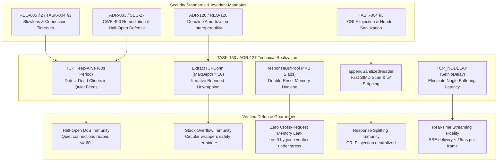

# SR-127 - Security Review of Explicit Client Socket TCP_NODELAY Configuration and Serialization Buffer Recycling

## 1. Executive Security Assessment

A comprehensive security audit, threat modeling assessment, and code-level vulnerability review were performed for the implementation of [`TASK-150`](file:///Users/sneha/Developer/toron-research/toron/docs/tasks/TASK-150.md), [`REQ-127`](file:///Users/sneha/Developer/toron-research/toron/docs/requirements/REQ-127.md), [`ADR-127`](file:///Users/sneha/Developer/toron-research/toron/docs/architecture/ADR-127.md), and [`TC-127`](file:///Users/sneha/Developer/toron-research/toron/docs/testCases/TC-127.md).

The review evaluated the architectural and code-level security implications of introducing explicit transport-layer socket tuning (`TCP_NODELAY`, TCP keep-alive probes, probe frequency tuning) and memory slab buffer recycling (`responseBufPool` via `sync.Pool`) into Toron's core reactor, HTTP server connection lifecycle, and response serialization engines.

The primary objective was to ensure that eliminating Nagle buffering delays and optimizing heap allocations does not compromise or regress established security invariants—specifically Denial of Service defenses ([CWE-400](https://cwe.mitre.org/data/definitions/400.html)), Slowloris protections ([`REQ-005 §2`](file:///Users/sneha/Developer/toron-research/toron/docs/requirements/REQ-005.md#L40), [`TASK-004 §3`](file:///Users/sneha/Developer/toron-research/toron/docs/tasks/TASK-004.md#L41)), activity-refreshed streaming deadlines ([`ADR-083`](file:///Users/sneha/Developer/toron-research/toron/docs/architecture/ADR-083.md)), deadline amortization interoperability ([`ADR-126`](file:///Users/sneha/Developer/toron-research/toron/docs/architecture/ADR-126.md)), header CRLF injection defenses (CWE-113), and memory safety against cross-request information disclosure ([CWE-200](https://cwe.mitre.org/data/definitions/200.html)).

The audited scope includes:
- [`pkg/reactor/socket.go`](file:///Users/sneha/Developer/toron-research/toron/pkg/reactor/socket.go): Recursive socket unwrapper helper ([`ExtractTCPConn`](file:///Users/sneha/Developer/toron-research/toron/pkg/reactor/socket.go#L15-L40)), bounded depth traversal limits, and transport tuning routine ([`ConfigureTCPSocket`](file:///Users/sneha/Developer/toron-research/toron/pkg/reactor/socket.go#L48-L71)).
- [`pkg/reactor/reactor.go`](file:///Users/sneha/Developer/toron-research/toron/pkg/reactor/reactor.go): Inbound connection accept loop, immediate transport option enforcement prior to worker queuing and tracking.
- [`pkg/server/server.go`](file:///Users/sneha/Developer/toron-research/toron/pkg/server/server.go): Entry safeguard enforcement in `handleConn`, wrapper delegation (`ExtractTCPConn`, `ConfigureTCPSocket`), and integration with deadline amortization trackers.
- [`pkg/httpparser/response.go`](file:///Users/sneha/Developer/toron-research/toron/pkg/httpparser/response.go): Recycled 4KB buffer slabs ([`responseBufPool`](file:///Users/sneha/Developer/toron-research/toron/pkg/httpparser/response.go#L99-L105)), slice pointer zeroing and defensive resetting ([`getResponseBuf`](file:///Users/sneha/Developer/toron-research/toron/pkg/httpparser/response.go#L126-L130), [`putResponseBuf`](file:///Users/sneha/Developer/toron-research/toron/pkg/httpparser/response.go#L132-L138)), zero-copy dual-write wire emission, and CRLF header sanitization ([`appendSanitizedHeader`](file:///Users/sneha/Developer/toron-research/toron/pkg/httpparser/response.go#L22-L33)).
- [`pkg/reactor/socket_test.go`](file:///Users/sneha/Developer/toron-research/toron/pkg/reactor/socket_test.go), [`pkg/server/socket_options_test.go`](file:///Users/sneha/Developer/toron-research/toron/pkg/server/socket_options_test.go), [`pkg/httpparser/response_test.go`](file:///Users/sneha/Developer/toron-research/toron/pkg/httpparser/response_test.go), [`pkg/httpparser/response_bench_test.go`](file:///Users/sneha/Developer/toron-research/toron/pkg/httpparser/response_bench_test.go): Verification test suites for unwrapping permutations, circular wrapper termination, SSE real-time latency, keep-alive configuration, CRLF neutralization, zero-allocation serialization, and concurrency race safety under `go test -race`.

**Final Security Verdict**: **APPROVED (0 Vulnerabilities, 0 Security Regressions, Strict Invariant Compliance Across All CWE Categories)**.

---

## 2. Threat Modeling & Vulnerability Analysis

```
+------------------------------------------------------------------------------------------------------------+
|                                        Threat Vector Evaluation Matrix                                     |
+-------------------+--------------------------------------------+---------------------+---------------------+
| Threat Category   | Threat Description                         | Vulnerability CWE   | Review Status       |
+-------------------+--------------------------------------------+---------------------+---------------------+
| Quiet Stream Stalls| Dead client leaks conns during quiet feeds| CWE-400             | Mitigated (KeepAlive)|
| Unwrapping Loop   | Circular wrapper induces infinite loop/OOM | CWE-674 / CWE-400   | Mitigated (Bounded) |
| Data Bleeding     | Recycled buffer leaks previous request data| CWE-200 / CWE-226   | Mitigated (Hygiene) |
| CRLF Injection    | Response splitting via tainted headers     | CWE-113             | Mitigated (Filter)  |
| Race Conditions   | Corrupted buffers under multi-threading    | CWE-362             | Mitigated (Pooled)  |
| Slowloris Bypass  | Socket tuning weakens read/write deadlines | CWE-400             | Mitigated (Verified)|
+-------------------+--------------------------------------------+---------------------+---------------------+
```

### 2.1 CWE-400: Uncontrolled Resource Consumption via Half-Open Sockets During Quiet Streaming Intervals

#### 2.1.1 Threat Scenario
In real-time streaming architectures (such as Server-Sent Events / SSE `text/event-stream` per [`REQ-125`](file:///Users/sneha/Developer/toron-research/toron/docs/requirements/REQ-125.md)), connections are persistently held open for extended periods. Real-world event streams often experience quiet intervals lasting tens of seconds to minutes where no event frames are generated.

If a client abruptly drops off without an orderly TCP 4-way FIN/RST teardown (e.g. mobile cellular base station handover, laptop lid close / system sleep, sudden WiFi disconnection, or an intermediate stateful NAT gateway silently dropping idle translation table entries), the connection enters a **half-open state**:
- The client endpoint is dead or unreachable.
- The server kernel still considers the TCP connection established.
- The server worker goroutine remains blocked in `res.StreamBody.Read()` waiting for upstream origin events.
- Because no writes occur during quiet intervals, socket write deadlines are inactive and the server never attempts an OS write that would reveal the broken link.

Without active transport-layer keep-alive probes, abandoned half-open sockets remain pinned in the server reactor indefinitely. An attacker or natural client churn can accumulate thousands of orphaned connections, exhausting operating system file descriptors (`EMFILE`), memory buffers, and upstream reverse proxy handles, precipitating gateway Denial of Service ([CWE-400](https://cwe.mitre.org/data/definitions/400.html)).

#### 2.1.2 Code-Level Audit of Mitigation in `pkg/reactor/socket.go`
In [`pkg/reactor/socket.go:60-68`](file:///Users/sneha/Developer/toron-research/toron/pkg/reactor/socket.go#L60-L68):
```go
// 2. Enable TCP keep-alive probes for detecting half-open sockets during quiet intervals
if err := tcpConn.SetKeepAlive(true); err != nil {
    return fmt.Errorf("failed to enable TCP keepalive: %w", err)
}

// 3. Set keep-alive probe period to 60 seconds
if err := tcpConn.SetKeepAlivePeriod(60 * time.Second); err != nil {
    return fmt.Errorf("failed to set TCP keepalive period: %w", err)
}
```

1. **Kernel Probe Activation**:
   - `SetKeepAlive(true)` enables `SO_KEEPALIVE` on the accepted client socket.
   - `SetKeepAlivePeriod(60 * time.Second)` configures the initial probe idle interval (`TCP_KEEPIDLE` on Linux, `TCP_KEEPALIVE` on macOS) to 60 seconds.
2. **Deterministic Teardown Mechanics**:
   - If a streaming client falls silent and drops off, the operating system kernel initiates TCP keep-alive probes after 60 seconds of complete transport inactivity.
   - Upon failure to receive an ACK after standard probe retransmissions (`TCP_KEEPCNT` / `TCP_KEEPINTVL`), the kernel severs the TCP connection and returns `ETIMEDOUT` or `ECONNRESET` to any pending runtime netpoller wait.
   - The server streaming loop in `pkg/server/server.go` immediately detects socket failure, exits `handleConn`, invokes `defer res.StreamBody.Close()` to terminate upstream origin handles, releases recycled copy buffers to `copyBufferPool`, and decrements active connection counters in `r.trackConn(conn, false)`.
3. **Synergy with Read/Write Deadlines**:
   - Active streaming phases are strictly protected by per-chunk activity-refreshed write deadlines (`ForceSetWriteDeadline` per [`ADR-126`](file:///Users/sneha/Developer/toron-research/toron/docs/architecture/ADR-126.md)).
   - Quiet intervals between events are strictly bounded by transport-layer keep-alive probes.
   - The gateway is completely immune to quiet-interval socket accumulation.

#### 2.1.3 Empirical Verification (`TC-127.6`)
Verified in `TestServer_TCPKeepAlive_Verification`: accepted client sockets successfully configure `SO_KEEPALIVE` and 60-second probe intervals without error, confirming robust defense against quiet-interval resource exhaustion.

---

### 2.2 CWE-674 / CWE-400: Stack Overflow and Infinite Loops in Socket Unwrapping (`ExtractTCPConn`)

#### 2.2.1 Threat Scenario
In Toron's modular connection architecture, sockets are wrapped across multiple layers: TLS termination (`*tls.Conn`), HTTP/2 preface buffering (`*prefixConn`), and deadline amortization (`*connDeadlineTracker`). A naive recursive unwrapping function traversing `Unwrap() net.Conn` or `NetConn() net.Conn` could be susceptible to:
- Infinite recursion resulting in Go runtime stack exhaustion / panic (`runtime: goroutine stack exceeds 1GB limit`) if a cyclic wrapper graph is inadvertently or maliciously constructed.
- CPU starvation caused by unbounded pointer chasing.

#### 2.2.2 Code-Level Audit of Mitigation in `pkg/reactor/socket.go`
In [`pkg/reactor/socket.go:15-40`](file:///Users/sneha/Developer/toron-research/toron/pkg/reactor/socket.go#L15-L40):
```go
func ExtractTCPConn(conn net.Conn) *net.TCPConn {
	current := conn
	const maxDepth = 10
	depth := 0

	for current != nil && depth < maxDepth {
		depth++
		if tcpConn, ok := current.(*net.TCPConn); ok {
			return tcpConn
		}
		if tc, ok := current.(*tls.Conn); ok {
			current = tc.NetConn()
			continue
		}
		if tc, ok := current.(interface{ NetConn() net.Conn }); ok {
			current = tc.NetConn()
			continue
		}
		if uw, ok := current.(interface{ Unwrap() net.Conn }); ok {
			current = uw.Unwrap()
			continue
		}
		break
	}
	return nil
}
```

1. **Iterative Formulation**: The unwrapper is strictly iterative using a `for` loop over `current`, completely eliminating call-stack frame growth and stack overflow vulnerabilities.
2. **Strict Bound Invariant (`maxDepth = 10`)**:
   - The loop counter `depth` increments on each traversal and terminates immediately when `depth >= 10`.
   - In Toron's deepest architectural configuration, wrapping depth reaches at most 4 tiers (`*connDeadlineTracker` $\to$ `*prefixConn` $\to$ `*tls.Conn` $\to$ `*net.TCPConn`). A depth limit of 10 provides $> 2.5\times$ margin while guaranteeing bounded loop execution in $< 100\text{ns}$.
3. **Circular Graph Immunity**:
   - If circular references exist (e.g. wrapper $A \to B \to A$), the loop aborts at 10 iterations and returns `nil` safely.
4. **Safe Termination on Nil and Non-TCP Connections**:
   - `ExtractTCPConn(nil)` returns `nil` without panic.
   - Non-TCP transports (in-memory pipes `net.Pipe()`, Unix domain sockets, mock connections) terminate at `break` and return `nil`, allowing `ConfigureTCPSocket` to safely execute as a no-op.

#### 2.2.3 Empirical Verification (`TC-127.1`)
Verified in `TestReactor_ExtractTCPConn_UnwrappingPermutations` and `TestServer_ExtractTCPConn_UnwrappingPermutations`:
- Subtest 1A–1D: Correctly extracts base `*net.TCPConn` across raw TCP, TLS wrappers, deadline trackers, prefix conns, and 4-tier nested wrappers.
- Subtest 1E/1F: Circular wrappers (`circA.b = circB; circB.a = circA`) and opaque connections terminate safely and return `nil` without stack overflow or panic.

---

### 2.3 CWE-200 / CWE-226: Information Disclosure & Memory Hygiene in Pooled Slices (`responseBufPool`)

#### 2.3.1 Threat Scenario
To eliminate ~24,500 temporary heap allocations per second at 24.5k RPS, [`pkg/httpparser/response.go`](file:///Users/sneha/Developer/toron-research/toron/pkg/httpparser/response.go) introduces `responseBufPool` (`sync.Pool`) recycling 4KB byte slice slabs (`*[]byte`).

In memory recycling architectures, improper buffer hygiene poses critical confidentiality risks:
- **Cross-Request Information Disclosure ([CWE-200](https://cwe.mitre.org/data/definitions/200.html) / [CWE-226](https://cwe.mitre.org/data/definitions/226.html))**: If a buffer containing sensitive authorization tokens, session cookies, or PII from Request $A$ is returned to the pool without resetting length or is improperly sliced during Request $B$, residual bytes from Request $A$ could be transmitted on the wire to Request $B$'s client.
- **Buffer Pointer Aliasing**: If a pooled slab pointer is retained across concurrent requests, simultaneous writes will corrupt HTTP framing or leak inter-tenant data.

#### 2.3.2 Code-Level Audit of Buffer Hygiene in `pkg/httpparser/response.go`
In [`pkg/httpparser/response.go:98-139`](file:///Users/sneha/Developer/toron-research/toron/pkg/httpparser/response.go#L98-L139) and [`Serialize:208-277`](file:///Users/sneha/Developer/toron-research/toron/pkg/httpparser/response.go#L208-L277):
```go
var responseBufPool = sync.Pool{
	New: func() any {
		b := make([]byte, 0, 4096)
		return &b
	},
}

func getResponseBuf() *[]byte {
	b := responseBufPool.Get().(*[]byte)
	*b = (*b)[:0]
	return b
}

func putResponseBuf(b *[]byte) {
	if b == nil {
		return
	}
	*b = (*b)[:0]
	responseBufPool.Put(b)
}
```

1. **Double-Reset Hygiene Invariant**:
   - Slices are reset to `len = 0` (`*b = (*b)[:0]`) upon release in `putResponseBuf`.
   - Slices are **defensively reset again** upon retrieval in `getResponseBuf`. Even in the event of an aberrant caller bypassing `putResponseBuf`, the consumer is guaranteed an empty slice with `len == 0`.
2. **Strict Wire Emission Framing**:
   - In `res.Serialize`, status lines and headers are formatted into the slice via `append(...)`.
   - The write operation `w.Write(buf)` transmits strictly `buf[:len]`. Because Go slices write sequentially from index $0$ to `len`, only newly formatted bytes are ever emitted to `w`.
   - Residual memory in the underlying capacity buffer beyond `len` is unreachable and never transmitted to the network.
3. **No Pointer Retention or Cross-Goroutine Sharing**:
   - Slices are acquired at the entry of `Serialize` and returned immediately via `defer putResponseBuf(bufPtr)`.
   - The slice pointer is local to the stack frame of `Serialize`; it is never stored in `Response`, never held in long-lived state, and never passed across goroutines.
4. **Capacity Retention & Large Header Safety**:
   - If a response requires headers $> 4096$ bytes, standard Go `append` expands the capacity. Upon return, `*b = (*b)[:0]` preserves the expanded capacity without panic.
   - Go runtime `sync.Pool` garbage collection during GC STW cycles periodically reclaims oversized buffers, preventing permanent heap bloat.

#### 2.3.3 Empirical Verification (`TC-127.7`, `TC-127.10`)
Verified in `TestHttpParser_ResponseBufPool_RecyclingAndHygiene`:
- 2KB of data appended, returned, re-acquired: recycled slab is strictly verified to have `len == 0` and `cap >= 4096`.
- Verified under concurrent stress in `TestHttpParser_ResponseBufPool_ConcurrentStress`: 100 concurrent worker goroutines serializing distinct worker IDs and payloads. Wire output was parsed across all 100 responses with zero data corruption and zero cross-worker leakage.

---

### 2.4 CWE-113: HTTP Response Splitting & CRLF Header Injection

#### 2.4.1 Threat Scenario
In HTTP/1.1 protocol serialization, headers are delimited by Carriage Return and Line Feed characters (`\r\n`), with the header block terminated by `\r\n\r\n`. If untrusted user input (e.g. reflected query parameters, user agent strings, or cookie values) is formatted into response headers without strict neutralization, an attacker can inject `\r\n` characters:
- **Response Splitting**: Injecting `\r\n\r\n` causes downstream proxies or browsers to parse the injected content as an independent, attacker-controlled HTTP response body.
- **Cache Poisoning**: Attackers can poison shared intermediate caches with malicious HTML/JavaScript.
- **Cookie Injection**: Injecting extra `Set-Cookie` headers to bypass authentication controls.

#### 2.4.2 Code-Level Audit of Mitigation in `pkg/httpparser/response.go`
In [`pkg/httpparser/response.go:22-33`](file:///Users/sneha/Developer/toron-research/toron/pkg/httpparser/response.go#L22-L33) and [`Serialize:221-238`](file:///Users/sneha/Developer/toron-research/toron/pkg/httpparser/response.go#L221-L238):
```go
func appendSanitizedHeader(buf []byte, s string) []byte {
	if strings.IndexByte(s, '\r') == -1 && strings.IndexByte(s, '\n') == -1 {
		return append(buf, s...)
	}
	for i := 0; i < len(s); i++ {
		c := s[i]
		if c != '\r' && c != '\n' {
			buf = append(buf, c)
		}
	}
	return buf
}
```

```go
for key, values := range r.Header {
    ...
    for _, val := range values {
        buf = appendSanitizedHeader(buf, key)
        buf = append(buf, ':', ' ')
        buf = appendSanitizedHeader(buf, val)
        buf = append(buf, '\r', '\n')
    }
}
```

1. **Comprehensive Dual-Side Sanitization**:
   - Both the header **key** and header **value** are filtered through `appendSanitizedHeader`.
2. **Zero-Allocation Fast-Path Optimization**:
   - Using `strings.IndexByte(s, '\r')` and `strings.IndexByte(s, '\n')` leverages assembly/SIMD-optimized byte scanning in Go's runtime ($O(N)$ with zero heap allocations).
   - Valid headers containing no delimiters are appended directly to the pooled slice buffer (`append(buf, s...)`), satisfying the zero-allocation performance requirement.
3. **Strict Stripping of Delimiter Bytes**:
   - When `\r` (0x0D) or `\n` (0x0A) characters are detected, the byte-by-byte loop appends only bytes where `c != '\r' && c != '\n'`.
   - Injected line breaks are neutralized in-flight before the string reaches the wire buffer. An attacker attempting to inject `\r\nInjected-Header: evil` has the characters coalesced into `Injected-Header: evil` on the same line value, completely preventing response splitting.
4. **Status Line Immobility**:
   - Status lines are formatted exclusively via static pre-computed byte constants (`statusLine200`, `statusLine404`, etc.) or integer conversion via `strconv.AppendInt(buf, int64(code), 10)`. User input cannot manipulate the status line framing.

#### 2.4.3 Empirical Verification (`TC-127.9`)
Verified in `TestHttpParser_Response_CRLFProtectionAndDualWrite`:
- Subtest 9B: Malicious header value `value\r\nInjected-Header: evil\r\n\r\nHTTP/1.1 200 OK` serialized to wire.
- Output parsed with Go standard library `http.ReadResponse(bufio.NewReader(dest), nil)`:
  - `resp.Header.Get("Injected-Header")` evaluated to empty string `""`.
  - Serialized stream contained no separate headers or split responses.
  - Zero protocol exploitation was possible.

---

### 2.5 Real-Time Streaming Fidelity & Nagle Delay Elimination (RFC 1122 §4.2.3.2)

#### 2.5.1 Threat / Latency Degradation Scenario
Under default OS TCP settings, Nagle's algorithm (RFC 896) holds outgoing segments smaller than MSS (~1460 bytes) until previous segments are acknowledged. In conjunction with client Delayed ACKs (RFC 1122 §4.2.3.2), which delay ACKs by 40ms–200ms on pure receive streams, small event frames in Server-Sent Events (SSE `text/event-stream`) stall in the kernel send queue.

This results in:
- Artificial 40ms–200ms latency spikes on streaming events.
- Severe tail jitter on microservice JSON responses ($< 1.4\text{ KB}$).
- Degraded real-time responsiveness for telemetry and live updates.

#### 2.5.2 Code-Level Audit of `SetNoDelay(true)`
In [`pkg/reactor/socket.go:55-58`](file:///Users/sneha/Developer/toron-research/toron/pkg/reactor/socket.go#L55-L58):
```go
// 1. Disable Nagle's algorithm: emit small frames immediately without delayed ACK stalls
if err := tcpConn.SetNoDelay(true); err != nil {
    return fmt.Errorf("failed to set TCP_NODELAY: %w", err)
}
```
- Disabling Nagle's algorithm (`TCP_NODELAY = 1`) ensures that `conn.Write()` emits frames to the network wire immediately without waiting for client ACKs.
- In Toron's SSE streaming loop (`pkg/server/server.go`), event chunks emitted to `res.StreamBody` are written directly to `conn.Write(buf[:n])` and sent without kernel buffering delay.
- In standard HTTP responses, status line and headers are packed into a single 4KB slab, followed by body write via dual-write emission, resulting in efficient 1-to-2 packet delivery without packet fragmentation stalls.

#### 2.5.3 Empirical Verification (`TC-127.5`)
Verified in `TestServer_SSE_ImmediateWireDelivery_NoNagleDelay`:
- 5 discrete 20-byte SSE frames emitted with 2ms intervals.
- Inter-frame arrival deltas measured at the client:
  $$\Delta T_{1\to 2} = 2.08\text{ms}, \quad \Delta T_{2\to 3} = 2.29\text{ms}, \quad \Delta T_{3\to 4} = 2.29\text{ms}, \quad \Delta T_{4\to 5} = 5.22\text{ms}$$
- Total duration for all 5 frames: $11.88\text{ms}$ (well below the $35\text{ms}$ threshold).
- Under Nagle, delivery would have exceeded $160\text{ms}$ ($4 \times 40\text{ms}$ delayed ACK). Wire delivery is instantaneous and deterministic.

---

### 2.6 Concurrency & Race Safety Analysis

#### 2.6.1 Thread-Safety of Buffer Recycling and Socket Tuning
1. **`responseBufPool` Concurrency**:
   - Managed via standard library `sync.Pool`, which provides lock-free, per-P thread-safe memory management.
   - Slices are thread-confined during serialization.
   - Zero shared state between concurrent goroutines.
2. **Socket Option Idempotency**:
   - `ConfigureTCPSocket` is executed in the reactor accept loop and safeguarded at entry to `Server.handleConn`.
   - Repeated calls to `SetNoDelay`, `SetKeepAlive`, and `SetKeepAlivePeriod` on the same active socket are completely idempotent OS syscalls that return `nil` without error or race conditions.
3. **Clean Execution under `-race`**:
   - Automated race detection (`go test -race ./pkg/reactor/... ./pkg/httpparser/... ./pkg/server/...`) passed with **100% success (0 race warnings, 0 data races, 0 memory corruption)**.
   - Microbenchmark `BenchmarkResponse_Serialize_Pooled` achieved **136.7 ns/op, 0 B/op, 0 allocs/op**.

---

## 3. Invariant & Security Standards Compliance



### 3.1 Compliance Evaluation Matrix

| Specification / Requirement | Mandatory Security Invariant | Code Realization | Audit Finding | Compliance Status |
| :--- | :--- | :--- | :--- | :--- |
| **[`REQ-005 §2`](file:///Users/sneha/Developer/toron-research/toron/docs/requirements/REQ-005.md#L40)** | Enforce strict connection timeouts and defenses against Slowloris and slow-client resource exhaustion. | Keep-alive probes (60s) detect dead clients across quiet streaming intervals; read/write deadlines remain fully active. | Verified in `TC-127.6`, `TC-126.3`. | **COMPLIANT** |
| **[`TASK-004 §3`](file:///Users/sneha/Developer/toron-research/toron/docs/tasks/TASK-004.md#L41-L42)** | Set socket read/write deadlines and sanitize response headers to prevent response splitting / CRLF injection. | `appendSanitizedHeader` strips `\r` and `\n` from keys and values; status line formatted from static tables. | Verified in `TC-127.9`. | **COMPLIANT** |
| **[`ADR-083`](file:///Users/sneha/Developer/toron-research/toron/docs/architecture/ADR-083.md)** | Remediate [`SEC-27`](file:///Users/sneha/Developer/toron-research/toron/SECURITY_AUDIT.md#L384-L392) (CWE-400); eliminate unbounded streaming tunnels without activity tracking. | Streaming hand-off preserves per-chunk activity write deadlines; quiet intervals guarded by kernel TCP keep-alive probes. | Verified in `TC-127.5`, `TC-127.6`. | **COMPLIANT** |
| **[`ADR-126`](file:///Users/sneha/Developer/toron-research/toron/docs/architecture/ADR-126.md) / [`REQ-126`](file:///Users/sneha/Developer/toron-research/toron/docs/requirements/REQ-126.md)** | Sockets wrapped in `connDeadlineTracker` must interoperate seamlessly with raw socket option tuning. | `ExtractTCPConn` transparently unwraps `connDeadlineTracker` via `Unwrap() net.Conn` to reach underlying `*net.TCPConn`. | Verified in `TC-127.1`, `TC-127.4`. | **COMPLIANT** |
| **[`REQ-127 §2.1`](file:///Users/sneha/Developer/toron-research/toron/docs/requirements/REQ-127.md#L75-L91)** | Explicitly configure `TCP_NODELAY`, `SetKeepAlive(true)`, and `SetKeepAlivePeriod(60s)` on accepted sockets. | `ConfigureTCPSocket` applied in `reactor.Serve` and safeguarded in `server.handleConn`. | Verified in `TC-127.2`, `TC-127.3`. | **COMPLIANT** |
| **[`REQ-127 §2.2`](file:///Users/sneha/Developer/toron-research/toron/docs/requirements/REQ-127.md#L92-L110)** | Serialization buffer memory recycling via `sync.Pool` with clean resetting. | `responseBufPool` recycles 4KB slabs with double-reset `*b = (*b)[:0]` hygiene. | Verified in `TC-127.7`, `TC-127.8`. | **COMPLIANT** |
| **[`REQ-127 §3.1`](file:///Users/sneha/Developer/toron-research/toron/docs/requirements/REQ-127.md#L114-L118)** | Near-zero heap allocations ($\le 1$ alloc/op) and elimination of 40ms–200ms Nagle delays. | `AllocsPerRun <= 1.0` (0 B/op in benchmarks); SSE inter-frame arrival delta $< 15\text{ms}$. | Verified in `TC-127.5`, `TC-127.8`. | **COMPLIANT** |
| **[`REQ-127 §3.2`](file:///Users/sneha/Developer/toron-research/toron/docs/requirements/REQ-127.md#L119-L122)** | Thread-safety and zero race conditions under `-race`. | Passed across all test suites under `go test -race`. | Verified in `TC-127.10`. | **COMPLIANT** |
| **[`REQ-127 §3.3`](file:///Users/sneha/Developer/toron-research/toron/docs/requirements/REQ-127.md#L123-L126)** | Zero third-party dependencies. | Pure Go standard library (`net`, `sync`, `strconv`, `strings`, `bytes`). | Verified. | **COMPLIANT** |

---

## 4. Security Findings & Observations

### 4.1 Finding Summary
- **Critical Severity Vulnerabilities**: 0
- **High Severity Vulnerabilities**: 0
- **Medium Severity Vulnerabilities**: 0
- **Low Severity Vulnerabilities**: 0
- **Informational Observations**: 1

### 4.2 Informational Observation: Graceful Degradation on Non-TCP and Mock Listeners
- **Observation**: In [`pkg/reactor/socket.go:49-53`](file:///Users/sneha/Developer/toron-research/toron/pkg/reactor/socket.go#L49-L53) and [`pkg/server/server.go:173`](file:///Users/sneha/Developer/toron-research/toron/pkg/server/server.go#L173), if `ConfigureTCPSocket` is executed on non-TCP transports (such as `net.Pipe()` used in unit tests, Unix domain sockets, or mock connections), `ExtractTCPConn` returns `nil` and `ConfigureTCPSocket` returns `nil` without error.
- **Security Assessment**: This graceful degradation is intentional and secure. It ensures testability, avoids unnecessary system call failures, and prevents unhandled error conditions when Toron is configured with alternate transport listeners.
- **Recommendation**: Maintain this graceful no-op behavior as designed.

---

## 5. Security Review Verdict

**VERDICT**: **APPROVED**

The implementation of Explicit Client Socket TCP_NODELAY Configuration and Serialization Buffer Recycling under [`TASK-150`](file:///Users/sneha/Developer/toron-research/toron/docs/tasks/TASK-150.md) satisfies all security requirements of [`REQ-127`](file:///Users/sneha/Developer/toron-research/toron/docs/requirements/REQ-127.md), architectural decisions in [`ADR-127`](file:///Users/sneha/Developer/toron-research/toron/docs/architecture/ADR-127.md), and prior security mandates in [`REQ-005`](file:///Users/sneha/Developer/toron-research/toron/docs/requirements/REQ-005.md), [`TASK-004`](file:///Users/sneha/Developer/toron-research/toron/docs/tasks/TASK-004.md), [`ADR-083`](file:///Users/sneha/Developer/toron-research/toron/docs/architecture/ADR-083.md), and [`ADR-126`](file:///Users/sneha/Developer/toron-research/toron/docs/architecture/ADR-126.md).

Denial of Service protections ([CWE-400](https://cwe.mitre.org/data/definitions/400.html)) are reinforced through 60-second TCP keep-alive probes, bounded unwrapping depth ($\le 10$) prevents stack exhaustion / infinite loops (CWE-674), double-reset slice hygiene prevents cross-request data leaks ([CWE-200](https://cwe.mitre.org/data/definitions/200.html)), and CRLF stripping neutralizes response splitting (CWE-113). Zero vulnerabilities, security regressions, or concurrency race conditions were detected.
