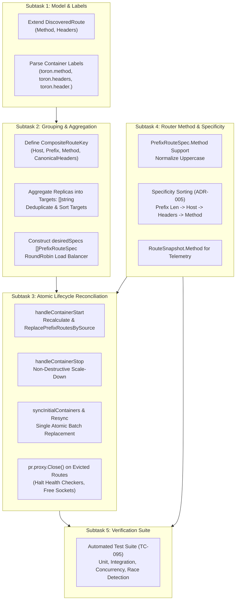

# TASK-118 - Composite Route Key Grouping, Multi-Replica Target Aggregation, and Specificity-Based Route Lifecycle

## Description

Refactor the OCI container auto-discovery engine ([`pkg/discovery`](file:///Users/sneha/Developer/toron-research/toron/pkg/discovery)) and core router ([`pkg/router`](file:///Users/sneha/Developer/toron-research/toron/pkg/router)) to remediate critical vulnerability [`SEC-34`](file:///Users/sneha/Developer/toron-research/toron/SECURITY_AUDIT.md#L465-L473) ([`SR-091 Finding 4`](file:///Users/sneha/Developer/toron-research/toron/docs/securityReview/SR-091.md#L154-L171), [CWE-400](https://cwe.mitre.org/data/definitions/400.html), [CWE-284](https://cwe.mitre.org/data/definitions/284.html), [CWE-662](https://cwe.mitre.org/data/definitions/662.html)) and satisfy [`REQ-095`](file:///Users/sneha/Developer/toron-research/toron/docs/requirements/REQ-095.md).

This task establishes:
1. Multi-dimensional route partitioning via a 4-tuple `CompositeRouteKey = (Host, Prefix, Method, CanonicalHeaders)`.
2. Multi-replica target URL aggregation into unified multi-target reverse proxies with round-robin load balancing, eliminating single-replica starvation.
3. Atomic route replacement and non-destructive partial scale-down using [`router.ReplacePrefixRoutesBySource("oci-discovery", desiredSpecs)`](file:///Users/sneha/Developer/toron-research/toron/pkg/router/router.go#L307-L350), eliminating premature route deletion (HTTP 404s) when stopping individual replicas during rolling deployments or scaling events.
4. Clean proxy teardown (`pr.proxy.Close()`) on route eviction to halt background health checkers and prevent socket descriptor / goroutine leaks.
5. First-class HTTP `Method` constraint support in [`PrefixRouteSpec`](file:///Users/sneha/Developer/toron-research/toron/pkg/router/router.go#L172-L179).
6. Strict specificity-based route ordering adhering to [`ADR-005`](file:///Users/sneha/Developer/toron-research/toron/docs/architecture/ADR-005.md) (longest prefix $\to$ specific host $\to$ header constraints $\to$ method constraint) so generic fallback routes never shadow specific or canary routes.

---

## Problem Statement & Architectural Context

Prior to this task, the container discovery manager ([`pkg/discovery/manager.go:L207-L256`](file:///Users/sneha/Developer/toron-research/toron/pkg/discovery/manager.go#L207-L256)) exhibited severe operational failure modes:

1. **Premature Route Deletion & Outage on Replica Stop (CWE-662, CWE-284)**:
   When 3 container replicas served `Host: "api.example.com"`, `Prefix: "/v1"`, stopping a single replica triggered `m.router.RemovePrefixRoute(route.Host, route.Prefix)`. `RemovePrefixRoute` purged **all** prefix routes matching `(host, prefix)`, instantly killing ingress traffic to the remaining healthy replicas and causing a complete service outage (HTTP 404).
2. **Horizontal Scaling Defeat & Single-Pod Overload (CWE-400)**:
   Containers were registered as individual single-target prefix routes: `Targets: []string{route.TargetURL()}`. In `router.ServeHTTP`, linear first-match prefix search dispatched 100% of incoming requests to replica #1, while replicas #2..$M$ received 0% traffic. Horizontal scaling was completely non-functional.
3. **Canary Leakage / Routing Dimension Blindness**:
   Discovery parsed only `toron.host` and `toron.prefix`. It lacked HTTP header matching and HTTP method matching. Canary containers (`X-Version: canary`) and baseline containers were conflated into the same prefix route, corrupting traffic segmentation and leaking pre-release code to regular users.
4. **Route Shadowing via Arbitrary Insertion Order**:
   Because `router.prefixRoutes` was evaluated in insertion order without specificity sorting, an unconstrained generic route (`/api`) registered before a canary route (`/api` with `X-Version: canary`) shadowed the canary route entirely.

---

## Scope & Implementation Breakdown



---

### Subtask 1: DiscoveredRoute Model & Label Parsing (`pkg/discovery/provider.go`, `pkg/discovery/parser.go`)

- **Objective**: Extend container discovery data models to represent HTTP method and header constraints, and implement parsing for container labels `toron.method`, `toron.header.<Name>`, and `toron.headers` (CSV and JSON formats).
- **Files Owned**:
  - [`pkg/discovery/provider.go`](file:///Users/sneha/Developer/toron-research/toron/pkg/discovery/provider.go)
  - [`pkg/discovery/parser.go`](file:///Users/sneha/Developer/toron-research/toron/pkg/discovery/parser.go)
- **Detailed Action Items**:
  1. In [`pkg/discovery/provider.go`](file:///Users/sneha/Developer/toron-research/toron/pkg/discovery/provider.go):
     - Extend [`DiscoveredRoute`](file:///Users/sneha/Developer/toron-research/toron/pkg/discovery/provider.go#L45-L57):
       ```go
       type DiscoveredRoute struct {
           ContainerID       string
           ContainerName     string
           Host              string
           Prefix            string
           Method            string            // Uppercase HTTP method constraint or "" for any method
           Headers           map[string]string // Canonical HTTP header constraints
           TargetIP          string
           TargetPort        int
           Weight            int
           HealthCheckPath   string
           StripPrefix       *bool
           RewriteRedirects  *bool
           RewriteCookiePath *bool
       }
       ```
  2. In [`pkg/discovery/parser.go`](file:///Users/sneha/Developer/toron-research/toron/pkg/discovery/parser.go):
     - Declare constants:
       ```go
       const (
           LabelMethod       = "toron.method"
           LabelHeaders      = "toron.headers"
           LabelHeaderPrefix = "toron.header."
       )
       ```
     - In `ParseContainerLabels(container Container, defaultWeight int) (*DiscoveredRoute, bool)`:
       - **Method Extraction**: Parse `container.Labels[LabelMethod]`. If present, trim whitespace and normalize to uppercase (`strings.ToUpper(strings.TrimSpace(val))`).
       - **Headers Extraction**:
         - Initialize `headers := make(map[string]string)`.
         - Grouped label `toron.headers`:
           - If value starts with `{` and ends with `}`, attempt `json.Unmarshal([]byte(val), &headersMap)`. If valid JSON, copy non-empty keys and values into `headers`.
           - Else, treat as comma-delimited key-value list (e.g. `"X-Version=canary,X-Env=staging"`): split by `,`, then for each token split by `=` via `strings.SplitN(token, "=", 2)`. Trim whitespace from key and value; add to `headers`.
           - If malformed JSON or invalid token, log warning or ignore without panicking.
         - Individual labels `toron.header.<Name>`:
           - Iterate over all keys in `container.Labels`.
           - For keys where `strings.HasPrefix(k, LabelHeaderPrefix)`:
             - Header key: `strings.TrimSpace(k[len(LabelHeaderPrefix):])`.
             - Header value: `strings.TrimSpace(v)`.
             - Add or override in `headers[headerKey] = headerValue`.
         - If `len(headers) == 0`, retain `nil` to minimize allocations.
       - Populate `Method` and `Headers` on the constructed `*DiscoveredRoute`.

---

### Subtask 2: CompositeRouteKey & Multi-Replica Target Aggregation (`pkg/discovery/manager.go`)

- **Objective**: Implement 4-dimensional grouping of discovered routes and aggregate targets across multi-replica containers into unified multi-target upstream proxies with round-robin load balancing.
- **Files Owned**:
  - [`pkg/discovery/manager.go`](file:///Users/sneha/Developer/toron-research/toron/pkg/discovery/manager.go)
- **Detailed Action Items**:
  1. Define `CompositeRouteKey` struct and canonicalization helper:
     ```go
     type CompositeRouteKey struct {
         Host             string
         Prefix           string
         Method           string
         CanonicalHeaders string
     }
     ```
  2. Implement canonical header string generator:
     - Given `headers map[string]string`:
     - If empty or nil, return `""`.
     - Extract all keys, sort alphabetically (`sort.Strings(keys)`).
     - Format as `key1=val1&key2=val2` ensuring deterministic string output regardless of map iteration order.
  3. Implement route key builder:
     - Host: `strings.ToLower(strings.TrimSpace(route.Host))`
     - Prefix: normalized path prefix (leading slash, no trailing slash, or `""` for root)
     - Method: `strings.ToUpper(strings.TrimSpace(route.Method))`
     - CanonicalHeaders: output of canonical header generator
  4. Implement `recalculateDesiredSpecsLocked() []router.PrefixRouteSpec`:
     - Group all entries in `m.activeRoutes` by `CompositeRouteKey`.
     - For each group:
       - Collect `route.TargetURL()` for each container replica in that group.
       - Deduplicate target URLs using `seen := make(map[string]struct{})`.
       - Deterministically sort target URLs (`sort.Strings(targets)`).
       - Aggregate proxy options:
         - `Targets: targets`
         - `Algorithm: proxy.AlgorithmRoundRobin`
         - `StripPrefix`, `RewriteRedirects`, `RewriteCookiePath`: inherit from first replica specifying non-nil value.
         - `HealthCheckPath`: inherit from first replica specifying non-empty path.
       - Construct `router.PrefixRouteSpec`:
         ```go
         spec := router.PrefixRouteSpec{
             TargetType: router.RouteTypeUpstream,
             Host:       group.Host,
             Prefix:     group.Prefix,
             Method:     group.Method,
             Headers:    group.Headers,
             Opts:       opts,
         }
         ```
     - Sort `desiredSpecs` according to ADR-005 specificity order prior to returning.

---

### Subtask 3: Atomic Route Replacement & Clean Eviction Teardown (`pkg/discovery/manager.go`)

- **Objective**: Eliminate destructive single-route deletions and append-only route additions in `Manager`. Transition all lifecycle operations (`EventStart`, `EventStop`, `EventDie`, `syncInitialContainers`, periodic resync) to atomic batch replacement via `ReplacePrefixRoutesBySource("oci-discovery", desiredSpecs)`.
- **Files Owned**:
  - [`pkg/discovery/manager.go`](file:///Users/sneha/Developer/toron-research/toron/pkg/discovery/manager.go)
- **Detailed Action Items**:
  1. Eliminate all calls to `m.router.RoutePrefix(...)` and `m.router.RemovePrefixRoute(...)` across `pkg/discovery`.
  2. Refactor `handleContainerStart(c Container)`:
     - Parse route via `ParseContainerLabels(c, m.cfg.DefaultWeight)`.
     - Under `m.mu.Lock()`:
       - Update `m.activeRoutes[c.ID] = route`.
       - Compute `desiredSpecs := m.recalculateDesiredSpecsLocked()`.
     - Outside `m.mu` lock (or holding lock appropriately, avoiding lock inversion with router):
       - If `m.router != nil`, invoke `m.router.ReplacePrefixRoutesBySource("oci-discovery", desiredSpecs)`.
  3. Refactor `handleContainerStop(containerID string)`:
     - Under `m.mu.Lock()`:
       - If containerID not found in `m.activeRoutes`, return.
       - Remove `delete(m.activeRoutes, containerID)`.
       - Compute `desiredSpecs := m.recalculateDesiredSpecsLocked()`.
     - If `m.router != nil`, invoke `m.router.ReplacePrefixRoutesBySource("oci-discovery", desiredSpecs)`.
  4. Non-destructive partial replica scale-down guarantee:
     - When replica 1 of 3 stops, `m.activeRoutes` retains replicas 2 and 3.
     - `recalculateDesiredSpecsLocked()` produces the same `CompositeRouteKey` route spec with 2 target URLs.
     - `ReplacePrefixRoutesBySource` atomically swaps the route in `Router`. Surviving replicas continue serving traffic without 404 errors.
  5. Refactor `syncInitialContainers(ctx context.Context)`:
     - Perform batch scan across providers.
     - Under `m.mu.Lock()`:
       - Reset `m.activeRoutes` to only currently running discovered containers.
       - Compute `desiredSpecs := m.recalculateDesiredSpecsLocked()`.
     - Invoke `m.router.ReplacePrefixRoutesBySource("oci-discovery", desiredSpecs)` once in a single atomic batch operation.
  6. Clean proxy teardown on eviction:
     - When all replicas for a `CompositeRouteKey` are stopped, the route is omitted from `desiredSpecs`.
     - `ReplacePrefixRoutesBySource` identifies old route as evicted, invokes `pr.proxy.Close()`, stopping active health check goroutines and releasing TCP sockets.

---

### Subtask 4: Router PrefixRouteSpec Method Support & Specificity Sorting (`pkg/router/router.go`)

- **Objective**: Extend `PrefixRouteSpec` to support HTTP method constraints, and enforce specificity-based route ordering adhering to [`ADR-005`](file:///Users/sneha/Developer/toron-research/toron/docs/architecture/ADR-005.md) across all prefix route registrations.
- **Files Owned**:
  - [`pkg/router/router.go`](file:///Users/sneha/Developer/toron-research/toron/pkg/router/router.go)
- **Detailed Action Items**:
  1. Extend `PrefixRouteSpec`:
     ```go
     type PrefixRouteSpec struct {
         TargetType RouteType
         Host       string
         Prefix     string
         Method     string
         Headers    map[string]string
         DirPath    string
         Opts       proxy.ProxyOptions
     }
     ```
  2. In `compilePrefixRoute(source string, spec PrefixRouteSpec)`:
     - Normalize `spec.Method`: `normMethod := strings.ToUpper(strings.TrimSpace(spec.Method))`.
     - Set `prefixRoute.method = normMethod`.
  3. In `RouteSnapshot`:
     - Add `Method string `json:"method,omitempty"``.
     - In `GetPrefixRoutes()`, assign `Method: pr.method`.
  4. Specificity Sorting Comparator & Algorithm:
     - Implement specificity sort function for `[]prefixRoute` (and/or `PrefixRouteSpec`):
       - Primary: **Longest Prefix Length First** (`len(a.prefix) > len(b.prefix)`). E.g., `/api/v1/auth` precedes `/api/v1` precedes `/api`.
       - Secondary: **Host Specificity** (routes with non-empty `host` precede wildcard/empty `host`: `a.host != "" && b.host == ""`). If both have host, alphabetical tie-break.
       - Tertiary: **Header Specificity** (routes with more headers precede routes with fewer headers: `len(a.headers) > len(b.headers)`). If both have headers, alphabetical tie-break on canonical header string.
       - Quaternary: **Method Specificity** (routes with explicit `method` precede any-method `""`: `a.method != "" && b.method == ""`). If both have method, alphabetical tie-break.
       - Quinary: Deterministic tie-breaking on route target or source to ensure stable sorting.
  5. Enforce specificity sorting in:
     - `ReplacePrefixRoutesBySource`:
       - Sort newly compiled routes or the entire resulting `r.prefixRoutes` slice according to specificity before releasing lock.
     - `RoutePrefixWithSource`:
       - Maintain specificity ordering upon route insertion.
  6. Routing resolution in `ServeHTTP`:
     - Because `r.prefixRoutes` is sorted by specificity, canary routes with headers (`X-Version: canary`) and method-restricted routes (`POST`) are evaluated **before** generic unconstrained fallback routes (`/api`).
     - Generic routes can never shadow specific routes.

---

### Subtask 5: Comprehensive Automated Verification (`pkg/discovery/discovery_test.go`, `pkg/router/router_test.go`)

- **Objective**: Implement comprehensive automated test coverage satisfying test specification [`TC-095`](file:///Users/sneha/Developer/toron-research/toron/docs/testCases/TC-095.md).
- **Files Owned**:
  - [`pkg/discovery/discovery_test.go`](file:///Users/sneha/Developer/toron-research/toron/pkg/discovery/discovery_test.go)
  - [`pkg/router/router_test.go`](file:///Users/sneha/Developer/toron-research/toron/pkg/router/router_test.go)
- **Detailed Test Cases**:
  1. `TestParseContainerLabels_MethodAndHeaders`:
     - Parse `toron.method` (`"GET"`, `"post"`, `"DELETE"`).
     - Parse `toron.header.<Name>` (`toron.header.X-Version: canary`).
     - Parse `toron.headers` with CSV format (`"X-Env=staging,X-Tier=gold"`).
     - Parse `toron.headers` with JSON format (`{"X-Env":"staging","X-Tier":"gold"}`).
     - Verify merging and override precedence: individual `toron.header.X-Env` overrides key in `toron.headers`.
     - Verify malformed JSON falls back gracefully without panic.
  2. `TestDiscoveryManager_CompositeRouteKeyAggregation`:
     - Spin up 3 container replicas sharing `(Host: "api.example.com", Prefix: "/v1", Method: "POST", Headers: {"X-Tier":"gold"})`.
     - Verify `Manager` produces exactly 1 `PrefixRouteSpec` with `Targets: []string{...}` containing all 3 replica URLs.
     - Verify duplicate container targets are deduplicated.
     - Verify target list is deterministically sorted.
     - Verify load balancer algorithm is configured to `proxy.AlgorithmRoundRobin`.
  3. `TestDiscoveryManager_NonDestructivePartialScaleDown`:
     - Register 3 replicas of a service behind a mock router.
     - Emit `EventStop` for 1 replica.
     - Verify route remains in router with 2 surviving targets.
     - Dispatch HTTP requests: verify 100% succeed (HTTP 200 OK) distributed across surviving 2 replicas, with zero HTTP 404 errors.
  4. `TestDiscoveryManager_DistinctVariantCanarySeparation`:
     - Register 2 baseline replicas (`toron.prefix: "/app"`, no headers).
     - Register 1 canary replica (`toron.prefix: "/app"`, `toron.header.X-Version: canary`).
     - Verify `Manager` produces 2 distinct route specs with isolated target lists.
     - Send request with `X-Version: canary`: routes to canary replica.
     - Send request without header: routes to baseline replicas.
  5. `TestRouter_SpecificityOrdering_NoCanaryShadowing`:
     - Register generic route `/api` with no headers.
     - Register canary route `/api` with header `X-Version: canary`.
     - Verify canary route matches requests with `X-Version: canary` regardless of registration order.
     - Verify unconstrained request matches generic route.
  6. `TestRouter_PrefixRouteSpec_MethodMatching`:
     - Register prefix route with `Method: "POST"`.
     - Dispatch POST request $\to$ matches route (200 OK).
     - Dispatch GET request $\to$ fails method match (returns 405 Method Not Allowed or falls through to next route).
  7. `TestDiscoveryManager_AtomicReplacementLifecycle`:
     - Register container with active health check.
     - Evict route by stopping all replicas.
     - Verify `ReplacePrefixRoutesBySource` invokes `Close()` on the evicted proxy, terminating health check tickers.
  8. `TestDiscoveryManager_ConcurrentLifecycleAndRouting_RaceClean`:
     - High-concurrency test: send 1,000 parallel requests via `router.ServeHTTP` while background goroutines rapidly generate `EventStart`, `EventStop`, and periodic resyncs.
     - Execute under `go test -race ./pkg/discovery/... ./pkg/router/...`.
     - Must finish with zero data races and zero panics.

---

## Acceptance Criteria Mapping

| Task Acceptance Criterion | Maps To Requirement AC | Description & Verification Target |
| :--- | :--- | :--- |
| **AC-01** | [`REQ-095-AC-01`](file:///Users/sneha/Developer/toron-research/toron/docs/requirements/REQ-095.md#L117-L122) | `DiscoveredRoute` struct extended with `Method string` and `Headers map[string]string`. `ActiveRoutes()` snapshot reflects populated fields. |
| **AC-02** | [`REQ-095-AC-02`](file:///Users/sneha/Developer/toron-research/toron/docs/requirements/REQ-095.md#L123-L132) | `ParseContainerLabels` extracts `toron.method`, individual `toron.header.<Name>`, and `toron.headers` (both CSV and JSON format) with additive merging and panic-free fallback. |
| **AC-03** | [`REQ-095-AC-03`](file:///Users/sneha/Developer/toron-research/toron/docs/requirements/REQ-095.md#L133-L147) | Multi-replica containers partitioned by `CompositeRouteKey = (Host, Prefix, Method, CanonicalHeaders)`. Replicas sharing key aggregated into single route with deduplicated, sorted `Targets: []string` and `RoundRobinBalancer`. |
| **AC-04** | [`REQ-095-AC-04`](file:///Users/sneha/Developer/toron-research/toron/docs/requirements/REQ-095.md#L148-L159) | `discovery.Manager` uses `ReplacePrefixRoutesBySource("oci-discovery", desiredSpecs)` on all lifecycle events (`start`, `stop`, `die`, `resync`). Direct calls to `RoutePrefix` and `RemovePrefixRoute` removed. Other sources (`"k8s-ingress"`, `"config"`) untouched. |
| **AC-05** | [`REQ-095-AC-05`](file:///Users/sneha/Developer/toron-research/toron/docs/requirements/REQ-095.md#L160-L166) | Stopping 1 of $M$ replicas ($M \ge 2$) removes only that replica from `Targets`. Remaining $M-1$ replicas continue serving ingress traffic with zero 404s and zero downtime. |
| **AC-06** | [`REQ-095-AC-06`](file:///Users/sneha/Developer/toron-research/toron/docs/requirements/REQ-095.md#L167-L173) | Canary and baseline containers produce separate `CompositeRouteKey`s and separate route specs. Target pools remain strictly isolated. Requests with canary header route exclusively to canary replica. |
| **AC-07** | [`REQ-095-AC-07`](file:///Users/sneha/Developer/toron-research/toron/docs/requirements/REQ-095.md#L174-L185) | `PrefixRouteSpec` includes `Method string`. Prefix routes ordered by specificity (longest prefix $\to$ host $\to$ headers $\to$ method) adhering to [`ADR-005`](file:///Users/sneha/Developer/toron-research/toron/docs/architecture/ADR-005.md), preventing generic route shadowing. |
| **AC-08** | [`REQ-095-AC-08`](file:///Users/sneha/Developer/toron-research/toron/docs/requirements/REQ-095.md#L186-L191) | Evicted reverse proxies have `Close()` invoked via `ReplacePrefixRoutesBySource`, stopping health check ticker goroutines and releasing idle TCP sockets. |
| **AC-09** | [`REQ-095-AC-09`](file:///Users/sneha/Developer/toron-research/toron/docs/requirements/REQ-095.md#L192-L195) | Pure Go standard library implementation (`sync`, `net/http`, `net/url`, `sort`, `strings`, `encoding/json`). Zero third-party packages. Zero data races under `go test -race`. |
| **AC-10** | [`REQ-095-AC-10`](file:///Users/sneha/Developer/toron-research/toron/docs/requirements/REQ-095.md#L196-L206) | Automated test suite in `pkg/discovery/discovery_test.go` and `pkg/router/router_test.go` covering all scenarios specified in [`TC-095`](file:///Users/sneha/Developer/toron-research/toron/docs/testCases/TC-095.md). |

---

## Traceability Matrix

| Artifact | Reference | Relationship | Description |
| :--- | :--- | :--- | :--- |
| **Vulnerability** | [`SEC-34`](file:///Users/sneha/Developer/toron-research/toron/SECURITY_AUDIT.md#L465-L473) | Remediates | Premature Route Deletion & Load-Balancing Failure Across Multi-Replica Containers in OCI Discovery Engine |
| **Security Review** | [`SR-091`](file:///Users/sneha/Developer/toron-research/toron/docs/securityReview/SR-091.md#L154-L171) | Remediates | Finding 4: Container discovery multi-replica route deletion and load-balancing defect |
| **Requirement** | [`REQ-095`](file:///Users/sneha/Developer/toron-research/toron/docs/requirements/REQ-095.md) | Implements | Composite Route Key Grouping, Multi-Replica Target Aggregation, and Specificity-Based Route Lifecycle |
| **Prior Architecture** | [`ADR-005`](file:///Users/sneha/Developer/toron-research/toron/docs/architecture/ADR-005.md) | Adheres to | Header-Based Routing & Traffic Matching Architecture (Route Resolution Priority Order) |
| **Prior Architecture** | [`ADR-089`](file:///Users/sneha/Developer/toron-research/toron/docs/architecture/ADR-089.md) | Adheres to | Source-Tagged Atomic Prefix Routing and Dynamic Route Table Reconciliation |
| **Architecture Decision** | [`ADR-095`](file:///Users/sneha/Developer/toron-research/toron/docs/architecture/ADR-095.md) | Governed by | OCI Discovery Multi-Replica Aggregation & Specificity-Ordered Atomic Lifecycle |
| **Verification Test Case** | [`TC-095`](file:///Users/sneha/Developer/toron-research/toron/docs/testCases/TC-095.md) | Verified by | Test Specification for Composite Key Grouping, Target Aggregation, and Specificity Routing |
| **Foundational Task** | [`TASK-116`](file:///Users/sneha/Developer/toron-research/toron/docs/tasks/TASK-116.md) | Depends on API | Router Source-Tagged Prefix Routing and Atomic Route Replacement API |
| **Peer Task** | [`TASK-117`](file:///Users/sneha/Developer/toron-research/toron/docs/tasks/TASK-117.md) | Parallel Subsystem | Kubernetes Ingress Controller Route Table Dynamic Reconciliation and Multi-Target Pod Aggregation |

---

## Rationale & Threat Mitigation

| Threat / Flaw | Vulnerability Classification | Prior Behavior | Remediated Behavior |
| :--- | :--- | :--- | :--- |
| **Single Replica Stop Induces Complete Outage** | [CWE-662 Improper Synchronization](https://cwe.mitre.org/data/definitions/662.html), [CWE-284 Improper Access Control](https://cwe.mitre.org/data/definitions/284.html) | `handleContainerStop` called `RemovePrefixRoute(host, prefix)` deleting route for all replicas. | `handleContainerStop` recalculates active replicas and calls `ReplacePrefixRoutesBySource`. Surviving replicas continue serving traffic without downtime. |
| **Single-Instance Starvation & LB Defeat** | [CWE-400 Uncontrolled Resource Consumption](https://cwe.mitre.org/data/definitions/400.html) | Replicas added as distinct single-target routes; linear search sent 100% traffic to replica #1. | Replicas matching `CompositeRouteKey` aggregated into unified route with `RoundRobinBalancer` ($\approx 1/M$ traffic per replica). |
| **Canary Traffic Spillage / Variant Conflation** | Traffic Segmentation Defeat | Routes grouped only by `(Host, Prefix)`; canary and baseline backends mixed. | Partitioned by `CompositeRouteKey = (Host, Prefix, Method, CanonicalHeaders)`. Canary traffic strictly isolated to canary containers. |
| **Generic Route Shadowing** | Specificity Order Violation | Routes registered in discovery order; generic route placed earlier shadowed canary route. | Routes sorted by specificity (longest prefix $\to$ host $\to$ headers $\to$ method) per ADR-005. Canary routes always evaluated first. |
| **Missing Declarative Method Filtering** | Protocol Matching Defect | `PrefixRouteSpec` lacked `Method`; matched all HTTP verbs. | `PrefixRouteSpec.Method` enforced; non-matching HTTP verbs return 405 or proceed to matching handler. |
| **Resource & Socket Leak on Route Churn** | File Descriptor Exhaustion ([CWE-775](https://cwe.mitre.org/data/definitions/775.html)) | Evicted proxies left running in memory with active health check goroutines. | `ReplacePrefixRoutesBySource` invokes `pr.proxy.Close()` on all evicted proxies, halting health checks and closing sockets. |

---

## Constraints & Non-Functional Requirements

- **Zero Third-Party Dependencies**: Pure Go standard library (`sync`, `net/http`, `net/url`, `sort`, `strings`, `encoding/json`). No external Docker SDK or container library.
- **Zero Downtime Invariant**: Container scale-down or single-replica crash MUST NOT cause 404 or connection loss for traffic destined to surviving replicas.
- **Strict Specificity Ordering Invariant**: More specific routes (longest prefix, specific host, header-constrained, method-constrained) MUST ALWAYS precede less specific routes in route evaluation.
- **Concurrency Safety**: 100% data-race-free under `go test -race ./pkg/discovery/... ./pkg/router/...`.
- **Lock Discipline**: Avoid holding `m.mu` while calling router methods if router could call discovery callbacks, preventing deadlocks.
- **Backward Compatibility**: `ActiveRoutes()` signature and behavior preserved for administrative inspection and telemetry.
