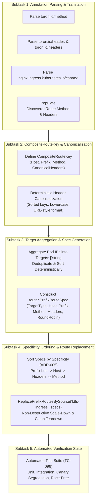

# TASK-119 - Composite Route Key Grouping, Multi-Pod Target Aggregation, and Specificity-Based Route Lifecycle in Kubernetes Ingress Controller

## Description

Refactor the Kubernetes Ingress Controller route translation engine ([`pkg/ingress/translator.go`](file:///Users/sneha/Developer/toron-research/toron/pkg/ingress/translator.go)) and dynamic route reconciliation loop ([`pkg/ingress/controller.go`](file:///Users/sneha/Developer/toron-research/toron/pkg/ingress/controller.go)) to implement composite route key grouping, multi-pod target aggregation, annotation-driven variant separation, and specificity-based atomic route replacement adhering to [`REQ-096`](file:///Users/sneha/Developer/toron-research/toron/docs/requirements/REQ-096.md) and [`ADR-096`](file:///Users/sneha/Developer/toron-research/toron/docs/architecture/ADR-096.md).

This task establishes:
1. Native parsing of Toron route annotations (`toron.io/method`, `toron.io/header.<Name>`, `toron.io/headers`) and standard Ingress-NGINX Canary annotations (`nginx.ingress.kubernetes.io/canary*`) in `TranslateIngress`.
2. Multi-dimensional route partitioning via `CompositeRouteKey = (Host, Prefix, Method, CanonicalHeaders)` in `pkg/ingress/controller.go`.
3. Deterministic header canonicalization ensuring identical header constraints produce identical grouping keys.
4. Multi-pod target URL aggregation into unified multi-target reverse proxies (`Targets: []string{...}`) with round-robin load balancing (`proxy.AlgorithmRoundRobin`).
5. Complete population of `Method` and `Headers` onto [`router.PrefixRouteSpec`](file:///Users/sneha/Developer/toron-research/toron/pkg/router/router.go#L172-L179).
6. Strict segregation between Canary and Baseline Ingress variants, guaranteeing zero target pool cross-contamination.
7. Specificity-based route ordering adhering to [`ADR-005`](file:///Users/sneha/Developer/toron-research/toron/docs/architecture/ADR-005.md) prior to invoking [`router.ReplacePrefixRoutesBySource("k8s-ingress", specs)`](file:///Users/sneha/Developer/toron-research/toron/pkg/router/router.go#L307-L350), eliminating route shadowing.
8. Comprehensive automated test suite in `pkg/ingress/ingress_test.go` satisfying [`TC-096`](file:///Users/sneha/Developer/toron-research/toron/docs/testCases/TC-096.md).

---

## Problem Statement & Architectural Context

Prior to this task, the Kubernetes Ingress Controller grouped pod routes using a naive 2-tuple:

```go
type routeKey struct {
    host   string
    prefix string
}
```

This caused critical operational and security failures:

1. **Canary Target Pool Pollution & Traffic Bleed**:
   When operators defined a baseline Ingress and a canary Ingress for the same host and path prefix (e.g. `Host: "app.k8s.local"`, `Prefix: "/api"`, with Canary Ingress having annotation `nginx.ingress.kubernetes.io/canary-by-header: "X-Version"`), the controller merged both pod sets into the same `Targets` slice. Baseline users randomly received unvalidated canary traffic ($\approx 33\text{--}50\%$), defeating canary release safety controls.
2. **Missing Ingress Annotation Parsing**:
   `TranslateIngress` ignored all HTTP method and header annotations. `DiscoveredRoute.Method` and `DiscoveredRoute.Headers` remained unpopulated, rendering declarative canary and method routing non-functional.
3. **Route Shadowing & Discovery Order Dependency (CWE-284)**:
   When constructing `PrefixRouteSpec`s, `controller.go` preserved the arbitrary arrival order of Ingress objects from the Kubernetes API server. In `router.ServeHTTP`, linear prefix evaluation halts on the first matching route. If the generic baseline route appeared before the canary route, baseline matched all incoming requests, permanently shadowing the canary route.
4. **Incomplete Route Spec Population**:
   `controller.go` constructed `PrefixRouteSpec` without populating `Method` or `Headers`. Even if annotations were parsed, the router never received the filtering criteria.

`TASK-119` resolves these architectural deficiencies by bringing full parity with the OCI discovery composite key and specificity architecture ([`REQ-095`](file:///Users/sneha/Developer/toron-research/toron/docs/requirements/REQ-095.md), [`TASK-118`](file:///Users/sneha/Developer/toron-research/toron/docs/tasks/TASK-118.md)) to the Kubernetes Ingress subsystem.

---

## Scope & Implementation Breakdown



---

### Subtask 1: Annotation Parsing & Route Model Population in `pkg/ingress/translator.go`

- **Objective**: Extend `TranslateIngress` in [`pkg/ingress/translator.go`](file:///Users/sneha/Developer/toron-research/toron/pkg/ingress/translator.go) to parse HTTP method and header constraints from Ingress annotations, populating `DiscoveredRoute.Method` and `DiscoveredRoute.Headers`.
- **Files Owned**:
  - [`pkg/ingress/translator.go`](file:///Users/sneha/Developer/toron-research/toron/pkg/ingress/translator.go)
- **Detailed Action Items**:
  1. Define annotation key constants:
     ```go
     const (
         AnnotationMethod             = "toron.io/method"
         AnnotationHeaders            = "toron.io/headers"
         AnnotationHeaderPrefix       = "toron.io/header."
         AnnotationNginxCanary        = "nginx.ingress.kubernetes.io/canary"
         AnnotationNginxCanaryHeader  = "nginx.ingress.kubernetes.io/canary-by-header"
         AnnotationNginxCanaryHeaderVal = "nginx.ingress.kubernetes.io/canary-by-header-value"
     )
     ```
  2. Implement annotation extraction helper:
     - **Method Extraction**:
       - Parse `ing.Metadata.Annotations[AnnotationMethod]`.
       - If non-empty, trim whitespace and convert to uppercase: `strings.ToUpper(strings.TrimSpace(val))`.
     - **Headers Extraction**:
       - Initialize `headers := make(map[string]string)`.
       - Grouped header annotation `toron.io/headers`:
         - If value starts with `{` and ends with `}`, deserialize as JSON object via `json.Unmarshal([]byte(val), &headersMap)`. Add non-empty keys and values.
         - Else, treat as comma-delimited list of `key=value` tokens (e.g. `"X-Version=v2,X-Env=staging"`): split by `,`, then each token by `=` via `strings.SplitN(token, "=", 2)`. Trim whitespace on key and value.
         - If malformed JSON or invalid token, log warning or ignore without panicking.
       - Individual header annotations `toron.io/header.<HeaderName>`:
         - Iterate over `ing.Metadata.Annotations`.
         - For any key starting with `toron.io/header.`:
           - Header key: `strings.TrimSpace(k[len(AnnotationHeaderPrefix):])`.
           - Header value: `strings.TrimSpace(v)`.
           - Merges into or overrides entries in `headers[headerKey] = headerValue`.
       - Industry-Standard Ingress-NGINX Canary Annotations:
         - When `strings.ToLower(strings.TrimSpace(ing.Metadata.Annotations[AnnotationNginxCanary])) == "true"`:
           - Header key: `strings.TrimSpace(ing.Metadata.Annotations[AnnotationNginxCanaryHeader])`.
           - If header key is non-empty:
             - Header val: `strings.TrimSpace(ing.Metadata.Annotations[AnnotationNginxCanaryHeaderVal])`.
             - If header val is empty, default to `"always"` in accordance with standard Ingress-NGINX specification.
             - If not already set by explicit `toron.io/header.<Name>`, assign `headers[headerKey] = headerVal`.
       - If `len(headers) == 0`, set `headers = nil` or empty map to minimize allocations.
  3. Update `TranslateIngress` route emission:
     - For every constructed `*discovery.DiscoveredRoute`, assign:
       ```go
       r := &discovery.DiscoveredRoute{
           ContainerID:   fmt.Sprintf("k8s-%s-%s-%s-%d", ing.Metadata.Namespace, ing.Metadata.Name, svcName, idx),
           ContainerName: fmt.Sprintf("%s/%s", ing.Metadata.Namespace, svcName),
           Host:          host,
           Prefix:        prefix,
           Method:        method,
           Headers:       headers,
           TargetIP:      tgt.ip,
           TargetPort:    tgt.port,
           Weight:        1,
       }
       ```
     - Preserve 100% backward compatibility: unannotated Ingresses emit `Method == ""` and `Headers == nil`.

---

### Subtask 2: CompositeRouteKey Grouping & Deterministic Header Canonicalization in `pkg/ingress/controller.go`

- **Objective**: Replace the 2-tuple `routeKey` in `pkg/ingress/controller.go` with a 4-dimensional `CompositeRouteKey` and deterministic header canonicalization algorithm.
- **Files Owned**:
  - [`pkg/ingress/controller.go`](file:///Users/sneha/Developer/toron-research/toron/pkg/ingress/controller.go)
- **Detailed Action Items**:
  1. Define `CompositeRouteKey`:
     ```go
     type CompositeRouteKey struct {
         Host             string
         Prefix           string
         Method           string
         CanonicalHeaders string
     }
     ```
  2. Implement canonical header serialization helper `canonicalizeHeaders(headers map[string]string) string`:
     - If `len(headers) == 0`, return `""`.
     - Extract all keys from `headers`.
     - Sort keys alphabetically (`sort.Strings(keys)`).
     - Construct slice of `"key=value"` pairs where key is normalized lowercase (`strings.ToLower(k)`).
     - Join with `&` (e.g. `"x-env=staging&x-version=v2"`).
     - Guarantees identical keys regardless of Go map traversal order.
  3. Implement key constructor `makeCompositeKey(r *discovery.DiscoveredRoute) CompositeRouteKey`:
     - `Host`: `strings.ToLower(strings.TrimSpace(r.Host))`
     - `Prefix`: normalized path prefix (`cleanPrefix` with leading slash, no trailing slash, or `""` for root)
     - `Method`: `strings.ToUpper(strings.TrimSpace(r.Method))`
     - `CanonicalHeaders`: `canonicalizeHeaders(r.Headers)`

---

### Subtask 3: Multi-Pod Target Aggregation & Route Spec Generation in `pkg/ingress/controller.go`

- **Objective**: Aggregate all pod endpoint IPs matching the same `CompositeRouteKey` into a single multi-target upstream proxy spec with round-robin load balancing and populated routing constraints.
- **Files Owned**:
  - [`pkg/ingress/controller.go`](file:///Users/sneha/Developer/toron-research/toron/pkg/ingress/controller.go)
- **Detailed Action Items**:
  1. In `syncIngresses(ctx context.Context)`:
     - Group translated routes by `CompositeRouteKey`:
       ```go
       var keyOrder []CompositeRouteKey
       targetsByKey := make(map[CompositeRouteKey][]string)
       headersByKey := make(map[CompositeRouteKey]map[string]string)
       seenTarget := make(map[CompositeRouteKey]map[string]bool)
       ```
     - For each translated route `r`:
       - Construct `k := makeCompositeKey(r)`.
       - If `seenTarget[k] == nil`:
         - Initialize `seenTarget[k] = make(map[string]bool)`.
         - Append `k` to `keyOrder`.
         - Store `headersByKey[k] = r.Headers`.
       - Target URL: `targetURL := r.TargetURL()`.
       - Deduplicate: if `!seenTarget[k][targetURL]`, add `targetsByKey[k] = append(targetsByKey[k], targetURL)` and mark `seenTarget[k][targetURL] = true`.
  2. For each key in `keyOrder`:
     - Deterministically sort targets: `sort.Strings(targetsByKey[k])`.
     - Generate `router.PrefixRouteSpec`:
       ```go
       specs = append(specs, router.PrefixRouteSpec{
           TargetType: router.RouteTypeUpstream,
           Host:       k.Host,
           Prefix:     k.Prefix,
           Method:     k.Method,
           Headers:    headersByKey[k],
           Opts: proxy.ProxyOptions{
               Targets:   targetsByKey[k],
               Algorithm: proxy.AlgorithmRoundRobin,
           },
       })
       ```
  3. Enforce Invariant: Exactly **one** `PrefixRouteSpec` per unique `CompositeRouteKey`.

---

### Subtask 4: ADR-005 Specificity Sorting & Atomic Replacement in `pkg/ingress/controller.go`

- **Objective**: Sort `specs` in descending order of specificity in accordance with [`ADR-005`](file:///Users/sneha/Developer/toron-research/toron/docs/architecture/ADR-005.md) before installing via `ReplacePrefixRoutesBySource`, guaranteeing that generic baseline routes never shadow specific or canary routes.
- **Files Owned**:
  - [`pkg/ingress/controller.go`](file:///Users/sneha/Developer/toron-research/toron/pkg/ingress/controller.go)
- **Detailed Action Items**:
  1. Implement specificity sort function for `[]router.PrefixRouteSpec`:
     ```go
     sort.SliceStable(specs, func(i, j int) bool {
         // 1. Longest prefix length first
         if len(specs[i].Prefix) != len(specs[j].Prefix) {
             return len(specs[i].Prefix) > len(specs[j].Prefix)
         }
         // 2. Specific host before empty/wildcard host
         iHasHost := specs[i].Host != ""
         jHasHost := specs[j].Host != ""
         if iHasHost != jHasHost {
             return iHasHost
         }
         if specs[i].Host != specs[j].Host {
             return specs[i].Host < specs[j].Host
         }
         // 3. Header specificity (more header constraints before fewer)
         if len(specs[i].Headers) != len(specs[j].Headers) {
             return len(specs[i].Headers) > len(specs[j].Headers)
         }
         iCanon := canonicalizeHeaders(specs[i].Headers)
         jCanon := canonicalizeHeaders(specs[j].Headers)
         if iCanon != jCanon {
             return iCanon < jCanon
         }
         // 4. Method specificity (specific method before any-method)
         iHasMethod := specs[i].Method != ""
         jHasMethod := specs[j].Method != ""
         if iHasMethod != jHasMethod {
             return iHasMethod
         }
         return specs[i].Method < specs[j].Method
     })
     ```
  2. Invoke atomic replacement:
     ```go
     if c.router != nil {
         if err := c.router.ReplacePrefixRoutesBySource("k8s-ingress", specs); err != nil {
             log.Printf("[INGRESS] Failed to replace prefix routes: %v", err)
             return
         }
     }
     ```
  3. Non-destructive partial scale-down verification:
     - When pod count scales down from $M$ to $M-1$ ($M \ge 2$), `syncIngresses` updates `Targets` to the surviving pods.
     - `ReplacePrefixRoutesBySource` swaps the route atomically; existing connections and new requests continue flowing to surviving healthy pods with zero 404s.
  4. Clean teardown:
     - Deleted Ingresses are omitted from `specs`.
     - `ReplacePrefixRoutesBySource` purges obsolete routes and invokes `pr.proxy.Close()`, stopping active health check goroutines and releasing TCP sockets.

---

### Subtask 5: Comprehensive Automated Verification in `pkg/ingress/ingress_test.go` (`TC-096`)

- **Objective**: Implement comprehensive automated test coverage in [`pkg/ingress/ingress_test.go`](file:///Users/sneha/Developer/toron-research/toron/pkg/ingress/ingress_test.go) satisfying test specification [`TC-096`](file:///Users/sneha/Developer/toron-research/toron/docs/testCases/TC-096.md).
- **Files Owned**:
  - [`pkg/ingress/ingress_test.go`](file:///Users/sneha/Developer/toron-research/toron/pkg/ingress/ingress_test.go)
- **Detailed Test Cases**:
  1. `TestTranslateIngress_MethodAndHeaderAnnotations`:
     - Test Ingress with `toron.io/method: "POST"` $\to$ `route.Method == "POST"`.
     - Test Ingress with `toron.io/header.X-Canary: "v2"` $\to$ `route.Headers["X-Canary"] == "v2"`.
     - Test Ingress with `toron.io/headers: "X-Env=prod,X-Region=us-east"` $\to$ parsed correctly.
     - Test Ingress with `toron.io/headers: {"X-Env":"prod","X-Region":"us-east"}` (JSON) $\to$ parsed correctly.
     - Test Ingress with `nginx.ingress.kubernetes.io/canary: "true"` and `nginx.ingress.kubernetes.io/canary-by-header: "X-Version"` without value $\to$ `Headers["X-Version"] == "always"`.
     - Test Ingress with `nginx.ingress.kubernetes.io/canary-by-header-value: "beta"` $\to$ `Headers["X-Version"] == "beta"`.
     - Test merging precedence: `toron.io/header.<Name>` overrides `toron.io/headers`.
  2. `TestIngressController_CompositeRouteKeyAggregation`:
     - Service with 3 pod endpoints sharing composite key `(Host: "svc.k8s.local", Prefix: "/api", Method: "GET", Headers: {"X-Env":"prod"})`.
     - Verify single `PrefixRouteSpec` produced with `Targets: []string{...}` containing all 3 pod URLs.
     - Verify targets are deduplicated and deterministically sorted.
     - Verify algorithm is `proxy.AlgorithmRoundRobin`.
  3. `TestIngressController_CanaryBaselineStrictSegregation`:
     - Baseline Ingress: `Host: "api.example.com"`, `Prefix: "/v1"`, no headers, 3 pods.
     - Canary Ingress: `Host: "api.example.com"`, `Prefix: "/v1"`, `Headers: {"X-Version":"canary"}`, 1 pod.
     - Verify controller produces exactly 2 distinct `PrefixRouteSpec`s.
     - Verify Canary target pool contains only Canary pod IP; Baseline target pool contains only Baseline pod IPs.
     - Send HTTP requests with header `X-Version: canary` $\to$ routed strictly to Canary pod.
     - Send HTTP requests without header $\to$ distributed across Baseline pods.
  4. `TestIngressController_SpecificityOrdering_NoCanaryShadowing`:
     - Register Ingresses in reverse order: Baseline Ingress first, Canary Ingress second.
     - Verify that after specificity sorting, Canary route precedes Baseline route in `r.GetPrefixRoutes()`.
     - Verify requests with canary header hit Canary backend, not Baseline backend (no shadowing).
  5. `TestIngressController_PrefixRouteSpec_MethodFiltering`:
     - Ingress with `toron.io/method: "POST"`.
     - POST request $\to$ 200 OK forwarded to backend.
     - GET request $\to$ 405 Method Not Allowed (or falls through to next matching handler).
  6. `TestIngressController_PodScaleDown_ZeroDowntime`:
     - Multi-pod service (3 pods) handling traffic.
     - Simulate pod termination (Endpoints updated to 2 pods).
     - Run `syncIngresses`.
     - Verify route remains registered with 2 surviving targets.
     - Verify ongoing traffic receives 200 OK without 404 errors or dropped connections.
  7. `TestIngressController_ConcurrentEventsAndRouting_RaceClean`:
     - High-concurrency test: send 1,000 parallel requests through `router.ServeHTTP` while background goroutines rapidly generate simulated Ingress and Endpoints watch events and resync cycles.
     - Execute under `go test -race ./pkg/ingress/... ./pkg/router/...`.
     - Must complete with zero data races and zero panics.

---

## Acceptance Criteria Mapping

| Task Acceptance Criterion | Maps To Requirement AC | Description & Verification Target |
| :--- | :--- | :--- |
| **AC-01** | [`REQ-096-AC-01`](file:///Users/sneha/Developer/toron-research/toron/docs/requirements/REQ-096.md#L134-L146) | `TranslateIngress` parses `toron.io/method`, `toron.io/header.<Name>`, `toron.io/headers` (CSV/JSON), and NGINX canary annotations with robust fallback and precedence merging. |
| **AC-02** | [`REQ-096-AC-02`](file:///Users/sneha/Developer/toron-research/toron/docs/requirements/REQ-096.md#L147-L152) | `DiscoveredRoute.Method` and `DiscoveredRoute.Headers` populated on all emitted routes. Unannotated Ingresses default to `""` and `nil` for 100% backward compatibility. |
| **AC-03** | [`REQ-096-AC-03`](file:///Users/sneha/Developer/toron-research/toron/docs/requirements/REQ-096.md#L153-L162) | Discovered routes partitioned by `CompositeRouteKey = (Host, Prefix, Method, CanonicalHeaders)` with deterministic alphabetical header canonicalization. |
| **AC-04** | [`REQ-096-AC-04`](file:///Users/sneha/Developer/toron-research/toron/docs/requirements/REQ-096.md#L163-L169) | Pod endpoint IPs sharing `CompositeRouteKey` aggregated into single route with deduplicated, sorted `Targets: []string` and `RoundRobinBalancer`. |
| **AC-05** | [`REQ-096-AC-05`](file:///Users/sneha/Developer/toron-research/toron/docs/requirements/REQ-096.md#L170-L179) | Complete population of `PrefixRouteSpec` fields (`TargetType`, `Host`, `Prefix`, `Method`, `Headers`, `Opts.Targets`, `Opts.Algorithm`). |
| **AC-06** | [`REQ-096-AC-06`](file:///Users/sneha/Developer/toron-research/toron/docs/requirements/REQ-096.md#L180-L184) | Strict isolation between Canary and Baseline Ingress variants. Pod target pools never co-mingled. Canary requests route exclusively to Canary pods. |
| **AC-07** | [`REQ-096-AC-07`](file:///Users/sneha/Developer/toron-research/toron/docs/requirements/REQ-096.md#L185-L192) | Specs sorted by ADR-005 specificity (longest prefix $\to$ host $\to$ headers $\to$ method) prior to `ReplacePrefixRoutesBySource`, preventing route shadowing. |
| **AC-08** | [`REQ-096-AC-08`](file:///Users/sneha/Developer/toron-research/toron/docs/requirements/REQ-096.md#L193-L196) | Non-destructive pod scale-down maintains surviving traffic with zero 404s. Ingress deletion cleanly invokes `pr.proxy.Close()`, preventing socket/goroutine leaks. |
| **AC-09** | [`REQ-096-AC-09`](file:///Users/sneha/Developer/toron-research/toron/docs/requirements/REQ-096.md#L197-L200) | Pure Go standard library implementation. Zero third-party dependencies. Zero data races under `go test -race`. |
| **AC-10** | [`REQ-096-AC-10`](file:///Users/sneha/Developer/toron-research/toron/docs/requirements/REQ-096.md#L201-L210) | Comprehensive automated test suite in `pkg/ingress/ingress_test.go` verifying all 7 scenarios specified in [`TC-096`](file:///Users/sneha/Developer/toron-research/toron/docs/testCases/TC-096.md). |

---

## Traceability Matrix

| Artifact | Reference | Relationship | Description |
| :--- | :--- | :--- | :--- |
| **Predecessor REQ** | [`REQ-094`](file:///Users/sneha/Developer/toron-research/toron/docs/requirements/REQ-094.md) | Extends | Bounded Route Table Lifecycle, Atomic Source Replacement, and Multi-Target Pod Aggregation in K8s Ingress |
| **Sister REQ (OCI Parity)** | [`REQ-095`](file:///Users/sneha/Developer/toron-research/toron/docs/requirements/REQ-095.md) | Parity Baseline | Composite Route Key Grouping, Multi-Replica Target Aggregation, and Specificity-Based Route Lifecycle in OCI Discovery |
| **Requirement (This Spec)** | [`REQ-096`](file:///Users/sneha/Developer/toron-research/toron/docs/requirements/REQ-096.md) | Implements | Composite Route Key Grouping, Multi-Pod Target Aggregation, and Specificity-Based Route Lifecycle in K8s Ingress |
| **Foundational Routing REQ** | [`REQ-001`](file:///Users/sneha/Developer/toron-research/toron/docs/requirements/REQ-001.md), [`REQ-004`](file:///Users/sneha/Developer/toron-research/toron/docs/requirements/REQ-004.md) | Adheres to | Core Routing Engine & Reverse Proxy Engine |
| **Header-Based Routing REQ** | [`REQ-010`](file:///Users/sneha/Developer/toron-research/toron/docs/requirements/REQ-010.md) | Adheres to | Header-Based HTTP Routing and Upstream Dispatching |
| **Architecture Decision (Prior)**| [`ADR-005`](file:///Users/sneha/Developer/toron-research/toron/docs/architecture/ADR-005.md), [`ADR-089`](file:///Users/sneha/Developer/toron-research/toron/docs/architecture/ADR-089.md), [`ADR-095`](file:///Users/sneha/Developer/toron-research/toron/docs/architecture/ADR-095.md) | Adheres to | Specificity Ordering, Atomic Source Replacement & Composite Route Key Architecture |
| **Architecture Decision (New)** | [`ADR-096`](file:///Users/sneha/Developer/toron-research/toron/docs/architecture/ADR-096.md) | Governed by | Ingress Controller Composite Route Key Grouping & Annotation-Driven Variant Separation |
| **Verification Test Case** | [`TC-096`](file:///Users/sneha/Developer/toron-research/toron/docs/testCases/TC-096.md) | Verified by | Test Specification for Ingress Composite Key Grouping, Annotation Parsing, and Canary Segregation |
| **Foundational Task** | [`TASK-116`](file:///Users/sneha/Developer/toron-research/toron/docs/tasks/TASK-116.md) | Relies on API | Router Source-Tagged Prefix Routing and Atomic Route Replacement API |
| **Predecessor Ingress Task** | [`TASK-117`](file:///Users/sneha/Developer/toron-research/toron/docs/tasks/TASK-117.md) | Refactors | Initial Ingress Dynamic Route Table Reconciliation & Pod Aggregation |
| **Peer Discovery Task** | [`TASK-118`](file:///Users/sneha/Developer/toron-research/toron/docs/tasks/TASK-118.md) | Sibling Subsystem | OCI Discovery Composite Route Key Grouping & Specificity Lifecycle |

---

## Rationale & Threat Mitigation

| Threat / Flaw | Vulnerability Classification | Prior Behavior | Remediated Behavior |
| :--- | :--- | :--- | :--- |
| **Canary Traffic Contamination** | Traffic Segmentation Defeat | Routes grouped solely by `(Host, Prefix)`. Canary and baseline pods co-mingled in same pool. | Partitioned by `CompositeRouteKey = (Host, Prefix, Method, CanonicalHeaders)`. Canary pods and baseline pods strictly separated. |
| **Canary Route Shadowing** | Specificity Order Violation ([CWE-284](https://cwe.mitre.org/data/definitions/284.html)) | Routes registered in arbitrary discovery order. Baseline placed ahead of canary shadowed canary requests. | Specs sorted by ADR-005 specificity (longest prefix $\to$ host $\to$ headers $\to$ method). Canary route always evaluated first. |
| **Method Filtering Bypass** | Protocol Matching Defect | `PrefixRouteSpec.Method` unpopulated; annotations ignored. All HTTP methods routed indiscriminately. | `toron.io/method` parsed and populated onto `PrefixRouteSpec.Method`. Router enforces method matching (405 on mismatch). |
| **Annotation Incompatibility** | Ecosystem Friction | Only proprietary or no annotations supported; standard NGINX canary annotations ignored. | Full support for `toron.io/*` and standard `nginx.ingress.kubernetes.io/canary*` annotations. |
| **Resource & Socket Leak on Ingress Deletion** | File Descriptor Exhaustion ([CWE-775](https://cwe.mitre.org/data/definitions/775.html)) | Evicted proxies left running in memory with active health check goroutines. | `ReplacePrefixRoutesBySource` invokes `pr.proxy.Close()` on all evicted proxies, halting health checks and closing sockets. |

---

## Constraints & Non-Functional Requirements

- **Zero Third-Party Dependencies**: Pure Go standard library (`sync`, `net/http`, `net/url`, `sort`, `strings`, `encoding/json`, `path`). No Kubernetes client-go or external libraries.
- **Strict Traffic Segregation Invariant**: Canary and baseline target pools MUST NEVER be merged.
- **Strict Specificity Ordering Invariant**: More specific routes (longest prefix, specific host, header-constrained, method-constrained) MUST ALWAYS precede less specific routes.
- **Zero Downtime Invariant**: Pod scaling events MUST NOT cause 404 or connection loss for traffic destined to surviving pod replicas.
- **Resource Cleanup Invariant**: Evicted reverse proxies MUST have `Close()` invoked immediately, preventing goroutine and socket leaks.
- **Concurrency Safety**: 100% data-race-free under `go test -race ./pkg/ingress/... ./pkg/router/...`.
