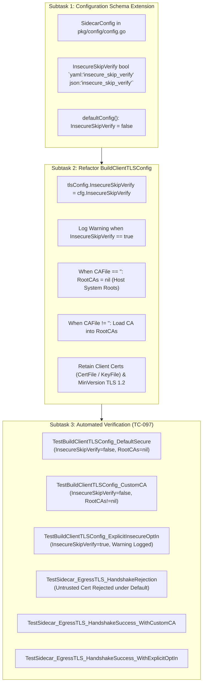

# TASK-120 - Enforce Strict Client TLS Validation by Default and Explicit InsecureSkipVerify Opt-In in Sidecar Proxy

## Description

Remediate critical security vulnerability [`SEC-35`](file:///Users/sneha/Developer/toron-research/toron/SECURITY_AUDIT.md#L474-L482) ([`SR-091 Finding 5`](file:///Users/sneha/Developer/toron-research/toron/docs/securityReview/SR-091.md#L173-L195), [CWE-295 Improper Certificate Validation](https://cwe.mitre.org/data/definitions/295.html)) by enforcing strict certificate validation by default in the sidecar client-side TLS configuration constructor ([`BuildClientTLSConfig`](file:///Users/sneha/Developer/toron-research/toron/pkg/sidecar/mtls.go#L46-L74)), introducing an explicit `insecure_skip_verify` opt-in flag in [`SidecarConfig`](file:///Users/sneha/Developer/toron-research/toron/pkg/config/config.go#L102-L115), falling back to system trust roots when no custom CA is specified, emitting high-visibility security audit warnings when certificate verification is disabled, and establishing automated verification in `pkg/sidecar/sidecar_test.go` conforming to [`REQ-097`](file:///Users/sneha/Developer/toron-research/toron/docs/requirements/REQ-097.md), [`ADR-097`](file:///Users/sneha/Developer/toron-research/toron/docs/architecture/ADR-097.md), and [`TC-097`](file:///Users/sneha/Developer/toron-research/toron/docs/testCases/TC-097.md).

---

## Problem Statement & Root Cause

In [`pkg/sidecar/mtls.go:L60-L72`](file:///Users/sneha/Developer/toron-research/toron/pkg/sidecar/mtls.go#L60-L72), `BuildClientTLSConfig` constructs the `*tls.Config` used for outbound egress connections:

```go
if cfg.CAFile != "" {
    caBytes, err := os.ReadFile(cfg.CAFile)
    if err != nil {
        return nil, fmt.Errorf("failed to read sidecar ca cert: %w", err)
    }
    caPool := x509.NewCertPool()
    caPool.AppendCertsFromPEM(caBytes)
    tlsConfig.RootCAs = caPool
} else {
    // Default to insecure verify if custom CA is omitted in test environments
    tlsConfig.InsecureSkipVerify = true
}
```

### Exploitability & Security Impact (CVSS:3.1 Score 8.1 - High)

1. **Silent Man-in-the-Middle (MITM) Interception (CWE-295)**:
   When `cfg.CAFile` is empty (the standard production deployment pattern when relying on host OS public CAs or standard cloud provider certificates), `BuildClientTLSConfig` automatically set `InsecureSkipVerify = true`. All peer certificate verification, hostname checks, and chain validation were completely disabled.
2. **Pod-to-Pod Egress Vulnerability**:
   An attacker on the same Kubernetes node, Docker network, or adjacent container could poison ARP/DNS or intercept egress routing, present any self-signed or invalid certificate, and transparently decrypt, read, and tamper with application payloads, Bearer tokens, and sensitive tenant data.
3. **Violation of Secure-by-Default Principle**:
   Bypassing certificate verification was hardcoded as the default behavior rather than requiring an explicit, auditable opt-in by the operator.

---

## Scope & Implementation Breakdown



---

### Subtask 1: Configuration Schema Extension (`pkg/config/config.go`)

- **Objective**: Extend `SidecarConfig` with an explicit opt-in boolean field `InsecureSkipVerify`, ensuring that zero-value initialization and `defaultConfig()` strictly enforce `InsecureSkipVerify == false`.
- **Files Owned**:
  - [`pkg/config/config.go`](file:///Users/sneha/Developer/toron-research/toron/pkg/config/config.go)
- **Detailed Action Items**:
  1. In [`SidecarConfig`](file:///Users/sneha/Developer/toron-research/toron/pkg/config/config.go#L103-L115), add:
     ```go
     InsecureSkipVerify bool `yaml:"insecure_skip_verify" json:"insecure_skip_verify"`
     ```
  2. In `defaultConfig()` in [`pkg/config/config.go:L577-L579`](file:///Users/sneha/Developer/toron-research/toron/pkg/config/config.go#L577-L579):
     - Ensure `SidecarConfig.InsecureSkipVerify` explicitly defaults to `false`.
  3. Verify that standard Go zero-value struct instantiation `SidecarConfig{}` evaluates `InsecureSkipVerify` to `false`.

---

### Subtask 2: Refactor `BuildClientTLSConfig` (`pkg/sidecar/mtls.go`)

- **Objective**: Enforce strict certificate validation by default, implement system trust root fallback, add audit warning logging when `InsecureSkipVerify` is enabled, and handle custom CA loading without hardcoded insecure verification.
- **Files Owned**:
  - [`pkg/sidecar/mtls.go`](file:///Users/sneha/Developer/toron-research/toron/pkg/sidecar/mtls.go)
- **Detailed Action Items**:
  1. Refactor [`BuildClientTLSConfig`](file:///Users/sneha/Developer/toron-research/toron/pkg/sidecar/mtls.go#L46-L74):
     - Remove the `else { tlsConfig.InsecureSkipVerify = true }` branch entirely.
     - Assign `tlsConfig.InsecureSkipVerify = cfg.InsecureSkipVerify`.
     - When `cfg.InsecureSkipVerify == true`, log a high-visibility security warning:
       ```go
       log.Printf("[SIDECAR] WARNING: InsecureSkipVerify is enabled for sidecar egress TLS. Certificate verification is disabled.")
       ```
     - Custom CA Handling:
       - When `cfg.CAFile != ""`, read the file, create `x509.NewCertPool()`, append PEM certs, and set `tlsConfig.RootCAs = caPool`. If file read fails, return descriptive error.
       - When `cfg.CAFile == ""`, leave `tlsConfig.RootCAs = nil`, enabling Go's `crypto/tls` runtime to validate peer certificate chains against the host operating system's trust store.
  2. Preserve Existing Cryptographic Guarantees:
     - Client identity certificates (`cfg.CertFile`, `cfg.KeyFile`) loaded via `tls.LoadX509KeyPair` and assigned to `tlsConfig.Certificates`.
     - Minimum TLS version enforced at `tls.VersionTLS12`.

---

### Subtask 3: Comprehensive Automated Verification (`pkg/sidecar/sidecar_test.go`)

- **Objective**: Implement comprehensive automated tests in [`pkg/sidecar/sidecar_test.go`](file:///Users/sneha/Developer/toron-research/toron/pkg/sidecar/sidecar_test.go) satisfying [`TC-097`](file:///Users/sneha/Developer/toron-research/toron/docs/testCases/TC-097.md).
- **Files Owned**:
  - [`pkg/sidecar/sidecar_test.go`](file:///Users/sneha/Developer/toron-research/toron/pkg/sidecar/sidecar_test.go)
- **Detailed Test Cases**:
  1. `TestBuildClientTLSConfig_DefaultSecure`:
     - Test default `SidecarConfig{}`: verify `InsecureSkipVerify == false`, `RootCAs == nil`, `MinVersion == tls.VersionTLS12`.
  2. `TestBuildClientTLSConfig_CustomCA`:
     - Generate temporary self-signed CA cert.
     - Configure `SidecarConfig{CAFile: caPath}`: verify `InsecureSkipVerify == false`, `RootCAs != nil`.
  3. `TestBuildClientTLSConfig_ExplicitInsecureOptIn`:
     - Configure `SidecarConfig{InsecureSkipVerify: true}`: verify `tlsConfig.InsecureSkipVerify == true` and audit warning is emitted.
  4. `TestSidecar_EgressTLS_HandshakeRejection`:
     - Spin up `httptest.NewTLSServer` with self-signed certificate (not trusted by host system roots).
     - Run sidecar egress client with default configuration (`InsecureSkipVerify: false`, `CAFile: ""`).
     - Verify client connection fails with TLS certificate verification error (e.g. `x509.UnknownAuthorityError` or `bad certificate`).
  5. `TestSidecar_EgressTLS_HandshakeSuccess_WithCustomCA`:
     - Spin up `httptest.NewTLSServer` with self-signed certificate.
     - Write server's certificate to temporary file and set `CAFile`.
     - Run sidecar egress client with `InsecureSkipVerify: false`: verify TLS handshake succeeds and payload is transferred.
  6. `TestSidecar_EgressTLS_HandshakeSuccess_WithExplicitOptIn`:
     - Spin up `httptest.NewTLSServer` with untrusted self-signed certificate.
     - Configure sidecar with `InsecureSkipVerify: true`, `CAFile: ""`.
     - Verify TLS handshake succeeds despite untrusted certificate.

---

## Acceptance Criteria Mapping

| Task Acceptance Criterion | Maps To Requirement AC | Description & Verification Target |
| :--- | :--- | :--- |
| **AC-01** | [`REQ-097-AC-01`](file:///Users/sneha/Developer/toron-research/toron/docs/requirements/REQ-097.md#L102-L109) | `SidecarConfig` includes `InsecureSkipVerify bool `yaml:"insecure_skip_verify" json:"insecure_skip_verify"``, defaulting to `false` in zero-value and `defaultConfig()`. |
| **AC-02** | [`REQ-097-AC-02`](file:///Users/sneha/Developer/toron-research/toron/docs/requirements/REQ-097.md#L110-L117) | `BuildClientTLSConfig` assigns `tlsConfig.InsecureSkipVerify = cfg.InsecureSkipVerify`. Default configuration strictly enforces `InsecureSkipVerify == false`. |
| **AC-03** | [`REQ-097-AC-03`](file:///Users/sneha/Developer/toron-research/toron/docs/requirements/REQ-097.md#L118-L124) | When `CAFile == ""` and `InsecureSkipVerify == false`, `RootCAs` remains `nil`, falling back to host system certificate trust roots. Untrusted certificates fail handshake. |
| **AC-04** | [`REQ-097-AC-04`](file:///Users/sneha/Developer/toron-research/toron/docs/requirements/REQ-097.md#L125-L131) | When `CAFile != ""`, CA certificates are loaded into `RootCAs`, while `InsecureSkipVerify` remains `false`. Validates against custom CA. |
| **AC-05** | [`REQ-097-AC-05`](file:///Users/sneha/Developer/toron-research/toron/docs/requirements/REQ-097.md#L132-L139) | When `InsecureSkipVerify == true`, `BuildClientTLSConfig` logs: `[SIDECAR] WARNING: InsecureSkipVerify is enabled for sidecar egress TLS. Certificate verification is disabled.` |
| **AC-06** | [`REQ-097-AC-06`](file:///Users/sneha/Developer/toron-research/toron/docs/requirements/REQ-097.md#L140-L145) | Client identity certificate pair (`CertFile`, `KeyFile`) loaded into `tlsConfig.Certificates` for mTLS upstream authentication. |
| **AC-07** | [`REQ-097-AC-07`](file:///Users/sneha/Developer/toron-research/toron/docs/requirements/REQ-097.md#L146-L148) | Minimum TLS version enforced at `tls.VersionTLS12` across all generated configs. |
| **AC-08** | [`REQ-097-AC-08`](file:///Users/sneha/Developer/toron-research/toron/docs/requirements/REQ-097.md#L149-L152) | Pure Go standard library implementation (`crypto/tls`, `crypto/x509`, `log`, `fmt`, `os`). 100% data-race-free under `go test -race`. |
| **AC-09** | [`REQ-097-AC-09`](file:///Users/sneha/Developer/toron-research/toron/docs/requirements/REQ-097.md#L153-L161) | Complete automated test suite in `pkg/sidecar/sidecar_test.go` covering all unit and end-to-end handshake scenarios specified in [`TC-097`](file:///Users/sneha/Developer/toron-research/toron/docs/testCases/TC-097.md). |

---

## Traceability Matrix

| Artifact | Reference | Relationship | Description |
| :--- | :--- | :--- | :--- |
| **Security Finding** | [`SEC-35`](file:///Users/sneha/Developer/toron-research/toron/SECURITY_AUDIT.md#L474-L482) | Remediates | Insecure Default `InsecureSkipVerify` in Sidecar Client TLS Configuration |
| **Security Review** | [`SR-091`](file:///Users/sneha/Developer/toron-research/toron/docs/securityReview/SR-091.md#L173-L195) | Remediates | Finding 5 (SEC-35): Default InsecureSkipVerify in sidecar mTLS client config |
| **Requirement** | [`REQ-097`](file:///Users/sneha/Developer/toron-research/toron/docs/requirements/REQ-097.md) | Implements | Secure Default Certificate Validation and Explicit InsecureSkipVerify Opt-In |
| **Foundational Security REQ** | [`REQ-008`](file:///Users/sneha/Developer/toron-research/toron/docs/requirements/REQ-008.md) | Adheres to | TLS Termination and Cryptographic Protocol Standards |
| **Architecture Decision** | [`ADR-097`](file:///Users/sneha/Developer/toron-research/toron/docs/architecture/ADR-097.md) | Governed by | Secure Default Sidecar Egress TLS Configuration & Opt-In InsecureSkipVerify |
| **Verification Test Case** | [`TC-097`](file:///Users/sneha/Developer/toron-research/toron/docs/testCases/TC-097.md) | Verified by | Automated Verification Suite for Sidecar Client TLS Validation & Insecure Opt-In |

---

## Rationale & Threat Mitigation

| Threat / Flaw | Vulnerability Classification | Prior Behavior | Remediated Behavior |
| :--- | :--- | :--- | :--- |
| **Egress MITM Attack** | [CWE-295 Improper Certificate Validation](https://cwe.mitre.org/data/definitions/295.html) | `BuildClientTLSConfig` hardcoded `InsecureSkipVerify = true` when `CAFile == ""`. | `InsecureSkipVerify` defaults to `false`. Peer certificates strictly validated against system trust roots. |
| **Credential / Token Interception** | Plaintext Interception | Attacker spoofing upstream service intercepted requests with self-signed certificate. | TLS handshake fails (`x509.UnknownAuthorityError`); connection immediately aborted. |
| **Silent Security Degradation** | Lack of Auditability | Deployments omitting `CAFile` operated insecurely with zero warning. | Secure by default; explicit `insecure_skip_verify: true` generates prominent audit warning log. |
| **Protocol Downgrade Attack** | Protocol Insecurity | Minimum TLS version could be weakened. | `tlsConfig.MinVersion = tls.VersionTLS12` strictly enforced. |

---

## Constraints & Non-Functional Requirements

- **Secure-by-Default Invariant**: `InsecureSkipVerify` MUST evaluate to `false` in all standard configurations and zero-value struct initializations.
- **Fail-Closed Security Invariant**: Untrusted or invalid peer certificates MUST cause immediate handshake abort and connection termination.
- **Zero Third-Party Dependencies**: Pure Go standard library (`crypto/tls`, `crypto/x509`, `log`, `fmt`, `os`).
- **Thread Safety**: 100% data-race-free under `go test -race ./pkg/sidecar/... ./pkg/config/...`.
