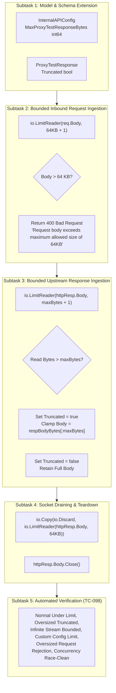

# TASK-121 - Bounded Request Ingestion and Upstream Response Buffering in Internal API Proxy Test Probe

## Description

Remediate critical security vulnerability [`SEC-36`](file:///Users/sneha/Developer/toron-research/toron/SECURITY_AUDIT.md#L483-L491) ([`SR-091 Finding 6`](file:///Users/sneha/Developer/toron-research/toron/docs/securityReview/SR-091.md#L197-L212), [CWE-400 Uncontrolled Resource Consumption](https://cwe.mitre.org/data/definitions/400.html), [CWE-770 Allocation of Resources Without Limits or Throttling](https://cwe.mitre.org/data/definitions/770.html), [CWE-775 Missing Release of File Descriptor or Handle](https://cwe.mitre.org/data/definitions/775.html)) by implementing strictly bounded request body ingestion (64 KB cap), configurable upstream response clamping with truncation signaling (default 1 MB cap), and clean keep-alive socket connection draining in `POST /internal/api/proxy-test` ([`pkg/server/internal_api.go`](file:///Users/sneha/Developer/toron-research/toron/pkg/server/internal_api.go)).

This task establishes:
1. Configuration schema extension in `InternalAPIConfig`: `MaxProxyTestResponseBytes int64` (defaulting to 1 MB if omitted, 0, or negative).
2. Diagnostic output schema extension in `ProxyTestResponse`: `Truncated bool `json:"truncated,omitempty"``.
3. Bounded inbound request body ingestion on `POST /internal/api/proxy-test` using `io.LimitReader(req.Body, 64*1024+1)`, returning HTTP 400 Bad Request if the payload exceeds 64 KB or contains invalid JSON.
4. Bounded upstream response body ingestion using `io.LimitReader(httpResp.Body, maxBytes+1)`, clamping to `maxBytes` on overflow and setting `Truncated = true`.
5. Residual connection stream draining via `io.Copy(io.Discard, io.LimitReader(httpResp.Body, 64*1024))` followed by `httpResp.Body.Close()`, ensuring HTTP/1.1 transport connection reuse without socket descriptor leaks (`EMFILE`).
6. Comprehensive automated test suite in `pkg/server/internal_api_test.go` conforming to [`REQ-098`](file:///Users/sneha/Developer/toron-research/toron/docs/requirements/REQ-098.md), [`ADR-098`](file:///Users/sneha/Developer/toron-research/toron/docs/architecture/ADR-098.md), and [`TC-098`](file:///Users/sneha/Developer/toron-research/toron/docs/testCases/TC-098.md).

---

## Problem Statement & Root Cause

In [`pkg/server/internal_api.go:L516-L669`](file:///Users/sneha/Developer/toron-research/toron/pkg/server/internal_api.go#L516-L669), `POST /internal/api/proxy-test` allows administrators to test upstream reverse proxy paths. The handler suffered from three major resource management defects:

1. **Unbounded Inbound Request Ingestion (CWE-400)**:
   ```go
   bodyBytes, err := io.ReadAll(req.Body)
   ```
   The client's JSON request was read entirely into memory without length limitation. An attacker or client transmitting a massive payload (e.g. 500 MB) forced unbounded heap allocation.
2. **Unbounded Upstream Response Buffering (CWE-400 / CWE-770)**:
   ```go
   respBodyBytes, _ := io.ReadAll(httpResp.Body)
   ```
   If the probed upstream endpoint returned an unbounded or high-volume stream (e.g. `/dev/urandom`, infinite SSE, or multi-gigabyte ISO download), `io.ReadAll` continuously expanded internal buffers until heap exhaustion triggered the OS Out-Of-Memory (OOM) killer, crashing the entire gateway.
3. **Socket Descriptor Exhaustion & Connection Hangs (CWE-775)**:
   Simply truncating a stream without draining residual bytes leaves unread data pending on the TCP socket. As a result, the HTTP transport cannot reuse the connection, leading to lingering open sockets, socket descriptor exhaustion (`EMFILE`), and transport pool degradation.

---

## Scope & Implementation Breakdown



---

### Subtask 1: Model & Schema Extension (`pkg/server/internal_api.go`)

- **Objective**: Extend configuration and response models to support configurable response limits and truncation signaling.
- **Files Owned**:
  - [`pkg/server/internal_api.go`](file:///Users/sneha/Developer/toron-research/toron/pkg/server/internal_api.go)
- **Detailed Action Items**:
  1. In [`InternalAPIConfig`](file:///Users/sneha/Developer/toron-research/toron/pkg/server/internal_api.go#L38-L69), add:
     ```go
     MaxProxyTestResponseBytes int64 `json:"max_proxy_test_response_bytes,omitempty"`
     ```
  2. In [`ProxyTestResponse`](file:///Users/sneha/Developer/toron-research/toron/pkg/server/internal_api.go#L91-L97), add:
     ```go
     Truncated bool `json:"truncated,omitempty"`
     ```

---

### Subtask 2: Bounded Inbound Request Ingestion (`pkg/server/internal_api.go`)

- **Objective**: Prevent client request body memory exhaustion by enforcing a strict 64 KB cap on `POST /internal/api/proxy-test`.
- **Files Owned**:
  - [`pkg/server/internal_api.go`](file:///Users/sneha/Developer/toron-research/toron/pkg/server/internal_api.go)
- **Detailed Action Items**:
  1. In the handler for `POST /internal/api/proxy-test`:
     - Read incoming body using a bounded reader:
       ```go
       const maxInboundReqBytes = 64 * 1024 // 64 KB
       bodyBytes, err := io.ReadAll(io.LimitReader(req.Body, maxInboundReqBytes+1))
       ```
     - Check for empty body or read errors:
       ```go
       if err != nil || len(bodyBytes) == 0 {
           res.SetStatus(http.StatusBadRequest)
           _, _ = res.WriteString(`{"error":"400 Bad Request","message":"Missing or invalid request body"}`)
           return
       }
       ```
     - Check if body exceeds 64 KB:
       ```go
       if int64(len(bodyBytes)) > maxInboundReqBytes {
           res.SetStatus(http.StatusBadRequest)
           _, _ = res.WriteString(`{"error":"400 Bad Request","message":"Request body exceeds maximum allowed size of 64KB"}`)
           return
       }
       ```
     - Validate JSON syntax:
       ```go
       var testReq ProxyTestRequest
       if err := json.Unmarshal(bodyBytes, &testReq); err != nil {
           res.SetStatus(http.StatusBadRequest)
           _, _ = res.WriteString(`{"error":"400 Bad Request","message":"Invalid JSON body"}`)
           return
       }
       ```

---

### Subtask 3: Bounded Upstream Response Ingestion & Truncation (`pkg/server/internal_api.go`)

- **Objective**: Prevent upstream heap exhaustion by bounding upstream response body buffering with configurable limit, clamping to `maxBytes` and flagging `Truncated: true`.
- **Files Owned**:
  - [`pkg/server/internal_api.go`](file:///Users/sneha/Developer/toron-research/toron/pkg/server/internal_api.go)
- **Detailed Action Items**:
  1. Determine effective maximum bytes:
     ```go
     maxRespBytes := cfg.MaxProxyTestResponseBytes
     if maxRespBytes <= 0 {
         maxRespBytes = 1024 * 1024 // 1 MB default fallback
     }
     ```
  2. Ingest upstream response using `io.LimitReader`:
     ```go
     limitedReader := io.LimitReader(httpResp.Body, maxRespBytes+1)
     respBodyBytes, _ := io.ReadAll(limitedReader)
     ```
  3. Detect overflow, clamp slice, and set `Truncated` flag:
     ```go
     truncated := false
     if int64(len(respBodyBytes)) > maxRespBytes {
         respBodyBytes = respBodyBytes[:maxRespBytes]
         truncated = true
     }
     ```
  4. Populate `resOut := ProxyTestResponse`:
     - Assign `Truncated: truncated` alongside existing status, headers, latency, and body fields.

---

### Subtask 4: Socket Draining & Teardown (`pkg/server/internal_api.go`)

- **Objective**: Prevent socket leaks (`EMFILE`) and ensure keep-alive connection reuse by safely draining residual bytes and cleanly closing the upstream response body.
- **Files Owned**:
  - [`pkg/server/internal_api.go`](file:///Users/sneha/Developer/toron-research/toron/pkg/server/internal_api.go)
- **Detailed Action Items**:
  1. Prior to serializing the test response, safely drain up to 64 KB of residual unread bytes from `httpResp.Body`:
     ```go
     _, _ = io.Copy(io.Discard, io.LimitReader(httpResp.Body, 64*1024))
     ```
  2. Explicitly close `httpResp.Body`:
     ```go
     _ = httpResp.Body.Close()
     ```
  3. Ensure that if `httpResp.Body` was an infinite stream, reading terminates immediately at `maxRespBytes + 1` plus the 64 KB discard drain without hanging or leaking goroutines.

---

### Subtask 5: Comprehensive Automated Verification (`pkg/server/internal_api_test.go`)

- **Objective**: Implement automated unit and integration tests covering all requirements and scenarios specified in [`TC-098`](file:///Users/sneha/Developer/toron-research/toron/docs/testCases/TC-098.md).
- **Files Owned**:
  - [`pkg/server/internal_api_test.go`](file:///Users/sneha/Developer/toron-research/toron/pkg/server/internal_api_test.go)
- **Detailed Test Cases**:
  1. `TestProxyTest_NormalResponse_UnderLimit`:
     - Upstream returns 512 bytes.
     - Verify complete body returned, `truncated == false`, status 200 OK.
  2. `TestProxyTest_OversizedResponse_Truncated`:
     - Upstream returns 2 MB response.
     - Default limit (1 MB) applied.
     - Verify response body clamped to exactly 1 MB (`1048576` bytes), `truncated == true`, upstream status code preserved.
  3. `TestProxyTest_InfiniteStream_BoundedTermination`:
     - Upstream handler writes continuous chunked stream (infinite `/dev/urandom` generator).
     - Verify probe completes promptly (within timeout), allocates bounded memory $\le 1\text{ MB}$, sets `truncated == true`, and socket is cleanly closed without hanging.
  4. `TestProxyTest_CustomConfiguredLimit`:
     - Configure `MaxProxyTestResponseBytes: 256 * 1024` (256 KB).
     - Upstream returns 512 KB.
     - Verify body clamped to 256 KB, `truncated == true`.
  5. `TestProxyTest_OversizedRequestBody_Rejection`:
     - Send request body of 65 KB (`64*1024 + 1024` bytes).
     - Verify HTTP 400 Bad Request with message `"Request body exceeds maximum allowed size of 64KB"`.
     - Verify no upstream request was dispatched.
  6. `TestProxyTest_ConcurrentProbes_RaceClean`:
     - Execute 20 concurrent proxy test probes mixing normal, oversized, and infinite streams.
     - Verify race-free execution under `go test -race ./pkg/server/...`.

---

## Acceptance Criteria Mapping

| Task Acceptance Criterion | Maps To Requirement AC | Description & Verification Target |
| :--- | :--- | :--- |
| **AC-01** | [`REQ-098-AC-01`](file:///Users/sneha/Developer/toron-research/toron/docs/requirements/REQ-098.md#L85-L92) | `InternalAPIConfig` includes `MaxProxyTestResponseBytes int64`, defaulting to 1 MB (`1048576` bytes) when omitted, 0, or negative. |
| **AC-02** | [`REQ-098-AC-02`](file:///Users/sneha/Developer/toron-research/toron/docs/requirements/REQ-098.md#L93-L105) | Upstream response read with `io.LimitReader(httpResp.Body, maxBytes+1)`. Clamped to `maxBytes` on overflow and `Truncated: true` set. Under-limit responses untouched with `Truncated: false`. |
| **AC-03** | [`REQ-098-AC-03`](file:///Users/sneha/Developer/toron-research/toron/docs/requirements/REQ-098.md#L106-L114) | `ProxyTestResponse` includes `Truncated bool `json:"truncated,omitempty"``. |
| **AC-04** | [`REQ-098-AC-04`](file:///Users/sneha/Developer/toron-research/toron/docs/requirements/REQ-098.md#L115-L127) | Inbound client request body limited to 64 KB via `io.LimitReader(req.Body, 64*1024+1)`. Overflow returns HTTP 400 Bad Request immediately. |
| **AC-05** | [`REQ-098-AC-05`](file:///Users/sneha/Developer/toron-research/toron/docs/requirements/REQ-098.md#L128-L136) | Residual response stream safely drained up to 64 KB (`io.Copy(io.Discard, ...)`) and `httpResp.Body.Close()` invoked, enabling keep-alive connection reuse and avoiding `EMFILE` leaks. |
| **AC-06** | [`REQ-098-AC-06`](file:///Users/sneha/Developer/toron-research/toron/docs/requirements/REQ-098.md#L137-L139) | Pure Go standard library implementation (`io`, `net/http`, `encoding/json`, `fmt`, `time`, `strings`). Zero external dependencies. |
| **AC-07** | [`REQ-098-AC-07`](file:///Users/sneha/Developer/toron-research/toron/docs/requirements/REQ-098.md#L140-L143) | Handler is thread-safe and 100% data-race-free under `go test -race ./pkg/server/...`. |
| **AC-08** | [`REQ-098-AC-08`](file:///Users/sneha/Developer/toron-research/toron/docs/requirements/REQ-098.md#L144-L152) | Automated test suite in `pkg/server/internal_api_test.go` covering all 6 scenarios in [`TC-098`](file:///Users/sneha/Developer/toron-research/toron/docs/testCases/TC-098.md). |

---

## Traceability Matrix

| Artifact | Reference | Relationship | Description |
| :--- | :--- | :--- | :--- |
| **Security Finding** | [`SEC-36`](file:///Users/sneha/Developer/toron-research/toron/SECURITY_AUDIT.md#L483-L491) | Remediates | Memory Exhaustion via Unbounded Upstream Response Buffering in Internal API Proxy Test Probe |
| **Security Review** | [`SR-091`](file:///Users/sneha/Developer/toron-research/toron/docs/securityReview/SR-091.md#L197-L212) | Remediates | Finding 6 (SEC-36): Unbounded Response Buffering in internal API proxy-test |
| **Requirement** | [`REQ-098`](file:///Users/sneha/Developer/toron-research/toron/docs/requirements/REQ-098.md) | Implements | Bounded Request Ingestion and Upstream Response Buffering in Internal API Proxy Test Probe |
| **Foundational Routing REQ** | [`REQ-001`](file:///Users/sneha/Developer/toron-research/toron/docs/requirements/REQ-001.md), [`REQ-008`](file:///Users/sneha/Developer/toron-research/toron/docs/requirements/REQ-008.md) | Adheres to | Core Routing Engine & Security Standards |
| **Prior Management API REQ** | [`REQ-047`](file:///Users/sneha/Developer/toron-research/toron/docs/requirements/REQ-047.md) | Extends | Administrative Route Management & Diagnostic Probes |
| **Architecture Decision (New)** | [`ADR-098`](file:///Users/sneha/Developer/toron-research/toron/docs/architecture/ADR-098.md) | Governed by | Bounded Upstream Response Buffering and Ingress Limiting in Proxy Test API |
| **Verification Test Case** | [`TC-098`](file:///Users/sneha/Developer/toron-research/toron/docs/testCases/TC-098.md) | Verified by | Automated Verification Suite for Bounded Proxy Test Response and Ingress Limiting |

---

## Rationale & Threat Mitigation

| Threat Scenario | Vulnerability Classification | Prior Behavior | Remediated Behavior |
| :--- | :--- | :--- | :--- |
| **Upstream OOM Exhaustion** | [CWE-400](https://cwe.mitre.org/data/definitions/400.html) / [CWE-770](https://cwe.mitre.org/data/definitions/770.html) | `io.ReadAll(httpResp.Body)` with zero limit. Infinite stream triggered OOM crash. | Ingestion bounded by `io.LimitReader` (default 1 MB). Body clamped; `truncated: true` returned. |
| **Inbound Request Memory Exhaustion** | [CWE-400](https://cwe.mitre.org/data/definitions/400.html) | `io.ReadAll(req.Body)` with zero limit. Massive JSON allocated large heap buffers. | Inbound request body capped at 64 KB. Excess bytes rejected with HTTP 400 Bad Request. |
| **Socket Descriptor Exhaustion** | [CWE-775](https://cwe.mitre.org/data/definitions/775.html) | Unread response streams left lingering, leaking sockets and preventing connection reuse. | Residual stream safely drained (up to 64 KB) and `httpResp.Body.Close()` invoked. |
| **Misleading Diagnostic Results** | Observability Flaw | Operator unaware that diagnostic response was incomplete. | `Truncated: true` explicitly reported in response JSON schema. |

---

## Constraints & Non-Functional Requirements

- **Memory Bound Invariant**: Ingesting an infinite or multi-gigabyte upstream stream MUST NOT allocate more than $O(\text{maxBytes})$ heap memory (default $\le 1\text{ MB} + \epsilon$).
- **Bounded Ingress Invariant**: Ingestion of inbound client requests for proxy tests MUST NOT exceed 64 KB.
- **Fail-Safe Socket Cleanup Invariant**: Upstream response bodies MUST be cleanly drained and closed upon reading, preventing socket leaks (`EMFILE`).
- **Zero Third-Party Dependencies**: Pure Go standard library implementation only (`io`, `net/http`, `encoding/json`, `fmt`, `time`, `strings`).
- **Thread Safety**: 100% data-race-free under `go test -race ./pkg/server/...`.
