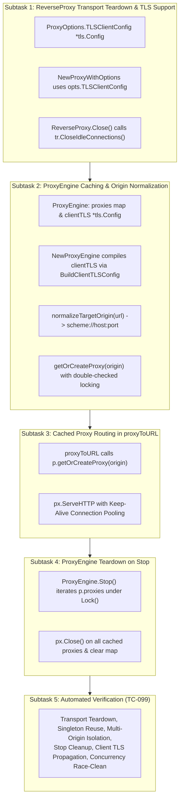

# TASK-122 - Thread-Safe ReverseProxy Caching, Transport Teardown, and Client mTLS Lifecycle Management in Service Mesh Sidecar Proxy

## Description

Remediate critical security vulnerability [`SEC-37`](file:///Users/sneha/Developer/toron-research/toron/SECURITY_AUDIT.md#L492-L500) ([`SR-091 Finding 7`](file:///Users/sneha/Developer/toron-research/toron/docs/securityReview/SR-091.md), [CWE-400 Uncontrolled Resource Consumption](https://cwe.mitre.org/data/definitions/400.html), [CWE-772 Missing Release of Resource after Effective Lifetime](https://cwe.mitre.org/data/definitions/772.html)) by implementing thread-safe `ReverseProxy` caching in the Service Mesh Sidecar ProxyEngine ([`pkg/sidecar/proxy.go`](file:///Users/sneha/Developer/toron-research/toron/pkg/sidecar/proxy.go)), closing idle transport connections upon proxy teardown and engine shutdown ([`pkg/proxy/proxy.go`](file:///Users/sneha/Developer/toron-research/toron/pkg/proxy/proxy.go)), normalizing target cache keys to canonical origin schemes (`scheme://host[:port]`), and seamlessly propagating client mTLS configurations to cached upstream transports adhering to [`REQ-099`](file:///Users/sneha/Developer/toron-research/toron/docs/requirements/REQ-099.md), [`ADR-099`](file:///Users/sneha/Developer/toron-research/toron/docs/architecture/ADR-099.md), and [`TC-099`](file:///Users/sneha/Developer/toron-research/toron/docs/testCases/TC-099.md).

---

## Problem Statement & Architectural Context

In [`pkg/sidecar/proxy.go:L192-L202`](file:///Users/sneha/Developer/toron-research/toron/pkg/sidecar/proxy.go#L192-L202), every outbound HTTP request intercepted by the egress listener triggered `proxyToURL`:

```go
func (p *ProxyEngine) proxyToURL(w http.ResponseWriter, r *http.Request, targetURL string) {
    opts := proxy.ProxyOptions{
        Targets: []string{targetURL},
    }

    px, err := proxy.NewProxyWithOptions(opts)
    if err != nil {
        http.Error(w, fmt.Sprintf("Sidecar proxy error: %v", err), http.StatusBadGateway)
        return
    }
    ...
    px.ServeHTTP(toronReq, toronRes)
    ...
}
```

### Critical Architectural Flaws & Vulnerabilities

1. **Per-Request Client & Transport Allocation (CWE-400 / CWE-772)**:
   For every outbound request, `proxy.NewProxyWithOptions` allocated a brand-new `*proxy.ReverseProxy`, a new `*http.Client`, and a new `*http.Transport` with its own connection pool (`MaxIdleConns: 100`, `IdleConnTimeout: 90s`). Transports were never reused across requests or closed after request completion. Under microservice production load (500–5,000 req/sec), thousands of idle TCP sockets accumulated simultaneously, precipitating file descriptor exhaustion (`EMFILE: too many open files`), severe GC thrashing, memory bloat, and total sidecar crash.
2. **Missing Idle Connection Teardown in `ReverseProxy.Close()` (CWE-772)**:
   In [`pkg/proxy/proxy.go:L596-L600`](file:///Users/sneha/Developer/toron-research/toron/pkg/proxy/proxy.go#L596-L600), `ReverseProxy.Close()` only halted load balancer health checks (`p.Balancer.Stop()`). It omitted closing idle connections on `p.Client.Transport.(*http.Transport)`, leaving connections lingering until remote servers terminated them.
3. **Cache Key Explosion via Dynamic Request Paths**:
   Dynamic target URLs include variable path segments and query parameters (e.g. `http://service-b:8080/users/1` vs `http://service-b:8080/users/2`). Caching directly on raw target URLs would cause map keys to proliferate unbounded ($O(N)$ with request volume), inducing memory exhaustion.
4. **Client mTLS Configuration Disconnect**:
   `proxyToURL` instantiated `NewProxyWithOptions` without passing client TLS configuration. Sidecar client TLS settings configured on `SidecarConfig` (custom `CAFile`, client certificates `CertFile`/`KeyFile`, and `InsecureSkipVerify` from [`REQ-097`](file:///Users/sneha/Developer/toron-research/toron/docs/requirements/REQ-097.md)) were ignored during egress proxying, breaking mTLS encryption and certificate trust verification.

---

## Scope & Implementation Breakdown



---

### Subtask 1: ReverseProxy Transport Teardown & Client TLS Support (`pkg/proxy/proxy.go`)

- **Objective**: Add `TLSClientConfig` support to `ProxyOptions` and ensure `ReverseProxy.Close()` cleans up idle TCP connections on the underlying HTTP transport.
- **Files Owned**:
  - [`pkg/proxy/proxy.go`](file:///Users/sneha/Developer/toron-research/toron/pkg/proxy/proxy.go)
- **Detailed Action Items**:
  1. In [`ProxyOptions`](file:///Users/sneha/Developer/toron-research/toron/pkg/proxy/proxy.go#L441-L467), add:
     ```go
     TLSClientConfig *tls.Config
     ```
  2. In [`NewProxyWithOptions`](file:///Users/sneha/Developer/toron-research/toron/pkg/proxy/proxy.go#L479-L593):
     - Check if `opts.TLSClientConfig != nil`:
       ```go
       if opts.TLSClientConfig != nil {
           tr.TLSClientConfig = opts.TLSClientConfig
       }
       ```
     - If `opts.TLSClientConfig == nil`, preserve existing TLS resolution logic (`insecureSkipVerify`, `caPool`).
  3. In [`ReverseProxy.Close()`](file:///Users/sneha/Developer/toron-research/toron/pkg/proxy/proxy.go#L596-L600):
     - In addition to `p.Balancer.Stop()`, close idle transport connections:
       ```go
       if p.Client != nil {
           if tr, ok := p.Client.Transport.(*http.Transport); ok {
               tr.CloseIdleConnections()
           }
       }
       ```
     - Guarantees immediate release of idle TCP sockets upon reverse proxy eviction or teardown.

---

### Subtask 2: Thread-Safe Proxy Caching & Origin Normalization (`pkg/sidecar/proxy.go`)

- **Objective**: Extend `ProxyEngine` with origin-normalized reverse proxy caching, compile client TLS once during initialization, and implement double-checked locking for safe proxy retrieval.
- **Files Owned**:
  - [`pkg/sidecar/proxy.go`](file:///Users/sneha/Developer/toron-research/toron/pkg/sidecar/proxy.go)
- **Detailed Action Items**:
  1. Extend [`ProxyEngine`](file:///Users/sneha/Developer/toron-research/toron/pkg/sidecar/proxy.go#L23-L34):
     ```go
     type ProxyEngine struct {
         mu              sync.RWMutex
         cfg             config.SidecarConfig
         router          *router.Router
         splitters       map[string]*WeightedSplitter
         proxies         map[string]*proxy.ReverseProxy // origin -> *proxy.ReverseProxy
         clientTLS       *tls.Config
         ingressServer   *http.Server
         egressServer    *http.Server
         ingressListener net.Listener
         egressListener  net.Listener
         cancel          context.CancelFunc
         running         bool
     }
     ```
  2. In [`NewProxyEngine`](file:///Users/sneha/Developer/toron-research/toron/pkg/sidecar/proxy.go#L37-L74):
     - Initialize `proxies := make(map[string]*proxy.ReverseProxy)`.
     - Compile client TLS config:
       ```go
       clientTLS, err := BuildClientTLSConfig(cfg)
       if err != nil {
           return nil, fmt.Errorf("sidecar client tls init failed: %w", err)
       }
       ```
     - Assign `proxies` and `clientTLS` to the engine instance.
  3. Implement canonical origin normalizer `normalizeTargetOrigin(targetURL string) (string, error)`:
     - If `targetURL` does not start with `http://` or `https://`:
       - Prepend `http://`.
     - Parse via `url.Parse(targetURL)`.
     - Scheme: lowercase (`strings.ToLower(u.Scheme)`).
     - Host: lowercase (`strings.ToLower(u.Host)`).
     - Return `fmt.Sprintf("%s://%s", scheme, host)`.
     - Strip all path segments, query parameters, and fragments.
     - Guarantees that `/users/1` and `/users/2` on `http://order-svc:8080` resolve to identical key `http://order-svc:8080`.
  4. Implement `getOrCreateProxy(rawTargetURL string) (*proxy.ReverseProxy, error)`:
     - Normalize `origin, err := normalizeTargetOrigin(rawTargetURL)`. If error, return error.
     - Fast-path (read lock):
       ```go
       p.mu.RLock()
       px, found := p.proxies[origin]
       p.mu.RUnlock()
       if found {
           return px, nil
       }
       ```
     - Slow-path (write lock):
       ```go
       p.mu.Lock()
       defer p.mu.Unlock()
       if px, found := p.proxies[origin]; found {
           return px, nil
       }
       opts := proxy.ProxyOptions{
           Targets:         []string{origin},
           TLSClientConfig: p.clientTLS,
       }
       newPx, err := proxy.NewProxyWithOptions(opts)
       if err != nil {
           return nil, err
       }
       p.proxies[origin] = newPx
       return newPx, nil
       ```

---

### Subtask 3: Cached Proxy Routing in `proxyToURL` (`pkg/sidecar/proxy.go`)

- **Objective**: Refactor `proxyToURL` to fetch the cached reverse proxy instead of instantiating new proxies per request, enabling TCP connection pooling and keep-alive reuse.
- **Files Owned**:
  - [`pkg/sidecar/proxy.go`](file:///Users/sneha/Developer/toron-research/toron/pkg/sidecar/proxy.go)
- **Detailed Action Items**:
  1. In `proxyToURL(w http.ResponseWriter, r *http.Request, targetURL string)`:
     - Replace per-request `proxy.NewProxyWithOptions` with:
       ```go
       px, err := p.getOrCreateProxy(targetURL)
       if err != nil {
           http.Error(w, fmt.Sprintf("Sidecar proxy error: %v", err), http.StatusBadGateway)
           return
       }
       ```
  2. In `startEgressListener`:
     - Maintain original request path and query for forwarding while passing target to `proxyToURL`.
  3. Ensure that when `px.ServeHTTP(toronReq, toronRes)` executes, requests targeting the same origin reuse the underlying transport's pooled TCP connections.

---

### Subtask 4: ProxyEngine Teardown on Stop (`pkg/sidecar/proxy.go`)

- **Objective**: Guarantee zero socket leaks on sidecar shutdown by closing all cached reverse proxies and their idle transport connections.
- **Files Owned**:
  - [`pkg/sidecar/proxy.go`](file:///Users/sneha/Developer/toron-research/toron/pkg/sidecar/proxy.go)
- **Detailed Action Items**:
  1. In `ProxyEngine.Stop()`:
     - Acquire `p.mu.Lock()`:
       ```go
       for _, px := range p.proxies {
           if px != nil {
               px.Close()
           }
       }
       p.proxies = make(map[string]*proxy.ReverseProxy)
       ```
     - Release `p.mu.Unlock()`.
  2. Ensure all idle socket connections across all upstream origins are immediately closed.

---

### Subtask 5: Automated Verification Suite (`pkg/sidecar/sidecar_test.go`)

- **Objective**: Implement comprehensive automated tests in `pkg/sidecar/sidecar_test.go` verifying transport caching, origin normalization, mTLS propagation, teardown, and race-free concurrency adhering to [`TC-099`](file:///Users/sneha/Developer/toron-research/toron/docs/testCases/TC-099.md).
- **Files Owned**:
  - [`pkg/sidecar/sidecar_test.go`](file:///Users/sneha/Developer/toron-research/toron/pkg/sidecar/sidecar_test.go)
- **Detailed Test Cases**:
  1. `TestReverseProxy_Close_ClosesIdleConnections`:
     - Set up an HTTP test server.
     - Create a `ReverseProxy` with `NewProxyWithOptions`, make a request to establish an idle keep-alive connection.
     - Call `px.Close()`. Verify idle connections are closed and socket descriptors released.
  2. `TestProxyEngine_ProxyCaching_SingletonPerOrigin`:
     - Send 50 sequential requests across varying paths (`/users/1`, `/users/2`, `/orders/100`) to the same backend.
     - Inspect `p.proxies`: verify exactly 1 `ReverseProxy` is instantiated and cached for that origin.
  3. `TestProxyEngine_OriginNormalization`:
     - Test various URL formats (`http://svc:8080/a/b?c=d#frag`, `HTTP://SVC:8080`, `svc:8080/test`).
     - Verify all normalize to canonical `http://svc:8080`.
  4. `TestProxyEngine_MultiOrigin_Isolation`:
     - Send requests to two distinct backends (`http://backend1:8001` and `http://backend2:8002`).
     - Verify `p.proxies` contains exactly 2 distinct proxies and transport instances.
  5. `TestProxyEngine_Stop_CleansUpAllProxies`:
     - Initialize `ProxyEngine`, generate cached proxies via requests.
     - Call `engine.Stop()`.
     - Verify all proxies are closed, idle connections terminated, and `p.proxies` is emptied.
  6. `TestProxyEngine_ClientTLS_Propagation`:
     - Configure `SidecarConfig` with custom CA and client certificate.
     - Create `ProxyEngine` and verify `getOrCreateProxy` constructs proxy with `opts.TLSClientConfig == p.clientTLS`.
     - Send HTTPS request to mTLS test server: verify successful handshake and client certificate presentation.
  7. `TestProxyEngine_HighConcurrency_RaceClean`:
     - High-concurrency test: 50 concurrent goroutines sending 500 requests across diverse endpoints through `proxyToURL`.
     - Verify 100% success rate, bounded memory, and zero data races under `go test -race ./pkg/sidecar/... ./pkg/proxy/...`.

---

## Acceptance Criteria Mapping

| Task Acceptance Criterion | Maps To Requirement AC | Description & Verification Target |
| :--- | :--- | :--- |
| **AC-01** | [`REQ-099-AC-01`](file:///Users/sneha/Developer/toron-research/toron/docs/requirements/REQ-099.md#L101-L112) | `ReverseProxy.Close()` invokes `tr.CloseIdleConnections()` on `p.Client.Transport.(*http.Transport)`, immediately terminating idle sockets. |
| **AC-02** | [`REQ-099-AC-02`](file:///Users/sneha/Developer/toron-research/toron/docs/requirements/REQ-099.md#L113-L126) | `ProxyOptions` extended with `TLSClientConfig *tls.Config`. `NewProxyWithOptions` attaches pre-built `TLSClientConfig` to transport. |
| **AC-03** | [`REQ-099-AC-03`](file:///Users/sneha/Developer/toron-research/toron/docs/requirements/REQ-099.md#L127-L141) | `ProxyEngine` includes `proxies map[string]*proxy.ReverseProxy` and `clientTLS *tls.Config`. Thread-safe `getOrCreateProxy` uses double-checked locking. |
| **AC-04** | [`REQ-099-AC-04`](file:///Users/sneha/Developer/toron-research/toron/docs/requirements/REQ-099.md#L142-L149) | Target URLs normalized to canonical origin `scheme://host[:port]`. Cache map memory is $O(U)$ bounded by number of upstream services. |
| **AC-05** | [`REQ-099-AC-05`](file:///Users/sneha/Developer/toron-research/toron/docs/requirements/REQ-099.md#L150-L155) | `proxyToURL` fetches cached proxy via `getOrCreateProxy`. Per-request `NewProxyWithOptions` allocation eliminated. HTTP keep-alive connection reuse active. |
| **AC-06** | [`REQ-099-AC-06`](file:///Users/sneha/Developer/toron-research/toron/docs/requirements/REQ-099.md#L156-L161) | `ProxyEngine.Stop()` invokes `px.Close()` on all cached proxies and resets map, preventing socket descriptor leaks on shutdown. |
| **AC-07** | [`REQ-099-AC-07`](file:///Users/sneha/Developer/toron-research/toron/docs/requirements/REQ-099.md#L162-L168) | `p.clientTLS` propagated to cached proxies via `opts.TLSClientConfig`. Egress mTLS and custom CA validation strictly enforced. |
| **AC-08** | [`REQ-099-AC-08`](file:///Users/sneha/Developer/toron-research/toron/docs/requirements/REQ-099.md#L169-L171) | Pure Go standard library packages (`net/http`, `crypto/tls`, `sync`, `net/url`, `io`, `fmt`, `time`, `strings`). Zero external dependencies. |
| **AC-09** | [`REQ-099-AC-09`](file:///Users/sneha/Developer/toron-research/toron/docs/requirements/REQ-099.md#L172-L175) | Caching and request forwarding 100% thread-safe. Zero data races under `go test -race ./pkg/sidecar/... ./pkg/proxy/...`. |
| **AC-10** | [`REQ-099-AC-10`](file:///Users/sneha/Developer/toron-research/toron/docs/requirements/REQ-099.md#L176-L186) | Complete automated test suite in `pkg/sidecar/sidecar_test.go` covering all 7 scenarios in [`TC-099`](file:///Users/sneha/Developer/toron-research/toron/docs/testCases/TC-099.md). |

---

## Traceability Matrix

| Artifact | Reference | Relationship | Description |
| :--- | :--- | :--- | :--- |
| **Security Finding** | [`SEC-37`](file:///Users/sneha/Developer/toron-research/toron/SECURITY_AUDIT.md#L492-L500) | Remediates | Unbounded HTTP Client & Transport Allocation per Request in Service Mesh Sidecar Proxy |
| **Security Review** | [`SR-091`](file:///Users/sneha/Developer/toron-research/toron/docs/securityReview/SR-091.md) | Remediates | Finding 7 (SEC-37): Per-request transport allocation and socket descriptor leak |
| **Requirement** | [`REQ-099`](file:///Users/sneha/Developer/toron-research/toron/docs/requirements/REQ-099.md) | Implements | Thread-Safe ReverseProxy Caching, Transport Teardown, and Client mTLS Lifecycle Management |
| **Foundational Routing REQ** | [`REQ-001`](file:///Users/sneha/Developer/toron-research/toron/docs/requirements/REQ-001.md), [`REQ-008`](file:///Users/sneha/Developer/toron-research/toron/docs/requirements/REQ-008.md) | Adheres to | Core Reverse Proxy Engine & TLS Standards |
| **Sidecar Security REQ** | [`REQ-097`](file:///Users/sneha/Developer/toron-research/toron/docs/requirements/REQ-097.md) | Propagates | Secure Default Certificate Validation and Explicit InsecureSkipVerify Opt-In |
| **Architecture Decision (New)** | [`ADR-099`](file:///Users/sneha/Developer/toron-research/toron/docs/architecture/ADR-099.md) | Governed by | Origin-Keyed ReverseProxy Caching and Transport Lifecycle Management |
| **Verification Test Case** | [`TC-099`](file:///Users/sneha/Developer/toron-research/toron/docs/testCases/TC-099.md) | Verified by | Automated Verification Suite for Sidecar Proxy Caching, Transport Teardown, and mTLS |

---

## Rationale & Threat Mitigation

| Threat Scenario | Vulnerability Classification | Prior Behavior | Remediated Behavior |
| :--- | :--- | :--- | :--- |
| **Socket Exhaustion DoS** | [CWE-400](https://cwe.mitre.org/data/definitions/400.html) / [CWE-772](https://cwe.mitre.org/data/definitions/772.html) | `proxyToURL` allocated new transport per request. Idle sockets accumulated to `EMFILE` crash. | Proxies cached by origin. Connections pooled and reused via HTTP keep-alive; zero socket accumulation. |
| **Memory Leak via Transport Retention** | Memory Leak | Transport connection pools lingered indefinitely after proxy replacement or shutdown. | `ReverseProxy.Close()` invokes `tr.CloseIdleConnections()`; `engine.Stop()` cleanly frees all transports. |
| **Cache Key Explosion Memory DoS** | Memory Bloat | Dynamic request paths as map keys allowed unbounded cache growth. | Target URLs normalized to origin (`scheme://host[:port]`); cache size strictly bounded by $O(U)$ services. |
| **Broken Egress mTLS** | Transport Security Defect | Per-request proxy ignored `SidecarConfig` client TLS settings. | `p.clientTLS` compiled once and passed to cached proxies via `opts.TLSClientConfig`. |

---

## Constraints & Non-Functional Requirements

- **Connection Reuse Invariant**: Multiple sequential requests to the same upstream destination MUST reuse existing idle TCP connections when keep-alive is supported.
- **Bounded Cache Size Invariant**: The memory consumption of `p.proxies` MUST be strictly $O(U)$ where $U$ is the number of distinct upstream origin hosts.
- **Zero Socket Leak Invariant**: Invoking `ReverseProxy.Close()` or `ProxyEngine.Stop()` MUST immediately terminate all idle connections, leaving zero lingering sockets.
- **Zero Third-Party Dependencies**: Pure Go standard library packages only (`net/http`, `crypto/tls`, `sync`, `net/url`, `io`, `fmt`, `time`, `strings`).
- **Thread Safety**: 100% data-race-free under `go test -race ./pkg/sidecar/... ./pkg/proxy/...`.
