# TASK-123 - RFC 8555 Token Syntax & Length Validation and HTTP Method Hardening in ACME HTTP-01 Challenge Handler

## Description

Remediate security vulnerability [`SEC-38`](file:///Users/sneha/Developer/toron-research/toron/SECURITY_AUDIT.md#L539-L547) ([`SR-091 Finding 8`](file:///Users/sneha/Developer/toron-research/toron/docs/securityReview/SR-091.md#L235-L251), [CWE-20 Improper Input Validation](https://cwe.mitre.org/data/definitions/20.html), [CWE-703 Improper Handling of Exceptional Conditions](https://cwe.mitre.org/data/definitions/703.html)) in Toron's ACME HTTP-01 challenge responder handler ([`pkg/acme/acme.go`](file:///Users/sneha/Developer/toron-research/toron/pkg/acme/acme.go)). 

This task implements strict token syntax and length validation adhering to [RFC 8555 §8.3](https://datatracker.ietf.org/doc/html/rfc8555#section-8.3) and [RFC 4648 §5](https://datatracker.ietf.org/doc/html/rfc4648#section-5), fail-fast HTTP 400 rejection without hash map lookup or mutex contention, HTTP method restriction to `GET` and `HEAD` with RFC 7231 compliant `405 Method Not Allowed` responses, and compliant RFC 7231 `HEAD` method semantics (headers populated including `Content-Length`, body omitted) in strict alignment with [`REQ-100`](file:///Users/sneha/Developer/toron-research/toron/docs/requirements/REQ-100.md), [`ADR-100`](file:///Users/sneha/Developer/toron-research/toron/docs/architecture/ADR-100.md), and [`TC-100`](file:///Users/sneha/Developer/toron-research/toron/docs/testCases/TC-100.md).

---

## Problem Statement & Architectural Context

In [`pkg/acme/acme.go:L192-L208`](file:///Users/sneha/Developer/toron-research/toron/pkg/acme/acme.go#L192-L208), `ServeHTTP01Handler` processes inbound HTTP-01 challenge validation requests routed under the standard path prefix `/.well-known/acme-challenge/{token}`:

```go
// ServeHTTP01Handler handles incoming GET /.well-known/acme-challenge/{token} requests.
func (m *ACMEManager) ServeHTTP01Handler(req *httpparser.Request, res *httpparser.Response) {
	token := strings.TrimPrefix(req.Path, "/.well-known/acme-challenge/")
	token = strings.TrimSpace(token)

	keyAuth, exists := m.GetHTTP01Challenge(token)
	if !exists {
		res.SetStatus(http.StatusNotFound)
		res.Header.Set("Content-Type", "text/plain")
		_, _ = res.WriteString("404 ACME Challenge Token Not Found")
		return
	}

	res.SetStatus(http.StatusOK)
	res.Header.Set("Content-Type", "text/plain")
	_, _ = res.WriteString(keyAuth)
}
```

### Vulnerability Analysis & Structural Flaws

1. **Unvalidated Map Querying (CWE-20 / CWE-703)**:
   The handler strips the path prefix and passes raw user input directly to `m.GetHTTP01Challenge(token)`. This triggers `m.mu.RLock()` and a hash map lookup for any arbitrary, potentially adversarial string payload received on the network interface.
2. **Violation of RFC 8555 §8.3 Base64URL Character Set Restrictions**:
   Per [RFC 8555 §8.3](https://datatracker.ietf.org/doc/html/rfc8555#section-8.3), ACME HTTP-01 tokens MUST consist exclusively of base64url characters ([RFC 4648 §5](https://datatracker.ietf.org/doc/html/rfc4648#section-5)) without padding:
   $$\text{Alphabet} = \{ \text{'a'-'z'}, \text{'A'-'Z'}, \text{'0'-'9'}, \text{'-'}, \text{'_'} \}$$
   Characters such as padding (`=`), path delimiters (`/`, `\`), directory traversal markers (`..`), control characters (`0x00`-`0x1F`), whitespace, and non-ASCII/UTF-8 multi-byte sequences were accepted without validation.
3. **Unbounded Token Length**:
   Legitimate ACME challenge tokens possess bounded entropy (typically 128 bits represented in 22 or 43 base64url characters, capped at 128 characters). The existing handler accepts multi-megabyte payloads in the URL path, inducing hash calculation overhead, CPU churn, and heap retention under load.
4. **Permissive HTTP Method Acceptance**:
   Non-idempotent or unexpected HTTP verbs (`POST`, `PUT`, `DELETE`, `PATCH`, `OPTIONS`, `CONNECT`, etc.) were processed identically to `GET`, returning `200 OK` and leaking challenge responses on arbitrary methods.
5. **Missing RFC 7231 `HEAD` Method Support**:
   [RFC 8555 §8.3](https://datatracker.ietf.org/doc/html/rfc8555#section-8.3) and [RFC 7231 §4.3.2](https://datatracker.ietf.org/doc/html/rfc7231#section-4.3.2) require servers to support `HEAD` requests. For `HEAD`, status and headers (`Content-Type`, `Content-Length`) must match `GET`, but the response body MUST be omitted. The current handler unconditionally writes the body string, violating RFC 7231.
6. **Silent Whitespace Sanitization**:
   Calling `strings.TrimSpace(token)` masks malformed tokens containing whitespace. Under RFC 8555, tokens containing whitespace are malformed and must be rejected with `400 Bad Request`.

---

## Scope & Implementation Breakdown

```mermaid
flowchart TD
    subgraph S1["Subtask 1: Token Syntax & Length Validator"]
        FuncSig["IsValidACMEToken(token string) bool"]
        LenBound["Check 1 <= len(token) <= 128"]
        CharScan["Zero-Allocation Byte Scan: [a-zA-Z0-9_-]"]
        RejectBad["Reject '=', '/', '\\', '..', whitespace, control chars"]
    end

    subgraph S2["Subtask 2: Hardened ServeHTTP01Handler"]
        MethodCheck{"req.Method in (GET, HEAD)?"}
        Reject405["405 Method Not Allowed\nAllow: GET, HEAD\nContent-Type: text/plain\nDescriptive body"]
        ExtractToken["Extract token = TrimPrefix(req.Path, prefix)\n(Do NOT TrimSpace)"]
        TokenCheck{"IsValidACMEToken(token)?"}
        Reject400["400 Bad Request\nContent-Type: text/plain\n400 Bad Request: Invalid ACME Challenge Token"]
        Lookup["keyAuth, exists := m.GetHTTP01Challenge(token)"]
        Found{"Token exists?"}
        NotFound["404 Not Found\nContent-Type: text/plain\nGET: '404 ACME Challenge Token Not Found'\nHEAD: No Body"]
        Found200["200 OK\nContent-Type: text/plain\nContent-Length: len(keyAuth)\nGET: WriteString(keyAuth)\nHEAD: No Body"]
    end

    subgraph S3["Subtask 3: Automated Unit Test Suite (TC-100)"]
        TC01["TC-100-01: Valid token syntax & length"]
        TC02["TC-100-02: Invalid character & length rejection"]
        TC03["TC-100-03: HTTP 405 Method Not Allowed with Allow header"]
        TC04["TC-100-04: HTTP 400 Bad Request on malformed tokens"]
        TC05["TC-100-05: HTTP 400 Bad Request on missing token (empty path)"]
        TC06["TC-100-06: HTTP 200 OK on GET with Content-Length & Body"]
        TC07["TC-100-07: HTTP 200 OK on HEAD with Content-Length & Empty Body"]
        TC08["TC-100-08: HTTP 404 Not Found on GET & HEAD for non-existent token"]
    end

    subgraph S4["Subtask 4: Concurrency & Race Verification"]
        Race["TC-100-09: Concurrent GET/HEAD/invalid under go test -race"]
    end

    S1 --> S2
    S2 --> S3
    S3 --> S4
```



---

## Actionable Subtasks

### Subtask 1: Token Syntax & Length Validator (`pkg/acme/acme.go`)

- **Objective**: Implement a high-performance, zero-allocation public validation function [`IsValidACMEToken`](file:///Users/sneha/Developer/toron-research/toron/pkg/acme/acme.go) strictly enforcing RFC 8555 §8.3 and RFC 4648 §5 base64url character and length constraints.
- **Files Owned**:
  - [`pkg/acme/acme.go`](file:///Users/sneha/Developer/toron-research/toron/pkg/acme/acme.go)
- **Detailed Action Items**:
  1. Define function signature in package `acme`:
     ```go
     // IsValidACMEToken reports whether token conforms strictly to RFC 8555 §8.3 base64url alphabet without padding.
     // Valid tokens must satisfy 1 <= len(token) <= 128 and contain only characters [a-zA-Z0-9_-].
     func IsValidACMEToken(token string) bool
     ```
  2. Enforce length bounds:
     - If `len(token) < 1 || len(token) > 128`, return `false`.
  3. Enforce character set constraints via single-pass byte traversal:
     - For each byte `b` in the string:
       ```go
       for i := 0; i < len(token); i++ {
           b := token[i]
           if (b >= 'a' && b <= 'z') ||
              (b >= 'A' && b <= 'Z') ||
              (b >= '0' && b <= '9') ||
              b == '-' || b == '_' {
               continue
           }
           return false
       }
       return true
       ```
  4. Ensure zero heap allocations: avoid regular expressions (`regexp.Regexp`) and string allocations.

### Subtask 2: Hardened `ServeHTTP01Handler` (`pkg/acme/acme.go`)

- **Objective**: Update `ServeHTTP01Handler` in [`pkg/acme/acme.go`](file:///Users/sneha/Developer/toron-research/toron/pkg/acme/acme.go) to validate HTTP methods, fail fast on invalid tokens, implement RFC 7231 `HEAD` semantics, and accurately format HTTP 400, 404, and 405 responses.
- **Files Owned**:
  - [`pkg/acme/acme.go`](file:///Users/sneha/Developer/toron-research/toron/pkg/acme/acme.go)
- **Detailed Action Items**:
  1. **Method Validation**:
     - Check `req.Method`. If `req.Method != "GET" && req.Method != "HEAD"`:
       ```go
       res.SetStatus(http.StatusMethodNotAllowed)
       res.Header.Set("Allow", "GET, HEAD")
       res.Header.Set("Content-Type", "text/plain")
       _, _ = res.WriteString("405 Method Not Allowed: Only GET and HEAD methods are permitted")
       return
       ```
  2. **Token Extraction & Fail-Fast Validation**:
     - Extract raw token:
       ```go
       token := strings.TrimPrefix(req.Path, "/.well-known/acme-challenge/")
       ```
     - **Remove `strings.TrimSpace(token)`**. Do NOT silently strip leading or trailing whitespace.
     - Validate token syntax and length:
       ```go
       if !IsValidACMEToken(token) {
           res.SetStatus(http.StatusBadRequest)
           res.Header.Set("Content-Type", "text/plain")
           _, _ = res.WriteString("400 Bad Request: Invalid ACME Challenge Token")
           return
       }
       ```
  3. **Challenge Resolution & 404 Handling**:
     - Call `keyAuth, exists := m.GetHTTP01Challenge(token)`.
     - If `!exists`:
       ```go
       res.SetStatus(http.StatusNotFound)
       res.Header.Set("Content-Type", "text/plain")
       if req.Method == "GET" {
           _, _ = res.WriteString("404 ACME Challenge Token Not Found")
       }
       return
       ```
  4. **Successful Resolution (200 OK) with RFC 7231 HEAD Support**:
     - Set status and headers:
       ```go
       res.SetStatus(http.StatusOK)
       res.Header.Set("Content-Type", "text/plain")
       res.Header.Set("Content-Length", strconv.Itoa(len(keyAuth)))
       ```
     - If `req.Method == "GET"`:
       ```go
       _, _ = res.WriteString(keyAuth)
       ```
     - If `req.Method == "HEAD"`:
       - Do NOT write any body (`res.Body.Len() == 0`).
  5. Ensure standard library imports (`strconv`, `net/http`, `strings`).

### Subtask 3: Automated Unit Test Suite (`pkg/acme/acme_test.go`)

- **Objective**: Author comprehensive automated unit tests covering all edge cases, attack vectors, method variations, and response structures in [`pkg/acme/acme_test.go`](file:///Users/sneha/Developer/toron-research/toron/pkg/acme/acme_test.go).
- **Files Owned**:
  - [`pkg/acme/acme_test.go`](file:///Users/sneha/Developer/toron-research/toron/pkg/acme/acme_test.go)
- **Detailed Action Items**:
  Implement test functions covering `TC-100-01` through `TC-100-08`:
  1. `TestACME_IsValidACMEToken_Valid` (`TC-100-01`):
     - Test valid tokens: single char (`"a"`, `"0"`, `"-"`, `"_"`), typical base64url tokens (22 chars, 43 chars), max length 128 chars containing mixed alphanumeric, hyphens, underscores.
     - Verify `IsValidACMEToken` returns `true`.
  2. `TestACME_IsValidACMEToken_Invalid` (`TC-100-02`):
     - Test invalid tokens:
       - Empty token `""`.
       - Oversized token: 129 chars, 1000 chars.
       - Base64 padding: `"token="`, `"abc=="`.
       - Path traversal and separators: `"../secret"`, `"foo/bar"`, `"..\\win"`, `"."`, `".."`.
       - Whitespace: `" token"`, `"token "`, `"tok en"`, `"token\n"`, `"token\t"`.
       - Control characters: `"token\x00"`, `"token\x1f"`, `"token\x7f"`.
       - Punctuation/Symbols: `"token!"`, `"token@val"`, `"tok$en"`, `"token?query=1"`.
       - UTF-8 multi-byte characters: `"töken"`, `"token_🚀"`.
     - Verify `IsValidACMEToken` returns `false` for all cases.
  3. `TestACME_ServeHTTP01Handler_DisallowedMethods` (`TC-100-03`):
     - Send `POST`, `PUT`, `DELETE`, `PATCH`, `OPTIONS`, `CONNECT` to `/.well-known/acme-challenge/valid-token`.
     - Verify `StatusCode == 405 Method Not Allowed`.
     - Verify `Allow` header is `"GET, HEAD"`.
     - Verify `Content-Type` is `"text/plain"`.
     - Verify body contains `"405 Method Not Allowed: Only GET and HEAD methods are permitted"`.
  4. `TestACME_ServeHTTP01Handler_InvalidTokens` (`TC-100-04`):
     - Send requests with invalid tokens (`"token="`, `"foo/bar"`, `"../traversal"`, `"with space"`, 129-char token).
     - Verify `StatusCode == 400 Bad Request`.
     - Verify `Content-Type` is `"text/plain"`.
     - Verify body contains `"400 Bad Request: Invalid ACME Challenge Token"`.
  5. `TestACME_ServeHTTP01Handler_MissingToken` (`TC-100-05`):
     - Send `GET /.well-known/acme-challenge/`.
     - Verify `StatusCode == 400 Bad Request`.
     - Verify body contains `"400 Bad Request: Invalid ACME Challenge Token"`.
  6. `TestACME_ServeHTTP01Handler_GET_Success` (`TC-100-06`):
     - Register valid challenge token `"my-valid-token-123"`.
     - Send `GET /.well-known/acme-challenge/my-valid-token-123`.
     - Verify `StatusCode == 200 OK`.
     - Verify `Content-Type` is `"text/plain"`.
     - Verify `Content-Length` matches `len(keyAuth)`.
     - Verify body equals `keyAuth`.
  7. `TestACME_ServeHTTP01Handler_HEAD_Success` (`TC-100-07`):
     - Register valid challenge token `"head-token-abc"`.
     - Send `HEAD /.well-known/acme-challenge/head-token-abc`.
     - Verify `StatusCode == 200 OK`.
     - Verify `Content-Type` is `"text/plain"`.
     - Verify `Content-Length` matches `len(keyAuth)`.
     - Verify `res.Body.Len() == 0` (no response body).
  8. `TestACME_ServeHTTP01Handler_NotFound` (`TC-100-08`):
     - Valid syntax token `"valid-but-unregistered-token"`.
     - Send `GET`: verify `StatusCode == 404`, body `"404 ACME Challenge Token Not Found"`.
     - Send `HEAD`: verify `StatusCode == 404`, body empty.

### Subtask 4: Concurrency and Race Detection Verification (`pkg/acme`)

- **Objective**: Verify thread-safe operation of `ServeHTTP01Handler` and `IsValidACMEToken` under concurrent load without race conditions.
- **Files Owned**:
  - [`pkg/acme/acme_test.go`](file:///Users/sneha/Developer/toron-research/toron/pkg/acme/acme_test.go)
- **Detailed Action Items**:
  1. Implement `TestACME_ServeHTTP01Handler_Concurrency` (`TC-100-09`):
     - Spin up 50 concurrent goroutines executing 200 iterations each (10,000 total operations).
     - Mix operations across:
       - `GET` with registered tokens.
       - `HEAD` with registered tokens.
       - `POST` / `PUT` (verifying 405).
       - Invalid tokens (verifying 400).
       - Non-existent valid tokens (verifying 404).
       - Dynamic `SetHTTP01Challenge` and challenge token updates.
  2. Execute race detector verification:
     ```bash
     go test -race -count=1 -v ./pkg/acme/...
     ```
  3. Ensure 100% test pass rate with zero race conditions detected.

---

## Acceptance Criteria Traceability Matrix

| Requirement Criteria | Description | Subtask | Verification Test Case |
| :--- | :--- | :--- | :--- |
| **REQ-100-AC-01** | Public `IsValidACMEToken(token string) bool` validator enforcing $1 \le \text{len} \le 128$, RFC 8555 §8.3 base64url `[a-zA-Z0-9_-]` character set, zero heap allocations. | Subtask 1 | `TestACME_IsValidACMEToken_Valid`<br>`TestACME_IsValidACMEToken_Invalid`<br>(`TC-100-01`, `TC-100-02`) |
| **REQ-100-AC-02** | HTTP method enforcement: Only `GET` and `HEAD` allowed; all other methods return `405 Method Not Allowed`, `Allow: GET, HEAD`, `Content-Type: text/plain`, and descriptive error body. | Subtask 2 | `TestACME_ServeHTTP01Handler_DisallowedMethods`<br>(`TC-100-03`) |
| **REQ-100-AC-03** | Fail-fast token validation in `ServeHTTP01Handler`: Extract token without `TrimSpace`, reject invalid/oversized/empty tokens with `400 Bad Request` without querying challenge map. | Subtask 2 | `TestACME_ServeHTTP01Handler_InvalidTokens`<br>`TestACME_ServeHTTP01Handler_MissingToken`<br>(`TC-100-04`, `TC-100-05`) |
| **REQ-100-AC-04** | RFC 7231 `HEAD` method support: Return `200 OK`, `Content-Type: text/plain`, `Content-Length: len(keyAuth)`, and empty body (`res.Body.Len() == 0`). | Subtask 2 | `TestACME_ServeHTTP01Handler_HEAD_Success`<br>(`TC-100-07`) |
| **REQ-100-AC-05** | RFC 8555 `GET` challenge resolution: Return `200 OK`, `Content-Type: text/plain`, `Content-Length: len(keyAuth)`, and exact `keyAuth` string payload. | Subtask 2 | `TestACME_ServeHTTP01Handler_GET_Success`<br>(`TC-100-06`) |
| **REQ-100-AC-06** | Non-existent challenge tokens: Return `404 Not Found` for valid tokens not found in map. Return descriptive text body on `GET`, empty body on `HEAD`. | Subtask 2 | `TestACME_ServeHTTP01Handler_NotFound`<br>(`TC-100-08`) |
| **REQ-100-AC-07** | Thread safety & concurrency: Stateless validator, mutex protection on `m.http01Tokens`, zero data races under `go test -race`. | Subtask 1, 2, 4 | `TestACME_ServeHTTP01Handler_Concurrency`<br>(`TC-100-09`) |
| **REQ-100-AC-08** | Zero third-party dependencies: Pure Go standard library (`strconv`, `net/http`, `strings`, `sync`, `toron/pkg/httpparser`). | Subtask 1, 2 | Clean build & dependency inspection |

---

## Deliverables & Owned Files

| File | Purpose | Ownership |
| :--- | :--- | :--- |
| [`pkg/acme/acme.go`](file:///Users/sneha/Developer/toron-research/toron/pkg/acme/acme.go) | `IsValidACMEToken` implementation; hardened `ServeHTTP01Handler` with method restriction, fail-fast token check, HEAD support, and Content-Length header. | Owned |
| [`pkg/acme/acme_test.go`](file:///Users/sneha/Developer/toron-research/toron/pkg/acme/acme_test.go) | Unit test suite covering TC-100-01 through TC-100-09, including concurrency and edge case validation. | Owned |

---

## Dependencies & Pre-conditions

1. **Dependency on REQ-100**: Approved requirement specification [`REQ-100`](file:///Users/sneha/Developer/toron-research/toron/docs/requirements/REQ-100.md).
2. **Standard Library Only**: No external regex packages or third-party validation libraries.
3. **Backward Compatibility**: Existing valid ACME HTTP-01 challenge workflows using `GET` with compliant base64url tokens MUST continue to function seamlessly.

---

## Verification Commands

To verify implementation, execute the following commands in the workspace root:

```bash
# 1. Run ACME unit test suite
go test -v -count=1 ./pkg/acme/...

# 2. Run ACME test suite with race detector enabled
go test -race -v -count=1 ./pkg/acme/...

# 3. Verify zero third-party dependencies in pkg/acme
go list -f '{{.Imports}}' ./pkg/acme/...
```
