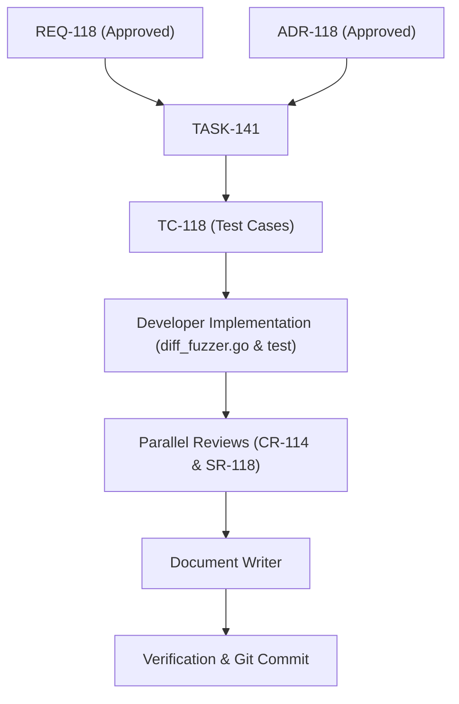

# TASK-141 - Implement Latency Distributional Metric Calibration in diff_fuzzer.go (HARN-02)

## 1. Description & Context

Decompose and coordinate the implementation of Latency Distributional Metric Calibration in Toron's Differential Protocol Security Fuzzer ([`benchmarks/fuzzer/diff_fuzzer.go`](file:///Users/sneha/Developer/toron-research/toron/benchmarks/fuzzer/diff_fuzzer.go)) as specified in [`REQ-118`](file:///Users/sneha/Developer/toron-research/toron/docs/requirements/REQ-118.md) and [`ADR-118`](file:///Users/sneha/Developer/toron-research/toron/docs/architecture/ADR-118.md).

### 1.1 Executive Summary & Review Critique
In academic and technical peer review dossiers (`AER-001.md`, `MSR-001.md`, `AR-001.md`, and formalized under Directive `REV-02` / Task `HARN-02` of `ReviewTaskSummary.md`), reviewers raised critical methodological defects concerning Section 5.2 of `docs/research/paper1_agentic_systems.tex`:
1. **Conflated Evaluation Mode**: Section 5.2 claimed that the 19-vector protocol invariant suite was evaluated across $K=1,000$ repeated statistical trials with 50-run warm-up discard (`BMK-02`). In reality, `differential_fuzz_report.json` was generated with `trials_per_test: 1` and `warmup_runs_per_test: 0`.
2. **Distributional Percentile Mislabeling**: In the empirical data, $712.08\ \mu\text{s}$ is the 90th percentile ($p90$), while the true 99th percentile ($p99$) is $2,378.00\ \mu\text{s}$.
3. **Conflation of Rejection Defense vs. Baseline Traffic**: The 19 vectors include 18 fail-fast adversarial rejection vectors (`400/403/413/431/501` with connection close) and 1 benign baseline vector (`BASELINE-001`, `200 OK` with full body payload transfer). Aggregating them without disaggregation obscured fail-fast defense performance ($87.29\ \mu\text{s}$ to $712.08\ \mu\text{s}$) and cross-vector tail latency ($2,378.00\ \mu\text{s}$).
4. **Suppression in Single-Shot Mode**: The terminal summary and Markdown report generator suppressed $p50$, $p90$, and $p99$ when `*trials == 1`, only printing them when `*trials > 1`.

---

## 2. Subtask Breakdown

### TASK-141.1: Data Structure Augmentation in `diff_fuzzer.go` (FR-5)
- **Target File**: `benchmarks/fuzzer/diff_fuzzer.go`
- **Scope**:
  - Define `CohortMetrics` struct to capture disaggregated distribution statistics:
    ```go
    type CohortMetrics struct {
        Count           int     `json:"count"`
        MeanLatencyUs   float64 `json:"mean_latency_us"`
        MedianLatencyUs float64 `json:"median_latency_us"`
        P90LatencyUs    float64 `json:"p90_latency_us"`
        P99LatencyUs    float64 `json:"p99_latency_us,omitempty"`
        MaxLatencyUs    float64 `json:"max_latency_us"`
    }
    ```
  - Augment `DifferentialReport` struct:
    ```go
    type DifferentialReport struct {
        ...
        AverageLatencyUs  float64                 `json:"average_latency_us"`
        MedianLatencyUs   float64                 `json:"median_latency_us"`
        P90LatencyUs      float64                 `json:"p90_latency_us"`
        P99LatencyUs      float64                 `json:"p99_latency_us"`
        FailFastDefense   CohortMetrics           `json:"fail_fast_defense"`
        ComprehensiveSuite CohortMetrics          `json:"comprehensive_suite"`
        CategoryStats     map[string]CategoryStat `json:"category_stats"`
        Results           []TestResult            `json:"results"`
    }
    ```

### TASK-141.2: Implement Cohort-Disaggregated Distribution Calculation Engine (FR-1, FR-2)
- **Target File**: `benchmarks/fuzzer/diff_fuzzer.go`
- **Scope**:
  - Implement helper functions for calculating cohort statistics (`calculateCohortMetrics(samples []float64, isComprehensive bool) CohortMetrics`).
  - Partition test results into:
    1. **Fail-Fast Defense Cohort ($N=18$)**: All adversarial rejection vectors where status code is non-200 and connection is closed.
    2. **Cross-Vector Comprehensive Cohort ($N=19$)**: All test cases including `BASELINE-001`.
  - Calculate Mean, $p50$, $p90$, and Max for Fail-Fast Defense.
  - Calculate Mean, $p50$, $p90$, $p99$, and Max for Cross-Vector Comprehensive.

### TASK-141.3: Calibrate Terminal Summary Output (FR-2, FR-3)
- **Target File**: `benchmarks/fuzzer/diff_fuzzer.go`
- **Scope**:
  - Update `FUZZER EXECUTION SUMMARY` in terminal output to unconditionally display both cohorts regardless of `*trials == 1` or `*trials > 1`.
  - Format output clearly with separate sections for Fail-Fast Defense Latency and Cross-Vector Comprehensive Latency.

### TASK-141.4: Calibrate Markdown Report Generation (FR-2, FR-4)
- **Target File**: `benchmarks/fuzzer/diff_fuzzer.go`
- **Scope**:
  - Update Markdown report builder to unconditionally output distinct rows for:
    - Fail-Fast Rejection Latency (N=18): Mean, Median (p50), Tail Latency (p90), Max Rejection.
    - Cross-Vector Comprehensive Latency (N=19): Mean, Median (p50), Percentile (p90), Tail Latency (p99), Max Latency.
  - Eliminate ambiguity between $p90$ and $p99$.

### TASK-141.5: Unit Test Suite Expansion in `diff_fuzzer_test.go` (FR-1, FR-2)
- **Target File**: `benchmarks/fuzzer/diff_fuzzer_test.go`
- **Scope**:
  - Add comprehensive unit test `TestDifferentialFuzzer_CohortDisaggregation` verifying:
    - Cohort partitioning logic ($N=18$ vs $N=19$).
    - Calculation of $p50$, $p90$, and $p99$ across both modes.
    - JSON serialization and deserialization of `FailFastDefense` and `ComprehensiveSuite`.
    - Markdown report text formatting.

### TASK-141.6: Re-run Harness & Update Artifacts (FR-6, FR-7)
- **Target File**: `benchmarks/results/differential_fuzz_report.json`, `benchmarks/results/differential_fuzz_report.md`
- **Scope**:
  - Execute fuzzer to regenerate JSON and Markdown reports with calibrated telemetry.
  - Verify 100% pass rate (19/19 tests).

---

## 3. Execution Dependencies & Verification Gates



## 4. Traceability
- **Derived From**: `REQ-118`
- **Decided By**: `ADR-118`
- **Verified By**: `TC-118`
- **Code Review**: `CR-114`
- **Security Review**: `SR-118`
