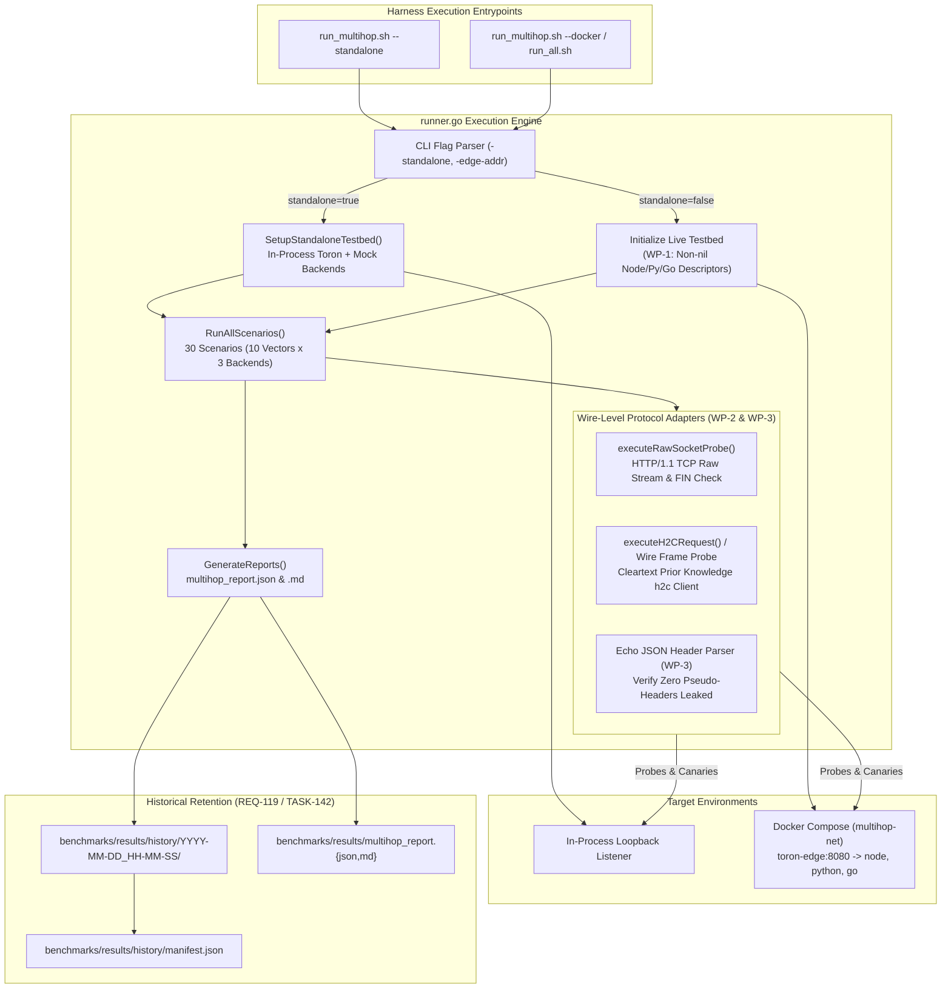
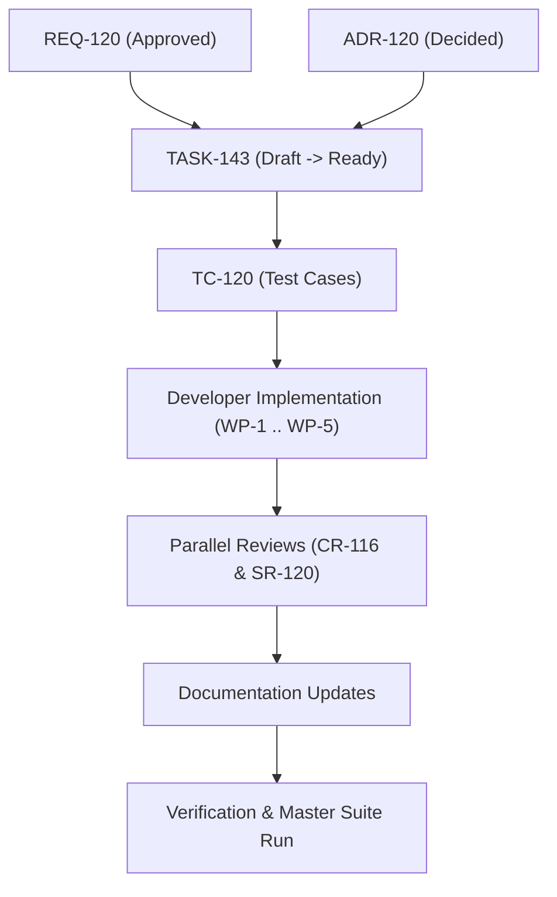

# TASK-143 - Heterogeneous Multi-Hop Live Docker Harness Network Execution Implementation

## 1. Description & Context

Decompose and coordinate the engineering implementation required to resolve the multi-hop containerized benchmark harness runtime panic and wire-level protocol execution limitations, as formally specified in [`REQ-120`](file:///Users/sneha/Developer/toron-research/toron/docs/requirements/REQ-120.md).

### 1.1 Executive Summary & Incident Context
During master benchmark suite validation via:
```bash
./benchmarks/run_all.sh --auto-start --docker
```
(which invokes [`benchmarks/multihop/run_multihop.sh --docker`](file:///Users/sneha/Developer/toron-research/toron/benchmarks/multihop/run_multihop.sh)), the multi-hop testbed runner abruptly terminated with a fatal panic:
```text
panic: runtime error: invalid memory address or nil pointer dereference at benchmarks/multihop/runner.go:687
```

### 1.2 Root Cause Analysis
Source code inspection of [`benchmarks/multihop/runner.go`](file:///Users/sneha/Developer/toron-research/toron/benchmarks/multihop/runner.go) identified four primary root causes:
1. **Uninstantiated Backend Descriptors in Live Mode**: In [`main()`](file:///Users/sneha/Developer/toron-research/toron/benchmarks/multihop/runner.go#L831-L885), when `-standalone=false` is passed, [`TestbedEnvironment`](file:///Users/sneha/Developer/toron-research/toron/benchmarks/multihop/runner.go#L332-L340) is initialized with only `EdgeAddr` and `IsLive: true`. The backend pointers `NodeBackend`, `PyBackend`, and `GoBackend` remain `nil`. When [`RunAllScenarios`](file:///Users/sneha/Developer/toron-research/toron/benchmarks/multihop/runner.go#L659-L731) iterates over the backend slice, referencing `b.Runtime` panics on line 687.
2. **In-Memory Server Invocation on Non-Existent In-Process Server**: Scenarios `VECTOR-01`, `VECTOR-02`, `VECTOR-03`, `VECTOR-07`, and `VECTOR-08` invoke `env.EdgeServer.HTTP2AdapterHandler().ServeHTTP(rec, req)`. In live Docker mode, `env.EdgeServer` is `nil`, bypassing the physical network stack and crashing.
3. **In-Memory Upstream Header Leakage Verification**: `VECTOR-08` verifies pseudo-header stripping by acquiring a lock on `targetBackend.Mu` and reading `targetBackend.LastHeaders`. In live mode, the backend origins run inside Docker containers (`toron-node-origin`, `toron-python-origin`, `toron-go-origin`); in-process reflection fails. All live backend stubs echo received headers in their JSON `/echo` response, but the harness does not parse the payload over the wire.
4. **Divergent Standalone vs. Live Semantics**: The harness lacks a unified wire-level abstraction that executes identically against in-process loopback listeners and live Docker bridge networks.

---

## 2. Work Packages & Subtask Breakdown

### TASK-143.1 (WP-1): Initialize Backend Descriptors in Live Mode
- **Target File**: [`benchmarks/multihop/runner.go`](file:///Users/sneha/Developer/toron-research/toron/benchmarks/multihop/runner.go)
- **Problem Addressed**: Nil pointer dereference in [`RunAllScenarios`](file:///Users/sneha/Developer/toron-research/toron/benchmarks/multihop/runner.go#L687) when running in live mode (`-standalone=false`).
- **Engineering Steps**:
  1. Review [`main()`](file:///Users/sneha/Developer/toron-research/toron/benchmarks/multihop/runner.go#L856-L863) where `env` is constructed when `*standalone == false`.
  2. Instantiate non-nil [`SimulatedBackend`](file:///Users/sneha/Developer/toron-research/toron/benchmarks/multihop/runner.go#L89-L98) descriptors (or dedicated backend target descriptors) for each runtime origin:
     - `NodeBackend`: `Runtime: "Node.js 20 LTS"`, `ParserEngine: "llhttp (C-based)"`, `Prefix: "node"`
     - `PyBackend`: `Runtime: "Python 3.11"`, `ParserEngine: "uvicorn / h11"`, `Prefix: "python"`
     - `GoBackend`: `Runtime: "Go 1.24"`, `ParserEngine: "net/http"`, `Prefix: "go"`
  3. Ensure that in live mode, `sb.Server` remains `nil` and [`sb.Close()`](file:///Users/sneha/Developer/toron-research/toron/benchmarks/multihop/runner.go#L101-L105) or [`env.Teardown()`](file:///Users/sneha/Developer/toron-research/toron/benchmarks/multihop/runner.go#L403-L421) safely checks `sb.Server != nil` before closing.
  4. Ensure [`RunAllScenarios`](file:///Users/sneha/Developer/toron-research/toron/benchmarks/multihop/runner.go#L659-L731) cleanly iterates across all three backend descriptors without panicking.
- **Acceptance Criteria**:
  - `runner.go` executed with `-standalone=false -edge-addr 127.0.0.1:8080` does not crash with a `nil` pointer dereference.
  - All 3 backend targets are correctly represented in the generated report summary.
- **Deliverables**:
  - Live backend descriptor initialization logic in [`benchmarks/multihop/runner.go`](file:///Users/sneha/Developer/toron-research/toron/benchmarks/multihop/runner.go).

---

### TASK-143.2 (WP-2): Wire-Level Protocol Execution Adapters
- **Target File**: [`benchmarks/multihop/runner.go`](file:///Users/sneha/Developer/toron-research/toron/benchmarks/multihop/runner.go)
- **Problem Addressed**: Direct in-memory invocation of `env.EdgeServer.HTTP2AdapterHandler().ServeHTTP(rec, req)` during `VECTOR-01`, `VECTOR-02`, `VECTOR-03`, `VECTOR-07`, and `VECTOR-08`.
- **Engineering Steps**:
  1. Remove direct handler calls to `env.EdgeServer.HTTP2AdapterHandler().ServeHTTP(...)` across all scenario cases in [`ExecuteScenario`](file:///Users/sneha/Developer/toron-research/toron/benchmarks/multihop/runner.go#L424-L590).
  2. Implement Prior Knowledge cleartext HTTP/2 (`h2c`) execution adapter:
     - Utilize `golang.org/x/net/http2.Transport` configured with `AllowHTTP: true` and custom `DialTLSContext` returning cleartext TCP connections to `env.EdgeAddr`.
     - Implement `executeH2CRequest(edgeAddr, method, path, headers, body)` enforcing a strict timeout ($\le 3\text{ seconds}$).
  3. Implement wire-level frame delivery / raw socket probing for HTTP/2 attack vectors:
     - For `VECTOR-01` (H2.TE): Transmit an HTTP/2 request or frame with `Transfer-Encoding: chunked`. Assert that the edge gateway returns `400 Bad Request` or an HTTP/2 `RST_STREAM` / stream error.
     - For `VECTOR-02` (H2.CL-Duplicate): Transmit duplicate `Content-Length` headers over HTTP/2. Assert `400 Bad Request` or `RST_STREAM`.
     - For `VECTOR-03` (H2.CL-Mismatch): Transmit a payload with length differing from declared `Content-Length`. Assert `400 Bad Request` or stream error.
     - For `VECTOR-07` (CRLF-Header-Injection): Transmit header values containing `\r\n`. Assert `400 Bad Request` or stream error.
     - For `VECTOR-08` (Pseudo-Header-Isolation): Transmit valid HTTP/2 request containing pseudo-headers over h2c to `POST /<prefix>/echo`. Assert `200 OK`.
  4. Preserve raw TCP socket probing in [`executeRawSocketProbe`](file:///Users/sneha/Developer/toron-research/toron/benchmarks/multihop/runner.go#L593-L625) for HTTP/1.1 vectors (`VECTOR-04`, `VECTOR-05`, `VECTOR-06`), checking status lines and socket FIN/RST teardown.
  5. Enforce bounded timeouts on all network socket operations ($\le 2\text{s}$ dial, $\le 3\text{s}$ scenario probe) to prevent test hangs.
- **Acceptance Criteria**:
  - Zero invocations of `env.EdgeServer.HTTP2AdapterHandler()` in `ExecuteScenario`.
  - All 10 vectors execute over physical TCP sockets to `env.EdgeAddr`.
  - Edge gateway rejections (400 Bad Request, stream errors) are reliably detected and recorded.
- **Deliverables**:
  - Live wire execution functions and h2c adapter routines in [`benchmarks/multihop/runner.go`](file:///Users/sneha/Developer/toron-research/toron/benchmarks/multihop/runner.go).

---

### TASK-143.3 (WP-3): Upstream Header Verification in Live Mode
- **Target File**: [`benchmarks/multihop/runner.go`](file:///Users/sneha/Developer/toron-research/toron/benchmarks/multihop/runner.go)
- **Problem Addressed**: In-memory inspection of `targetBackend.LastHeaders` fails in live Docker mode and couples testbed verification to in-process memory state.
- **Engineering Steps**:
  1. Inspect the contract for `POST /echo` across backend origin implementations:
     - Node.js: [`benchmarks/multihop/backends/node/server.js`](file:///Users/sneha/Developer/toron-research/toron/benchmarks/multihop/backends/node/server.js) returns `headers: req.headers` (JSON object).
     - Python: [`benchmarks/multihop/backends/python/server.py`](file:///Users/sneha/Developer/toron-research/toron/benchmarks/multihop/backends/python/server.py) returns `headers: dict(self.headers)` (JSON object).
     - Go: [`benchmarks/multihop/backends/go/main.go`](file:///Users/sneha/Developer/toron-research/toron/benchmarks/multihop/backends/go/main.go) returns `headers: map[string][]string` (JSON object).
     - Standalone mock: [`SimulatedBackend`](file:///Users/sneha/Developer/toron-research/toron/benchmarks/multihop/runner.go#L137-L144) returns `headers: sb.LastHeaders` (JSON object).
  2. In `VECTOR-08` of [`ExecuteScenario`](file:///Users/sneha/Developer/toron-research/toron/benchmarks/multihop/runner.go#L520-L539):
     - Send `POST /<prefix>/echo` with HTTP/2 pseudo-headers (`:protocol`, `:custom-pseudo`) over the h2c wire adapter.
     - Capture the HTTP response body returned through the edge gateway.
     - Parse the JSON payload and extract the `"headers"` key into a generic map (`map[string]any`).
     - Iterate through header keys; assert that zero keys begin with `:` (colon).
     - If any pseudo-header key is present, mark `res.Stage1Passed = false` and assign `res.FailureReason = fmt.Sprintf("pseudo-header leaked to upstream: %s", key)`.
  3. Remove reliance on `targetBackend.Mu` and `targetBackend.LastHeaders` in `VECTOR-08`, ensuring identical verification logic across standalone and live modes.
- **Acceptance Criteria**:
  - `VECTOR-08` verifies pseudo-header stripping exclusively via response payload inspection over the wire.
  - Zero colon-prefixed headers leak into downstream origins.
  - Standalone and live Docker modes use identical verification logic.
- **Deliverables**:
  - Response payload JSON parser and upstream header validator in [`benchmarks/multihop/runner.go`](file:///Users/sneha/Developer/toron-research/toron/benchmarks/multihop/runner.go).

---

### TASK-143.4 (WP-4): Comprehensive Unit & Integration Tests
- **Target File**: [`benchmarks/multihop/multihop_test.go`](file:///Users/sneha/Developer/toron-research/toron/benchmarks/multihop/multihop_test.go)
- **Problem Addressed**: Lack of automated tests verifying the live mode codepath, descriptor instantiation, and wire-level protocol adapters.
- **Engineering Steps**:
  1. Update existing tests ([`TestMultiHop_HeterogeneousEvaluation`](file:///Users/sneha/Developer/toron-research/toron/benchmarks/multihop/multihop_test.go#L9-L68) and [`TestMultiHop_VectorsIndividual`](file:///Users/sneha/Developer/toron-research/toron/benchmarks/multihop/multihop_test.go#L71-L100)) to confirm that refactored wire-level execution functions execute cleanly in standalone mode without regressions.
  2. Implement unit test `TestMultiHop_LiveModeInitialization`:
     - Construct a `TestbedEnvironment` simulating live mode (`IsLive: true`).
     - Assert that `NodeBackend`, `PyBackend`, and `GoBackend` descriptors are non-nil.
     - Verify descriptor metadata (`Runtime`, `ParserEngine`, `Prefix`).
  3. Implement integration test `TestMultiHop_LiveModeSimulation`:
     - Spin up simulated live HTTP listeners representing Toron and backends.
     - Execute `RunAllScenarios` in simulated live mode (`IsLive: true`).
     - Verify that report generation completes with 30 scenarios evaluated and zero panics.
  4. Implement unit test `TestMultiHop_PseudoHeaderEchoVerification`:
     - Test the JSON header echo parsing logic against simulated responses containing and omitting pseudo-headers.
     - Verify correct detection and failure reporting when a colon-prefixed header leaks.
  5. Run `go test -race -count=1 ./benchmarks/multihop/...` to confirm thread safety and race freedom.
- **Acceptance Criteria**:
  - Both standalone and live simulation test paths achieve 100% pass rate.
  - Tests execute with `-race` flag enabled with zero detected race conditions.
- **Deliverables**:
  - Updated and expanded test suite in [`benchmarks/multihop/multihop_test.go`](file:///Users/sneha/Developer/toron-research/toron/benchmarks/multihop/multihop_test.go).

---

### TASK-143.5 (WP-5): Verify Dual Execution Compatibility
- **Target Files**:
  - [`benchmarks/multihop/run_multihop.sh`](file:///Users/sneha/Developer/toron-research/toron/benchmarks/multihop/run_multihop.sh)
  - [`benchmarks/run_all.sh`](file:///Users/sneha/Developer/toron-research/toron/benchmarks/run_all.sh)
- **Problem Addressed**: End-to-end execution of `run_multihop.sh --docker` and `./benchmarks/run_all.sh --auto-start --docker` failed during benchmark validation.
- **Engineering Steps**:
  1. Review [`benchmarks/multihop/run_multihop.sh`](file:///Users/sneha/Developer/toron-research/toron/benchmarks/multihop/run_multihop.sh):
     - In `--docker` mode, enhance container startup readiness checks: poll the Edge Gateway (`http://127.0.0.1:8080/node/health` or `http://127.0.0.1:8080/go/health`) until healthy or timeout (30s) before executing `runner.go`.
     - Ensure proper container teardown trap (`cleanup_docker` on `EXIT`).
     - Confirm historical retention archival via [`benchmarks/archive_run.sh`](file:///Users/sneha/Developer/toron-research/toron/benchmarks/archive_run.sh) executes cleanly in both standalone and docker modes.
  2. Verify dual execution modes:
     - Run `bash benchmarks/multihop/run_multihop.sh --standalone` and verify:
       - 30 scenarios executed (10 vectors $\times$ 3 backends).
       - Report written to `benchmarks/results/multihop_report.json` and `.md`.
       - Historical retention snapshot archived in `benchmarks/results/history/<timestamp>/`.
       - `manifest.json` updated with task parameters and success status.
     - Run `bash benchmarks/multihop/run_multihop.sh --docker` and verify:
       - Docker containers build and start cleanly.
       - 30 scenarios executed against live Edge Gateway.
       - Zero runtime panics or nil dereferences.
       - Reports written and archived to history and canonical results.
  3. Validate integration with master benchmark orchestrator:
     - Test execution of `./benchmarks/run_all.sh --auto-start --docker` to confirm multi-hop stage runs seamlessly as part of the full benchmark suite.
- **Acceptance Criteria**:
  - `run_multihop.sh --standalone` and `run_multihop.sh --docker` both complete with exit code 0.
  - Master benchmark orchestrator `run_all.sh --docker` completes without crashing on the multi-hop stage.
  - Reports conform to [`REQ-119`](file:///Users/sneha/Developer/toron-research/toron/docs/requirements/REQ-119.md) retention rules.
- **Deliverables**:
  - Validated shell orchestration scripts and historical retention records.

---

## 3. Architecture & Execution Flow



---

## 4. Acceptance Criteria Mapping

| REQ-120 AC | Description | Associated Subtask | Verification Gate |
| :--- | :--- | :--- | :--- |
| **AC-1** | Backend descriptors non-nil in live mode (`-standalone=false`). | TASK-143.1, TASK-143.4 | Unit test asserting non-nil descriptors; execution without nil dereference. |
| **AC-2** | HTTP/2 vectors execute over physical TCP/h2c without in-memory handler call. | TASK-143.2 | Code review confirming zero calls to `HTTP2AdapterHandler().ServeHTTP`; live network execution. |
| **AC-3** | Edge rejections (400 Bad Request, stream errors) accurately detected over wire. | TASK-143.2 | Assertion that `Stage1EdgeStatus == 400` for all attack vectors over live socket. |
| **AC-4** | Pseudo-header isolation verified via echoed JSON payload in `VECTOR-08`. | TASK-143.3, TASK-143.4 | Unit & live test verifying JSON response inspection and zero colon headers. |
| **AC-5** | `run_multihop.sh --standalone` executes all 30 scenarios with 100% pass rate. | TASK-143.5 | Clean script execution and valid report artifacts in `benchmarks/results/`. |
| **AC-6** | `run_multihop.sh --docker` executes all 30 scenarios with identical report schema. | TASK-143.5 | Clean execution against Docker cluster; schema validation. |
| **AC-7** | Zero external Go dependencies beyond stdlib and `golang.org/x/net/http2`. | TASK-143.2 | `go.mod` verification. |
| **AC-8** | Strict timeouts ($\le 3\text{s}$) prevent socket hangs. | TASK-143.2 | Timeout enforcement in dialers and HTTP clients. |
| **AC-9** | Retention compliance with REQ-119 (history snapshots and manifest update). | TASK-143.5 | Verification of `manifest.json` and timestamp directory generation. |
| **AC-10** | Zero data races in test execution. | TASK-143.4 | `go test -race -count=1 ./benchmarks/multihop/...` passes cleanly. |

---

## 5. Traceability Matrix & Review Gates



| Artifact ID | Artifact Type | Role / Purpose | Status |
| :--- | :--- | :--- | :--- |
| [`REQ-120`](file:///Users/sneha/Developer/toron-research/toron/docs/requirements/REQ-120.md) | Requirement | Source requirement defining live Docker harness architecture | Approved |
| `ADR-120` | Architecture Decision | Cleartext h2c Prior Knowledge protocol and frame handling decision | Proposed |
| [`TASK-143`](file:///Users/sneha/Developer/toron-research/toron/docs/tasks/TASK-143.md) | Task Specification | Engineering work package breakdown (this document) | Draft |
| `TC-120` | Test Specification | Comprehensive test case definitions for live Docker harness | Proposed |
| `CR-116` | Code Review | Multi-Hop live harness code review | Planned |
| `SR-120` | Security Review | Security posture and smuggling invariant validation | Planned |
