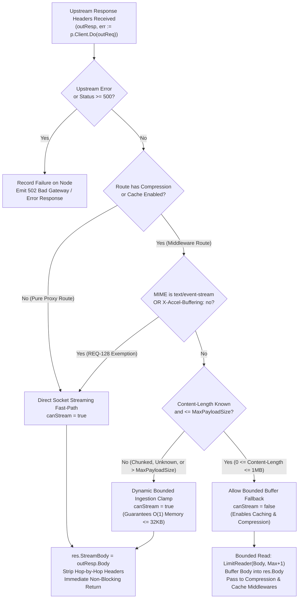

# TASK-152 - Implement Streaming by Default Reverse Proxy Architecture, RFC 7230 Outbound Chunked Framing, and Memory Boundedness Invariants

## 1. Overview & Objective

During high-throughput resilience evaluations, streaming architecture audits, and vulnerability assessments of Toron's core reverse proxy engine, four critical architectural limitations were identified:

1. **The Upstream Infinite Stream OOM Bomb ([`SEC-36`](file:///Users/sneha/Developer/toron-research/toron/SECURITY_AUDIT.md#L483-L491), CWE-400, CWE-770)**:
   - In [`pkg/proxy/proxy.go:1105`](file:///Users/sneha/Developer/toron-research/toron/pkg/proxy/proxy.go#L1105), streaming is gated by:
     ```go
     canStream := p.streamResponse && ((!p.routeHasCompression && !p.routeHasCache) || isStreamingMIME || isUnbuffered)
     ```
   - When routes enable compression or caching (the standard production configuration for API and web gateways) and upstream responses do not explicitly declare `Content-Type: text/event-stream` or `X-Accel-Buffering: no`, Toron unconditionally falls back to buffered ingestion:
     ```go
     bufPtr := httpparser.GetCopyBuffer()
     _, _ = io.CopyBuffer(res.Body, outResp.Body, *bufPtr)
     httpparser.PutCopyBuffer(bufPtr)
     ```
   - `io.CopyBuffer` continuously ingests bytes into `res.Body` (`*bytes.Buffer`) without an upper memory limit.
   - If an upstream emits an oversized binary file, endless telemetry feed, or infinite data stream (e.g. `/dev/urandom`), heap memory expands dynamically until the host OS Out-Of-Memory (OOM) killer forcibly terminates the Toron gateway, crashing all ingress traffic.

2. **HTTP/1.1 Persistent Keep-Alive Connection Degradation on Streaming**:
   - In [`pkg/server/server.go:344-376`](file:///Users/sneha/Developer/toron-research/toron/pkg/server/server.go#L344-L376), when `res.StreamBody != nil`, the server writes headers and directly flushes raw stream chunks to the socket without RFC 7230 Chunked Transfer Encoding framing (`Transfer-Encoding: chunked`).
   - Because dynamic streaming responses lack a fixed `Content-Length`, HTTP/1.1 clients cannot identify payload boundaries without connection closure. This degrades connection efficiency by forcing socket termination on stream completion, breaking HTTP/1.1 persistent connection reuse (`Connection: keep-alive`).

3. **Smuggling Defense Decoupling (ADR-056 / REQ-061 / CWE-444)**:
   - Toron strictly enforces [`ADR-056`](file:///Users/sneha/Developer/toron-research/toron/docs/architecture/ADR-056.md) by rejecting inbound client requests with `Transfer-Encoding: chunked` with HTTP `501 Not Implemented`.
   - Outbound HTTP/1.1 chunked response framing must be implemented strictly within downstream response serialization in `pkg/server`, ensuring inbound smuggling defenses remain 100% intact.

4. **Stream Desynchronization & Socket Descriptor Leaks (CWE-444, CWE-775)**:
   - If an upstream stream aborts prematurely or encounters a timeout, emitting a terminal chunk (`0\r\n\r\n`) corrupts HTTP stream state and tricks downstream caches into storing truncated data.
   - Client disconnects must cleanly propagate upstream context cancellation, and upstream response bodies must be closed under all error paths to prevent OS socket descriptor leaks (`EMFILE`).

The objective of this task is to implement the engineering specifications approved in [`REQ-129`](file:///Users/sneha/Developer/toron-research/toron/docs/requirements/REQ-129.md), transforming Toron into a **streaming-by-default reverse proxy** with dynamic bounded ingestion clamping, outbound RFC 7230 chunked framing, multi-protocol parity, and strict adherence to the 4 Non-Negotiable Invariants.

---

### Conflict Audit & Architecture Compliance

A rigorous cross-audit against existing Toron specifications and architectural decisions confirms complete harmony:

| Prior Requirement / ADR | Core Architectural Invariant | Potential Conflict & Cross-Audit Resolution | Compliance Verdict |
| :--- | :--- | :--- | :--- |
| **[`ADR-001`](file:///Users/sneha/Developer/toron-research/toron/docs/architecture/ADR-001.md)** (Event-Driven Reactor) | Strict modularity: proxy and router must NEVER touch the physical client socket (`net.Conn`). | **Preserved**: Proxy transfers body ownership via `res.StreamBody io.ReadCloser`. Server core coordinates chunk relaying to `net.Conn`. | **100% Compliant** |
| **[`ADR-056`](file:///Users/sneha/Developer/toron-research/toron/docs/architecture/ADR-056.md) / [`REQ-061`](file:///Users/sneha/Developer/toron-research/toron/docs/requirements/REQ-061.md)** (Smuggling Guard) | Inbound `Transfer-Encoding: chunked` requests rejected with HTTP 501. | **Preserved**: Inbound guard remains strictly active in `pkg/httpparser/parser.go`. Outbound chunked framing is restricted strictly to response generation in `pkg/server`. | **100% Compliant** |
| **[`REQ-098`](file:///Users/sneha/Developer/toron-research/toron/docs/requirements/REQ-098.md) / [`ADR-098`](file:///Users/sneha/Developer/toron-research/toron/docs/architecture/ADR-098.md)** (Bounded Ingestion) | Upstream payloads bounded to prevent heap OOM (`SEC-36`, CWE-400, CWE-770). | **Extended**: Dynamic bounded clamping applied to all reverse proxy routes: payloads $\le \text{MaxPayloadSize}$ can buffer; larger or chunked payloads stream directly. | **Harmonized** |
| **[`REQ-034`](file:///Users/sneha/Developer/toron-research/toron/docs/requirements/REQ-034.md) / [`ADR-029`](file:///Users/sneha/Developer/toron-research/toron/docs/architecture/ADR-029.md)** (Transparent Compression) | Compresses full response bodies; sets `Content-Encoding` and `Content-Length`. | **Harmonized**: Payloads $\le \text{MaxPayloadSize}$ buffer and compress; oversized/chunked payloads bypass compression cleanly via `res.StreamBody`. | **Zero Conflict** |
| **[`REQ-035`](file:///Users/sneha/Developer/toron-research/toron/docs/requirements/REQ-035.md) / [`ADR-030`](file:///Users/sneha/Developer/toron-research/toron/docs/architecture/ADR-030.md)** (Response Caching) | Caches responses matching status and size criteria up to `MaxPayloadSize`. | **Harmonized**: Payloads $\le \text{MaxPayloadSize}$ are cached; oversized/chunked payloads bypass cache storage cleanly (`X-Cache: MISS`). | **Zero Conflict** |
| **[`REQ-125`](file:///Users/sneha/Developer/toron-research/toron/docs/requirements/REQ-125.md) / [`ADR-125`](file:///Users/sneha/Developer/toron-research/toron/docs/architecture/ADR-125.md)** (Streaming Fast-Path) | Direct socket streaming hand-off via `res.StreamBody`. | **Promoted**: Direct socket streaming promoted to global default (`streamResponse: true`) across all proxy profiles and routes. | **Direct Evolution** |
| **[`REQ-126`](file:///Users/sneha/Developer/toron-research/toron/docs/requirements/REQ-126.md) / [`ADR-126`](file:///Users/sneha/Developer/toron-research/toron/docs/architecture/ADR-126.md)** (Adaptive Deadlines) | Activity-refreshed write deadlines protect against Slow Read DoS (CWE-400). | **Integrated**: Outbound chunk relay loop refreshes write deadlines per chunk, preventing slow clients from hanging upstream sockets. | **Synergistic Alignment** |
| **[`REQ-127`](file:///Users/sneha/Developer/toron-research/toron/docs/requirements/REQ-127.md) / [`ADR-127`](file:///Users/sneha/Developer/toron-research/toron/docs/architecture/ADR-127.md)** (TCP_NODELAY & Buffer Recycling) | Disables Nagle buffering; recycles 32KB copy buffers from `sync.Pool`. | **Integrated**: Outbound chunk framing emits immediately with zero heap allocations, recycling 32KB copy slabs from `copyBufferPool`. | **Synergistic Alignment** |
| **[`REQ-128`](file:///Users/sneha/Developer/toron-research/toron/docs/requirements/REQ-128.md) / [`ADR-128`](file:///Users/sneha/Developer/toron-research/toron/docs/architecture/ADR-128.md)** (Middleware Exemptions) | `text/event-stream`, `X-Accel-Buffering: no`, and `no-cache` bypass middleware. | **Foundation**: REQ-129 generalizes this exemption to all oversized, chunked, or dynamic streams exceeding `MaxPayloadSize`. | **Harmonized** |
| **Verdict** | **ZERO CONFLICTS** | All prior invariants, security guards, and performance paths fully preserved and strengthened. | **Fully Approved** |

---

### Safe Non-Conflicting Path



---

## 2. Work Breakdown Structure (WBS)

```
TASK-152: Implement Streaming by Default Reverse Proxy Architecture, RFC 7230 Outbound Chunked Framing, and Memory Boundedness Invariants
├── WP-1: Streaming by Default & Dynamic Bounded Ingestion Clamp (pkg/proxy/proxy.go, pkg/config)
│   ├── Subtask 1.1: Default stream_response: true Across Configuration Profiles
│   ├── Subtask 1.2: Dynamic Bounded Clamping for Middleware-Enabled Routes
│   └── Subtask 1.3: Constant O(1) Memory Bound (<= 32KB) and Elimination of Unbounded io.CopyBuffer
├── WP-2: Core Reactor Modularity Preservation & Stream Lifecycle (pkg/proxy/proxy.go, pkg/server/server.go)
│   ├── Subtask 2.1: ReverseProxy-Socket Isolation (Upholding ADR-001 via res.StreamBody)
│   ├── Subtask 2.2: Context Binding (outReq = outReq.WithContext(req.Context()))
│   └── Subtask 2.3: Upstream Cancellation and Deferred Socket Cleanup (Preventing CWE-775)
├── WP-3: Outbound RFC 7230 Chunked Response Framing & Smuggling Defense (pkg/server/server.go, pkg/httpparser/response.go)
│   ├── Subtask 3.1: Inbound ADR-056 Smuggling Guard Preservation (HTTP 501 on Inbound Chunked Requests)
│   ├── Subtask 3.2: HTTP/1.1 Outbound Chunked Wire Framing Engine (<hex-len>\r\n<data>\r\n)
│   ├── Subtask 3.3: Clean EOF Terminal Chunk (0\r\n\r\n) and HTTP/1.1 Persistent Keep-Alive Socket Reuse
│   └── Subtask 3.4: Fail-Closed Teardown Invariant (on Error/Abort, NEVER emit 0\r\n\r\n; Immediately Close Socket)
├── WP-4: Multi-Protocol Streaming Parity (pkg/server/server.go)
│   ├── Subtask 4.1: HTTP/2 & HTTP/3 http.Flusher Loop in http2AdapterHandler
│   └── Subtask 4.2: Client Stream Reset (RST_STREAM) Handling
└── WP-5: Automated Verification & Test Suite
    ├── Subtask 5.1: Dynamic Clamping & OOM Prevention Tests
    ├── Subtask 5.2: Outbound Chunked Framing & Keep-Alive Reuse Integration Tests
    ├── Subtask 5.3: Fail-Closed Abort Teardown Tests
    ├── Subtask 5.4: HTTP/2 Flusher Tests
    └── Subtask 5.5: Concurrency & Race Safety Validation (-race)
```

---

### Work Package 1 (WP-1): Streaming by Default & Dynamic Bounded Ingestion Clamp (`pkg/proxy/proxy.go`, `pkg/config`)

#### Subtask 1.1: Default `stream_response: true` Across Configuration Profiles
- In [`pkg/config/config.go:DefaultProxyTransportConfig`](file:///Users/sneha/Developer/toron-research/toron/pkg/config/config.go#L276-L312):
  - Update the `"balanced"` transport profile to set `StreamResponse: &t` (where `t := true`), aligning with `"raw_speed"`.
  - Ensure all built-in transport configuration profiles default `StreamResponse` to `true`.
- In [`pkg/proxy/proxy.go:NewReverseProxy`](file:///Users/sneha/Developer/toron-research/toron/pkg/proxy/proxy.go#L768-L774):
  - Update unconfigured fallback: `streamResponse := true` instead of `false`.
  - Route-level transport override (`routes[].transport.stream_response`) remains strictly authoritative when explicitly set to `false`.
- Ensure `ProxyOptions` and `ReverseProxy` accept and store `MaxPayloadSize int` (defaulting to 1 MB / `1048576` bytes if $\le 0$).

#### Subtask 1.2: Dynamic Bounded Clamping for Middleware-Enabled Routes
- In [`pkg/proxy/proxy.go:ServeHTTPWithPrefix`](file:///Users/sneha/Developer/toron-research/toron/pkg/proxy/proxy.go#L1102-L1106):
  - Replace static `canStream` evaluation with dynamic bounded clamping logic:
    ```go
    contentType := strings.ToLower(outResp.Header.Get("Content-Type"))
    isStreamingMIME := strings.HasPrefix(contentType, "text/event-stream")
    isUnbuffered := strings.EqualFold(strings.TrimSpace(outResp.Header.Get("X-Accel-Buffering")), "no")

    // Resolve route maximum payload buffering threshold (default: 1 MB)
    maxPayloadSize := p.maxPayloadSize
    if maxPayloadSize <= 0 {
        maxPayloadSize = 1024 * 1024 // 1 MB default
    }

    contentLength := outResp.ContentLength
    isChunkedOrUnknown := contentLength < 0 || strings.EqualFold(outResp.Header.Get("Transfer-Encoding"), "chunked")
    isOversized := contentLength > int64(maxPayloadSize)

    // Dynamic Bounded Ingestion Clamping Rule:
    // Direct streaming activates if:
    // 1. streamResponse is enabled AND route has no compression/caching; OR
    // 2. Response is explicitly unbuffered (text/event-stream or X-Accel-Buffering: no); OR
    // 3. Upstream payload is chunked/unknown length, or exceeds maxPayloadSize.
    canStream := p.streamResponse && (
        (!p.routeHasCompression && !p.routeHasCache) ||
        isStreamingMIME ||
        isUnbuffered ||
        isChunkedOrUnknown ||
        isOversized
    )
    ```
  - **Execution Path Differentiation**:
    - **When `canStream == true`**:
      - Assign upstream stream handle: `res.StreamBody = outResp.Body`.
      - **Do NOT** defer `outResp.Body.Close()` in `ServeHTTPWithPrefix`.
      - Return immediately to the router with zero payload heap buffering ($< 0.05\text{ms}$ hand-off).
    - **When `canStream == false`** (Only for routes with middleware where $0 \le \text{Content-Length} \le \text{MaxPayloadSize}$):
      - Allow buffered fallback to permit downstream `CompressionMiddleware` and `CacheMiddleware` to operate on the complete body.
      - Protect against upstream `Content-Length` deception using `io.LimitReader(outResp.Body, int64(maxPayloadSize)+1)`.

#### Subtask 1.3: Constant $O(1)$ Memory Bound ($\le 32\text{KB}$) and Elimination of Unbounded `io.CopyBuffer`
- In [`pkg/proxy/proxy.go:ServeHTTPWithPrefix`](file:///Users/sneha/Developer/toron-research/toron/pkg/proxy/proxy.go#L1168-L1174):
  - In the buffered branch (`canStream == false`), eliminate unbounded ingestion:
    ```go
    defer outResp.Body.Close()

    if outResp.Body != nil {
        bufPtr := httpparser.GetCopyBuffer()
        defer httpparser.PutCopyBuffer(bufPtr)

        limitedReader := io.LimitReader(outResp.Body, int64(maxPayloadSize)+1)
        copied, err := io.CopyBuffer(res.Body, limitedReader, *bufPtr)
        if copied > int64(maxPayloadSize) {
            // Upstream exceeded declared limit during buffering fallback: reject or abort
            res.Body.Reset()
            p.writeBadGateway(res, "Upstream payload exceeded maximum allowed buffer limit")
            return
        }
        _ = err
    }
    ```
  - **Memory Invariant**: Direct streaming endpoints allocate strictly $O(1) \le 32\text{KB}$ per active connection from `copyBufferPool`, completely neutralizing the Upstream Infinite Stream OOM Bomb ([`SEC-36`](file:///Users/sneha/Developer/toron-research/toron/SECURITY_AUDIT.md#L483-L491), CWE-400, CWE-770).

---

### Work Package 2 (WP-2): Core Reactor Modularity Preservation & Stream Lifecycle (`pkg/proxy/proxy.go`, `pkg/server/server.go`)

#### Subtask 2.1: ReverseProxy-Socket Isolation (Upholding ADR-001 via `res.StreamBody`)
- In [`pkg/proxy/proxy.go`](file:///Users/sneha/Developer/toron-research/toron/pkg/proxy/proxy.go) and [`pkg/router/router.go`](file:///Users/sneha/Developer/toron-research/toron/pkg/router/router.go):
  - Verify and uphold the core reactor modularity invariant established in [`ADR-001`](file:///Users/sneha/Developer/toron-research/toron/docs/architecture/ADR-001.md):
    * The reverse proxy and router layers must **never** reference, cast, or manipulate the physical client socket (`net.Conn`).
    * Direct streaming intent is expressed purely through the data structure contract: assigning `res.StreamBody = outResp.Body`.
  - All socket-level operations (TCP options, write deadlines, wire serialization, framing, and socket teardown) remain exclusively encapsulated within [`pkg/server/server.go`](file:///Users/sneha/Developer/toron-research/toron/pkg/server/server.go).

#### Subtask 2.2: Context Binding (`outReq = outReq.WithContext(req.Context())`)
- In [`pkg/httpparser/request.go`](file:///Users/sneha/Developer/toron-research/toron/pkg/httpparser/request.go):
  - Ensure `httpparser.Request` maintains context binding methods:
    ```go
    func (r *Request) Context() context.Context {
        if r != nil && r.ctx != nil {
            return r.ctx
        }
        return context.Background()
    }

    func (r *Request) WithContext(ctx context.Context) *Request {
        if r == nil {
            return nil
        }
        r2 := *r
        r2.ctx = ctx
        return &r2
    }
    ```
- In [`pkg/server/server.go:handleConnection`](file:///Users/sneha/Developer/toron-research/toron/pkg/server/server.go#L240-L290):
  - Initialize request context tied to the physical connection lifecycle, cancelled immediately upon connection termination.
- In [`pkg/server/server.go:http2AdapterHandler`](file:///Users/sneha/Developer/toron-research/toron/pkg/server/server.go#L486):
  - Bind the incoming `http.Request.Context()` onto `httpparser.Request`: `toronReq = toronReq.WithContext(r.Context())`.
- In [`pkg/proxy/proxy.go:ServeHTTPWithPrefix`](file:///Users/sneha/Developer/toron-research/toron/pkg/proxy/proxy.go#L990-L1095):
  - Bind downstream client request context onto upstream request prior to dispatch:
    ```go
    outReq = outReq.WithContext(req.Context())
    ```
  - When the client socket drops, sends TCP RST, or aborts, `req.Context().Done()` fires immediately, aborting in-flight upstream reads in Go's `http.Transport`.

#### Subtask 2.3: Upstream Cancellation and Deferred Socket Cleanup (Preventing CWE-775)
- In [`pkg/server/server.go:handleConnection`](file:///Users/sneha/Developer/toron-research/toron/pkg/server/server.go#L344-L376):
  - Stream cleanup must execute per-request rather than accumulating in the connection-level keep-alive loop.
  - Implement deferred stream cleanup helper or per-stream closure:
    ```go
    if res.StreamBody != nil {
        defer res.StreamBody.Close()
        // ... execute streaming relay loop ...
    }
    ```
  - Guarantee that `res.StreamBody.Close()` is executed under all exit branches (clean EOF, client timeout, write error, context cancellation, or panic), guaranteeing zero operating system socket descriptor leaks ([CWE-775](https://cwe.mitre.org/data/definitions/775.html), `EMFILE`).

---

### Work Package 3 (WP-3): Outbound RFC 7230 Chunked Response Framing & Smuggling Defense (`pkg/server/server.go`, `pkg/httpparser/response.go`)

#### Subtask 3.1: Inbound ADR-056 Smuggling Guard Preservation (HTTP 501 on Inbound Chunked Requests)
- In [`pkg/httpparser/parser.go:ParseRequest`](file:///Users/sneha/Developer/toron-research/toron/pkg/httpparser/parser.go#L195-L203):
  - Retain the strict inbound request smuggling guard:
    ```go
    // HTTP Request Smuggling Prevention (RFC 7230 §3.3.3, ADR-056, REQ-061)
    if req.Header.Get("Transfer-Encoding") != "" {
        if len(clValues) > 0 {
            return nil, fmt.Errorf("%w: conflicting Content-Length and Transfer-Encoding headers", ErrBadRequest)
        }
        return nil, fmt.Errorf("%w: chunked or custom transfer-encoding is not supported", ErrUnsupportedTransferEncoding)
    }
    ```
  - Incoming requests bearing `Transfer-Encoding: chunked` must continue to be strictly rejected with HTTP `501 Not Implemented` and immediate socket termination.
  - Outbound chunked framing is restricted strictly and exclusively to downstream response serialization in `pkg/server`.

#### Subtask 3.2: HTTP/1.1 Outbound Chunked Wire Framing Engine (`<hex-len>\r\n<data>\r\n`)
- In [`pkg/httpparser/response.go:Serialize`](file:///Users/sneha/Developer/toron-research/toron/pkg/httpparser/response.go#L215-L255):
  - Update header formatting for streaming responses:
    * **Known Fixed Length Streaming**: If `Content-Length` is present and valid ($\ge 0$), emit `Content-Length: <len>` and omit `Transfer-Encoding`.
    * **Dynamic / Unknown Length Streaming**: If `res.StreamBody != nil` and `Content-Length` is absent, negative, or upstream was chunked:
      - Emit `Transfer-Encoding: chunked\r\n`.
      - Strictly strip any existing `Content-Length` header (preventing conflicting framing under RFC 7230 §3.3.3).
    * **HTTP/1.0 Client Exception**: If the client protocol is `HTTP/1.0`, RFC 7230 §3.3.1 forbids chunked transfer coding. Emit headers without `Transfer-Encoding`, stream raw chunks, and force `Connection: close`.
- In [`pkg/server/server.go:handleConnection`](file:///Users/sneha/Developer/toron-research/toron/pkg/server/server.go#L344-L376):
  - Implement zero-allocation chunk framing using recycled buffers:
    ```go
    // Format chunk: <hex-len>\r\n<data>\r\n
    hexLen := strconv.AppendInt(chunkHeaderBuf[:0], int64(n), 16)
    hexLen = append(hexLen, '\r', '\n')
    
    // Write chunk header, data, and trailing CRLF
    if _, err := conn.Write(hexLen); err != nil { return err }
    if _, err := conn.Write(buf[:n]); err != nil { return err }
    if _, err := conn.Write(crlfBytes); err != nil { return err }
    ```
  - For each chunk, refresh write deadline: `_ = tracker.ForceSetWriteDeadline(time.Now().Add(s.config.WriteTimeout))`.

#### Subtask 3.3: Clean EOF Terminal Chunk (`0\r\n\r\n`) and HTTP/1.1 Persistent Keep-Alive Socket Reuse
- In [`pkg/server/server.go:handleConnection`](file:///Users/sneha/Developer/toron-research/toron/pkg/server/server.go#L360-L376):
  - When `res.StreamBody.Read(buf)` returns `n == 0, readErr == io.EOF` (or after writing the final `n > 0` chunk with subsequent `io.EOF`):
    - Emit the RFC 7230 terminal chunk:
      ```go
      if _, err := conn.Write([]byte("0\r\n\r\n")); err != nil {
          return nil
      }
      ```
    - Close the stream handle: `res.StreamBody.Close()`.
    - **Keep-Alive Evaluation**:
      - If `connHeader != "close"` and `outConnHeader != "close"` and client protocol is HTTP/1.1:
        * Do **NOT** exit `handleConnection`.
        * Reset write deadline to idle timeout: `_ = tracker.ForceSetReadDeadline(time.Now().Add(s.config.IdleTimeout))`.
        * Loop back to read the subsequent request on the persistent TCP connection.
      - If `Connection: close` was signaled, return `nil` to allow clean socket closure.

#### Subtask 3.4: Fail-Closed Teardown Invariant (on Error/Abort, NEVER Emit `0\r\n\r\n`; Immediately Close Socket)
- In [`pkg/server/server.go:handleConnection`](file:///Users/sneha/Developer/toron-research/toron/pkg/server/server.go#L360-L376):
  - If `readErr != nil && readErr != io.EOF` (e.g. upstream network drop, context deadline exceeded, read timeout) OR if a client socket write error occurs:
    - **Strict Fail-Closed Rule**: Under **no circumstances** emit `0\r\n\r\n`.
    - Emitting `0\r\n\r\n` on an errored or aborted stream would falsely indicate clean transmission, causing downstream HTTP proxies and browser caches to store truncated data ([CWE-444](https://cwe.mitre.org/data/definitions/444.html)).
    - Immediately terminate the physical TCP connection:
      ```go
      _ = conn.Close()
      _ = res.StreamBody.Close()
      return nil
      ```
    - Abrupt socket termination signals a network transport error to the client, forcing downstream consumers to discard partial payloads.

---

### Work Package 4 (WP-4): Multi-Protocol Streaming Parity (`pkg/server/server.go`)

#### Subtask 4.1: HTTP/2 & HTTP/3 `http.Flusher` Loop in `http2AdapterHandler`
- In [`pkg/server/server.go:http2AdapterHandler`](file:///Users/sneha/Developer/toron-research/toron/pkg/server/server.go#L486-L514):
  - When `res.StreamBody != nil`:
    - Ensure zero-buffering parity across HTTP/2 multiplexed streams and HTTP/3 QUIC datagrams.
    - Acquire a 32KB copy buffer slab from `httpparser.GetCopyBuffer()`.
    - Stream each chunk directly to the client `http.ResponseWriter`:
      ```go
      flusher, isFlusher := w.(http.Flusher)
      bufPtr := httpparser.GetCopyBuffer()
      defer httpparser.PutCopyBuffer(bufPtr)
      buf := *bufPtr

      for {
          select {
          case <-r.Context().Done():
              return
          default:
          }

          n, readErr := res.StreamBody.Read(buf)
          if n > 0 {
              if _, writeErr := w.Write(buf[:n]); writeErr != nil {
                  return
              }
              if isFlusher {
                  flusher.Flush() // Immediately dispatches HTTP/2 DATA frame or HTTP/3 QUIC frame
              }
          }
          if readErr != nil {
              return
          }
      }
      ```
    - In HTTP/2 and HTTP/3, stream framing and termination flags (`END_STREAM`) are handled natively by the transport layer, eliminating userspace chunk formatting overhead.

#### Subtask 4.2: Client Stream Reset (`RST_STREAM`) Handling
- In [`pkg/server/server.go:http2AdapterHandler`](file:///Users/sneha/Developer/toron-research/toron/pkg/server/server.go#L495-L499):
  - Actively monitor `r.Context().Done()` before each read and write cycle.
  - If the client issues an HTTP/2 `RST_STREAM` frame (or cancels the HTTP/3 QUIC stream), `r.Context().Done()` unblocks immediately.
  - The relay loop terminates instantly, executing `defer res.StreamBody.Close()` to release upstream backend connections without lingering worker goroutines.

---

### Work Package 5 (WP-5): Automated Verification & Test Suite

#### Subtask 5.1: Dynamic Clamping & OOM Prevention Tests (`pkg/proxy/proxy_test.go`)
- In [`pkg/proxy/proxy_test.go`](file:///Users/sneha/Developer/toron-research/toron/pkg/proxy/proxy_test.go):
  1. `TestProxy_DynamicClamp_OversizedPayload_StreamsDirectly`:
     - Configure route with caching and compression enabled (`MaxPayloadSize: 1048576`).
     - Upstream emits `Content-Length: 5242880` (5 MB).
     - Assert `canStream == true`, `res.StreamBody != nil`, and zero in-memory payload buffering.
  2. `TestProxy_DynamicClamp_BoundedPayload_BuffersForMiddleware`:
     - Route with caching and compression enabled. Upstream emits `Content-Length: 51200` (50 KB).
     - Assert `canStream == false`, payload buffers into `res.Body`, and response is compressed/cached downstream.
  3. `TestProxy_DynamicClamp_ChunkedUnknownLength_StreamsDirectly`:
     - Route with caching and compression enabled. Upstream emits `Transfer-Encoding: chunked` (`ContentLength: -1`).
     - Assert `canStream == true`, `res.StreamBody != nil`, and direct streaming activates.
  4. `TestProxy_DynamicClamp_InfiniteStream_OOMImmunity`:
     - Upstream emits an infinite byte stream (`/dev/urandom` simulation).
     - Proxy relays 50 MB through Toron.
     - Assert memory footprint remains constant with process heap delta $< 64\text{KB}$ (guaranteeing $O(1) \le 32\text{KB}$ per stream).

#### Subtask 5.2: Outbound Chunked Framing & Keep-Alive Reuse Integration Tests (`pkg/server/server_test.go`)
- In [`pkg/server/server_test.go`](file:///Users/sneha/Developer/toron-research/toron/pkg/server/server_test.go):
  1. `TestServer_HTTP11_OutboundChunkedFraming`:
     - Upstream response with `res.StreamBody` and unknown length over HTTP/1.1.
     - Raw client socket verifies:
       * Header contains `Transfer-Encoding: chunked`.
       * Header omits `Content-Length`.
       * Body contains valid chunk frames `<hex-len>\r\n<data>\r\n`.
       * Final chunk is `0\r\n\r\n`.
  2. `TestServer_HTTP11_ChunkedStream_KeepAliveSocketReuse`:
     - HTTP/1.1 client sends streaming request with `Connection: keep-alive`.
     - Client drains chunked response through terminal `0\r\n\r\n`.
     - Client sends a second HTTP/1.1 request on the exact same raw TCP socket.
     - Assert second request succeeds with HTTP 200 without connection reset or stall.

#### Subtask 5.3: Fail-Closed Abort Teardown Tests (`pkg/server/server_test.go`)
- In [`pkg/server/server_test.go`](file:///Users/sneha/Developer/toron-research/toron/pkg/server/server_test.go):
  1. `TestServer_ChunkedStream_UpstreamAbort_FailClosed`:
     - Upstream stream emits partial chunks and injects an unexpected error before EOF.
     - Assert server does **NOT** write `0\r\n\r\n`.
     - Assert server immediately closes the TCP connection (`conn.Close()`).
     - Raw client socket read asserts `io.ErrUnexpectedEOF` or connection reset by peer.
  2. `TestServer_ChunkedStream_ClientSlowRead_WriteDeadlineTimeout`:
     - Client consumes 1 byte every 5 seconds with `WriteTimeout = 50ms`.
     - Assert server enforces write deadline and severs client connection within 100ms.

#### Subtask 5.4: HTTP/2 Flusher Tests (`pkg/server/server_test.go`)
- In [`pkg/server/server_test.go`](file:///Users/sneha/Developer/toron-research/toron/pkg/server/server_test.go):
  1. `TestServer_HTTP2_StreamBody_FlusherParity`:
     - Send HTTP/2 request to streaming route via `http2AdapterHandler`.
     - Verify client receives real-time flushed data frames without buffering delay.
  2. `TestServer_HTTP2_ClientReset_AbortsStream`:
     - Client cancels request context mid-stream.
     - Assert `res.StreamBody.Close()` is executed immediately and worker goroutine terminates.

#### Subtask 5.5: Concurrency & Race Safety Validation (`-race`)
- Execute full test suite across all modified packages under the Go race detector:
  ```bash
  go test -race -v ./pkg/config/...
  go test -race -v ./pkg/httpparser/...
  go test -race -v ./pkg/proxy/...
  go test -race -v ./pkg/server/...
  ```
- Assert 100% test pass rate with zero race conditions detected.

---

## 3. The 4 Non-Negotiable Invariants

### 3.1 Invariant 1: Constant $O(1)$ Memory Boundedness ($\le 32\text{KB}$)
- Memory allocated per active stream during reverse proxy relay shall remain strictly **$O(1) \le 32\text{KB}$** across all routes, upstream media types, and payload sizes.
- Ingesting multi-gigabyte files, long-running telemetry feeds, or infinite streams shall never increase gateway process heap allocation beyond the fixed 32KB copy buffer slab from `copyBufferPool`.
- Unbounded buffering via `io.CopyBuffer(res.Body, outResp.Body)` is permanently eliminated.

### 3.2 Invariant 2: Strict Inbound Smuggling Guard (ADR-056 100% Intact)
- The inbound request smuggling guard established in [`ADR-056`](file:///Users/sneha/Developer/toron-research/toron/docs/architecture/ADR-056.md) and [`REQ-061`](file:///Users/sneha/Developer/toron-research/toron/docs/requirements/REQ-061.md) shall remain **100% active and uncompromised**.
- Inbound client requests with `Transfer-Encoding: chunked` (or custom transfer codings) remain strictly rejected with HTTP `501 Not Implemented` and immediate socket termination.
- Outbound RFC 7230 chunked framing is restricted strictly to downstream response serialization in `pkg/server`.

### 3.3 Invariant 3: Fail-Closed Framing (Anti-Desynchronization Guard, CWE-444)
- On upstream read errors, context cancellation, or write deadline timeouts, the server must **NEVER** emit the terminal chunk `0\r\n\r\n`.
- The server must immediately terminate the client TCP connection (`conn.Close()`), signaling transport failure to downstream clients and caching proxies to prevent truncated responses from being accepted as complete.

### 3.4 Invariant 4: Slow-Client Protection via Activity-Refreshed Write Deadlines (REQ-126)
- Every chunk transmission in the streaming relay loop must refresh the socket write deadline (`conn.SetWriteDeadline(time.Now().Add(WriteTimeout))`) in accordance with [`REQ-126`](file:///Users/sneha/Developer/toron-research/toron/docs/requirements/REQ-126.md).
- Stalled or malicious slow clients (Slow Read DoS, CWE-400) shall be deterministically disconnected within `WriteTimeout`, immediately freeing upstream backend sockets and worker resources.

---

## 4. Acceptance Criteria & Verification

### 4.1 Functional Acceptance Criteria
- [ ] **Configuration Default**: `stream_response` defaults to `true` across all transport profiles (`raw_speed`, `balanced`, custom) in `pkg/config/config.go` and `pkg/proxy/proxy.go`.
- [ ] **Route Overrides**: Explicit `routes[].transport.stream_response: false` overrides global settings.
- [ ] **Pure Proxy Routes**: Routes without caching/compression stream responses directly via `res.StreamBody` with zero body copies.
- [ ] **Dynamic Bounded Clamping**:
  - [ ] Upstream payloads with $0 \le \text{Content-Length} \le \text{MaxPayloadSize}$ buffer into `res.Body` and are processed by caching and compression middlewares.
  - [ ] Upstream payloads with $\text{Content-Length} > \text{MaxPayloadSize}$ bypass caching/compression and stream directly via `res.StreamBody`.
  - [ ] Upstream payloads with chunked or unknown length (`ContentLength < 0`) bypass caching/compression and stream directly via `res.StreamBody`.
- [ ] **Bounded Ingestion Fallback**: Bounded buffer branch enforces `io.LimitReader(outResp.Body, MaxPayloadSize + 1)` to eliminate unbounded heap growth.
- [ ] **Core Reactor Modularity**: `pkg/proxy` and `pkg/router` contain zero references to client `net.Conn` (ADR-001).
- [ ] **Context Propagation**: Upstream requests are bound to downstream request context (`outReq = outReq.WithContext(req.Context())`).
- [ ] **Outbound Chunked Framing**: In HTTP/1.1, unknown length streaming responses emit `Transfer-Encoding: chunked`, valid chunk wire frames, and clean EOF terminal chunk `0\r\n\r\n`.
- [ ] **Keep-Alive Socket Reuse**: HTTP/1.1 persistent connections remain open and process subsequent requests after clean EOF chunked response completion.
- [ ] **HTTP/2 & HTTP/3 Parity**: `http2AdapterHandler` streams chunks directly using `http.Flusher.Flush()` with zero intermediate buffering.

### 4.2 Non-Functional, Performance & Standards Compliance Criteria
- [ ] **Constant Memory Bound**: Heap memory per stream remains strictly $\le 32\text{KB}$ regardless of payload size.
- [ ] **Zero Dynamic Allocations**: Chunk framing and buffer transfers use recycled buffer slabs from `httpparser.GetCopyBuffer()` and `httpparser.GetResponseBuffer()`.
- [ ] **Sub-Millisecond Chunk Delivery**: Chunks are emitted to the socket immediately with $< 1\text{ms}$ latency without Nagle buffering stalls (ADR-127).
- [ ] **Standards Compliance**: Strict compliance with RFC 7230 §3.3.1, §3.3.3, §4.1, and RFC 7234 §5.2.2.2.
- [ ] **Zero Third-Party Dependencies**: Pure Go standard library implementation (`net`, `net/http`, `io`, `sync`, `strconv`, `context`).

### 4.3 Security & Smuggling Defense Acceptance Criteria
- [ ] **Inbound Smuggling Guard (ADR-056)**: Inbound client requests declaring `Transfer-Encoding: chunked` remain strictly rejected with HTTP `501 Not Implemented`.
- [ ] **Fail-Closed Framing**: Upstream error, abort, or timeout mid-stream immediately terminates client TCP connection without emitting `0\r\n\r\n`.
- [ ] **Slow Read DoS Defense**: Stalled clients failing to consume chunks within `WriteTimeout` are disconnected with a write deadline timeout.
- [ ] **FD Leak Prevention (CWE-775)**: `res.StreamBody.Close()` is deferred per stream, ensuring zero socket leaks under all error and abort conditions.
- [ ] **Race Cleanliness**: All tests pass cleanly under `go test -race ./pkg/config/... ./pkg/httpparser/... ./pkg/proxy/... ./pkg/server/...`.

---

## 5. Rationale & Threat Modeling

| Threat Scenario | Vulnerability & CWE | Prior Behavior (Vulnerable) | Remediated Behavior (TASK-152) |
| :--- | :--- | :--- | :--- |
| **Upstream Infinite Stream OOM Bomb** | [CWE-400](https://cwe.mitre.org/data/definitions/400.html), [CWE-770](https://cwe.mitre.org/data/definitions/770.html), [`SEC-36`](file:///Users/sneha/Developer/toron-research/toron/SECURITY_AUDIT.md#L483-L491) | Unbounded `io.CopyBuffer(res.Body, outResp.Body)` buffered multi-GB or infinite streams into heap RAM until OOM process crash. | Dynamic clamp limits buffering to `MaxPayloadSize` ($\le 1\text{MB}$). Oversized/chunked streams stream directly via `res.StreamBody` with $O(1) \le 32\text{KB}$ memory bound. |
| **HTTP Request Smuggling** | [CWE-444](https://cwe.mitre.org/data/definitions/444.html) | Potential conflict between inbound chunked decoding and outbound chunked framing. | ADR-056 inbound guard strictly preserved (501 rejection). Outbound chunked framing restricted strictly to response generation. |
| **Stream Boundary Desynchronization** | [CWE-444](https://cwe.mitre.org/data/definitions/444.html) | Emitting a premature terminal chunk (`0\r\n\r\n`) on an aborted stream tricks client/cache into caching truncated data. | Fail-closed invariant: server never emits `0\r\n\r\n` on error; immediately closes TCP socket (`conn.Close()`). |
| **Socket Descriptor Leakage** | [CWE-775](https://cwe.mitre.org/data/definitions/775.html) | Client aborts left upstream `outResp.Body` open, exhausting OS file descriptors (`EMFILE`). | Client disconnect cancels upstream context and executes deferred `res.StreamBody.Close()`. |
| **Slow-Read Denial of Service** | [CWE-400](https://cwe.mitre.org/data/definitions/400.html) | Slow client reads chunks at 1 byte/minute, hanging upstream connection and worker goroutines indefinitely. | Activity-refreshed write deadlines (REQ-126) terminate slow clients within `WriteTimeout`. |

---

## 6. Open Questions & Architectural Resolutions

- **Open Question 1: Configurable MaxPayloadSize per route and globally**:
  - *Resolution*: Supported at both levels. `AppConfig.Server.Cache.MaxPayloadSize` and `ProxyOptions.MaxPayloadSize` provide a global default of 1 MB (`1048576` bytes), while route entries in `routes.yaml` can override this via `routes[].max_payload_size`.
- **Open Question 2: HTTP/1.0 streaming behavior**:
  - *Resolution*: RFC 7230 §3.3.1 explicitly specifies that HTTP/1.0 does not support `Transfer-Encoding: chunked`. For HTTP/1.0 clients, the server emits headers without `Transfer-Encoding`, streams raw chunks without chunked framing, and terminates the connection on clean EOF (`Connection: close`).

---

## 7. Traceability Matrix

| Requirement / Artifact | Relationship | Description / Verification Target |
| :--- | :--- | :--- |
| **[`REQ-129 §2.1`](file:///Users/sneha/Developer/toron-research/toron/docs/requirements/REQ-129.md#L135-L203)** | Implements | Streaming by default and dynamic bounded ingestion clamping in `pkg/proxy/proxy.go`. |
| **[`REQ-129 §2.2`](file:///Users/sneha/Developer/toron-research/toron/docs/requirements/REQ-129.md#L205-L220)** | Upholds | Core reactor modularity (ADR-001) and context cancellation lifecycle. |
| **[`REQ-129 §2.3`](file:///Users/sneha/Developer/toron-research/toron/docs/requirements/REQ-129.md#L222-L265)** | Implements | Outbound RFC 7230 chunked response framing in `pkg/server/server.go`. |
| **[`REQ-129 §2.4`](file:///Users/sneha/Developer/toron-research/toron/docs/requirements/REQ-129.md#L268-L279)** | Enforces | Fail-closed framing invariant preventing stream desynchronization (CWE-444). |
| **[`REQ-129 §2.5`](file:///Users/sneha/Developer/toron-research/toron/docs/requirements/REQ-129.md#L281-L303)** | Implements | Multi-protocol streaming parity for HTTP/2 and HTTP/3 via `http.Flusher`. |
| **[`ADR-001`](file:///Users/sneha/Developer/toron-research/toron/docs/architecture/ADR-001.md)** | Preserves | Guarantees proxy and router never touch physical client sockets. |
| **[`ADR-056`](file:///Users/sneha/Developer/toron-research/toron/docs/architecture/ADR-056.md) / [`REQ-061`](file:///Users/sneha/Developer/toron-research/toron/docs/requirements/REQ-061.md)** | Preserves | Inbound `Transfer-Encoding: chunked` requests rejected with HTTP 501. |
| **[`REQ-098`](file:///Users/sneha/Developer/toron-research/toron/docs/requirements/REQ-098.md) / [`ADR-098`](file:///Users/sneha/Developer/toron-research/toron/docs/architecture/ADR-098.md)** | Extends | Extends bounded ingestion clamp to all proxy routes to remediate SEC-36 / CWE-400. |
| **[`REQ-125`](file:///Users/sneha/Developer/toron-research/toron/docs/requirements/REQ-125.md) / [`ADR-125`](file:///Users/sneha/Developer/toron-research/toron/docs/architecture/ADR-125.md)** | Promotes | Makes direct socket streaming the default behavior across all routes. |
| **[`REQ-126`](file:///Users/sneha/Developer/toron-research/toron/docs/requirements/REQ-126.md) / [`ADR-126`](file:///Users/sneha/Developer/toron-research/toron/docs/architecture/ADR-126.md)** | Integrates | Activity-refreshed write deadlines protect streaming relay against slow clients. |
| **[`REQ-127`](file:///Users/sneha/Developer/toron-research/toron/docs/requirements/REQ-127.md) / [`ADR-127`](file:///Users/sneha/Developer/toron-research/toron/docs/architecture/ADR-127.md)** | Integrates | Explicit `TCP_NODELAY` and `sync.Pool` 32KB copy slabs power zero-alloc chunk relay. |
| **[`REQ-128`](file:///Users/sneha/Developer/toron-research/toron/docs/requirements/REQ-128.md) / [`ADR-128`](file:///Users/sneha/Developer/toron-research/toron/docs/architecture/ADR-128.md)** | Harmonizes | Middleware exemptions for streaming responses harmonized with dynamic clamp. |
| **`TC-129`** | Verified By | Verification test suite for REQ-129 (chunked framing, OOM immunity, fail-closed socket teardown). |
| **`ADR-129`** | Decided By | Architectural decision record governing streaming-by-default and outbound chunking. |
