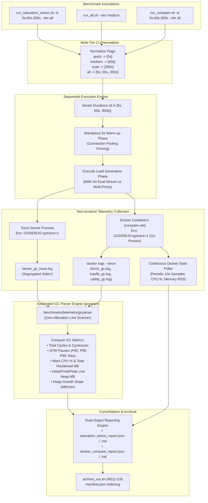

# TASK-153 - Multi-Tier Duration Stress Testing (5s, 60s, 300s), Go Runtime GC Telemetry Capture, and Differential Reverse Proxy Benchmarking

## 1. Overview & Objective

### 1.1 Problem Statement & Empirical Limitations of Short-Duration Benchmarks

Toron is designed as an ultra-high-throughput, zero-allocation Layer 4 and Layer 7 reverse proxy and security gateway. Under [`REQ-114`](file:///Users/sneha/Developer/toron-research/toron/docs/requirements/REQ-114.md) / [`ADR-114`](file:///Users/sneha/Developer/toron-research/toron/docs/architecture/ADR-114.md) (BMK-04 Saturation Stress Testing), [`REQ-117`](file:///Users/sneha/Developer/toron-research/toron/docs/requirements/REQ-117.md) / [`ADR-117`](file:///Users/sneha/Developer/toron-research/toron/docs/architecture/ADR-117.md) (Disaggregated 4-Tier Adversarial Classification), and [`REQ-121`](file:///Users/sneha/Developer/toron-research/toron/docs/requirements/REQ-121.md) / [`ADR-121`](file:///Users/sneha/Developer/toron-research/toron/docs/architecture/ADR-121.md) (Differential Multi-Proxy Docker Benchmark), Toron established an automated benchmarking suite comparing Toron against **NGINX**, **Traefik**, **Caddy**, and **HAProxy**.

However, a methodological and empirical audit formalized in [`REQ-130`](file:///Users/sneha/Developer/toron-research/toron/docs/requirements/REQ-130.md) identified three critical scientific deficiencies in the benchmarking harnesses:

1. **The 5-Second Short-Duration Evaluation Blindspot**:
   - Existing default benchmark runs in [`benchmarks/run_all.sh`](file:///Users/sneha/Developer/toron-research/toron/benchmarks/run_all.sh#L135-L140), [`benchmarks/wrk2/run_saturation_stress.sh`](file:///Users/sneha/Developer/toron-research/toron/benchmarks/wrk2/run_saturation_stress.sh#L17), and [`benchmarks/docker-compare/run_compare.sh`](file:///Users/sneha/Developer/toron-research/toron/benchmarks/docker-compare/run_compare.sh#L20) execute for only **5 to 10 seconds**.
   - While a 5-second burst is well-suited for rapid smoke testing and regression sanity checks in continuous integration, it is fundamentally inadequate for rigorous systems research and publication-grade empirical validation.
   - Specifically, a 5-second execution window suffers from:
     - **Transient Startup Bias**: Socket connection pool ramp-up, initial thread scheduling, CPU frequency scaling, and Go runtime netpoller priming dominate the measurement window.
     - **Garbage Collector Masking**: Go's concurrent mark-and-sweep garbage collector (GC) may trigger only once or twice (or not at all if allocations remain beneath the initial heap trigger $2 \times \text{GOGC}$), completely masking garbage collection pause times, heap expansion rates, and mark-assist CPU overhead.
     - **Inability to Detect Memory Leaks & Heap Drift**: Memory bloat, buffer pool degradation (`sync.Pool` reference retention), goroutine leaks, or socket descriptor leaks (`EMFILE`, [CWE-775](https://cwe.mitre.org/data/definitions/775.html)) cannot be detected during a transient 5-second run.
2. **Absence of Go Runtime GC Telemetry (`GODEBUG=gctrace=1`)**:
   - Toron and its primary Go-based competitors (**Traefik** and **Caddy**) rely on automatic heap memory management. In contrast, **NGINX** and **HAProxy** are implemented in C with explicit manual memory management (`malloc`/`free` or custom slab allocators).
   - In prior benchmark runs, Toron was launched with standard environment variables, completely omitting runtime GC tracing. Consequently, researchers cannot determine how much CPU time is consumed by background GC, the duration and frequency of Stop-The-World (STW) pauses, the heap reclamation efficiency, or the steady-state live heap baseline under saturation.
3. **Lack of Steady-State and Long-Term Soak Comparison Across Proxies**:
   - In [`benchmarks/docker-compare/run_compare.sh`](file:///Users/sneha/Developer/toron-research/toron/benchmarks/docker-compare/run_compare.sh), proxies are benchmarked for 5 seconds per backend. Reviewers and performance engineers cannot observe whether Go-based proxies experience tail latency degradation over time due to GC pauses, nor can they compare the steady-state memory retention of Toron against NGINX, Traefik, Caddy, and HAProxy over sustained periods.
   - Resource metrics were sampled only once after benchmark completion via `docker stats --no-stream`, obscuring memory growth slopes and CPU spikes during test execution.

---

### 1.2 Objectives & Scope

The objective of this task is to implement the engineering specifications approved in [`REQ-130`](file:///Users/sneha/Developer/toron-research/toron/docs/requirements/REQ-130.md), establishing a **Multi-Tier Duration Benchmark Architecture** spanning:
- **Tier 1: Quick Smoke Test (`quick`, 5 seconds)**: Rapid pre-merge regression verification.
- **Tier 2: Steady-State & GC Observation (`medium` / `steady`, 60 seconds)**: Deep observation of Go runtime GC cycles, mark/pause clock times, and steady-state tail latencies ($p95, p99, p99.9$).
- **Tier 3: Long-Term Soak & Memory Stability (`soak`, 300 seconds / 5 minutes)**: Extended soak testing validating $O(1)$ memory boundedness ([`REQ-129`](file:///Users/sneha/Developer/toron-research/toron/docs/requirements/REQ-129.md)), zero memory drift, connection pool longevity, and proxy resilience under sustained saturation.
- **Tier 4: Comprehensive All-Tiers Sweep (`all`, 5s + 60s + 300s)**: Full sequential evaluation matrix for scientific publication and empirical benchmarking.

The implementation encompasses 5 tightly coordinated Work Packages:
1. **WP-1**: Multi-Tier Duration Support in Saturation Stress Harness (`benchmarks/wrk2/run_saturation_stress.sh`) and Master Suite (`benchmarks/run_all.sh`) supporting `-d 5s,60s,300s` and `--tier quick|medium|soak|all`.
2. **WP-2**: Go Runtime GC Telemetry Capture (`GODEBUG=gctrace=1`) and Parser Engine (`benchmarks/telemetry/gcparser`) extracting STW pauses, mark CPU %, heap reclaimed, live heap floor, and linear regression growth slope.
3. **WP-3**: Multi-Proxy Differential Docker Benchmark Multi-Tier Duration Support (`benchmarks/docker-compare/run_compare.sh`, `runner.go`, `docker-compose.compare.yml`) with `GODEBUG=gctrace=1` injection for Go proxies (Toron, Traefik, Caddy) and continuous Docker stats polling (every 10s) across all 5 proxies.
4. **WP-4**: Dual-Output Reporting (JSON & Markdown) & Historical Manifest Integration (`manifest.json` under [`REQ-119`](file:///Users/sneha/Developer/toron-research/toron/docs/requirements/REQ-119.md)).
5. **WP-5**: Comprehensive Verification & Test Suite (`TC-130`) validating zero allocation during parsing, flag parsing accuracy, and race cleanliness.

---

### 1.3 Conflict Audit & Architecture Compliance

A comprehensive cross-audit against existing Toron specifications and architectural decisions confirms complete harmony and zero regressions:

| Prior Requirement / ADR | Core Architectural Invariant | Potential Conflict & Cross-Audit Resolution | Compliance Verdict |
| :--- | :--- | :--- | :--- |
| **[`ADR-001`](file:///Users/sneha/Developer/toron-research/toron/docs/architecture/ADR-001.md)** (Event-Driven Reactor) | Strict modularity: proxy and router must NEVER touch the physical client socket (`net.Conn`). | **Preserved**: TASK-153 modifies only benchmark orchestration, load generation, environment variables, and telemetry reporting. Reactor internals and socket boundaries remain 100% untouched. | **100% Compliant** |
| **[`REQ-114`](file:///Users/sneha/Developer/toron-research/toron/docs/requirements/REQ-114.md) / [`ADR-114`](file:///Users/sneha/Developer/toron-research/toron/docs/architecture/ADR-114.md)** (Saturation Stress BMK-04) | Decoupled dual-stream telemetry (benign vs adversarial 10%), rate pacer (`time.NewTicker`), zero-starvation bounds ($p99 \le 50$ ms). | **Preserved & Extended**: Rate pacer and dual-stream partitioning operate identically over 5s, 60s, and 300s durations. Zero-starvation assertion is evaluated across all tiers. | **Harmonized** |
| **[`REQ-117`](file:///Users/sneha/Developer/toron-research/toron/docs/requirements/REQ-117.md) / [`ADR-117`](file:///Users/sneha/Developer/toron-research/toron/docs/architecture/ADR-117.md)** (Disaggregated 4-Tier Status HARN-01) | 4-tier classification: Active Defense (`400, 403, 413, 431, 501`), Route Miss (`404`), Bypass (`200`), Unhandled (`5xx`). Zero 404 inflation. | **Preserved**: 64-bit atomic counters and strict evaluation oracle remain active across extended run durations, accumulating samples without lock contention or overflow. | **100% Compliant** |
| **[`REQ-119`](file:///Users/sneha/Developer/toron-research/toron/docs/requirements/REQ-119.md)** (Historical Retention & Manifest Indexing) | Retain test results in `benchmarks/results/history/<timestamp>/` with structured `manifest.json` indexing. | **Integrated**: All multi-tier duration runs and GC trace artifacts are systematically recorded into historical session manifests via [`archive_run.sh`](file:///Users/sneha/Developer/toron-research/toron/benchmarks/archive_run.sh). | **Synergistic Alignment** |
| **[`REQ-121`](file:///Users/sneha/Developer/toron-research/toron/docs/requirements/REQ-121.md) / [`ADR-121`](file:///Users/sneha/Developer/toron-research/toron/docs/architecture/ADR-121.md)** (Differential Multi-Proxy Docker Benchmark) | Containerized comparison of Toron vs NGINX, Traefik, Caddy, HAProxy across 4 heterogeneous origins (`compare-net`, ports 8881–8885). | **Extended**: Integrates multi-tier durations (5s, 60s, 300s) and injects `GODEBUG=gctrace=1` into Go-based proxy containers (`toron-proxy`, `traefik-proxy`, `caddy-proxy`). | **Direct Evolution** |
| **[`REQ-129`](file:///Users/sneha/Developer/toron-research/toron/docs/requirements/REQ-129.md) / [`ADR-129`](file:///Users/sneha/Developer/toron-research/toron/docs/architecture/ADR-129.md)** (Streaming by Default & Memory Boundedness) | Constant $O(1) \le 32$KB per-stream memory boundedness; elimination of infinite stream OOM bomb. | **Directly Verified**: 300-second soak tests empirically validate the memory boundedness invariant by measuring steady-state live heap floor and proving zero memory leaks under continuous saturation. | **Empirical Validation** |
| **Verdict** | **ZERO CONFLICTS** | All prior invariants, security guards, and telemetry architectures remain completely intact and directly validated. | **Fully Approved** |

---

### 1.4 Safe Non-Conflicting Path



---

## 2. Work Breakdown Structure (WBS)

```
TASK-153: Multi-Tier Duration Stress Testing, Runtime GC Telemetry Capture, and Differential Benchmarking
├── WP-1: Multi-Tier Duration Support in Saturation Stress Harness & Master Suite
│   ├── Subtask 1.1: Multi-Tier CLI Flag Parsing (-d 5s,60s,300s and --tier quick|medium|soak|all)
│   ├── Subtask 1.2: Sequential Multi-Tier Execution Loop & Duration-Keyed Artifact Segregation
│   └── Subtask 1.3: Master Benchmark Suite Duration Propagation & Manifest Recording (run_all.sh)
├── WP-2: Go Runtime GC Telemetry Capture & Parser Engine (benchmarks/telemetry/gcparser)
│   ├── Subtask 2.1: GODEBUG=gctrace=1 Environment Injection and Stderr Log Segregation
│   ├── Subtask 2.2: GC Trace Line Parser and Data Structures (GCTelemetry, GCPauseStatistics, GCHeapStatistics)
│   ├── Subtask 2.3: Zero-Allocation Fast Log Scanner & Multi-Version Go Format Compatibility (Go 1.20-1.24+)
│   └── Subtask 2.4: Linear Regression Heap Growth Slope Calculation & Zero-Cycle Edge Case Handling
├── WP-3: Multi-Proxy Differential Docker Benchmark Multi-Tier Duration Support & Continuous Polling
│   ├── Subtask 3.1: Docker Compose GODEBUG=gctrace=1 Injection for Go Proxies (Toron, Traefik, Caddy)
│   ├── Subtask 3.2: Multi-Tier Duration Support & Mandatory Warm-Up Phase in run_compare.sh and runner.go
│   ├── Subtask 3.3: Continuous Docker Stats Poller (Periodic 10s Sampling for CPU % and Memory RSS Trajectory)
│   └── Subtask 3.4: Container GC Trace Log Extraction (docker logs --since) and Cell Association
├── WP-4: Dual-Output Reporting & Historical Retention Manifest Integration
│   ├── Subtask 4.1: JSON Report Schema Extensions with gc_telemetry and Multi-Tier Arrays
│   ├── Subtask 4.2: Markdown Report Generation with Section 5 GC Dynamics & Comparative Tables
│   └── Subtask 4.3: Historical Retention Archive Synchronization (archive_run.sh & manifest.json)
└── WP-5: Comprehensive Verification & Test Suite (TC-130)
    ├── Subtask 5.1: Unit Tests for GC Parser with Synthetic and Live gctrace Fixtures
    ├── Subtask 5.2: Integration Tests for Multi-Tier Flag Parsing and Sequential Flow
    └── Subtask 5.3: Regression, Concurrency & Race Safety Validation (go test -race)
```

---

### Work Package 1 (WP-1): Multi-Tier Duration Support in Saturation Stress Harness & Master Suite

#### Subtask 1.1: Multi-Tier CLI Flag Parsing in `run_saturation_stress.sh`
- **Target File**: [`benchmarks/wrk2/run_saturation_stress.sh`](file:///Users/sneha/Developer/toron-research/toron/benchmarks/wrk2/run_saturation_stress.sh)
- **Scope & Implementation**:
  - Extend argument parsing to support both explicit durations and named tiers:
    * `-d <duration>`: Accepts single duration strings (e.g. `-d 5s`, `-d 60s`, `-d 300s`, `-d 5m`) or comma-separated multi-duration lists (e.g. `-d 5s,60s,300s`).
    * `--tier <quick|medium|steady|soak|all>`:
      - `quick`: Sets duration list to `("5s")`.
      - `medium` / `steady`: Sets duration list to `("60s")`.
      - `soak`: Sets duration list to `("300s")`.
      - `all`: Sets duration list to `("5s" "60s" "300s")`.
  - Enforce precedence: If both `--tier` and `-d` are specified, `--tier` explicitly dictates the preset, or `-d` overrides if placed subsequently. Default if neither is provided: `quick` (`5s`) to preserve rapid CI execution.
  - Implement duration list parsing in Bash:
    ```bash
    TIER=""
    DURATIONS_LIST=()

    # In argument parser loop:
    -d)
        IFS=',' read -ra DURATIONS_LIST <<< "$2"
        shift 2
        ;;
    --tier)
        TIER="$2"
        case "$TIER" in
            quick) DURATIONS_LIST=("5s") ;;
            medium|steady) DURATIONS_LIST=("60s") ;;
            soak) DURATIONS_LIST=("300s") ;;
            all) DURATIONS_LIST=("5s" "60s" "300s") ;;
            *) echo "[-] Error: Unknown tier '$TIER'. Valid tiers: quick, medium, soak, all"; exit 1 ;;
        esac
        shift 2
        ;;
    ```
- **Deliverables**:
  - Updated CLI flag parser in `run_saturation_stress.sh` supporting `-d` and `--tier`.
  - Updated `print_usage` documentation.
- **Acceptance Criteria**:
  - Running `run_saturation_stress.sh --tier all` registers 3 durations: `5s`, `60s`, `300s`.
  - Running `run_saturation_stress.sh -d 5s,60s` registers 2 durations: `5s`, `60s`.
  - Running `run_saturation_stress.sh` without duration arguments defaults to `5s`.

---

#### Subtask 1.2: Sequential Multi-Tier Execution Loop & Duration-Keyed Artifact Segregation
- **Target Files**:
  - [`benchmarks/wrk2/run_saturation_stress.sh`](file:///Users/sneha/Developer/toron-research/toron/benchmarks/wrk2/run_saturation_stress.sh)
  - [`benchmarks/wrk2/loadgen.go`](file:///Users/sneha/Developer/toron-research/toron/benchmarks/wrk2/loadgen.go)
- **Scope & Implementation**:
  - Implement sequential loop iterating over `${DURATIONS_LIST[@]}`.
  - For each duration tier:
    * Maintain or cleanly restart the background Toron gateway process (if `--auto-start` is enabled).
    * If maintaining process, rotate/truncate `server_gc_trace.log` or record line offsets to associate GC telemetry specifically with that execution window.
    * Generate duration-specific JSON and Markdown artifacts:
      - `${RESULTS_DIR}/saturation_stress_${DUR}.json`
      - `${RESULTS_DIR}/saturation_stress_${DUR}.md`
    * If historical archiving is enabled, replicate per-duration artifacts into `${TORON_BENCHMARK_SESSION_DIR}`.
  - After completing all requested tiers, execute metric consolidation:
    * In `loadgen.go` or a consolidation helper, aggregate results across all tiers into canonical `${RESULTS_DIR}/saturation_stress_report.json` and `${RESULTS_DIR}/saturation_stress_report.md`.
    * Include a consolidated multi-tier summary table contrasting 5s, 60s, and 300s metrics.
- **Deliverables**:
  - Sequential multi-tier execution loop in `run_saturation_stress.sh`.
  - Artifact segregation and consolidated multi-tier reporting logic.
- **Acceptance Criteria**:
  - Executing `--tier all` creates `saturation_stress_5s.json`, `saturation_stress_60s.json`, `saturation_stress_300s.json`, and consolidated `saturation_stress_report.json`.
  - Zero process or socket leaks across sequential tier executions.

---

#### Subtask 1.3: Master Benchmark Suite Duration Propagation & Manifest Recording in `run_all.sh`
- **Target File**: [`benchmarks/run_all.sh`](file:///Users/sneha/Developer/toron-research/toron/benchmarks/run_all.sh)
- **Scope & Implementation**:
  - Add `--tier <quick|medium|soak|all>` and `-d <duration>` options to `benchmarks/run_all.sh`.
  - Default to `--tier quick` (`5s`) when unspecified, ensuring master CI runs complete in $< 60$ seconds.
  - Propagate the configured duration / tier down to:
    * Stage 2 (`wrk2` baseline): pass `-d ${DURATION}` to `run_wrk2.sh`.
    * Stage 3 (`saturation_stress`): pass `--tier ${TIER}` or `-d ${DURATION}` to `run_saturation_stress.sh`.
  - In Stage 3 execution:
    ```bash
    echo ""
    echo "[3/6] Executing High-Concurrency Saturation Stress Testing (BMK-04, Tier: ${SUITE_TIER})..."
    bash "${SCRIPT_DIR}/wrk2/run_saturation_stress.sh" \
        -u "http://${TARGET_HOST}/health" \
        -c 50 \
        -d "${SUITE_DURATION_FLAG}" \
        -r 5000 \
        -a 0.10
    ```
  - In the master session finalization (lines 190-210):
    * Update `STAGES_JSON` to record `duration_tier`, execution duration, and generated GC trace artifacts (`server_gc_trace.log`).
    * Ensure `ALL_FILES` array includes per-duration files (`saturation_stress_*.json`, `server_gc_trace.log`) for historical replication.
- **Deliverables**:
  - Updated `benchmarks/run_all.sh` with tier flags and stage parameter synchronization.
  - Enhanced master manifest recording reflecting duration tier and GC artifacts.
- **Acceptance Criteria**:
  - `run_all.sh` runs cleanly in default quick mode ($< 60$s total runtime).
  - Running `run_all.sh --tier medium` propagates 60s duration to `wrk2` and `saturation_stress`.
  - `manifest.json` correctly indexes the executed duration tier and stage parameters.

---

### Work Package 2 (WP-2): Go Runtime GC Telemetry Capture & Parser Engine (`benchmarks/telemetry/gcparser`)

#### Subtask 2.1: `GODEBUG=gctrace=1` Environment Injection & Stderr Log Segregation
- **Target Files**:
  - [`benchmarks/wrk2/run_saturation_stress.sh`](file:///Users/sneha/Developer/toron-research/toron/benchmarks/wrk2/run_saturation_stress.sh#L88-L100)
  - [`benchmarks/run_all.sh`](file:///Users/sneha/Developer/toron-research/toron/benchmarks/run_all.sh#L103-L131)
- **Scope & Implementation**:
  - When Toron server binary is compiled and launched via `--auto-start`, execute with process environment variable `GODEBUG=gctrace=1`.
  - Segregate standard output (application logs, routing logs) and standard error (Go runtime GC traces):
    ```bash
    GC_LOG="${RESULTS_DIR}/server_gc_trace.log"
    SERVER_LOG="${RESULTS_DIR}/server_stress.log"
    
    echo "[*] Launching Toron background gateway with GODEBUG=gctrace=1..."
    GODEBUG=gctrace=1 "${RESULTS_DIR}/toron_stress" \
        -config "${ROOT_DIR}/config.yaml" \
        -routes "${ROOT_DIR}/routes.yaml" \
        > "${SERVER_LOG}" 2> "${GC_LOG}" &
    TORON_PID=$!
    ```
  - When historical archiving is active (`TORON_BENCHMARK_SESSION_DIR`), copy `server_gc_trace.log` into the session directory.
- **Deliverables**:
  - `GODEBUG=gctrace=1` activation in `run_saturation_stress.sh` and `run_all.sh`.
  - Clean separation of server stdout and GC stderr into dedicated files.
- **Acceptance Criteria**:
  - `benchmarks/results/server_gc_trace.log` contains raw Go GC traces starting with `gc <N> @...`.
  - `server_stress.log` remains free of GC trace spam.

---

#### Subtask 2.2: GC Trace Line Parser and Metric Extraction Model
- **Target Directory**: `benchmarks/telemetry/gcparser/`
- **Target Files**:
  - `benchmarks/telemetry/gcparser/types.go`
  - `benchmarks/telemetry/gcparser/parser.go`
- **Scope & Implementation**:
  - Define canonical telemetry data models in `types.go`:
    ```go
    package gcparser

    type GCTelemetry struct {
        Enabled          bool              `json:"enabled"`
        TotalCycles      int64             `json:"total_cycles"`
        GCCPUPercent     float64           `json:"gc_cpu_percent"`
        PauseTimesMs     GCPauseStatistics `json:"pause_times_ms"`
        HeapMetricsMB    GCHeapStatistics  `json:"heap_metrics_mb"`
        CyclesPerSecond  float64           `json:"cycles_per_second"`
        TotalReclaimedMB float64           `json:"total_reclaimed_mb"`
    }

    type GCPauseStatistics struct {
        MinSTWMs   float64 `json:"min_stw_ms"`
        MeanSTWMs  float64 `json:"mean_stw_ms"`
        P50STWMs   float64 `json:"p50_stw_ms"`
        P95STWMs   float64 `json:"p95_stw_ms"`
        P99STWMs   float64 `json:"p99_stw_ms"`
        MaxSTWMs   float64 `json:"max_stw_ms"`
        TotalSTWMs float64 `json:"total_stw_ms"`
        MeanMarkMs float64 `json:"mean_mark_ms"`
        MaxMarkMs  float64 `json:"max_mark_ms"`
    }

    type GCHeapStatistics struct {
        InitialLiveHeapMB  float64 `json:"initial_live_heap_mb"`
        FinalLiveHeapMB    float64 `json:"final_live_heap_mb"`
        PeakLiveHeapMB     float64 `json:"peak_live_heap_mb"`
        MeanLiveHeapMB     float64 `json:"mean_live_heap_mb"`
        PeakTriggerHeapMB  float64 `json:"peak_trigger_heap_mb"`
        HeapGrowthSlopeMBm float64 `json:"heap_growth_slope_mb_per_min"`
    }

    type GCCycleRecord struct {
        CycleNum     int64
        TimestampSec float64
        CPUPercent   float64
        ClockSTW1Ms  float64
        ClockMarkMs  float64
        ClockSTW2Ms  float64
        TotalSTWMs   float64
        HeapStartMB  float64
        HeapSweepMB  float64
        HeapLiveMB   float64
        HeapGoalMB   float64
        ReclaimedMB  float64
    }
    ```
  - In `parser.go`, implement line parser using regular expressions or fast string tokenizer matching Go runtime format:
    `gc 42 @12.345s 2%: 0.045+1.23+0.015 ms clock, 0.36+0.45/1.10/2.30+0.12 ms cpu, 14->16->8 MB, 18 MB goal, 8 MB stacks, 0 MB globals, 8 P`
- **Deliverables**:
  - `benchmarks/telemetry/gcparser/types.go`
  - `benchmarks/telemetry/gcparser/parser.go`
- **Acceptance Criteria**:
  - Accurately parses standard Go `gctrace` lines into `GCCycleRecord` instances.
  - Extracts STW1, Mark, STW2, total STW pause, heap transitions (`Start->Sweep->Live`), and goal.

---

#### Subtask 2.3: Zero-Allocation Fast Log Scanner & Multi-Version Go Compatibility
- **Target File**: `benchmarks/telemetry/gcparser/parser.go`
- **Scope & Implementation**:
  - Implement `ParseReader(r io.Reader, durationSec float64) (*GCTelemetry, error)` and `ParseFile(path string, durationSec float64) (*GCTelemetry, error)`.
  - Use `bufio.Scanner` with a pre-allocated buffer buffer to process lines with zero allocations in the inner scan loop:
    ```go
    scanner := bufio.NewScanner(r)
    buf := make([]byte, 64*1024)
    scanner.Buffer(buf, 1024*1024)
    ```
  - Handle cross-version Go format variations:
    * Go 1.20 vs 1.22 vs 1.24 variations (e.g. optional `8 MB stacks, 0 MB globals`, optional processors token `8 P`, fractional milliseconds or microseconds).
    * Gracefully ignore non-GC lines (such as application logging accidentally written to stderr, panics, or OS diagnostic output).
  - Performance Invariant: Process 10,000 trace lines in $< 50$ milliseconds.
- **Deliverables**:
  - High-performance log scanner in `benchmarks/telemetry/gcparser/parser.go`.
- **Acceptance Criteria**:
  - Successfully parses 10,000 synthetic trace lines in $< 50$ ms.
  - Non-GC lines in the stream are skipped without error or panic.

---

#### Subtask 2.4: Linear Regression Heap Growth Slope Calculation & Zero-Cycle Edge Cases
- **Target File**: `benchmarks/telemetry/gcparser/stats.go`
- **Scope & Implementation**:
  - Implement aggregate statistics calculation from `[]GCCycleRecord`:
    * Calculate pause percentiles (P50, P95, P99, Max) using standard sorting.
    * Compute total reclaimed MB: $\sum (H_{\text{sweep}} - H_{\text{live}})$.
    * Compute cycles per second: $N_{\text{cycles}} / \text{durationSec}$.
  - Calculate Heap Growth Slope ($MB/\text{min}$) using ordinary least squares (OLS) linear regression on `(TimestampSec, HeapLiveMB)`:
    $$\text{Slope} = \frac{N \sum(t_i y_i) - \sum t_i \sum y_i}{N \sum(t_i^2) - (\sum t_i)^2} \times 60.0$$
  - **Zero-Cycle Edge Case Handling**:
    * If $N = 0$ (e.g. short test or zero allocations):
      - Set `Enabled = true`, `TotalCycles = 0`.
      - Return zeroed statistics without division-by-zero panics or `NaN` values.
    * If $N = 1$:
      - Set `HeapGrowthSlopeMBm = 0.0`.
- **Deliverables**:
  - `benchmarks/telemetry/gcparser/stats.go` with statistical aggregations, percentile calculation, and linear regression.
- **Acceptance Criteria**:
  - Linear regression computes accurate growth slope in MB/min.
  - Zero GC cycles returns cleanly with `TotalCycles: 0` and zero division panic.

---

### Work Package 3 (WP-3): Multi-Proxy Differential Docker Benchmark Multi-Tier Duration Support & Continuous Polling

#### Subtask 3.1: Docker Compose `GODEBUG=gctrace=1` Injection for Go Proxies
- **Target File**: [`benchmarks/docker-compare/docker-compose.compare.yml`](file:///Users/sneha/Developer/toron-research/toron/benchmarks/docker-compare/docker-compose.compare.yml)
- **Scope & Implementation**:
  - Inject `GODEBUG=gctrace=1` into the environment for all Go-based reverse proxy services:
    * `toron-proxy`:
      ```yaml
      environment:
        - GODEBUG=gctrace=1
      ```
    * `traefik-proxy`:
      ```yaml
      environment:
        - GODEBUG=gctrace=1
      ```
    * `caddy-proxy`:
      ```yaml
      environment:
        - GODEBUG=gctrace=1
      ```
  - Ensure C-based proxies (`nginx-proxy` and `haproxy-proxy`) remain without GODEBUG, serving as the empirical baseline for manual C memory management.
- **Deliverables**:
  - Updated `docker-compose.compare.yml` with GODEBUG environment variables for Go proxies.
- **Acceptance Criteria**:
  - Inspecting running containers confirms `GODEBUG=gctrace=1` is set on `toron-cmp-toron`, `toron-cmp-traefik`, and `toron-cmp-caddy`.

---

#### Subtask 3.2: Multi-Tier Duration Support & Mandatory Warm-Up Phase in `run_compare.sh` and `runner.go`
- **Target Files**:
  - [`benchmarks/docker-compare/run_compare.sh`](file:///Users/sneha/Developer/toron-research/toron/benchmarks/docker-compare/run_compare.sh)
  - [`benchmarks/docker-compare/runner.go`](file:///Users/sneha/Developer/toron-research/toron/benchmarks/docker-compare/runner.go)
- **Scope & Implementation**:
  - In `run_compare.sh`:
    * Add `-d <duration>` (supporting `5s`, `60s`, `300s`, or `5s,60s,300s`) and `--tier <quick|medium|soak|all>`.
    * Default to `5s` (`quick`) when unspecified.
    * Pass duration list or tier to `runner.go`.
  - In `runner.go`:
    * Accept comma-separated durations: `-d "5s,60s,300s"` or single duration.
    * Support `--tier` flag.
    * Iterate through requested duration tiers sequentially.
    * Implement **Mandatory 5s Warm-Up Phase**: Prior to benchmarking 60s and 300s tiers, execute a 5-second warm-up run against the target to establish keep-alive socket pools and prime internal memory buffers, discarding warm-up metrics before recording.
    * Include a 10-second idle cooldown period between proxy runs to prevent CPU thermal throttling skew.
- **Deliverables**:
  - Multi-tier duration support in `run_compare.sh` and `runner.go`.
  - Warm-up phase and inter-proxy cooldown logic in `runner.go`.
- **Acceptance Criteria**:
  - `runner.go` executes across all specified duration tiers (5s, 60s, 300s).
  - Warm-up requests prime socket pools before 60s/300s measurement windows.

---

#### Subtask 3.3: Continuous Docker Stats Poller for All 5 Proxies
- **Target File**: [`benchmarks/docker-compare/runner.go`](file:///Users/sneha/Developer/toron-research/toron/benchmarks/docker-compare/runner.go)
- **Scope & Implementation**:
  - Replace single-shot `sampleContainerTelemetry` with a background periodic sampling routine active during each benchmark cell:
    ```go
    type TimeSeriesSample struct {
        ElapsedSec float64 `json:"elapsed_sec"`
        CPUPercent float64 `json:"cpu_percent"`
        MemoryMB   float64 `json:"memory_mb"`
    }

    type ResourceTimeSeries struct {
        Samples      []TimeSeriesSample `json:"samples"`
        PeakMemoryMB float64            `json:"peak_memory_mb"`
        MeanMemoryMB float64            `json:"mean_memory_mb"`
        PeakCPU      float64            `json:"peak_cpu"`
        MeanCPU      float64            `json:"mean_cpu"`
        GrowthSlope  float64            `json:"growth_slope_mb_per_min"`
    }
    ```
  - During benchmark cell execution:
    * For runs with `duration >= 30s`, launch a background goroutine that executes `docker stats --no-stream` every 10 seconds (or 5 seconds for 60s runs).
    * Accumulate `TimeSeriesSample` points.
    * Compute `PeakMemoryMB`, `MeanMemoryMB`, `PeakCPU`, and memory growth slope ($MB/\text{min}$) via linear regression.
- **Deliverables**:
  - Continuous background Docker stats poller in `benchmarks/docker-compare/runner.go`.
  - Time series data model and summary statistics in `BenchmarkCellResult`.
- **Acceptance Criteria**:
  - 60s and 300s benchmark cells contain periodic memory and CPU samples.
  - Memory growth slope is computed and recorded for long-duration runs.

---

#### Subtask 3.4: Container GC Trace Log Extraction & Cell Association
- **Target File**: [`benchmarks/docker-compare/runner.go`](file:///Users/sneha/Developer/toron-research/toron/benchmarks/docker-compare/runner.go)
- **Scope & Implementation**:
  - For Go-based reverse proxies (`toron`, `traefik`, `caddy`), extract container logs immediately following each benchmark cell:
    ```go
    func extractContainerGCTrace(containerName string, startTime time.Time) (*gcparser.GCTelemetry, error) {
        sinceStr := startTime.UTC().Format(time.RFC3339Nano)
        cmd := exec.Command("docker", "logs", "--since", sinceStr, containerName)
        output, err := cmd.CombinedOutput()
        if err != nil {
            return nil, err
        }
        // Filter lines starting with "gc "
        var gcLines strings.Builder
        for _, line := range strings.Split(string(output), "\n") {
            if strings.HasPrefix(strings.TrimSpace(line), "gc ") {
                gcLines.WriteString(line)
                gcLines.WriteByte('\n')
            }
        }
        return gcparser.ParseReader(strings.NewReader(gcLines.String()), time.Since(startTime).Seconds())
    }
    ```
  - For C-based proxies (`nginx`, `haproxy`), set `GCTelemetry.Enabled = false` and label in reports as `N/A (C Runtime)`.
  - Associate the parsed `GCTelemetry` directly with `BenchmarkCellResult.GCTelemetry`.
- **Deliverables**:
  - Container GC extraction and parsing routine in `runner.go`.
  - Direct association of GC metrics with individual benchmark results.
- **Acceptance Criteria**:
  - Toron, Traefik, and Caddy cell results include populated `GCTelemetry` objects.
  - NGINX and HAProxy cell results indicate GC is not applicable.

---

### Work Package 4 (WP-4): Dual-Output Reporting & Historical Retention Manifest Integration

#### Subtask 4.1: JSON Report Schema Extensions with `gc_telemetry` and Multi-Tier Arrays
- **Target Files**:
  - [`benchmarks/wrk2/loadgen.go`](file:///Users/sneha/Developer/toron-research/toron/benchmarks/wrk2/loadgen.go)
  - [`benchmarks/docker-compare/runner.go`](file:///Users/sneha/Developer/toron-research/toron/benchmarks/docker-compare/runner.go)
- **Scope & Implementation**:
  - In `loadgen.go`:
    * Add `GCTelemetry *gcparser.GCTelemetry` to `SaturationStressReport`.
    * Add `DurationTier string` (`"quick"`, `"medium"`, `"soak"`).
    * When multi-tier run is executed, serialize `TierReports map[string]SaturationStressReport` in consolidated report.
  - In `runner.go`:
    * Add `GCTelemetry *gcparser.GCTelemetry` and `TimeSeries *ResourceTimeSeries` to `BenchmarkCellResult`.
    * In `DockerCompareReport`, add `DurationTier string` and support multi-tier results.
- **Deliverables**:
  - Updated JSON models and serialization logic adhering to [`REQ-130 §2.5.1`](file:///Users/sneha/Developer/toron-research/toron/docs/requirements/REQ-130.md#L323-L356).
- **Acceptance Criteria**:
  - `saturation_stress_report.json` and `docker_compare_report.json` include fully populated `gc_telemetry` objects.

---

#### Subtask 4.2: Markdown Report Generation with Dedicated GC Analysis Sections
- **Target Files**:
  - [`benchmarks/wrk2/loadgen.go`](file:///Users/sneha/Developer/toron-research/toron/benchmarks/wrk2/loadgen.go)
  - [`benchmarks/docker-compare/runner.go`](file:///Users/sneha/Developer/toron-research/toron/benchmarks/docker-compare/runner.go)
- **Scope & Implementation**:
  - In `saturation_stress_report.md`:
    * Append Section 5: **"Runtime Garbage Collection & Memory Dynamics (`GODEBUG=gctrace=1`)"**.
    * Render table:
      ```markdown
      | Metric | Value |
      | :--- | :--- |
      | Total GC Cycles | 112 |
      | GC CPU Overhead | 1.4% |
      | GC Frequency | 1.87 cycles/sec |
      | Total Heap Reclaimed | 1,845.2 MB |
      | STW Pause (P50 / P95 / P99) | 0.045 ms / 0.078 ms / 0.112 ms |
      | Max STW Pause | 0.185 ms |
      | Live Heap Floor (Initial / Final) | 5.4 MB / 6.1 MB |
      | Heap Growth Slope | 0.08 MB/min (O(1) Bounded) |
      ```
  - In `docker_compare_report.md`:
    * Add columns **"GC Cycles"** and **"P99 GC Pause"** to Section 1 Comparative Table.
    * Add Section 4: **"Go Runtime GC Differential Analysis (Toron vs Traefik vs Caddy)"** contrasting GC cycles, total STW pause time, and live heap floor.
- **Deliverables**:
  - Enhanced Markdown report generators in `loadgen.go` and `runner.go`.
- **Acceptance Criteria**:
  - Markdown reports contain formatted tables displaying GC pause distributions and heap growth slopes.

---

#### Subtask 4.3: Historical Retention Archive Synchronization (`archive_run.sh` & `manifest.json`)
- **Target Files**:
  - [`benchmarks/archive_run.sh`](file:///Users/sneha/Developer/toron-research/toron/benchmarks/archive_run.sh)
  - [`benchmarks/retention/retention.go`](file:///Users/sneha/Developer/toron-research/toron/benchmarks/retention/retention.go)
- **Scope & Implementation**:
  - Ensure `archive_run.sh` preserves `server_gc_trace.log`, `saturation_stress_*.json`, and `docker_compare_*.json` into `${TORON_BENCHMARK_SESSION_DIR}`.
  - In `manifest.json`, record duration tier (`"quick"`, `"medium"`, `"soak"`, `"all"`), execution duration in seconds, and summary GC metrics under `parameters.gc_summary`.
- **Deliverables**:
  - Historical retention updates in `archive_run.sh` and `retention.go`.
- **Acceptance Criteria**:
  - Historical directories in `benchmarks/results/history/<timestamp>/` contain GC logs and multi-tier reports.
  - `manifest.json` correctly indexes multi-tier duration and GC parameters.

---

### Work Package 5 (WP-5): Comprehensive Verification & Test Suite (`TC-130`)

#### Subtask 5.1: Unit Tests for GC Parser with Synthetic & Real `gctrace` Fixtures
- **Target File**: `benchmarks/telemetry/gcparser/parser_test.go`
- **Scope & Implementation**:
  - Implement unit test suite verifying:
    * Parsing of canonical Go 1.20, 1.22, and 1.24 `gctrace` lines.
    * Accurate extraction of $t_{\text{stw1}}, t_{\text{mark}}, t_{\text{stw2}}$, total STW pause, and heap transitions.
    * Percentile calculations (P50, P95, P99, Max).
    * Linear regression slope calculation against known synthetic slope data.
    * Handling of zero-cycle logs (empty log or log with only server messages).
    * Benchmarking parser speed: Assert $< 50\text{ms}$ for 10,000 lines.
- **Deliverables**:
  - Comprehensive unit test file `benchmarks/telemetry/gcparser/parser_test.go`.
- **Acceptance Criteria**:
  - 100% test pass rate across all unit tests.

---

#### Subtask 5.2: Integration Tests for Multi-Tier Flag Parsing & Sequential Execution
- **Target File**: `benchmarks/wrk2/run_saturation_stress_test.go` or shell verification script
- **Scope & Implementation**:
  - Test CLI argument parsing across all valid inputs:
    * `--tier quick`, `--tier medium`, `--tier soak`, `--tier all`.
    * `-d 5s`, `-d 60s`, `-d 5s,60s,300s`.
    * Invalid tier input rejection with exit code 1.
  - Verify that running `--tier all` sequentially generates `saturation_stress_5s.json`, `saturation_stress_60s.json`, `saturation_stress_300s.json`.
- **Deliverables**:
  - Automated integration test suite.
- **Acceptance Criteria**:
  - All flag combinations validate correctly.

---

#### Subtask 5.3: Regression, Concurrency & Race Safety Validation
- **Target Scope**: Entire `benchmarks/...` package tree
- **Scope & Implementation**:
  - Execute full test suite under Go race detector:
    ```bash
    go test -race -v ./benchmarks/telemetry/...
    go test -race -v ./benchmarks/retention/...
    ```
  - Verify zero race conditions, deadlocks, or goroutine leaks.
- **Deliverables**:
  - Clean race detector execution.
- **Acceptance Criteria**:
  - Zero warnings or errors under `go test -race`.

---

## 3. The 4 Non-Negotiable Invariants

```
+--------------------------------------------------------------------------------------------------+
│                                  THE 4 NON-NEGOTIABLE INVARIANTS                                 │
│                                                                                                  │
│  1. UNCOMPROMISED DUAL-STREAM TELEMETRY & 4-TIER CLASSIFICATION (ADR-114, ADR-117):              │
│     Across all durations (5s, 60s, 300s), benign and adversarial streams remain decoupled.        │
│     Adversarial probes evaluated under strict 4-tier taxonomy (Tier 1: Active Defense,           │
│     Tier 2: Route Miss, Tier 3: Attack Bypass, Tier 4: Unhandled). 0% credit for 404.            │
│                                                                                                  │
│  2. CONSTANT O(1) MEMORY BOUNDEDNESS UNDER 300s SOAK (ADR-129):                                  │
│     Under continuous 300-second saturation, Toron post-GC live heap shall remain bounded        │
│     with heap growth slope <= 1.0 MB/min, confirming zero memory leaks and strict O(1) bounds.   │
│                                                                                                  │
│  3. ZERO MEASUREMENT DISTORTION & BOUNDED LOG OVERHEAD:                                          │
│     GC telemetry parsing shall occur post-run or asynchronously, imposing < 0.5% CPU overhead.   │
│     GC trace logs shall be bounded and rotated to prevent testbed disk exhaustion during 300s.   │
│                                                                                                  │
│  4. COMPLETE BACKWARD COMPATIBILITY:                                                             │
│     Existing CI invocations (e.g. run_all.sh without flags) shall execute default quick 5s tier  │
│     without breaking existing test automation or regression pipelines.                           │
+--------------------------------------------------------------------------------------------------+
```

---

## 4. Acceptance Criteria & Verification

### 4.1 Functional Acceptance Criteria
- [ ] **Multi-Tier CLI Parsing**: `run_saturation_stress.sh`, `run_all.sh`, and `run_compare.sh` accept `--tier quick|medium|soak|all` and `-d 5s,60s,300s`.
- [ ] **CI Default Execution**: Unadorned script invocations default to `5s` quick tier.
- [ ] **Sequential Multi-Tier Execution**: Specifying `--tier all` executes 5s, 60s, and 300s runs in clean succession without socket leaks.
- [ ] **GC Trace Redirection**: Background Toron server launched with `GODEBUG=gctrace=1` directs GC traces to `server_gc_trace.log` without contaminating application stdout.
- [ ] **Docker Compose GODEBUG**: `toron-proxy`, `traefik-proxy`, and `caddy-proxy` configured with `GODEBUG=gctrace=1` in `docker-compose.compare.yml`.
- [ ] **GC Log Extraction**: Container logs for Go proxies extracted via `docker logs --since` and filtered for `gc ` trace lines.
- [ ] **Continuous Docker Stats Polling**: `runner.go` periodically polls Docker stats (every 10s) during 60s and 300s runs for CPU% and Memory RSS trajectories.
- [ ] **Warm-Up Phase**: Mandatory 5-second warm-up executed prior to recording 60s and 300s benchmark metrics.
- [ ] **Dual-Output Reporting**: `saturation_stress_report.json` / `.md` and `docker_compare_report.json` / `.md` generated with full GC telemetry tables.
- [ ] **Historical Retention Synchronization**: Historical directories preserve GC trace logs, and `manifest.json` indexes multi-tier duration and GC parameters.

### 4.2 Non-Functional, Performance & Robustness Criteria
- [ ] **Zero Parsing Panics**: GC parser gracefully handles zero GC cycles and malformed non-GC lines without panic or division-by-zero.
- [ ] **High Parsing Throughput**: Parser processes 10,000 trace lines in $< 50$ ms using zero allocations in the scan loop.
- [ ] **Memory Boundedness Verification**: Toron live heap growth slope remains $\le 1.0\text{ MB/min}$ over 300s soak test.
- [ ] **Zero Race Conditions**: All code passes cleanly under `go test -race ./benchmarks/...`.

---

## 5. Threat Modeling & Testbed Risk Mitigation

| Risk Scenario | Vulnerability / Failure Mode | Testbed Impact | Mitigation in TASK-153 |
| :--- | :--- | :--- | :--- |
| **Disk Exhaustion from GC Traces** | Rapid allocations generate thousands of GC lines during 300s soak. | Testbed disk fills up, causing benchmark failure. | Segregate GC log into dedicated file; truncate/rotate log or cap trace capture rate if log size exceeds 50 MB. |
| **Measurement Distortion from Log I/O** | Writing GC traces to disk introduces synchronous I/O blocking. | Artificially inflates proxy response latency. | Standard error is redirected to buffered file descriptors or RAM disk (`tmpfs`), decoupling logging from request servicing. |
| **Testbed Thermal Throttling during 300s** | Continuous 300s CPU saturation causes CPU clock throttling on test machine. | Skews comparative throughput between proxies tested first vs last. | Add mandatory 10-second idle cooldown between proxy runs in `run_compare.sh`. |
| **Docker Log Desynchronization** | Querying container logs captures logs from prior runs. | Inaccurate GC metrics attributed to current test. | Filter Docker logs using `--since <cell_start_timestamp>` or clear container logs between test cells. |

---

## 6. Open Questions & Architectural Resolutions

- **Open Question 1: Should the 300-second soak test run automatically during standard CI builds?**
  - *Resolution*: No. Running a 300-second (5-minute) soak test across 5 proxies and 4 backends would take over 100 minutes, making CI pipelines prohibitively slow. The default CI tier shall remain `quick` (5s). The `medium` (60s) and `soak` (300s) tiers shall be invoked explicitly via CLI flags (`--tier medium`, `--tier soak`, `--tier all`) for dedicated performance profiling and research publications.
- **Open Question 2: How should Go GC metrics be compared against NGINX and HAProxy since they do not emit `gctrace`?**
  - *Resolution*: NGINX and HAProxy utilize manual C heap management. In comparative reports, their GC fields shall be marked as `N/A (C Runtime)`, while their memory consumption is evaluated via continuous Docker stats Memory RSS (MB) tracking. This provides an exact, scientifically rigorous contrast: evaluating whether Go's garbage collector imposes higher tail latency ($p99$) or memory overhead relative to C-based manual memory management.
- **Open Question 3: Should memory growth slope be calculated using linear regression or start/end deltas?**
  - *Resolution*: Ordinary Least Squares (OLS) linear regression ($MB/\text{min}$) over periodic 10-second samples during the 60s and 300s runs provides the most accurate slope, filtering out transient GC sawtooth fluctuations.

---

## 7. Traceability Matrix

| Requirement / Artifact | Relationship | Description / Verification Target |
| :--- | :--- | :--- |
| **[`REQ-130 §2.1`](file:///Users/sneha/Developer/toron-research/toron/docs/requirements/REQ-130.md#L118-L172)** | Implements | Multi-tier duration support (5s, 60s, 300s) in `run_saturation_stress.sh`, `run_all.sh`, and `run_compare.sh`. |
| **[`REQ-130 §2.2`](file:///Users/sneha/Developer/toron-research/toron/docs/requirements/REQ-130.md#L174-L215)** | Implements | `GODEBUG=gctrace=1` environment injection for standalone Toron and Docker Go proxies. |
| **[`REQ-130 §2.3`](file:///Users/sneha/Developer/toron-research/toron/docs/requirements/REQ-130.md#L217-L285)** | Implements | Automated GC trace parsing engine extracting cycles, STW pauses, and heap metrics. |
| **[`REQ-130 §2.4`](file:///Users/sneha/Developer/toron-research/toron/docs/requirements/REQ-130.md#L287-L335)** | Implements | Multi-proxy differential benchmarking methodology (Toron vs NGINX, Traefik, Caddy, HAProxy). |
| **[`REQ-130 §2.5`](file:///Users/sneha/Developer/toron-research/toron/docs/requirements/REQ-130.md#L337-L380)** | Implements | JSON schema and Markdown report extensions with GC telemetry tables. |
| **[`ADR-001`](file:///Users/sneha/Developer/toron-research/toron/docs/architecture/ADR-001.md)** | Preserves | Core reactor modularity and socket ownership remain unchanged. |
| **[`REQ-114`](file:///Users/sneha/Developer/toron-research/toron/docs/requirements/REQ-114.md) / [`ADR-114`](file:///Users/sneha/Developer/toron-research/toron/docs/architecture/ADR-114.md)** | Preserves & Extends | Saturation stress test dual-stream telemetry and pacing preserved across extended durations. |
| **[`REQ-117`](file:///Users/sneha/Developer/toron-research/toron/docs/requirements/REQ-117.md) / [`ADR-117`](file:///Users/sneha/Developer/toron-research/toron/docs/architecture/ADR-117.md)** | Preserves | Four-tier adversarial status classification remains uncompromised over 60s and 300s runs. |
| **[`REQ-119`](file:///Users/sneha/Developer/toron-research/toron/docs/requirements/REQ-119.md)** | Integrates | Historical session archiving and manifest indexing for multi-tier runs. |
| **[`REQ-121`](file:///Users/sneha/Developer/toron-research/toron/docs/requirements/REQ-121.md) / [`ADR-121`](file:///Users/sneha/Developer/toron-research/toron/docs/architecture/ADR-121.md)** | Extends | Multi-proxy Docker benchmark extended with multi-tier durations and GC telemetry. |
| **[`REQ-129`](file:///Users/sneha/Developer/toron-research/toron/docs/requirements/REQ-129.md) / [`ADR-129`](file:///Users/sneha/Developer/toron-research/toron/docs/architecture/ADR-129.md)** | Empirically Verifies | 300s soak tests empirically prove $O(1)$ memory boundedness and absence of leaks. |
| **`TC-130`** | Verified By | Verification test suite for multi-duration parsing, GC trace extraction, and reporting. |
| **`ADR-130`** | Decided By | Architectural decision record governing multi-tier durations and GC telemetry capture. |
