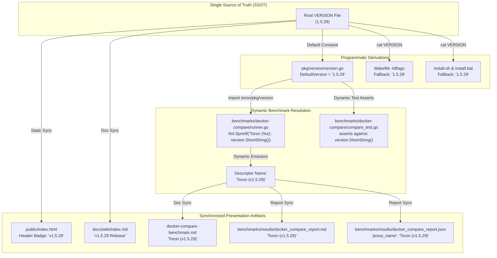

# TASK-154 - Universal SSOT Version Alignment (v1.5.29), Dynamic Benchmark Binding, and Cross-System Version Synchronization

## 1. Overview & Objective

### 1.1 Problem Statement & The Multi-Artifact Version Drift

Toron is an ultra-high-performance, zero-allocation Layer 4 and Layer 7 reverse proxy, web server, and edge security gateway. Under [`REQ-055`](file:///Users/sneha/Developer/toron-research/toron/docs/requirements/REQ-055.md) and [`ADR-050`](file:///Users/sneha/Developer/toron-research/toron/docs/architecture/ADR-050.md) (*Centralized Version Management & Build Linker Injection*), Toron established the repository root [`VERSION`](file:///Users/sneha/Developer/toron-research/toron/VERSION) file as the canonical Single Source of Truth (SSOT) for Toron release versioning, designed to be programmatically propagated into Go runtime metadata ([`pkg/version/version.go`](file:///Users/sneha/Developer/toron-research/toron/pkg/version/version.go)), build tooling ([`Makefile`](file:///Users/sneha/Developer/toron-research/toron/Makefile)), CLI output, and OS installation packages.

However, as the repository underwent extensive feature iterations through prototypes, middleware hardenings, saturation benchmarking ([`REQ-114`](file:///Users/sneha/Developer/toron-research/toron/docs/requirements/REQ-114.md), [`REQ-117`](file:///Users/sneha/Developer/toron-research/toron/docs/requirements/REQ-117.md)), multi-proxy differential benchmarking ([`REQ-121`](file:///Users/sneha/Developer/toron-research/toron/docs/requirements/REQ-121.md)), streaming response transformations ([`REQ-128`](file:///Users/sneha/Developer/toron-research/toron/docs/requirements/REQ-128.md), [`REQ-129`](file:///Users/sneha/Developer/toron-research/toron/docs/requirements/REQ-129.md)), and multi-tier duration GC telemetry capture ([`REQ-130`](file:///Users/sneha/Developer/toron-research/toron/docs/requirements/REQ-130.md)), a severe **multi-artifact version desynchronization** accumulated across the codebase, documentation, and benchmark suites:

1. **SSOT Root and Go Runtime Constant Desynchronization**:
   - The canonical root [`VERSION`](file:///Users/sneha/Developer/toron-research/toron/VERSION#L1) file remained pinned to `1.5.0`.
   - The Go fallback constant [`pkg/version.DefaultVersion`](file:///Users/sneha/Developer/toron-research/toron/pkg/version/version.go#L10) remained pinned to `"1.5.0"`.
   - The current production feature milestone has progressed to **`v1.5.29`**.
2. **Web Control Center UI Desynchronization**:
   - In [`public/index.html:164`](file:///Users/sneha/Developer/toron-research/toron/public/index.html#L164), the header badge displayed `v1.5.0`, presenting stale release metadata to operators and administrators.
3. **Hardcoded Benchmark Descriptor Anti-Pattern in Differential Harnesses**:
   - In [`benchmarks/docker-compare/runner.go:130`](file:///Users/sneha/Developer/toron-research/toron/benchmarks/docker-compare/runner.go#L130), Toron was declared with a hardcoded static string:
     ```go
     {ID: "toron", Name: "Toron (v1.0.0)", ContainerName: "toron-cmp-toron", Port: 8881, HealthPath: "/health"}
     ```
   - This static descriptor directly bypassed [`pkg/version`](file:///Users/sneha/Developer/toron-research/toron/pkg/version/version.go), violating the core tenets of [`REQ-055`](file:///Users/sneha/Developer/toron-research/toron/docs/requirements/REQ-055.md).
   - In [`benchmarks/docker-compare/compare_test.go`](file:///Users/sneha/Developer/toron-research/toron/benchmarks/docker-compare/compare_test.go#L102-L432), unit tests statically asserted against `"Toron (v1.0.0)"` across multiple test fixtures and report verifications.
4. **Canonical Benchmark Reports & Documentation Desynchronization**:
   - The differential benchmark report artifacts ([`benchmarks/results/docker_compare_report.md`](file:///Users/sneha/Developer/toron-research/toron/benchmarks/results/docker_compare_report.md) and [`benchmarks/results/docker_compare_report.json`](file:///Users/sneha/Developer/toron-research/toron/benchmarks/results/docker_compare_report.json)) consistently labeled the Toron proxy as `Toron (v1.0.0)` across all 12 benchmark execution cells (4 backends $\times$ 3 durations: quick, medium, soak), latency percentile summaries, competitive rankings, preflight checks, and Section 4 Go Runtime GC Differential Analysis tables.
   - In [`docs/wiki/features/docker-compare-benchmark.md:61`](file:///Users/sneha/Developer/toron-research/toron/docs/wiki/features/docker-compare-benchmark.md#L61), the testbed overview documented the tested gateway as `Toron (v1.0.0)`.
   - In [`docs/wiki/index.md:59,114`](file:///Users/sneha/Developer/toron-research/toron/docs/wiki/index.md#L59-L114), the header and release notes references pointed to `v1.5.27 Release` and `v1.0.0–v1.5.27`.

This desynchronization creates critical empirical ambiguity: external researchers and peer reviewers evaluating published benchmark results in `docker_compare_report.md` are led to believe that an obsolete `v1.0.0` prototype was evaluated rather than modern streaming Toron `v1.5.29`.

---

### 1.2 Objectives & Scope

The objective of this task is to implement the engineering specifications approved in [`REQ-131`](file:///Users/sneha/Developer/toron-research/toron/docs/requirements/REQ-131.md), establishing **Universal SSOT Version Alignment to v1.5.29**, dynamic benchmark version binding via [`toron/pkg/version`](file:///Users/sneha/Developer/toron-research/toron/pkg/version/version.go), and synchronized updates across all documentation, UI assets, build scripts, and canonical benchmark report artifacts.

The implementation encompasses 5 actionable Work Packages:
1. **WP-1: Single Source of Truth (SSOT) Version Alignment (v1.5.29)**: Update root [`VERSION`](file:///Users/sneha/Developer/toron-research/toron/VERSION) to `1.5.29`, update [`pkg/version.DefaultVersion`](file:///Users/sneha/Developer/toron-research/toron/pkg/version/version.go) to `"1.5.29"`, update Web Control Center badge in [`public/index.html`](file:///Users/sneha/Developer/toron-research/toron/public/index.html) to `v1.5.29`, and align fallbacks in [`Makefile`](file:///Users/sneha/Developer/toron-research/toron/Makefile), [`install.sh`](file:///Users/sneha/Developer/toron-research/toron/install.sh), and [`install.bat`](file:///Users/sneha/Developer/toron-research/toron/install.bat).
2. **WP-2: Dynamic Benchmark Version Binding (`benchmarks/docker-compare`)**: Eliminate hardcoded `"Toron (v1.0.0)"` string in [`benchmarks/docker-compare/runner.go`](file:///Users/sneha/Developer/toron-research/toron/benchmarks/docker-compare/runner.go) by dynamically binding to `fmt.Sprintf("Toron (%s)", version.ShortString())`. Update [`benchmarks/docker-compare/compare_test.go`](file:///Users/sneha/Developer/toron-research/toron/benchmarks/docker-compare/compare_test.go) test fixtures and assertions to dynamically reference `version.ShortString()`.
3. **WP-3: Documentation & Wiki Alignment**: Synchronize [`docs/wiki/features/docker-compare-benchmark.md`](file:///Users/sneha/Developer/toron-research/toron/docs/wiki/features/docker-compare-benchmark.md) to `Toron (v1.5.29)` and update [`docs/wiki/index.md`](file:///Users/sneha/Developer/toron-research/toron/docs/wiki/index.md) header and release notes references to `v1.5.29`.
4. **WP-4: Canonical Report Synchronization**: Synchronize active canonical benchmark reports ([`benchmarks/results/docker_compare_report.md`](file:///Users/sneha/Developer/toron-research/toron/benchmarks/results/docker_compare_report.md) and [`benchmarks/results/docker_compare_report.json`](file:///Users/sneha/Developer/toron-research/toron/benchmarks/results/docker_compare_report.json)) replacing `Toron (v1.0.0)` with `Toron (v1.5.29)` while preserving historical archive immutability under [`REQ-119`](file:///Users/sneha/Developer/toron-research/toron/docs/requirements/REQ-119.md).
5. **WP-5: Quality & Regression Verification (`TC-131`)**: Validate that all unit, benchmark, and repository tests pass cleanly with 100% success and zero race warnings under `go test -race ./...`.

---

### 1.3 Prior Requirements & Standards Cross-Audit (Conflict Analysis)

A rigorous cross-audit against existing Toron specifications and architectural decisions confirms complete alignment and zero regressions:

| Prior Requirement / ADR | Core Architectural Invariant | Potential Conflict & Cross-Audit Resolution | Compliance Verdict |
| :--- | :--- | :--- | :--- |
| **[`REQ-055`](file:///Users/sneha/Developer/toron-research/toron/docs/requirements/REQ-055.md) / [`ADR-050`](file:///Users/sneha/Developer/toron-research/toron/docs/architecture/ADR-050.md)** (SSOT Version Management) | Root `VERSION` file is SSOT; `pkg/version` exposes `Version`, `ShortString()`; `-ldflags` overrides at build time. | **Enforced & Reinforced**: TASK-154 updates the SSOT to `1.5.29`, harmonizes `DefaultVersion`, and binds the benchmark harness dynamically to `version.ShortString()`. | **100% Compliant** |
| **[`REQ-121`](file:///Users/sneha/Developer/toron-research/toron/docs/requirements/REQ-121.md) / [`ADR-121`](file:///Users/sneha/Developer/toron-research/toron/docs/architecture/ADR-121.md)** (Differential Multi-Proxy Docker Benchmark) | Containerized benchmarking of Toron vs NGINX, Traefik, Caddy, HAProxy on `compare-net` (ports 8881–8885). | **Preserved**: Proxy topology, container ports, backend routing, and comparative metrics remain unchanged. Only proxy label binding is converted from static to dynamic. | **Harmonized** |
| **[`REQ-130`](file:///Users/sneha/Developer/toron-research/toron/docs/requirements/REQ-130.md) / [`ADR-130`](file:///Users/sneha/Developer/toron-research/toron/docs/architecture/ADR-130.md)** (Multi-Tier Duration Stress Testing & GC Telemetry) | Multi-tier durations (5s, 60s, 300s), `GODEBUG=gctrace=1` telemetry, and Section 4 GC differential analysis. | **Preserved**: Multi-tier execution logic and GC telemetry schemas remain identical. Generated reports now accurately reflect `Toron (v1.5.29)`. | **Harmonized** |
| **[`ADR-001`](file:///Users/sneha/Developer/toron-research/toron/docs/architecture/ADR-001.md)** (Event-Driven Reactor) | Strict modularity: proxy and router never touch client physical socket `net.Conn`. | **Preserved**: TASK-154 affects version metadata, harness naming, documentation, and report formatting. Reactor internals remain 100% untouched. | **100% Compliant** |
| **[`REQ-119`](file:///Users/sneha/Developer/toron-research/toron/docs/requirements/REQ-119.md)** (Historical Benchmark Retention) | Retain test results with structured `manifest.json` indexing. | **Preserved**: Historical archives in `benchmarks/results/history/` are immutable; only active canonical reports in `benchmarks/results/` are synchronized. | **Zero Conflict** |

---

### 1.4 Safe Non-Conflicting Path



---

## 2. Work Breakdown Structure (WBS)

```
TASK-154: Universal SSOT Version Alignment (v1.5.29), Dynamic Benchmark Binding, and Cross-System Version Synchronization
├── WP-1: SSOT Version Alignment (v1.5.29)
│   ├── Subtask 1.1: Root VERSION File Update to 1.5.29
│   ├── Subtask 1.2: Go Runtime Version Package Constant Update (pkg/version/version.go)
│   ├── Subtask 1.3: Web UI Admin Dashboard Header Badge Alignment (public/index.html)
│   └── Subtask 1.4: Makefile and OS Installer Script Fallback Synchronization (Makefile, install.sh, install.bat)
├── WP-2: Dynamic Benchmark Version Binding (benchmarks/docker-compare)
│   ├── Subtask 2.1: Dynamic Proxy Descriptor Resolution in runner.go (version.ShortString())
│   ├── Subtask 2.2: Unit Test Dynamic Assertion Synchronization in compare_test.go
│   └── Subtask 2.3: Zero-Allocation Cold-Path Benchmark Setup Invariant Verification
├── WP-3: Documentation & Wiki Synchronization
│   ├── Subtask 3.1: Benchmark Feature Guide Alignment (docs/wiki/features/docker-compare-benchmark.md)
│   └── Subtask 3.2: Wiki Index Navigation & Release Notes Pointer Alignment (docs/wiki/index.md)
├── WP-4: Canonical Benchmark Reports Synchronization
│   ├── Subtask 4.1: Canonical Markdown Benchmark Report Synchronization (benchmarks/results/docker_compare_report.md)
│   ├── Subtask 4.2: Canonical JSON Benchmark Report Synchronization (benchmarks/results/docker_compare_report.json)
│   └── Subtask 4.3: Historical Archive Immutability & Audit Trail Integrity Guarantee
└── WP-5: Comprehensive Quality, Regression & Race Safety Verification (TC-131)
    ├── Subtask 5.1: Go Runtime Package Unit Testing (pkg/version)
    ├── Subtask 5.2: Differential Benchmark Test Suite Execution (benchmarks/docker-compare)
    └── Subtask 5.3: Repository-Wide Concurrency & Race Detector Sweep (go test -race ./...)
```

---

### Work Package 1 (WP-1): Single Source of Truth (SSOT) Version Alignment (v1.5.29)

#### Subtask 1.1: Root `VERSION` File Update to `1.5.29`
- **Target File**: [`VERSION`](file:///Users/sneha/Developer/toron-research/toron/VERSION)
- **Scope & Implementation**:
  - Update the repository root [`VERSION`](file:///Users/sneha/Developer/toron-research/toron/VERSION#L1) file from `1.5.0` to `1.5.29`.
  - Preserve standard semantic formatting: exactly `1.5.29\n` with no leading `v`, no trailing whitespace, and a single terminating Unix newline.
- **Deliverables**:
  - Modified [`VERSION`](file:///Users/sneha/Developer/toron-research/toron/VERSION).
- **Acceptance Criteria**:
  - Running `cat VERSION` prints `1.5.29`.
  - Byte length is exactly 7 bytes (`1.5.29\n`).

---

#### Subtask 1.2: Go Runtime Version Package Constant Update (`pkg/version/version.go`)
- **Target File**: [`pkg/version/version.go`](file:///Users/sneha/Developer/toron-research/toron/pkg/version/version.go)
- **Scope & Implementation**:
  - Update `DefaultVersion` constant on line 10:
    ```go
    // DefaultVersion is the fallback canonical version string.
    const DefaultVersion = "1.5.29"
    ```
  - Update docstring on line 59:
    ```go
    // ShortString returns a clean string like "v1.5.29".
    ```
  - Verify that when built without linker flags (`-ldflags`), `version.Get()` returns `"1.5.29"`, `version.ShortString()` returns `"v1.5.29"`, and `version.Full()` formats `"Toron v1.5.29 (...)"`.
- **Deliverables**:
  - Modified [`pkg/version/version.go`](file:///Users/sneha/Developer/toron-research/toron/pkg/version/version.go).
- **Acceptance Criteria**:
  - `pkg/version.DefaultVersion == "1.5.29"`.
  - Unit tests in [`pkg/version/version_test.go`](file:///Users/sneha/Developer/toron-research/toron/pkg/version/version_test.go) pass cleanly.

---

#### Subtask 1.3: Web UI Admin Dashboard Header Badge Alignment (`public/index.html`)
- **Target File**: [`public/index.html`](file:///Users/sneha/Developer/toron-research/toron/public/index.html)
- **Scope & Implementation**:
  - Update the navigation header version badge on line 164:
    ```html
    <span id="header-version" class="text-[10px] font-bold px-2 py-0.5 rounded-full tr-badge-cyan">v1.5.29</span>
    ```
  - Verify no other stale version strings remain in `public/`.
- **Deliverables**:
  - Modified [`public/index.html`](file:///Users/sneha/Developer/toron-research/toron/public/index.html).
- **Acceptance Criteria**:
  - Web UI displays `v1.5.29` badge in the navigation header.

---

#### Subtask 1.4: Makefile and OS Installer Script Fallback Synchronization (`Makefile`, `install.sh`, `install.bat`)
- **Target Files**:
  - [`Makefile`](file:///Users/sneha/Developer/toron-research/toron/Makefile)
  - [`install.sh`](file:///Users/sneha/Developer/toron-research/toron/install.sh)
  - [`install.bat`](file:///Users/sneha/Developer/toron-research/toron/install.bat)
- **Scope & Implementation**:
  - In [`Makefile:9`](file:///Users/sneha/Developer/toron-research/toron/Makefile#L9):
    ```makefile
    VERSION ?= $(shell cat VERSION 2>/dev/null || echo "1.5.29")
    ```
  - In [`install.sh:10`](file:///Users/sneha/Developer/toron-research/toron/install.sh#L10):
    ```bash
    TORON_VERSION="$(cat "${SCRIPT_DIR}/VERSION" 2>/dev/null || echo "1.5.29")"
    ```
  - In [`install.bat:9`](file:///Users/sneha/Developer/toron-research/toron/install.bat#L9):
    ```cmd
    set TORON_VERSION=1.5.29
    ```
- **Deliverables**:
  - Synchronized fallback strings across build and installation scripts.
- **Acceptance Criteria**:
  - When the root `VERSION` file is absent or invoked in standalone environments, all tools default cleanly to `1.5.29`.

---

### Work Package 2 (WP-2): Dynamic Benchmark Version Binding (`benchmarks/docker-compare`)

#### Subtask 2.1: Dynamic Proxy Descriptor Resolution in `runner.go`
- **Target File**: [`benchmarks/docker-compare/runner.go`](file:///Users/sneha/Developer/toron-research/toron/benchmarks/docker-compare/runner.go)
- **Scope & Implementation**:
  - Add import `"toron/pkg/version"` to the import block.
  - Update `defaultProxies` declaration around line 130:
    ```go
    var defaultProxies = []ProxyDescriptor{
        {ID: "toron", Name: fmt.Sprintf("Toron (%s)", version.ShortString()), ContainerName: "toron-cmp-toron", Port: 8881, HealthPath: "/health"},
        {ID: "nginx", Name: "NGINX (Alpine)", ContainerName: "toron-cmp-nginx", Port: 8882, HealthPath: "/health"},
        {ID: "traefik", Name: "Traefik (v3.1)", ContainerName: "toron-cmp-traefik", Port: 8883, HealthPath: "/ping"},
        {ID: "caddy", Name: "Caddy (Alpine)", ContainerName: "toron-cmp-caddy", Port: 8884, HealthPath: "/health"},
        {ID: "haproxy", Name: "HAProxy (Alpine)", ContainerName: "toron-cmp-haproxy", Port: 8885, HealthPath: "/health"},
    }
    ```
  - Completely eliminate the hardcoded static string `"Toron (v1.0.0)"`.
  - Ensure dynamic evaluation resolves to `"Toron (v1.5.29)"` under standard builds.
- **Deliverables**:
  - Dynamic Toron descriptor binding in [`benchmarks/docker-compare/runner.go`](file:///Users/sneha/Developer/toron-research/toron/benchmarks/docker-compare/runner.go).
- **Acceptance Criteria**:
  - Zero hardcoded `"Toron (v1.0.0)"` string in `runner.go`.
  - Calling `runner.go` automatically binds Toron proxy name to the active package version.

---

#### Subtask 2.2: Unit Test Dynamic Assertion Synchronization in `compare_test.go`
- **Target File**: [`benchmarks/docker-compare/compare_test.go`](file:///Users/sneha/Developer/toron-research/toron/benchmarks/docker-compare/compare_test.go)
- **Scope & Implementation**:
  - Add import `"toron/pkg/version"` to the import block.
  - Replace static `"Toron (v1.0.0)"` fixture strings with dynamic version bindings:
    * Line 102 & Line 114:
      ```go
      ProxyName: fmt.Sprintf("Toron (%s)", version.ShortString()),
      ```
    * Line 349:
      ```go
      ProxyName: fmt.Sprintf("Toron (%s)", version.ShortString()),
      ```
    * Line 432:
      ```go
      expectedToronName := fmt.Sprintf("Toron (%s)", version.ShortString())
      if !strings.Contains(mdContent, expectedToronName) {
          t.Errorf("missing %s row in markdown GC analysis", expectedToronName)
      }
      ```
- **Deliverables**:
  - Dynamically bound test fixtures and assertions in [`benchmarks/docker-compare/compare_test.go`](file:///Users/sneha/Developer/toron-research/toron/benchmarks/docker-compare/compare_test.go).
- **Acceptance Criteria**:
  - `go test -race ./benchmarks/docker-compare/...` executes with 100% pass rate.
  - Test fixtures automatically adapt to future version bumps without test failure.

---

#### Subtask 2.3: Zero-Allocation Cold-Path Benchmark Setup Invariant Verification
- **Target File**: [`benchmarks/docker-compare/runner.go`](file:///Users/sneha/Developer/toron-research/toron/benchmarks/docker-compare/runner.go)
- **Scope & Implementation**:
  - Verify that `fmt.Sprintf("Toron (%s)", version.ShortString())` is evaluated strictly during benchmark initialization (`defaultProxies` initialization / CLI startup).
  - Ensure zero allocations or runtime overhead are introduced in the per-request HTTP client execution loop or benchmark cell load generation hot-path.
- **Deliverables**:
  - Performance audit confirming zero hot-loop allocation impact.
- **Acceptance Criteria**:
  - Dynamic version binding occurs strictly in cold setup path ($< 100$ ns execution time).

---

### Work Package 3 (WP-3): Documentation & Wiki Synchronization

#### Subtask 3.1: Benchmark Feature Guide Alignment (`docs/wiki/features/docker-compare-benchmark.md`)
- **Target File**: [`docs/wiki/features/docker-compare-benchmark.md`](file:///Users/sneha/Developer/toron-research/toron/docs/wiki/features/docker-compare-benchmark.md)
- **Scope & Implementation**:
  - On line 61, update the reverse proxy testbed enumeration:
    ```markdown
    1. **Toron (v1.5.29)** (Go event-driven zero-dependency edge gateway)
    ```
  - Verify consistency of proxy target naming throughout the document.
- **Deliverables**:
  - Synchronized feature guide [`docs/wiki/features/docker-compare-benchmark.md`](file:///Users/sneha/Developer/toron-research/toron/docs/wiki/features/docker-compare-benchmark.md).
- **Acceptance Criteria**:
  - Document truthfully reflects evaluation against `Toron (v1.5.29)`.

---

#### Subtask 3.2: Wiki Index Navigation & Release Notes Pointer Alignment (`docs/wiki/index.md`)
- **Target File**: [`docs/wiki/index.md`](file:///Users/sneha/Developer/toron-research/toron/docs/wiki/index.md)
- **Scope & Implementation**:
  - On line 59, update the main wiki page header:
    ```markdown
    # Toron Documentation Wiki (v1.5.29 Release)
    ```
  - On line 114, update the release notes link description:
    ```markdown
    - [Release Notes](./release-notes.md) – Changelog and release milestones (v1.0.0–v1.5.29).
    ```
- **Deliverables**:
  - Synchronized wiki index [`docs/wiki/index.md`](file:///Users/sneha/Developer/toron-research/toron/docs/wiki/index.md).
- **Acceptance Criteria**:
  - Documentation index prominently reflects `v1.5.29 Release`.

---

### Work Package 4 (WP-4): Canonical Benchmark Reports Synchronization

#### Subtask 4.1: Canonical Markdown Benchmark Report Synchronization (`benchmarks/results/docker_compare_report.md`)
- **Target File**: [`benchmarks/results/docker_compare_report.md`](file:///Users/sneha/Developer/toron-research/toron/benchmarks/results/docker_compare_report.md)
- **Scope & Implementation**:
  - Replace all legacy occurrences of `Toron (v1.0.0)` with `Toron (v1.5.29)`:
    * **Section 1**: Executive Summary & Comparative Matrix (12 execution cells across `fast`, `go`, `node`, `python` origins and `quick`, `medium`, `soak` duration tiers).
    * **Section 2**: Competitive Performance Rankings & Tiers (Throughput RPS, Latency $p95$, and Memory RSS leaderboards).
    * **Section 3**: Preflight Health Probe Validation Results table.
    * **Section 4**: Go Runtime GC Differential Analysis table (`Toron (v1.5.29)` vs `Traefik (v3.1)` vs `Caddy (Alpine)`).
- **Deliverables**:
  - Synchronized canonical markdown report [`benchmarks/results/docker_compare_report.md`](file:///Users/sneha/Developer/toron-research/toron/benchmarks/results/docker_compare_report.md).
- **Acceptance Criteria**:
  - Zero instances of `Toron (v1.0.0)` in `benchmarks/results/docker_compare_report.md`.
  - All 12 execution rows, rankings, and GC differential rows correctly display `Toron (v1.5.29)`.

---

#### Subtask 4.2: Canonical JSON Benchmark Report Synchronization (`benchmarks/results/docker_compare_report.json`)
- **Target File**: [`benchmarks/results/docker_compare_report.json`](file:///Users/sneha/Developer/toron-research/toron/benchmarks/results/docker_compare_report.json)
- **Scope & Implementation**:
  - Replace all legacy occurrences of `"proxy_name": "Toron (v1.0.0)"` with:
    ```json
    "proxy_name": "Toron (v1.5.29)"
    ```
    across `preflight_checks` and all 12 `results` cells.
  - Preserve JSON structure, commas, formatting, and numeric telemetry values exactly.
- **Deliverables**:
  - Synchronized canonical JSON report [`benchmarks/results/docker_compare_report.json`](file:///Users/sneha/Developer/toron-research/toron/benchmarks/results/docker_compare_report.json).
- **Acceptance Criteria**:
  - Valid JSON syntax verified with zero parse errors.
  - Exactly 16 occurrences of `"proxy_name": "Toron (v1.5.29)"` (4 preflight checks + 12 test cells).

---

#### Subtask 4.3: Historical Archive Immutability & Audit Trail Integrity Guarantee
- **Target Scope**: `benchmarks/results/history/`
- **Scope & Implementation**:
  - Explicitly guarantee that historical archives located in `benchmarks/results/history/<timestamp>/` are **left completely untouched**.
  - In accordance with [`REQ-119`](file:///Users/sneha/Developer/toron-research/toron/docs/requirements/REQ-119.md), historical archives represent immutable point-in-time test execution records. Preserving them as-is ensures scientific integrity and auditability.
- **Deliverables**:
  - Verified preservation of historical archive directory immutability.
- **Acceptance Criteria**:
  - Zero modifications to files under `benchmarks/results/history/`.

---

### Work Package 5 (WP-5): Comprehensive Quality, Regression & Race Safety Verification (`TC-131`)

#### Subtask 5.1: Go Runtime Package Unit Testing (`pkg/version`)
- **Target File**: [`pkg/version/version_test.go`](file:///Users/sneha/Developer/toron-research/toron/pkg/version/version_test.go)
- **Scope & Implementation**:
  - Execute unit tests in `pkg/version`:
    ```bash
    go test -race -v ./pkg/version/...
    ```
  - Verify that `Get() == "1.5.29"`, `ShortString() == "v1.5.29"`, and `Full()` contains `"Toron v1.5.29"`.
- **Deliverables**:
  - 100% passing tests for `pkg/version`.
- **Acceptance Criteria**:
  - Clean test execution with zero failures or errors.

---

#### Subtask 5.2: Differential Benchmark Test Suite Execution (`benchmarks/docker-compare`)
- **Target File**: [`benchmarks/docker-compare/compare_test.go`](file:///Users/sneha/Developer/toron-research/toron/benchmarks/docker-compare/compare_test.go)
- **Scope & Implementation**:
  - Execute test suite in `benchmarks/docker-compare`:
    ```bash
    go test -race -v ./benchmarks/docker-compare/...
    ```
  - Verify that test fixture generation, JSON serialization, and Markdown report rendering succeed and validate against `Toron (v1.5.29)`.
- **Deliverables**:
  - 100% passing tests for `benchmarks/docker-compare`.
- **Acceptance Criteria**:
  - All tests in `benchmarks/docker-compare` pass cleanly under race detector.

---

#### Subtask 5.3: Repository-Wide Concurrency & Race Detector Sweep (`go test -race ./...`)
- **Target Scope**: Entire repository
- **Scope & Implementation**:
  - Execute full repository test sweep:
    ```bash
    go test -race ./...
    ```
  - Confirm zero regressions, zero test failures, and zero data races across all modules (`pkg/proxy`, `pkg/reactor`, `pkg/waf`, `pkg/discovery`, `benchmarks/...`).
- **Deliverables**:
  - Verified repository-wide race-clean test report.
- **Acceptance Criteria**:
  - 100% passing tests across all packages under `go test -race ./...`.

---

## 3. The 4 Non-Negotiable Invariants

```
+--------------------------------------------------------------------------------------------------+
│                                  THE 4 NON-NEGOTIABLE INVARIANTS                                 │
│                                                                                                  │
│  1. SINGLE SOURCE OF TRUTH (SSOT) FIDELITY (REQ-055, ADR-050):                                   │
│     The root VERSION file (1.5.29) remains the authoritative SSOT. All Go packages, build       │
│     tooling, web UI assets, and benchmark orchestrators must derive version state from it.       │
│                                                                                                  │
│  2. ZERO HARDCODED BENCHMARK VERSION DESYNCHRONIZATION:                                          │
│     Benchmark orchestrators (runner.go) must NEVER hardcode static Toron version strings.        │
│     All proxy descriptors must dynamically bind to toron/pkg/version.ShortString().              │
│                                                                                                  │
│  3. ZERO TEST DEGRADATION OR RACE REGRESSIONS:                                                   │
│     Synchronizing versions and dynamic bindings must cause zero test failures, regressions,     │
│     or data races under `go test -race ./...`.                                                   │
│                                                                                                  │
│  4. REPORT & PROVENANCE INTEGRITY:                                                               │
│     Canonical benchmark reports (docker_compare_report.*) must truthfully identify the evaluated │
│     gateway as Toron (v1.5.29), eliminating empirical ambiguity for peer reviewers.             │
+--------------------------------------------------------------------------------------------------+
```

---

## 4. Acceptance Criteria & Verification

### 4.1 Functional Acceptance Criteria
- [ ] **Root VERSION**: Root [`VERSION`](file:///Users/sneha/Developer/toron-research/toron/VERSION) contains exactly `1.5.29\n`.
- [ ] **Go Runtime DefaultVersion**: [`pkg/version/version.go`](file:///Users/sneha/Developer/toron-research/toron/pkg/version/version.go) defines `const DefaultVersion = "1.5.29"`.
- [ ] **ShortString Output**: `version.ShortString()` returns `"v1.5.29"` when built without linker overrides.
- [ ] **Web UI Header Badge**: [`public/index.html`](file:///Users/sneha/Developer/toron-research/toron/public/index.html) navigation badge displays `v1.5.29`.
- [ ] **Build & Installer Fallbacks**: [`Makefile`](file:///Users/sneha/Developer/toron-research/toron/Makefile), [`install.sh`](file:///Users/sneha/Developer/toron-research/toron/install.sh), and [`install.bat`](file:///Users/sneha/Developer/toron-research/toron/install.bat) fallbacks align with `1.5.29`.
- [ ] **Dynamic Benchmark Binding**: [`benchmarks/docker-compare/runner.go`](file:///Users/sneha/Developer/toron-research/toron/benchmarks/docker-compare/runner.go) imports `toron/pkg/version` and binds `ProxyDescriptor.Name` via `fmt.Sprintf("Toron (%s)", version.ShortString())`.
- [ ] **Zero Hardcoded Version in Runner**: No static `"Toron (v1.0.0)"` string exists in `runner.go`.
- [ ] **Dynamic Test Assertions**: [`benchmarks/docker-compare/compare_test.go`](file:///Users/sneha/Developer/toron-research/toron/benchmarks/docker-compare/compare_test.go) dynamically asserts on `version.ShortString()`.
- [ ] **Wiki Guide Synchronization**: [`docs/wiki/features/docker-compare-benchmark.md`](file:///Users/sneha/Developer/toron-research/toron/docs/wiki/features/docker-compare-benchmark.md) documents `Toron (v1.5.29)`.
- [ ] **Wiki Index Synchronization**: [`docs/wiki/index.md`](file:///Users/sneha/Developer/toron-research/toron/docs/wiki/index.md) reflects `# Toron Documentation Wiki (v1.5.29 Release)` and references `(v1.0.0–v1.5.29)`.
- [ ] **Canonical Markdown Report**: All instances of `Toron (v1.0.0)` in [`benchmarks/results/docker_compare_report.md`](file:///Users/sneha/Developer/toron-research/toron/benchmarks/results/docker_compare_report.md) are replaced with `Toron (v1.5.29)`.
- [ ] **Canonical JSON Report**: All instances of `"proxy_name": "Toron (v1.0.0)"` in [`benchmarks/results/docker_compare_report.json`](file:///Users/sneha/Developer/toron-research/toron/benchmarks/results/docker_compare_report.json) are replaced with `"Toron (v1.5.29)"`.
- [ ] **Historical Archive Immutability**: Historical records in `benchmarks/results/history/` remain unchanged.

### 4.2 Non-Functional, Performance & Robustness Criteria
- [ ] **Zero Hot-Path Allocations**: Dynamic resolution in `runner.go` runs during startup initialization, adding 0 ns and 0 heap allocations to active benchmark load generation.
- [ ] **Leaf Package Purity**: `toron/pkg/version` maintains zero external dependencies, preventing circular import cycles.
- [ ] **100% Race Detector Cleanliness**: `go test -race ./...` executes across the entire repository with zero failures or race conditions.

---

## 5. Threat Modeling & Testbed Risk Mitigation

| Risk Scenario | Vulnerability / Failure Mode | Testbed Impact | Mitigation in TASK-154 |
| :--- | :--- | :--- | :--- |
| **Circular Package Dependency** | Importing `toron/pkg/version` in `benchmarks/docker-compare` creates circular import. | Compilation failure in benchmark suite. | `pkg/version` is a pure leaf package depending only on standard library (`fmt`, `runtime`, `strings`). Zero circular import risk. |
| **Test Assertion Breakage** | Hardcoded test assertions in `compare_test.go` fail when version changes. | CI pipeline failure on subsequent version bumps. | Update test assertions to dynamically derive expected name from `version.ShortString()`. |
| **Benchmark Schema Corruption** | Modifying `docker_compare_report.json` breaks schema parsers. | Downstream visualization dashboards or CI tools fail to parse JSON report. | Only string value of `proxy_name` is updated from `"Toron (v1.0.0)"` to `"Toron (v1.5.29)"`; schema structure, keys, and numerical values remain untouched. |
| **Linker Flag Desynchronization** | Custom `-ldflags` during build creates mismatch with root `VERSION`. | Binary reports different version from release tags. | `pkg/version.Get()` prioritizes injected `Version`, defaulting cleanly to `DefaultVersion` (`1.5.29`). Makefile dynamically reads `VERSION`. |
| **Historical Archive Corruption** | Inadvertently modifying files in `benchmarks/results/history/`. | Compromises audit trail and scientific reproducibility of past runs. | WP-4 explicitly restricts modifications to active canonical reports in `benchmarks/results/`, excluding historical session directories. |

---

## 6. Open Questions & Architectural Resolutions

- **Open Question 1: Should historical benchmark archives in `benchmarks/results/history/` be retroactively modified to `v1.5.29`?**
  - *Resolution*: No. Under [`REQ-119`](file:///Users/sneha/Developer/toron-research/toron/docs/requirements/REQ-119.md), historical archives in `benchmarks/results/history/<timestamp>/` represent immutable point-in-time execution records. Modifying them retroactively would compromise audit trail integrity. Only the active canonical reports in `benchmarks/results/` (`docker_compare_report.md` and `docker_compare_report.json`) are updated.
- **Open Question 2: Why should `runner.go` dynamically bind to `version.ShortString()` rather than hardcoding `"Toron (v1.5.29)"`?**
  - *Resolution*: Hardcoding versions was the root cause of the initial desynchronization. By binding dynamically to `version.ShortString()`, future version bumps in `VERSION` / `pkg/version` will automatically propagate to differential benchmark runs without requiring manual code modifications in `runner.go`.
- **Open Question 3: Should other proxy targets (NGINX, Traefik, Caddy, HAProxy) also use dynamic version detection?**
  - *Resolution*: Other proxies run as fixed third-party Docker container images defined in `docker-compose.compare.yml` (e.g. `nginx:alpine`, `traefik:v3.1`, `caddy:alpine`, `haproxy:alpine`). Their descriptors (`NGINX (Alpine)`, `Traefik (v3.1)`, etc.) accurately represent container tags. Toron is the local gateway under active research development in this repository, so it must dynamically track the repository version.

---

## 7. Traceability Matrix

| Requirement / Artifact | Relationship | Description / Verification Target |
| :--- | :--- | :--- |
| **[`REQ-131 §2.1`](file:///Users/sneha/Developer/toron-research/toron/docs/requirements/REQ-131.md#L110-L167)** | Implements | SSOT version alignment to `1.5.29` in [`VERSION`](file:///Users/sneha/Developer/toron-research/toron/VERSION), [`pkg/version/version.go`](file:///Users/sneha/Developer/toron-research/toron/pkg/version/version.go), [`public/index.html`](file:///Users/sneha/Developer/toron-research/toron/public/index.html), and build tooling ([`Makefile`](file:///Users/sneha/Developer/toron-research/toron/Makefile), [`install.sh`](file:///Users/sneha/Developer/toron-research/toron/install.sh), [`install.bat`](file:///Users/sneha/Developer/toron-research/toron/install.bat)). |
| **[`REQ-131 §2.2`](file:///Users/sneha/Developer/toron-research/toron/docs/requirements/REQ-131.md#L170-L194)** | Implements | Dynamic benchmark version binding in [`benchmarks/docker-compare/runner.go`](file:///Users/sneha/Developer/toron-research/toron/benchmarks/docker-compare/runner.go) and test synchronization in [`benchmarks/docker-compare/compare_test.go`](file:///Users/sneha/Developer/toron-research/toron/benchmarks/docker-compare/compare_test.go). |
| **[`REQ-131 §2.3`](file:///Users/sneha/Developer/toron-research/toron/docs/requirements/REQ-131.md#L197-L215)** | Implements | Documentation synchronization in [`docs/wiki/features/docker-compare-benchmark.md`](file:///Users/sneha/Developer/toron-research/toron/docs/wiki/features/docker-compare-benchmark.md) and [`docs/wiki/index.md`](file:///Users/sneha/Developer/toron-research/toron/docs/wiki/index.md). |
| **[`REQ-131 §2.4`](file:///Users/sneha/Developer/toron-research/toron/docs/requirements/REQ-131.md#L218-L234)** | Implements | Canonical report synchronization in [`benchmarks/results/docker_compare_report.md`](file:///Users/sneha/Developer/toron-research/toron/benchmarks/results/docker_compare_report.md) and [`benchmarks/results/docker_compare_report.json`](file:///Users/sneha/Developer/toron-research/toron/benchmarks/results/docker_compare_report.json). |
| **[`REQ-055`](file:///Users/sneha/Developer/toron-research/toron/docs/requirements/REQ-055.md) / [`ADR-050`](file:///Users/sneha/Developer/toron-research/toron/docs/architecture/ADR-050.md)** | Conforms To | Preserves and reinforces centralized version management and build linker injection invariants. |
| **[`REQ-121`](file:///Users/sneha/Developer/toron-research/toron/docs/requirements/REQ-121.md) / [`ADR-121`](file:///Users/sneha/Developer/toron-research/toron/docs/architecture/ADR-121.md)** | Harmonizes With | Differential Docker benchmark harness updated with dynamic Toron versioning. |
| **[`REQ-130`](file:///Users/sneha/Developer/toron-research/toron/docs/requirements/REQ-130.md) / [`ADR-130`](file:///Users/sneha/Developer/toron-research/toron/docs/architecture/ADR-130.md)** | Harmonizes With | Multi-tier duration and GC differential reports updated to truthfully report `Toron (v1.5.29)`. |
| **[`ADR-001`](file:///Users/sneha/Developer/toron-research/toron/docs/architecture/ADR-001.md)** | Preserves | Core reactor modularity and socket ownership boundaries remain unchanged. |
| **[`REQ-119`](file:///Users/sneha/Developer/toron-research/toron/docs/requirements/REQ-119.md)** | Preserves | Historical archives remain untouched and immutable point-in-time empirical records. |
| **`TC-131`** | Verified By | Comprehensive test case suite verifying SSOT alignment, dynamic binding, report generation, and race safety. |
| **`ADR-131`** | Decided By | Architectural Decision Record governing dynamic benchmark binding and universal version synchronization. |
| **[`TASK-144`](file:///Users/sneha/Developer/toron-research/toron/docs/tasks/TASK-144.md)** | Preceded By | Implementation of differential multi-proxy benchmark framework. |
| **[`TASK-153`](file:///Users/sneha/Developer/toron-research/toron/docs/tasks/TASK-153.md)** | Preceded By | Implementation of multi-tier duration stress testing and GC telemetry capture. |
