# TASK-155 - Coverage-Guided Generative Fuzzing Engine, Native Go testing.F Differential Oracles, and Protocol Regression Suite Disambiguation

## 1. Overview & Objective

### 1.1 Peer Review Critique & The Circular Oracle Dilemma

In rigorous security and systems evaluations of HTTP parsing and edge gateways, a fundamental methodological challenge arises when characterizing test harnesses. Specifically, during technical evaluations of Toron's test infrastructure, inspection of [`benchmarks/fuzzer/diff_fuzzer.go`](file:///Users/sneha/Developer/toron-research/toron/benchmarks/fuzzer/diff_fuzzer.go) revealed that the harness executes a deterministic sequence of exactly 19 handcrafted TCP byte sequences. While vital for measuring wire-level fail-fast rejection latencies (Equation 7), this harness executes no stochastic input mutations, performs no compiler-directed basic-block edge exploration, and evaluates an inherently self-referential or circular oracle: each test case declares its own expected HTTP status codes (e.g. `tc.ExpectedStatus = []int{400, 501}`), testing whether Toron matches its own hardcoded expectations rather than evaluating parsing conformance against an independent reference parser.

In academic software security and empirical software engineering, true fuzzing requires three non-negotiable capabilities:
1. **Coverage-Guided Generative Mutation**: The testing engine must dynamically instrument basic-block edge transitions during execution and systematically mutate inputs to discover unexplored execution branches.
2. **Unbounded / Expansive Input Search Space**: The input space must not be constrained to a predetermined finite set of strings; rather, the mutator continuously generates arbitrary byte sequences across malformed protocol boundaries.
3. **Non-Circular Differential Oracle**: The evaluation oracle must not rely on self-declared static expectations. It must evaluate inputs differentially against an authoritative independent implementation—specifically comparing Toron's [`httpparser.ParseRequest`](file:///Users/sneha/Developer/toron-research/toron/pkg/httpparser/parser.go#L109) against the canonical Go standard library parser [`net/http.ReadRequest`](file:///Users/sneha/Developer/toron-research/toron/pkg/httpparser/request.go)—detecting subtle semantic desynchronizations, boundary ambiguities, and protocol smuggling vectors (`CWE-444`).

---

### 1.2 The Dual-System Architecture: Paradigm A vs Paradigm B

To establish unimpeachable scientific rigor, the Toron development system formalizes the conceptual and architectural separation between two complementary testing regimes:

```
┌──────────────────────────────────────────────────────────────────────────────────────────────────┐
│                         TORON PROTOCOL SECURITY & ROBUSTNESS SPECTRUM                            │
├──────────────────────────────────────────────────────────────────────────────────────────────────┤
│                                                                                                  │
│   PARADIGM A: PROTOCOL INVARIANT REGRESSION SUITE        PARADIGM B: GENERATIVE FUZZING ENGINE   │
│   (benchmarks/fuzzer/diff_fuzzer.go)                    (pkg/httpparser/fuzz_test.go)            │
│   ───────────────────────────────────────────────        ─────────────────────────────────────   │
│   • Input Space: Deterministic (19 curated CVEs)         • Input Space: Unbounded / Generative   │
│   • Feedback: Socket Latency (Eq. 7, K=1,000 trials)     • Feedback: Edge Coverage (testing.F)   │
│   • Oracle: Strict Invariant / Hardcoded Expectations    • Oracle: Non-Circular Differential     │
│             (Fail-fast rejection, socket closure)                  (Toron vs Go net/http.ReadReq)│
│   • Target: Live Network Sockets (L4/L7 TCP Server)      • Target: In-Memory L7 Parser Engine    │
│   • Primary Goal: Empirically measure tail latency       • Primary Goal: Discover unknown parser │
│     distribution & prove wire-rate fail-fast speed.        crashes, memory flaws, & CL desyncs.  │
│                                                                                                  │
└──────────────────────────────────────────────────────────────────────────────────────────────────┘
```

- **Paradigm A ([`benchmarks/fuzzer/diff_fuzzer.go`](file:///Users/sneha/Developer/toron-research/toron/benchmarks/fuzzer/diff_fuzzer.go))**: Retained and formally retitled as the **Deterministic Protocol Invariant Regression Suite & Latency Profiler**. It tests live network sockets, enforces fail-fast TCP teardown (`conn:closed`), executes $K=1,000$ repeated trials, and isolates rejection latency via Equation 7.
- **Paradigm B ([`pkg/httpparser/fuzz_test.go`](file:///Users/sneha/Developer/toron-research/toron/pkg/httpparser/fuzz_test.go))**: Introduced as the **Coverage-Guided Generative & Differential Fuzzing Engine**. It leverages Go 1.18+ native `testing.F` compiler edge-instrumentation to autonomously mutate HTTP requests, evaluate non-circular differential oracles against Go standard library `net/http.ReadRequest`, and certify crash/desynchronization immunity.

---

### 1.3 Scope & Engineering Objectives

The objective of this task is to implement the engineering specifications approved in [`REQ-132`](file:///Users/sneha/Developer/toron-research/toron/docs/requirements/REQ-132.md), decomposed into 5 concrete Work Packages:
1. **WP-1: Native Go Coverage-Guided Generative Fuzzing Engine (`pkg/httpparser/fuzz_test.go`)**: Implement 4 specialized `testing.F` fuzz targets: raw byte streams (`FuzzParseRequest`), differential standard library validation (`FuzzDifferentialWithStdLib`), RFC 7230 §3.2 header grammar mutations (`FuzzHeaderGrammar`), and RFC 7230 §4.1 chunk framing mutations (`FuzzChunkFraming`).
2. **WP-2: Differential Semantic Oracles & Seed Corpus Ingestion**: Implement 4 non-circular oracles (Panic/Crash Immunity, Differential Desynchronization Detection, Framing Boundary Agreement, and Execution Boundedness/Clamp) and register an initial seed corpus comprising nominal HTTP/1.1 requests and all 19 structural CVE attack vectors from [`diff_fuzzer.go`](file:///Users/sneha/Developer/toron-research/toron/benchmarks/fuzzer/diff_fuzzer.go).
3. **WP-3: Dedicated CLI Runner & Automation Script (`benchmarks/fuzzer/run_generative_fuzz.sh`)**: Build a dedicated CLI orchestrator supporting target selection (`-target`), fuzzing duration (`-fuzztime`), crash artifact directory management (`benchmarks/results/fuzz/`), and automated publication-grade Markdown and JSON reporting.
4. **WP-4: Documentation & Conceptual Disambiguation**: Update [`benchmarks/fuzzer/diff_fuzzer.go`](file:///Users/sneha/Developer/toron-research/toron/benchmarks/fuzzer/diff_fuzzer.go) header comments and title, update [`benchmarks/README.md`](file:///Users/sneha/Developer/toron-research/toron/benchmarks/README.md) with Section 4.5 detailing the dual-paradigm taxonomy, and harmonize wiki documentation.
5. **WP-5: Quality & Regression Verification (`TC-132`)**: Verify sub-second seed corpus execution ($< 1$ second under `go test ./pkg/httpparser`), zero data races under `go test -race ./...`, zero external dependencies, and 100% test pass rates across the entire repository.

---

### 1.4 Prior Requirements & Standards Cross-Audit (Conflict Analysis)

A comprehensive cross-audit against existing Toron specifications and architectural decisions confirms complete alignment and zero regressions:

| Prior Requirement / ADR | Core Architectural Invariant | Potential Conflict & Cross-Audit Resolution | Compliance Verdict |
| :--- | :--- | :--- | :--- |
| **[`REQ-001`](file:///Users/sneha/Developer/toron-research/toron/docs/requirements/REQ-001.md) / [`REQ-004`](file:///Users/sneha/Developer/toron-research/toron/docs/requirements/REQ-004.md)** | Zero-allocation HTTP/1.1 parsing via `bufio.Reader` and pooled buffers. | **Harmonized**: Fuzz targets directly exercise `httpparser.ParseRequest` across arbitrary edge cases without altering parser contract. | **100% Compliant** |
| **[`ADR-001`](file:///Users/sneha/Developer/toron-research/toron/docs/architecture/ADR-001.md)** (Reactor Modularity) | Core reactor never binds parser directly to physical client socket `net.Conn`. | **Preserved**: Fuzzing operates purely on `io.Reader` byte streams in memory, preserving reactor transport isolation. | **100% Compliant** |
| **[`REQ-106`](file:///Users/sneha/Developer/toron-research/toron/docs/requirements/REQ-106.md) / [`ADR-106`](file:///Users/sneha/Developer/toron-research/toron/docs/architecture/ADR-106.md)** (Equation 7 Timing & Trials) | Evaluates TCP socket rejection latency under repeated statistical trials ($K=1,000$). | **Disambiguated**: `diff_fuzzer.go` remains the benchmark for socket latency profiling; `fuzz_test.go` becomes the generative fuzzer. | **Preserved & Disambiguated** |
| **[`REQ-113`](file:///Users/sneha/Developer/toron-research/toron/docs/requirements/REQ-113.md)** (Multi-Hop Testbed) | Heterogeneous multi-hop backend origin validation (`llhttp`, `h11`, `net/http`). | **Complementary**: Multi-hop validates downstream origin desync across live network containers; REQ-132 validates L7 parser differential agreement in-memory. | **100% Harmonized** |
| **[`REQ-128`](file:///Users/sneha/Developer/toron-research/toron/docs/requirements/REQ-128.md) / [`REQ-129`](file:///Users/sneha/Developer/toron-research/toron/docs/requirements/REQ-129.md)** (Streaming & Memory Boundedness) | Outbound chunked framing and memory boundedness ($64\,\text{KB}$ clamp). | **Enforced**: Oracle 4 strictly enforces bounded allocations ($64\,\text{KB}$ per request) and terminates execution on resource runaway. | **100% Compliant** |
| **[`REQ-131`](file:///Users/sneha/Developer/toron-research/toron/docs/requirements/REQ-131.md)** / [`TASK-154`](file:///Users/sneha/Developer/toron-research/toron/docs/tasks/TASK-154.md) | Universal SSOT alignment (`v1.5.29`). | **Preserved**: All emitted fuzzing benchmark metadata and CLI scripts SHALL dynamically bind to `pkg/version`. | **100% Compliant** |

---

### 1.5 Safe Non-Conflicting Path

```mermaid
flowchart TD
    subgraph SuiteA ["Deterministic Invariant Regression Suite (diff_fuzzer.go)"]
        A_INPUT["19 Curated Static Attack Vectors<br/>(CL.TE, Traversal, Null Byte, etc.)"]
        A_NET["Dial Live TCP Socket<br/>(L4/L7 Network Boundary)"]
        A_WRITE["conn.Write(Payload)<br/>Start Timer (Eq. 7)"]
        A_READ["reader.ReadString('\\n')<br/>Stop Timer"]
        A_ORACLE["Assert Expected Status Code Set<br/>tc.ExpectedStatus (Invariant Oracle)"]
        A_STATS["Statistical Distribution<br/>(K=1,000 trials, p50, p90, p99, 95% CI)"]
        
        A_INPUT --> A_NET --> A_WRITE --> A_READ --> A_ORACLE --> A_STATS
    end

    subgraph SuiteB ["Coverage-Guided Differential Fuzzer (pkg/httpparser/fuzz_test.go)"]
        B_SEEDS["Curated Seed Corpus<br/>(Nominal RFC 7230 + 19 Invariant Vectors)"]
        B_MUT["Go Native Mutator (testing.F)<br/>Coverage-Guided Edge Feedback"]
        B_DATA["Unbounded Mutated Byte Stream<br/>(Clamped to 64KB)"]
        
        B_TORON["Toron Parser<br/>httpparser.ParseRequest()"]
        B_STD["Go Canonical Parser<br/>net/http.ReadRequest()"]
        
        B_ORACLE1["Oracle 1: Crash & Panic Immunity"]
        B_ORACLE2["Oracle 2: Differential Desync Guard"]
        B_ORACLE3["Oracle 3: Boundary Agreement (CL, Method, Path)"]
        B_ORACLE4["Oracle 4: Bounded Execution (<50ms, 64KB)"]
        
        B_SEEDS --> B_MUT
        B_MUT --> B_DATA
        B_DATA --> B_TORON
        B_DATA --> B_STD
        B_TORON --> B_ORACLE1 & B_ORACLE2 & B_ORACLE3 & B_ORACLE4
        B_STD --> B_ORACLE2 & B_ORACLE3
    end
```



---

## 2. Work Breakdown Structure (WBS)

```
TASK-155: Coverage-Guided Generative Fuzzing Engine, Native Go testing.F Differential Oracles, and Protocol Regression Suite Disambiguation
├── WP-1: Native Go Coverage-Guided Generative Fuzzing Engine (pkg/httpparser/fuzz_test.go)
│   ├── Subtask 1.1: Go 1.18+ testing.F Infrastructure & Multi-Target Framework
│   ├── Subtask 1.2: Raw Byte Stream Fuzz Target (FuzzParseRequest)
│   ├── Subtask 1.3: Reference Differential Fuzz Target (FuzzDifferentialWithStdLib)
│   ├── Subtask 1.4: Header Grammar Mutation Fuzz Target (FuzzHeaderGrammar)
│   └── Subtask 1.5: Chunk Framing Mutation Fuzz Target (FuzzChunkFraming)
├── WP-2: Differential Semantic Oracles & Seed Corpus Ingestion
│   ├── Subtask 2.1: Oracle 1 (Panic & Crash Immunity) Implementation
│   ├── Subtask 2.2: Oracle 2 (Differential Desynchronization Detection) Implementation
│   ├── Subtask 2.3: Oracle 3 (Framing Boundary Agreement) Implementation
│   ├── Subtask 2.4: Oracle 4 (Execution Boundedness & Resource Clamp) Implementation
│   └── Subtask 2.5: Curated Seed Corpus Registration (Nominal HTTP/1.1 + 19 CVE Vectors)
├── WP-3: Dedicated CLI Runner & Automation Script (benchmarks/fuzzer/run_generative_fuzz.sh)
│   ├── Subtask 3.1: CLI Argument Parsing & Target Selection (-target, -fuzztime, -j, -m)
│   ├── Subtask 3.2: Automated Fuzz Execution Loop & Crash Artifact Isolation (benchmarks/results/fuzz/)
│   ├── Subtask 3.3: Automated Dual-Output Reporting (Markdown & JSON)
│   └── Subtask 3.4: Historical Archiving & Session Manifest Integration (archive_run.sh)
├── WP-4: Documentation & Conceptual Disambiguation
│   ├── Subtask 4.1: Retitle & Disambiguate diff_fuzzer.go Header Comments
│   ├── Subtask 4.2: Update benchmarks/README.md with Section 4.5 Dual-Paradigm Taxonomy
│   └── Subtask 4.3: Feature Guide & Wiki Documentation Updates
└── WP-5: Quality & Regression Verification (TC-132)
    ├── Subtask 5.1: Sub-Second Seed Corpus Execution Verification (go test ./pkg/httpparser)
    ├── Subtask 5.2: Concurrency & Race Detector Sweep (go test -race ./...)
    └── Subtask 5.3: Zero External Dependencies Audit & Build Isolation
```

---

### Work Package 1 (WP-1): Native Go Coverage-Guided Generative Fuzzing Engine (`pkg/httpparser/fuzz_test.go`)

#### Subtask 1.1: Go 1.18+ `testing.F` Infrastructure & Multi-Target Framework
- **Target File**: [`pkg/httpparser/fuzz_test.go`](file:///Users/sneha/Developer/toron-research/toron/pkg/httpparser/fuzz_test.go)
- **Scope & Implementation**:
  - Establish `pkg/httpparser/fuzz_test.go` declaring `package httpparser`.
  - Import only standard library packages: `bytes`, `bufio`, `errors`, `fmt`, `io`, `net/http`, `strings`, `testing`, `time`.
  - Design modular helper methods:
    * `executeParserFuzzIteration(t *testing.T, data []byte, opts ParserOptions)`
    * `executeDifferentialFuzzIteration(t *testing.T, data []byte, opts ParserOptions)`
  - Enforce zero third-party framework dependencies (e.g. no `google/gofuzz`, no CGO bindings).
- **Deliverables**:
  - Base architecture and test structure in [`pkg/httpparser/fuzz_test.go`](file:///Users/sneha/Developer/toron-research/toron/pkg/httpparser/fuzz_test.go).
- **Acceptance Criteria**:
  - Compiles cleanly under Go 1.20–1.24+ without extra build flags.

---

#### Subtask 1.2: Raw Byte Stream Fuzz Target (`FuzzParseRequest`)
- **Target File**: [`pkg/httpparser/fuzz_test.go`](file:///Users/sneha/Developer/toron-research/toron/pkg/httpparser/fuzz_test.go)
- **Scope & Implementation**:
  - Implement `func FuzzParseRequest(f *testing.F)`.
  - Register the seed corpus via `f.Add([]byte(...))`.
  - In `f.Fuzz(func(t *testing.T, data []byte) { ... })`:
    * Apply Oracle 4: Clamp `len(data) > 65536` (discard mutations exceeding 64KB envelope).
    * Apply Oracle 1: Wrap in `defer func() { if r := recover(); r != nil { ... } }()`.
    * Invoke [`ParseRequest(bytes.NewReader(data), DefaultParserOptions())`](file:///Users/sneha/Developer/toron-research/toron/pkg/httpparser/parser.go#L109).
    * Verify clean return of either valid `*Request` or recognized `error` without memory leaks or unbounded hangs.
- **Deliverables**:
  - Implemented `FuzzParseRequest` in `pkg/httpparser/fuzz_test.go`.
- **Acceptance Criteria**:
  - Successfully explores edge transitions in request-line, header extraction, and body size verification routines.

---

#### Subtask 1.3: Reference Differential Fuzz Target (`FuzzDifferentialWithStdLib`)
- **Target File**: [`pkg/httpparser/fuzz_test.go`](file:///Users/sneha/Developer/toron-research/toron/pkg/httpparser/fuzz_test.go)
- **Scope & Implementation**:
  - Implement `func FuzzDifferentialWithStdLib(f *testing.F)`.
  - In `f.Fuzz(func(t *testing.T, data []byte) { ... })`:
    * Clamp input data to 64KB.
    * Parse input via Toron: `toronReq, toronErr := ParseRequest(bytes.NewReader(data), DefaultParserOptions())`.
    * Parse input via Go standard library: `stdReq, stdErr := http.ReadRequest(bufio.NewReader(bytes.NewReader(data)))`.
    * Apply Oracle 2: Flag ambiguous framing acceptance (Toron accepting an RFC-violating request that `net/http` rejects).
    * Apply Oracle 3: If both parsers accept (`toronErr == nil && stdErr == nil`), assert strict equality on `Method`, canonicalized `URL.Path`, and `ContentLength`.
- **Deliverables**:
  - Implemented `FuzzDifferentialWithStdLib` in `pkg/httpparser/fuzz_test.go`.
- **Acceptance Criteria**:
  - Flags any desynchronization where Toron parses a different `ContentLength` or accepts a malformed request rejected by standard library.

---

#### Subtask 1.4: Header Grammar Mutation Fuzz Target (`FuzzHeaderGrammar`)
- **Target File**: [`pkg/httpparser/fuzz_test.go`](file:///Users/sneha/Developer/toron-research/toron/pkg/httpparser/fuzz_test.go)
- **Scope & Implementation**:
  - Implement `func FuzzHeaderGrammar(f *testing.F)`.
  - Seed with valid and invalid header tokens, whitespace variants, and control characters:
    * `f.Add([]byte("Host"), []byte("example.com"))`
    * `f.Add([]byte("Host "), []byte("example.com"))` (Whitespace before colon)
    * `f.Add([]byte("Host\t"), []byte("example.com"))` (Tab before colon)
    * `f.Add([]byte("X-Header"), []byte("value\r\n continuation"))` (obs-fold)
    * `f.Add([]byte("X-Null"), []byte("val\x00ue"))` (Null byte in value)
  - In `f.Fuzz(func(t *testing.T, headerName, headerValue []byte) { ... })`:
    * Synthesize well-formed HTTP/1.1 request containing the mutated header field:
      ```text
      GET /index.html HTTP/1.1\r\nHost: localhost\r\n<headerName>:<headerValue>\r\n\r\n
      ```
    * Feed synthesized request into `ParseRequest` and evaluate Oracles 1, 2, and 4.
    * Ensure whitespace before colon (`Host : example.com`), obs-fold, and forbidden token chars are safely rejected or handled.
- **Deliverables**:
  - Implemented `FuzzHeaderGrammar` in `pkg/httpparser/fuzz_test.go`.
- **Acceptance Criteria**:
  - Discovers and validates header grammar edge cases according to RFC 7230 §3.2.

---

#### Subtask 1.5: Chunk Framing Mutation Fuzz Target (`FuzzChunkFraming`)
- **Target File**: [`pkg/httpparser/fuzz_test.go`](file:///Users/sneha/Developer/toron-research/toron/pkg/httpparser/fuzz_test.go)
- **Scope & Implementation**:
  - Implement `func FuzzChunkFraming(f *testing.F)`.
  - Seed with chunked encoding patterns:
    * Nominal chunk: `POST /upload HTTP/1.1\r\nHost: localhost\r\nTransfer-Encoding: chunked\r\n\r\n5\r\nhello\r\n0\r\n\r\n`
    * Invalid hex chunk length (`ZZ\r\n`)
    * Oversized chunk extension (`;name=value...`)
    * Premature EOF in chunk payload
  - In `f.Fuzz(func(t *testing.T, chunkHex []byte, chunkData []byte, chunkExt []byte) { ... })`:
    * Construct synthetic chunked request.
    * Evaluate Oracles 1, 2, and 4.
- **Deliverables**:
  - Implemented `FuzzChunkFraming` in `pkg/httpparser/fuzz_test.go`.
- **Acceptance Criteria**:
  - Ensures robust rejection of malformed chunk boundaries and transfer encoding smuggling attacks.

---

### Work Package 2 (WP-2): Differential Semantic Oracles & Seed Corpus Ingestion

#### Subtask 2.1: Oracle 1 (Panic & Crash Immunity) Implementation
- **Target File**: [`pkg/httpparser/fuzz_test.go`](file:///Users/sneha/Developer/toron-research/toron/pkg/httpparser/fuzz_test.go)
- **Scope & Implementation**:
  - Implement panic recovery wrapper:
    ```go
    defer func() {
        if r := recover(); r != nil {
            t.Fatalf("PANIC DETECTED (Oracle 1 Failure): %v\nPayload Hex: %x\nPayload: %q", r, data, data)
        }
    }()
    ```
  - Enforce zero unhandled exceptions, zero slice bounds out of range, zero nil dereferences under all fuzz targets.
- **Deliverables**:
  - Oracle 1 integration across all fuzz functions.
- **Acceptance Criteria**:
  - 100% crash immunity across millions of mutated payloads.

---

#### Subtask 2.2: Oracle 2 (Differential Desynchronization Detection) Implementation
- **Target File**: [`pkg/httpparser/fuzz_test.go`](file:///Users/sneha/Developer/toron-research/toron/pkg/httpparser/fuzz_test.go)
- **Scope & Implementation**:
  - Implement differential desynchronization evaluation logic:
    * If `stdErr != nil` and `toronErr == nil`:
      - Inspect rejection reason in `stdErr`.
      - If standard library rejected due to ambiguous framing (e.g. `Content-Length` and `Transfer-Encoding` conflicting, multiple divergent `Content-Length` headers, invalid chunk hex characters, or illegal whitespace before colon), Toron MUST NOT accept.
      - If Toron accepted an ambiguous framing rejected by standard library, fail:
        ```go
        t.Fatalf("DIFFERENTIAL DESYNC (Oracle 2 Failure): Toron accepted ambiguous framing rejected by stdlib: %v\nPayload: %q", stdErr, data)
        ```
    * Defensive Divergence: If `toronErr != nil` and `stdErr == nil`, permit if rejection is due to Toron's explicit edge security boundaries (e.g. header block $> 8\,\text{KB}$, query string $> 2\,\text{KB}$, terminal control character block).
- **Deliverables**:
  - Oracle 2 discrepancy classification state machine in `fuzz_test.go`.
- **Acceptance Criteria**:
  - Detects and prevents dangerous parser leniency while permitting defensive security rejections.

---

#### Subtask 2.3: Oracle 3 (Framing Boundary Agreement) Implementation
- **Target File**: [`pkg/httpparser/fuzz_test.go`](file:///Users/sneha/Developer/toron-research/toron/pkg/httpparser/fuzz_test.go)
- **Scope & Implementation**:
  - When both parsers accept (`toronErr == nil && stdErr == nil`):
    * **Method Congruence**:
      ```go
      if strings.ToUpper(toronReq.Method) != stdReq.Method {
          t.Fatalf("METHOD DESYNC (Oracle 3 Failure): Toron=%q, stdlib=%q", toronReq.Method, stdReq.Method)
      }
      ```
    * **Path Congruence**:
      ```go
      if toronReq.URL.Path != stdReq.URL.Path {
          t.Fatalf("PATH DESYNC (Oracle 3 Failure): Toron=%q, stdlib=%q", toronReq.URL.Path, stdReq.URL.Path)
      }
      ```
    * **Content-Length Congruence**:
      ```go
      if toronReq.ContentLength != stdReq.ContentLength {
          t.Fatalf("CONTENT-LENGTH DESYNC (Oracle 3 Failure): Toron=%d, stdlib=%d", toronReq.ContentLength, stdReq.ContentLength)
      }
      ```
- **Deliverables**:
  - Oracle 3 framing boundary checks in `FuzzDifferentialWithStdLib`.
- **Acceptance Criteria**:
  - Zero semantic drift between Toron and Go reference parser on accepted requests.

---

#### Subtask 2.4: Oracle 4 (Execution Boundedness & Resource Clamp) Implementation
- **Target File**: [`pkg/httpparser/fuzz_test.go`](file:///Users/sneha/Developer/toron-research/toron/pkg/httpparser/fuzz_test.go)
- **Scope & Implementation**:
  - Physical Envelope Clamp: Discard inputs exceeding $64\,\text{KB}$ ($65,536$ bytes).
  - Timeout Guard: Ensure every single iteration completes within $\le 50\,\text{ms}$.
  - Memory Boundedness: Ensure buffer allocations respect configured `MaxHeaderBytes` and buffers are returned to `lineBufferPool` and `bodyBufferPool`.
- **Deliverables**:
  - Oracle 4 bounding guards in `fuzz_test.go`.
- **Acceptance Criteria**:
  - Guaranteed termination within 50 ms per iteration; zero ReDoS or buffer exhaustion.

---

#### Subtask 2.5: Curated Seed Corpus Ingestion
- **Target File**: [`pkg/httpparser/fuzz_test.go`](file:///Users/sneha/Developer/toron-research/toron/pkg/httpparser/fuzz_test.go)
- **Scope & Implementation**:
  - Ingest standard RFC 7230 nominal requests (minimal GET, standard GET with queries, POST with body, HEAD, OPTIONS).
  - Programmatically ingest all 19 CVE attack vectors from [`benchmarks/fuzzer/diff_fuzzer.go:153-391`](file:///Users/sneha/Developer/toron-research/toron/benchmarks/fuzzer/diff_fuzzer.go#L153-L391):
    * `SMUGGLE-001` (CL.TE conflict)
    * `SMUGGLE-002` (CL.CL divergent)
    * `SMUGGLE-003` (TE tab obfuscation)
    * `SMUGGLE-004` (Invalid chunk hex extension)
    * `WHITESPACE-001` (Space before colon)
    * `WHITESPACE-002` (Tab before colon)
    * `WHITESPACE-003` (obs-fold continuation)
    * `CONTROL-001` (Null byte in URI)
    * `CONTROL-002` (Terminal bell in header)
    * `CONTROL-003` (ANSI escape in query)
    * `TRAVERSAL-001` (Raw dot-dot traversal)
    * `TRAVERSAL-002` (Uppercase percent traversal)
    * `TRAVERSAL-003` (Double percent traversal)
    * `RESOURCE-001` (Oversized header block)
    * `RESOURCE-002` (Oversized query parameter)
    * `BASELINE-001` (Conformance request)
    * `CACHE-001` (Web cache deception sequence)
    * `CACHE-002` (Shared cache Set-Cookie injection)
    * `CACHE-003` (Authorization refusal sequence)
- **Deliverables**:
  - `seedCorpus` table and `f.Add` registration helper in `fuzz_test.go`.
- **Acceptance Criteria**:
  - All 20+ seeds registered and executed during baseline `go test`.

---

### Work Package 3 (WP-3): Dedicated CLI Runner & Automation Script (`benchmarks/fuzzer/run_generative_fuzz.sh`)

#### Subtask 3.1: CLI Argument Parsing & Target Selection
- **Target File**: [`benchmarks/fuzzer/run_generative_fuzz.sh`](file:///Users/sneha/Developer/toron-research/toron/benchmarks/fuzzer/run_generative_fuzz.sh)
- **Scope & Implementation**:
  - Create executable bash script with robust argument parsing:
    * `-target <name|all>`: Select specific target (`FuzzParseRequest`, `FuzzDifferentialWithStdLib`, `FuzzHeaderGrammar`, `FuzzChunkFraming`, or `all`). Default: `all`.
    * `-fuzztime <duration>`: Duration per target (e.g. `10s`, `30s`, `60s`, `300s`). Default: `30s`.
    * `-j <path>`: JSON report destination (default: `benchmarks/results/generative_fuzz_report.json`).
    * `-m <path>`: Markdown report destination (default: `benchmarks/results/generative_fuzz_report.md`).
    * `--no-history`: Skip archiving to `benchmarks/results/history/`.
  - Validate parameters and display detailed help usage if invoked with `-h` or `--help`.
- **Deliverables**:
  - CLI argument parser in `benchmarks/fuzzer/run_generative_fuzz.sh`.
- **Acceptance Criteria**:
  - Supports all defined flags with standard error handling and exit codes.

---

#### Subtask 3.2: Automated Fuzz Execution Loop & Crash Artifact Isolation
- **Target File**: [`benchmarks/fuzzer/run_generative_fuzz.sh`](file:///Users/sneha/Developer/toron-research/toron/benchmarks/fuzzer/run_generative_fuzz.sh)
- **Scope & Implementation**:
  - Iterate through selected targets.
  - Execute `go test -fuzz=^<Target>$ -fuzztime=${FUZZ_TIME} -v ./pkg/httpparser`.
  - Capture stdout and stderr into dedicated logs (`benchmarks/results/fuzz/fuzz_<Target>.log`).
  - If a crash occurs:
    * Locate crash reproducing artifact in `pkg/httpparser/testdata/fuzz/<Target>/`.
    * Copy artifact to `benchmarks/results/fuzz_crashes/`.
    * Emit reproduction instructions (`go test -run=<hash> ./pkg/httpparser`).
    * Exit script with exit code 1.
- **Deliverables**:
  - Execution loop and crash capture logic in `run_generative_fuzz.sh`.
- **Acceptance Criteria**:
  - Automatically isolates crash files and logs reproduction commands.

---

#### Subtask 3.3: Automated Dual-Output Reporting (Markdown & JSON)
- **Target File**: [`benchmarks/fuzzer/run_generative_fuzz.sh`](file:///Users/sneha/Developer/toron-research/toron/benchmarks/fuzzer/run_generative_fuzz.sh)
- **Scope & Implementation**:
  - Construct JSON report `generative_fuzz_report.json`:
    * Metadata: Timestamp, Go version, Git commit, active Toron version (`pkg/version`), duration per target.
    * Target execution results: target name, status (`PASS`/`FAIL`), mutations evaluated, execution seconds.
    * Oracle status summary: Panics (0), Desyncs (0), Boundary Violations (0), Boundedness Violations (0).
  - Construct Markdown report `generative_fuzz_report.md`:
    * Title, execution environment, and Toron version.
    * Summary table of all targets.
    * Oracles verification matrix and security certification statement.
- **Deliverables**:
  - Dual-output reporting generators in `run_generative_fuzz.sh`.
- **Acceptance Criteria**:
  - Emits valid JSON and clean Markdown reports.

---

#### Subtask 3.4: Historical Archiving & Session Manifest Integration
- **Target File**: [`benchmarks/fuzzer/run_generative_fuzz.sh`](file:///Users/sneha/Developer/toron-research/toron/benchmarks/fuzzer/run_generative_fuzz.sh)
- **Scope & Implementation**:
  - Unless `--no-history` is passed, replicate emitted reports into `benchmarks/results/history/<timestamp>/`.
  - Coordinate with [`benchmarks/archive_run.sh`](file:///Users/sneha/Developer/toron-research/toron/benchmarks/archive_run.sh) and update `manifest.json` under [`REQ-119`](file:///Users/sneha/Developer/toron-research/toron/docs/requirements/REQ-119.md).
- **Deliverables**:
  - Archival integration in `run_generative_fuzz.sh`.
- **Acceptance Criteria**:
  - Historical sessions preserve generative fuzzing logs and summary reports.

---

### Work Package 4 (WP-4): Documentation & Conceptual Disambiguation

#### Subtask 4.1: Retitle & Disambiguate `diff_fuzzer.go` Header Comments
- **Target File**: [`benchmarks/fuzzer/diff_fuzzer.go`](file:///Users/sneha/Developer/toron-research/toron/benchmarks/fuzzer/diff_fuzzer.go)
- **Scope & Implementation**:
  - Update top-level comments and banner in `diff_fuzzer.go`:
    ```go
    // Toron Deterministic Protocol Invariant Regression Suite & Latency Profiler
    // Evaluates live TCP wire-level rejection latencies (Equation 7) across 19 curated
    // invariant attack vectors with repeated statistical trials (K=1,000).
    // Note: For coverage-guided generative differential fuzzing, refer to pkg/httpparser/fuzz_test.go.
    ```
  - Clarify the distinction between deterministic invariant testing and generative coverage-guided fuzzing.
- **Deliverables**:
  - Disambiguated header in [`benchmarks/fuzzer/diff_fuzzer.go`](file:///Users/sneha/Developer/toron-research/toron/benchmarks/fuzzer/diff_fuzzer.go).
- **Acceptance Criteria**:
  - Eliminates peer review critique regarding the naming and characterization of `diff_fuzzer.go`.

---

#### Subtask 4.2: Update `benchmarks/README.md` with Section 4.5 Dual-Paradigm Taxonomy
- **Target File**: [`benchmarks/README.md`](file:///Users/sneha/Developer/toron-research/toron/benchmarks/README.md)
- **Scope & Implementation**:
  - Add Section 4.5: **"Methodological Disambiguation: Invariant Regression Suite vs. Generative Differential Fuzzing"**.
  - Include the Taxonomy of Empirical Assurance Matrix (Table contrasting Paradigm A vs Paradigm B).
  - Document the usage of `run_generative_fuzz.sh` alongside `run_fuzzer.sh`.
- **Deliverables**:
  - Updated Section 4.5 in [`benchmarks/README.md`](file:///Users/sneha/Developer/toron-research/toron/benchmarks/README.md).
- **Acceptance Criteria**:
  - Provides clear, publication-grade documentation explaining both testing regimes.

---

#### Subtask 4.3: Feature Guide & Wiki Documentation Updates
- **Target Files**:
  - [`docs/wiki/features/differential-fuzzer-metrics.md`](file:///Users/sneha/Developer/toron-research/toron/docs/wiki/features/differential-fuzzer-metrics.md)
  - [`docs/wiki/index.md`](file:///Users/sneha/Developer/toron-research/toron/docs/wiki/index.md)
- **Scope & Implementation**:
  - Update `differential-fuzzer-metrics.md` to reflect the retitled Deterministic Invariant Regression Suite and link to the Coverage-Guided Fuzzing Engine.
  - In `docs/wiki/index.md`, update navigation references to accurately describe both suites.
- **Deliverables**:
  - Synchronized documentation in `docs/wiki/`.
- **Acceptance Criteria**:
  - Wiki documentation consistently reflects the dual-paradigm architecture.

---

### Work Package 5 (WP-5): Quality & Regression Verification (`TC-132`)

#### Subtask 5.1: Sub-Second Seed Corpus Execution Verification (`go test ./pkg/httpparser`)
- **Target Scope**: [`pkg/httpparser/`](file:///Users/sneha/Developer/toron-research/toron/pkg/httpparser/)
- **Scope & Implementation**:
  - Run standard unit test suite:
    ```bash
    go test -v ./pkg/httpparser
    ```
  - Verify that all seed corpus test cases execute as unit tests and complete in $< 1.0\,\text{second}$ total elapsed time.
- **Deliverables**:
  - Benchmark log confirming sub-second test execution.
- **Acceptance Criteria**:
  - Routine CI test execution remains ultra-fast with zero blocking.

---

#### Subtask 5.2: Concurrency & Race Detector Sweep (`go test -race ./...`)
- **Target Scope**: Entire repository
- **Scope & Implementation**:
  - Execute full repository test suite under Go race detector:
    ```bash
    go test -race ./pkg/httpparser/...
    go test -race ./...
    ```
  - Confirm 100% test pass rate with zero race conditions, deadlocks, or goroutine leaks.
- **Deliverables**:
  - Verified race-clean test report.
- **Acceptance Criteria**:
  - Zero warnings or errors under `go test -race`.

---

#### Subtask 5.3: Zero External Dependencies Audit & Build Isolation
- **Target File**: [`go.mod`](file:///Users/sneha/Developer/toron-research/toron/go.mod)
- **Scope & Implementation**:
  - Audit module dependencies ensuring no external fuzzing libraries, CGO bindings, or third-party packages were introduced.
- **Deliverables**:
  - Clean dependency audit.
- **Acceptance Criteria**:
  - Pure Go standard library implementation preserved.

---

## 3. The 4 Non-Negotiable Invariants

```
+--------------------------------------------------------------------------------------------------+
│                                  THE 4 NON-NEGOTIABLE INVARIANTS                                 │
│                                                                                                  │
│  1. ZERO EXTERNAL THIRD-PARTY DEPENDENCIES:                                                      │
│     The fuzzing engine and runner MUST rely solely on the Go standard library (testing.F,        │
│     net/http, bufio, bytes, time). No third-party fuzzing modules or C bindings permitted.      │
│                                                                                                  │
│  2. CORE REACTOR MODULARITY PRESERVED (ADR-001):                                                 │
│     Fuzzing evaluates in-memory parser logic (httpparser.ParseRequest). Reactor event loops,     │
│     goroutine pools, and transport socket ownership remain decoupled and completely untouched.   │
│                                                                                                  │
│  3. MEMORY BOUNDEDNESS PRESERVED (ADR-129):                                                      │
│     Every fuzz iteration MUST strictly clamp input size to 64KB. Pooled line and body buffers    │
│     must be recycled cleanly with zero leaks. Parser allocations must respect MaxHeaderBytes.   │
│                                                                                                  │
│  4. ZERO DATA RACES UNDER `go test -race`:                                                       │
│     The fuzz tests, helper functions, and CLI execution scripts must execute cleanly with        │
│     zero data races or warnings under `go test -race ./pkg/httpparser/...`.                      │
+--------------------------------------------------------------------------------------------------+
```

---

## 4. Acceptance Criteria & Verification

### 4.1 Functional Acceptance Criteria
- [ ] **Fuzz Test File**: [`pkg/httpparser/fuzz_test.go`](file:///Users/sneha/Developer/toron-research/toron/pkg/httpparser/fuzz_test.go) compiles and passes `go test -race ./pkg/httpparser`.
- [ ] **Fuzz Targets Implemented**: `FuzzParseRequest`, `FuzzDifferentialWithStdLib`, `FuzzHeaderGrammar`, and `FuzzChunkFraming` are fully implemented using `testing.F`.
- [ ] **Oracle 1 (Crash Immunity)**: Deferred recovery ensures zero panics or uncaught errors under arbitrary mutated byte streams.
- [ ] **Oracle 2 (Differential Desync)**: Rejection of ambiguous framings (`Content-Length` vs `Transfer-Encoding`, multiple `Content-Length`, invalid chunk hex) that `net/http` rejects.
- [ ] **Oracle 3 (Boundary Agreement)**: Strict congruence on `Method`, `Path`, and `ContentLength` between Toron and `net/http` when both accept.
- [ ] **Oracle 4 (Execution Boundedness)**: Input bytes clamped to $64\,\text{KB}$ ($65,536$ bytes) and individual iteration execution bounded to $\le 50\,\text{ms}$.
- [ ] **Curated Seed Corpus**: Nominal HTTP/1.1 requests and all 19 structural CVE attack vectors from `diff_fuzzer.go` registered via `f.Add()`.
- [ ] **Sub-Second Fast CI**: `go test ./pkg/httpparser` executes all seeds in $< 1.0\,\text{second}$ without entering generative mutation loop.
- [ ] **Dedicated Generative Runner**: [`benchmarks/fuzzer/run_generative_fuzz.sh`](file:///Users/sneha/Developer/toron-research/toron/benchmarks/fuzzer/run_generative_fuzz.sh) supports `-target`, `-fuzztime`, `-j`, `-m`, and `--no-history`.
- [ ] **Report Generation**: Generates `benchmarks/results/generative_fuzz_report.json` and `generative_fuzz_report.md`.
- [ ] **Documentation Disambiguation**: `diff_fuzzer.go` retitled to "Deterministic Protocol Invariant Regression Suite & Latency Profiler".
- [ ] **README Section 4.5**: [`benchmarks/README.md`](file:///Users/sneha/Developer/toron-research/toron/benchmarks/README.md) updated with Section 4.5 contrasting Paradigm A and Paradigm B.

### 4.2 Non-Functional, Performance & Robustness Criteria
- [ ] **Mutation Rate**: Maintained at $\ge 10,000\,\text{mutations/second}$ per core during active fuzzing.
- [ ] **Zero Memory Leaks**: In-memory buffer pools recycle cleanly without heap bloat during extended fuzzing runs.
- [ ] **Deterministic Reproducibility**: Crashing seeds write standard Go testdata artifacts reproducible via `go test -run`.
- [ ] **Zero Dependencies**: Zero external Go modules added to `go.mod`.
- [ ] **Race Detector Cleanliness**: 100% pass rate under `go test -race ./...`.

---

## 5. Threat Modeling & Testbed Risk Mitigation

| Threat Scenario | Failure Mode / Attack Vector | Testbed Impact | Mitigation in TASK-155 |
| :--- | :--- | :--- | :--- |
| **Parser Crash / Panic Denial of Service** | Mutated byte sequence triggers slice bounds out of range or nil dereference. | Gateway worker terminates abruptly; denial of service on connection. | Oracle 1 wraps all parsing in deferred recovery; zero panics permitted under arbitrary byte streams. |
| **HTTP Request Smuggling (CL Desync)** | Parser accepts ambiguous `Content-Length` headers with different interpreted byte counts. | Front-end/back-end desynchronization (`CWE-444`); request hijacking. | Oracle 3 strictly asserts `toronReq.ContentLength == stdReq.ContentLength`; any divergence halts the fuzzer. |
| **Infinite Loop / Regular Expression DoS** | Catastrophic backtracking or unbounded loop on repeated delimiter characters. | 100% CPU thread starvation; complete edge freeze. | Oracle 4 enforces 50 ms timeout per iteration; input size clamped to 64KB. |
| **Memory Exhaustion via Deep Slices** | Millions of header allocations leak heap space during long campaigns. | Out-of-memory (OOM) killer aborts process; memory leak. | Reuse standard sync.Pools (`lineBufferPool`, `bodyBufferPool`); bounded MaxHeaderBytes. |
| **CI Execution Time Bloat** | Fuzz tests run infinitely during routine git commit checks. | CI pipeline timeouts; slow developer feedback cycles. | Standard `go test` executes seed corpus in $< 1$ s; long fuzzing isolated to `run_generative_fuzz.sh`. |

---

## 6. Open Questions & Architectural Resolutions

- **Open Question 1: Should `diff_fuzzer.go` be deleted or replaced by `fuzz_test.go`?**
  - *Resolution*: No. `diff_fuzzer.go` serves a vital, distinct empirical purpose: measuring live TCP socket rejection latency under high statistical confidence ($K=1,000$ trials, Equation 7 compliance). Deleting it would destroy Toron's empirical latency benchmarks. Instead, `diff_fuzzer.go` is renamed to "Deterministic Protocol Invariant Regression Suite", and `fuzz_test.go` is introduced as the true coverage-guided generative fuzzer.
- **Open Question 2: Why compare against Go's standard library `net/http` rather than C `llhttp` in `fuzz_test.go`?**
  - *Resolution*: Toron enforces a strict **Zero External Dependencies** invariant. Incorporating C `llhttp` directly into `fuzz_test.go` would require CGO bindings, external build toolchains, and platform-specific linkers, violating Toron's pure Go design. Go's `net/http.ReadRequest` is pure standard library, universally available, robustly standardized, and serves as an authoritative reference parser. Multi-runtime validation against live C `llhttp` is already comprehensively handled via the heterogeneous container testbed in [`benchmarks/multihop`](file:///Users/sneha/Developer/toron-research/toron/benchmarks/multihop/).
- **Open Question 3: How should the fuzzer handle cases where Toron legitimately rejects requests that `net/http` allows?**
  - *Resolution*: Toron is designed as an edge security gateway with fail-fast protections (e.g. strict 8KB header caps, 2KB query parameter caps, and terminal control character filtering). Divergences where Toron rejects malformed traffic that `net/http` tolerates are classified as *Defensive Divergences* and are explicitly permitted by Oracle 2, provided Toron never accepts ambiguous framings that `net/http` rejects.

---

## 7. Traceability Matrix

| Requirement / Artifact | Relationship | Description / Verification Target |
| :--- | :--- | :--- |
| **[`REQ-132 §2.1`](file:///Users/sneha/Developer/toron-research/toron/docs/requirements/REQ-132.md#L125-L210)** | Implements | Native Go `testing.F` coverage-guided fuzz targets in [`pkg/httpparser/fuzz_test.go`](file:///Users/sneha/Developer/toron-research/toron/pkg/httpparser/fuzz_test.go). |
| **[`REQ-132 §2.2`](file:///Users/sneha/Developer/toron-research/toron/docs/requirements/REQ-132.md#L212-L257)** | Implements | Four invariant and differential oracles (Crash, Desync, Boundary, Boundedness). |
| **[`REQ-132 §2.3`](file:///Users/sneha/Developer/toron-research/toron/docs/requirements/REQ-132.md#L258-L296)** | Implements | Curated seed corpus integrating nominal HTTP/1.1 and all 19 structural CVE attack vectors. |
| **[`REQ-132 §2.4`](file:///Users/sneha/Developer/toron-research/toron/docs/requirements/REQ-132.md#L298-L323)** | Implements | Sub-second CI execution and dedicated CLI runner [`benchmarks/fuzzer/run_generative_fuzz.sh`](file:///Users/sneha/Developer/toron-research/toron/benchmarks/fuzzer/run_generative_fuzz.sh). |
| **[`REQ-132 §2.5`](file:///Users/sneha/Developer/toron-research/toron/docs/requirements/REQ-132.md#L324-L344)** | Implements | Formal conceptual and architectural disambiguation between `diff_fuzzer.go` and `fuzz_test.go`. |
| **[`REQ-001`](file:///Users/sneha/Developer/toron-research/toron/docs/requirements/REQ-001.md) / [`REQ-004`](file:///Users/sneha/Developer/toron-research/toron/docs/requirements/REQ-004.md)** | Conforms To | Preserves zero-allocation parser contract and connection lifecycle semantics. |
| **[`ADR-001`](file:///Users/sneha/Developer/toron-research/toron/docs/architecture/ADR-001.md)** | Preserves | Core reactor modularity and socket ownership boundaries remain untouched. |
| **[`REQ-106`](file:///Users/sneha/Developer/toron-research/toron/docs/requirements/REQ-106.md) / [`ADR-106`](file:///Users/sneha/Developer/toron-research/toron/docs/architecture/ADR-106.md)** | Harmonizes With | Preserves Equation 7 socket latency profiling harness in `diff_fuzzer.go`. |
| **[`REQ-129`](file:///Users/sneha/Developer/toron-research/toron/docs/requirements/REQ-129.md) / [`ADR-129`](file:///Users/sneha/Developer/toron-research/toron/docs/architecture/ADR-129.md)** | Preserves | Memory boundedness ($64\,\text{KB}$ clamp) and streaming buffer recycling. |
| **[`REQ-131`](file:///Users/sneha/Developer/toron-research/toron/docs/requirements/REQ-131.md) / [`TASK-154`](file:///Users/sneha/Developer/toron-research/toron/docs/tasks/TASK-154.md)** | Aligns With | Universal SSOT versioning (`v1.5.29`) propagation across reports and runners. |
| **`TC-132`** | Verified By | Test Case Specification verifying all 4 fuzz targets, oracles, seed execution, and race safety. |
| **`ADR-132`** | Decided By | Architectural Decision Record governing coverage-guided generative fuzzing and differential oracles. |
| **[`TASK-144`](file:///Users/sneha/Developer/toron-research/toron/docs/tasks/TASK-144.md)** | Preceded By | Implementation of differential multi-proxy Docker benchmark. |
| **[`TASK-153`](file:///Users/sneha/Developer/toron-research/toron/docs/tasks/TASK-153.md)** | Preceded By | Implementation of multi-tier duration benchmark architecture and GC telemetry. |
| **[`TASK-154`](file:///Users/sneha/Developer/toron-research/toron/docs/tasks/TASK-154.md)** | Preceded By | Universal SSOT version alignment to `v1.5.29` and dynamic benchmark binding. |
