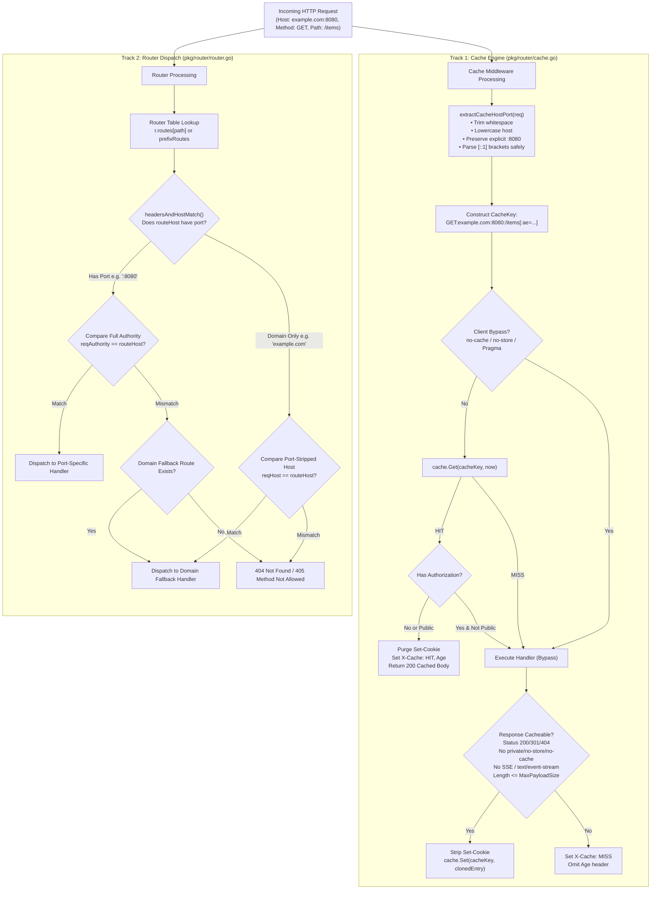

# TASK-157 - Host Port Disambiguation in Route Matching and Cache Key Authority Derivation (RFC 9111 Session Boundary Isolation)

## 1. Overview & Objective

### 1.1 Problem Statement & Background: Disentangling Route Dispatching from Origin Authority

Toron provides high-performance Layer 4 and Layer 7 routing alongside an in-memory HTTP response caching engine ([`pkg/router/cache.go`](file:///Users/sneha/Developer/toron-research/toron/pkg/router/cache.go)). In the initial router design governed by [`ADR-015`](file:///Users/sneha/Developer/toron-research/toron/docs/architecture/ADR-015.md) (*Host Header Sanitization & Routing*), a single helper function `extractHost(req)` was implemented in [`pkg/router/router.go:967-976`](file:///Users/sneha/Developer/toron-research/toron/pkg/router/router.go#L967-L976) to sanitize the incoming `Host` header:

```go
func extractHost(req *httpparser.Request) string {
    h := req.Header.Get("Host")
    if h == "" {
        return ""
    }
    if idx := strings.Index(h, ":"); idx != -1 {
        h = h[:idx]
    }
    return strings.ToLower(strings.TrimSpace(h))
}
```

The objective of `extractHost` was to simplify virtual host routing: an operator registering a route for domain `example.com` expected it to accept client requests regardless of whether the client connected on standard cleartext HTTP (port 80), standard TLS (port 443), or an alternate listener port (e.g. `example.com:8080`).

However, architectural cross-audits revealed two critical flaws in this design:

1. **Cross-Port Cache Key Poisoning & Information Exposure ([CWE-524](https://cwe.mitre.org/data/definitions/524.html))**:
   - In [`pkg/router/cache.go:199`](file:///Users/sneha/Developer/toron-research/toron/pkg/router/cache.go#L199), the cache lookup and storage key was constructed as:
     ```go
     cacheKey := req.Method + ":" + extractHost(req) + ":" + uri
     ```
   - Because `extractHost` unconditionally strips the port number, two completely distinct network origins hosted on the same IP or domain—such as `service.internal:80` (serving public catalog data) and `service.internal:8080` (serving restricted administration dashboards), or `api.corp.local:8080` vs `api.corp.local:8443`—collapse to the exact same cache key:
     ```text
     GET:service.internal:/data
     ```
   - If an authenticated or administrative user requests `/data` on port 8080, an unauthenticated user requesting `/data` on port 80 could receive the cached response intended exclusively for the port 8080 service. This violates the core authority definition of **RFC 9110 §4.2** and **RFC 9111 §2**, where the cache key authority *must* include the port.

2. **Route Matching Incapacity for Explicit Port Constraints**:
   - In [`pkg/router/router.go:978-991`](file:///Users/sneha/Developer/toron-research/toron/pkg/router/router.go#L978-L991), `headersAndHostMatch` validates routes via:
     ```go
     if routeHost != "" {
         if reqHost != strings.ToLower(routeHost) {
             return false
         }
     }
     ```
   - Because `reqHost` has its port stripped by `extractHost`, if an operator explicitly registers a port-specific virtual host route (e.g. `routeHost = "service.internal:8080"`), the check `reqHost != "service.internal:8080"` is *always true* (since `reqHost` is `"service.internal"`), and the route is permanently unreachable!
   - Furthermore, `extractHost` uses naive `strings.Index(h, ":")`, which corrupts bracketed IPv6 literals (e.g. `[::1]:8080` is truncated to `"["`).

3. **Web Cache Deception vs. RFC 9111 Shared Cache Boundary Demarcation**:
   - Ambiguous documentation suggested Toron autonomously prevented application-level Web Cache Deception (WCD; Gil, 2017).
   - In reality, Toron is a compliant transparent RFC 9111 shared proxy cache. If an upstream origin application receives a path-confused request (e.g., `/profile/user.css`), strips the `.css` extension, returns private user data, but **fails to emit `Cache-Control: private` or `no-store`**, a transparent proxy cache must treat the response as public.
   - Mitigating path confusion requires formalizing a **Shared Responsibility Model**: Toron provides bulletproof protocol session boundary isolation (Authorization refusal, `Set-Cookie` stripping, `no-cache`/`private`/`no-store` directives, SSE exemptions), while upstream application frameworks must emit proper directives and reject path suffix confusion.

The objective of **TASK-157** is to break down approved requirement [`REQ-134`](file:///Users/sneha/Developer/toron-research/toron/docs/requirements/REQ-134.md) into concrete, actionable engineering work packages to disambiguate route table matching from cache key authority derivation, enforce RFC 9111 session boundaries, and synchronize internal documentation.

---

### 1.2 Evolution from ADR-015 & REQ-035: Controlled Disambiguation

TASK-157 does not break existing domain-level routing functionality established in [`ADR-015`](file:///Users/sneha/Developer/toron-research/toron/docs/architecture/ADR-015.md). Rather, it **decouples routing flexibility from origin cache identity**:

- **Routing Dispatch Layer (`pkg/router/router.go`)**:
  - *Domain-only routes* (e.g. `routeHost = "example.com"` or `"[::1]"`) continue to function as wildcard-port routes, matching any incoming port (`example.com`, `example.com:80`, `example.com:8080`).
  - *Port-qualified routes* (e.g. `routeHost = "example.com:8080"`) match strictly when the incoming request's authority matches that exact port, enabling distinct handlers for administrative or sidecar ports.
  - Fixes IPv6 bracket handling so IPv6 literals are never mangled.
- **Cache Engine Layer (`pkg/router/cache.go`)**:
  - Eliminates `extractHost` usage inside the cache middleware.
  - Introduces dedicated `extractCacheHostPort(req)` which normalizes the hostname to lowercase, trims whitespace, safely parses bracketed IPv6 addresses, and **preserves the explicit port number**.
  - RFC 9111 cache keys strictly reflect the full authority (`Method:HostPort:URI`), preventing cross-port collisions.

---

### 1.3 Architectural Overview: Decoupled Dual-Track Processing

```
┌──────────────────────────────────────────────────────────────────────────────────────────────────────────────────┐
│                                   TASK-157: DECOUPLED DUAL-TRACK ARCHITECTURE                                    │
├──────────────────────────────────────────────────────────────────────────────────────────────────────────────────┤
│                                                                                                                  │
│    INCOMING CLIENT REQUEST                                                                                       │
│    Host: api.toron.local:8080                                                                                    │
│    GET /v1/telemetry HTTP/1.1                                                                                    │
│          │                                                                                                       │
│          ├───────────────────────────────────────────────┐                                                       │
│          ▼                                               ▼                                                       │
│    ┌─────────────────────────────────────────┐     ┌────────────────────────────────────────────────────────┐    │
│    │  TRACK 1: CACHE KEY AUTHORITY           │     │  TRACK 2: ROUTER DISPATCH & MATCHING                   │    │
│    │  (pkg/router/cache.go)                  │     │  (pkg/router/router.go)                                │    │
│    ├─────────────────────────────────────────┤     ├────────────────────────────────────────────────────────┤    │
│    │  extractCacheHostPort(req)              │     │  headersAndHostMatch(reqHost, req, routeHost, headers) │    │
│    │  • Lowercase normalization              │     │  • If routeHost has explicit port (":8080"):           │    │
│    │  • Preserves explicit port (":8080")    │     │    Compares against full authority ("host:port")       │    │
│    │  • Handles IPv6 brackets ("[::1]:8080") │     │    Strict port isolation (rejects 8443, etc.)          │    │
│    │  CacheKey:                              │     │  • If routeHost has domain only ("api.toron.local"):   │    │
│    │  "GET:api.toron.local:8080:/v1/telemetry│     │    Compares against port-stripped reqHost              │    │
│    │   [:ae=gzip]"                           │     │    Matches any incoming port (wildcard port)           │    │
│    └────────────────────┬────────────────────┘     └───────────────────────────┬────────────────────────────┘    │
│                         │                                                      │                                 │
│                         ▼                                                      ▼                                 │
│             [In-Memory ResponseCache]                              [Router Dispatch Engine]                      │
│             • Cross-Port Isolated                                  • Exact Match Map: r.routes                   │
│             • RFC 9111 Session Boundaries                          • Prefix Route Slice: r.prefixRoutes          │
│             • Dual-Stage Set-Cookie Purge                          • 9 Routing Methods Supported                 │
│                                                                                                                  │
└──────────────────────────────────────────────────────────────────────────────────────────────────────────────────┘
```

---

### 1.4 Prior Requirements & Standards Cross-Audit (Conflict Analysis)

A thorough cross-audit against existing Toron specifications and architectural decisions confirms complete harmonization:

| Prior Requirement / ADR | Core Architectural Invariant | Potential Conflict & Cross-Audit Resolution | Compliance Verdict |
| :--- | :--- | :--- | :--- |
| **[`REQ-035`](file:///Users/sneha/Developer/toron-research/toron/docs/requirements/REQ-035.md) / [`ADR-030`](file:///Users/sneha/Developer/toron-research/toron/docs/architecture/ADR-030.md)** (In-Memory HTTP Cache) | Mandates compliance with RFC 7234 (RFC 9111) HTTP caching rules. | **Reinforced**: Under RFC 9111 §2, the primary cache key incorporates the target URI authority (host and port). Preserving the port strictly satisfies RFC 9111 cache authority requirements. | **100% Compliant** |
| **[`ADR-015`](file:///Users/sneha/Developer/toron-research/toron/docs/architecture/ADR-015.md)** (Host Header Sanitization & Routing) | `extractHost(req)` strips ports for domain-level route dispatch. | **Disambiguated**: Routing dispatch and cache key derivation serve different architectural functions. Domain-only route matching remains intact as wildcard-port matching, while cache key authority derivation preserves port. | **Harmonized** |
| **[`REQ-128`](file:///Users/sneha/Developer/toron-research/toron/docs/requirements/REQ-128.md) / [`ADR-128`](file:///Users/sneha/Developer/toron-research/toron/docs/architecture/ADR-128.md)** (Streaming Exemptions & Origin Directives) | Enforces `Cache-Control: no-cache`, `no-store`, `private`, `Authorization` refusal, and SSE streaming exemptions (`text/event-stream`). | **Reinforced**: REQ-134 builds directly on REQ-128 by delineating RFC 9111 session boundaries from application path confusion. Directives and streaming exemptions remain untouched. | **100% Compliant** |
| **[`ADR-058`](file:///Users/sneha/Developer/toron-research/toron/docs/architecture/ADR-058.md)** (Shared Cache Authorization Boundary) | Refuses caching of requests bearing `Authorization` unless origin explicitly marks response `public`. | **Preserved**: Authorization refusal remains an invariant of Toron's RFC 9111 session boundary isolation. | **100% Compliant** |
| **[`ADR-001`](file:///Users/sneha/Developer/toron-research/toron/docs/architecture/ADR-001.md)** (Reactor Modularity) | Middleware components operate strictly on abstract requests/responses without touching the physical `net.Conn`. | **Preserved**: Cache middleware continues to operate entirely within the `HandlerFunc` pipeline, never touching transport sockets. | **100% Compliant** |
| **[`REQ-116`](file:///Users/sneha/Developer/toron-research/toron/docs/requirements/REQ-116.md)** (Static Route Prefix Escape Guard) | Prevents path traversal and directory escape on static prefix routes. | **Preserved**: Static route prefix boundary checks execute before handler dispatch and remain unaffected. | **100% Compliant** |
| **[`REQ-131`](file:///Users/sneha/Developer/toron-research/toron/docs/requirements/REQ-131.md)** (Version SSOT) | Universal SSOT alignment (`v1.5.29`). | **Preserved**: Configuration bindings and emitted headers dynamically bind to `pkg/version`. | **100% Compliant** |
| **[`REQ-133`](file:///Users/sneha/Developer/toron-research/toron/docs/requirements/REQ-133.md)** (Inbound Chunked Transfer-Encoding) | Inbound chunked body decoding and canonical edge normalization. | **Preserved**: Chunked decoding operates at the parser/proxy layer; caching operates only on buffered idempotent GET/HEAD responses. | **100% Compliant** |

---

### 1.5 Safe Non-Conflicting Request Processing Pipeline



---

## 2. Work Breakdown Structure (WBS)

```
TASK-157: Host Port Disambiguation in Route Matching and Cache Key Authority Derivation
├── WP-1: TASK-157.1: Dedicated extractCacheHostPort Implementation in pkg/router/cache.go
│   ├── Subtask 1.1: extractCacheHostPort Signature & Whitespace Trimming
│   ├── Subtask 1.2: Bracketed IPv6 Literal Parsing & Port Extraction
│   ├── Subtask 1.3: Standard Hostname & IPv4 Port Preservation
│   └── Subtask 1.4: Zero-Allocation & Lowercase Normalization Optimization
├── WP-2: TASK-157.2: Cache Lookup & Admission Key Construction Update in pkg/router/cache.go
│   ├── Subtask 2.1: Cache Lookup Key Construction Update
│   ├── Subtask 2.2: Cache Admission Snapshot Key Binding
│   └── Subtask 2.3: RFC 9111 Session Boundary Invariant Enforcement
├── WP-3: TASK-157.3: Route Table Matching Disambiguation in pkg/router/router.go
│   ├── Subtask 3.1: headersAndHostMatch Route Host Disambiguation
│   ├── Subtask 3.2: IPv6-Safe Port Stripping in extractHost
│   ├── Subtask 3.3: Exact Match & Prefix Match Precedence Harmonization
│   └── Subtask 3.4: ShouldRedirectHTTP and MatchPrefixRoute Alignment
├── WP-4: TASK-157.4: Routing Method Invariants Audit & Verification Across All 9 Methods
│   ├── Subtask 4.1: Layer 7 Routing Methods Audit (Methods 1-5)
│   ├── Subtask 4.2: Reverse Proxy & Static File Routing Audit (Methods 6-7)
│   └── Subtask 4.3: Discovery, Ingress & Multi-Port Listeners Audit (Methods 8-9)
├── WP-5: TASK-157.5: Unit and Integration Testing in pkg/router/
│   ├── Subtask 5.1: Unit Tests for extractCacheHostPort Table Vectors (cache_test.go)
│   ├── Subtask 5.2: Cross-Port Cache Isolation Integration Tests (cache_test.go)
│   ├── Subtask 5.3: Route Table Port Disambiguation Tests (router_test.go)
│   ├── Subtask 5.4: IPv6 Route & Cache Isolation Tests (router_test.go, cache_test.go)
│   └── Subtask 5.5: Concurrency & Race Detector Sweep (go test -race ./...)
└── WP-6: TASK-157.6: Internal Wiki Documentation Updates
    ├── Subtask 6.1: Response Caching Guide (docs/wiki/features/response-caching.md)
    ├── Subtask 6.2: Configuration Reference (docs/wiki/configuration.md)
    └── Subtask 6.3: Wiki Index Alignment (docs/wiki/index.md)
```

---

### Work Package 1 (WP-1): TASK-157.1 - Dedicated `extractCacheHostPort` Implementation in `pkg/router/cache.go`

#### Objective & Scope
Implement a dedicated authority extraction function `extractCacheHostPort(req *httpparser.Request) string` in [`pkg/router/cache.go`](file:///Users/sneha/Developer/toron-research/toron/pkg/router/cache.go). Unlike the routing helper `extractHost`, this function **preserves explicit port numbers**, trims surrounding whitespace, normalizes hostnames to lowercase, and safely parses bracketed IPv6 literals.

#### Technical Specifications & Algorithmic Steps

1. **Function Signature**:
   ```go
   func extractCacheHostPort(req *httpparser.Request) string
   ```
2. **Algorithmic Flow**:
   - **Step 1: Request & Header Extraction**:
     If `req == nil`, return `""`. Read `h := req.Header.Get("Host")`. If `h == ""`, return `""`.
   - **Step 2: Whitespace Trimming**:
     Trim leading and trailing ASCII whitespace: `h = strings.TrimSpace(h)`. If `h == ""`, return `""`.
   - **Step 3: Bracketed IPv6 Literal Handling**:
     If `strings.HasPrefix(h, "[")`:
     - Locate the closing bracket: `closeBracket := strings.Index(h, "]")`.
     - If `closeBracket != -1`:
       - The enclosed IPv6 address is `ipv6 := strings.ToLower(h[1:closeBracket])`.
       - Reconstructed bracketed host: `normalizedHost := "[" + ipv6 + "]"`.
       - The trailing remainder is `rest := h[closeBracket+1:]`.
       - If `strings.HasPrefix(rest, ":")`:
         - Port is `port := strings.TrimSpace(rest[1:])`.
         - If `port != ""` { return `normalizedHost + ":" + port` }
       - Return `normalizedHost`.
     - If closing bracket is missing (malformed header), fall back to `strings.ToLower(h)`.
   - **Step 4: Standard Hostname & IPv4 Handling**:
     If not bracketed IPv6:
     - Locate the port separator: `colonIdx := strings.LastIndex(h, ":")`.
     - If `colonIdx != -1`:
       - Host component: `host := strings.ToLower(strings.TrimSpace(h[:colonIdx]))`.
       - Port component: `port := strings.TrimSpace(h[colonIdx+1:])`.
       - If `port != ""` { return `host + ":" + port` }
       - Return `host`.
     - If `colonIdx == -1`:
       - No port present: return `strings.ToLower(h)`.

#### Target Vectors & Expected Outputs
| Incoming `Host` Header | Normalized Output of `extractCacheHostPort` |
| :--- | :--- |
| `example.com` | `example.com` |
| `EXAMPLE.COM` | `example.com` |
| `example.com:8080` | `example.com:8080` |
| `EXAMPLE.COM:8080` | `example.com:8080` |
| `  api.toron.local:9090  ` | `api.toron.local:9090` |
| `[::1]:8080` | `[::1]:8080` |
| `[::1]` | `[::1]` |
| `[2001:0DB8::1]:8443` | `[2001:0db8::1]:8443` |
| `127.0.0.1:8000` | `127.0.0.1:8000` |
| `""` (missing header) | `""` |

#### Deliverables & Acceptance Criteria
- **Target File**: [`pkg/router/cache.go`](file:///Users/sneha/Developer/toron-research/toron/pkg/router/cache.go)
- **Zero Third-Party Dependencies**: Pure Go standard library (`strings`).
- **Memory Boundedness**: Incurs zero heap allocations on common paths without ports; single string concatenation when port is attached.

---

### Work Package 2 (WP-2): TASK-157.2 - Cache Lookup & Admission Key Construction Update in `pkg/router/cache.go`

#### Objective & Scope
Update the cache lookup and admission key construction in `NewCacheMiddlewareWithStore` ([`pkg/router/cache.go:199`](file:///Users/sneha/Developer/toron-research/toron/pkg/router/cache.go#L199)) to use `extractCacheHostPort(req)` instead of `extractHost(req)`. Audit and preserve all RFC 9111 session boundary invariants.

#### Technical Specifications & Implementation Details

1. **Key Construction Update**:
   In `NewCacheMiddlewareWithStore` (around line 199):
   ```go
   // Replace:
   // cacheKey := req.Method + ":" + extractHost(req) + ":" + uri
   // With:
   cacheKey := req.Method + ":" + extractCacheHostPort(req) + ":" + uri
   if ae := req.Header.Get("Accept-Encoding"); ae != "" {
       cacheKey += ":ae=" + ae
   }
   ```
2. **Unified Lifecycle Invariant**:
   - The same `cacheKey` variable computed prior to `cache.Get` must be reused for `cache.Set`, guaranteeing deterministic admission.
   - `extractHost` must no longer be invoked in `cache.go`.
3. **RFC 9111 Session Boundary Invariants Audit**:
   - **Authorization Refusal (RFC 9111 §3.5)**:
     Requests bearing `Authorization` headers must be bypassed on lookup unless `cached.Public` is true (lines 207–209), and bypassed on storage unless `resCC.Public` is true (lines 267–271).
   - **Dual-Stage Set-Cookie Stripping (RFC 9111 §8, CWE-384)**:
     - On cache hit: explicitly purge `res.Header.Del("Set-Cookie")` and `res.Header.Del("Set-Cookie2")` (lines 217–218).
     - On cache admission: clone headers while omitting `Set-Cookie` and `Set-Cookie2` (lines 297–307).
   - **Directive Enforcement (RFC 9111 §5.2.2)**:
     `resCC.NoStore`, `resCC.NoCache`, `resCC.Private` unconditionally bypass cache admission (lines 262–265).
   - **Streaming Exemption ([`REQ-128`](file:///Users/sneha/Developer/toron-research/toron/docs/requirements/REQ-128.md))**:
     `text/event-stream`, `X-Accel-Buffering: no`, `res.StreamBody != nil`, `res.UpgradedConn != nil` unconditionally bypass storage (lines 241–249).

#### Deliverables & Acceptance Criteria
- **Target File**: [`pkg/router/cache.go`](file:///Users/sneha/Developer/toron-research/toron/pkg/router/cache.go)
- **Verification**: `grep "extractHost" pkg/router/cache.go` returns zero matches.
- **Authority Isolation**: Requests with differing host ports yield distinct cache keys and never collide.

---

### Work Package 3 (WP-3): TASK-157.3 - Route Table Matching Disambiguation in `pkg/router/router.go`

#### Objective & Scope
Disambiguate route table host matching in `headersAndHostMatch` ([`pkg/router/router.go:978-991`](file:///Users/sneha/Developer/toron-research/toron/pkg/router/router.go#L978-L991)). Allow operators to register both domain-only wildcard-port routes (e.g. `example.com`) and explicit port-specific routes (e.g. `example.com:8080`), ensuring exact port matches are evaluated cleanly without breaking fallback routing. Fix IPv6 port stripping in `extractHost`.

#### Technical Specifications & Implementation Details

1. **IPv6-Safe Port Stripping in `extractHost`**:
   In `pkg/router/router.go:967-976`, fix `extractHost` to handle bracketed IPv6:
   ```go
   func extractHost(req *httpparser.Request) string {
       h := req.Header.Get("Host")
       if h == "" {
           return ""
       }
       h = strings.TrimSpace(h)
       if strings.HasPrefix(h, "[") {
           if idx := strings.Index(h, "]"); idx != -1 {
               return strings.ToLower(h[:idx+1])
           }
       }
       if idx := strings.LastIndex(h, ":"); idx != -1 {
           h = h[:idx]
       }
       return strings.ToLower(strings.TrimSpace(h))
   }
   ```
2. **Explicit Port Detection Helper**:
   Define `hasExplicitPort(host string) bool`:
   ```go
   func hasExplicitPort(host string) bool {
       host = strings.TrimSpace(host)
       if strings.HasPrefix(host, "[") {
           idx := strings.Index(host, "]")
           return idx != -1 && strings.Contains(host[idx+1:], ":")
       }
       return strings.Contains(host, ":")
   }
   ```
3. **Full Authority Extraction Helper**:
   Define `extractFullHostPort(req *httpparser.Request) string`:
   ```go
   func extractFullHostPort(req *httpparser.Request) string {
       if req == nil {
           return ""
       }
       h := strings.TrimSpace(req.Header.Get("Host"))
       if h == "" {
           return ""
       }
       if strings.HasPrefix(h, "[") {
           closeBracket := strings.Index(h, "]")
           if closeBracket != -1 {
               ipv6 := strings.ToLower(h[1:closeBracket])
               rest := h[closeBracket+1:]
               if strings.HasPrefix(rest, ":") {
                   return "[" + ipv6 + "]:" + strings.TrimSpace(rest[1:])
               }
               return "[" + ipv6 + "]"
           }
       }
       colonIdx := strings.LastIndex(h, ":")
       if colonIdx != -1 {
           return strings.ToLower(strings.TrimSpace(h[:colonIdx])) + ":" + strings.TrimSpace(h[colonIdx+1:])
       }
       return strings.ToLower(h)
   }
   ```
4. **`headersAndHostMatch` Disambiguation Logic**:
   Update `headersAndHostMatch` ([`pkg/router/router.go:978`](file:///Users/sneha/Developer/toron-research/toron/pkg/router/router.go#L978)):
   ```go
   func headersAndHostMatch(reqHost string, req *httpparser.Request, routeHost string, expectedHeaders map[string]string) bool {
       if routeHost != "" {
           cleanRouteHost := strings.ToLower(strings.TrimSpace(routeHost))
           if hasExplicitPort(cleanRouteHost) {
               // Port-specific route: must match full incoming authority (host and port)
               reqAuthority := extractFullHostPort(req)
               if reqAuthority != cleanRouteHost {
                   return false
               }
           } else {
               // Domain-only route: matches port-stripped reqHost (wildcard port)
               if reqHost != cleanRouteHost {
                   return false
               }
           }
       }
       for k, expectedVal := range expectedHeaders {
           actualVal := req.Header.Get(k)
           if actualVal != expectedVal {
               return false
           }
       }
       return true
   }
   ```
5. **Call-Site Audit**:
   Verify all 4 call sites of `headersAndHostMatch` in `pkg/router/router.go`:
   - Exact route map dispatch (line 828)
   - Prefix route 405 check (line 900)
   - Prefix route match loop (line 956)
   - `MatchPrefixRoute` inspection (line 1012)
   - `ShouldRedirectHTTP` inspection (line 956)

#### Deliverables & Acceptance Criteria
- **Target File**: [`pkg/router/router.go`](file:///Users/sneha/Developer/toron-research/toron/pkg/router/router.go)
- **Domain-Only Matching**: Route registered for `example.com` matches requests with `Host: example.com`, `example.com:80`, `example.com:8080`.
- **Port-Specific Matching**: Route registered for `example.com:8080` matches requests with `Host: example.com:8080`, and rejects `example.com:8443` or `example.com`.
- **IPv6 Safety**: `[::1]:8080` and `[::1]` parse and match accurately without string corruption.

---

### Work Package 4 (WP-4): TASK-157.4 - Routing Method Invariants Audit & Verification Across All 9 Routing Methods

#### Objective & Scope
Perform an exhaustive architectural audit and behavioral verification across all 9 routing methods supported by Toron to ensure that route dispatching, virtual hosting, and cache key derivation operate harmoniously without regression.

#### Method-by-Method Audit & Invariant Matrix

| # | Routing Method | Route Table Location & Mechanism | Host Port Matching Rule | Cache Key Authority Behavior | Cross-Port Collision Prevention Invariant |
| :--- | :--- | :--- | :--- | :--- | :--- |
| **1** | **Exact Path Routing** (`r.Handle`, `r.GET`, `r.POST`) | `r.routes[path][method][]routeEntry` | Evaluates `headersAndHostMatch`. Exact port routes take precedence over domain fallbacks. | Cache key includes client `Host:Port`. | Requests to different ports on the same path never share cache entries. |
| **2** | **Prefix Path Routing** (`r.prefixRoutes`) | Sorted slice `r.prefixRoutes` scanned in specificity order (longest prefix first). | Evaluates `headersAndHostMatch` on prefix routes. Explicit port routes isolate specific port prefixes. | Cache key includes client `Host:Port`. | Distinct host:port pairs isolate prefix routes in cache. |
| **3** | **Domain / Virtual Host Routing** (`routeEntry.host`, `prefixRoute.host`) | `routeEntry.host` and `prefixRoute.host` | Domain-only matches any port. Explicit `host:port` matches specified port only. | Preserves explicit port in cache key authority. | Multi-tenant services sharing hostnames on different ports remain fully isolated. |
| **4** | **Header-Based Routing** (`routeEntry.headers`, `prefixRoute.headers`) | Evaluated alongside host in `headersAndHostMatch`. Sorted by header count in prefix routes. | Combines header match with host match. Headers evaluated before cache hit dispatch. | Cache key includes client `Host:Port`, method, URI, and `Accept-Encoding`. | Canary and staging header routes execute correctly under host-port constraints. |
| **5** | **Method-Based Routing** (`GET`, `HEAD`, `POST`, `PUT`, `DELETE`, etc.) | Exact map partitioned by method. Prefix routes check `pr.method` and return 405 on mismatch. | Host port matching executes prior to method dispatch or 405 generation. | Caching middleware evaluates **only idempotent `GET` and `HEAD`** methods; all others bypass. | State-changing methods (`POST`, `PUT`, etc.) never enter cache or mutate cache state. |
| **6** | **Reverse Proxy Upstream Routing** (`proxy.ReverseProxy`) | `ProxyConfig.Routes` or `r.RoutePrefix(RouteTypeUpstream, ...)` | Matches downstream client authority. Strips/rewrites path prefixes. | Cache key reflects **client downstream authority** (`Host:Port`), NEVER upstream target IP:port. | Multi-tenant clients proxying through the same gateway remain isolated in cache. |
| **7** | **Static File Serving Routing** (`RouteTypeStatic`, `REQ-116`) | `createStaticHandler` with SPA fallback and prefix escape guards. | Domain-only or port-specific static routes served from disk. | Cache key reflects client `Host:Port` and static request URI. | Static routes bound to different virtual hosts or ports do not bleed cached files. |
| **8** | **K8s Ingress & Container Discovery** (`pkg/ingress`, `pkg/discovery`) | Dynamically registered prefix routes via `r.ReplacePrefixRoutesBySource(...)`. | Ingress rules with host and port annotations translate cleanly into prefix route rules. | Dynamically discovered routes preserve client `Host:Port` in cache keys. | Dynamic route replacements preserve cache authority invariants. |
| **9** | **Multi-Port Gateway Listeners** (HTTP 80, HTTPS 443, H3 8443, L4 TCP/UDP) | Concurrent listeners sharing the router instance. | Dispatches requests from concurrent port listeners into shared router cleanly. | Explicit listener ports in client `Host` header are preserved in cache keys. | Concurrent requests across ports 80, 8080, and 8443 never collide in cache. |

#### Deliverables & Acceptance Criteria
- Full verification of all 9 routing methods in `pkg/router/`.
- No regressions across exact, prefix, reverse proxy, static file, ingress, or redirect routing.

---

### Work Package 5 (WP-5): TASK-157.5 - Unit and Integration Testing in `pkg/router/`

#### Objective & Scope
Implement comprehensive test suites in [`pkg/router/cache_test.go`](file:///Users/sneha/Developer/toron-research/toron/pkg/router/cache_test.go) and [`pkg/router/router_test.go`](file:///Users/sneha/Developer/toron-research/toron/pkg/router/router_test.go) verifying cross-port cache isolation, IPv6 handling, route matching disambiguation, and RFC 9111 session boundaries.

#### Detailed Test Specifications

1. **`TestCache_HostPortIsolation` ([`pkg/router/cache_test.go`](file:///Users/sneha/Developer/toron-research/toron/pkg/router/cache_test.go))**:
   - Register route `/api/isolated` with cache middleware enabled.
   - Request 1: `GET /api/isolated` with `Host: service.local:8080`.
     - Expect `X-Cache: MISS`, status 200, handler invoked (calls = 1).
   - Request 2: `GET /api/isolated` with `Host: service.local:9090`.
     - **CRITICAL ASSERTION**: Must result in `X-Cache: MISS`, status 200, handler invoked (calls = 2).
     - Response for port 9090 MUST NOT be served from the port 8080 cache entry!
   - Request 3: `GET /api/isolated` with `Host: service.local:8080`.
     - Expect `X-Cache: HIT`, Age header present, handler NOT invoked (calls = 2).
   - Request 4: `GET /api/isolated` with `Host: service.local:9090`.
     - Expect `X-Cache: HIT`, Age header present, handler NOT invoked (calls = 2).

2. **`TestCache_HostPortKeyDerivation` ([`pkg/router/cache_test.go`](file:///Users/sneha/Developer/toron-research/toron/pkg/router/cache_test.go))**:
   - Table-driven unit test verifying `extractCacheHostPort`:
     ```go
     tests := []struct {
         name     string
         input    string
         expected string
     }{
         {"standard host without port", "example.com", "example.com"},
         {"uppercase host without port", "EXAMPLE.COM", "example.com"},
         {"standard host with port", "example.com:8080", "example.com:8080"},
         {"uppercase host with port", "EXAMPLE.COM:8080", "example.com:8080"},
         {"whitespace around host and port", "   api.toron.local:9090   ", "api.toron.local:9090"},
         {"IPv6 localhost with port", "[::1]:8080", "[::1]:8080"},
         {"IPv6 localhost without port", "[::1]", "[::1]"},
         {"IPv6 full with port uppercase", "[2001:0DB8::1]:8443", "[2001:0db8::1]:8443"},
         {"IPv4 with port", "127.0.0.1:9000", "127.0.0.1:9000"},
         {"empty host header", "", ""},
     }
     ```

3. **`TestCache_IPv6HostPortIsolation` ([`pkg/router/cache_test.go`](file:///Users/sneha/Developer/toron-research/toron/pkg/router/cache_test.go))**:
   - Verify that requests with `Host: [::1]:8080` and `Host: [::1]:8443` produce distinct cache keys and do not share cached entries.

4. **`TestCache_SessionBoundaryDirectives` ([`pkg/router/cache_test.go`](file:///Users/sneha/Developer/toron-research/toron/pkg/router/cache_test.go))**:
   - Verify `Set-Cookie` and `Set-Cookie2` are purged on hit and never stored in cache snapshot.
   - Verify `Cache-Control: private`, `no-store`, `no-cache` are never stored.
   - Verify `Authorization` requests bypass cache unless origin emits `Cache-Control: public`.
   - Verify streaming MIME types (`text/event-stream`, `X-Accel-Buffering: no`) bypass cache.

5. **`TestRouter_HostPortDisambiguation` ([`pkg/router/router_test.go`](file:///Users/sneha/Developer/toron-research/toron/pkg/router/router_test.go))**:
   - Register domain-only route: `r.GETHost("api.toron.local", "/data", handlerDomain)`
   - Register explicit port route: `r.GETHost("api.toron.local:9000", "/data", handlerPort9000)`
   - Request with `Host: api.toron.local:9000` -> routes to `handlerPort9000`.
   - Request with `Host: api.toron.local:8080` -> routes to `handlerDomain` (wildcard port).
   - Request with `Host: api.toron.local` -> routes to `handlerDomain`.
   - Request with `Host: other.toron.local:9000` -> returns 404 Not Found.

6. **`TestRouter_IPv6HostMatching` ([`pkg/router/router_test.go`](file:///Users/sneha/Developer/toron-research/toron/pkg/router/router_test.go))**:
   - Register route with `routeHost = "[::1]:8080"`.
   - Request with `Host: [::1]:8080` matches.
   - Request with `Host: [::1]:8443` returns 404.
   - Register route with `routeHost = "[::1]"`.
   - Request with `Host: [::1]:8080` matches domain-only wildcard.

7. **Concurrency & Race Detector Sweep**:
   - Run `go test -race ./pkg/router/...` and `go test -race ./...` to verify zero data races.

#### Deliverables & Acceptance Criteria
- All tests pass 100% under `go test -race`.

---

### Work Package 6 (WP-6): TASK-157.6 - Internal Wiki Documentation Updates

#### Objective & Scope
Synchronize all internal wiki documentation in `docs/wiki/` to reflect RFC 9111 Shared Cache Session Boundary Isolation, the Host-Port Cache Key Derivation formula, and the Web Cache Deception Shared Responsibility Model. No references to external files outside the project repository are permitted.

#### Detailed Documentation Changes

1. **`docs/wiki/features/response-caching.md`**:
   - Update title and header to reference **RFC 9111 Shared Cache Session Boundary Isolation**.
   - Document the Host:Port cache key derivation formula:
     ```text
     cacheKey = req.Method + ":" + extractCacheHostPort(req) + ":" + uri [+ ":ae=" + AcceptEncoding]
     ```
   - Explain why preserving the port is essential for multi-tenant deployments, microservices, and multi-port listeners.
   - Add a dedicated section: **"Web Cache Deception & The Shared Responsibility Model"**:
     - *Toron Protocol Guarantees*: Detail Authorization refusal (RFC 9111 §3.5), dual-stage `Set-Cookie` stripping (RFC 9111 §8), directive enforcement (`private`, `no-store`, `no-cache`), and SSE streaming exemptions (`text/event-stream`).
     - *Upstream Application Responsibility*: Explain why transparent proxies do not guess MIME types or rewrite application paths. Detail how upstream application backends must cooperate by emitting `Cache-Control: private, no-store` on authenticated routes and rejecting unexpected trailing extensions on dynamic paths.
   - Add **"Developer Best Practices for Application Frameworks"**:
     1. Always emit `Cache-Control: private, no-store` on authenticated or personalized endpoints.
     2. Strict route matching: reject requests with unexpected file suffixes (`.css`, `.jpg`) on dynamic API routes.
     3. Emit `Vary: Cookie` or `Vary: Authorization` where appropriate.
   - Update FAQ and troubleshooting entries to cover cross-port isolation and path confusion.

2. **`docs/wiki/configuration.md`**:
   - Update the cache configuration section to document `Host:Port` authority derivation and cross-port isolation.
   - Cross-reference multi-port gateway listeners and reverse proxy routing configurations.

3. **`docs/wiki/index.md`**:
   - Update navigation and feature summary for response caching to emphasize RFC 9111 Shared Cache Session Boundary Isolation and Host-Port Authority Preservation.

#### Deliverables & Acceptance Criteria
- **Target Files**:
  - [`docs/wiki/features/response-caching.md`](file:///Users/sneha/Developer/toron-research/toron/docs/wiki/features/response-caching.md)
  - [`docs/wiki/configuration.md`](file:///Users/sneha/Developer/toron-research/toron/docs/wiki/configuration.md)
  - [`docs/wiki/index.md`](file:///Users/sneha/Developer/toron-research/toron/docs/wiki/index.md)
- Complete alignment with REQ-134 FR-4 without external references.

---

## 3. The 4 Non-Negotiable Invariants

```
+--------------------------------------------------------------------------------------------------+
│                                  THE 4 NON-NEGOTIABLE INVARIANTS                                 │
│                                                                                                  │
│  1. ZERO EXTERNAL THIRD-PARTY DEPENDENCIES:                                                      │
│     Host:port extraction, normalization, IPv6 bracket parsing, and cache key generation          │
│     MUST use pure Go standard library packages (strings, net, sync, time). Zero third-party     │
│     dependencies are permitted.                                                                  │
│                                                                                                  │
│  2. CORE REACTOR MODULARITY PRESERVED (ADR-001):                                                 │
│     The caching middleware operates strictly within the HTTP middleware pipeline on abstract    │
│     *httpparser.Request and *ResponseWriter structures. It MUST NEVER access or manipulate      │
│     the physical net.Conn socket, preserving reactor transport isolation.                        │
│                                                                                                  │
│  3. MEMORY BOUNDEDNESS & MINIMAL ALLOCATION FOOTPRINT (ADR-030 / ADR-129):                       │
│     Authority extraction and cache key formatting MUST minimize heap allocations. Cache memory   │
│     remains strictly bounded by max_entries and max_payload_size configurations, preventing      │
│     heap exhaustion (CWE-400).                                                                   │
│                                                                                                  │
│  4. ZERO DATA RACES UNDER `go test -race ./...`:                                                 │
│     Cache lookups, insertions, authority extractions, and route evaluations MUST be 100%         │
│     race-free under high-concurrency evaluation across multiple worker goroutines.               │
+--------------------------------------------------------------------------------------------------+
```

---

## 4. Acceptance Criteria & Verification

### 4.1 Functional Acceptance Criteria
- [ ] **AC-1 (Route Matching Disambiguation)**:
  - When a route is registered with a domain-only host (e.g. `example.com`), it matches incoming requests with `Host: example.com`, `Host: example.com:80`, and `Host: example.com:8080`.
  - When a route is registered with an explicit host:port (e.g. `example.com:8080`), it matches incoming requests with `Host: example.com:8080`, and MUST NOT match requests with `Host: example.com:8443` or `Host: example.com`.
  - When both an explicit host:port route and a domain-only fallback route are registered for the same path, requests to that port route to the explicit handler.
- [ ] **AC-2 (Host:Port Cache Key Preservation)**:
  - When a request includes a `Host` header with an explicit port (e.g., `Host: api.toron.local:8080`), the generated cache key MUST contain the port (`"GET:api.toron.local:8080:/path"`).
  - When a request includes a `Host` header without a port (e.g., `Host: api.toron.local`), the generated cache key MUST contain the hostname without a port (`"GET:api.toron.local:/path"`).
  - When an IPv6 literal host with a port is supplied (e.g., `Host: [::1]:8080`), the cache key MUST preserve the bracketed host and port (`"GET:[::1]:8080:/path"`).
- [ ] **AC-3 (Cross-Port Cache Isolation Verification)**:
  - A test case in `pkg/router/cache_test.go` MUST verify that two consecutive requests with identical HTTP methods and URIs but different host ports (e.g., `Host: service.local:8080` and `Host: service.local:9090`) do NOT share cache entries. The second request to port 9090 MUST result in `X-Cache: MISS` and invoke the upstream handler.
- [ ] **AC-4 (RFC 9111 Boundary Invariant Verification)**:
  - Verified that `Set-Cookie` and `Set-Cookie2` headers are purged before storage and upon cache delivery.
  - Verified that responses bearing `Cache-Control: private`, `no-store`, or `no-cache` are never admitted to the cache.
  - Verified that requests bearing `Authorization` headers are refused from shared cache unless the origin response explicitly specifies `Cache-Control: public`.
  - Verified that streaming responses (`text/event-stream`, `X-Accel-Buffering: no`) bypass cache storage.
- [ ] **AC-5 (Routing Methods Integrity)**:
  - Verified that all 9 routing methods (Exact, Prefix, Domain/VHost, Header, Method, Reverse Proxy, Static File, K8s Ingress / Container Discovery, Multi-Port Gateway Listeners) continue to operate correctly and dispatch requests without regression.
- [ ] **AC-6 (Internal Documentation Alignment)**:
  - `docs/wiki/features/response-caching.md`, `docs/wiki/configuration.md`, and `docs/wiki/index.md` are fully updated per REQ-134 FR-4.
  - No references to files outside the project repository are introduced.
- [ ] **AC-7 (Zero Regression & Concurrency Cleanliness)**:
  - All unit, integration, and benchmark tests pass with 100% success under the race detector:
    ```bash
    go test -race ./...
    ```

---

## 5. Threat Modeling & Security Risk Mitigation Matrix

| Threat Scenario | Failure Mode / Attack Vector | Impact | CWE | Mitigation in TASK-157 |
| :--- | :--- | :--- | :--- | :--- |
| **THREAT-01: Cross-Port Cache Poisoning & Key Collision** | Cache key derives from port-stripped host; attacker accesses cached admin response from public port. | High (Privilege escalation, unauthorized data exposure across multi-tenant ports) | [CWE-524](https://cwe.mitre.org/data/definitions/524.html) | `extractCacheHostPort` preserves port in cache key authority (`Method:HostPort:URI`). |
| **THREAT-02: Application Path Confusion (Web Cache Deception)** | Origin framework strips static extension (`.css`) from dynamic user profile but omits `Cache-Control: private`. | High (Victim profile cached under static URL if origin fails to declare private) | [CWE-524](https://cwe.mitre.org/data/definitions/524.html) | Formalize Shared Responsibility Model; enforce RFC 9111 protocol boundaries; document developer framework hygiene. |
| **THREAT-03: Shared Cache Session Fixation & Credential Bleed** | Cached response contains origin session cookies (`Set-Cookie`); served to subsequent clients. | Critical (Session takeover, credential theft across concurrent users) | [CWE-384](https://cwe.mitre.org/data/definitions/384.html) | Dual-stage `Set-Cookie` and `Set-Cookie2` header purging: before cache storage and before cache hit delivery. |
| **THREAT-04: Authenticated Endpoint Cache Leakage** | User with `Authorization: Bearer <token>` requests sensitive resource; cached response served to unauthenticated probe. | High (Data breach on protected APIs) | [CWE-524](https://cwe.mitre.org/data/definitions/524.html) | Strict RFC 9111 §3.5 Authorization refusal: requests bearing `Authorization` bypass cache unless origin response is explicitly `public`. |
| **THREAT-05: Port-Specific Route Hijacking or Fallback Leakage** | Operator configures administrative route on port 8080; router ignores port and routes traffic to domain fallback handler. | Medium (Bypass of port-specific access controls or handlers) | [CWE-20](https://cwe.mitre.org/data/definitions/20.html) | `headersAndHostMatch` compares full authority when `routeHost` specifies a port, giving exact-port routes precedence over domain fallbacks. |

---

## 6. Open Questions & Architectural Resolutions

- **Open Question 1: Should `extractHost` continue to be used anywhere in `pkg/router/cache.go`?**
  - *Resolution*: No. `extractHost` strips the port number, which is appropriate only for wildcard-port route dispatching. In `cache.go`, all cache key generation MUST exclusively use `extractCacheHostPort(req)` to guarantee cross-port isolation.
- **Open Question 2: How should missing or malformed `Host` headers be handled in cache key derivation?**
  - *Resolution*: If the `Host` header is missing or empty, `extractCacheHostPort` returns `""`. The resulting cache key becomes `Method::URI`, consistent with HTTP/1.0 hostless requests without crashing.
- **Open Question 3: When both an explicit `host:port` route and a domain-only route match the same incoming request path, which takes precedence?**
  - *Resolution*: Explicit `host:port` routes take precedence over domain-only routes. In both exact match (`r.routes`) and prefix route scanning (`r.prefixRoutes`), the matching loop evaluates explicit port matches first before considering domain-only or wildcard fallback routes.
- **Open Question 4: Can an upstream reverse proxy backend's IP:port ever contaminate the downstream client cache key?**
  - *Resolution*: No. The cache key authority is derived strictly from the downstream client's request (`extractCacheHostPort(req)`), never from the upstream backend target URL or IP. This ensures that different tenants proxying through the gateway remain isolated.
- **Open Question 5: Why doesn't Toron block Web Cache Deception heuristically by inspecting file extensions?**
  - *Resolution*: Under RFC 9111, a transparent reverse proxy cache must not guess MIME types, rewrite URIs, or guess application semantics. Heuristically blocking `.css` or `.jpg` breaks legitimate Single Page Applications, CSS-in-JS APIs, and dynamic asset gateways. The correct, standardized architectural boundary is the **Shared Responsibility Model**: Toron enforces protocol directives, while origin frameworks must declare `Cache-Control: private` and enforce path hygiene.

---

## 7. Traceability Matrix

| Requirement / Artifact | Relationship | Description / Verification Target | Implementation Target |
| :--- | :--- | :--- | :--- |
| **[`REQ-134 §2.1`](file:///Users/sneha/Developer/toron-research/toron/docs/requirements/REQ-134.md#L208-L234)** (FR-1) | Implements | TASK-157.1: Dedicated `extractCacheHostPort` implementation. | [`pkg/router/cache.go`](file:///Users/sneha/Developer/toron-research/toron/pkg/router/cache.go) |
| **[`REQ-134 §2.1`](file:///Users/sneha/Developer/toron-research/toron/docs/requirements/REQ-134.md#L208-L234)** (FR-1) | Implements | TASK-157.2: Cache lookup and admission key construction update. | [`pkg/router/cache.go`](file:///Users/sneha/Developer/toron-research/toron/pkg/router/cache.go) |
| **[`REQ-134 §2.1`](file:///Users/sneha/Developer/toron-research/toron/docs/requirements/REQ-134.md#L208-L234)** (FR-1) | Implements | TASK-157.3: Route table matching disambiguation in `headersAndHostMatch`. | [`pkg/router/router.go`](file:///Users/sneha/Developer/toron-research/toron/pkg/router/router.go) |
| **[`REQ-134 §2.2`](file:///Users/sneha/Developer/toron-research/toron/docs/requirements/REQ-134.md#L236-L252)** (FR-2) | Implements | TASK-157.4: Invariants verification across all 9 routing methods. | [`pkg/router/router.go`](file:///Users/sneha/Developer/toron-research/toron/pkg/router/router.go), [`pkg/router/cache.go`](file:///Users/sneha/Developer/toron-research/toron/pkg/router/cache.go) |
| **[`REQ-134 §2.3`](file:///Users/sneha/Developer/toron-research/toron/docs/requirements/REQ-134.md#L254-L313)** (FR-3) | Implements | TASK-157.2, TASK-157.6: RFC 9111 protocol boundaries vs path confusion. | [`pkg/router/cache.go`](file:///Users/sneha/Developer/toron-research/toron/pkg/router/cache.go), [`docs/wiki/features/response-caching.md`](file:///Users/sneha/Developer/toron-research/toron/docs/wiki/features/response-caching.md) |
| **[`REQ-134 §2.4`](file:///Users/sneha/Developer/toron-research/toron/docs/requirements/REQ-134.md#L315-L342)** (FR-4) | Implements | TASK-157.6: Wiki documentation updates for caching, config, and index. | [`docs/wiki/features/response-caching.md`](file:///Users/sneha/Developer/toron-research/toron/docs/wiki/features/response-caching.md), [`docs/wiki/configuration.md`](file:///Users/sneha/Developer/toron-research/toron/docs/wiki/configuration.md), [`docs/wiki/index.md`](file:///Users/sneha/Developer/toron-research/toron/docs/wiki/index.md) |
| **[`REQ-134 §4`](file:///Users/sneha/Developer/toron-research/toron/docs/requirements/REQ-134.md#L355-L382)** (AC-1–AC-7) | Verifies | TASK-157.5: Unit and integration testing suites in router and cache. | [`pkg/router/cache_test.go`](file:///Users/sneha/Developer/toron-research/toron/pkg/router/cache_test.go), [`pkg/router/router_test.go`](file:///Users/sneha/Developer/toron-research/toron/pkg/router/router_test.go) |
| **[`ADR-015`](file:///Users/sneha/Developer/toron-research/toron/docs/architecture/ADR-015.md)** | Harmonizes With | Preserves wildcard-port domain routing while isolating cache authority. | [`pkg/router/router.go`](file:///Users/sneha/Developer/toron-research/toron/pkg/router/router.go) |
| **[`REQ-035`](file:///Users/sneha/Developer/toron-research/toron/docs/requirements/REQ-035.md) / [`ADR-030`](file:///Users/sneha/Developer/toron-research/toron/docs/architecture/ADR-030.md)** | Conforms To | Preserves RFC 9111 cache semantics and memory boundedness. | [`pkg/router/cache.go`](file:///Users/sneha/Developer/toron-research/toron/pkg/router/cache.go) |
| **[`REQ-128`](file:///Users/sneha/Developer/toron-research/toron/docs/requirements/REQ-128.md) / [`ADR-128`](file:///Users/sneha/Developer/toron-research/toron/docs/architecture/ADR-128.md)** | Conforms To | Preserves streaming exemptions and origin directive precedence. | [`pkg/router/cache.go`](file:///Users/sneha/Developer/toron-research/toron/pkg/router/cache.go) |
| **[`ADR-058`](file:///Users/sneha/Developer/toron-research/toron/docs/architecture/ADR-058.md)** | Preserves | Preserves Authorization refusal on shared cache admission and lookup. | [`pkg/router/cache.go`](file:///Users/sneha/Developer/toron-research/toron/pkg/router/cache.go) |
| **[`ADR-001`](file:///Users/sneha/Developer/toron-research/toron/docs/architecture/ADR-001.md)** | Preserves | Preserves reactor transport modularity without socket access. | [`pkg/router/cache.go`](file:///Users/sneha/Developer/toron-research/toron/pkg/router/cache.go) |
| **`ADR-134`** | Decided By | Architecture decision record governing host port disambiguation. | [`docs/architecture/ADR-134.md`](file:///Users/sneha/Developer/toron-research/toron/docs/architecture/ADR-134.md) |
| **`TC-134`** | Verified By | Test case specification verifying cross-port isolation and route matching. | [`docs/tests/TC-134.md`](file:///Users/sneha/Developer/toron-research/toron/docs/tests/TC-134.md) |
