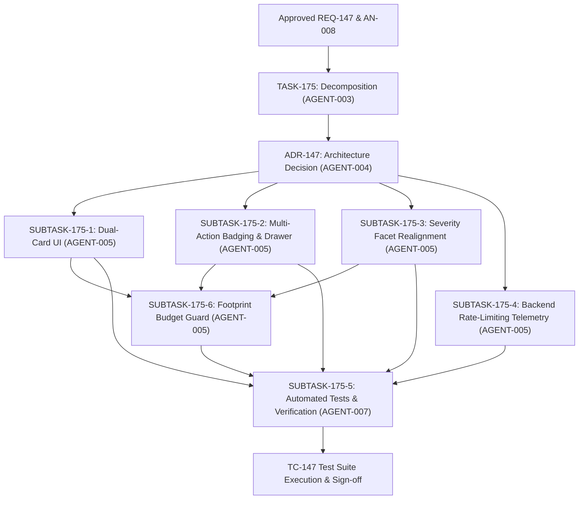

# TASK-175 - Alerts Control Center Dual-Card Separation, Multi-Action Status Badging, and Rate-Limiting Telemetry

## 1. Overview & Objective

Decompose the approved requirement specification [`REQ-147`](../requirements/REQ-147.md) and system analysis [`AN-008`](../analysis/AN-008.md) into concrete, implementation-ready engineering deliverables.

In production deployments of the Toron Edge Gateway Control Center (`#/alerts`), security and site reliability operators reported an operational defect:
> *"The current alert dashboard is showing no events other than blocked."*

Root-cause analysis in [`AN-008`](../analysis/AN-008.md) established three primary architectural causes for this behavior:
1. **Frontend Mutual Exclusion Fallback**: In [`public/js/views/alerts.js`](../../public/js/views/alerts.js), the incident list selector evaluates a ternary expression:
   ```javascript
   const incs = (model.incidents && model.incidents.length > 0) ? model.incidents : (model.alerts || []);
   ```
   Whenever `model.incidents` contains at least one record (which is standard due to internet background scanners and the 50-event circular audit buffer), `model.alerts` is discarded. As a consequence, critical operational health alerts (unhealthy upstream pool instances, route 5xx error rate spikes exceeding 2%, and failing ACME SSL certificate renewals) are completely suppressed from the alerts view, despite triggering the top KPI strip, the navigation badge (`1`), and the Overview status banner.
2. **Binary Action Badging Oversimplification**: Both [`public/js/views/alerts.js`](../../public/js/views/alerts.js) and the forensic investigation drawer ([`public/js/components/drawer.js`](../../public/js/components/drawer.js)) evaluate defense actions using binary logic (`isBlocked ? 'Blocked' : 'Logged'`). Automated IP quarantine events (`Action: "banned"`) emitted by the auto-ban subsystem are forced into the `Logged` label, misrepresenting active firewall quarantines.
3. **Absence of Rate-Limiting Telemetry & Warning Filter Emptiness**: Volumetric traffic throttling rejections (HTTP 429 Too Many Requests) served by route-level token bucket rate limiters ([`pkg/router/rate_limiter.go`](../../pkg/router/rate_limiter.go)) do not dispatch audit events to `AuditLogger`. Furthermore, under default enforce mode (`AnomalyThreshold: 5`), all built-in WAF rules trigger blocks (`Action: "blocked"`), leaving zero detection-only anomalies. As a result, selecting the "Warning" severity facet chip yields an empty state message (*"Zero security incidents match active filters"*), falsely signaling that warning-level telemetry and anomaly monitoring are non-functional.

This task decomposes the solution into discrete, bounded engineering deliverables: decoupling operational alerts from security incidents via a dual-card presentation, implementing a multi-action badging taxonomy across feeds and drawers, realigning severity facet filtering, and integrating backend rate-limiting telemetry.

---

## 2. Traceability

- **Requirement**: [`REQ-147`](../requirements/REQ-147.md) (FR-147-1 through FR-147-5, NFR-147-1 through NFR-147-5, AC-147-01 through AC-147-09)
- **Analysis**: [`AN-008`](../analysis/AN-008.md) (Sections 1–10)
- **Architecture**: [`ADR-147`](../architecture/ADR-147.md) (Authored by AGENT-004), [`ADR-146`](../architecture/ADR-146.md), [`ADR-138`](../architecture/ADR-138.md)
- **Core Principles**: [`PRD.md`](../../PRD.md) (Hardened security, zero-allocation reverse proxy, developer ergonomics, ultra-lightweight)
- **Related Requirements & Tasks**:
  - [`REQ-146`](../requirements/REQ-146.md) / [`TASK-174`](./TASK-174.md): Alerts and Threat Defense Control Center Redesign
  - [`REQ-137`](../requirements/REQ-137.md): Full timestamp calendar formatting (`YYYY-MM-DD HH:MM:SS`)
  - [`REQ-138`](../requirements/REQ-138.md): Multi-level deterministic column sorting and IP tie-breaking
  - [`REQ-141`](../requirements/REQ-141.md): Native ES module modular architecture with zero external runtime dependencies
- **Verification Target**: [`docs/testCases/TC-147.md`](../testCases/TC-147.md), [`tests/dashboard_telemetry_test.js`](../../tests/dashboard_telemetry_test.js), Go test suite (`pkg/router/rate_limiter_test.go`)

---

## 3. Work Package Breakdown

```
+-------------------------------------------------------------------------------------------------+
|                                            TASK-175                                             |
+-------------------------------------------------------------------------------------------------+
         |                                |                                   |
         v                                v                                   v
+------------------+             +------------------+                +------------------+
|   SUBTASK-175-1  |             |   SUBTASK-175-2  |                |   SUBTASK-175-3  |
| Frontend         |             | Multi-Action     |                | Real-Time        |
| Dual-Card View   |             | Badging & Drawer |                | Severity Facet   |
| (Operational     |             | Alignment        |                | Realignment      |
|  Alerts Card)    |             |                  |                |                  |
+------------------+             +------------------+                +------------------+
         |                                |                                   |
         +--------------------------------+-----------------------------------+
                                          |
                                          v
         +--------------------------------+-----------------------------------+
         |                                |                                   |
         v                                v                                   v
+------------------+             +------------------+                +------------------+
|   SUBTASK-175-4  |             |   SUBTASK-175-5  |                |   SUBTASK-175-6  |
| Backend Rate-    |             | Automated        |                | Client JS        |
| Limiting         |             | Verification     |                | Footprint Budget |
| Telemetry        |             | Test Suite       |                | Validation &     |
| Dispatch         |             | (TC-147)         |                | Headroom Guard   |
+------------------+             +------------------+                +------------------+
```

---

### SUBTASK-175-1: Frontend Dual-Card View Structure (Operational System Alerts vs Security Incidents)

- **Target Component**: [`public/js/views/alerts.js`](../../public/js/views/alerts.js)
- **Traceability**: [`REQ-147`](../requirements/REQ-147.md) (FR-147-1, AC-147-01, AC-147-02, AC-147-07)
- **Objective**: Decouple operational system health degradations from WAF security incidents into two distinct visual cards on `#/alerts`.

#### Deliverables & Implementation Details:
1. **Card Architecture in Shell Template (`alShell()`)**:
   - Reconstruct the view layout in `alShell()` to render two stacked `<section class="card">` elements:
     - **Card 1: Operational System Alerts Card**:
       - Positioned immediately above the Security Incidents card.
       - Header: `<h2>Operational System Alerts</h2>`, subtitle `<p class="sub">Active upstream degradations, route error rate spikes, and certificate renewal failures</p>`.
       - Body container: `<div id="alOpsCard"><ul class="rows al" id="alOpsList" style="margin-top:0"></ul></div>`.
     - **Card 2: Security Incidents & Threat Defense Feed**:
       - Header: `<h2>Security Incidents &amp; Threat Defense Feed</h2>`, subtitle `<p class="sub">Security events, anomalies, and active defense actions requiring attention</p>`.
       - Toolbar: Preserves incident search input (`#alIncSearch`) and severity filter chips (`#alSevChips`).
       - Feed container: `<div id="alActive"><ul class="rows al" id="alIncList" style="margin-top:0"></ul></div>`.
       - Pagination: Preserves client-side pagination bar (`#alIncPagination`).
2. **Elimination of Mutual Exclusion Fallback (`alUpdate()`)**:
   - Eliminate line 192: `const incs = (model.incidents && model.incidents.length > 0) ? model.incidents : (model.alerts || []);`.
   - Dedicated feed binding:
     - Security Incidents feed (`#alIncList`) exclusively consumes `model.incidents || []`.
     - Operational System Alerts list (`#alOpsList`) exclusively consumes `model.alerts || []`.
3. **Operational Alert Row Item Rendering**:
   - For each active operational alert in `model.alerts`:
     - Severity indicator icon: `<span class="t-err">${ICON('i-x')}</span>` when `alert.sev === 'critical'`, `<span class="t-warn">${ICON('i-alert')}</span>` when `alert.sev === 'warning'`.
     - Title: Bold title text (e.g. `Upstream Degradation: api-pool`, `High 5xx Error Rate: /v1/auth`, `Certificate Renewal Failed: toron.io`).
     - Detail description: Informative metric text (e.g. `2/3 instances unreachable`, `5xx rate 4.2% > 2.0% SLO threshold`).
     - Calendar timestamp: Full calendar formatting via `dtFmt(alert.timestamp)` adhering to [`REQ-137`](../requirements/REQ-137.md).
     - Actionable resource jump target: Render clickable button or row link with `data-go="${esc(alert.go || 'overview')}"` (e.g. `data-go="upstreams"`, `data-go="routes"`, or `data-go="certs"`), leveraging the native router event delegation in [`public/js/app.js`](../../public/js/app.js).
4. **Zero-State Operational Health Banner**:
   - When `(model.alerts || []).length === 0`:
     - Render a compact, single-line positive health summary inside `#alOpsList`:
       ```html
       <li class="empty" style="text-align:center;padding:16px 12px;color:var(--ink-2);display:flex;align-items:center;justify-content:center;gap:8px">
         <span class="t-ok">${ICON('i-check')}</span>
         <span>All upstream services, routes, and certificates operating normally.</span>
       </li>
       ```
5. **Feed Independence Guarantee**:
   - Populated security incidents shall NEVER hide, replace, or alter the Operational System Alerts card.
   - Searching or filtering security incidents shall NOT alter the Operational System Alerts card.

---

### SUBTASK-175-2: Multi-Action Status Badging & Forensic Drawer Alignment

- **Target Components**: [`public/js/views/alerts.js`](../../public/js/views/alerts.js), [`public/js/components/drawer.js`](../../public/js/components/drawer.js)
- **Traceability**: [`REQ-147`](../requirements/REQ-147.md) (FR-147-2, AC-147-03, AC-147-04)
- **Objective**: Discontinue binary `Blocked` vs `Logged` badging and implement a deterministic 4-action defensive status taxonomy across feeds and the forensic drawer.

#### Deliverables & Implementation Details:
1. **Multi-Action Status Badging Taxonomy**:
   - Implement concise action mapping logic in [`public/js/views/alerts.js`](../../public/js/views/alerts.js):
     - **`Blocked`** (`action === 'blocked'`): Request dropped by WAF rule, IP ACL, or protocol check.
       - Badge: `<span class="st s5">Blocked</span>` (red tone).
       - Tone icon: `<span class="t-err">${ICON('i-x')}</span>`.
     - **`Banned`** (`action === 'banned'`): Offending IP quarantined in firewall by auto-ban reactor.
       - Badge: `<span class="st s5">Banned</span>` (red/purple tone).
       - Tone icon: `<span class="t-err">${ICON('i-x')}</span>`.
     - **`Throttled`** (`action === 'throttled'`): Request rejected with HTTP 429 by route token bucket rate limiter.
       - Badge: `<span class="st s4">Throttled</span>` (amber/orange tone).
       - Tone icon: `<span class="t-warn">${ICON('i-alert')}</span>`.
     - **`Logged`** (`action === 'logged'` or default): Request recorded in audit mode or sub-threshold anomaly.
       - Badge: `<span class="st s4">Logged</span>` (amber/blue tone).
       - Tone icon: `<span class="t-warn">${ICON('i-alert')}</span>`.
2. **Forensic Drawer Alignment ([`public/js/components/drawer.js`](../../public/js/components/drawer.js))**:
   - Update `openDrawer('incident', id)`:
     - Replace lines 35–37 binary check:
       ```javascript
       const isErr = inc.action === 'blocked' || inc.action === 'banned';
       const actionTone = isErr ? 'err' : 'warn';
       const actionClass = isErr ? 's5' : 's4';
       const actionLabel = inc.action === 'banned' ? 'Banned' : (inc.action === 'throttled' ? 'Throttled' : (inc.action === 'blocked' ? 'Blocked' : 'Logged'));
       ```
     - Subtitle action pill (`#dwSub`): Render `${pill(actionTone, actionLabel)}`.
     - Key metrics summary (`#dwStats`): Action metric item displays `esc(actionLabel)`.
     - Forensic Key-Value table (`dl.kv`): "Action Taken" renders `<span class="st ${actionClass}">${esc(actionLabel)}</span>`.
     - Title fallback: If `inc.category` is empty, default to `Rate Limit Ingress` (when `action === 'throttled'`) or `WAF Security Incident`.
     - Quick Action "Ban Client IP": Pre-fill reason with `Rate Limit Throttling` or rule metadata when triggered from drawer.

---

### SUBTASK-175-3: Real-Time Severity Facet Filtering Realignment

- **Target Component**: [`public/js/views/alerts.js`](../../public/js/views/alerts.js)
- **Traceability**: [`REQ-147`](../requirements/REQ-147.md) (FR-147-3, AC-147-05)
- **Objective**: Realign severity facet filtering to deterministically partition multi-action events between `Critical` and `Warning` tiers without leaving the Warning filter empty.

#### Deliverables & Implementation Details:
1. **Faceted Severity Predicate Logic**:
   - In `filteredIncidents` filtering loop within `alUpdate()`:
     - **`state.alSev === 'all'`**: Returns `true` for all incident records.
     - **`state.alSev === 'critical'`**:
       ```javascript
       const isCrit = inc.action === 'blocked' ||
                      inc.action === 'banned' ||
                      (inc.anomaly_score != null && Number(inc.anomaly_score) >= 10) ||
                      inc.sev === 'critical';
       if (!isCrit) return false;
       ```
     - **`state.alSev === 'warning'`**:
       ```javascript
       const isWarn = inc.action === 'throttled' ||
                      inc.action === 'logged' ||
                      (inc.action !== 'blocked' && inc.action !== 'banned') ||
                      (inc.anomaly_score != null && Number(inc.anomaly_score) < 10) ||
                      inc.sev === 'warning';
       if (!isWarn) return false;
       ```
2. **Interactive Event Handling & Pagination Reset**:
   - Clicking any severity filter button (`.al-sev-chip`) updates `state.alSev`, resets `state.alIncPage = 1`, and triggers re-render.
   - Slicing and summary text properly reflect filtered subset (e.g. `Showing 1–3 of 3`).
3. **Empty State Fidelity**:
   - When 0 items match active filters in the incidents card:
     ```html
     <li class="empty" style="text-align:center;padding:24px 12px;color:var(--ink-2)">
       ${ICON('i-check')}<span style="margin-left:6px">Zero security incidents match active filters.</span>
     </li>
     ```

---

### SUBTASK-175-4: Backend Rate-Limiting Telemetry Dispatch Integration

- **Target Components**: [`pkg/router/rate_limiter.go`](../../pkg/router/rate_limiter.go), [`pkg/waf/audit.go`](../../pkg/waf/audit.go), [`pkg/router/router.go`](../../pkg/router/router.go)
- **Traceability**: [`REQ-147`](../requirements/REQ-147.md) (FR-147-4, NFR-147-4, AC-147-06)
- **Objective**: Integrate route-level rate limiting with the security audit logging subsystem so volumetric HTTP 429 drops emit structured security incidents.

#### Deliverables & Implementation Details:
1. **RateLimiter Audit Logger Binding**:
   - Extend `RateLimiterOptions` in [`pkg/router/rate_limiter.go`](../../pkg/router/rate_limiter.go):
     ```go
     type RateLimiterOptions struct {
         MaxBuckets     int
         IdleTTL        time.Duration
         TrustedProxies []string
         AuditLogger    *waf.AuditLogger
     }
     ```
   - Store `auditLogger *waf.AuditLogger` on `RateLimiter` struct.
   - Update `NewRateLimiter` and `NewRateLimitMiddleware` to propagate `opts[0].AuditLogger`.
2. **SecurityEvent Construction & Dispatch on HTTP 429**:
   - In `NewRateLimitMiddleware` rejection block:
     ```go
     if !allowed {
         retrySecs := int(math.Ceil(retryAfter.Seconds()))
         if retrySecs < 1 {
             retrySecs = 1
         }
         if limiter.auditLogger != nil {
             clientIP := clientKey
             if strings.HasPrefix(clientIP, "ip:") {
                 clientIP = strings.TrimPrefix(clientIP, "ip:")
             }
             limiter.auditLogger.LogEvent(waf.SecurityEvent{
                 Event:          "rate_limit_drop",
                 Action:         "throttled",
                 Category:       "rate_limit",
                 ClientIP:       clientIP,
                 Method:         req.Method,
                 Path:           req.Path,
                 AnomalyScore:   0,
                 RuleID:         "rate_limit",
                 PayloadSnippet: fmt.Sprintf("Rate limit exceeded: retry after %d seconds", retrySecs),
             })
         }
         // Set 429 headers and write response...
     }
     ```
3. **Route Construction Wiring in [`pkg/router/router.go`](../../pkg/router/router.go)**:
   - When building route rate limiter middleware in `router.go`, wire the route's configured security audit logger (or gateway default audit logger) into `RateLimiterOptions.AuditLogger`.
4. **Safety & Zero-Allocation Performance Invariants**:
   - If `AuditLogger` is nil or disabled (`cfg.Enabled == false`), bypass logging with zero panics and zero heap allocations.
   - Non-blocking circular buffer write ($O(1)$) into the 50-event buffer.
5. **Backend Go Unit Verification**:
   - In [`pkg/router/rate_limiter_test.go`](../../pkg/router/rate_limiter_test.go), add tests verifying:
     - 429 response dispatches `SecurityEvent` to `waf.AuditLogger`.
     - Event contains `Action: "throttled"`, `Event: "rate_limit_drop"`, `Category: "rate_limit"`, and correct client IP.
     - Nil logger handling causes no errors.

---

### SUBTASK-175-5: Automated Verification Test Suite Updates

- **Target Components**: [`tests/dashboard_telemetry_test.js`](../../tests/dashboard_telemetry_test.js), [`docs/testCases/TC-147.md`](../testCases/TC-147.md)
- **Traceability**: [`REQ-147`](../requirements/REQ-147.md) (NFR-147-5, AC-147-01 through AC-147-07, AC-147-09)
- **Objective**: Author automated regression and functional test cases verifying the dual-card view, multi-action badging, severity facet filtering, and relative links.

#### Deliverables & Implementation Details:
1. **TC-147 Verification Suite in `tests/dashboard_telemetry_test.js`**:
   - `TC-147-01 (Dual-Card Layout & Permanent Operational Alert Visibility)`:
     - Supply mock model with 2 operational alerts in `model.alerts` and 10 security incidents in `model.incidents`.
     - Execute `alUpdate(model)`.
     - Assert `#alOpsList` contains exactly 2 operational alert rows.
     - Assert `#alIncList` contains paginated security incident rows.
     - Verify operational alerts are NOT suppressed or replaced by security incidents.
   - `TC-147-02 (Operational System Alerts Zero-Alert Health Summary)`:
     - Supply mock model with 0 operational alerts (`model.alerts = []`) and 5 security incidents.
     - Assert `#alOpsList` renders the positive checkmark icon and text *"All upstream services, routes, and certificates operating normally."*
   - `TC-147-03 (Multi-Action Status Badging in Incidents Feed)`:
     - Supply 4 incidents with actions `blocked`, `banned`, `throttled`, and `logged`.
     - Assert `blocked` renders badge `Blocked` with class `s5` and icon `i-x`.
     - Assert `banned` renders badge `Banned` with class `s5` and icon `i-x`.
     - Assert `throttled` renders badge `Throttled` with class `s4` and icon `i-alert`.
     - Assert `logged` renders badge `Logged` with class `s4` and icon `i-alert`.
   - `TC-147-04 (Forensic Incident Drawer Multi-Action Telemetry)`:
     - Invoke `openDrawer('incident', 'throttled-id')`.
     - Assert `#dwSub` renders `pill('warn', 'Throttled')`.
     - Assert `#dwStats` renders Action metric as `Throttled`.
     - Assert forensic KV table renders `<span class="st s4">Throttled</span>`.
     - Invoke `openDrawer('incident', 'banned-id')`.
     - Assert `#dwSub` renders `pill('err', 'Banned')` and KV table renders `<span class="st s5">Banned</span>`.
   - `TC-147-05 (Real-Time Severity Facet Filtering)`:
     - Test feed with mixed `blocked`, `banned`, `throttled`, and `logged` incidents.
     - Set `state.alSev = 'critical'`; assert only `blocked` and `banned` items render.
     - Set `state.alSev = 'warning'`; assert only `throttled` and `logged` items render.
     - Set `state.alSev = 'all'`; assert all items render.
   - `TC-147-06 (Operational Alert Direct Resource Navigation Links)`:
     - Assert operational alert rows or buttons have valid `data-go` targets (`upstreams`, `routes`, `certs`).
   - `TC-147-07 (Strictly Relative Links Invariant)`:
     - Scan `docs/requirements/REQ-147.md`, `docs/tasks/TASK-175.md`, `docs/analysis/AN-008.md`, and `docs/architecture/ADR-147.md` for absolute links.
2. **Preserve 100% Pass Rate on Existing Tests**:
   - Ensure `TC-146-01` through `TC-146-10` pass without regression.

---

### SUBTASK-175-6: Client JavaScript Footprint Budget Validation & Headroom Optimization

- **Target Component**: [`public/js/`](../../public/js/) directory (primarily [`public/js/views/alerts.js`](../../public/js/views/alerts.js))
- **Traceability**: [`REQ-147`](../requirements/REQ-147.md) (NFR-147-1, AC-147-08)
- **Objective**: Guarantee that all frontend changes across `public/js/` strictly remain within the $120.0\text{ KB}$ ($122,880\text{ bytes}$) hard footprint ceiling.

#### Deliverables & Implementation Details:
1. **Headroom Management & Refactoring**:
   - Analysis in [`AN-008`](../analysis/AN-008.md) identified that total client JS currently measures $119.7\text{ KB}$ ($122,544\text{ bytes}$), leaving approximately $336\text{ bytes}$ of uncompressed headroom before optimization.
   - Implementation must apply compact, zero-overhead patterns:
     - Reuse existing helper functions (`esc`, `dtFmt`, `ICON`, `pill`) from `public/js/utils.js` and `public/js/components/icons.js`.
     - Factor shared multi-action badge resolution into a compact ternary or 3-line lookup table.
     - Refactor redundant template strings or boilerplate in `alerts.js` to reclaim $> 500\text{ bytes}$ of headroom buffer.
2. **Automated Budget Invariant Enforcement**:
   - Execute file size audit in `tests/dashboard_telemetry_test.js`:
     ```javascript
     assert.ok(totalBytes <= 120 * 1024, `Total JS size (${totalBytes} bytes) must be <= 120 KB budget`);
     ```
   - Target post-implementation footprint: $\le 119.5\text{ KB}$ ($< 122,368\text{ bytes}$).

---

## 4. Acceptance Criteria

- [ ] **AC-175-1 (Dual-Card UI Structure & Operational Alert Non-Suppression)**: Navigating to `#/alerts` renders two distinct cards: an Operational System Alerts card positioned immediately above the Security Incidents card. Populated security incidents in `model.incidents` never suppress, replace, or hide operational alerts in `model.alerts` ([`REQ-147`](../requirements/REQ-147.md) AC-147-01).
- [ ] **AC-175-2 (Operational Alerts Zero-Alert Health Summary)**: When `model.alerts` contains 0 records, the Operational System Alerts card renders a compact positive status indicator (`ICON('i-check')` in `var(--ok)`) with text *"All upstream services, routes, and certificates operating normally"*, while security incidents render below ([`REQ-147`](../requirements/REQ-147.md) AC-147-02).
- [ ] **AC-175-3 (Incidents Feed Multi-Action Status Badging)**: Security incidents feed correctly renders 4 distinct actions: `Blocked` (`st s5`, `t-err`, `i-x`), `Banned` (`st s5`, `t-err`, `i-x`), `Throttled` (`st s4`, `t-warn`, `i-alert`), and `Logged` (`st s4`, `t-warn`, `i-alert`). Auto-ban events are not mislabeled as `Logged`, and throttled events are not mislabeled as `Blocked` ([`REQ-147`](../requirements/REQ-147.md) AC-147-03).
- [ ] **AC-175-4 (Forensic Drawer Multi-Action Telemetry)**: Opening `#drawer` for an incident with `action: "throttled"` displays header pill `Throttled` (`warn`), `#dwStats` action as `Throttled`, and KV table Action Taken as `<span class="st s4">Throttled</span>`. For `action: "banned"`, displays `Banned` with error tone (`err`, `s5`) ([`REQ-147`](../requirements/REQ-147.md) AC-147-04).
- [ ] **AC-175-5 (Real-Time Severity Facet Partitioning)**: Clicking `Critical` displays events with `action === 'blocked'` or `action === 'banned'` (or score $\ge 10$); clicking `Warning` displays events with `action === 'throttled'` or `action === 'logged'` (or non-blocked/banned events with score $< 10$). Pagination resets to Page 1 on facet change ([`REQ-147`](../requirements/REQ-147.md) AC-147-05).
- [ ] **AC-175-6 (Backend Rate-Limiting Telemetry Dispatch)**: On route token bucket exhaustion, HTTP 429 response triggers `SecurityEvent` dispatch to `AuditLogger` with `Event: "rate_limit_drop"`, `Action: "throttled"`, `Category: "rate_limit"`, `RuleID: "rate_limit"`, and `AnomalyScore: 0`. Appears in `GET /internal/api/security/incidents` ([`REQ-147`](../requirements/REQ-147.md) AC-147-06).
- [ ] **AC-175-7 (Operational Alert Direct Resource Navigation)**: Clicking an operational alert row or its action link triggers seamless navigation to the associated view (`#/upstreams`, `#/routes`, or `#/certs`) via `data-go` routing ([`REQ-147`](../requirements/REQ-147.md) AC-147-07).
- [ ] **AC-175-8 (Client JavaScript Footprint Budget Invariant)**: Total combined uncompressed size of all `.js` files in `public/js/` does NOT exceed 122,880 bytes (120.0 KB), and `TC-146-09` / `TC-147-08` pass cleanly ([`REQ-147`](../requirements/REQ-147.md) AC-147-08).
- [ ] **AC-175-9 (Strictly Relative Links Invariant)**: All documentation and codebase Markdown links strictly use relative links. Zero absolute filesystem paths or machine URIs exist ([`REQ-147`](../requirements/REQ-147.md) AC-147-09).
- [ ] **AC-175-10 (Backward Compatibility & Regression Invariant)**: All existing automated verification test cases (`TC-146-01` through `TC-146-10`) continue to pass without regression ([`REQ-147`](../requirements/REQ-147.md) NFR-147-5).

---

## 5. Scope

### Include
- Dual-card layout restructuring in [`public/js/views/alerts.js`](../../public/js/views/alerts.js) (Operational System Alerts card + Security Incidents feed).
- Elimination of ternary mutual exclusion fallback (`model.incidents.length > 0 ? model.incidents : model.alerts`).
- Multi-action status badging taxonomy (`Blocked`, `Banned`, `Throttled`, `Logged`) in [`public/js/views/alerts.js`](../../public/js/views/alerts.js) and [`public/js/components/drawer.js`](../../public/js/components/drawer.js).
- Severity facet filter realignment in [`public/js/views/alerts.js`](../../public/js/views/alerts.js) to partition multi-action events deterministically.
- Integration of `*waf.AuditLogger` into `RateLimiter` and `NewRateLimitMiddleware` in [`pkg/router/rate_limiter.go`](../../pkg/router/rate_limiter.go) for HTTP 429 telemetry emission.
- Wiring of audit logger into route rate limiter middleware in [`pkg/router/router.go`](../../pkg/router/router.go).
- Automated test suite extension in [`tests/dashboard_telemetry_test.js`](../../tests/dashboard_telemetry_test.js) and Go tests in [`pkg/router/rate_limiter_test.go`](../../pkg/router/rate_limiter_test.go).
- Code footprint optimization in `public/js/` to maintain the $\le 120.0\text{ KB}$ ceiling.

### Exclude
- Authoring Architecture Decision Record `ADR-147` (assigned to Software Architect `AGENT-004`).
- Modification of core WAF rule regular expressions or rule IDs in `pkg/waf/rules.go`.
- Addition of third-party npm packages, client frameworks, or external build tools.
- Alteration of REST API response JSON schemas for `/internal/api/security/incidents` or `/internal/api/security/banned-ips`.

---

## 6. Dependencies & Sequencing



1. **Pre-requisite**: Approved [`REQ-147`](../requirements/REQ-147.md) (Status: approved).
2. **Architecture Prerequisite**: AGENT-004 (Software Architect) authors [`ADR-147`](../architecture/ADR-147.md) establishing:
   - DOM contract and element IDs for the dual-card separation.
   - Architectural coupling pattern for router rate limiter audit telemetry dispatch.
3. **Frontend Implementation**: AGENT-005 (Developer) implements SUBTASK-175-1, SUBTASK-175-2, SUBTASK-175-3, and SUBTASK-175-6.
4. **Backend Implementation**: AGENT-005 (Developer) implements SUBTASK-175-4.
5. **Quality Assurance & Test Suite**: AGENT-007 (Test Engineer) implements SUBTASK-175-5 and authors [`docs/testCases/TC-147.md`](../testCases/TC-147.md).

---

## 7. Constraints & Invariants

1. **Client JS Footprint Budget**: Total size of all `.js` files in `public/js/` MUST NOT exceed 122,880 bytes (120.0 KB). Implementation must refactor or compress template strings to preserve headroom.
2. **Zero External Dependencies**: Vanilla ES2022+ modules and standard CSS3 only. Zero npm dependencies, bundlers, or CDNs.
3. **Strictly Relative Links**: All Markdown references must strictly use relative links (`../requirements/REQ-147.md`, `../../public/js/views/alerts.js`). Absolute filesystem paths or machine URIs are strictly prohibited.
4. **Non-Blocking Telemetry Dispatch**: Rate-limiter telemetry dispatch must be $O(1)$ and never block request pipeline execution or panic on nil pointer.
5. **Deterministic Collation & Full Datetime**: Operational alerts and throttled incidents must preserve `YYYY-MM-DD HH:MM:SS` calendar formatting per [`REQ-137`](../requirements/REQ-137.md) and deterministic secondary tie-breaking per [`REQ-138`](../requirements/REQ-138.md).

---

## 8. Open Questions & Assumptions

1. **Rate-Limiter Telemetry Buffer Allocation**:
   - *Question*: Under extreme volumetric denial-of-service traffic exceeding rate limits thousands of times per second, should the rate limiter log every 429 drop into the 50-event circular buffer?
   - *Working Assumption*: The in-memory circular buffer drops oldest events cleanly ($O(1)$ array overwrite), avoiding memory leaks. For high-volume deployments, logger sampling (e.g. max 5 events/sec per client IP) can be evaluated in `ADR-147`.
2. **Operational Alerts Card Collapsibility**:
   - *Question*: Should the Operational System Alerts card collapse to zero height when healthy or remain a compact single-line green banner?
   - *Working Assumption*: A compact single-line green banner (`✓ All upstream services, routes, and certificates operating normally`) provides positive confirmation of operational health without consuming excessive vertical screen space.
