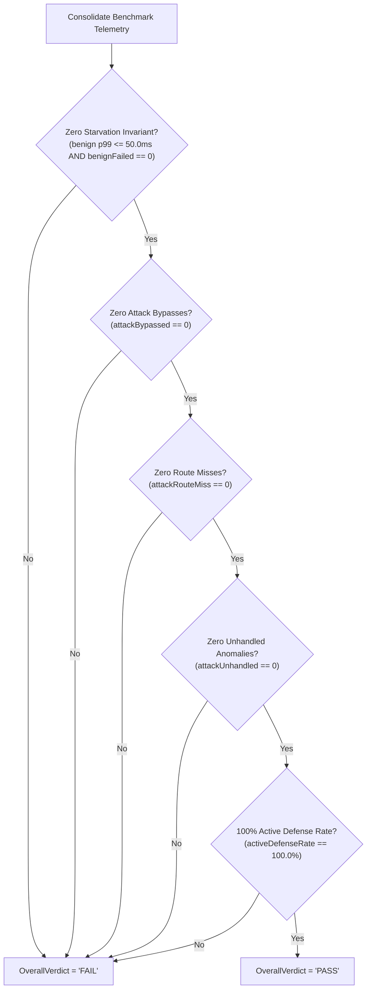

# TC-117 - Test Specification for Disaggregated Adversarial Status Classification and Route-Miss Separation in Benchmark Load Generator (HARN-01)

## 1. Test Suite Objectives & Problem Statement

### 1.1 Academic Peer Review Context & Critique (HARN-01 / REV-03)
In academic peer reviews of Paper 1 and Paper 2 (formally recorded in `AER-001.md`, `AER-002.md`, and synthesized under Directive `REV-03` / Task `HARN-01` of `ReviewTaskSummary.md`), reviewers raised severe methodological objections against the adversarial stress evaluation reported in Table 6.

Specifically, Table 6 in the submitted manuscripts claimed a **100.0% active defense enforcement rate** across all eight adversarial protocol vectors (`ADV-01` through `ADV-08`) under high-concurrency saturation ($5{,}000+\text{ RPS}$ with 10% adversarial injection ratio, benchmarked under BMK-04 as specified in [`REQ-114`](file:///Users/sneha/Developer/toron-research/toron/docs/requirements/REQ-114.md) and [`ADR-114`](file:///Users/sneha/Developer/toron-research/toron/docs/architecture/ADR-114.md)). However, deep telemetry extraction of raw benchmark artifacts ([`benchmarks/results/saturation_stress_report.json`](file:///Users/sneha/Developer/toron-research/toron/benchmarks/results/saturation_stress_report.json)) revealed a fatal circular scoring anomaly:

```json
"adversarial_stream": {
    "total_requests": 2431,
    "success_requests": 2431,
    "failed_requests": 0,
    "status_codes": {
        "400": 1819,
        "404": 349,
        "431": 263
    }
}
```

Cross-referencing the status code breakdown against vector transmission logs demonstrated:
1. **Vector `ADV-06` (Path Traversal Directory Escape, `GET /../../canary_traversal.txt`)**: Exactly **349 probes** were transmitted. Every single one of these 349 probes returned HTTP **`404 Not Found`**, rather than an active security rejection (**`400 Bad Request`** or **`403 Forbidden`**).
2. **Vector `ADV-07` (Oversized Request Header Block, exceeding 8 KB)**: Exactly **263 probes** were transmitted. Every single one returned HTTP **`431 Request Header Fields Too Large`**.
3. **Circular Scoring Anomaly**: In [`benchmarks/wrk2/loadgen.go`](file:///Users/sneha/Developer/toron-research/toron/benchmarks/wrk2/loadgen.go#L382-L386), a circular catch-all `else` branch routed all status codes other than `200 OK` into `attackRejected` and `stats.rejected`. Consequently, both the 349 passive route misses (`404`) and 263 oversized header blocks (`431`) were indiscriminately scored as successful active defenses, falsely inflating the reported defense score to 100.0% and concealing the router path canonicalization defect addressed in [`REQ-116`](file:///Users/sneha/Developer/toron-research/toron/docs/requirements/REQ-116.md) and [`ADR-116`](file:///Users/sneha/Developer/toron-research/toron/docs/architecture/ADR-116.md).

Reviewers correctly identified this flaw as scientifically invalid:
> *"A 404 response simply denotes that the request did not match a registered URI handler. If an adversarial probe penetrates routing filters and reaches a passive 404 handler, scoring this as an active security defense masks routing vulnerabilities and inflates defense metrics. The benchmark harness must explicitly decouple active defensive rejections from passive route misses."* (`AER-002`, lines 312–318)

### 1.2 Purpose & Scope of This Test Specification
This test specification establishes an uncompromised, automated verification suite for Toron's benchmark load generator ([`benchmarks/wrk2/loadgen.go`](file:///Users/sneha/Developer/toron-research/toron/benchmarks/wrk2/loadgen.go)), guaranteeing compliance with [`REQ-117`](file:///Users/sneha/Developer/toron-research/toron/docs/requirements/REQ-117.md), [`ADR-117`](file:///Users/sneha/Developer/toron-research/toron/docs/architecture/ADR-117.md), and [`TASK-140`](file:///Users/sneha/Developer/toron-research/toron/docs/tasks/TASK-140.md).

The test suite systematically verifies:
1. **Four-Tier Status Classification**: Precise, mutually exclusive dispatching into Active Defense, Route Miss, Attack Bypass, and Unhandled Anomaly.
2. **Route-Miss Penalization**: Immediate disqualification of `404 Not Found` from defense credit and enforcement of overall evaluation verdict failure.
3. **Attack Bypass Isolation**: Detection of `200 OK` on attack streams and enforcement of overall evaluation verdict failure.
4. **Unhandled Protocol Anomaly Detection**: Classification of `500`, `502`, and unexpected codes as stability anomalies rather than defenses.
5. **Static Code AST Oracle**: Programmatic inspection ensuring zero unclassified catch-all `else` clauses exist in `loadgen.go`.
6. **Publication-Grade Table 6 Formatting**: Generation of Markdown tables with disaggregated columns matching Paper 1 and Paper 2 Table 6.
7. **Cross-Format Telemetry Parity**: Bit-exact consistency across memory atomic counters, JSON artifacts, and CSV exports.
8. **Race-Free High-Concurrency Execution**: Sub-5ns hot-path overhead and zero race warnings under `go test -race`.

---

## 2. Architectural Four-Tier Status Classification & Invariant Foundations

### 2.1 Four-Tier Architectural Taxonomy
The benchmark load generator classifies every ingress status code into one of four mutually exclusive architectural tiers:

```
┌────────────────────────────────────────────────────────────────────────────────────────┐
│                        Ingress Adversarial Response Status Code                        │
└───────────────────────────────────────────┬────────────────────────────────────────────┘
                                            │
         ┌──────────────────┬───────────────┴───────────────┬──────────────────┐
         ▼                  ▼                               ▼                  ▼
┌─────────────────┐┌─────────────────┐             ┌─────────────────┐┌─────────────────┐
│     Tier 1      ││     Tier 2      │             │     Tier 3      ││     Tier 4      │
│ Active Defense  ││   Route Miss    │             │  Attack Bypass  ││Unhandled Anomaly│
│(attackRejected) ││(attackRouteMiss)│             │ (attackBypassed)││ (attackUnhandled│
├─────────────────┤├─────────────────┤             ├─────────────────┤├─────────────────┤
│ 400 Bad Request ││  404 Not Found  │             │     200 OK      ││ 500 Int. Error  │
│  403 Forbidden  ││                 │             │   (Any 2xx/3xx) ││ 502 Bad Gateway │
│  413 Too Large  ││                 │             │                 ││ 503 Unavailable │
│  431 Hdr Large  ││                 │             │                 ││ 504 Timeout     │
│501 Not Implem.  ││                 │             │                 ││ Non-standard    │
└─────────────────┘└─────────────────┘             └─────────────────┘└─────────────────┘
```

- **Tier 1: Active Defense (`attackRejected` / `stats.rejected`)**: Gateway security mechanisms (parser invariants, framing rules, L7 WAF, prefix boundary guards) actively intercepted and rejected the probe with `400`, `403`, `413`, `431`, or `501`. Fail-fast TCP resets during header transmission are synthesized as `400`.
- **Tier 2: Route Miss (`attackRouteMiss` / `stats.routeMiss`)**: Gateway router dispatched the request to the default `404 Not Found` handler because the path was unmapped. Strictly NOT active security defense.
- **Tier 3: Attack Bypass (`attackBypassed` / `stats.bypassed`)**: Adversarial probe penetrated security filters and was processed successfully (`200 OK` or unexpected 2xx/3xx). Invariant violation.
- **Tier 4: Unhandled Anomaly (`attackUnhandled` / `stats.unhandled`)**: Gateway crashed, panicked, dropped upstream connections, or desynchronized protocol states (`500`, `502`, `503`, `504`, or unassigned codes).

### 2.2 Exhaustive Status Code Mapping & Justification Matrix

| Status Code | HTTP Status Constant | Architectural Tier | RFC / CWE Specification | Loadgen Metric Counter | Security Evaluation Semantics |
| :--- | :--- | :--- | :--- | :--- | :--- |
| **`400`** | `http.StatusBadRequest` | **Active Defense** | RFC 7230 §3 / CWE-444 | `attackRejected` | Gateway wire parser rejected malformed framing / syntax |
| **`403`** | `http.StatusForbidden` | **Active Defense** | RFC 7231 §6.5.3 / CWE-22 | `attackRejected` | Gateway WAF / router prefix guard blocked unauthorized access |
| **`413`** | `http.StatusRequestEntityTooLarge` | **Active Defense** | RFC 7231 §6.5.11 / CWE-400 | `attackRejected` | Gateway bounded memory limit enforced on request body |
| **`431`** | `http.StatusRequestHeaderFieldsTooLarge` | **Active Defense** | RFC 6585 §5 / CWE-400 | `attackRejected` | Gateway bounded header limit enforced on oversized headers (`ADV-07`) |
| **`501`** | `http.StatusNotImplemented` | **Active Defense** | RFC 7231 §6.6.2 / RFC 7230 | `attackRejected` | Unsupported HTTP transfer-coding / method rejected |
| **`404`** | `http.StatusNotFound` | **Route Miss** | RFC 7231 §6.5.4 | `attackRouteMiss` | Unmatched path reaching passive router; NOT active defense |
| **`200`** | `http.StatusOK` | **Attack Bypass** | RFC 7231 §6.3.1 | `attackBypassed` | Malicious probe bypassed security filters and executed |
| **`500`** | `http.StatusInternalServerError` | **Unhandled Anomaly** | RFC 7231 §6.6.1 | `attackUnhandled` | Server crashed, panicked, or failed internally under stress |
| **`502`** | `http.StatusBadGateway` | **Unhandled Anomaly** | RFC 7231 §6.6.3 | `attackUnhandled` | Upstream transport disconnected or crashed |
| **`Other`**| Any other status code | **Unhandled Anomaly** | N/A | `attackUnhandled` | Unexpected status or transport protocol desynchronization |

### 2.3 Mathematical Rate Formulations & Partition Invariant

Let $N_{\text{total}} = \text{attackTotal.Load}()$. The partition invariant requires:
$$N_{\text{total}} = N_{\text{rej}} + N_{\text{miss}} + N_{\text{byp}} + N_{\text{unh}}$$

Where:
- $N_{\text{rej}} = \text{attackRejected.Load}()$ (Tier 1)
- $N_{\text{miss}} = \text{attackRouteMiss.Load}()$ (Tier 2)
- $N_{\text{byp}} = \text{attackBypassed.Load}()$ (Tier 3)
- $N_{\text{unh}} = \text{attackUnhandled.Load}()$ (Tier 4)

The metric rates are defined as:
1. **Active Defense Rate**:
   $$\text{Rate}_{\text{defense}} = \begin{cases} 
   \left(\frac{N_{\text{rej}}}{N_{\text{total}}}\right) \times 100.0, & \text{if } N_{\text{total}} > 0 \\ 
   100.0, & \text{if } N_{\text{total}} = 0 
   \end{cases}$$

2. **Route Miss Rate**:
   $$\text{Rate}_{\text{routemiss}} = \begin{cases} 
   \left(\frac{N_{\text{miss}}}{N_{\text{total}}}\right) \times 100.0, & \text{if } N_{\text{total}} > 0 \\ 
   0.0, & \text{if } N_{\text{total}} = 0 
   \end{cases}$$

3. **Attack Bypass Rate**:
   $$\text{Rate}_{\text{bypass}} = \begin{cases} 
   \left(\frac{N_{\text{byp}}}{N_{\text{total}}}\right) \times 100.0, & \text{if } N_{\text{total}} > 0 \\ 
   0.0, & \text{if } N_{\text{total}} = 0 
   \end{cases}$$

4. **Invariant Enforcement Rate**:
   $$\text{Rate}_{\text{invariant}} \equiv \text{Rate}_{\text{defense}}$$
   Strictly zero credit is awarded for route misses ($N_{\text{miss}}$) or unhandled anomalies ($N_{\text{unh}}$).

### 2.4 Strict Testbed Evaluation Oracle Decision Tree
The `OverallVerdict` evaluates to `"PASS"` if and only if all five empirical invariants are simultaneously satisfied. If any condition fails, the verdict strictly evaluates to `"FAIL"`:



---

## 3. Test Environment, Testbeds & Mock Fixtures

### 3.1 Programmable Multi-Status Mock Server
To verify status code classification independently of live edge gateway implementations, unit tests employ a programmable mock HTTP server configured to return controlled status codes:

```go
type mockAdversarialServer struct {
    listener net.Listener
    addr     string
    // responseMap maps attack vector IDs or paths to specific status codes
    responseMap map[string]int
    // fallbackCode is returned when no mapping is found
    fallbackCode int
    // closeOnHeader simulates socket reset during header transmit
    closeOnHeader bool
}
```

- When `closeOnHeader` is `true`, the server immediately executes `conn.Close()` upon reading the first header line, triggering an `io.EOF` / `ECONNRESET` in `executeAttackProbe`.
- For standard HTTP testing, `net/http/httptest.NewServer` or custom TCP listener is used to return exact status codes (`400`, `403`, `413`, `431`, `501`, `404`, `200`, `500`, `502`, `999`).

### 3.2 In-Process Toron Edge Gateway Fixture
For end-to-end integration testing:
- Toron server booted in-process via `setupInProcessToronServer(t)`.
- Static directory mounted at `/internal/dashboard`.
- Routes registered: `/health` (benign endpoint), `/echo` (POST endpoint).
- WAF and Router configured to enforce active defense.

### 3.3 Static Analysis AST Tooling
For `TC-117-05`, the test harness invokes the Go standard library AST parser (`go/parser`, `go/token`, `go/ast`) directly on `benchmarks/wrk2/loadgen.go` to inspect the concrete syntax tree of the worker loop.

---

## 4. Detailed Test Case Specifications

### TC-117-01: Explicit Active Defense Status Classification
- **Subsystem**: `benchmarks/wrk2/loadgen.go` (`RunLoadGen`, worker goroutine dispatching)
- **Source Target**: [`benchmarks/wrk2/loadgen.go`](file:///Users/sneha/Developer/toron-research/toron/benchmarks/wrk2/loadgen.go#L375-L390), [`benchmarks/wrk2/loadgen_test.go`](file:///Users/sneha/Developer/toron-research/toron/benchmarks/wrk2/loadgen_test.go)
- **Objective**: Verify that every status code defined under Tier 1 Active Defense (`400 Bad Request`, `403 Forbidden`, `413 Payload Too Large`, `431 Request Header Fields Too Large`, `501 Not Implemented`), as well as fail-fast socket resets, exclusively increments `attackRejected` and `stats.rejected`, leaving `attackRouteMiss`, `attackBypassed`, and `attackUnhandled` at zero.
- **Preconditions**:
  - Programmable mock server running on localhost.
  - Mock server configured to return each Active Defense code in sequence.
- **Test Data**:
  - Test Code Matrix: `[400, 403, 413, 431, 501]`
  - Transport Socket Reset: Immediate TCP socket close during header transmission.
  - Probe count per code: 50 requests.
- **Execution Steps**:
  1. For each status code $c \in \{400, 403, 413, 431, 501\}$:
     a. Configure mock server to return status $c$ for all requests.
     b. Configure `LoadGenConfig` with `Concurrency: 5`, `Duration: 1s`, `TargetRate: 500`, `AttackRatio: 1.0`.
     c. Execute `report, err := RunLoadGen(cfg)`.
  2. For transport socket reset:
     a. Configure mock server to drop TCP connection upon header read.
     b. Execute `report, err := RunLoadGen(cfg)`.
- **Expected Results / Oracles**:
  - `err` is `nil`.
  - `report.AdversarialStream.ActiveDefenseRequests == report.AdversarialStream.TotalRequests`.
  - `report.AdversarialStream.RouteMissRequests == 0`.
  - `report.AdversarialStream.BypassedRequests == 0`.
  - `report.AdversarialStream.UnhandledRequests == 0`.
  - For each vector in `report.AttackVectors`, `Rejected == ProbesSent`, `RouteMiss == 0`, `Bypassed == 0`, `Unhandled == 0`.
  - `report.ActiveDefenseRatePct == 100.0`.
  - `report.RouteMissRatePct == 0.0`.
  - `report.InvariantEnforcementRate == 100.0`.
  - `report.OverallVerdict == "PASS"`.
- **Traceability**: `REQ-117` (FR-1, AC-2), `ADR-117` (§2.1, §2.2), `TASK-140.1`, `TASK-140.5`.

---

### TC-117-02: Route-Miss Isolation & Defense Rate Penalization
- **Subsystem**: `benchmarks/wrk2/loadgen.go` (`RunLoadGen`, `OverallVerdict`)
- **Source Target**: [`benchmarks/wrk2/loadgen.go`](file:///Users/sneha/Developer/toron-research/toron/benchmarks/wrk2/loadgen.go), [`benchmarks/wrk2/loadgen_test.go`](file:///Users/sneha/Developer/toron-research/toron/benchmarks/wrk2/loadgen_test.go)
- **Objective**: Verify that when an adversarial probe produces HTTP `404 Not Found` (reproducing the historical `ADV-06` path traversal route miss), the load generator strictly increments `attackRouteMiss` and `stats.routeMiss`, awards ZERO credit to `attackRejected`, causes `ActiveDefenseRatePct` and `InvariantEnforcementRate` to drop below 100.0%, and forces `OverallVerdict` to evaluate to `"FAIL"`.
- **Preconditions**:
  - Mock server configured to return HTTP `404 Not Found` when receiving probes for vector `ADV-06` (`/../../canary_traversal.txt`), while returning `400 Bad Request` for other vectors.
- **Test Data**:
  - Benign endpoint: `/health` (returns `200 OK`).
  - Adversarial stream: 10% injection, with `ADV-06` returning `404 Not Found`.
  - Duration: 2 seconds, Rate: 1,000 RPS, Concurrency: 10.
- **Execution Steps**:
  1. Boot mock server with `responseMap["ADV-06"] = http.StatusNotFound` and other vectors returning `http.StatusBadRequest`.
  2. Run `report, err := RunLoadGen(cfg)`.
  3. Inspect `report.AdversarialStream` and `report.AttackVectors`.
- **Expected Results / Oracles**:
  - `err` is `nil`.
  - `report.AdversarialStream.RouteMissRequests > 0`.
  - For vector `ADV-06` in `report.AttackVectors`:
    - `ProbesSent > 0`.
    - `RouteMiss == ProbesSent`.
    - `Rejected == 0`.
    - `ActiveDefenseRatePct == 0.0`.
    - `RouteMissRatePct == 100.0`.
  - `report.AdversarialStream.ActiveDefenseRequests < report.AdversarialStream.TotalRequests`.
  - `report.ActiveDefenseRatePct < 100.0`.
  - `report.RouteMissRatePct > 0.0`.
  - `report.InvariantEnforcementRate < 100.0` (mathematically equals `ActiveDefenseRatePct`).
  - `report.OverallVerdict == "FAIL"` (Strict evaluation oracle triggered by route miss).
- **Traceability**: `REQ-117` (FR-1, FR-3, AC-3), `ADR-117` (§2.1, §4.1, §4.2), `TASK-140.1`, `TASK-140.3`, `TASK-140.5`.

---

### TC-117-03: Attack Bypass Detection & Breach Classification
- **Subsystem**: `benchmarks/wrk2/loadgen.go` (`RunLoadGen`, `OverallVerdict`)
- **Source Target**: [`benchmarks/wrk2/loadgen.go`](file:///Users/sneha/Developer/toron-research/toron/benchmarks/wrk2/loadgen.go), [`benchmarks/wrk2/loadgen_test.go`](file:///Users/sneha/Developer/toron-research/toron/benchmarks/wrk2/loadgen_test.go)
- **Objective**: Verify that when an adversarial probe is accepted by the server and returns HTTP `200 OK` (simulating an attacker successfully smuggling a request or escaping authentication), `attackBypassed` and `stats.bypassed` are incremented, `attackRejected` is NOT incremented, and `OverallVerdict` immediately evaluates to `"FAIL"`.
- **Preconditions**:
  - Mock server configured to return HTTP `200 OK` for attack vector `ADV-01` (`CL.TE Conflicting Framing Smuggle`).
- **Test Data**:
  - Attack stream targeting mock server returning `200 OK`.
  - Duration: 1 second, Rate: 500 RPS, Concurrency: 5, AttackRatio: 0.20.
- **Execution Steps**:
  1. Boot mock server returning `200 OK` for all adversarial probes.
  2. Execute `report, err := RunLoadGen(cfg)`.
- **Expected Results / Oracles**:
  - `report.AdversarialStream.BypassedRequests > 0`.
  - `report.AdversarialStream.ActiveDefenseRequests == 0`.
  - `report.AdversarialStream.FailedRequests == report.AdversarialStream.TotalRequests`.
  - For each vector, `Bypassed == ProbesSent` and `Rejected == 0`.
  - `report.ActiveDefenseRatePct == 0.0`.
  - `report.OverallVerdict == "FAIL"` (Failure due to security bypass breach).
- **Traceability**: `REQ-117` (FR-1, FR-3, AC-4), `ADR-117` (§2.1, §4.2), `TASK-140.1`, `TASK-140.3`, `TASK-140.5`.

---

### TC-117-04: Unhandled Protocol Anomaly Classification
- **Subsystem**: `benchmarks/wrk2/loadgen.go` (`RunLoadGen`, `OverallVerdict`)
- **Source Target**: [`benchmarks/wrk2/loadgen.go`](file:///Users/sneha/Developer/toron-research/toron/benchmarks/wrk2/loadgen.go), [`benchmarks/wrk2/loadgen_test.go`](file:///Users/sneha/Developer/toron-research/toron/benchmarks/wrk2/loadgen_test.go)
- **Objective**: Verify that unexpected server crashes, panics, or unhandled gateway errors returning `500 Internal Server Error`, `502 Bad Gateway`, `503 Service Unavailable`, `504 Gateway Timeout`, or unassigned HTTP status codes (e.g., `999`) increment `attackUnhandled` and `stats.unhandled`, do NOT increment `attackRejected`, and force `OverallVerdict` to evaluate to `"FAIL"`.
- **Preconditions**:
  - Mock server configured to return HTTP `500 Internal Server Error` and HTTP `502 Bad Gateway` on adversarial probes.
- **Test Data**:
  - Adversarial probes returning status codes `[500, 502, 503, 504, 999]`.
- **Execution Steps**:
  1. For each error status code:
     a. Configure mock server to return that code on attack probes.
     b. Run `report, err := RunLoadGen(cfg)`.
- **Expected Results / Oracles**:
  - `report.AdversarialStream.UnhandledRequests > 0`.
  - `report.AdversarialStream.ActiveDefenseRequests == 0`.
  - `report.AdversarialStream.RouteMissRequests == 0`.
  - `report.AdversarialStream.BypassedRequests == 0`.
  - For each vector, `Unhandled == ProbesSent`.
  - `report.ActiveDefenseRatePct == 0.0`.
  - `report.OverallVerdict == "FAIL"`.
  - Confirms server stability faults are isolated and never credited as active defense.
- **Traceability**: `REQ-117` (FR-1, FR-3, AC-5), `ADR-117` (§2.1, §2.2, §4.2), `TASK-140.1`, `TASK-140.3`, `TASK-140.5`.

---

### TC-117-05: Static Code AST Oracle - Elimination of Circular Catch-All Else
- **Subsystem**: Static Analysis / Source Code Invariant Verification
- **Source Target**: [`benchmarks/wrk2/loadgen.go`](file:///Users/sneha/Developer/toron-research/toron/benchmarks/wrk2/loadgen.go)
- **Objective**: Programmatically inspect the Abstract Syntax Tree (AST) of `benchmarks/wrk2/loadgen.go` using `go/parser` to formally verify that:
  1. No circular catch-all `else` clause exists in the worker goroutine status evaluation block.
  2. Status classification is governed exclusively by an `ast.SwitchStmt` on identifier `code`.
  3. The `switch` statement contains exact case clauses for Tier 1 (`400`, `403`, `413`, `431`, `501`), Tier 2 (`404`), and Tier 3 (`200`).
  4. The `default` case routes strictly to `attackUnhandled.Add(1)` and `stats.unhandled.Add(1)`.
  5. Zero calls to `attackRejected.Add` exist in any `default` or fallback clause.
- **Preconditions**:
  - `benchmarks/wrk2/loadgen.go` source file accessible on the local filesystem.
  - Go toolchain `go/parser`, `go/token`, `go/ast` packages available.
- **Execution Steps**:
  1. Read and parse `benchmarks/wrk2/loadgen.go` into an AST using `parser.ParseFile`.
  2. Traverse the AST via `ast.Inspect` to locate `ast.SwitchStmt` nodes within function `RunLoadGen`.
  3. Filter the switch statement whose tag expression is the identifier `code`.
  4. Inspect all `ast.CaseClause` nodes within the switch body:
     - Verify Case 1 expressions match `http.StatusBadRequest`, `http.StatusForbidden`, `http.StatusRequestEntityTooLarge`, `http.StatusRequestHeaderFieldsTooLarge`, `http.StatusNotImplemented`.
     - Verify Case 1 body contains `attackRejected.Add(1)` and `stats.rejected.Add(1)`.
     - Verify Case 2 expression matches `http.StatusNotFound`.
     - Verify Case 2 body contains `attackRouteMiss.Add(1)` and `stats.routeMiss.Add(1)`.
     - Verify Case 3 expression matches `http.StatusOK`.
     - Verify Case 3 body contains `attackBypassed.Add(1)` and `stats.bypassed.Add(1)`.
     - Verify Default Case (`List == nil`) body contains `attackUnhandled.Add(1)` and `stats.unhandled.Add(1)`.
  5. Assert that no `ast.IfStmt` in `RunLoadGen` contains an `Else` branch calling `attackRejected.Add`.
- **Expected Results / Oracles**:
  - Switch statement matching specification is located.
  - All 4 tier cases are present and exhaustive.
  - No `attackRejected.Add` is reachable from default or fallback branches.
  - Test fails with descriptive diagnostic if legacy `else { attackRejected.Add(1) }` is detected.
- **Traceability**: `REQ-117` (FR-1, AC-1), `ADR-117` (§2.3, §6.2), `TASK-140.1`.

---

### TC-117-06: Publication-Grade Markdown Table 6 Disaggregation Verification
- **Subsystem**: Report Generation / Academic Publication Alignment
- **Source Target**: [`benchmarks/wrk2/loadgen.go`](file:///Users/sneha/Developer/toron-research/toron/benchmarks/wrk2/loadgen.go) (`GenerateMarkdownReport`)
- **Objective**: Verify that `GenerateMarkdownReport` generates Markdown documentation formatted to match Table 6 in Paper 1 and Paper 2, featuring distinct columns for `Active Defense (4xx/501)`, `Route Miss (404)`, `Bypass Count (200)`, and `Unhandled`.
- **Preconditions**:
  - `SaturationStressReport` constructed with synthetic data containing non-zero values across all four tiers.
  - Temporary destination file `test_report.md`.
- **Test Data**:
  - Report containing:
    - `ADV-01`: Sent 300, Rejected 300, RouteMiss 0, Bypassed 0, Unhandled 0
    - `ADV-06`: Sent 350, Rejected 300, RouteMiss 50, Bypassed 0, Unhandled 0
    - `ADV-07`: Sent 250, Rejected 250 (all 431), RouteMiss 0, Bypassed 0, Unhandled 0
- **Execution Steps**:
  1. Invoke `err := GenerateMarkdownReport(report, mdPath)`.
  2. Read generated Markdown file contents.
  3. Validate table headers in Section 4:
     `| Vector ID | Attack Name | Category | Probes Sent | Active Defense (4xx/501) | Route Miss (404) | Bypass Count (200) | Unhandled | Active Defense Rate |`
  4. Validate data row for `ADV-06`:
     Contains `| `ADV-06` | ... | 350 | 300 | 50 | 0 | 0 | **85.7%** |`.
  5. Validate Section 2 summary table format:
     Contains `| **Evaluation Verdict** | ... | %d Active Defense / %d Route Miss / %d Bypass (%.1f%% Active Defense) | ... |`.
  6. Validate Section 1 Executive Summary item 3 text:
     Contains `with **0 route misses ($404$)**, **0 unhandled anomalies**, and **`0` security bypasses**`.
- **Expected Results / Oracles**:
  - Markdown output strictly adheres to publication template.
  - All 9 columns of Table 6 are present in exact order.
  - Disaggregated values match report structures exactly.
- **Traceability**: `REQ-117` (FR-4.2, AC-6), `ADR-117` (§3.3, §5.2), `TASK-140.4`, `TASK-140.5`.

---

### TC-117-07: JSON & CSV Telemetry Field Mapping and Parity
- **Subsystem**: Serialization & Metric Pipeline Parity
- **Source Target**: [`benchmarks/wrk2/loadgen.go`](file:///Users/sneha/Developer/toron-research/toron/benchmarks/wrk2/loadgen.go) (JSON & CSV serialization), `main()`
- **Objective**: Verify that telemetry serialized into `saturation_stress_report.json` and `saturation_stress_report.csv` exhibits 100% field coverage and numerical parity with the internal memory representations.
- **Preconditions**:
  - Temporary output directory for JSON and CSV artifacts.
- **Test Data**:
  - Executed benchmark run with 2,000 requests, producing mixed status codes.
- **Execution Steps**:
  1. Execute `report, err := RunLoadGen(cfg)`.
  2. Serialize `report` to JSON and write to disk.
  3. Serialize `report` to CSV via `writer.Write` and write to disk.
  4. Unmarshal JSON back into a `SaturationStressReport` struct.
  5. Parse CSV using `encoding/csv.Reader`.
  6. Assert parity between in-memory `report`, unmarshaled JSON, and parsed CSV.
- **Expected Results / Oracles**:
  - **JSON Parity**:
    - `jsonReport.AdversarialStream.ActiveDefenseRequests == report.AdversarialStream.ActiveDefenseRequests`.
    - `jsonReport.AdversarialStream.RouteMissRequests == report.AdversarialStream.RouteMissRequests`.
    - `jsonReport.AdversarialStream.BypassedRequests == report.AdversarialStream.BypassedRequests`.
    - `jsonReport.AdversarialStream.UnhandledRequests == report.AdversarialStream.UnhandledRequests`.
    - `jsonReport.ActiveDefenseRatePct == report.ActiveDefenseRatePct`.
    - `jsonReport.RouteMissRatePct == report.RouteMissRatePct`.
    - `len(jsonReport.AttackVectors) == 8`.
  - **CSV Parity**:
    - Header contains exact columns:
      `Concurrency,TargetRPS,TotalActualRPS,BenignRPS,BenignP50_ms,BenignP99_ms,AttackRPS,AttackRejected,AttackRouteMiss,AttackBypassed,AttackUnhandled,ActiveDefenseRatePct,ZeroStarvation`.
    - CSV record values match report fields:
      - `AttackRejected == strconv.FormatInt(report.AdversarialStream.ActiveDefenseRequests, 10)`
      - `AttackRouteMiss == strconv.FormatInt(report.AdversarialStream.RouteMissRequests, 10)`
      - `AttackBypassed == strconv.FormatInt(report.AdversarialStream.BypassedRequests, 10)`
      - `AttackUnhandled == strconv.FormatInt(report.AdversarialStream.UnhandledRequests, 10)`
      - `ActiveDefenseRatePct == fmt.Sprintf("%.1f", report.ActiveDefenseRatePct)`
- **Traceability**: `REQ-117` (FR-4.1, FR-4.3, AC-7), `ADR-117` (§3.2, §3.3), `TASK-140.2, TASK-140.4`.

---

### TC-117-08: Concurrency & Race-Free Atomic Counters Verification (`go test -race`)
- **Subsystem**: Concurrency Engine & Atomic Memory Layout
- **Source Target**: [`benchmarks/wrk2/loadgen.go`](file:///Users/sneha/Developer/toron-research/toron/benchmarks/wrk2/loadgen.go), `sync/atomic.Int64`
- **Objective**: Verify that high-concurrency multi-threaded load generation across 50+ concurrent worker goroutines updating atomic counters at 5,000+ RPS operates completely free of data races, mutex contention, or counter desynchronization under ThreadSanitizer (`go test -race`).
- **Preconditions**:
  - Go toolchain compiled with race detector enabled (`-race`).
  - Multi-threaded mock server simulating concurrent benign and adversarial requests with variable response delays.
- **Test Data**:
  - Concurrency: 50 worker goroutines.
  - Duration: 2.0 seconds.
  - Target Rate: 5,000 RPS.
  - Attack Ratio: 0.25 (25% adversarial injection).
- **Execution Steps**:
  1. Execute test suite with race detector:
     `go test -v -race -count=1 -run TestLoadGen_RaceFreeConcurrency ./benchmarks/wrk2/...`
  2. Within the test, perform cross-sum invariant validation:
     $$\sum_{v \in \text{catalog}} \text{vStats}[v.\text{ID}].\text{sent.Load}() \equiv \text{attackTotal.Load}()$$
     $$\sum_{v \in \text{catalog}} \text{vStats}[v.\text{ID}].\text{rejected.Load}() \equiv \text{attackRejected.Load}()$$
     $$\sum_{v \in \text{catalog}} \text{vStats}[v.\text{ID}].\text{routeMiss.Load}() \equiv \text{attackRouteMiss.Load}()$$
     $$\sum_{v \in \text{catalog}} \text{vStats}[v.\text{ID}].\text{bypassed.Load}() \equiv \text{attackBypassed.Load}()$$
     $$\sum_{v \in \text{catalog}} \text{vStats}[v.\text{ID}].\text{unhandled.Load}() \equiv \text{attackUnhandled.Load}()$$
     $$\text{attackTotal.Load}() + \text{benignTotal.Load}() \equiv \text{totalRequestsExecuted}$$
- **Expected Results / Oracles**:
  - Zero race condition warnings emitted by ThreadSanitizer.
  - All mathematical sum invariants evaluate to true with zero discrepancy.
  - Exit code is 0.
- **Traceability**: `REQ-117` (NFR-1, AC-8), `ADR-117` (§3.1, §7.1), `TASK-140.5`.

---

## 5. Acceptance Verification Invariant & Test Oracle Matrix

| Test Case ID | Target Feature / Method | Simulated Status Code | Target Atomic Counter | Expected Counter Delta | Other Counters Delta | Active Defense Rate | Overall Verdict | Pass / Fail Oracle |
| :--- | :--- | :---: | :--- | :---: | :---: | :---: | :---: | :--- |
| **`TC-117-01a`** | Active Defense (400) | `400 Bad Request` | `attackRejected` | $+1$ | $0$ | $100.0\%$ | `PASS` | Increment exclusively in Tier 1; 0 to other tiers |
| **`TC-117-01b`** | Active Defense (403) | `403 Forbidden` | `attackRejected` | $+1$ | $0$ | $100.0\%$ | `PASS` | Increment exclusively in Tier 1; 0 to other tiers |
| **`TC-117-01c`** | Active Defense (413) | `413 Payload Too Large` | `attackRejected` | $+1$ | $0$ | $100.0\%$ | `PASS` | Increment exclusively in Tier 1; 0 to other tiers |
| **`TC-117-01d`** | Active Defense (431) | `431 Request Hdr Large` | `attackRejected` | $+1$ | $0$ | $100.0\%$ | `PASS` | Omitted code now explicitly in Tier 1 |
| **`TC-117-01e`** | Active Defense (501) | `501 Not Implemented` | `attackRejected` | $+1$ | $0$ | $100.0\%$ | `PASS` | Unsupported encoding rejected in Tier 1 |
| **`TC-117-01f`** | Socket Reset | Transport Reset (`EOF`) | `attackRejected` | $+1$ | $0$ | $100.0\%$ | `PASS` | Synthesized 400 maps to Tier 1 |
| **`TC-117-02`** | Route Miss Separation | `404 Not Found` | `attackRouteMiss` | $+1$ | $0$ | $< 100.0\%$ | `FAIL` | Excluded from defense; forces overall verdict FAIL |
| **`TC-117-03`** | Attack Bypass Detection| `200 OK` | `attackBypassed` | $+1$ | $0$ | $< 100.0\%$ | `FAIL` | Breach detection; forces overall verdict FAIL |
| **`TC-117-04a`** | Unhandled Server Error | `500 Internal Error` | `attackUnhandled` | $+1$ | $0$ | $< 100.0\%$ | `FAIL` | Crash isolated; forces overall verdict FAIL |
| **`TC-117-04b`** | Unhandled Gateway Error| `502 Bad Gateway` | `attackUnhandled` | $+1$ | $0$ | $< 100.0\%$ | `FAIL` | Transport error isolated; verdict FAIL |
| **`TC-117-05`** | AST Oracle: No `else` | AST Code Analysis | AST Inspection | N/A | N/A | N/A | `PASS` | Zero circular `else` constructs; explicit `switch` |
| **`TC-117-06`** | Markdown Table 6 | Section 4 Formatting | MD String Match | N/A | N/A | N/A | `PASS` | Exact 9-column headers matching Paper Table 6 |
| **`TC-117-07`** | JSON & CSV Parity | File Serialization | Field Comparison | N/A | N/A | N/A | `PASS` | Bit-exact equality across memory, JSON, and CSV |
| **`TC-117-08`** | Race-Free Concurrency | Concurrency = 50 | ThreadSanitizer | N/A | N/A | N/A | `PASS` | Clean under `go test -race`; sum invariants hold |

---

## 6. Non-Functional Invariants & Performance Verification

### 6.1 Lock-Free Concurrency & Race-Free Memory Model (NFR-1)
- All counter updates across concurrent worker goroutines must utilize 64-bit atomic instructions (`sync/atomic.Int64`).
- All post-run aggregations and reads must occur strictly after `wg.Wait()` synchronization barriers.
- The test harness must pass with zero race warnings under `go test -race -count=1 ./benchmarks/wrk2/...`.

### 6.2 Zero External Dependencies (NFR-2)
- All test suites, AST analyzers, mock servers, and serialization verifiers shall use Go standard library packages exclusively:
  - `sync`, `sync/atomic`
  - `net`, `net/http`, `net/http/httptest`, `net/url`
  - `encoding/json`, `encoding/csv`
  - `go/parser`, `go/token`, `go/ast`
  - `testing`, `time`, `os`, `path/filepath`, `strings`, `fmt`, `strconv`
- Zero third-party testing or assertion libraries (`testify`, `gocheck`, etc.) are permitted.

### 6.3 Sub-Nanosecond Hot-Path Overhead Budget (NFR-3)
- The status dispatching construct evaluates integer status codes directly via compiler jump tables.
- Zero memory allocations on the heap are permitted on the hot path (`0 allocs/op`).
- Hot-path dispatching overhead must remain $< 5\text{ ns}$ per probe, verified via micro-benchmarks:
  ```bash
  go test -bench=BenchmarkStatusDispatch -benchmem ./benchmarks/wrk2/...
  ```

### 6.4 CLI Backward Compatibility (NFR-4)
- Command-line flags (`-url`, `-c`, `-d`, `-rate`, `-attack-ratio`, `-m`, `-body`, `-json`, `-csv`, `-md`) must maintain 100% backward compatibility with existing orchestration scripts ([`benchmarks/wrk2/run_saturation_stress.sh`](file:///Users/sneha/Developer/toron-research/toron/benchmarks/wrk2/run_saturation_stress.sh)).

---

## 7. Traceability Matrix & Normative References

### 7.1 Traceability Matrix

| Test Case | Verifies Requirement | Verifies Architecture | Implements Task | Related Reviews & Specifications |
| :--- | :--- | :--- | :--- | :--- |
| **`TC-117-01`** | [`REQ-117`](file:///Users/sneha/Developer/toron-research/toron/docs/requirements/REQ-117.md) (FR-1, AC-2) | [`ADR-117`](file:///Users/sneha/Developer/toron-research/toron/docs/architecture/ADR-117.md) (§2.1, §2.2) | [`TASK-140.1`](file:///Users/sneha/Developer/toron-research/toron/docs/tasks/TASK-140.md), [`TASK-140.5`](file:///Users/sneha/Developer/toron-research/toron/docs/tasks/TASK-140.md) | `CR-113`, `SR-117` |
| **`TC-117-02`** | [`REQ-117`](file:///Users/sneha/Developer/toron-research/toron/docs/requirements/REQ-117.md) (FR-1, FR-3, AC-3) | [`ADR-117`](file:///Users/sneha/Developer/toron-research/toron/docs/architecture/ADR-117.md) (§2.1, §4.1, §4.2) | [`TASK-140.1`](file:///Users/sneha/Developer/toron-research/toron/docs/tasks/TASK-140.md), [`TASK-140.3`](file:///Users/sneha/Developer/toron-research/toron/docs/tasks/TASK-140.md) | `CR-113`, `SR-117`, [`REQ-116`](file:///Users/sneha/Developer/toron-research/toron/docs/requirements/REQ-116.md) |
| **`TC-117-03`** | [`REQ-117`](file:///Users/sneha/Developer/toron-research/toron/docs/requirements/REQ-117.md) (FR-1, FR-3, AC-4) | [`ADR-117`](file:///Users/sneha/Developer/toron-research/toron/docs/architecture/ADR-117.md) (§2.1, §4.2) | [`TASK-140.1`](file:///Users/sneha/Developer/toron-research/toron/docs/tasks/TASK-140.md), [`TASK-140.3`](file:///Users/sneha/Developer/toron-research/toron/docs/tasks/TASK-140.md) | `CR-113`, `SR-117` |
| **`TC-117-04`** | [`REQ-117`](file:///Users/sneha/Developer/toron-research/toron/docs/requirements/REQ-117.md) (FR-1, FR-3, AC-5) | [`ADR-117`](file:///Users/sneha/Developer/toron-research/toron/docs/architecture/ADR-117.md) (§2.1, §2.2, §4.2) | [`TASK-140.1`](file:///Users/sneha/Developer/toron-research/toron/docs/tasks/TASK-140.md), [`TASK-140.3`](file:///Users/sneha/Developer/toron-research/toron/docs/tasks/TASK-140.md) | `CR-113`, `SR-117` |
| **`TC-117-05`** | [`REQ-117`](file:///Users/sneha/Developer/toron-research/toron/docs/requirements/REQ-117.md) (FR-1, AC-1) | [`ADR-117`](file:///Users/sneha/Developer/toron-research/toron/docs/architecture/ADR-117.md) (§2.3, §6.2) | [`TASK-140.1`](file:///Users/sneha/Developer/toron-research/toron/docs/tasks/TASK-140.md), [`TASK-140.5`](file:///Users/sneha/Developer/toron-research/toron/docs/tasks/TASK-140.md) | `CR-113`, `SR-117` |
| **`TC-117-06`** | [`REQ-117`](file:///Users/sneha/Developer/toron-research/toron/docs/requirements/REQ-117.md) (FR-4.2, AC-6) | [`ADR-117`](file:///Users/sneha/Developer/toron-research/toron/docs/architecture/ADR-117.md) (§3.3, §5.2) | [`TASK-140.4`](file:///Users/sneha/Developer/toron-research/toron/docs/tasks/TASK-140.md), [`TASK-140.5`](file:///Users/sneha/Developer/toron-research/toron/docs/tasks/TASK-140.md) | `CR-113`, `SR-117` |
| **`TC-117-07`** | [`REQ-117`](file:///Users/sneha/Developer/toron-research/toron/docs/requirements/REQ-117.md) (FR-4.1, FR-4.3, AC-7) | [`ADR-117`](file:///Users/sneha/Developer/toron-research/toron/docs/architecture/ADR-117.md) (§3.2, §3.3) | [`TASK-140.2`](file:///Users/sneha/Developer/toron-research/toron/docs/tasks/TASK-140.md), [`TASK-140.4`](file:///Users/sneha/Developer/toron-research/toron/docs/tasks/TASK-140.md) | `CR-113`, `SR-117` |
| **`TC-117-08`** | [`REQ-117`](file:///Users/sneha/Developer/toron-research/toron/docs/requirements/REQ-117.md) (NFR-1, AC-8) | [`ADR-117`](file:///Users/sneha/Developer/toron-research/toron/docs/architecture/ADR-117.md) (§3.1, §7.1) | [`TASK-140.5`](file:///Users/sneha/Developer/toron-research/toron/docs/tasks/TASK-140.md) | `CR-113`, `SR-117`, [`REQ-114`](file:///Users/sneha/Developer/toron-research/toron/docs/requirements/REQ-114.md) |

### 7.2 Normative References
1. **RFC 7230**: Hypertext Transfer Protocol (HTTP/1.1): Message Syntax and Routing (Section 3: Message Format, Section 3.2: Header Fields, Section 3.2.4: Field Parsing, Section 3.3.2: Content-Length).
2. **RFC 7231**: Hypertext Transfer Protocol (HTTP/1.1): Semantics and Content (Section 6.3.1: 200 OK, Section 6.5.3: 403 Forbidden, Section 6.5.4: 404 Not Found, Section 6.5.11: 413 Payload Too Large, Section 6.6.1: 500 Internal Server Error, Section 6.6.2: 501 Not Implemented, Section 6.6.3: 502 Bad Gateway).
3. **RFC 6585**: Additional HTTP Status Codes (Section 5: 431 Request Header Fields Too Large).
4. **MITRE CWE-22**: Improper Limitation of a Pathname to a Restricted Directory ('Path Traversal').
5. **MITRE CWE-444**: Inconsistent Interpretation of HTTP Requests ('HTTP Request Smuggling').
6. **MITRE CWE-400**: Uncontrolled Resource Consumption.
7. **MITRE CWE-113**: Improper Neutralization of CRLF Sequences in HTTP Headers ('HTTP Response Splitting').
8. **MITRE CWE-117**: Improper Output Neutralization for Logs / Control Character Injection.
