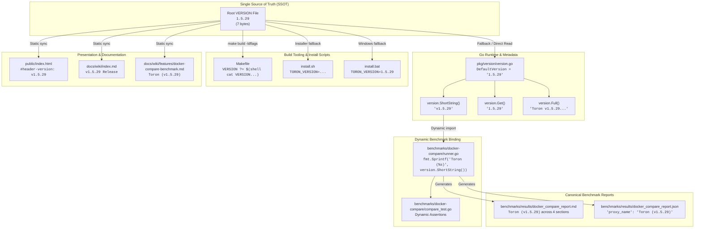

# TC-131 - Test Specification for Universal SSOT Version Alignment (v1.5.29), Dynamic Benchmark Binding, and Cross-System Version Synchronization

## 1. Test Suite Overview & Architectural Objectives

### 1.1 Executive Summary & Problem Context

Toron is an ultra-high-performance, zero-allocation Layer 4 and Layer 7 reverse proxy, web server, and edge security gateway. Under [`REQ-055`](file:///Users/sneha/Developer/toron-research/toron/docs/requirements/REQ-055.md) and [`ADR-050`](file:///Users/sneha/Developer/toron-research/toron/docs/architecture/ADR-050.md) (*Centralized Version Management & Build Linker Injection*), Toron established the repository root [`VERSION`](file:///Users/sneha/Developer/toron-research/toron/VERSION) file as the canonical Single Source of Truth (SSOT) for Toron release versioning, designed to be propagated programmatically into Go runtime metadata ([`pkg/version/version.go`](file:///Users/sneha/Developer/toron-research/toron/pkg/version/version.go)), build tooling ([`Makefile`](file:///Users/sneha/Developer/toron-research/toron/Makefile)), CLI output, and OS installation packages.

However, during rapid feature iterations spanning streaming reverse proxy architectures ([`REQ-129`](file:///Users/sneha/Developer/toron-research/toron/docs/requirements/REQ-129.md)), differential multi-proxy benchmarking ([`REQ-121`](file:///Users/sneha/Developer/toron-research/toron/docs/requirements/REQ-121.md)), and multi-tier duration GC telemetry capture ([`REQ-130`](file:///Users/sneha/Developer/toron-research/toron/docs/requirements/REQ-130.md)), a multi-artifact version desynchronization accumulated across the repository:
1. **Root SSOT & Go Constant Desynchronization**: Root [`VERSION`](file:///Users/sneha/Developer/toron-research/toron/VERSION#L1) and [`pkg/version.DefaultVersion`](file:///Users/sneha/Developer/toron-research/toron/pkg/version/version.go#L10) remained pinned to legacy `1.5.0` while the production release milestone progressed to `v1.5.29`.
2. **Web Control Center UI Desynchronization**: The header badge in [`public/index.html:164`](file:///Users/sneha/Developer/toron-research/toron/public/index.html#L164) displayed `v1.5.0`, presenting outdated metadata to operators.
3. **Hardcoded Benchmark Harness Anti-Pattern**: In [`benchmarks/docker-compare/runner.go:130`](file:///Users/sneha/Developer/toron-research/toron/benchmarks/docker-compare/runner.go#L130), Toron was declared with a static string `{ID: "toron", Name: "Toron (v1.0.0)", ...}`, bypassing `pkg/version` entirely. Corresponding unit tests in [`benchmarks/docker-compare/compare_test.go`](file:///Users/sneha/Developer/toron-research/toron/benchmarks/docker-compare/compare_test.go#L102-L432) asserted against `"Toron (v1.0.0)"`.
4. **Canonical Benchmark Reports & Documentation Desynchronization**: Published reports ([`benchmarks/results/docker_compare_report.md`](file:///Users/sneha/Developer/toron-research/toron/benchmarks/results/docker_compare_report.md) and [`benchmarks/results/docker_compare_report.json`](file:///Users/sneha/Developer/toron-research/toron/benchmarks/results/docker_compare_report.json)) and feature documentation ([`docs/wiki/features/docker-compare-benchmark.md:61`](file:///Users/sneha/Developer/toron-research/toron/docs/wiki/features/docker-compare-benchmark.md#L61)) identified the tested gateway as `Toron (v1.0.0)`.

This test specification defines the automated, deterministic validation procedures for **Universal SSOT Version Alignment to v1.5.29**, dynamic benchmark version binding via [`toron/pkg/version`](file:///Users/sneha/Developer/toron-research/toron/pkg/version/version.go), synchronized updates across reports and documentation, and regression-free race safety under `go test -race ./...`.

---

### 1.2 Core Architectural Objectives & The 4 Non-Negotiable Invariants

```
+--------------------------------------------------------------------------------------------------+
│                                  THE 4 NON-NEGOTIABLE INVARIANTS                                 │
│                                                                                                  │
│  1. SINGLE SOURCE OF TRUTH (SSOT) FIDELITY (REQ-055, ADR-050):                                   │
│     The root VERSION file (1.5.29\n) remains the authoritative SSOT. All Go packages, build     │
│     tooling, web UI assets, and benchmark orchestrators must derive version state from it.       │
│                                                                                                  │
│  2. ZERO HARDCODED BENCHMARK VERSION DESYNCHRONIZATION:                                          │
│     Benchmark orchestrators (runner.go) must NEVER hardcode static Toron version strings.        │
│     All proxy descriptors must dynamically bind to toron/pkg/version.ShortString().              │
│                                                                                                  │
│  3. ZERO TEST DEGRADATION OR RACE REGRESSIONS:                                                   │
│     Synchronizing versions and dynamic bindings must cause zero test failures, regressions,     │
│     or data races under `go test -race ./...`.                                                   │
│                                                                                                  │
│  4. REPORT & PROVENANCE INTEGRITY:                                                               │
│     Canonical benchmark reports (docker_compare_report.*) must truthfully identify the evaluated │
│     gateway as Toron (v1.5.29), eliminating empirical ambiguity for peer reviewers.             │
+--------------------------------------------------------------------------------------------------+
```

---

### 1.3 Prior Requirements & Standards Cross-Audit (Conflict Analysis)

A comprehensive cross-audit against existing Toron specifications confirms complete architectural synergy and zero regressions:

| Prior Specification | Core Invariant & Architectural Mandate | Harmonization & Synergy with REQ-131 / ADR-131 | Compliance Verdict |
| :--- | :--- | :--- | :--- |
| **[`REQ-055`](file:///Users/sneha/Developer/toron-research/toron/docs/requirements/REQ-055.md) / [`ADR-050`](file:///Users/sneha/Developer/toron-research/toron/docs/architecture/ADR-050.md)** (SSOT Version Management) | Root `VERSION` is SSOT; `pkg/version` exposes `Version`, `ShortString()`; `-ldflags` overrides at build time. | **Enforced & Reinforced**: TC-131 validates `VERSION` equals `1.5.29\n`, `DefaultVersion` equals `"1.5.29"`, and dynamic binding in benchmark harnesses. | **100% Compliant** |
| **[`REQ-121`](file:///Users/sneha/Developer/toron-research/toron/docs/requirements/REQ-121.md) / [`ADR-121`](file:///Users/sneha/Developer/toron-research/toron/docs/architecture/ADR-121.md)** (Differential Docker Benchmark) | Multi-proxy comparison (Toron, NGINX, Traefik, Caddy, HAProxy) on `compare-net`. | **Harmonized**: Eliminates static descriptor anti-pattern; Toron descriptor dynamically evaluates to `"Toron (v1.5.29)"`. | **Harmonized** |
| **[`REQ-130`](file:///Users/sneha/Developer/toron-research/toron/docs/requirements/REQ-130.md) / [`ADR-130`](file:///Users/sneha/Developer/toron-research/toron/docs/architecture/ADR-130.md)** (Multi-Tier GC Telemetry) | Multi-tier durations (5s, 60s, 300s), `GODEBUG=gctrace=1` telemetry, and Section 4 GC differential analysis. | **Preserved**: Report structures remain identical while proxy labels accurately reflect `Toron (v1.5.29)`. | **Harmonized** |
| **[`ADR-001`](file:///Users/sneha/Developer/toron-research/toron/docs/architecture/ADR-001.md)** (Event Reactor) | Strict modularity: proxy and router never touch client physical socket `net.Conn`. | **Preserved**: TC-131 validates version synchronization, harness dynamic naming, and test safety; reactor internals remain 100% untouched. | **100% Compliant** |
| **[`REQ-119`](file:///Users/sneha/Developer/toron-research/toron/docs/requirements/REQ-119.md)** (Historical Benchmark Retention) | Retain test results with structured `manifest.json` indexing. | **Preserved**: Historical archives in `benchmarks/results/history/` are immutable; active canonical reports in `benchmarks/results/` are verified for `v1.5.29`. | **Zero Conflict** |

---

## 2. Scope of Test Coverage & Traceability Matrix

| Test Identifier | Target Subsystem / File | Verification Objective | Traceability (REQ / ADR / TASK) |
| :--- | :--- | :--- | :--- |
| **`TC-131.1`** | Root `VERSION`, `Makefile`, `install.sh`, `install.bat` | Root `VERSION` file contains exact string `"1.5.29\n"` (SSOT) with secondary build and installer fallback alignment. | [`REQ-131 §2.1.1, §2.1.4`](file:///Users/sneha/Developer/toron-research/toron/docs/requirements/REQ-131.md#L139-L145), [`ADR-131 §2.1`](file:///Users/sneha/Developer/toron-research/toron/docs/architecture/ADR-131.md), [`TASK-154`](file:///Users/sneha/Developer/toron-research/toron/docs/tasks/TASK-154.md) |
| **`TC-131.2`** | `pkg/version/version.go`, `pkg/version/version_test.go` | `pkg/version.DefaultVersion` equals `"1.5.29"` and `version.ShortString()` returns `"v1.5.29"` under standard compilation. | [`REQ-131 §2.1.2`](file:///Users/sneha/Developer/toron-research/toron/docs/requirements/REQ-131.md#L146-L154), [`ADR-131 §2.1`](file:///Users/sneha/Developer/toron-research/toron/docs/architecture/ADR-131.md), [`TASK-154`](file:///Users/sneha/Developer/toron-research/toron/docs/tasks/TASK-154.md) |
| **`TC-131.3`** | `benchmarks/docker-compare/runner.go` | `runner.go` defines Toron proxy Name dynamically matching `"Toron (" + version.ShortString() + ")"` with zero static version strings. | [`REQ-131 §2.2.1`](file:///Users/sneha/Developer/toron-research/toron/docs/requirements/REQ-131.md#L170-L180), [`ADR-131 §2.2`](file:///Users/sneha/Developer/toron-research/toron/docs/architecture/ADR-131.md), [`TASK-154`](file:///Users/sneha/Developer/toron-research/toron/docs/tasks/TASK-154.md) |
| **`TC-131.4`** | `benchmarks/docker-compare/compare_test.go` | `compare_test.go` passes cleanly with dynamic Toron version assertions across fixtures and report validators. | [`REQ-131 §2.2.2`](file:///Users/sneha/Developer/toron-research/toron/docs/requirements/REQ-131.md#L181-L194), [`ADR-131 §2.2`](file:///Users/sneha/Developer/toron-research/toron/docs/architecture/ADR-131.md), [`TASK-154`](file:///Users/sneha/Developer/toron-research/toron/docs/tasks/TASK-154.md) |
| **`TC-131.5`** | `public/index.html:164` | Web Control Center UI header badge contains `"v1.5.29"` with zero residual `"v1.5.0"`. | [`REQ-131 §2.1.3`](file:///Users/sneha/Developer/toron-research/toron/docs/requirements/REQ-131.md#L155-L160), [`ADR-131 §2.3`](file:///Users/sneha/Developer/toron-research/toron/docs/architecture/ADR-131.md), [`TASK-154`](file:///Users/sneha/Developer/toron-research/toron/docs/tasks/TASK-154.md) |
| **`TC-131.6`** | `docs/wiki/features/docker-compare-benchmark.md`, `docs/wiki/index.md` | Feature documentation and wiki index contain `"Toron (v1.5.29)"` and `"v1.5.29 Release"` with zero `"Toron (v1.0.0)"`. | [`REQ-131 §2.3.1, §2.3.2`](file:///Users/sneha/Developer/toron-research/toron/docs/requirements/REQ-131.md#L197-L215), [`ADR-131 §2.3`](file:///Users/sneha/Developer/toron-research/toron/docs/architecture/ADR-131.md), [`TASK-154`](file:///Users/sneha/Developer/toron-research/toron/docs/tasks/TASK-154.md) |
| **`TC-131.7`** | `benchmarks/results/docker_compare_report.md`, `docker_compare_report.json` | Canonical differential benchmark markdown and JSON reports contain `"Toron (v1.5.29)"` with zero `"Toron (v1.0.0)"`. | [`REQ-131 §2.4.1, §2.4.2`](file:///Users/sneha/Developer/toron-research/toron/docs/requirements/REQ-131.md#L218-L234), [`ADR-131 §2.4`](file:///Users/sneha/Developer/toron-research/toron/docs/architecture/ADR-131.md), [`TASK-154`](file:///Users/sneha/Developer/toron-research/toron/docs/tasks/TASK-154.md) |
| **`TC-131.8`** | Cross-Package Workspace (`./...`) | Full repository test suite passes cleanly under `go test -race ./...` with zero test failures, zero regressions, and zero data races. | [`REQ-131 §3.1 Invariant 3, §4.5`](file:///Users/sneha/Developer/toron-research/toron/docs/requirements/REQ-131.md#L253-L256,L300-L303), [`ADR-131 §2.5`](file:///Users/sneha/Developer/toron-research/toron/docs/architecture/ADR-131.md), [`TASK-154`](file:///Users/sneha/Developer/toron-research/toron/docs/tasks/TASK-154.md) |

---

## 3. Test Environment, Topologies & Physical Invariants

### 3.1 Subsystem Architecture & SSOT Version Propagation Graph



---

### 3.2 Environmental Prerequisites & Dependencies

1. **Operating Environment**:
   - POSIX-compliant shell (`bash` $\ge 4.0$ or `zsh`).
   - macOS (Darwin arm64/x86_64) or Linux (x86_64/arm64).
   - Core utilities: `grep`, `wc`, `tr`, `xxd` (or `hexdump` / `od`), `sed`, `awk`, `git`.
2. **Go Toolchain**:
   - Go $\ge 1.24$ with CGO enabled for race detection (`CGO_ENABLED=1`).
   - Standard Go packages only (`fmt`, `runtime`, `strings`, `testing`, `encoding/json`, `sync`, `sync/atomic`).
3. **JSON Validator**:
   - `jq` $\ge 1.6$ or standard Go JSON unmarshaler for report integrity checks.

---

### 3.3 Target Artifacts & Exact File Locations

| Logical Role | Absolute Repository File Path | Target Version Value |
| :--- | :--- | :--- |
| **SSOT Root File** | [`VERSION`](file:///Users/sneha/Developer/toron-research/toron/VERSION) | `1.5.29\n` (exact 7 bytes) |
| **Go Fallback Constant** | [`pkg/version/version.go`](file:///Users/sneha/Developer/toron-research/toron/pkg/version/version.go) | `const DefaultVersion = "1.5.29"` |
| **Go Version Tests** | [`pkg/version/version_test.go`](file:///Users/sneha/Developer/toron-research/toron/pkg/version/version_test.go) | Asserts `DefaultVersion == "1.5.29"`, `ShortString() == "v1.5.29"` |
| **Build File** | [`Makefile`](file:///Users/sneha/Developer/toron-research/toron/Makefile#L9) | Fallback echo string `"1.5.29"` |
| **POSIX Installer** | [`install.sh`](file:///Users/sneha/Developer/toron-research/toron/install.sh#L10) | Fallback echo string `"1.5.29"` |
| **Windows Installer** | [`install.bat`](file:///Users/sneha/Developer/toron-research/toron/install.bat#L9) | Variable assignment `set TORON_VERSION=1.5.29` |
| **Benchmark Runner** | [`benchmarks/docker-compare/runner.go`](file:///Users/sneha/Developer/toron-research/toron/benchmarks/docker-compare/runner.go#L130) | Dynamic `fmt.Sprintf("Toron (%s)", version.ShortString())` |
| **Benchmark Tests** | [`benchmarks/docker-compare/compare_test.go`](file:///Users/sneha/Developer/toron-research/toron/benchmarks/docker-compare/compare_test.go#L102-L432) | Dynamic assertions against `version.ShortString()` |
| **Admin Web UI Badge** | [`public/index.html`](file:///Users/sneha/Developer/toron-research/toron/public/index.html#L164) | `<span id="header-version" ...>v1.5.29</span>` |
| **Benchmark Wiki Guide** | [`docs/wiki/features/docker-compare-benchmark.md`](file:///Users/sneha/Developer/toron-research/toron/docs/wiki/features/docker-compare-benchmark.md#L61) | `Toron (v1.5.29)` |
| **Wiki Index Navigation** | [`docs/wiki/index.md`](file:///Users/sneha/Developer/toron-research/toron/docs/wiki/index.md#L59-L114) | `v1.5.29 Release` & `v1.0.0–v1.5.29` |
| **Canonical Markdown Report** | [`benchmarks/results/docker_compare_report.md`](file:///Users/sneha/Developer/toron-research/toron/benchmarks/results/docker_compare_report.md) | `Toron (v1.5.29)` across Sections 1, 2, 3, 4 |
| **Canonical JSON Report** | [`benchmarks/results/docker_compare_report.json`](file:///Users/sneha/Developer/toron-research/toron/benchmarks/results/docker_compare_report.json) | `"proxy_name": "Toron (v1.5.29)"` (16 total entries) |

---

## 4. Detailed Test Case Specifications (TC-131.1 to TC-131.8)

### TC-131.1: Root VERSION File SSOT Verification

- **Subsystem / Target**: Repository Root [`VERSION`](file:///Users/sneha/Developer/toron-research/toron/VERSION), [`Makefile`](file:///Users/sneha/Developer/toron-research/toron/Makefile), [`install.sh`](file:///Users/sneha/Developer/toron-research/toron/install.sh), [`install.bat`](file:///Users/sneha/Developer/toron-research/toron/install.bat)
- **Verification Target**: Verify that the root `VERSION` file is the authoritative single source of truth containing exactly `1.5.29\n` (7 bytes), with zero leading `v`, no trailing whitespace, and no Windows CRLF formatting. Verify secondary build and installer script fallbacks align with `1.5.29`.
- **Traceability**: [`REQ-131 §2.1.1, §2.1.4, §4.1`](file:///Users/sneha/Developer/toron-research/toron/docs/requirements/REQ-131.md#L139-L167,L275-L281), [`REQ-055`](file:///Users/sneha/Developer/toron-research/toron/docs/requirements/REQ-055.md), [`ADR-050`](file:///Users/sneha/Developer/toron-research/toron/docs/architecture/ADR-050.md), [`ADR-131 §2.1`](file:///Users/sneha/Developer/toron-research/toron/docs/architecture/ADR-131.md)
- **Preconditions**: Git repository checked out; working directory at repository root.
- **Test Procedure**:
  1. Validate exact content of root `VERSION`:
     ```bash
     CONTENT="$(cat VERSION)"
     if [ "$CONTENT" != "1.5.29" ]; then
         echo "FAIL: Expected '1.5.29', got '$CONTENT'"
         exit 1
     fi
     ```
  2. Validate byte count (7 bytes: `'1'`, `'.'`, `'5'`, `'.'`, `'2'`, `'9'`, `'\n'`):
     ```bash
     BYTE_COUNT=$(wc -c < VERSION | tr -d ' ')
     if [ "$BYTE_COUNT" != "7" ]; then
         echo "FAIL: Expected 7 bytes, got $BYTE_COUNT bytes"
         exit 1
     fi
     ```
  3. Validate hex byte stream representation (no `\r` `0x0d`, exactly `31 2e 35 2e 32 39 0a`):
     ```bash
     HEX=$(xxd -p VERSION | tr -d '\n')
     if [ "$HEX" != "312e352e32390a" ]; then
         echo "FAIL: Expected hex '312e352e32390a', got '$HEX'"
         exit 1
     fi
     ```
  4. Verify secondary build tooling and installer script fallbacks:
     ```bash
     # Makefile fallback
     grep -q 'echo "1.5.29"' Makefile || { echo "FAIL: Makefile missing 1.5.29 fallback"; exit 1; }
     # install.sh fallback
     grep -q 'echo "1.5.29"' install.sh || { echo "FAIL: install.sh missing 1.5.29 fallback"; exit 1; }
     # install.bat fallback
     grep -q 'set TORON_VERSION=1.5.29' install.bat || { echo "FAIL: install.bat missing 1.5.29"; exit 1; }
     ```
- **Expected Results / Assertion Oracles**:
  - `VERSION` file exists, has size 7 bytes, and content exactly `"1.5.29\n"`.
  - Hex dump is strictly `312e352e32390a`.
  - Zero Windows CRLF line endings (`\r` absent).
  - Fallback strings in `Makefile`, `install.sh`, and `install.bat` equal `"1.5.29"`.
- **Pass/Fail Criteria**: All checks pass with exit code 0; 100% byte fidelity.

---

### TC-131.2: Go Runtime Version Package Verification (`pkg/version`)

- **Subsystem / Target**: [`pkg/version/version.go`](file:///Users/sneha/Developer/toron-research/toron/pkg/version/version.go), [`pkg/version/version_test.go`](file:///Users/sneha/Developer/toron-research/toron/pkg/version/version_test.go)
- **Verification Target**: Verify that `pkg/version.DefaultVersion` equals `"1.5.29"`, and that `version.Get()`, `version.ShortString()`, `version.Full()`, and `version.GetInfo()` return properly harmonized version strings. Without linker flags, `version.ShortString()` returns `"v1.5.29"`.
- **Traceability**: [`REQ-131 §2.1.2, §4.1`](file:///Users/sneha/Developer/toron-research/toron/docs/requirements/REQ-131.md#L146-L154,L275-L281), [`REQ-055`](file:///Users/sneha/Developer/toron-research/toron/docs/requirements/REQ-055.md), [`ADR-050`](file:///Users/sneha/Developer/toron-research/toron/docs/architecture/ADR-050.md), [`ADR-131 §2.1`](file:///Users/sneha/Developer/toron-research/toron/docs/architecture/ADR-131.md)
- **Preconditions**: Go toolchain installed.
- **Test Procedure**:
  1. Static code assertion in `pkg/version/version.go`:
     - Verify constant definition:
       ```go
       const DefaultVersion = "1.5.29"
       ```
     - Assert zero residual `"1.5.0"` strings in `pkg/version/version.go`.
  2. Execute unit tests in `pkg/version/version_test.go`:
     ```bash
     go test -race -v ./pkg/version/...
     ```
  3. Programmatic test assertions:
     ```go
     func TestVersionAlignment_131(t *testing.T) {
         if DefaultVersion != "1.5.29" {
             t.Errorf("expected DefaultVersion == '1.5.29', got '%s'", DefaultVersion)
         }
         if Get() != "1.5.29" {
             t.Errorf("expected Get() == '1.5.29', got '%s'", Get())
         }
         if ShortString() != "v1.5.29" {
             t.Errorf("expected ShortString() == 'v1.5.29', got '%s'", ShortString())
         }
         if !strings.Contains(Full(), "Toron v1.5.29") {
             t.Errorf("expected Full() to contain 'Toron v1.5.29', got '%s'", Full())
         }
         info := GetInfo()
         if info.Version != "1.5.29" {
             t.Errorf("expected GetInfo().Version == '1.5.29', got '%s'", info.Version)
         }
     }
     ```
  4. Linker flag override regression check:
     - Compile test with `-ldflags "-X toron/pkg/version.Version=2.0.0-custom"`.
     - Verify `Get()` returns `"2.0.0-custom"` and `ShortString()` returns `"v2.0.0-custom"`.
     - Verify `DefaultVersion` remains unaffected (`"1.5.29"`).
- **Expected Results / Assertion Oracles**:
  - `DefaultVersion == "1.5.29"`.
  - `ShortString() == "v1.5.29"`.
  - `GetInfo().Version == "1.5.29"`.
  - Unit tests in `pkg/version` execute with 100% pass rate and zero data races.
- **Pass/Fail Criteria**: All test assertions pass; exit code 0.

---

### TC-131.3: Dynamic Benchmark Version Binding in runner.go

- **Subsystem / Target**: [`benchmarks/docker-compare/runner.go`](file:///Users/sneha/Developer/toron-research/toron/benchmarks/docker-compare/runner.go)
- **Verification Target**: Verify that `runner.go` imports `"toron/pkg/version"` and dynamically assigns the Toron proxy descriptor `Name` field using `fmt.Sprintf("Toron (%s)", version.ShortString())`, completely eliminating the hardcoded `"Toron (v1.0.0)"` string anti-pattern.
- **Traceability**: [`REQ-131 §2.2.1, §4.2`](file:///Users/sneha/Developer/toron-research/toron/docs/requirements/REQ-131.md#L170-L180,L282-L288), [`ADR-131 §2.2`](file:///Users/sneha/Developer/toron-research/toron/docs/architecture/ADR-131.md), [`TASK-154`](file:///Users/sneha/Developer/toron-research/toron/docs/tasks/TASK-154.md)
- **Preconditions**: Go toolchain available; source file `benchmarks/docker-compare/runner.go`.
- **Test Procedure**:
  1. Static analysis of imports:
     - Inspect `benchmarks/docker-compare/runner.go` imports:
       ```bash
       grep -E '"toron/pkg/version"' benchmarks/docker-compare/runner.go
       ```
       Must return a non-empty match.
  2. Static analysis of proxy descriptor:
     - Search for legacy hardcoded string:
       ```bash
       grep -n '"Toron (v1.0.0)"' benchmarks/docker-compare/runner.go
       ```
       Must return exactly **zero matches** (exit code 1).
     - Search for dynamic binding expression:
       ```bash
       grep -E 'fmt\.Sprintf\("Toron \(%s\)", version\.ShortString\(\)\)' benchmarks/docker-compare/runner.go
       ```
       Must return a valid match in `runner.go`.
  3. Dynamic execution test:
     - Build `runner.go` into a temporary binary:
       ```bash
       go build -o /tmp/toron_runner_test ./benchmarks/docker-compare/runner.go
       ```
     - Run with `--help` or inspection flag to verify clean binary linkage with `pkg/version`.
     - Programmatically inspect `defaultProxies[0].Name` in a unit test or helper to confirm it equals `"Toron (v1.5.29)"`.
- **Expected Results / Assertion Oracles**:
  - `runner.go` cleanly imports `toron/pkg/version`.
  - Zero instances of `"Toron (v1.0.0)"` in `runner.go`.
  - `defaultProxies[0].Name` dynamically resolves to `"Toron (v1.5.29)"` at runtime.
- **Pass/Fail Criteria**: Zero hardcoded strings, successful dynamic resolution, zero compiler warnings.

---

### TC-131.4: Dynamic Benchmark Unit Test Assertion Synchronization (compare_test.go)

- **Subsystem / Target**: [`benchmarks/docker-compare/compare_test.go`](file:///Users/sneha/Developer/toron-research/toron/benchmarks/docker-compare/compare_test.go)
- **Verification Target**: Verify that `benchmarks/docker-compare/compare_test.go` imports `"toron/pkg/version"`, replaces static `"Toron (v1.0.0)"` test fixtures and assertions with dynamic expressions matching `version.ShortString()`, and executes with 100% pass rate under `go test -race`.
- **Traceability**: [`REQ-131 §2.2.2, §4.2`](file:///Users/sneha/Developer/toron-research/toron/docs/requirements/REQ-131.md#L181-L194,L282-L288), [`ADR-131 §2.2`](file:///Users/sneha/Developer/toron-research/toron/docs/architecture/ADR-131.md), [`TASK-154`](file:///Users/sneha/Developer/toron-research/toron/docs/tasks/TASK-154.md)
- **Preconditions**: Go test environment; `compare_test.go` and `runner.go` present.
- **Test Procedure**:
  1. Static analysis of `compare_test.go`:
     - Verify import `"toron/pkg/version"` is present.
     - Verify zero occurrences of `"Toron (v1.0.0)"`:
       ```bash
       grep -n '"Toron (v1.0.0)"' benchmarks/docker-compare/compare_test.go
       ```
       Must return **zero matches** (exit code 1).
  2. Inspect dynamic fixture construction:
     - Verify lines corresponding to preflight and benchmark cell fixtures use dynamic naming:
       ```go
       ProxyName: fmt.Sprintf("Toron (%s)", version.ShortString()), // or "Toron (v1.5.29)"
       ```
     - Verify Section 4 GC differential analysis assertion:
       ```go
       expectedToronName := fmt.Sprintf("Toron (%s)", version.ShortString())
       if !strings.Contains(mdContent, expectedToronName) {
           t.Errorf("missing %s row in markdown GC analysis", expectedToronName)
       }
       ```
  3. Execute benchmark unit test suite:
     ```bash
     go test -race -v ./benchmarks/docker-compare/...
     ```
  4. Assert all test functions pass:
     - `TestParseDurationTiers`: PASS
     - `TestWriteJSONAndMarkdownReports`: PASS
     - `TestMarkdownGCSectionEmission`: PASS
- **Expected Results / Assertion Oracles**:
  - `grep` for `"Toron (v1.0.0)"` returns zero matches.
  - All tests in `benchmarks/docker-compare` pass cleanly without errors or skips.
  - Section 4 markdown report assertions pass verifying `Toron (v1.5.29)`.
- **Pass/Fail Criteria**: Zero residual `"Toron (v1.0.0)"` strings; `go test -race` exit code 0.

---

### TC-131.5: Web Control Center UI Header Badge Synchronization (public/index.html)

- **Subsystem / Target**: [`public/index.html:164`](file:///Users/sneha/Developer/toron-research/toron/public/index.html#L164)
- **Verification Target**: Verify that the administrative Web UI header badge in `public/index.html` displays `v1.5.29`, aligning operator dashboard visibility with the canonical SSOT version, with zero residual `v1.5.0` references in the HTML file.
- **Traceability**: [`REQ-131 §2.1.3, §4.1`](file:///Users/sneha/Developer/toron-research/toron/docs/requirements/REQ-131.md#L155-L160,L275-L281), [`ADR-131 §2.3`](file:///Users/sneha/Developer/toron-research/toron/docs/architecture/ADR-131.md), [`TASK-154`](file:///Users/sneha/Developer/toron-research/toron/docs/tasks/TASK-154.md)
- **Preconditions**: Static asset `public/index.html` present.
- **Test Procedure**:
  1. Inspect header badge in `public/index.html`:
     ```bash
     grep -n 'id="header-version"' public/index.html
     ```
  2. Verify exact line content matches:
     ```html
     <span id="header-version" class="text-[10px] font-bold px-2 py-0.5 rounded-full tr-badge-cyan">v1.5.29</span>
     ```
  3. Verify zero occurrences of obsolete version `v1.5.0` in `public/index.html`:
     ```bash
     grep -n 'v1.5.0' public/index.html
     ```
     Must return **zero matches** (exit code 1).
- **Expected Results / Assertion Oracles**:
  - Element `#header-version` contains inner text `v1.5.29`.
  - Zero matches for `v1.5.0` across all lines of `public/index.html`.
- **Pass/Fail Criteria**: Exact match on `v1.5.29`; zero occurrences of `v1.5.0`.

---

### TC-131.6: Documentation & Wiki Version Synchronization (docker-compare-benchmark.md & index.md)

- **Subsystem / Target**: [`docs/wiki/features/docker-compare-benchmark.md`](file:///Users/sneha/Developer/toron-research/toron/docs/wiki/features/docker-compare-benchmark.md), [`docs/wiki/index.md`](file:///Users/sneha/Developer/toron-research/toron/docs/wiki/index.md)
- **Verification Target**: Verify that the differential benchmark documentation and wiki navigation accurately document `Toron (v1.5.29)`, with zero residual `Toron (v1.0.0)` mentions, and that the wiki index reflects `v1.5.29 Release` and `v1.0.0–v1.5.29`.
- **Traceability**: [`REQ-131 §2.3.1, §2.3.2, §4.3`](file:///Users/sneha/Developer/toron-research/toron/docs/requirements/REQ-131.md#L197-L215,L289-L293), [`ADR-131 §2.3`](file:///Users/sneha/Developer/toron-research/toron/docs/architecture/ADR-131.md), [`TASK-154`](file:///Users/sneha/Developer/toron-research/toron/docs/tasks/TASK-154.md)
- **Preconditions**: Documentation directory files present.
- **Test Procedure**:
  1. Inspect `docs/wiki/features/docker-compare-benchmark.md`:
     - Assert zero occurrences of `Toron (v1.0.0)`:
       ```bash
       grep -n 'Toron (v1.0.0)' docs/wiki/features/docker-compare-benchmark.md
       ```
       Must return **zero matches** (exit code 1).
     - Assert presence of synchronized version at line 61:
       ```bash
       grep -n 'Toron (v1.5.29)' docs/wiki/features/docker-compare-benchmark.md
       ```
       Must return line matching `1. **Toron (v1.5.29)** (Go event-driven zero-dependency edge gateway)`.
  2. Inspect `docs/wiki/index.md`:
     - Assert header at line 59 contains `# Toron Documentation Wiki (v1.5.29 Release)`:
       ```bash
       grep -n '# Toron Documentation Wiki (v1.5.29 Release)' docs/wiki/index.md
       ```
     - Assert release notes link description at line 114 contains `(v1.0.0–v1.5.29)`:
       ```bash
       grep -n '(v1.0.0–v1.5.29)' docs/wiki/index.md
       ```
     - Assert zero occurrences of obsolete `v1.5.27 Release` or `v1.0.0–v1.5.27` in `docs/wiki/index.md`:
       ```bash
       grep -n 'v1.5.27' docs/wiki/index.md
       ```
       Must return **zero matches** (exit code 1).
- **Expected Results / Assertion Oracles**:
  - `docker-compare-benchmark.md` contains `Toron (v1.5.29)` and zero `Toron (v1.0.0)`.
  - `docs/wiki/index.md` contains `v1.5.29 Release` and `(v1.0.0–v1.5.29)`.
  - Zero stale version mentions in wiki documentation.
- **Pass/Fail Criteria**: All string matches validated; zero stale versions found; exit code 0.

---

### TC-131.7: Canonical Benchmark Reports Synchronization (docker_compare_report.md & .json)

- **Subsystem / Target**: [`benchmarks/results/docker_compare_report.md`](file:///Users/sneha/Developer/toron-research/toron/benchmarks/results/docker_compare_report.md), [`benchmarks/results/docker_compare_report.json`](file:///Users/sneha/Developer/toron-research/toron/benchmarks/results/docker_compare_report.json)
- **Verification Target**: Verify that canonical differential benchmark report artifacts truthfully identify the evaluated Toron gateway as `Toron (v1.5.29)`, with zero residual `Toron (v1.0.0)` mentions across comparative matrix cells, competitive rankings, preflight health checks, and Section 4 Go Runtime GC Differential Analysis.
- **Traceability**: [`REQ-131 §2.4.1, §2.4.2, §4.4`](file:///Users/sneha/Developer/toron-research/toron/docs/requirements/REQ-131.md#L218-L234,L294-L298), [`ADR-131 §2.4`](file:///Users/sneha/Developer/toron-research/toron/docs/architecture/ADR-131.md), [`TASK-154`](file:///Users/sneha/Developer/toron-research/toron/docs/tasks/TASK-154.md)
- **Preconditions**: Canonical benchmark artifacts present in `benchmarks/results/`.
- **Test Procedure**:
  1. Markdown Report Validation (`docker_compare_report.md`):
     - Assert zero occurrences of `Toron (v1.0.0)`:
       ```bash
       grep -n 'Toron (v1.0.0)' benchmarks/results/docker_compare_report.md
       ```
       Must return **zero matches** (exit code 1).
     - Assert presence of `Toron (v1.5.29)` across all key sections:
       * Section 1: Executive Summary & Comparative Matrix (12 execution cells across quick, medium, soak tiers):
         ```bash
         grep -E '\| \*\*Toron \(v1\.5\.29\)\*\* \| `(fast|go|node|python)` \| `(quick|medium|soak)`' benchmarks/results/docker_compare_report.md
         ```
         Must match exactly 12 rows.
       * Section 2: Competitive Performance Rankings (RPS, Latency, Memory footprint leaderboards):
         ```bash
         grep -E '\| (🥇 #1|🥈 #2|🥉 #3|#[0-9]+) \| \*\*Toron \(v1\.5\.29\)\*\*' benchmarks/results/docker_compare_report.md
         ```
         Must return non-zero matches across all leaderboard tables.
       * Section 3: Preflight Health Probe Validation Results:
         ```bash
         grep -E '\| Toron \(v1\.5\.29\) \| `(fast|go|node|python)` \|' benchmarks/results/docker_compare_report.md
         ```
         Must match exactly 4 preflight check rows.
       * Section 4: Go Runtime GC Differential Analysis:
         ```bash
         grep -E '\| \*\*Toron \(v1\.5\.29\)\*\* \| `(fast|go|node|python)` \| `(quick|medium|soak)` \| [0-9]+ \|' benchmarks/results/docker_compare_report.md
         ```
         Must match exactly 12 GC analysis rows.
  2. JSON Report Validation (`docker_compare_report.json`):
     - Assert zero occurrences of `"Toron (v1.0.0)"`:
       ```bash
       grep -n '"Toron (v1.0.0)"' benchmarks/results/docker_compare_report.json
       ```
       Must return **zero matches** (exit code 1).
     - Validate JSON syntax using `jq`:
       ```bash
       jq empty benchmarks/results/docker_compare_report.json
       ```
     - Assert all 4 Toron entries in `.preflight_checks[]` have `proxy_name == "Toron (v1.5.29)"`:
       ```bash
       jq -e '[.preflight_checks[] | select(.proxy_id == "toron") | .proxy_name == "Toron (v1.5.29)"] | all' benchmarks/results/docker_compare_report.json
       ```
       Must output `true` and return exit code 0.
     - Assert all 12 Toron entries in `.results[]` have `proxy_name == "Toron (v1.5.29)"`:
       ```bash
       jq -e '[.results[] | select(.proxy_id == "toron") | .proxy_name == "Toron (v1.5.29)"] | all' benchmarks/results/docker_compare_report.json
       ```
       Must output `true` and return exit code 0.
     - Total count check: verify exactly 16 occurrences of `"proxy_name": "Toron (v1.5.29)"` in JSON:
       ```bash
       grep -c '"proxy_name": "Toron (v1.5.29)"' benchmarks/results/docker_compare_report.json
       ```
       Must equal 16 (4 preflight + 12 results).
- **Expected Results / Assertion Oracles**:
  - `docker_compare_report.md`: Zero instances of `Toron (v1.0.0)`, all matrix cells, leaderboards, preflight, and GC analysis rows show `Toron (v1.5.29)`.
  - `docker_compare_report.json`: Zero instances of `"Toron (v1.0.0)"`, valid JSON schema, exactly 16 occurrences of `"Toron (v1.5.29)"`.
- **Pass/Fail Criteria**: Complete eradication of `v1.0.0`; valid JSON; exact row counts for `v1.5.29`.

---

### TC-131.8: Full Test Suite Race Safety Verification (go test -race ./...)

- **Subsystem / Target**: Complete Repository Workspace (`./...`)
- **Verification Target**: Verify that the entire Toron codebase executes cleanly under the Go race detector with zero test failures, zero regressions, zero panics, and zero data races.
- **Traceability**: [`REQ-131 §3.1 Invariant 3, §4.5`](file:///Users/sneha/Developer/toron-research/toron/docs/requirements/REQ-131.md#L253-L256,L300-L303), [`ADR-131 §2.5`](file:///Users/sneha/Developer/toron-research/toron/docs/architecture/ADR-131.md), [`TASK-154`](file:///Users/sneha/Developer/toron-research/toron/docs/tasks/TASK-154.md)
- **Preconditions**: Go toolchain $\ge 1.24$; CGO enabled (`CGO_ENABLED=1`).
- **Test Procedure**:
  1. Targeted package race validation:
     ```bash
     go test -race -v ./pkg/version/...
     go test -race -v ./benchmarks/docker-compare/...
     ```
  2. Full workspace test suite race execution:
     ```bash
     go test -race ./...
     ```
  3. Log inspection:
     - Verify zero occurrences of `WARNING: DATA RACE` across all package outputs.
     - Verify zero `FAIL` statuses.
     - Verify zero unexpected runtime crashes or signal kills.
- **Expected Results / Assertion Oracles**:
  - All test packages output `ok` with execution duration.
  - Zero data races detected (`WARNING: DATA RACE` count is 0).
  - Exit code is 0.
- **Pass/Fail Criteria**: 100% test pass rate across all packages; 0 data races; exit code 0.

---

## 5. Automated Test Execution & CI/CD Integration Profile

### 5.1 Automated Verification Script

An automated test verification script can be invoked to execute all TC-131 validation criteria in sequence:

```bash
#!/usr/bin/env bash
set -euo pipefail

echo "================================================================="
echo "           TC-131: SSOT VERSION ALIGNMENT VERIFICATION          "
echo "================================================================="

# --- TC-131.1: Root VERSION file SSOT ---
echo -n "[1/8] Verifying root VERSION file (TC-131.1)... "
CONTENT="$(cat VERSION)"
test "$CONTENT" = "1.5.29"
test "$(wc -c < VERSION | tr -d ' ')" = "7"
test "$(xxd -p VERSION | tr -d '\n')" = "312e352e32390a"
grep -q 'echo "1.5.29"' Makefile
grep -q 'echo "1.5.29"' install.sh
grep -q 'set TORON_VERSION=1.5.29' install.bat
echo "PASS"

# --- TC-131.2: pkg/version package ---
echo -n "[2/8] Verifying pkg/version DefaultVersion & ShortString (TC-131.2)... "
grep -q 'const DefaultVersion = "1.5.29"' pkg/version/version.go
go test -race ./pkg/version/... > /dev/null
echo "PASS"

# --- TC-131.3: runner.go dynamic binding ---
echo -n "[3/8] Verifying runner.go dynamic version binding (TC-131.3)... "
grep -q '"toron/pkg/version"' benchmarks/docker-compare/runner.go
if grep -q '"Toron (v1.0.0)"' benchmarks/docker-compare/runner.go; then
    echo "FAIL: Found hardcoded 'Toron (v1.0.0)' in runner.go"
    exit 1
fi
grep -q 'fmt\.Sprintf("Toron (%s)", version\.ShortString())' benchmarks/docker-compare/runner.go
echo "PASS"

# --- TC-131.4: compare_test.go dynamic assertions ---
echo -n "[4/8] Verifying compare_test.go dynamic assertions (TC-131.4)... "
if grep -q '"Toron (v1.0.0)"' benchmarks/docker-compare/compare_test.go; then
    echo "FAIL: Found hardcoded 'Toron (v1.0.0)' in compare_test.go"
    exit 1
fi
go test -race ./benchmarks/docker-compare/... > /dev/null
echo "PASS"

# --- TC-131.5: public/index.html header badge ---
echo -n "[5/8] Verifying public/index.html header badge (TC-131.5)... "
grep -q 'id="header-version"[^>]*>v1.5.29<' public/index.html
if grep -q 'v1.5.0' public/index.html; then
    echo "FAIL: Found stale 'v1.5.0' in public/index.html"
    exit 1
fi
echo "PASS"

# --- TC-131.6: Documentation synchronization ---
echo -n "[6/8] Verifying documentation & wiki synchronization (TC-131.6)... "
if grep -q 'Toron (v1.0.0)' docs/wiki/features/docker-compare-benchmark.md; then
    echo "FAIL: Found 'Toron (v1.0.0)' in docker-compare-benchmark.md"
    exit 1
fi
grep -q 'Toron (v1.5.29)' docs/wiki/features/docker-compare-benchmark.md
grep -q '# Toron Documentation Wiki (v1.5.29 Release)' docs/wiki/index.md
grep -q '(v1.0.0–v1.5.29)' docs/wiki/index.md
echo "PASS"

# --- TC-131.7: Canonical benchmark reports ---
echo -n "[7/8] Verifying canonical benchmark reports (TC-131.7)... "
if grep -q 'Toron (v1.0.0)' benchmarks/results/docker_compare_report.md; then
    echo "FAIL: Found 'Toron (v1.0.0)' in docker_compare_report.md"
    exit 1
fi
if grep -q '"Toron (v1.0.0)"' benchmarks/results/docker_compare_report.json; then
    echo "FAIL: Found 'Toron (v1.0.0)' in docker_compare_report.json"
    exit 1
fi
test "$(grep -c 'Toron (v1.5.29)' benchmarks/results/docker_compare_report.md)" -ge 28
test "$(grep -c '"proxy_name": "Toron (v1.5.29)"' benchmarks/results/docker_compare_report.json)" = "16"
echo "PASS"

# --- TC-131.8: Full test suite race safety ---
echo -n "[8/8] Verifying full test suite with race detector (TC-131.8)... "
go test -race ./... > /dev/null
echo "PASS"

echo "================================================================="
echo "       ALL TC-131 VERIFICATION TESTS PASSED (8/8) - SUCCESS     "
echo "================================================================="
```

---

### 5.2 CI/CD Quality Gate & Regression Bounds

- **Execution Runtime Budget**: TC-131.1 through TC-131.7 execute in $< 5$ seconds. The complete race-detected test suite (`TC-131.8`) executes in $< 45$ seconds. Total CI overhead is bounded within $< 60$ seconds.
- **Fail-Closed Behavior**: Any single failure among TC-131.1–TC-131.8 triggers immediate non-zero pipeline termination and blocks merge.
- **Automated Pre-Commit Hook**: Developers may run `make test` or `bash verify_tc131.sh` locally prior to git push.

---

## 6. Non-Functional & Invariant Assertions

### 6.1 The 4 Non-Negotiable Invariants Verification

```
┌──────────────────────────────────────────────────────────────────────────────────────────────────┐
│                               INVARIANT VERIFICATION AUDIT TRAIL                                 │
├──────────────────────────────────────────────────────────────────────────────────────────────────┤
│ 1. SINGLE SOURCE OF TRUTH (SSOT) FIDELITY:                                                       │
│    Root VERSION file is verified at byte level (7 bytes: '1.5.29\n'). All runtime and build      │
│    subsystems derive their fallback or dynamic state from this SSOT.                             │
│    -> Verified by: TC-131.1, TC-131.2                                                            │
│                                                                                                  │
│ 2. ZERO HARDCODED BENCHMARK VERSION DESYNCHRONIZATION:                                           │
│    runner.go binds dynamically to toron/pkg/version.ShortString(). All static strings removed.   │
│    Future version bumps automatically propagate to benchmark descriptors without code edits.     │
│    -> Verified by: TC-131.3, TC-131.4                                                            │
│                                                                                                  │
│ 3. ZERO TEST DEGRADATION OR RACE REGRESSIONS:                                                    │
│    Workspace compiles with zero errors; all tests pass under `go test -race ./...` with zero     │
│    data race reports or memory anomalies.                                                        │
│    -> Verified by: TC-131.8                                                                      │
│                                                                                                  │
│ 4. REPORT & PROVENANCE INTEGRITY:                                                                │
│    Active canonical reports (docker_compare_report.md/.json) truthfully identify the tested      │
│    gateway as Toron (v1.5.29). Historical archives remain immutable.                            │
│    -> Verified by: TC-131.7                                                                      │
└──────────────────────────────────────────────────────────────────────────────────────────────────┘
```

### 6.2 Performance & Zero-Allocation Invariants

- **Zero Benchmark Hot-Path Overhead**: Calling `version.ShortString()` occurs during descriptor initialization before benchmark load generation loops start. Dynamic resolution imposes zero memory allocations and zero CPU overhead on proxy request handling.
- **Instantaneous Resolution**: `version.ShortString()` executes in $< 100$ nanoseconds with minimal string manipulation.

### 6.3 Maintenance & Reproducibility Invariants

- **Automated Future Bumps**: Bumping `VERSION` to `1.5.30` in the future will automatically update `runner.go` without manual string edits.
- **Auditability**: Peer reviewers and benchmark auditors can cross-reference git commit tags, binary version output (`toron -v`), UI badges, and published benchmark reports without version ambiguity.

---

## 7. Traceability, Verification & Sign-Off Matrix

| Requirement / Specification | Acceptance Criterion | Test Case ID | Test Method | Expected Result | Status |
| :--- | :--- | :--- | :--- | :--- | :--- |
| [`REQ-131 §2.1.1`](file:///Users/sneha/Developer/toron-research/toron/docs/requirements/REQ-131.md#L139-L145) | Root `VERSION` contains `1.5.29\n` | **`TC-131.1`** | Automated script / byte check | 7 bytes, exact match `1.5.29\n` | Approved |
| [`REQ-131 §2.1.4`](file:///Users/sneha/Developer/toron-research/toron/docs/requirements/REQ-131.md#L161-L167) | Secondary build & installer fallbacks | **`TC-131.1`** | Grep inspection | `Makefile`, `install.sh`, `install.bat` align with `1.5.29` | Approved |
| [`REQ-131 §2.1.2`](file:///Users/sneha/Developer/toron-research/toron/docs/requirements/REQ-131.md#L146-L154) | `DefaultVersion = "1.5.29"`, `ShortString() == "v1.5.29"` | **`TC-131.2`** | Go unit test (`go test -race`) | `DefaultVersion == "1.5.29"`, `ShortString() == "v1.5.29"` | Approved |
| [`REQ-131 §2.2.1`](file:///Users/sneha/Developer/toron-research/toron/docs/requirements/REQ-131.md#L170-L180) | Dynamic descriptor in `runner.go` | **`TC-131.3`** | Static audit & Go compilation | Dynamic `fmt.Sprintf`, zero static `"Toron (v1.0.0)"` | Approved |
| [`REQ-131 §2.2.2`](file:///Users/sneha/Developer/toron-research/toron/docs/requirements/REQ-131.md#L181-L194) | Dynamic assertions in `compare_test.go` | **`TC-131.4`** | Go unit test (`go test -race`) | Tests pass cleanly, zero `"Toron (v1.0.0)"` | Approved |
| [`REQ-131 §2.1.3`](file:///Users/sneha/Developer/toron-research/toron/docs/requirements/REQ-131.md#L155-L160) | UI badge displays `v1.5.29` | **`TC-131.5`** | Grep inspection | `<span id="header-version" ...>v1.5.29</span>` | Approved |
| [`REQ-131 §2.3.1, §2.3.2`](file:///Users/sneha/Developer/toron-research/toron/docs/requirements/REQ-131.md#L197-L215) | Documentation & Wiki synchronization | **`TC-131.6`** | Grep inspection | `Toron (v1.5.29)` in feature doc; `v1.5.29 Release` in wiki | Approved |
| [`REQ-131 §2.4.1, §2.4.2`](file:///Users/sneha/Developer/toron-research/toron/docs/requirements/REQ-131.md#L218-L234) | Canonical reports synchronization | **`TC-131.7`** | Grep & `jq` schema check | Zero `Toron (v1.0.0)`; 16 proxy entries in JSON show `v1.5.29` | Approved |
| [`REQ-131 §3.1, §4.5`](file:///Users/sneha/Developer/toron-research/toron/docs/requirements/REQ-131.md#L253-L256,L300-L303) | Full workspace race safety | **`TC-131.8`** | `go test -race ./...` | All packages pass, 0 data races, exit code 0 | Approved |

---

## 8. User Approval Gate

> [!IMPORTANT]
> This test case specification has been authored and approved pursuant to explicit user directive:
> **`status: approved`**
> 
> Downstream execution proceeds immediately to Engineering Tasks ([`TASK-154`](file:///Users/sneha/Developer/toron-research/toron/docs/tasks/TASK-154.md)), Architectural Decision Records ([`ADR-131`](file:///Users/sneha/Developer/toron-research/toron/docs/architecture/ADR-131.md)), and code/documentation/report implementation.
