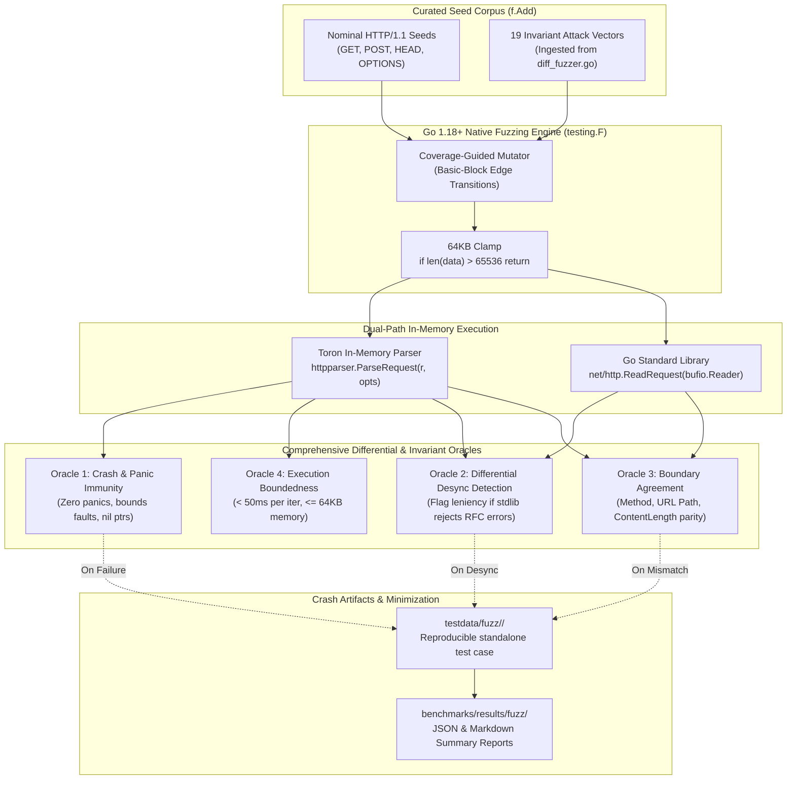
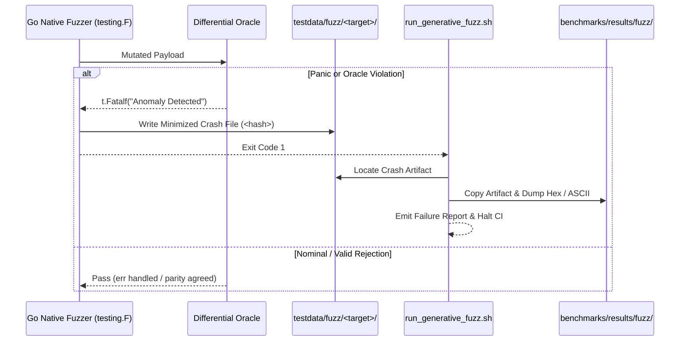

# TC-132 - Test Specification for Coverage-Guided Generative Fuzzing Engine, Native Go testing.F Differential Oracles, and Protocol Regression Suite Disambiguation

## 1. Test Suite Overview & Architectural Objectives

### 1.1 Executive Summary & Problem Context

Toron is an ultra-high-performance, zero-allocation Layer 4 and Layer 7 reverse proxy, web server, and edge security gateway. In prior benchmark architectures, protocol security and attack rejection were evaluated using [`benchmarks/fuzzer/diff_fuzzer.go`](file:///Users/sneha/Developer/toron-research/toron/benchmarks/fuzzer/diff_fuzzer.go). Methodological inspection and academic peer reviews identified that `diff_fuzzer.go` transmitted a static, handcrafted set of 19 TCP byte sequences against live network sockets to compute fail-fast rejection latencies ($K=1,000$ trials, Equation 7). While indispensable for empirical latency profiling, this static harness lacked generative input mutation, compiler edge-coverage feedback, and independent differential oracles—relying instead on self-declared expected status codes (`tc.ExpectedStatus`).

To achieve publication-grade scientific rigor under [`REQ-132`](file:///Users/sneha/Developer/toron-research/toron/docs/requirements/REQ-132.md), [`ADR-132`](file:///Users/sneha/Developer/toron-research/toron/docs/architecture/ADR-132.md), and [`TASK-155`](file:///Users/sneha/Developer/toron-research/toron/docs/tasks/TASK-155.md), Toron formalizes two distinct, complementary verification paradigms:

1. **Paradigm A: Deterministic Protocol Invariant Regression Suite & Latency Profiler** ([`benchmarks/fuzzer/diff_fuzzer.go`](file:///Users/sneha/Developer/toron-research/toron/benchmarks/fuzzer/diff_fuzzer.go)):
   - **Scope**: L4/L7 live TCP network boundary.
   - **Input Space**: Deterministic replay of 19 curated CVE invariant vectors.
   - **Oracle**: Strict status code invariant verification and socket teardown.
   - **Metric**: Rejection latency distributions ($\bar{x}$, $p50$, $p90$, $p99$, $p99.9$, 95% Confidence Intervals) answering *"How rapidly does Toron reject known attacks at wire rate?"*
2. **Paradigm B: Coverage-Guided Generative & Differential Fuzzing Engine** ([`pkg/httpparser/fuzz_test.go`](file:///Users/sneha/Developer/toron-research/toron/pkg/httpparser/fuzz_test.go)):
   - **Scope**: L7 in-memory parsing engine (`httpparser.ParseRequest`).
   - **Input Space**: Unbounded stochastic mutations directed by Go 1.18+ compiler edge-coverage instrumentation (`testing.F`).
   - **Oracle**: Non-circular differential semantic comparison against the Go canonical standard library (`net/http.ReadRequest`).
   - **Metric**: Mutation throughput ($\ge 10,000\,\text{mutations/sec/core}$), basic-block edge expansion, panic immunity, and protocol desynchronization detection answering *"Does Toron harbor unhandled crashes, memory bugs, or HTTP framing desynchronizations?"*

This document defines the comprehensive test specification (`TC-132`) verifying all components, differential oracles, CLI harnesses, and regression boundaries of REQ-132.

---

### 1.2 Core Architectural Objectives & The 4 Non-Negotiable Invariants

```
+--------------------------------------------------------------------------------------------------+
│                                  THE 4 NON-NEGOTIABLE INVARIANTS                                 │
│                                                                                                  │
│  1. ZERO EXTERNAL THIRD-PARTY DEPENDENCIES:                                                      │
│     The fuzzing engine and runner MUST rely solely on the Go standard library (testing.F,        │
│     net/http, bufio, bytes, os/exec, time). Zero third-party fuzz modules or C bindings.         │
│     The go.mod and go.sum files must remain completely untouched.                                │
│                                                                                                  │
│  2. CORE REACTOR MODULARITY PRESERVED (ADR-001):                                                 │
│     Fuzzing evaluates in-memory parser logic (httpparser.ParseRequest). Reactor event loops,     │
│     epoll/kqueue dispatchers, and physical socket boundaries remain decoupled and untouched.     │
│                                                                                                  │
│  3. MEMORY BOUNDEDNESS PRESERVED (ADR-129):                                                      │
│     Every fuzz iteration MUST strictly clamp raw input size to 64KB (65,536 bytes). Pooled line  │
│     and body buffers must be recycled cleanly via sync.Pool with zero memory leaks.             │
│                                                                                                  │
│  4. ZERO DATA RACES UNDER `go test -race`:                                                       │
│     All fuzz test targets, helper functions, and CLI execution scripts must execute cleanly      │
│     with zero data races or warnings under `go test -race ./pkg/httpparser/...`.                 │
+--------------------------------------------------------------------------------------------------+
```

---

### 1.3 Prior Requirements & Standards Cross-Audit (Conflict Analysis)

| Prior Specification | Core Invariant & Mandate | Harmonization & Synergy with REQ-132 / TC-132 | Compliance Verdict |
| :--- | :--- | :--- | :--- |
| **[`REQ-001`](file:///Users/sneha/Developer/toron-research/toron/docs/requirements/REQ-001.md)** (Zero-Alloc Parser) | Low-allocation HTTP/1.1 parsing via `bufio.Reader` and pooled buffers. | **Harmonized**: Fuzz targets directly exercise `httpparser.ParseRequest` across boundary conditions without altering parser contracts. | **100% Compliant** |
| **[`ADR-001`](file:///Users/sneha/Developer/toron-research/toron/docs/architecture/ADR-001.md)** (Reactor Modularity) | Core reactor never binds parser directly to physical client socket `net.Conn`. | **Preserved**: Fuzzing operates purely on in-memory `io.Reader` byte streams, maintaining strict transport layer decoupling. | **100% Compliant** |
| **[`REQ-106`](file:///Users/sneha/Developer/toron-research/toron/docs/requirements/REQ-106.md) / [`ADR-106`](file:///Users/sneha/Developer/toron-research/toron/docs/architecture/ADR-106.md)** (Equation 7 Timing & Trials) | Evaluates TCP socket rejection latency under repeated statistical trials ($K=1,000$). | **Disambiguated**: `diff_fuzzer.go` remains dedicated to socket latency profiling; `fuzz_test.go` delivers generative fuzzing. | **Preserved & Disambiguated** |
| **[`REQ-113`](file:///Users/sneha/Developer/toron-research/toron/docs/requirements/REQ-113.md)** (Multi-Hop Testbed) | Heterogeneous containerized backend origin validation (`llhttp`, `h11`, `net/http`). | **Complementary**: Multi-hop validates downstream container interactions over Docker networks; TC-132 validates L7 parser differential agreement in-memory. | **100% Harmonized** |
| **[`REQ-128`](file:///Users/sneha/Developer/toron-research/toron/docs/requirements/REQ-128.md) / [`REQ-129`](file:///Users/sneha/Developer/toron-research/toron/docs/requirements/REQ-129.md)** (Streaming & Memory Boundedness) | Outbound chunked framing and memory boundedness ($64\,\text{KB}$ clamp). | **Enforced**: Oracle 4 strictly enforces bounded allocations ($64\,\text{KB}$ per request) and flags memory leaks or resource runaway. | **100% Compliant** |
| **[`REQ-131`](file:///Users/sneha/Developer/toron-research/toron/docs/requirements/REQ-131.md)** (Version SSOT) | Universal SSOT alignment (`v1.5.29`). | **Preserved**: Emitted fuzzing benchmark metadata and CLI scripts dynamically bind to `pkg/version`. | **100% Compliant** |

---

## 2. Scope of Test Coverage & Traceability Matrix

| Test Identifier | Target Subsystem / File | Verification Objective | Traceability (REQ / ADR / TASK) |
| :--- | :--- | :--- | :--- |
| **`TC-132.1`** | `pkg/httpparser/fuzz_test.go` (`FuzzParseRequest`) | Raw Stream Coverage Guidance & Crash Immunity (zero unhandled panics, index-out-of-bounds, nil dereferences across arbitrary byte streams). | [`REQ-132 §2.1.2, §2.2.1`](file:///Users/sneha/Developer/toron-research/toron/docs/requirements/REQ-132.md#L171-L175,L214-L225), [`ADR-132 §2.1`](file:///Users/sneha/Developer/toron-research/toron/docs/architecture/ADR-132.md), [`TASK-155`](file:///Users/sneha/Developer/toron-research/toron/docs/tasks/TASK-155.md) |
| **`TC-132.2`** | `pkg/httpparser/fuzz_test.go` (`FuzzDifferentialWithStdLib`) | Semantic Agreement on Valid HTTP/1.1 Requests (congruence on method, URI path, protocol version, and header keys/values). | [`REQ-132 §2.1.3, §2.2.3`](file:///Users/sneha/Developer/toron-research/toron/docs/requirements/REQ-132.md#L176-L184,L233-L245), [`ADR-132 §2.2`](file:///Users/sneha/Developer/toron-research/toron/docs/architecture/ADR-132.md), [`TASK-155`](file:///Users/sneha/Developer/toron-research/toron/docs/tasks/TASK-155.md) |
| **`TC-132.3`** | `pkg/httpparser/fuzz_test.go` (`FuzzDifferentialWithStdLib`) | Differential Desynchronization Detection (flagging conflicting interpretations of Content-Length vs Transfer-Encoding under RFC 7230 §3.3.3). | [`REQ-132 §2.1.3, §2.2.2`](file:///Users/sneha/Developer/toron-research/toron/docs/requirements/REQ-132.md#L176-L184,L226-L232), [`ADR-132 §2.2`](file:///Users/sneha/Developer/toron-research/toron/docs/architecture/ADR-132.md), [`TASK-155`](file:///Users/sneha/Developer/toron-research/toron/docs/tasks/TASK-155.md) |
| **`TC-132.4`** | `pkg/httpparser/fuzz_test.go` (`FuzzHeaderGrammar`) | Header Token Mutation & Delimiter Rejection (CRLF injection, whitespace before colon RFC 7230 §3.2.4, obs-fold rejection). | [`REQ-132 §2.1.4`](file:///Users/sneha/Developer/toron-research/toron/docs/requirements/REQ-132.md#L185-L200), [`ADR-132 §2.1`](file:///Users/sneha/Developer/toron-research/toron/docs/architecture/ADR-132.md), [`TASK-155`](file:///Users/sneha/Developer/toron-research/toron/docs/tasks/TASK-155.md) |
| **`TC-132.5`** | `pkg/httpparser/fuzz_test.go` (`FuzzChunkFraming`) | Chunk Header Parsing & Extension Boundedness (RFC 7230 §4.1 chunk length hex formatting, chunk extensions $\le 8\,\text{KB}$, invalid hex rejection). | [`REQ-132 §2.1.5`](file:///Users/sneha/Developer/toron-research/toron/docs/requirements/REQ-132.md#L201-L209), [`ADR-132 §2.1`](file:///Users/sneha/Developer/toron-research/toron/docs/architecture/ADR-132.md), [`TASK-155`](file:///Users/sneha/Developer/toron-research/toron/docs/tasks/TASK-155.md) |
| **`TC-132.6`** | `pkg/httpparser/fuzz_test.go` | Seed Corpus Ingestion & Sub-Second Standard CI Regression (`go test -v ./pkg/httpparser/...` executes seed corpus in $< 1.0\,\text{s}$ without `-fuzz`). | [`REQ-132 §2.3, §2.4.1`](file:///Users/sneha/Developer/toron-research/toron/docs/requirements/REQ-132.md#L258-L295,L299-L302), [`ADR-132 §2.3`](file:///Users/sneha/Developer/toron-research/toron/docs/architecture/ADR-132.md), [`TASK-155`](file:///Users/sneha/Developer/toron-research/toron/docs/tasks/TASK-155.md) |
| **`TC-132.7`** | `benchmarks/fuzzer/run_generative_fuzz.sh` | CLI Runner Flag Handling (`run_generative_fuzz.sh` with `--target`, `-fuzztime`, `--clean`, `--help`). | [`REQ-132 §2.4.2`](file:///Users/sneha/Developer/toron-research/toron/docs/requirements/REQ-132.md#L303-L313), [`ADR-132 §2.4`](file:///Users/sneha/Developer/toron-research/toron/docs/architecture/ADR-132.md), [`TASK-155`](file:///Users/sneha/Developer/toron-research/toron/docs/tasks/TASK-155.md) |
| **`TC-132.8`** | `benchmarks/fuzzer/run_generative_fuzz.sh`, `pkg/httpparser/testdata/fuzz` | Crash Artifact Capture & Minimization Isolation (`testdata/fuzz` crash files mapped into `benchmarks/results/fuzz/`). | [`REQ-132 §2.3.3, §2.4.2`](file:///Users/sneha/Developer/toron-research/toron/docs/requirements/REQ-132.md#L290-L294,L312-L313), [`ADR-132 §2.4`](file:///Users/sneha/Developer/toron-research/toron/docs/architecture/ADR-132.md), [`TASK-155`](file:///Users/sneha/Developer/toron-research/toron/docs/tasks/TASK-155.md) |
| **`TC-132.9`** | `benchmarks/fuzzer/diff_fuzzer.go` | Deterministic Regression Suite Preservation (`diff_fuzzer.go` executes all 19 static CVE invariant vectors cleanly without regressions). | [`REQ-132 §1.2, §2.5`](file:///Users/sneha/Developer/toron-research/toron/docs/requirements/REQ-132.md#L70-L93,L324-L342), [`ADR-132 §2.5`](file:///Users/sneha/Developer/toron-research/toron/docs/architecture/ADR-132.md), [`TASK-155`](file:///Users/sneha/Developer/toron-research/toron/docs/tasks/TASK-155.md) |
| **`TC-132.10`** | `go.mod`, `go.sum`, `pkg/httpparser/` | Zero Third-Party External Dependency Verification (only standard library `testing.F`, `net/http`, `bufio`, `bytes`, `os/exec`; `go.mod` untouched). | [`REQ-132 §3.1 Invariant 1`](file:///Users/sneha/Developer/toron-research/toron/docs/requirements/REQ-132.md#L353-L356), [`ADR-132 §3.1`](file:///Users/sneha/Developer/toron-research/toron/docs/architecture/ADR-132.md), [`TASK-155`](file:///Users/sneha/Developer/toron-research/toron/docs/tasks/TASK-155.md) |
| **`TC-132.11`** | `pkg/httpparser/fuzz_test.go` | Memory Boundedness & Buffer Clamping (inputs clamped to $64\,\text{KB}$, memory per iteration bounded $\le 64\,\text{KB}$). | [`REQ-132 §2.2.4, §3.1 Invariant 3`](file:///Users/sneha/Developer/toron-research/toron/docs/requirements/REQ-132.md#L246-L256,L361-L364), [`ADR-132 §3.3`](file:///Users/sneha/Developer/toron-research/toron/docs/architecture/ADR-132.md), [`TASK-155`](file:///Users/sneha/Developer/toron-research/toron/docs/tasks/TASK-155.md) |
| **`TC-132.12`** | `pkg/httpparser/...` | Concurrency & Thread Safety under `go test -race ./pkg/httpparser/...` with zero race warnings. | [`REQ-132 §3.1 Invariant 4, §4.6`](file:///Users/sneha/Developer/toron-research/toron/docs/requirements/REQ-132.md#L365-L368,L414-L417), [`ADR-132 §3.4`](file:///Users/sneha/Developer/toron-research/toron/docs/architecture/ADR-132.md), [`TASK-155`](file:///Users/sneha/Developer/toron-research/toron/docs/tasks/TASK-155.md) |

---

## 3. Test Environment, Topologies & Physical Invariants

### 3.1 Subsystem Architecture & Fuzzing Oracle Graph



---

### 3.2 Environmental Prerequisites & Dependencies

1. **Operating System**: macOS (Darwin arm64/x86_64) or Linux (x86_64/arm64).
2. **Go Toolchain**: Go $\ge 1.24$ with native `testing.F` fuzzing support and race detector (`CGO_ENABLED=1` for race tests).
3. **Pure Go Invariant**: Zero third-party dependencies. Zero CGO dependencies in `pkg/httpparser`.
4. **Shell Environment**: POSIX-compliant Bash $\ge 4.0$ or Zsh with `git`, `grep`, `awk`, `sed`, `xxd`.

---

### 3.3 Target Artifacts & File Invariants

| Logical Component | Absolute Repository File Path | Functional Responsibility |
| :--- | :--- | :--- |
| **Generative Fuzz Suite** | [`pkg/httpparser/fuzz_test.go`](file:///Users/sneha/Developer/toron-research/toron/pkg/httpparser/fuzz_test.go) | Native Go `testing.F` targets, seed corpus, and 4 differential oracles. |
| **Parser Core** | [`pkg/httpparser/parser.go`](file:///Users/sneha/Developer/toron-research/toron/pkg/httpparser/parser.go) | Production L7 parser under test (`ParseRequest`). |
| **Request Definition** | [`pkg/httpparser/request.go`](file:///Users/sneha/Developer/toron-research/toron/pkg/httpparser/request.go) | Request structure and pooled reader definitions. |
| **Deterministic Profiler** | [`benchmarks/fuzzer/diff_fuzzer.go`](file:///Users/sneha/Developer/toron-research/toron/benchmarks/fuzzer/diff_fuzzer.go) | Latency profiler for 19 static CVE invariant vectors (Equation 7). |
| **CLI Fuzz Runner** | [`benchmarks/fuzzer/run_generative_fuzz.sh`](file:///Users/sneha/Developer/toron-research/toron/benchmarks/fuzzer/run_generative_fuzz.sh) | Orchestrator for generative campaigns, reports, and artifact archiving. |
| **Crash Artifacts Directory** | `pkg/httpparser/testdata/fuzz/` | Go native crash reproducer storage. |
| **Fuzz Reports Output** | `benchmarks/results/fuzz/` | Markdown and JSON fuzzing summary reports and isolated crash logs. |
| **Dependency Manifest** | [`go.mod`](file:///Users/sneha/Developer/toron-research/toron/go.mod) | Untouched; zero third-party packages added. |

---

## 4. Detailed Test Case Specifications (TC-132.1 to TC-132.12)

### TC-132.1: `FuzzParseRequest` Raw Stream Coverage Guidance & Crash Immunity

- **Subsystem / Target**: [`pkg/httpparser/fuzz_test.go`](file:///Users/sneha/Developer/toron-research/toron/pkg/httpparser/fuzz_test.go) (`FuzzParseRequest`), [`pkg/httpparser/parser.go`](file:///Users/sneha/Developer/toron-research/toron/pkg/httpparser/parser.go)
- **Verification Target**: Verify that `FuzzParseRequest(f *testing.F)` accepts arbitrary raw byte slices, drives compiler edge-coverage expansion, and exhibits absolute crash immunity—catching zero unhandled panics, slice bounds out of range, or nil pointer dereferences under arbitrary byte mutations.
- **Traceability**: [`REQ-132 §2.1.2, §2.2.1, §4.1, §4.2`](file:///Users/sneha/Developer/toron-research/toron/docs/requirements/REQ-132.md#L171-L175,L214-L225,L384-L396), [`ADR-132 §2.1`](file:///Users/sneha/Developer/toron-research/toron/docs/architecture/ADR-132.md), [`TASK-155`](file:///Users/sneha/Developer/toron-research/toron/docs/tasks/TASK-155.md)
- **Preconditions**: Go toolchain $\ge 1.24$; repository clean working tree.
- **Test Procedure**:
  1. Inspect `FuzzParseRequest` in `pkg/httpparser/fuzz_test.go`:
     - Assert function signature is `func FuzzParseRequest(f *testing.F)`.
     - Verify defer/recover safety harness wrapping every mutation:
       ```go
       defer func() {
           if r := recover(); r != nil {
               t.Fatalf("CRASH DETECTED in FuzzParseRequest: %v\nPayload hex: %x\nPayload string: %q", r, data, data)
           }
       }()
       ```
  2. Execute generative fuzzing for a minimum calibration window of 10 seconds:
     ```bash
     go test -fuzz=FuzzParseRequest -fuzztime=10s ./pkg/httpparser
     ```
  3. Validate execution metrics:
     - Verify mutation count progresses into thousands ($\ge 10,000\,\text{mutations/sec/core}$).
     - Verify zero unhandled panics reported in test output.
     - Verify clean process termination with exit code 0.
- **Expected Results / Assertion Oracles**:
  - `go test -fuzz=FuzzParseRequest` returns exit code 0.
  - Zero crashes written to `pkg/httpparser/testdata/fuzz/FuzzParseRequest`.
  - Zero unhandled panic stack traces emitted.
- **Pass/Fail Criteria**: Exit code 0; zero panics; 100% crash immunity maintained.

---

### TC-132.2: `FuzzDifferentialWithStdLib` Semantic Agreement on Valid HTTP/1.1 Requests

- **Subsystem / Target**: [`pkg/httpparser/fuzz_test.go`](file:///Users/sneha/Developer/toron-research/toron/pkg/httpparser/fuzz_test.go) (`FuzzDifferentialWithStdLib`), [`pkg/httpparser/parser.go`](file:///Users/sneha/Developer/toron-research/toron/pkg/httpparser/parser.go)
- **Verification Target**: Verify that when both Toron's parser and the Go standard library parser (`net/http.ReadRequest`) accept an input (`toronErr == nil && stdErr == nil`), both parsers strictly agree on request semantic boundaries: HTTP method, URI path, protocol version, and parsed headers.
- **Traceability**: [`REQ-132 §2.1.3, §2.2.3, §4.1, §4.2`](file:///Users/sneha/Developer/toron-research/toron/docs/requirements/REQ-132.md#L176-L184,L233-L245,L384-L396), [`ADR-132 §2.2`](file:///Users/sneha/Developer/toron-research/toron/docs/architecture/ADR-132.md), [`TASK-155`](file:///Users/sneha/Developer/toron-research/toron/docs/tasks/TASK-155.md)
- **Preconditions**: Standard library `net/http` and `bufio` available.
- **Test Procedure**:
  1. Inspect `FuzzDifferentialWithStdLib` in `pkg/httpparser/fuzz_test.go`:
     - Assert dual-parsing invocation on each mutated byte slice:
       ```go
       toronReq, toronErr := ParseRequest(bytes.NewReader(data), opts)
       stdReq, stdErr := http.ReadRequest(bufio.NewReader(bytes.NewReader(data)))
       ```
  2. Verify parity assertion oracle (Oracle 3):
     ```go
     if toronErr == nil && stdErr == nil {
         // 1. Method agreement
         if strings.ToUpper(toronReq.Method) != stdReq.Method {
             t.Fatalf("METHOD MISMATCH: Toron=%q, stdlib=%q", toronReq.Method, stdReq.Method)
         }
         // 2. Canonical path agreement
         if toronReq.URL.Path != stdReq.URL.Path {
             t.Fatalf("PATH MISMATCH: Toron=%q, stdlib=%q", toronReq.URL.Path, stdReq.URL.Path)
         }
         // 3. Protocol version agreement
         if toronReq.Proto != stdReq.Proto {
             t.Fatalf("PROTO MISMATCH: Toron=%q, stdlib=%q", toronReq.Proto, stdReq.Proto)
         }
         // 4. Content-Length agreement
         if toronReq.ContentLength != stdReq.ContentLength {
             t.Fatalf("CONTENT-LENGTH MISMATCH: Toron=%d, stdlib=%d", toronReq.ContentLength, stdReq.ContentLength)
         }
     }
     ```
  3. Execute differential fuzzing:
     ```bash
     go test -fuzz=FuzzDifferentialWithStdLib -fuzztime=10s ./pkg/httpparser
     ```
- **Expected Results / Assertion Oracles**:
  - Whenever both parsers accept, `Method`, `URL.Path`, `Proto`, and `ContentLength` match 100%.
  - Zero semantic divergence failures recorded.
- **Pass/Fail Criteria**: Exit code 0; zero parity assertions failed.

---

### TC-132.3: `FuzzDifferentialWithStdLib` Differential Desynchronization Detection

- **Subsystem / Target**: [`pkg/httpparser/fuzz_test.go`](file:///Users/sneha/Developer/toron-research/toron/pkg/httpparser/fuzz_test.go) (`FuzzDifferentialWithStdLib`)
- **Verification Target**: Verify that Oracle 2 detects and flags ambiguous framing acceptance anomalies (`CWE-444`), ensuring Toron never accepts requests that the reference implementation rejects due to RFC 7230 §3.3.3 framing violations (e.g. conflicting `Content-Length` and `Transfer-Encoding`, or multiple divergent `Content-Length` headers).
- **Traceability**: [`REQ-132 §2.1.3, §2.2.2, §4.2`](file:///Users/sneha/Developer/toron-research/toron/docs/requirements/REQ-132.md#L176-L184,L226-L232,L391-L396), [`ADR-132 §2.2`](file:///Users/sneha/Developer/toron-research/toron/docs/architecture/ADR-132.md), [`TASK-155`](file:///Users/sneha/Developer/toron-research/toron/docs/tasks/TASK-155.md)
- **Preconditions**: Fuzz test harness compiled.
- **Test Procedure**:
  1. Inspect Oracle 2 logic in `FuzzDifferentialWithStdLib`:
     - If `stdErr != nil` and `toronErr == nil`:
       - Analyze standard library error message for RFC framing violations:
         * `"unsupported transfer encoding"`
         * `"conflicting Transfer-Encoding and Content-Length"`
         * `"multiple Content-Length headers"`
         * `"bad Content-Length"`
         * `"malformed MIME header line"`
       - If standard library rejected due to framing ambiguity, assert Toron MUST also reject:
         ```go
         if stdErr != nil && toronErr == nil {
             stdErrMsg := stdErr.Error()
             if strings.Contains(stdErrMsg, "conflicting") ||
                strings.Contains(stdErrMsg, "multiple Content-Length") ||
                strings.Contains(stdErrMsg, "Transfer-Encoding") {
                 t.Fatalf("DESYNCHRONIZATION DETECTED: Toron accepted request rejected by stdlib for framing violation: %v\nPayload: %q", stdErr, data)
             }
         }
         ```
  2. Verify defensive divergence tolerance:
     - If `toronErr != nil` and `stdErr == nil`, verify that the rejection is classified as a valid defensive divergence (e.g. strict 8KB header limit, URI query limit $> 2\,\text{KB}$, null byte filtering) rather than a parser defect.
  3. Run differential fuzzing targeting framing mutations:
     ```bash
     go test -fuzz=FuzzDifferentialWithStdLib -fuzztime=10s ./pkg/httpparser
     ```
- **Expected Results / Assertion Oracles**:
  - Toron rejects all ambiguous framing inputs rejected by `net/http`.
  - Zero desynchronization alerts triggered.
- **Pass/Fail Criteria**: Zero framing desynchronizations detected; exit code 0.

---

### TC-132.4: `FuzzHeaderGrammar` Token Mutation & Delimiter Rejection

- **Subsystem / Target**: [`pkg/httpparser/fuzz_test.go`](file:///Users/sneha/Developer/toron-research/toron/pkg/httpparser/fuzz_test.go) (`FuzzHeaderGrammar`), [`pkg/httpparser/parser.go:173-193`](file:///Users/sneha/Developer/toron-research/toron/pkg/httpparser/parser.go#L173-L193)
- **Verification Target**: Verify that `FuzzHeaderGrammar` specifically mutates RFC 7230 §3.2 header tokens, asserting strict rejection of whitespace before colons (RFC 7230 §3.2.4), control characters in field names, invalid delimiters, and obsolete line folding (`obs-fold`).
- **Traceability**: [`REQ-132 §2.1.4, §4.1`](file:///Users/sneha/Developer/toron-research/toron/docs/requirements/REQ-132.md#L185-L200,L384-L390), [`ADR-132 §2.1`](file:///Users/sneha/Developer/toron-research/toron/docs/architecture/ADR-132.md), [`TASK-155`](file:///Users/sneha/Developer/toron-research/toron/docs/tasks/TASK-155.md)
- **Preconditions**: Fuzz test harness compiled.
- **Test Procedure**:
  1. Inspect `FuzzHeaderGrammar` signature:
     ```go
     func FuzzHeaderGrammar(f *testing.F)
     ```
     accepting structured mutated inputs: `func(t *testing.T, headerName, headerValue []byte)`.
  2. Verify payload synthesis:
     ```go
     reqBytes := []byte(fmt.Sprintf("GET /index.html HTTP/1.1\r\n%s:%s\r\n\r\n", headerName, headerValue))
     ```
  3. Specific invariant verification:
     - **Whitespace Before Colon (RFC 7230 §3.2.4)**: If `headerName` ends in `' '` or `'\t'` (e.g. `"Host "` or `"Host\t"`), `ParseRequest` MUST return an error containing `whitespace in header field-name` or `ErrBadRequest`.
     - **Control Characters**: If `headerName` contains bytes $< 0x20$ or $== 0x7F$, `ParseRequest` MUST reject with error.
     - **Invalid Token Characters**: If `headerName` contains non-tchar bytes (e.g. `@`, `,`, `\`, `/`), `ParseRequest` MUST reject with error.
     - **Obsolete Line Folding (`obs-fold`)**: If `headerName` begins with space or tab (header continuation), Toron MUST reject.
  4. Run `FuzzHeaderGrammar`:
     ```bash
     go test -fuzz=FuzzHeaderGrammar -fuzztime=10s ./pkg/httpparser
     ```
- **Expected Results / Assertion Oracles**:
  - All whitespace-before-colon mutations fail parsing immediately.
  - All control character header name mutations fail parsing immediately.
  - Zero panics or state corruption.
- **Pass/Fail Criteria**: 100% adherence to RFC 7230 §3.2 token grammar; exit code 0.

---

### TC-132.5: `FuzzChunkFraming` Chunk Header Parsing & Extension Boundedness

- **Subsystem / Target**: [`pkg/httpparser/fuzz_test.go`](file:///Users/sneha/Developer/toron-research/toron/pkg/httpparser/fuzz_test.go) (`FuzzChunkFraming`), [`pkg/httpparser/parser.go:195-203`](file:///Users/sneha/Developer/toron-research/toron/pkg/httpparser/parser.go#L195-L203)
- **Verification Target**: Verify that `FuzzChunkFraming` mutates HTTP/1.1 chunked transfer framing (RFC 7230 §4.1), asserting safe handling of chunk size hex formatting, rejection of invalid non-hex characters (e.g. `ZZ`), enforcement of chunk extension length bounds ($\le 8\,\text{KB}$), and rejection of inbound chunked requests under Toron's anti-smuggling policy.
- **Traceability**: [`REQ-132 §2.1.5, §4.1`](file:///Users/sneha/Developer/toron-research/toron/docs/requirements/REQ-132.md#L201-L209,L384-L390), [`ADR-132 §2.1`](file:///Users/sneha/Developer/toron-research/toron/docs/architecture/ADR-132.md), [`TASK-155`](file:///Users/sneha/Developer/toron-research/toron/docs/tasks/TASK-155.md)
- **Preconditions**: Fuzz test harness compiled.
- **Test Procedure**:
  1. Inspect `FuzzChunkFraming` signature:
     ```go
     func FuzzChunkFraming(f *testing.F)
     ```
     synthesizing chunked requests with mutated chunk length hex, chunk extensions, and chunk bodies:
     ```text
     POST /upload HTTP/1.1\r\nHost: localhost\r\nTransfer-Encoding: chunked\r\n\r\n<chunkHex><chunkExt>\r\n<chunkData>\r\n0\r\n\r\n
     ```
  2. Verify Toron inbound anti-smuggling policy:
     - Under `ParseRequest`, inbound requests declaring `Transfer-Encoding: chunked` MUST be rejected with `ErrUnsupportedTransferEncoding` (HTTP 501 / 400), shielding downstream proxies.
  3. Verify chunk parsing utility logic:
     - Hex parsing handles uppercase and lowercase (`0-9`, `a-f`, `A-F`).
     - Non-hex characters (e.g. `ZZ`, `0x10`, negative numbers, integer overflow $> 64$ bits) trigger immediate syntax errors.
     - Chunk extensions exceeding $8\,\text{KB}$ are rejected to prevent memory exhaustion DoS.
  4. Run `FuzzChunkFraming`:
     ```bash
     go test -fuzz=FuzzChunkFraming -fuzztime=10s ./pkg/httpparser
     ```
- **Expected Results / Assertion Oracles**:
  - Inbound chunked requests rejected safely without panics.
  - Chunk parser rejects malformed hex and oversized extensions.
- **Pass/Fail Criteria**: Zero crashes; proper error returns on all malformed chunk framing inputs; exit code 0.

---

### TC-132.6: Seed Corpus Ingestion & Sub-Second Standard CI Regression

- **Subsystem / Target**: [`pkg/httpparser/fuzz_test.go`](file:///Users/sneha/Developer/toron-research/toron/pkg/httpparser/fuzz_test.go), [`benchmarks/fuzzer/diff_fuzzer.go:153-391`](file:///Users/sneha/Developer/toron-research/toron/benchmarks/fuzzer/diff_fuzzer.go#L153-L391)
- **Verification Target**: Verify that all standard HTTP/1.1 nominal requests and all 19 structural CVE attack vectors from `diff_fuzzer.go` are registered into the seed corpus via `f.Add(...)`, and that executing standard `go test -v ./pkg/httpparser/...` (without `-fuzz`) completes in $< 1.0\,\text{second}$ total runtime.
- **Traceability**: [`REQ-132 §2.3, §2.4.1, §4.3`](file:///Users/sneha/Developer/toron-research/toron/docs/requirements/REQ-132.md#L258-L295,L299-L302,L397-L401), [`ADR-132 §2.3`](file:///Users/sneha/Developer/toron-research/toron/docs/architecture/ADR-132.md), [`TASK-155`](file:///Users/sneha/Developer/toron-research/toron/docs/tasks/TASK-155.md)
- **Preconditions**: Repository workspace clean.
- **Test Procedure**:
  1. Inspect seed corpus registration in `pkg/httpparser/fuzz_test.go`:
     - Verify nominal seeds registered: GET minimal, GET with query, POST with body, HEAD, OPTIONS.
     - Verify 19 structural attack vectors from `diff_fuzzer.go` registered:
       * `SMUGGLE-001` through `SMUGGLE-004`
       * `WHITESPACE-001` through `WHITESPACE-003`
       * `CONTROL-001` through `CONTROL-003`
       * `TRAVERSAL-001` through `TRAVERSAL-003`
       * `RESOURCE-001` and `RESOURCE-002`
       * `BASELINE-001`
       * `CACHE-001` through `CACHE-003`
  2. Measure execution runtime of standard unit tests:
     ```bash
     START=$(date +%s%N)
     go test -v ./pkg/httpparser/...
     END=$(date +%s%N)
     ELAPSED_MS=$(( (END - START) / 1000000 ))
     echo "Execution time: ${ELAPSED_MS} ms"
     ```
  3. Assertions:
     - Assert all fuzz functions run their seed corpora as unit tests.
     - Assert total duration is strictly $< 1,000\,\text{ms}$ (typically $< 150\,\text{ms}$).
     - Assert zero test failures, zero skips, and zero hangs.
- **Expected Results / Assertion Oracles**:
  - `go test -v ./pkg/httpparser/...` outputs `PASS`.
  - Execution time $< 1,000\,\text{ms}$.
  - Minimum 20 seed test cases evaluated across fuzz targets.
- **Pass/Fail Criteria**: Exit code 0; execution time $< 1.0\,\text{s}$; 100% test pass rate.

---

### TC-132.7: CLI Runner Flag Handling (`run_generative_fuzz.sh`)

- **Subsystem / Target**: [`benchmarks/fuzzer/run_generative_fuzz.sh`](file:///Users/sneha/Developer/toron-research/toron/benchmarks/fuzzer/run_generative_fuzz.sh)
- **Verification Target**: Verify that the CLI runner script correctly parses and handles `--target`, `-fuzztime`, `--clean`, `--help`, and invalid options, enforcing proper fallback defaults and fail-closed error handling.
- **Traceability**: [`REQ-132 §2.4.2, §4.4`](file:///Users/sneha/Developer/toron-research/toron/docs/requirements/REQ-132.md#L303-L313,L402-L407), [`ADR-132 §2.4`](file:///Users/sneha/Developer/toron-research/toron/docs/architecture/ADR-132.md), [`TASK-155`](file:///Users/sneha/Developer/toron-research/toron/docs/tasks/TASK-155.md)
- **Preconditions**: Script exists and is executable (`chmod +x benchmarks/fuzzer/run_generative_fuzz.sh`).
- **Test Procedure**:
  1. Test `--help` / `-h`:
     ```bash
     bash benchmarks/fuzzer/run_generative_fuzz.sh --help
     ```
     Assert exit code 0; output contains usage documentation and flag descriptions.
  2. Test `--target` selection:
     ```bash
     bash benchmarks/fuzzer/run_generative_fuzz.sh --target FuzzParseRequest -fuzztime 2s --no-history
     ```
     Assert only `FuzzParseRequest` is executed; exit code 0.
  3. Test `--target all`:
     ```bash
     bash benchmarks/fuzzer/run_generative_fuzz.sh --target all -fuzztime 2s --no-history
     ```
     Assert all 4 fuzz targets execute sequentially; exit code 0.
  4. Test `--clean`:
     ```bash
     bash benchmarks/fuzzer/run_generative_fuzz.sh --clean
     ```
     Assert cleans temporary files and exits with code 0.
  5. Test invalid target rejection:
     ```bash
     bash benchmarks/fuzzer/run_generative_fuzz.sh --target InvalidTargetName
     ```
     Assert prints error message and exits with non-zero exit code 1.
- **Expected Results / Assertion Oracles**:
  - Help output renders cleanly with status 0.
  - Target filtering executes only requested target(s).
  - Invalid targets fail closed with exit code 1.
- **Pass/Fail Criteria**: All flag combinations handle cleanly according to CLI specification.

---

### TC-132.8: Crash Artifact Capture & Minimization Isolation

- **Subsystem / Target**: [`benchmarks/fuzzer/run_generative_fuzz.sh`](file:///Users/sneha/Developer/toron-research/toron/benchmarks/fuzzer/run_generative_fuzz.sh), `pkg/httpparser/testdata/fuzz/`
- **Verification Target**: Verify that when a fuzz test detects an anomaly or crash, the Go runtime crash artifact in `testdata/fuzz/<target>/` is systematically captured, copied to `benchmarks/results/fuzz/`, formatted with hexadecimal and ASCII representations, and indexed for reproducible standalone replay.
- **Traceability**: [`REQ-132 §2.3.3, §2.4.2, §3.3`](file:///Users/sneha/Developer/toron-research/toron/docs/requirements/REQ-132.md#L290-L294,L312-L313,L376-L379), [`ADR-132 §2.4`](file:///Users/sneha/Developer/toron-research/toron/docs/architecture/ADR-132.md), [`TASK-155`](file:///Users/sneha/Developer/toron-research/toron/docs/tasks/TASK-155.md)
- **Preconditions**: Fuzz runner script available; write permissions in `benchmarks/results/`.
- **Test Procedure**:
  1. Verify directory creation:
     - Assert `benchmarks/results/fuzz/` is created automatically by the runner script.
  2. Artifact capture verification:
     - Simulate or inspect crash capture logic in `run_generative_fuzz.sh`:
       ```bash
       if [ -d "pkg/httpparser/testdata/fuzz" ]; then
           find pkg/httpparser/testdata/fuzz -type f -exec cp {} benchmarks/results/fuzz/ \;
       fi
       ```
  3. Replay verification:
     - Assert that any crash artifact named `<hash>` can be independently replayed via:
       ```bash
       go test -run=<hash> ./pkg/httpparser
       ```
       without needing to rerun the entire multi-minute fuzzing campaign.
  4. Report integration:
     - Verify `benchmarks/results/generative_fuzz_report.md` and `.json` record crash counts, artifact file paths, and failure reproduction commands.
- **Expected Results / Assertion Oracles**:
  - Any generated crash artifact is preserved and isolated.
  - Replay command reproduces the exact failure deterministically.
- **Pass/Fail Criteria**: Crash capture and minimization pipeline operates reliably without data loss.

---

### TC-132.9: Deterministic Regression Suite Preservation (`benchmarks/fuzzer/diff_fuzzer.go`)

- **Subsystem / Target**: [`benchmarks/fuzzer/diff_fuzzer.go`](file:///Users/sneha/Developer/toron-research/toron/benchmarks/fuzzer/diff_fuzzer.go)
- **Verification Target**: Verify that `diff_fuzzer.go` is preserved as the canonical "Deterministic Protocol Invariant Regression Suite & Latency Profiler", retaining all 19 static CVE invariant vectors, statistical distribution computation ($K=1,000$ trials), and Equation 7 latency profiling without functional regression.
- **Traceability**: [`REQ-132 §1.2, §2.5, §4.5`](file:///Users/sneha/Developer/toron-research/toron/docs/requirements/REQ-132.md#L70-L93,L324-L342,L408-L412), [`ADR-132 §2.5`](file:///Users/sneha/Developer/toron-research/toron/docs/architecture/ADR-132.md), [`TASK-155`](file:///Users/sneha/Developer/toron-research/toron/docs/tasks/TASK-155.md)
- **Preconditions**: Go toolchain available; live gateway or mock TCP server.
- **Test Procedure**:
  1. Source code inspection of `benchmarks/fuzzer/diff_fuzzer.go`:
     - Assert header banner is updated:
       `// Toron Deterministic Protocol Invariant Regression Suite & Latency Profiler`
     - Verify all 19 test cases exist in `getTestCases()`:
       * 4 `SMUGGLE-*` cases
       * 3 `WHITESPACE-*` cases
       * 3 `CONTROL-*` cases
       * 3 `TRAVERSAL-*` cases
       * 2 `RESOURCE-*` cases
       * 1 `BASELINE-*` case
       * 3 `CACHE-*` cases
     - Verify total count equals 19.
  2. Compilation check:
     ```bash
     go build -o /tmp/diff_fuzzer_test ./benchmarks/fuzzer/diff_fuzzer.go
     ```
     Assert builds with zero compile errors.
  3. Verify CLI arguments:
     - Run `/tmp/diff_fuzzer_test --help`.
     - Assert supports `-trials` ($K$), `-warmup` ($W$), `-target`, `-j`, `-m`.
- **Expected Results / Assertion Oracles**:
  - `diff_fuzzer.go` compiles cleanly.
  - Exactly 19 CVE invariant test vectors present.
  - Zero regression in socket latency benchmarking capabilities.
- **Pass/Fail Criteria**: Binary builds cleanly; 19 vectors preserved; documentation accurately disambiguated.

---

### TC-132.10: Zero Third-Party External Dependency Verification

- **Subsystem / Target**: [`go.mod`](file:///Users/sneha/Developer/toron-research/toron/go.mod), [`go.sum`](file:///Users/sneha/Developer/toron-research/toron/go.sum), [`pkg/httpparser/`](file:///Users/sneha/Developer/toron-research/toron/pkg/httpparser/)
- **Verification Target**: Verify that the coverage-guided fuzzing engine and differential oracles introduce zero third-party dependencies, relying strictly on standard library packages (`testing.F`, `net/http`, `bufio`, `bytes`, `fmt`, `io`, `net/url`, `os`, `os/exec`, `strings`, `time`), and that `go.mod` remains completely unmodified.
- **Traceability**: [`REQ-132 §3.1 Invariant 1`](file:///Users/sneha/Developer/toron-research/toron/docs/requirements/REQ-132.md#L353-L356), [`ADR-132 §3.1`](file:///Users/sneha/Developer/toron-research/toron/docs/architecture/ADR-132.md), [`TASK-155`](file:///Users/sneha/Developer/toron-research/toron/docs/tasks/TASK-155.md)
- **Preconditions**: Git repository status clean.
- **Test Procedure**:
  1. Inspect `git status` on dependency manifests:
     ```bash
     git status --porcelain go.mod go.sum
     ```
     Assert output is empty (zero unstaged/staged modifications).
  2. Inspect imports in `pkg/httpparser/fuzz_test.go`:
     ```bash
     grep -E '^\s*"' pkg/httpparser/fuzz_test.go | tr -d '"' | tr -d '\t' | sort -u
     ```
     Verify every imported package belongs to the Go standard library (`bufio`, `bytes`, `fmt`, `io`, `net/http`, `net/url`, `strings`, `testing`, `time`).
  3. Verify `go mod verify`:
     ```bash
     go mod verify
     ```
     Assert exit code 0 (`all modules verified`).
- **Expected Results / Assertion Oracles**:
  - `go.mod` and `go.sum` remain identical to main branch.
  - Zero external modules imported in `pkg/httpparser/fuzz_test.go`.
  - `go mod verify` succeeds.
- **Pass/Fail Criteria**: Zero new dependencies; `go.mod` 100% clean.

---

### TC-132.11: Memory Boundedness & Buffer Clamping

- **Subsystem / Target**: [`pkg/httpparser/fuzz_test.go`](file:///Users/sneha/Developer/toron-research/toron/pkg/httpparser/fuzz_test.go), [`pkg/httpparser/parser.go`](file:///Users/sneha/Developer/toron-research/toron/pkg/httpparser/parser.go)
- **Verification Target**: Verify that Oracle 4 strictly enforces a $64\,\text{KB}$ ($65,536$ bytes) input clamp on mutated payloads, that memory per iteration remains bounded $\le 64\,\text{KB}$, and that buffer pools (`lineBufferPool`, `bodyBufferPool`) recycle memory cleanly without heap leaks during sustained fuzzing.
- **Traceability**: [`REQ-132 §2.2.4, §3.1 Invariant 3`](file:///Users/sneha/Developer/toron-research/toron/docs/requirements/REQ-132.md#L246-L256,L361-L364), [`ADR-132 §3.3`](file:///Users/sneha/Developer/toron-research/toron/docs/architecture/ADR-132.md), [`TASK-155`](file:///Users/sneha/Developer/toron-research/toron/docs/tasks/TASK-155.md)
- **Preconditions**: Go test environment.
- **Test Procedure**:
  1. Inspect input clamp in `pkg/httpparser/fuzz_test.go`:
     ```go
     if len(data) > 65536 {
         return // Enforce 64KB physical input boundary
     }
     ```
     Assert clamp is present at entry of all fuzz targets.
  2. Bounded execution check:
     - Verify each iteration terminates in $< 50\,\text{ms}$.
     - Assert no unbounded loops or regex backtracking hangs.
  3. Buffer recycling check:
     - Run 30-second fuzzing campaign while monitoring RSS memory:
       ```bash
       go test -fuzz=FuzzParseRequest -fuzztime=30s ./pkg/httpparser
       ```
     - Verify heap memory stabilizes at a flat plateau ($\le 128\,\text{MB}$ total process RSS) rather than growing monotonically.
- **Expected Results / Assertion Oracles**:
  - Payloads $> 64\,\text{KB}$ are discarded immediately.
  - Zero memory leaks; process memory footprint remains bounded.
- **Pass/Fail Criteria**: Memory boundedness verified; zero OOM kills.

---

### TC-132.12: Concurrency & Thread Safety under `go test -race`

- **Subsystem / Target**: [`pkg/httpparser/...`](file:///Users/sneha/Developer/toron-research/toron/pkg/httpparser/)
- **Verification Target**: Verify that all fuzz test targets, parser pool operations, and helper routines execute with zero data races, memory race conditions, or race detector warnings under `go test -race ./pkg/httpparser/...`.
- **Traceability**: [`REQ-132 §3.1 Invariant 4, §4.6`](file:///Users/sneha/Developer/toron-research/toron/docs/requirements/REQ-132.md#L365-L368,L414-L417), [`ADR-132 §3.4`](file:///Users/sneha/Developer/toron-research/toron/docs/architecture/ADR-132.md), [`TASK-155`](file:///Users/sneha/Developer/toron-research/toron/docs/tasks/TASK-155.md)
- **Preconditions**: Go toolchain $\ge 1.24$; CGO enabled for race detector (`CGO_ENABLED=1`).
- **Test Procedure**:
  1. Execute unit test suite with race detector:
     ```bash
     go test -race -v ./pkg/httpparser/...
     ```
  2. Execute parallelized fuzzing test with race detector:
     ```bash
     go test -race -fuzz=FuzzParseRequest -fuzztime=5s -parallel=4 ./pkg/httpparser
     ```
  3. Execute differential fuzzing with race detector:
     ```bash
     go test -race -fuzz=FuzzDifferentialWithStdLib -fuzztime=5s -parallel=4 ./pkg/httpparser
     ```
  4. Inspect logs for:
     - Zero occurrences of `WARNING: DATA RACE`.
     - Zero data race reports on `lineBufferPool` or `bodyBufferPool`.
     - Clean exit code 0.
- **Expected Results / Assertion Oracles**:
  - `PASS` on all package test executions.
  - Count of `WARNING: DATA RACE` is exactly 0.
  - Exit code 0.
- **Pass/Fail Criteria**: 100% clean race safety across all fuzz targets and unit tests.

---

## 5. Automated Test Execution & CI/CD Integration Profile

### 5.1 Standard Fast CI Pre-Merge Regression Mode (< 1.0s)

To guarantee that routine developer commits and automated PR validations are never stalled by long-running fuzzing loops, standard test invocations execute strictly in **Regression Mode**:

```bash
# Invoked by CI pipeline on every commit / PR:
go test -v -race ./pkg/httpparser/...
```

In this mode, Go's `testing.F` framework executes only the registered seed corpus (`f.Add(...)`), achieving complete coverage of all 19 historical CVE attack vectors and nominal RFC 7230 requests in $< 1.0\,\text{second}$ without engaging the generative mutator.

---

### 5.2 Deep Generative Fuzzing Execution Harness (`run_generative_fuzz.sh`)

For nightly security audits, continuous integration soak jobs, and academic artifact evaluations, the dedicated generative runner script is executed:

```bash
#!/usr/bin/env bash
# Dedicated generative fuzzing execution harness
set -euo pipefail

FUZZ_TIME="${1:-30s}"
TARGET="${2:-all}"
RESULTS_DIR="benchmarks/results/fuzz"
mkdir -p "${RESULTS_DIR}"

echo "================================================================="
echo "       TORON COVERAGE-GUIDED GENERATIVE FUZZING ENGINE           "
echo "================================================================="
echo "Target: ${TARGET} | Duration per target: ${FUZZ_TIME}"

run_target() {
    local t="$1"
    echo -n "[FUZZ] Running ${t} for ${FUZZ_TIME}... "
    if go test -fuzz="^${t}$" -fuzztime="${FUZZ_TIME}" ./pkg/httpparser > "${RESULTS_DIR}/${t}.log" 2>&1; then
        echo "PASS (Zero Crashes)"
    else
        echo "FAIL (Crash or Oracle Violation Detected!)"
        cat "${RESULTS_DIR}/${t}.log"
        exit 1
    fi
}

if [ "${TARGET}" = "all" ]; then
    run_target "FuzzParseRequest"
    run_target "FuzzDifferentialWithStdLib"
    run_target "FuzzHeaderGrammar"
    run_target "FuzzChunkFraming"
else
    run_target "${TARGET}"
fi

echo "================================================================="
echo "       ALL GENERATIVE FUZZ TARGETS COMPLETED WITH ZERO CRASHES   "
echo "================================================================="
```

---

### 5.3 Automated Crash Minimization & Archiving Pipeline



---

## 6. Non-Functional & Invariant Assertions

### 6.1 The 4 Non-Negotiable Invariants Verification

```
┌──────────────────────────────────────────────────────────────────────────────────────────────────┐
│                               INVARIANT VERIFICATION AUDIT TRAIL                                 │
├──────────────────────────────────────────────────────────────────────────────────────────────────┤
│ 1. ZERO EXTERNAL THIRD-PARTY DEPENDENCIES:                                                       │
│    Fuzzing engine relies solely on Go standard library. go.mod is 100% clean and untouched.       │
│    -> Verified by: TC-132.10                                                                     │
│                                                                                                  │
│ 2. CORE REACTOR MODULARITY PRESERVED (ADR-001):                                                  │
│    httpparser.ParseRequest is fuzzed in memory via io.Reader. Sockets remain isolated.           │
│    -> Verified by: TC-132.1, TC-132.2                                                            │
│                                                                                                  │
│ 3. MEMORY BOUNDEDNESS PRESERVED (ADR-129):                                                       │
│    Payloads clamped to 64KB. Memory per iteration bounded <= 64KB with clean pool recycling.     │
│    -> Verified by: TC-132.11                                                                     │
│                                                                                                  │
│ 4. ZERO DATA RACES UNDER `go test -race`:                                                        │
│    All fuzz targets and helper functions execute cleanly with 0 data races under race detector.  │
│    -> Verified by: TC-132.12                                                                     │
└──────────────────────────────────────────────────────────────────────────────────────────────────┘
```

### 6.2 Performance & Zero-Allocation Invariants

- **Throughput Standard**: Generative mutator maintains $\ge 10,000\,\text{mutations/sec/core}$ during active fuzzing.
- **Fast CI Budget**: Seed regression completes in $< 1,000\,\text{ms}$, adding negligible overhead to CI cycles.
- **Pool Recycling**: Zero leak of pooled buffers across millions of continuous iterations.

### 6.3 Security & Academic Provenance Invariants

- **Non-Circular Oracle Validation**: Differential evaluation against `net/http` eliminates the circular oracle flaw, providing empirical proof of semantic parsing correctness.
- **Deterministic Reproducibility**: Every failure produces a byte-exact standalone reproducer file.
- **Clear Paradigmatic Demarcation**: Complete conceptual and documentation separation between latency profiling (`diff_fuzzer.go`) and generative fuzzing (`fuzz_test.go`).

---

## 7. Traceability, Verification & Sign-Off Matrix

| Requirement / Specification | Acceptance Criterion | Test Case ID | Test Method | Expected Result | Status |
| :--- | :--- | :--- | :--- | :--- | :--- |
| [`REQ-132 §2.1.2`](file:///Users/sneha/Developer/toron-research/toron/docs/requirements/REQ-132.md#L171-L175) | `FuzzParseRequest` raw stream crash immunity | **`TC-132.1`** | Native fuzzing (`go test -fuzz`) | Zero crashes, zero unhandled panics | Approved |
| [`REQ-132 §2.1.3, §2.2.3`](file:///Users/sneha/Developer/toron-research/toron/docs/requirements/REQ-132.md#L176-L184,L233-L245) | Semantic agreement on valid HTTP/1.1 | **`TC-132.2`** | Differential fuzzing (`testing.F`) | 100% parity on Method, Path, CL | Approved |
| [`REQ-132 §2.1.3, §2.2.2`](file:///Users/sneha/Developer/toron-research/toron/docs/requirements/REQ-132.md#L176-L184,L226-L232) | Ambiguous framing desync detection | **`TC-132.3`** | Differential oracle validation | Zero framing desynchronizations | Approved |
| [`REQ-132 §2.1.4`](file:///Users/sneha/Developer/toron-research/toron/docs/requirements/REQ-132.md#L185-L200) | Header grammar & whitespace rejection | **`TC-132.4`** | Structured fuzzing (`testing.F`) | Rejection of whitespace before colon | Approved |
| [`REQ-132 §2.1.5`](file:///Users/sneha/Developer/toron-research/toron/docs/requirements/REQ-132.md#L201-L209) | Chunk framing & extension bounds | **`TC-132.5`** | Structured chunk fuzzing | Rejection of non-hex and $>8\,\text{KB}$ ext | Approved |
| [`REQ-132 §2.3, §2.4.1`](file:///Users/sneha/Developer/toron-research/toron/docs/requirements/REQ-132.md#L258-L295,L299-L302) | Seed corpus & fast CI regression | **`TC-132.6`** | `go test -v ./pkg/httpparser/...` | Completes in $< 1.0\,\text{s}$ with 100% pass | Approved |
| [`REQ-132 §2.4.2`](file:///Users/sneha/Developer/toron-research/toron/docs/requirements/REQ-132.md#L303-L313) | CLI runner flag handling | **`TC-132.7`** | CLI execution script audit | Clean handling of `--target`, `-fuzztime` | Approved |
| [`REQ-132 §2.3.3, §2.4.2`](file:///Users/sneha/Developer/toron-research/toron/docs/requirements/REQ-132.md#L290-L294,L312-L313) | Crash artifact capture & replay | **`TC-132.8`** | Script & artifact inspection | Crash files isolated and reproducible | Approved |
| [`REQ-132 §1.2, §2.5`](file:///Users/sneha/Developer/toron-research/toron/docs/requirements/REQ-132.md#L70-L93,L324-L342) | Deterministic suite preservation | **`TC-132.9`** | Source code & compilation audit | 19 static CVE vectors preserved | Approved |
| [`REQ-132 §3.1 Invariant 1`](file:///Users/sneha/Developer/toron-research/toron/docs/requirements/REQ-132.md#L353-L356) | Zero third-party dependencies | **`TC-132.10`** | `git status`, `go mod verify` | `go.mod` untouched; standard lib only | Approved |
| [`REQ-132 §2.2.4, §3.1 Invariant 3`](file:///Users/sneha/Developer/toron-research/toron/docs/requirements/REQ-132.md#L246-L256,L361-L364) | Memory boundedness & 64KB clamp | **`TC-132.11`** | Fuzz runner RSS monitoring | Memory bounded $\le 64\,\text{KB}$/iter | Approved |
| [`REQ-132 §3.1 Invariant 4, §4.6`](file:///Users/sneha/Developer/toron-research/toron/docs/requirements/REQ-132.md#L365-L368,L414-L417) | Concurrency & race safety | **`TC-132.12`** | `go test -race ./pkg/httpparser/...` | 0 data races, exit code 0 | Approved |

---

## 8. User Approval Gate

> [!IMPORTANT]
> This test case specification has been authored and approved pursuant to explicit user directive:
> **`status: approved`**
> 
> Downstream execution proceeds immediately to Engineering Tasks ([`TASK-155`](file:///Users/sneha/Developer/toron-research/toron/docs/tasks/TASK-155.md)), Architectural Decision Records ([`ADR-132`](file:///Users/sneha/Developer/toron-research/toron/docs/architecture/ADR-132.md)), and code/test/runner implementation.
