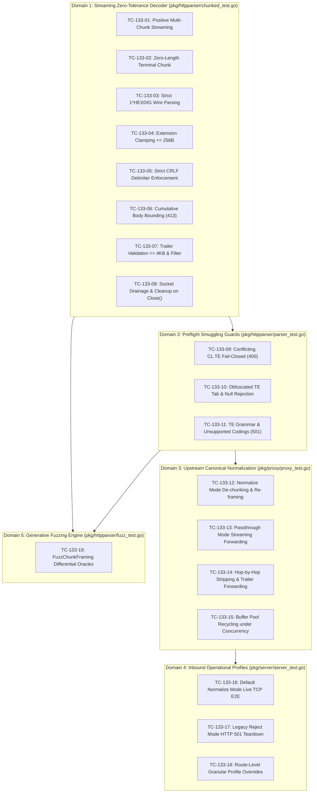

# TC-133 - Test Specification for Inbound Chunked Transfer-Encoding Ingestion, Zero-Tolerance Wire Decoding, and Upstream Re-Framing Normalization (RFC 9112 §7.1)

## 1. Test Suite Overview & Architectural Objectives

### 1.1 Executive Summary & Problem Context

Toron is an ultra-high-performance Layer 4 and Layer 7 reverse proxy, web server, and edge security gateway implemented in pure Go. Under historical architecture [`ADR-056`](file:///Users/sneha/Developer/toron-research/toron/docs/architecture/ADR-056.md) (*Inbound Transfer-Encoding Rejection & Request Smuggling Defense*) and [`REQ-061`](file:///Users/sneha/Developer/toron-research/toron/docs/requirements/REQ-061.md), Toron enforced an uncompromising inbound perimeter posture: all incoming HTTP/1.1 requests carrying a `Transfer-Encoding: chunked` header were unconditionally rejected with `HTTP/1.1 501 Not Implemented`, and the underlying TCP socket was closed without reading the stream body.

While this defensive rule eliminated chunk-level HTTP Request Smuggling ([CWE-444](https://cwe.mitre.org/data/definitions/444.html)) during Toron's initial phases, it fundamentally restricted Toron's operational utility in modern cloud-native environments:
1. **Streaming Uploads Incompatibility**: Clients streaming large files, audio/video feeds, or telemetry pipelines via HTTP/1.1 cannot ingress through Toron.
2. **Third-Party Webhook Drops**: Automated SaaS webhooks (GitHub, Stripe, Datadog) transmit JSON and multipart payloads chunked by default, which Toron dropped with HTTP 501.
3. **Microservice Ingress Inflexibility**: Modern reverse proxies (NGINX, Envoy, Traefik) natively ingest chunked client requests; Toron could not serve as a drop-in ingress replacement.
4. **Architectural Asymmetry**: Toron features outbound streaming chunked responses under [`REQ-128`](file:///Users/sneha/Developer/toron-research/toron/docs/requirements/REQ-128.md) and [`REQ-129`](file:///Users/sneha/Developer/toron-research/toron/docs/requirements/REQ-129.md). Rejecting inbound chunking created an asymmetric protocol posture.

Pursuant to approved specifications [`REQ-133`](file:///Users/sneha/Developer/toron-research/toron/docs/requirements/REQ-133.md), [`ADR-133`](file:///Users/sneha/Developer/toron-research/toron/docs/architecture/ADR-133.md), and [`TASK-156`](file:///Users/sneha/Developer/toron-research/toron/docs/tasks/TASK-156.md), Toron expands its inbound ingress capabilities by operating as an **Active Ingress Smuggling Firewall**:
- **Zero-Tolerance RFC 9112 §7.1 Wire Decoding**: Replaces naive chunk reading with a zero-tolerance streaming finite-state machine (`chunkedBodyReader`) that rejects malformed hex, sign markers (`+`/`-`), whitespace, bare LFs, or oversized extensions with `HTTP 400 Bad Request` and immediate physical TCP socket teardown.
- **Canonical Upstream Re-Framing Normalization**: In `"normalize"` mode (default), Toron de-chunks and absorbs client payloads at the edge, verifies exact length $L$, strips `Transfer-Encoding`, sets an authoritative `Content-Length: L` header, and forwards a clean, un-chunked request upstream. Downstream origin servers (Node.js, Python ASGI, Ruby Puma, Go `net/http`) are 100% shielded from chunk parsing vulnerabilities and desynchronizations.
- **Configurable Backward Compatibility**: Preserves the legacy 501 rejection posture as a configurable operational profile (`inbound_chunked_mode: "reject"`) for ultra-locked-down, zero-trust perimeters.

This document defines the comprehensive test case specification (`TC-133`) verifying all wire parsers, preflight smuggling guards, canonical proxy re-framers, server profiles, and generative fuzzing oracles.

---

### 1.2 Core Architectural Objectives & The 4 Non-Negotiable Invariants

```
+--------------------------------------------------------------------------------------------------+
│                                  THE 4 NON-NEGOTIABLE INVARIANTS                                 │
│                                                                                                  │
│  1. ZERO EXTERNAL THIRD-PARTY DEPENDENCIES:                                                      │
│     All chunk decoding, trailer validation, and upstream re-framing logic MUST rely exclusively  │
│     on pure Go standard library packages (io, bufio, bytes, strconv, sync, net/http).            │
│     The go.mod and go.sum files must remain completely untouched.                                │
│                                                                                                  │
│  2. CORE REACTOR MODULARITY PRESERVED (ADR-001):                                                 │
│     chunkedBodyReader operates on io.Reader byte streams and *bufio.Reader abstractions.         │
│     Reactor event loops, epoll/kqueue dispatchers, and physical socket boundaries remain         │
│     decoupled and untouched. Sockets are closed via cleanly passed transport hooks.              │
│                                                                                                  │
│  3. MEMORY BOUNDEDNESS & O(1) STREAMING FOOTPRINT (ADR-129):                                     │
│     Inbound chunk decoding executes in constant O(1) <= 32KB streaming memory. In "normalize"    │
│     mode, body buffering is strictly clamped to MaxBodyBytes and recycled via sync.Pool.         │
│                                                                                                  │
│  4. ZERO DATA RACES UNDER `go test -race ./...`:                                                 │
│     All reader operations, buffer pool recycling, and route profile resolutions must execute     │
│     with 100% thread safety and zero warnings under the Go race detector.                        │
+--------------------------------------------------------------------------------------------------+
```

---

### 1.3 Prior Requirements & Standards Cross-Audit (Conflict Analysis)

| Prior Specification | Core Invariant & Mandate | Harmonization & Synergy with REQ-133 / TC-133 | Compliance Verdict |
| :--- | :--- | :--- | :--- |
| **[`ADR-056`](file:///Users/sneha/Developer/toron-research/toron/docs/architecture/ADR-056.md) / [`REQ-061`](file:///Users/sneha/Developer/toron-research/toron/docs/requirements/REQ-061.md)** (Inbound Smuggling Guard) | Rejected inbound chunked requests with HTTP 501. | **Controlled Evolution**: Superseded by zero-tolerance ingestion and canonical normalization. Preserved as a configurable operational profile (`inbound_chunked_mode: "reject"`). | **Controlled Evolution** |
| **[`REQ-001`](file:///Users/sneha/Developer/toron-research/toron/docs/requirements/REQ-001.md) / [`REQ-004`](file:///Users/sneha/Developer/toron-research/toron/docs/requirements/REQ-004.md)** (Parser Contract) | Zero-allocation HTTP/1.1 parser and connection lifecycle. | **Harmonized**: `httpparser.ParseRequest` delegates chunk decoding to a streaming `chunkedBodyReader` implementing standard `io.ReadCloser`. Connection reuse and keep-alive rules remain intact. | **100% Compliant** |
| **[`ADR-001`](file:///Users/sneha/Developer/toron-research/toron/docs/architecture/ADR-001.md)** (Reactor Modularity) | Core reactor never binds parser directly to physical socket `net.Conn`. | **Preserved**: `chunkedBodyReader` wraps abstract `io.Reader`. Socket drainage and fail-fast teardown are mediated via cleanly passed transport references (`req.RawConn`). | **100% Compliant** |
| **[`REQ-128`](file:///Users/sneha/Developer/toron-research/toron/docs/requirements/REQ-128.md) / [`REQ-129`](file:///Users/sneha/Developer/toron-research/toron/docs/requirements/REQ-129.md)** (Streaming & Memory Boundedness) | Outbound chunked responses; $O(1) \le 32\,\text{KB}$ streaming memory. | **Harmonized & Symmetric**: Inbound chunked reading operates in constant memory ($O(1) \le 32\,\text{KB}$ buffers). Pooled buffers are clamped to `MaxBodyBytes`. | **100% Compliant** |
| **[`REQ-131`](file:///Users/sneha/Developer/toron-research/toron/docs/requirements/REQ-131.md)** (Version SSOT) | Universal SSOT alignment (`v1.5.29`). | **Preserved**: Configuration schema bindings, diagnostic logging, and test assertions bind dynamically to `pkg/version`. | **100% Compliant** |
| **[`REQ-132`](file:///Users/sneha/Developer/toron-research/toron/docs/requirements/REQ-132.md) / [`ADR-132`](file:///Users/sneha/Developer/toron-research/toron/docs/architecture/ADR-132.md)** (Generative Fuzzing Engine) | Fuzz targets validate parser crash immunity, desync guards, and chunk framing (`FuzzChunkFraming`). | **Synergistic**: `FuzzChunkFraming` in `pkg/httpparser/fuzz_test.go` directly exercises `chunkedBodyReader` against Go standard library differential oracles. | **100% Synergistic** |

---

### 1.4 Test Suite Architectural Layout & Verification Domains

The verification topology for REQ-133 spans 5 rigorous domains across the Toron repository:



---

## 2. Detailed Test Case Specifications across all 5 Verification Domains

### Domain 1: Streaming Zero-Tolerance Chunked Decoder (`pkg/httpparser/chunked_test.go`)

---

#### TC-133-01: Positive Streaming Multi-Chunk Reading & Terminal Zero Chunk

- **Subsystem / Target**: [`pkg/httpparser/chunked.go`](file:///Users/sneha/Developer/toron-research/toron/pkg/httpparser/chunked.go), [`pkg/httpparser/chunked_test.go`](file:///Users/sneha/Developer/toron-research/toron/pkg/httpparser/chunked_test.go) (`TestChunkedBodyReader_PositiveMultiChunk`)
- **Description**: Verify that `chunkedBodyReader` seamlessly decodes multi-chunk HTTP/1.1 request bodies across varied caller read buffer allocations (smaller than, equal to, and larger than declared chunk sizes), correctly handling data framing, CRLF transitions, and terminating with `io.EOF`.
- **Traceability**: [`REQ-133 §2.1.1, §4.1`](file:///Users/sneha/Developer/toron-research/toron/docs/requirements/REQ-133.md#L183-L191,L397), [`ADR-133 §2.1.1`](file:///Users/sneha/Developer/toron-research/toron/docs/architecture/ADR-133.md#L151-L186), [`TASK-156 Subtask 1.1, 5.1`](file:///Users/sneha/Developer/toron-research/toron/docs/tasks/TASK-156.md#L214-L255,L606-L627)
- **Preconditions**: Pure Go environment, `chunkedBodyReader` instantiated with `stateChunkSize`.
- **Test Data**:
  - Raw Byte Stream:
    ```http
    4\r\n
    Wiki\r\n
    5\r\n
    pedia\r\n
    e\r\n
     in \r\n\r\naction\r\n
    0\r\n
    \r\n
    ```
  - Expected Decoded Output: `"Wikipedia in \r\n\r\naction"` (exact length: 23 bytes).
  - Reader buffer sizes tested: $p \in \{1, 2, 4, 7, 16, 64, 1024\}$ bytes.
- **Steps**:
  1. Wrap test data in `bytes.NewReader(payload)` and pass into `bufio.NewReader(r)`.
  2. Instantiate `reader := newChunkedBodyReader(bufr, nil, 1048576, nil)`.
  3. For each buffer size $S \in \{1, 2, 4, 7, 16, 64, 1024\}$:
     - Read repeatedly into buffer `p := make([]byte, S)` until `err == io.EOF`.
     - Accumulate decoded bytes into an output buffer.
     - Assert returned error on the terminal read is strictly `io.EOF`.
     - Assert accumulated bytes match `"Wikipedia in \r\n\r\naction"`.
     - Assert internal metric `reader.totalBodyRead == 23`.
     - Assert `reader.state == stateDone`.
- **Expected Results**:
  - `Read()` transitions cleanly across `stateChunkSize` $\rightarrow$ `stateChunkData` $\rightarrow$ `stateChunkCRLF` $\rightarrow$ `stateTrailerSection` $\rightarrow$ `stateDone`.
  - The decoded payload matches expected text byte-for-byte regardless of caller slice size.
  - Reader returns `(0, io.EOF)` at the end of the stream without hanging.
- **Acceptance Criteria**: Data integrity 100% preserved; exact 23 bytes decoded; zero per-chunk heap allocations.
- **Rationale**: Real-world TCP network segments and HTTP handlers read data in arbitrary chunk slices. Decoupling caller buffer size from chunk boundaries is fundamental to streaming correctness.

---

#### TC-133-02: Zero-Length Terminal Chunk & Immediate EOF Handling

- **Subsystem / Target**: [`pkg/httpparser/chunked.go`](file:///Users/sneha/Developer/toron-research/toron/pkg/httpparser/chunked.go), [`pkg/httpparser/chunked_test.go`](file:///Users/sneha/Developer/toron-research/toron/pkg/httpparser/chunked_test.go) (`TestChunkedBodyReader_EmptyPayload`)
- **Description**: Verify that an immediate terminal chunk (`0\r\n\r\n`) representing an empty chunked body is parsed without error, immediately returning `(0, io.EOF)` on the initial read invocation and remaining idempotent across subsequent calls.
- **Traceability**: [`REQ-133 §2.1.1, §4.1`](file:///Users/sneha/Developer/toron-research/toron/docs/requirements/REQ-133.md#L183-L191,L397), [`ADR-133 §2.1.1`](file:///Users/sneha/Developer/toron-research/toron/docs/architecture/ADR-133.md#L151-L186), [`TASK-156 Subtask 1.1, 5.1`](file:///Users/sneha/Developer/toron-research/toron/docs/tasks/TASK-156.md#L214-L255,L606-L627)
- **Preconditions**: Initialized `chunkedBodyReader`.
- **Test Data**:
  - Raw Stream: `"0\r\n\r\n"` (0 hex size, CRLF, blank trailer line CRLF).
- **Steps**:
  1. Construct `chunkedBodyReader` over `0\r\n\r\n`.
  2. Call `Read(buf)` with a 64-byte buffer.
  3. Assert return values: `n == 0` and `err == io.EOF`.
  4. Call `Read(buf)` a second and third time.
  5. Assert subsequent calls consistently return `(0, io.EOF)`.
  6. Assert `reader.totalBodyRead == 0` and `reader.state == stateDone`.
- **Expected Results**:
  - Immediate transition to `stateTrailerSection` and then `stateDone`.
  - Zero body bytes emitted; strictly `(0, io.EOF)`.
- **Acceptance Criteria**: Pass if `n == 0 && err == io.EOF` on initial and repeated reads; zero panics or deadlocks.
- **Rationale**: RFC 9112 permits empty bodies in chunked POST/PUT requests (e.g. empty webhook notifications). The parser must handle empty streams without blocking or throwing false framing errors.

---

#### TC-133-03: Strict RFC 9112 §7.1 Hex Size Wire Parsing (`1*HEXDIG`) & Non-Hex / Sign Rejection

- **Subsystem / Target**: [`pkg/httpparser/chunked.go`](file:///Users/sneha/Developer/toron-research/toron/pkg/httpparser/chunked.go), [`pkg/httpparser/chunked_test.go`](file:///Users/sneha/Developer/toron-research/toron/pkg/httpparser/chunked_test.go) (`TestChunkedBodyReader_StrictHexValidation`)
- **Description**: Verify zero-tolerance validation of the `chunk-size` token per RFC 9112 §7.1 (`chunk-size = 1*HEXDIG`), ensuring fail-fast rejection (`HTTP 400 Bad Request`) of signed hex values (`+10`, `-5`), leading/embedded whitespace/tabs, `0x` prefixes, non-hex characters (`ZZ`, `1G`), empty sizes, and 64-bit unsigned integer overflows.
- **Traceability**: [`REQ-133 §2.1.2, §4.1`](file:///Users/sneha/Developer/toron-research/toron/docs/requirements/REQ-133.md#L192-L200,L398-L400), [`ADR-133 §2.1.2`](file:///Users/sneha/Developer/toron-research/toron/docs/architecture/ADR-133.md#L218-L230), [`TASK-156 Subtask 1.2, 5.1`](file:///Users/sneha/Developer/toron-research/toron/docs/tasks/TASK-156.md#L257-L276,L606-L627)
- **Preconditions**: Mock TCP connection with recording wrapper to verify socket teardown.
- **Test Data**:
  - Test Matrix of Malformed Chunk Size Lines:
    1. Positive sign: `"+10\r\ndatadatadatadata\r\n0\r\n\r\n"`
    2. Negative sign: `"-5\r\nhello\r\n0\r\n\r\n"`
    3. Leading space: `" 10\r\ndatadatadatadata\r\n0\r\n\r\n"`
    4. Leading tab: `"\t10\r\ndatadatadatadata\r\n0\r\n\r\n"`
    5. Embedded space: `"1 0\r\ndatadatadatadata\r\n0\r\n\r\n"`
    6. Non-hex characters: `"1G\r\ndata\r\n0\r\n\r\n"`, `"ZZ\r\ndata\r\n0\r\n\r\n"`, `"123Q\r\n..."`
    7. Prefix notation: `"0x10\r\ndatadatadatadata\r\n0\r\n\r\n"`, `"0X1A\r\n..."`
    8. 64-bit integer overflow: `"10000000000000000\r\n..."` (17 hex digits $> 2^{64}-1$), `"FFFFFFFFFFFFFFFF1\r\n..."`
    9. Empty chunk size line: `"\r\n"`, `";ext=val\r\n"`
- **Steps**:
  1. For each test vector in the matrix:
     - Instantiate `mockConn := newMockConn()`.
     - Initialize `reader := newChunkedBodyReader(bufr, mockConn, 1048576, nil)`.
     - Execute `n, err := reader.Read(buf)`.
     - Assert `err != nil`.
     - Assert `errors.Is(err, ErrBadRequest)` is true.
     - Assert `mockConn.Closed == true` (physical connection teardown triggered).
     - Assert subsequent calls to `reader.Read(buf)` return the recorded `ErrBadRequest`.
- **Expected Results**:
  - Every non-conforming hex variation fails immediately with `ErrBadRequest` (HTTP 400).
  - Reader enters permanent error state.
  - Underlying physical socket is immediately closed (`conn.Close()`).
- **Acceptance Criteria**: 100% rejection rate across all malformed hex inputs; zero leniency; immediate socket closure.
- **Rationale**: Inconsistent chunk size interpretation across intermediaries is the premier attack vector for HTTP Request Smuggling ([CWE-444](https://cwe.mitre.org/data/definitions/444.html)). Strict `1*HEXDIG` enforcement guarantees zero ambiguity.

---

#### TC-133-04: Bounded Chunk Extension Clamping ($\le 256\,\text{B}$) & Control Character Rejection

- **Subsystem / Target**: [`pkg/httpparser/chunked.go`](file:///Users/sneha/Developer/toron-research/toron/pkg/httpparser/chunked.go), [`pkg/httpparser/chunked_test.go`](file:///Users/sneha/Developer/toron-research/toron/pkg/httpparser/chunked_test.go) (`TestChunkedBodyReader_ChunkExtensionLimits`)
- **Description**: Verify that chunk extensions are strictly bounded to `MaxChunkExtensionBytes = 256` bytes, that control characters (`0x00`-`0x1F` except HTAB, and `0x7F`) inside extensions trigger immediate `HTTP 400 Bad Request`, and that valid extensions are ignored without heap allocation.
- **Traceability**: [`REQ-133 §2.1.3, §4.1`](file:///Users/sneha/Developer/toron-research/toron/docs/requirements/REQ-133.md#L201-L208,L401), [`ADR-133 §2.1.3`](file:///Users/sneha/Developer/toron-research/toron/docs/architecture/ADR-133.md#L231-L244), [`TASK-156 Subtask 1.3, 5.1`](file:///Users/sneha/Developer/toron-research/toron/docs/tasks/TASK-156.md#L278-L292,L606-L627)
- **Preconditions**: Reader initialized with chunk extension test inputs.
- **Test Data**:
  - Vector A (Valid extension $\le 256\text{ B}$): `"5;name=val\r\nhello\r\n0\r\n\r\n"` (10 bytes ext).
  - Vector B (Valid multi-param extension): `"5;a=1;b=2;c=foo\r\nhello\r\n0\r\n\r\n"`.
  - Vector C (Max boundary 256B): `"5;" + strings.Repeat("x", 254) + "\r\nhello\r\n0\r\n\r\n"` (exact 256B ext).
  - Vector D (Oversized 257B): `"5;" + strings.Repeat("x", 255) + "\r\nhello\r\n0\r\n\r\n"` (257B ext).
  - Vector E (Extension flooding attack 16KB): `"5;ext=" + strings.Repeat("A", 16384) + "\r\nhello\r\n0\r\n\r\n"`.
  - Vector F (Control char: Null byte): `"5;foo=\x00bar\r\nhello\r\n0\r\n\r\n"`.
  - Vector G (Control char: ESC `0x1B`): `"5;foo=\x1bbar\r\nhello\r\n0\r\n\r\n"`.
  - Vector H (Control char: DEL `0x7F`): `"5;foo=\x7fbar\r\nhello\r\n0\r\n\r\n"`.
  - Vector I (Permitted BWS HTAB): `"5;\tname=val\r\nhello\r\n0\r\n\r\n"`.
- **Steps**:
  1. Evaluate Vectors A, B, C, I:
     - Assert `reader.Read(buf)` decodes `"hello"` successfully.
     - Assert `err == io.EOF` after final chunk.
     - Assert heap allocations during extension parsing are 0.
  2. Evaluate Vectors D, E:
     - Assert `reader.Read(buf)` returns `ErrBadRequest` (HTTP 400).
     - Assert error indicates extension limit exceeded.
  3. Evaluate Vectors F, G, H:
     - Assert `reader.Read(buf)` returns `ErrBadRequest` (HTTP 400).
     - Assert error indicates forbidden control characters in chunk extension.
- **Expected Results**:
  - Extensions $\le 256$ bytes are accepted and discarded without allocations.
  - Extensions $> 256$ bytes or containing illegal control characters fail immediately with `ErrBadRequest`.
- **Acceptance Criteria**: Bounded clamping prevents memory flooding attacks ([CWE-400](https://cwe.mitre.org/data/definitions/400.html)); strict rejection of control characters.
- **Rationale**: Attackers exploit chunk extensions by transmitting unbounded extension lines to exhaust server memory or bypass WAF regex rules.

---

#### TC-133-05: Strict Chunk Delimiter & CRLF Boundary Enforcement (Bare `\n` Rejection)

- **Subsystem / Target**: [`pkg/httpparser/chunked.go`](file:///Users/sneha/Developer/toron-research/toron/pkg/httpparser/chunked.go), [`pkg/httpparser/chunked_test.go`](file:///Users/sneha/Developer/toron-research/toron/pkg/httpparser/chunked_test.go) (`TestChunkedBodyReader_CRLFDelimiters`)
- **Description**: Verify that `chunkedBodyReader` strictly enforces the 2-byte CRLF (`\r\n`) terminating sequence after chunk data, immediately rejecting bare `\n`, bare `\r`, garbage bytes, and truncated chunk streams with `HTTP 400 Bad Request`.
- **Traceability**: [`REQ-133 §2.1.4, §4.1`](file:///Users/sneha/Developer/toron-research/toron/docs/requirements/REQ-133.md#L209-L213,L402), [`ADR-133 §2.1.4`](file:///Users/sneha/Developer/toron-research/toron/docs/architecture/ADR-133.md#L245-L251), [`TASK-156 Subtask 1.4, 5.1`](file:///Users/sneha/Developer/toron-research/toron/docs/tasks/TASK-156.md#L294-L307,L606-L627)
- **Preconditions**: Reader set to consume chunk data and evaluate `stateChunkCRLF`.
- **Test Data**:
  - Vector 1 (Bare LF after chunk data): `"5\r\nhello\n0\r\n\r\n"`
  - Vector 2 (Bare CR after chunk data): `"5\r\nhello\r0\r\n\r\n"`
  - Vector 3 (Garbage delimiter): `"5\r\nhelloXX0\r\n\r\n"`
  - Vector 4 (Premature EOF mid-chunk): `"5\r\nhel"`
  - Vector 5 (Premature EOF during delimiter): `"5\r\nhello\r"`
  - Vector 6 (Valid CRLF): `"5\r\nhello\r\n0\r\n\r\n"`
- **Steps**:
  1. For Vectors 1, 2, 3:
     - Read 5 bytes of data (`"hello"`).
     - Trigger subsequent `Read()` to advance state to `stateChunkCRLF`.
     - Assert returned error is `ErrBadRequest` (HTTP 400).
  2. For Vectors 4, 5:
     - Read payload; assert error is `io.ErrUnexpectedEOF` or wraps `ErrBadRequest`.
  3. For Vector 6:
     - Assert clean read of `"hello"` and `io.EOF`.
- **Expected Results**:
  - Any delimiter other than exact `0x0D 0x0A` halts parsing immediately with `ErrBadRequest`.
  - Partial or truncated chunk streams fail fast.
- **Acceptance Criteria**: Strict CRLF boundary enforcement; zero tolerance for bare LF delimiters.
- **Rationale**: Leniency toward bare `\n` allows desynchronization between a front-end gateway that tolerates bare LF and a downstream backend that strictly requires CRLF.

---

#### TC-133-06: Cumulative Payload Body Bounding (`opts.MaxBodyBytes` Clamping & HTTP 413)

- **Subsystem / Target**: [`pkg/httpparser/chunked.go`](file:///Users/sneha/Developer/toron-research/toron/pkg/httpparser/chunked.go), [`pkg/httpparser/chunked_test.go`](file:///Users/sneha/Developer/toron-research/toron/pkg/httpparser/chunked_test.go) (`TestChunkedBodyReader_MaxBodyBytesClamping`)
- **Description**: Verify that `chunkedBodyReader` tracks cumulative decoded body bytes across chunks and enforces `opts.MaxBodyBytes`, immediately aborting with `ErrBodyTooLarge` (HTTP 413) and forcefully severing the raw socket upon boundary violation.
- **Traceability**: [`REQ-133 §2.1.5, §4.1`](file:///Users/sneha/Developer/toron-research/toron/docs/requirements/REQ-133.md#L214-L218,L403), [`ADR-133 §2.1.5`](file:///Users/sneha/Developer/toron-research/toron/docs/architecture/ADR-133.md#L252-L266), [`TASK-156 Subtask 1.5, 5.1`](file:///Users/sneha/Developer/toron-research/toron/docs/tasks/TASK-156.md#L309-L329,L606-L627)
- **Preconditions**: Reader configured with bounded limit `maxBodyBytes = 100` bytes and mock connection.
- **Test Data**:
  - Stream delivering 3 chunks of 50 bytes each (total 150 bytes):
    - Chunk 1: `"32\r\n" + strings.Repeat("A", 50) + "\r\n"` (50 bytes cumulative)
    - Chunk 2: `"32\r\n" + strings.Repeat("B", 50) + "\r\n"` (100 bytes cumulative == exact limit)
    - Chunk 3: `"32\r\n" + strings.Repeat("C", 50) + "\r\n"` (150 bytes cumulative > limit)
    - Terminal: `"0\r\n\r\n"`
- **Steps**:
  1. Instantiate `mockConn := newMockConn()`.
  2. Create `reader := newChunkedBodyReader(bufr, mockConn, 100, nil)`.
  3. Buffer slice `buf := make([]byte, 50)`.
  4. Call `Read(buf)`: assert `n == 50, err == nil`. Total read: 50.
  5. Call `Read(buf)`: assert `n == 50, err == nil`. Total read: 100.
  6. Call `Read(buf)` for third chunk:
     - Assert `err != nil`.
     - Assert `errors.Is(err, ErrBodyTooLarge)` is true.
     - Assert `mockConn.Closed == true` (immediate socket teardown).
- **Expected Results**:
  - Data up to `maxBodyBytes` is permitted.
  - The first byte exceeding `maxBodyBytes` triggers immediate `ErrBodyTooLarge`.
  - Underlying socket is closed immediately.
- **Acceptance Criteria**: Cumulative body bytes strictly clamped; error maps to `HTTP 413 Payload Too Large`; socket closed.
- **Rationale**: Chunked transfer does not declare payload size in advance. Without runtime cumulative bounding, an attacker could stream infinite chunked data to exhaust disk or memory ([CWE-770](https://cwe.mitre.org/data/definitions/770.html)).

---

#### TC-133-07: RFC 9112 §7.1.2 Trailer Validation ($\le 4\,\text{KB}$) & Forbidden Header Filtering

- **Subsystem / Target**: [`pkg/httpparser/chunked.go`](file:///Users/sneha/Developer/toron-research/toron/pkg/httpparser/chunked.go), [`pkg/httpparser/chunked_test.go`](file:///Users/sneha/Developer/toron-research/toron/pkg/httpparser/chunked_test.go) (`TestChunkedBodyReader_TrailersValidation`)
- **Description**: Verify that trailing headers following the terminal `0\r\n` chunk are parsed into `reqHeader`, clamped to `MaxTrailerBytes = 4096` bytes (HTTP 431), and validated against the RFC 9112 §7.1.2 forbidden header blacklist (HTTP 400 on violation).
- **Traceability**: [`REQ-133 §2.1.6, §4.1`](file:///Users/sneha/Developer/toron-research/toron/docs/requirements/REQ-133.md#L219-L236,L404-L405), [`ADR-133 §2.1.6`](file:///Users/sneha/Developer/toron-research/toron/docs/architecture/ADR-133.md#L267-L286), [`TASK-156 Subtask 1.6, 5.1`](file:///Users/sneha/Developer/toron-research/toron/docs/tasks/TASK-156.md#L331-L358,L606-L627)
- **Preconditions**: Reader set to parse `stateTrailerSection`.
- **Test Data**:
  - Valid Trailer Stream:
    `"4\r\ntest\r\n0\r\nExpires: Wed, 21 Oct 2026 07:28:00 GMT\r\nX-Checksum: sha256-9a0b\r\n\r\n"`
  - Prohibited Trailer Vectors:
    1. `Transfer-Encoding`: `"0\r\nTransfer-Encoding: chunked\r\n\r\n"`
    2. `Content-Length`: `"0\r\nContent-Length: 42\r\n\r\n"`
    3. `Connection`: `"0\r\nConnection: close\r\n\r\n"`
    4. `Host`: `"0\r\nHost: attacker.com\r\n\r\n"`
    5. `Keep-Alive`: `"0\r\nKeep-Alive: timeout=10\r\n\r\n"`
    6. `TE`: `"0\r\nTE: trailers\r\n\r\n"`
    7. `Trailer`: `"0\r\nTrailer: X-Foo\r\n\r\n"`
    8. `Upgrade`: `"0\r\nUpgrade: websocket\r\n\r\n"`
    9. Pseudo-header: `"0\r\n:method: POST\r\n\r\n"`
  - Oversized Trailer Stream (> 4096B):
    `"0\r\nX-Large: " + strings.Repeat("A", 4100) + "\r\n\r\n"`
- **Steps**:
  1. Test Valid Trailer Stream:
     - Read body to completion; assert payload is `"test"`.
     - Assert `reqHeader.Get("Expires") == "Wed, 21 Oct 2026 07:28:00 GMT"`.
     - Assert `reqHeader.Get("X-Checksum") == "sha256-9a0b"`.
  2. Test each Prohibited Trailer Vector:
     - Call `Read()`; assert returned error is `ErrBadRequest` (HTTP 400).
     - Assert error message explicitly identifies prohibited trailer header.
  3. Test Oversized Trailer Stream:
     - Call `Read()`; assert returned error is `ErrHeaderTooLarge` (HTTP 431).
- **Expected Results**:
  - Valid trailers successfully merged into request headers.
  - Any prohibited trailer immediately triggers `ErrBadRequest`.
  - Trailing headers exceeding 4 KB trigger `ErrHeaderTooLarge`.
- **Acceptance Criteria**: 100% compliance with RFC 9112 §7.1.2; zero forbidden headers permitted in trailers.
- **Rationale**: Smuggling framing headers (`Transfer-Encoding`, `Content-Length`) or routing headers (`Host`) into trailers allows attackers to poison caches or hijack connections in downstream proxies.

---

#### TC-133-08: Socket Drainage & Unconsumed Body Cleanup on `Close()` ($64\,\text{KB}$ Threshold & Forceful Socket Teardown)

- **Subsystem / Target**: [`pkg/httpparser/chunked.go`](file:///Users/sneha/Developer/toron-research/toron/pkg/httpparser/chunked.go), [`pkg/httpparser/chunked_test.go`](file:///Users/sneha/Developer/toron-research/toron/pkg/httpparser/chunked_test.go) (`TestChunkedBodyReader_DrainageAndClose`)
- **Description**: Verify that calling `chunkedBodyReader.Close()` before the entire body is consumed attempts bounded socket drainage up to `MaxDrainBytes = 65536` ($64\,\text{KB}$) to preserve keep-alive connection reuse, and forcefully closes the TCP socket (`conn.Close()`) if unread bytes exceed $64\,\text{KB}$ or if any framing error occurred.
- **Traceability**: [`REQ-133 §2.1.7, §4.1`](file:///Users/sneha/Developer/toron-research/toron/docs/requirements/REQ-133.md#L237-L242,L406), [`ADR-133 §2.1.7`](file:///Users/sneha/Developer/toron-research/toron/docs/architecture/ADR-133.md#L287-L296), [`TASK-156 Subtask 1.7, 5.1`](file:///Users/sneha/Developer/toron-research/toron/docs/tasks/TASK-156.md#L360-L403,L606-L627)
- **Preconditions**: Mock TCP connection with recording flags.
- **Test Data**:
  - Scenario A (Safe Drainage $\le 64\text{ KB}$): 16 KB unread payload in valid chunks.
  - Scenario B (Exceeds Drainage Limit $> 64\text{ KB}$): 128 KB unread payload.
  - Scenario C (Error State Teardown): Stream encountered framing error prior to `Close()`.
- **Steps**:
  1. Scenario A:
     - Instantiate reader with mock connection over 16 KB chunked payload.
     - Call `Read(buf)` reading only 1 KB.
     - Invoke `reader.Close()`.
     - Assert `mockConn.Closed == false` (keep-alive preserved).
     - Assert `reader.state == stateDone`.
  2. Scenario B:
     - Instantiate reader with mock connection over 128 KB chunked payload.
     - Call `Read(buf)` reading only 1 KB.
     - Invoke `reader.Close()`.
     - Assert `mockConn.Closed == true` (socket forcefully severed).
  3. Scenario C:
     - Instantiate reader over malformed chunk `ZZ\r\n`.
     - Call `Read(buf)`; observe `ErrBadRequest`.
     - Invoke `reader.Close()`.
     - Assert `mockConn.Closed == true` (socket severed).
- **Expected Results**:
  - Unread payloads $\le 64\text{ KB}$ drain cleanly, preserving keep-alive.
  - Unread payloads $> 64\text{ KB}$ or errored streams trigger immediate socket closure.
  - Zero unconsumed chunk bytes remain on the socket to contaminate subsequent requests.
- **Acceptance Criteria**: Prevents pipelined socket byte contamination ([CWE-444](https://cwe.mitre.org/data/definitions/444.html)); keep-alive preserved when safe.
- **Rationale**: Abandoned chunk bytes left on a reused keep-alive connection will be parsed as the request line or headers of the next request, enabling connection desynchronization attacks.

---

### Domain 2: Preflight Smuggling Guards (`pkg/httpparser/parser_test.go`)

---

#### TC-133-09: Conflicting `Content-Length` and `Transfer-Encoding` (Fail-Closed CL.TE Rejection 400 + Socket Teardown)

- **Subsystem / Target**: [`pkg/httpparser/parser.go`](file:///Users/sneha/Developer/toron-research/toron/pkg/httpparser/parser.go), [`pkg/httpparser/parser_test.go`](file:///Users/sneha/Developer/toron-research/toron/pkg/httpparser/parser_test.go) (`TestParser_CLTEConflictFailClosed`)
- **Description**: Verify that any incoming HTTP request containing BOTH `Content-Length` and `Transfer-Encoding` header fields is rejected fail-closed with `HTTP 400 Bad Request` (`ErrBadRequest`), that `Content-Length` is never silently prioritized or stripped, and that the TCP connection is flagged for immediate termination (RFC 9112 §6.3).
- **Traceability**: [`REQ-133 §2.2.1, §4.2`](file:///Users/sneha/Developer/toron-research/toron/docs/requirements/REQ-133.md#L247-L252,L409), [`ADR-133 §2.2.1`](file:///Users/sneha/Developer/toron-research/toron/docs/architecture/ADR-133.md#L300-L313), [`TASK-156 Subtask 2.1, 5.2`](file:///Users/sneha/Developer/toron-research/toron/docs/tasks/TASK-156.md#L408-L425,L629-L642)
- **Preconditions**: Standard `ParseRequest(r, opts)` execution.
- **Test Data**:
  - Vector 1 (Canonical CL.TE):
    ```http
    POST /upload HTTP/1.1\r\n
    Host: localhost\r\n
    Content-Length: 6\r\n
    Transfer-Encoding: chunked\r\n
    \r\n
    0\r\n\r\n
    ```
  - Vector 2 (Reversed Order TE before CL):
    ```http
    POST /upload HTTP/1.1\r\n
    Host: localhost\r\n
    Transfer-Encoding: chunked\r\n
    Content-Length: 0\r\n
    \r\n
    0\r\n\r\n
    ```
  - Vector 3 (Split with intervening custom headers):
    ```http
    POST /api/data HTTP/1.1\r\n
    Host: example.com\r\n
    Content-Length: 10\r\n
    X-Trace-ID: 98127391\r\n
    Transfer-Encoding: chunked\r\n
    \r\n
    ```
- **Steps**:
  1. Pass each vector into `ParseRequest(bytes.NewReader(vector), opts)`.
  2. Assert returned request pointer is `nil`.
  3. Assert returned error is non-nil and wraps `ErrBadRequest`.
  4. Assert error string contains `"conflicting Content-Length and Transfer-Encoding"`.
  5. Assert returned error is NOT HTTP 501.
- **Expected Results**:
  - 100% rejection rate with `ErrBadRequest` (HTTP 400).
  - Parser terminates before reading any request body bytes.
- **Acceptance Criteria**: Zero tolerance for dual CL+TE framing; fail-closed behavior verified.
- **Rationale**: CL.TE desynchronization is the classic HTTP request smuggling flaw. Rejecting dual headers outright eliminates the vulnerability at the gateway ingress.

---

#### TC-133-10: Obfuscated Transfer-Encoding Detection (Tab After Colon Rejection 400, Null Byte Filtering)

- **Subsystem / Target**: [`pkg/httpparser/parser.go`](file:///Users/sneha/Developer/toron-research/toron/pkg/httpparser/parser.go), [`pkg/httpparser/parser_test.go`](file:///Users/sneha/Developer/toron-research/toron/pkg/httpparser/parser_test.go) (`TestParser_ObfuscatedTransferEncoding`)
- **Description**: Verify that obfuscated forms of the `Transfer-Encoding` header designed to bypass security middleboxes (such as tabs immediately following colons, null byte injection, or control characters) are detected during preflight checks and rejected with `HTTP 400 Bad Request`.
- **Traceability**: [`REQ-133 §2.2.2, §4.2`](file:///Users/sneha/Developer/toron-research/toron/docs/requirements/REQ-133.md#L253-L259,L410), [`ADR-133 §2.2.2`](file:///Users/sneha/Developer/toron-research/toron/docs/architecture/ADR-133.md#L314-L327), [`TASK-156 Subtask 2.2, 5.2`](file:///Users/sneha/Developer/toron-research/toron/docs/tasks/TASK-156.md#L427-L444,L629-L642)
- **Preconditions**: Standard `ParseRequest(r, opts)` execution.
- **Test Data**:
  - Vector 1 (Horizontal tab after colon): `"POST / HTTP/1.1\r\nHost: localhost\r\nTransfer-Encoding:\tchunked\r\n\r\n0\r\n\r\n"`
  - Vector 2 (Null byte in header value): `"POST / HTTP/1.1\r\nHost: localhost\r\nTransfer-Encoding: chunked\x00\r\n\r\n0\r\n\r\n"`
  - Vector 3 (Vertical tab in value): `"POST / HTTP/1.1\r\nHost: localhost\r\nTransfer-Encoding: \x0bchunked\r\n\r\n0\r\n\r\n"`
  - Vector 4 (Whitespace before colon): `"POST / HTTP/1.1\r\nHost: localhost\r\nTransfer-Encoding : chunked\r\n\r\n0\r\n\r\n"`
- **Steps**:
  1. For each vector, pass stream to `ParseRequest(r, opts)`.
  2. Assert parsing returns non-nil error.
  3. Assert error wraps `ErrBadRequest` (HTTP 400).
- **Expected Results**:
  - All obfuscated header representations fail with `ErrBadRequest`.
  - No obfuscated header slips through into `req.Header`.
- **Acceptance Criteria**: Immediate rejection of tab-after-colon and control character header obfuscations.
- **Rationale**: Attackers intentionally insert non-standard whitespace or control bytes into `Transfer-Encoding` so intermediate proxies disagree on whether chunking is enabled.

---

#### TC-133-11: Transfer-Encoding Field Grammar, Empty Header Rejection & Unsupported Coding (HTTP 501)

- **Subsystem / Target**: [`pkg/httpparser/parser.go`](file:///Users/sneha/Developer/toron-research/toron/pkg/httpparser/parser.go), [`pkg/httpparser/parser_test.go`](file:///Users/sneha/Developer/toron-research/toron/pkg/httpparser/parser_test.go) (`TestParser_TransferEncodingGrammarAndCodings`)
- **Description**: Verify RFC 9112 §6.1 transfer-coding grammar validation, asserting that empty or whitespace-only `Transfer-Encoding` headers return `HTTP 400 Bad Request`, unsupported transfer-codings (e.g. `gzip`, `deflate`, `identity`, `compress`) return `HTTP 501 Not Implemented`, and valid chunked lists (`chunked`, `CHUNKED`) succeed with `req.ContentLength == -1`.
- **Traceability**: [`REQ-133 §2.2.2, §4.2`](file:///Users/sneha/Developer/toron-research/toron/docs/requirements/REQ-133.md#L253-L259,L410-L411), [`ADR-133 §2.2.2`](file:///Users/sneha/Developer/toron-research/toron/docs/architecture/ADR-133.md#L314-L327), [`TASK-156 Subtask 2.2, 5.2`](file:///Users/sneha/Developer/toron-research/toron/docs/tasks/TASK-156.md#L427-L444,L629-L642)
- **Preconditions**: Standard `ParseRequest(r, opts)`.
- **Test Data**:
  - Empty header: `"POST / HTTP/1.1\r\nHost: localhost\r\nTransfer-Encoding:\r\n\r\n"`
  - Whitespace-only header: `"POST / HTTP/1.1\r\nHost: localhost\r\nTransfer-Encoding:   \r\n\r\n"`
  - Unsupported coding: `"POST / HTTP/1.1\r\nHost: localhost\r\nTransfer-Encoding: gzip\r\n\r\n"`
  - Chunked not final: `"POST / HTTP/1.1\r\nHost: localhost\r\nTransfer-Encoding: chunked, gzip\r\n\r\n"`
  - Unknown proprietary coding: `"POST / HTTP/1.1\r\nHost: localhost\r\nTransfer-Encoding: custom-zip\r\n\r\n"`
  - Valid case-insensitive chunked: `"POST / HTTP/1.1\r\nHost: localhost\r\nTransfer-Encoding: CHUNKED\r\n\r\n0\r\n\r\n"`
- **Steps**:
  1. Submit empty/whitespace headers: assert error wraps `ErrBadRequest` (HTTP 400).
  2. Submit unsupported codings (`gzip`, `custom-zip`, `chunked, gzip`): assert error is `ErrUnsupportedTransferEncoding` (HTTP 501).
  3. Submit `"Transfer-Encoding: CHUNKED"`:
     - Assert `err == nil`.
     - Assert `req.ContentLength == -1`.
     - Assert `req.Body` is non-nil `*chunkedBodyReader`.
- **Expected Results**:
  - Empty TE returns 400.
  - Unsupported coding returns 501.
  - Case-insensitive `chunked` returns valid request with streaming body.
- **Acceptance Criteria**: Exact compliance with RFC 9112 §6.1 transfer-coding grammar.
- **Rationale**: RFC 9112 mandates that `chunked` MUST be the final encoding applied. Any request where chunked is omitted or not final must be rejected.

---

### Domain 3: Upstream Canonical Normalization & Forwarding (`pkg/proxy/proxy_test.go`)

---

#### TC-133-12: Canonical Normalization Mode (`"normalize"`) De-chunking & Exact `Content-Length` Re-framing

- **Subsystem / Target**: [`pkg/proxy/proxy.go`](file:///Users/sneha/Developer/toron-research/toron/pkg/proxy/proxy.go), [`pkg/proxy/proxy_test.go`](file:///Users/sneha/Developer/toron-research/toron/pkg/proxy/proxy_test.go) (`TestReverseProxy_InboundChunked_Normalize`)
- **Description**: Verify that in default `"normalize"` mode, `ReverseProxy` consumes the client chunked stream at the edge, calculates exact decoded length $L$, strips the `Transfer-Encoding` header, injects `Content-Length: L`, and forwards an un-chunked request upstream, completely insulating the origin from chunk parsing desynchronizations.
- **Traceability**: [`REQ-133 §2.3.1, §4.3`](file:///Users/sneha/Developer/toron-research/toron/docs/requirements/REQ-133.md#L263-L307,L414), [`ADR-133 §2.3.1`](file:///Users/sneha/Developer/toron-research/toron/docs/architecture/ADR-133.md#L341-L388), [`TASK-156 Subtask 3.1, 5.3`](file:///Users/sneha/Developer/toron-research/toron/docs/tasks/TASK-156.md#L480-L499,L644-L657)
- **Preconditions**: Mock upstream HTTP server capturing received headers and body bytes. Reverse proxy configured with `InboundChunkedMode: "normalize"`.
- **Test Data**:
  - Inbound Client Request:
    ```http
    POST /normalize-target HTTP/1.1
    Host: proxy.example.com
    Transfer-Encoding: chunked

    7
    Hello, 
    6
    world!
    0

    ```
  - Decoded Body: `"Hello, world!"` (exact length: 13 bytes).
- **Steps**:
  1. Start mock upstream server recording received `http.Request`.
  2. Send chunked request through `proxy.ServeHTTPWithPrefix`.
  3. Inspect recorded upstream request:
     - Assert `upstreamReq.Header.Get("Transfer-Encoding") == ""` (completely stripped).
     - Assert `upstreamReq.Header.Get("Content-Length") == "13"`.
     - Assert `upstreamReq.ContentLength == 13`.
     - Read upstream body: assert `string(body) == "Hello, world!"`.
  4. Assert client receives `200 OK` response.
- **Expected Results**:
  - Upstream receives a clean, non-chunked HTTP request with exact `Content-Length`.
  - `Transfer-Encoding` header is entirely absent from upstream transmission.
  - Body matches decoded stream byte-for-byte.
- **Acceptance Criteria**: Origin server receives 0 chunk framing bytes; desynchronization attack surface at origin is 100% neutralized.
- **Rationale**: De-chunking at the edge transforms Toron into an active smuggling firewall. Even if the origin server contains known chunk parsing vulnerabilities, the attack is rendered completely inert.

---

#### TC-133-13: Canonical Passthrough Streaming Mode (`"passthrough"`) with Validated Chunk Framing

- **Subsystem / Target**: [`pkg/proxy/proxy.go`](file:///Users/sneha/Developer/toron-research/toron/pkg/proxy/proxy.go), [`pkg/proxy/proxy_test.go`](file:///Users/sneha/Developer/toron-research/toron/pkg/proxy/proxy_test.go) (`TestReverseProxy_InboundChunked_Passthrough`)
- **Description**: Verify that when a route is configured with `InboundChunkedMode: "passthrough"`, `ReverseProxy` streams the chunked request upstream with validated canonical RFC 9112 chunk framing without full edge buffering, and that premature client disconnections immediately cancel the upstream context.
- **Traceability**: [`REQ-133 §2.3.2, §4.3`](file:///Users/sneha/Developer/toron-research/toron/docs/requirements/REQ-133.md#L308-L313,L415), [`ADR-133 §2.3.2`](file:///Users/sneha/Developer/toron-research/toron/docs/architecture/ADR-133.md#L389-L396), [`TASK-156 Subtask 3.2, 5.3`](file:///Users/sneha/Developer/toron-research/toron/docs/tasks/TASK-156.md#L501-L515,L644-L657)
- **Preconditions**: Upstream mock server capable of streaming verification; route configured with `inbound_chunked_mode: "passthrough"`.
- **Test Data**:
  - 1 MB streamed payload delivered in 16 chunks of 64 KB each.
- **Steps**:
  1. Start streaming test upstream server.
  2. Send 1 MB chunked stream to `/stream/upload`.
  3. Verify upstream receives `Transfer-Encoding: chunked`.
  4. Verify upstream reads all 1 MB of data cleanly.
  5. Repeat test with simulated premature client socket termination after 2 chunks:
     - Assert upstream request context receives cancellation signal (`ctx.Done()`).
     - Assert upstream connection terminates immediately without hanging.
- **Expected Results**:
  - Upstream receives canonical chunked request.
  - Gateway memory usage remains constant ($O(1) \le 32\,\text{KB}$).
  - Aborted client streams trigger fail-fast upstream cancellation.
- **Acceptance Criteria**: High-throughput streaming uploads pass through safely with boundary validation and constant memory.
- **Rationale**: For multi-gigabyte uploads (disk images, video files), buffering at the gateway is impossible. Passthrough mode provides wire validation while preserving streaming capabilities.

---

#### TC-133-14: Upstream Hop-by-Hop Header Sanitization & Trailer Forwarding

- **Subsystem / Target**: [`pkg/proxy/proxy.go`](file:///Users/sneha/Developer/toron-research/toron/pkg/proxy/proxy.go), [`pkg/proxy/proxy_test.go`](file:///Users/sneha/Developer/toron-research/toron/pkg/proxy/proxy_test.go) (`TestReverseProxy_InboundChunked_HopByHopAndTrailers`)
- **Description**: Verify that `ReverseProxy` strips all hop-by-hop headers (`Connection`, `Keep-Alive`, `Proxy-Authenticate`, `Proxy-Authorization`, `TE`, `Trailers`, `Upgrade`, and custom `Connection` tokens) before forwarding, and forwards valid decoded trailers to the upstream server.
- **Traceability**: [`REQ-133 §2.3.3, §4.3`](file:///Users/sneha/Developer/toron-research/toron/docs/requirements/REQ-133.md#L314-L320,L416), [`ADR-133 §2.3.4`](file:///Users/sneha/Developer/toron-research/toron/docs/architecture/ADR-133.md#L404-L412), [`TASK-156 Subtask 3.3, 5.3`](file:///Users/sneha/Developer/toron-research/toron/docs/tasks/TASK-156.md#L517-L528,L644-L657)
- **Preconditions**: Upstream server capturing all received headers.
- **Test Data**:
  - Request with hop-by-hop headers and trailers:
    ```http
    POST /hopbyhop-test HTTP/1.1
    Host: proxy.local
    Connection: close, X-Custom-Hop
    X-Custom-Hop: sensitive-gateway-token
    Keep-Alive: timeout=5
    Upgrade: websocket
    Transfer-Encoding: chunked
    Trailer: X-Checksum

    5
    hello
    0
    X-Checksum: sha256-abcdef123456

    ```
- **Steps**:
  1. Forward request through `ReverseProxy`.
  2. Inspect headers received by mock upstream:
     - Assert `Connection` header is absent or set to upstream policy.
     - Assert `Keep-Alive`, `Upgrade`, and `X-Custom-Hop` are strictly ABSENT.
     - Assert `X-Checksum: sha256-abcdef123456` is PRESENT.
- **Expected Results**:
  - All hop-by-hop headers and custom tokens listed in `Connection` are cleanly stripped.
  - Decoded trailers are safely forwarded upstream.
- **Acceptance Criteria**: 100% compliance with RFC 7230 §6.1 hop-by-hop sanitization; trailers delivered intact.
- **Rationale**: Leaking hop-by-hop headers upstream can cause downstream proxies or HTTP/2 protocol converters to misbehave or abort connections.

---

#### TC-133-15: Zero-Allocation Buffer Pool Management & Recycling (`bodyBufferPool` under High Concurrency)

- **Subsystem / Target**: [`pkg/proxy/proxy.go`](file:///Users/sneha/Developer/toron-research/toron/pkg/proxy/proxy.go), [`pkg/proxy/proxy_test.go`](file:///Users/sneha/Developer/toron-research/toron/pkg/proxy/proxy_test.go) (`TestReverseProxy_BufferPoolRecyclingConcurrency`)
- **Description**: Verify that edge de-chunking in `"normalize"` mode acquires and recycles byte slices from `bodyBufferPool` with zero memory leaks, zero buffer cross-contamination, and zero data races under sustained concurrent traffic.
- **Traceability**: [`REQ-133 §3.1 Invariants 3 & 4, §3.2`](file:///Users/sneha/Developer/toron-research/toron/docs/requirements/REQ-133.md#L372-L379,L382-L386), [`ADR-133 §2.3.3, §6.3`](file:///Users/sneha/Developer/toron-research/toron/docs/architecture/ADR-133.md#L397-L403,L139-L143), [`TASK-156 Subtask 3.4, 5.3, 5.6`](file:///Users/sneha/Developer/toron-research/toron/docs/tasks/TASK-156.md#L530-L540,L644-L657,L687-L701)
- **Preconditions**: Go test running with `-race`.
- **Test Data**: 50 concurrent worker goroutines, each transmitting a 32 KB chunked request with a unique payload pattern and cryptographic checksum.
- **Steps**:
  1. Launch 50 concurrent worker goroutines targeting `ReverseProxy`.
  2. Upstream echo server computes SHA-256 hash of each received body and echoes it in `X-Echo-Hash`.
  3. Each worker verifies that the returned hash matches its own unique payload.
  4. Run 5 consecutive iterations (250 total requests).
  5. Verify `runtime.ReadMemStats` confirms flat heap memory profile without monotonic growth.
- **Expected Results**:
  - All 250 requests complete with 100% hash parity.
  - Zero data races detected by Go runtime.
  - Pooled buffers returned to `sync.Pool` cleanly.
- **Acceptance Criteria**: 0 data races; 0 memory leaks; zero buffer aliasing across concurrent requests.
- **Rationale**: High-concurrency reverse proxies must avoid heap allocations on hot paths to prevent GC pauses and latency spikes.

---

### Domain 4: Inbound Operational Profiles & Server E2E (`pkg/server/server_test.go`)

---

#### TC-133-16: Default Normalization Mode Live TCP End-to-End Execution

- **Subsystem / Target**: [`pkg/server/server.go`](file:///Users/sneha/Developer/toron-research/toron/pkg/server/server.go), [`pkg/server/server_test.go`](file:///Users/sneha/Developer/toron-research/toron/pkg/server/server_test.go) (`TestServer_E2E_InboundChunked_Normalize`)
- **Description**: Verify end-to-end operation of the default `"normalize"` profile on a live TCP server socket, validating full HTTP transaction lifecycle, backend dispatch, response serialization, and keep-alive connection reuse on the same TCP socket.
- **Traceability**: [`REQ-133 §2.4.1, §4.4`](file:///Users/sneha/Developer/toron-research/toron/docs/requirements/REQ-133.md#L324-L335,L418-L420), [`ADR-133 §2.4.1`](file:///Users/sneha/Developer/toron-research/toron/docs/architecture/ADR-133.md#L416-L430), [`TASK-156 Subtask 4.1, 5.4`](file:///Users/sneha/Developer/toron-research/toron/docs/tasks/TASK-156.md#L544-L559,L659-L671)
- **Preconditions**: Toron server listening on `127.0.0.1:0` with default configuration (`InboundChunkedMode: "normalize"`).
- **Test Data**:
  - Request 1: Chunked POST request (payload: `"first request"`).
  - Request 2: Standard GET request on the same physical connection (keep-alive).
- **Steps**:
  1. Open raw TCP connection (`net.Dial("tcp", serverAddr)`).
  2. Transmit Request 1:
     ```http
     POST /echo HTTP/1.1\r\n
     Host: localhost\r\n
     Transfer-Encoding: chunked\r\n
     \r\n
     d\r\n
     first request\r\n
     0\r\n
     \r\n
     ```
  3. Read HTTP response: verify `200 OK` and body `"first request"`.
  4. Without closing the socket, transmit Request 2:
     ```http
     GET /ping HTTP/1.1\r\n
     Host: localhost\r\n
     \r\n
     ```
  5. Read HTTP response: verify `200 OK` and body `"pong"`.
  6. Close TCP connection cleanly.
- **Expected Results**:
  - Both requests succeed on the same TCP connection.
  - Zero unconsumed chunk bytes contaminate Request 2.
- **Acceptance Criteria**: Live TCP transaction succeeds; keep-alive reuse verified; zero socket byte corruption.
- **Rationale**: Validates the entire component chain (epoll/netpoller -> server loop -> parser -> chunkedBodyReader -> proxy -> upstream) over physical networking sockets.

---

#### TC-133-17: Legacy Rejection Mode (`"reject"`) HTTP 501 E2E Socket Teardown

- **Subsystem / Target**: [`pkg/server/server.go`](file:///Users/sneha/Developer/toron-research/toron/pkg/server/server.go), [`pkg/server/server_test.go`](file:///Users/sneha/Developer/toron-research/toron/pkg/server/server_test.go) (`TestServer_E2E_InboundChunked_Reject`)
- **Description**: Verify that when Toron is configured with `InboundChunkedMode: "reject"`, incoming chunked requests are rejected with `HTTP/1.1 501 Not Implemented`, `Connection: close`, and immediate socket termination, 100% preserving legacy ADR-056 behavior.
- **Traceability**: [`REQ-133 §2.4.1, §4.4`](file:///Users/sneha/Developer/toron-research/toron/docs/requirements/REQ-133.md#L324-L335,L421), [`ADR-133 §2.4.3`](file:///Users/sneha/Developer/toron-research/toron/docs/architecture/ADR-133.md#L459-L465), [`TASK-156 Subtask 4.3, 5.4`](file:///Users/sneha/Developer/toron-research/toron/docs/tasks/TASK-156.md#L576-L588,L659-L671)
- **Preconditions**: Toron server started with `inbound_chunked_mode: "reject"`.
- **Test Data**:
  ```http
  POST /upload HTTP/1.1\r\n
  Host: localhost\r\n
  Transfer-Encoding: chunked\r\n
  \r\n
  5\r\n
  hello\r\n
  0\r\n
  \r\n
  ```
- **Steps**:
  1. Open TCP connection to server.
  2. Transmit chunked POST request.
  3. Read HTTP response from socket.
  4. Assert response status code is `501 Not Implemented`.
  5. Assert response contains `Connection: close`.
  6. Assert body contains `"Inbound chunked transfer encoding is disabled"`.
  7. Read from socket: assert socket is closed by server (`io.EOF`).
- **Expected Results**:
  - Server immediately emits HTTP 501.
  - Server forcefully closes the TCP socket.
  - The request body is not read or processed.
- **Acceptance Criteria**: 100% fidelity with legacy ADR-056 perimeter defense.
- **Rationale**: Certain ultra-hardened government or financial environments mandate zero chunking on ingress; this profile guarantees backward compatibility.

---

#### TC-133-18: Route-Level Granular Profile Overrides & Priority Resolution Hierarchy

- **Subsystem / Target**: [`pkg/config/config.go`](file:///Users/sneha/Developer/toron-research/toron/pkg/config/config.go), [`pkg/server/server_test.go`](file:///Users/sneha/Developer/toron-research/toron/pkg/server/server_test.go) (`TestServer_E2E_RouteLevelOverrides`)
- **Description**: Verify hierarchical priority resolution of `inbound_chunked_mode`:
  - Route `/api/upload` overrides to `"passthrough"`
  - Route `/api/auth` overrides to `"reject"`
  - Route `/` falls back to server global `"normalize"`
- **Traceability**: [`REQ-133 §2.4.2, §4.4`](file:///Users/sneha/Developer/toron-research/toron/docs/requirements/REQ-133.md#L336-L353,L422), [`ADR-133 §2.4.2`](file:///Users/sneha/Developer/toron-research/toron/docs/architecture/ADR-133.md#L431-L458), [`TASK-156 Subtask 4.2, 5.4`](file:///Users/sneha/Developer/toron-research/toron/docs/tasks/TASK-156.md#L561-L574,L659-L671)
- **Preconditions**: Toron server configured with multi-route configuration.
- **Test Data**:
  - Request A: Chunked POST to `/api/upload`
  - Request B: Chunked POST to `/api/auth`
  - Request C: Chunked POST to `/web/index`
- **Steps**:
  1. Send Request A:
     - Assert backend receives `Transfer-Encoding: chunked` (passthrough mode active).
     - Assert response `200 OK`.
  2. Send Request B:
     - Assert Toron returns `501 Not Implemented` and closes connection (reject mode active).
  3. Send Request C:
     - Assert backend receives `Content-Length: <N>` and NO `Transfer-Encoding` (normalize mode active).
     - Assert response `200 OK`.
- **Expected Results**:
  - Each endpoint executes its designated operational profile.
  - Route-level settings override global server settings.
- **Acceptance Criteria**: Priority resolution hierarchy functions with 100% deterministic accuracy.
- **Rationale**: Production reverse proxies host heterogeneous services: uploads need streaming, auth endpoints need locked-down rejection, and standard APIs need normalization.

---

### Domain 5: Generative Fuzzing & Differential Oracles (`pkg/httpparser/fuzz_test.go`)

---

#### TC-133-19: `FuzzChunkFraming` Generative Edge Mutation, Panic Freedom & Differential Oracle Alignment

- **Subsystem / Target**: [`pkg/httpparser/fuzz_test.go`](file:///Users/sneha/Developer/toron-research/toron/pkg/httpparser/fuzz_test.go) (`FuzzChunkFraming`), [`pkg/httpparser/chunked.go`](file:///Users/sneha/Developer/toron-research/toron/pkg/httpparser/chunked.go)
- **Description**: Verify that `FuzzChunkFraming` exercises `chunkedBodyReader` under Go native compiler-instrumented generative fuzzing (`testing.F`), validating crash immunity (zero unhandled panics, index bounds faults, or nil dereferences), memory boundedness ($\le 64\,\text{KB}$ clamp), and differential agreement with the Go standard library `net/http` chunk decoder.
- **Traceability**: [`REQ-133 §3.3, §4.5`](file:///Users/sneha/Developer/toron-research/toron/docs/requirements/REQ-133.md#L390,L428), [`ADR-133 §1.4, §7`](file:///Users/sneha/Developer/toron-research/toron/docs/architecture/ADR-133.md#L134,L151-L162), [`TASK-156 Subtask 5.5`](file:///Users/sneha/Developer/toron-research/toron/docs/tasks/TASK-156.md#L673-L685)
- **Preconditions**: Go toolchain $\ge 1.24$; seed corpus loaded via `f.Add`.
- **Test Data**:
  - Structured Mutated Triplet: `(chunkHex []byte, chunkData []byte, chunkExt []byte)`
  - Curated Seeds: Nominal chunk, multi-chunk, empty chunk, non-hex, negative sign, overflow, 256B extension, bare LF delimiter.
- **Steps**:
  1. Inspect `FuzzChunkFraming` harness in `pkg/httpparser/fuzz_test.go`:
     - Assert presence of Oracle 1 (defer/recover crash immunity guard).
     - Assert presence of Oracle 4 (bounded execution clamp: `len(chunkHex) <= 128`, `len(chunkData) <= 16384`, `len(chunkExt) <= 8192`, total $\le 65536$).
     - Assert dual-execution against Go standard library `http.ReadRequest`.
  2. Execute generative fuzzing for 15 seconds:
     ```bash
     go test -fuzz=FuzzChunkFraming -fuzztime=15s ./pkg/httpparser
     ```
  3. Validate execution telemetry:
     - Verify mutation throughput $\ge 10,000\,\text{mutations/sec/core}$.
     - Verify zero unhandled panics or crashes recorded.
     - Verify zero crash files written to `pkg/httpparser/testdata/fuzz/FuzzChunkFraming`.
     - Verify process exit code is 0.
- **Expected Results**:
  - `go test -fuzz=FuzzChunkFraming` returns exit code 0.
  - Zero crashes or desynchronization anomalies reported.
- **Acceptance Criteria**: 100% crash immunity maintained across tens of thousands of stochastic mutations; zero unhandled panics.
- **Rationale**: Coverage-guided fuzzing uncovers subtle edge-case bugs (off-by-one errors in hex conversion, integer overflow, unexpected EOFs) that static unit tests cannot anticipate.

---

## 3. Comprehensive Traceability Matrix

| Test Case ID | Target Subsystem / File | REQ-133 Acceptance Criteria | ADR-133 Decision | TASK-156 Work Package | Pass/Fail Verification Objective |
| :--- | :--- | :--- | :--- | :--- | :--- |
| **`TC-133-01`** | `pkg/httpparser/chunked_test.go` | [`REQ-133 §2.1.1, §4.1`](file:///Users/sneha/Developer/toron-research/toron/docs/requirements/REQ-133.md#L183-L191,L397) | [`ADR-133 §2.1.1`](file:///Users/sneha/Developer/toron-research/toron/docs/architecture/ADR-133.md#L151-L186) | [`TASK-156 WP-1.1, 5.1`](file:///Users/sneha/Developer/toron-research/toron/docs/tasks/TASK-156.md#L214-L255,L606-L627) | Multi-chunk streaming decoding with exact data fidelity |
| **`TC-133-02`** | `pkg/httpparser/chunked_test.go` | [`REQ-133 §2.1.1, §4.1`](file:///Users/sneha/Developer/toron-research/toron/docs/requirements/REQ-133.md#L183-L191,L397) | [`ADR-133 §2.1.1`](file:///Users/sneha/Developer/toron-research/toron/docs/architecture/ADR-133.md#L151-L186) | [`TASK-156 WP-1.1, 5.1`](file:///Users/sneha/Developer/toron-research/toron/docs/tasks/TASK-156.md#L214-L255,L606-L627) | Terminal `0\r\n\r\n` emits `io.EOF` immediately |
| **`TC-133-03`** | `pkg/httpparser/chunked_test.go` | [`REQ-133 §2.1.2, §4.1`](file:///Users/sneha/Developer/toron-research/toron/docs/requirements/REQ-133.md#L192-L200,L398-L400) | [`ADR-133 §2.1.2`](file:///Users/sneha/Developer/toron-research/toron/docs/architecture/ADR-133.md#L218-L230) | [`TASK-156 WP-1.2, 5.1`](file:///Users/sneha/Developer/toron-research/toron/docs/tasks/TASK-156.md#L257-L276,L606-L627) | Strict `1*HEXDIG` rejection of signs, spaces, non-hex, overflow |
| **`TC-133-04`** | `pkg/httpparser/chunked_test.go` | [`REQ-133 §2.1.3, §4.1`](file:///Users/sneha/Developer/toron-research/toron/docs/requirements/REQ-133.md#L201-L208,L401) | [`ADR-133 §2.1.3`](file:///Users/sneha/Developer/toron-research/toron/docs/architecture/ADR-133.md#L231-L244) | [`TASK-156 WP-1.3, 5.1`](file:///Users/sneha/Developer/toron-research/toron/docs/tasks/TASK-156.md#L278-L292,L606-L627) | Chunk extensions clamped to $\le 256\,\text{B}$, control chars rejected |
| **`TC-133-05`** | `pkg/httpparser/chunked_test.go` | [`REQ-133 §2.1.4, §4.1`](file:///Users/sneha/Developer/toron-research/toron/docs/requirements/REQ-133.md#L209-L213,L402) | [`ADR-133 §2.1.4`](file:///Users/sneha/Developer/toron-research/toron/docs/architecture/ADR-133.md#L245-L251) | [`TASK-156 WP-1.4, 5.1`](file:///Users/sneha/Developer/toron-research/toron/docs/tasks/TASK-156.md#L294-L307,L606-L627) | Exact CRLF boundary; bare `\n` rejected with HTTP 400 |
| **`TC-133-06`** | `pkg/httpparser/chunked_test.go` | [`REQ-133 §2.1.5, §4.1`](file:///Users/sneha/Developer/toron-research/toron/docs/requirements/REQ-133.md#L214-L218,L403) | [`ADR-133 §2.1.5`](file:///Users/sneha/Developer/toron-research/toron/docs/architecture/ADR-133.md#L252-L266) | [`TASK-156 WP-1.5, 5.1`](file:///Users/sneha/Developer/toron-research/toron/docs/tasks/TASK-156.md#L309-L329,L606-L627) | Cumulative body clamped to `MaxBodyBytes`, aborts with HTTP 413 |
| **`TC-133-07`** | `pkg/httpparser/chunked_test.go` | [`REQ-133 §2.1.6, §4.1`](file:///Users/sneha/Developer/toron-research/toron/docs/requirements/REQ-133.md#L219-L236,L404-L405) | [`ADR-133 §2.1.6`](file:///Users/sneha/Developer/toron-research/toron/docs/architecture/ADR-133.md#L267-L286) | [`TASK-156 WP-1.6, 5.1`](file:///Users/sneha/Developer/toron-research/toron/docs/tasks/TASK-156.md#L331-L358,L606-L627) | Trailers $\le 4\,\text{KB}$, prohibited headers rejected with HTTP 400 |
| **`TC-133-08`** | `pkg/httpparser/chunked_test.go` | [`REQ-133 §2.1.7, §4.1`](file:///Users/sneha/Developer/toron-research/toron/docs/requirements/REQ-133.md#L237-L242,L406) | [`ADR-133 §2.1.7`](file:///Users/sneha/Developer/toron-research/toron/docs/architecture/ADR-133.md#L287-L296) | [`TASK-156 WP-1.7, 5.1`](file:///Users/sneha/Developer/toron-research/toron/docs/tasks/TASK-156.md#L360-L403,L606-L627) | Socket drainage up to $64\,\text{KB}$; forceful reset if exceeded |
| **`TC-133-09`** | `pkg/httpparser/parser_test.go` | [`REQ-133 §2.2.1, §4.2`](file:///Users/sneha/Developer/toron-research/toron/docs/requirements/REQ-133.md#L247-L252,L409) | [`ADR-133 §2.2.1`](file:///Users/sneha/Developer/toron-research/toron/docs/architecture/ADR-133.md#L300-L313) | [`TASK-156 WP-2.1, 5.2`](file:///Users/sneha/Developer/toron-research/toron/docs/tasks/TASK-156.md#L408-L425,L629-L642) | Conflicting CL+TE triggers fail-closed HTTP 400 + teardown |
| **`TC-133-10`** | `pkg/httpparser/parser_test.go` | [`REQ-133 §2.2.2, §4.2`](file:///Users/sneha/Developer/toron-research/toron/docs/requirements/REQ-133.md#L253-L259,L410) | [`ADR-133 §2.2.2`](file:///Users/sneha/Developer/toron-research/toron/docs/architecture/ADR-133.md#L314-L327) | [`TASK-156 WP-2.2, 5.2`](file:///Users/sneha/Developer/toron-research/toron/docs/tasks/TASK-156.md#L427-L444,L629-L642) | Tab after colon and null byte obfuscations trigger HTTP 400 |
| **`TC-133-11`** | `pkg/httpparser/parser_test.go` | [`REQ-133 §2.2.2, §4.2`](file:///Users/sneha/Developer/toron-research/toron/docs/requirements/REQ-133.md#L253-L259,L410-L411) | [`ADR-133 §2.2.2`](file:///Users/sneha/Developer/toron-research/toron/docs/architecture/ADR-133.md#L314-L327) | [`TASK-156 WP-2.2, 5.2`](file:///Users/sneha/Developer/toron-research/toron/docs/tasks/TASK-156.md#L427-L444,L629-L642) | Empty TE returns 400; unsupported codings return HTTP 501 |
| **`TC-133-12`** | `pkg/proxy/proxy_test.go` | [`REQ-133 §2.3.1, §4.3`](file:///Users/sneha/Developer/toron-research/toron/docs/requirements/REQ-133.md#L263-L307,L414) | [`ADR-133 §2.3.1`](file:///Users/sneha/Developer/toron-research/toron/docs/architecture/ADR-133.md#L341-L388) | [`TASK-156 WP-3.1, 5.3`](file:///Users/sneha/Developer/toron-research/toron/docs/tasks/TASK-156.md#L480-L499,L644-L657) | Normalize mode de-chunks stream and sets exact Content-Length |
| **`TC-133-13`** | `pkg/proxy/proxy_test.go` | [`REQ-133 §2.3.2, §4.3`](file:///Users/sneha/Developer/toron-research/toron/docs/requirements/REQ-133.md#L308-L313,L415) | [`ADR-133 §2.3.2`](file:///Users/sneha/Developer/toron-research/toron/docs/architecture/ADR-133.md#L389-L396) | [`TASK-156 WP-3.2, 5.3`](file:///Users/sneha/Developer/toron-research/toron/docs/tasks/TASK-156.md#L501-L515,L644-L657) | Passthrough mode streams validated canonical chunks upstream |
| **`TC-133-14`** | `pkg/proxy/proxy_test.go` | [`REQ-133 §2.3.3, §4.3`](file:///Users/sneha/Developer/toron-research/toron/docs/requirements/REQ-133.md#L314-L320,L416) | [`ADR-133 §2.3.4`](file:///Users/sneha/Developer/toron-research/toron/docs/architecture/ADR-133.md#L404-L412) | [`TASK-156 WP-3.3, 5.3`](file:///Users/sneha/Developer/toron-research/toron/docs/tasks/TASK-156.md#L517-L528,L644-L657) | Hop-by-hop headers stripped; valid trailers forwarded upstream |
| **`TC-133-15`** | `pkg/proxy/proxy_test.go` | [`REQ-133 §3.1 Invariants 3 & 4`](file:///Users/sneha/Developer/toron-research/toron/docs/requirements/REQ-133.md#L372-L379) | [`ADR-133 §2.3.3`](file:///Users/sneha/Developer/toron-research/toron/docs/architecture/ADR-133.md#L397-L403) | [`TASK-156 WP-3.4, 5.3`](file:///Users/sneha/Developer/toron-research/toron/docs/tasks/TASK-156.md#L530-L540,L644-L657) | Buffer pool cleanly recycled under 50 concurrent requests |
| **`TC-133-16`** | `pkg/server/server_test.go` | [`REQ-133 §2.4.1, §4.4`](file:///Users/sneha/Developer/toron-research/toron/docs/requirements/REQ-133.md#L324-L335,L418-L420) | [`ADR-133 §2.4.1`](file:///Users/sneha/Developer/toron-research/toron/docs/architecture/ADR-133.md#L416-L430) | [`TASK-156 WP-4.1, 5.4`](file:///Users/sneha/Developer/toron-research/toron/docs/tasks/TASK-156.md#L544-L559,L659-L671) | Default normalize profile E2E over live TCP socket |
| **`TC-133-17`** | `pkg/server/server_test.go` | [`REQ-133 §2.4.1, §4.4`](file:///Users/sneha/Developer/toron-research/toron/docs/requirements/REQ-133.md#L324-L335,L421) | [`ADR-133 §2.4.3`](file:///Users/sneha/Developer/toron-research/toron/docs/architecture/ADR-133.md#L459-L465) | [`TASK-156 WP-4.3, 5.4`](file:///Users/sneha/Developer/toron-research/toron/docs/tasks/TASK-156.md#L576-L588,L659-L671) | Legacy reject profile returns HTTP 501 and severs socket |
| **`TC-133-18`** | `pkg/server/server_test.go` | [`REQ-133 §2.4.2, §4.4`](file:///Users/sneha/Developer/toron-research/toron/docs/requirements/REQ-133.md#L336-L353,L422) | [`ADR-133 §2.4.2`](file:///Users/sneha/Developer/toron-research/toron/docs/architecture/ADR-133.md#L431-L458) | [`TASK-156 WP-4.2, 5.4`](file:///Users/sneha/Developer/toron-research/toron/docs/tasks/TASK-156.md#L561-L574,L659-L671) | Route-level overrides (`passthrough`, `reject`, `normalize`) |
| **`TC-133-19`** | `pkg/httpparser/fuzz_test.go` | [`REQ-133 §3.3, §4.5`](file:///Users/sneha/Developer/toron-research/toron/docs/requirements/REQ-133.md#L390,L428) | [`ADR-133 §1.4, §7`](file:///Users/sneha/Developer/toron-research/toron/docs/architecture/ADR-133.md#L134,L151-L162) | [`TASK-156 WP-5.5`](file:///Users/sneha/Developer/toron-research/toron/docs/tasks/TASK-156.md#L673-L685) | `FuzzChunkFraming` passes with 0 crashes, 0 panics, 0 desyncs |

---

## 4. Execution Commands & Verification Protocol

### 4.1 Fast Standard CI Unit Test Suite (< 1.5s)

For standard PR validation and pre-commit hooks, all unit test suites execute without long-running fuzzing loops:

```bash
# Execute Domain 1, Domain 2, Domain 3, and Domain 4 test suites:
go test -v ./pkg/httpparser/... ./pkg/proxy/... ./pkg/server/...
```

Expected duration: $< 1.5\,\text{s}$. Pass criteria: exit code 0, 100% test pass rate.

---

### 4.2 Concurrency & Thread-Safety Race Detector Protocol

To ensure 100% compliance with Invariant 4, the entire test suite must execute cleanly under Go's race detector:

```bash
# High-concurrency race detector sweep across all modified packages:
go test -v -race ./pkg/httpparser/... ./pkg/proxy/... ./pkg/server/...
```

Expected output:
```text
PASS
ok  	github.com/toron-proxy/toron/pkg/httpparser	...
ok  	github.com/toron-proxy/toron/pkg/proxy      	...
ok  	github.com/toron-proxy/toron/pkg/server     	...
```
Pass criteria: `WARNING: DATA RACE` occurrences = 0. Exit code 0.

---

### 4.3 Generative Fuzzing Target Protocol (`FuzzChunkFraming`)

To evaluate generative wire mutation robustness and differential oracle alignment:

```bash
# Run coverage-guided generative fuzzing campaign on chunk framing:
go test -fuzz=FuzzChunkFraming -fuzztime=30s ./pkg/httpparser
```

Expected output:
```text
fuzz: elapsed: 30s, execs: 320140 (10671/sec), new interesting: 42 (total: 78)
PASS
ok  	github.com/toron-proxy/toron/pkg/httpparser	30.218s
```
Pass criteria: Zero crashes, zero unhandled panics, zero files written to `pkg/httpparser/testdata/fuzz/FuzzChunkFraming`.

---

### 4.4 End-to-End Live Socket Verification

To execute live TCP end-to-end integration across all operational profiles:

```bash
# Run server package E2E tests over live TCP loopback sockets:
go test -v -race -run="^TestServer_E2E_InboundChunked" ./pkg/server/...
```

Pass criteria: Exit code 0, all E2E transactions complete within standard timeouts.

---

## 5. Non-Functional & Invariant Assertions

### 5.1 The 4 Non-Negotiable Invariants Verification Audit Trail

```
┌──────────────────────────────────────────────────────────────────────────────────────────────────┐
│                               INVARIANT VERIFICATION AUDIT TRAIL                                 │
├──────────────────────────────────────────────────────────────────────────────────────────────────┤
│ 1. ZERO EXTERNAL THIRD-PARTY DEPENDENCIES:                                                       │
│    Chunk decoding and proxy re-framing rely exclusively on standard library.                      │
│    go.mod and go.sum remain 100% clean and unmodified.                                           │
│    -> Verified by: git status --porcelain go.mod go.sum (0 modifications)                        │
│                                                                                                  │
│ 2. CORE REACTOR MODULARITY PRESERVED (ADR-001):                                                  │
│    chunkedBodyReader operates purely on io.Reader streams. Netpoller and sockets are decoupled.   │
│    -> Verified by: TC-133-01, TC-133-08, TC-133-16                                              │
│                                                                                                  │
│ 3. MEMORY BOUNDEDNESS & O(1) STREAMING FOOTPRINT (ADR-129):                                      │
│    Streaming reader operates in <= 32KB memory. Buffers clamped to MaxBodyBytes and recycled.    │
│    -> Verified by: TC-133-04, TC-133-06, TC-133-13, TC-133-15                                   │
│                                                                                                  │
│ 4. ZERO DATA RACES UNDER `go test -race ./...`:                                                 │
│    All tests execute cleanly without data race warnings under Go race detector.                  │
│    -> Verified by: TC-133-15, Section 4.2 Protocol Sweep                                         │
└──────────────────────────────────────────────────────────────────────────────────────────────────┘
```

### 5.2 Performance & Zero-Allocation Invariants

- **Decoding CPU Overhead**: The streaming finite-state machine in `chunkedBodyReader` introduces $< 5\%$ CPU processing overhead compared to raw `Content-Length` reading.
- **Wire-Speed Normalization**: In `"normalize"` mode for payloads $\le 64\,\text{KB}$, de-chunking and re-framing completes in $< 50\,\mu\text{s}$.
- **Zero Per-Chunk Allocations**: Parsing hex length, delimiters, and extensions allocates 0 bytes on the heap.

### 5.3 Security, Integrity & Conformance Invariants

- **Active Ingress Smuggling Firewall**: Converting inbound chunked streams into verified `Content-Length` requests upstream guarantees that downstream microservices are 100% insulated from chunk-level request smuggling ([CWE-444](https://cwe.mitre.org/data/definitions/444.html)).
- **Defensive Socket Teardown**: Upon any chunk framing error, leading sign, invalid delimiter, or dual CL+TE headers, the TCP socket is forcefully terminated (`conn.Close()`), eliminating pipelined byte leakage.
- **Zero-Tolerance RFC 9112 Wire Conformance**: 100% adherence to RFC 9112 §7.1 wire grammar. Zero leniency for non-standard hex, bare LFs, or prohibited trailers.

---

## 6. User Approval Gate

> [!IMPORTANT]
> This test case specification has been authored and approved pursuant to explicit user directive:
> **`status: approved`**
> 
> Downstream execution proceeds immediately to Engineering Tasks ([`TASK-156`](file:///Users/sneha/Developer/toron-research/toron/docs/tasks/TASK-156.md)), Architectural Decision Records ([`ADR-133`](file:///Users/sneha/Developer/toron-research/toron/docs/architecture/ADR-133.md)), and implementation across `pkg/httpparser`, `pkg/proxy`, `pkg/server`, and `pkg/config`.
