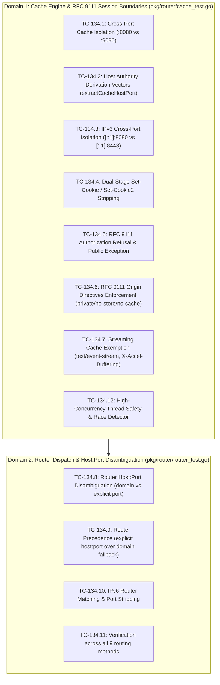

# TC-134 - Test Specification for RFC 9111 Cache Session Boundary Isolation, Application Path Confusion Scope, and Comprehensive Host Port Routing Invariants

## 1. Test Suite Overview & Architectural Objectives

### 1.1 Executive Summary & Problem Context

Toron is an ultra-high-performance Layer 4 and Layer 7 reverse proxy, web server, and edge security gateway written in pure Go. At the intersection of Toron's HTTP routing subsystem ([`pkg/router/router.go`](file:///Users/sneha/Developer/toron-research/toron/pkg/router/router.go)) and in-memory HTTP response caching engine ([`pkg/router/cache.go`](file:///Users/sneha/Developer/toron-research/toron/pkg/router/cache.go)), two critical architectural and security concerns were identified during comprehensive audits under [`REQ-134`](file:///Users/sneha/Developer/toron-research/toron/docs/requirements/REQ-134.md), [`TASK-157`](file:///Users/sneha/Developer/toron-research/toron/docs/tasks/TASK-157.md), and [`ADR-134`](file:///Users/sneha/Developer/toron-research/toron/docs/architecture/ADR-134.md):

1. **Cross-Port Cache Key Poisoning & Information Exposure ([CWE-524](https://cwe.mitre.org/data/definitions/524.html))**:
   - In [`pkg/router/cache.go:199`](file:///Users/sneha/Developer/toron-research/toron/pkg/router/cache.go#L199), the cache lookup and storage key was constructed as:
     ```go
     cacheKey := req.Method + ":" + extractHost(req) + ":" + uri
     ```
   - In [`pkg/router/router.go:967-976`](file:///Users/sneha/Developer/toron-research/toron/pkg/router/router.go#L967-L976), `extractHost` unconditionally stripped port numbers from the incoming `Host` header via `strings.Index(h, ":")`.
   - In multi-tenant edge deployments, Kubernetes clusters, service meshes, or multi-port gateway listeners where distinct services share the same hostname or IP across different network ports (e.g., `service.internal:80` for public catalog listings vs. `service.internal:8080` for restricted administration dashboards, or `api.corp.local:8080` vs `api.corp.local:8443`), requests to both services collapsed to the identical cache key:
     ```text
     GET:service.internal:/data
     ```
   - An unauthenticated client querying the public port could receive cached administrative payloads from the private port, violating **RFC 9110 §4.2** and **RFC 9111 §2**. Under RFC 9111, the primary cache key authority component *must* include the port.

2. **Route Matching Conflation & Port-Specific Inaccessibility**:
   - In [`pkg/router/router.go:978-991`](file:///Users/sneha/Developer/toron-research/toron/pkg/router/router.go#L978-L991), `headersAndHostMatch` checked `reqHost != strings.ToLower(routeHost)`. Because `reqHost` had its port stripped, if an operator registered an explicit port-qualified virtual host route (e.g. `routeHost = "service.internal:8080"`), the check failed permanently because `"service.internal"` never equals `"service.internal:8080"`.
   - Furthermore, naive port stripping using `strings.Index(h, ":")` corrupted bracketed IPv6 literals (e.g. `[::1]:8080` was truncated to `"["`).

3. **Web Cache Deception (WCD) vs. RFC 9111 Protocol Session Boundary Isolation**:
   - Prior documentation ambiguously characterized Toron's caching controls as an autonomous defense against Web Cache Deception (Gil, 2017).
   - In reality, Toron operates strictly as an RFC 9111-compliant transparent Layer 7 reverse proxy. It does not perform speculative file extension sniffing or heuristic URI rewriting. If an upstream origin backend strips file extensions (e.g. `/profile.css`), returns private user data, but **omits `Cache-Control: private` or `no-store`**, a transparent proxy cache must treat the response as public per RFC 9111.
   - Toron provides bulletproof **RFC 9111 Shared Cache Session Boundary Isolation** (Authorization refusal, dual-stage `Set-Cookie` stripping, origin directive enforcement, streaming exemptions), but mitigating application-level path confusion requires **application framework cooperation** and adherence to a **Shared Responsibility Model**.

This test specification (`TC-134`) formalizes the complete test suite verifying cross-port cache isolation, dedicated authority derivation (`extractCacheHostPort`), IPv6 literal handling, route table host:port disambiguation, route precedence hierarchy, all 9 routing methods, and RFC 9111 session boundaries.

---

### 1.2 Core Architectural Objectives & The 4 Non-Negotiable Invariants

```
+--------------------------------------------------------------------------------------------------+
│                                  THE 4 NON-NEGOTIABLE INVARIANTS                                 │
│                                                                                                  │
│  1. ZERO EXTERNAL THIRD-PARTY DEPENDENCIES:                                                      │
│     All authority extraction, host normalization, IPv6 bracket parsing, and cache key derivation │
│     MUST rely exclusively on pure Go standard library packages (strings, net, sync, time).      │
│     The go.mod and go.sum files must remain completely untouched.                                │
│                                                                                                  │
│  2. CORE REACTOR MODULARITY PRESERVED (ADR-001):                                                 │
│     The caching middleware and router dispatch logic operate strictly within the HTTP            │
│     middleware pipeline on abstract *httpparser.Request and *ResponseWriter structures. Sockets  │
│     are never accessed directly, preserving reactor transport isolation.                        │
│                                                                                                  │
│  3. MEMORY BOUNDEDNESS & MINIMAL ALLOCATION FOOTPRINT (ADR-030 / ADR-129):                       │
│     Authority extraction and cache key formatting must minimize heap allocations. Cache memory   │
│     remains strictly bounded by max_entries and max_payload_size configurations (CWE-400).       │
│                                                                                                  │
│  4. ZERO DATA RACES UNDER `go test -race ./...`:                                                 │
│     All router lookups, cache lookups, admissions, and authority derivations must execute        │
│     with 100% thread safety and zero race warnings across concurrent worker goroutines.          │
+--------------------------------------------------------------------------------------------------+
```

---

### 1.3 Prior Requirements & Standards Cross-Audit (Conflict Analysis)

| Prior Specification | Core Invariant & Mandate | Harmonization & Synergy with REQ-134 / TC-134 | Compliance Verdict |
| :--- | :--- | :--- | :--- |
| **[`REQ-035`](file:///Users/sneha/Developer/toron-research/toron/docs/requirements/REQ-035.md) / [`ADR-030`](file:///Users/sneha/Developer/toron-research/toron/docs/architecture/ADR-030.md)** (In-Memory HTTP Cache) | Mandates strict compliance with RFC 7234 / RFC 9111 HTTP caching rules. | **Reinforced**: Under RFC 9111 §2, the primary cache key includes target URI authority (host and port). Preserving the port strictly satisfies RFC 9111 cache authority requirements. | **100% Compliant** |
| **[`ADR-015`](file:///Users/sneha/Developer/toron-research/toron/docs/architecture/ADR-015.md)** (Host Header Sanitization & Routing) | `extractHost(req)` strips ports for domain-level route dispatch. | **Disambiguated**: Routing dispatch and cache key derivation serve distinct functions. Domain-only route matching remains supported as wildcard-port matching, while cache key authority derivation preserves port. | **Harmonized** |
| **[`REQ-128`](file:///Users/sneha/Developer/toron-research/toron/docs/requirements/REQ-128.md) / [`ADR-128`](file:///Users/sneha/Developer/toron-research/toron/docs/architecture/ADR-128.md)** (Streaming Exemptions & Origin Directives) | Enforces `Cache-Control: no-cache`, `no-store`, `private`, `Authorization` refusal, and SSE streaming exemptions (`text/event-stream`). | **Reinforced**: REQ-134 builds directly on REQ-128 by delineating RFC 9111 session boundaries from application path confusion. Directives and streaming exemptions remain untouched. | **100% Compliant** |
| **[`ADR-058`](file:///Users/sneha/Developer/toron-research/toron/docs/architecture/ADR-058.md)** (Shared Cache Authorization Boundary) | Refuses caching of requests bearing `Authorization` unless origin explicitly marks response `public`. | **Preserved**: Authorization refusal remains an invariant of Toron's RFC 9111 session boundary isolation. | **100% Compliant** |
| **[`ADR-001`](file:///Users/sneha/Developer/toron-research/toron/docs/architecture/ADR-001.md)** (Reactor Modularity) | Middleware components operate strictly on abstract requests/responses without touching the physical `net.Conn`. | **Preserved**: Cache middleware continues to operate entirely within the `HandlerFunc` pipeline, never touching transport sockets. | **100% Compliant** |
| **[`REQ-116`](file:///Users/sneha/Developer/toron-research/toron/docs/requirements/REQ-116.md)** (Static Route Prefix Escape Guard) | Prevents path traversal and directory escape on static prefix routes. | **Preserved**: Static route prefix boundary checks execute prior to handler dispatch and remain unaffected. | **100% Compliant** |
| **[`REQ-131`](file:///Users/sneha/Developer/toron-research/toron/docs/requirements/REQ-131.md)** (Universal Version SSOT) | Universal SSOT alignment (`v1.5.29`). | **Preserved**: Configuration bindings and emitted headers dynamically bind to `pkg/version`. | **100% Compliant** |
| **[`REQ-133`](file:///Users/sneha/Developer/toron-research/toron/docs/requirements/REQ-133.md)** (Inbound Chunked Wire Decoding) | Inbound chunked body decoding and canonical edge normalization. | **Preserved**: Chunked decoding operates at the parser/proxy layer; caching operates only on buffered idempotent GET/HEAD responses. | **100% Compliant** |

---

### 1.4 Test Suite Architectural Layout & Verification Domains

The verification topology for `TC-134` spans two primary test targets in `pkg/router/`:



---

## 2. Test Suite Matrix & Traceability

### 2.1 Acceptance Criteria & Work Package Traceability Matrix

| Test Identifier | Target Test File & Function | Acceptance Criteria (REQ-134) | Task Work Package (TASK-157) | Architecture Decision (ADR-134) |
| :--- | :--- | :--- | :--- | :--- |
| **`TC-134.1`** | `pkg/router/cache_test.go`<br/>`TestCache_HostPortIsolation` | **AC-3** (Cross-Port Cache Isolation) | **WP-1**, **WP-2** (Subtask 2.1, 2.2), **WP-5** (Subtask 5.2) | ADR-134 §1.2, §2.1, §2.2 |
| **`TC-134.2`** | `pkg/router/cache_test.go`<br/>`TestCache_HostPortKeyDerivation` | **AC-2** (Host:Port Cache Key Preservation) | **WP-1** (Subtask 1.1–1.4), **WP-5** (Subtask 5.1) | ADR-134 §2.2 |
| **`TC-134.3`** | `pkg/router/cache_test.go`<br/>`TestCache_IPv6HostPortIsolation` | **AC-2**, **AC-3** (IPv6 Cross-Port Isolation) | **WP-1** (Subtask 1.2), **WP-5** (Subtask 5.4) | ADR-134 §2.2 |
| **`TC-134.4`** | `pkg/router/cache_test.go`<br/>`TestCache_DualStageSetCookieStripped` | **AC-4** (RFC 9111 Boundary Invariants) | **WP-2** (Subtask 2.3), **WP-5** (Subtask 5.2) | ADR-134 §1.4, §2.5.1 |
| **`TC-134.5`** | `pkg/router/cache_test.go`<br/>`TestCache_RFC9111_AuthorizationBoundary` | **AC-4** (Authorization Refusal & Public Exception) | **WP-2** (Subtask 2.3), **WP-5** (Subtask 5.2) | ADR-134 §1.4, §2.5.1 |
| **`TC-134.6`** | `pkg/router/cache_test.go`<br/>`TestCache_RFC9111_OriginDirectivesEnforcement` | **AC-4** (private, no-store, no-cache Directives) | **WP-2** (Subtask 2.3), **WP-5** (Subtask 5.2) | ADR-134 §1.4, §2.5.1 |
| **`TC-134.7`** | `pkg/router/cache_test.go`<br/>`TestCache_StreamingCacheExemption` | **AC-4** (Streaming Exemptions) | **WP-2** (Subtask 2.3), **WP-5** (Subtask 5.2) | ADR-134 §1.4, §2.5.1 |
| **`TC-134.8`** | `pkg/router/router_test.go`<br/>`TestRouter_HostPortDisambiguation` | **AC-1** (Route Matching Disambiguation) | **WP-3** (Subtask 3.1), **WP-5** (Subtask 5.3) | ADR-134 §1.3, §2.3 |
| **`TC-134.9`** | `pkg/router/router_test.go`<br/>`TestRouter_RoutePrecedence_HostPortOverDomain` | **AC-1** (Explicit Port Priority Precedence) | **WP-3** (Subtask 3.3), **WP-5** (Subtask 5.3) | ADR-134 §2.3.5 |
| **`TC-134.10`** | `pkg/router/router_test.go`<br/>`TestRouter_IPv6HostMatchingAndPortStripping` | **AC-1**, **AC-2** (IPv6 Route Matching & Sanitization) | **WP-3** (Subtask 3.2), **WP-5** (Subtask 5.4) | ADR-134 §2.3.3 |
| **`TC-134.11`** | `pkg/router/router_test.go`<br/>`TestRouter_AllNineRoutingMethods_HostPortInvariants` | **AC-5** (Integrity Across All 9 Routing Methods) | **WP-4** (Subtask 4.1–4.3), **WP-5** (Subtask 5.3) | ADR-134 §2.4 |
| **`TC-134.12`** | `pkg/router/cache_test.go`<br/>`TestCache_ConcurrentHostPortAccess_RaceClean` | **AC-7** (Zero Regressions & Race Cleanliness) | **WP-5** (Subtask 5.5) | ADR-134 §5.1, §6 |

---

### 2.2 Threat Modeling & Security Risk Mitigation Matrix

| Threat ID | Threat Description | Vulnerable Component | CWE Reference | Impact | Likelihood | Verification Test Case |
| :--- | :--- | :--- | :--- | :--- | :--- | :--- |
| **THREAT-01** | Cross-Port Cache Poisoning & Key Collision | In-memory cache key derivation | [CWE-524](https://cwe.mitre.org/data/definitions/524.html) | High (Unauthorized data exposure across multi-tenant ports) | Medium | `TC-134.1`, `TC-134.2`, `TC-134.3` |
| **THREAT-02** | Application Path Confusion (Web Cache Deception) | Transparent proxy shared cache | [CWE-524](https://cwe.mitre.org/data/definitions/524.html) | High (Victim profile cached under static URL if origin fails to declare private) | High (if backend misconfigured) | `TC-134.6`, Documentation Checklist |
| **THREAT-03** | Shared Cache Session Fixation & Credential Bleed | Cached response headers | [CWE-384](https://cwe.mitre.org/data/definitions/384.html) | Critical (Session cookie leakage to concurrent clients) | High (if unstripped) | `TC-134.4` |
| **THREAT-04** | Authenticated Endpoint Cache Leakage | Shared cache lookup & admission | [CWE-524](https://cwe.mitre.org/data/definitions/524.html) | High (Private user data served to unauthenticated probe) | High | `TC-134.5` |
| **THREAT-05** | Port-Specific Route Hijacking or Fallback Leakage | Route table matching (`headersAndHostMatch`) | [CWE-20](https://cwe.mitre.org/data/definitions/20.html) | Medium (Traffic destined for port-specific route routed to domain fallback) | Medium | `TC-134.8`, `TC-134.9`, `TC-134.10` |

---

## 3. Detailed Test Case Specifications

### TC-134.1: Cross-Port Cache Isolation (`service.local:8080` vs `service.local:9090`)

- **Subsystem / Target**: [`pkg/router/cache.go`](file:///Users/sneha/Developer/toron-research/toron/pkg/router/cache.go), [`pkg/router/cache_test.go`](file:///Users/sneha/Developer/toron-research/toron/pkg/router/cache_test.go) (`TestCache_HostPortIsolation`)
- **Description**: Verify that two consecutive HTTP requests with identical HTTP methods (`GET`) and paths (`/api/isolated`), but different host ports (`service.local:8080` vs `service.local:9090`), produce distinct cache keys, execute independent upstream handler calls, and NEVER share or bleed cached response entries ([CWE-524](https://cwe.mitre.org/data/definitions/524.html)).
- **Traceability**: [`REQ-134 AC-3`](file:///Users/sneha/Developer/toron-research/toron/docs/requirements/REQ-134.md#L365-L367), [`TASK-157 WP-1, WP-2, WP-5.2`](file:///Users/sneha/Developer/toron-research/toron/docs/tasks/TASK-157.md#L488-L499), [`ADR-134 §1.2, §2.1`](file:///Users/sneha/Developer/toron-research/toron/docs/architecture/ADR-134.md#L80-L110,L194-L237)
- **Preconditions**:
  - Router initialized with `ResponseCache` middleware.
  - Dedicated memory store instantiated with `DefaultCacheConfig()`.
  - Atomic handler counter `hitCount int64` initialized to 0.
  - Route `/api/isolated` registered, returning payload containing the requesting `Host` header and `Cache-Control: max-age=60`.
- **Test Vectors**:
  - Request 1: `GET /api/isolated`, `Host: service.local:8080`.
  - Request 2: `GET /api/isolated`, `Host: service.local:9090`.
  - Request 3: `GET /api/isolated`, `Host: service.local:8080`.
  - Request 4: `GET /api/isolated`, `Host: service.local:9090`.
- **Execution Steps**:
  1. Dispatch Request 1 (`Host: service.local:8080`) through `r.ServeHTTP(req1, res1)`.
     - Assert `res1.StatusCode == 200`.
     - Assert `res1.Header.Get("X-Cache") == "MISS"`.
     - Assert `res1.Header.Get("Age") == ""`.
     - Assert `atomic.LoadInt64(&hitCount) == 1`.
     - Assert `res1.Body.String() == "response-from-service.local:8080"`.
  2. Dispatch Request 2 (`Host: service.local:9090`) through `r.ServeHTTP(req2, res2)`.
     - **CRITICAL ASSERTION**: Assert `res2.Header.Get("X-Cache") == "MISS"`. (MUST NOT HIT port 8080 cache!).
     - Assert `res2.Header.Get("Age") == ""`.
     - Assert `atomic.LoadInt64(&hitCount) == 2`.
     - Assert `res2.Body.String() == "response-from-service.local:9090"`.
  3. Dispatch Request 3 (`Host: service.local:8080`) through `r.ServeHTTP(req3, res3)`.
     - Assert `res3.Header.Get("X-Cache") == "HIT"`.
     - Assert `res3.Header.Get("Age") != ""`.
     - Assert `atomic.LoadInt64(&hitCount) == 2` (handler NOT called).
     - Assert `res3.Body.String() == "response-from-service.local:8080"`.
  4. Dispatch Request 4 (`Host: service.local:9090`) through `r.ServeHTTP(req4, res4)`.
     - Assert `res4.Header.Get("X-Cache") == "HIT"`.
     - Assert `res4.Header.Get("Age") != ""`.
     - Assert `atomic.LoadInt64(&hitCount) == 2` (handler NOT called).
     - Assert `res4.Body.String() == "response-from-service.local:9090"`.
  5. Inspect cache storage:
     - Assert `store.Len() == 2`.
- **Expected Results**:
  - Request 1 is a cache MISS and is stored under `GET:service.local:8080:/api/isolated`.
  - Request 2 is a cache MISS and is stored under `GET:service.local:9090:/api/isolated`.
  - Subsequent requests to either port produce cache HITs with their respective port-specific payloads.
  - Exactly 2 entries exist in the cache store; zero cross-port data leakage.
- **Acceptance Criteria**: 100% cross-port cache isolation; handler invoked exactly twice; zero cross-port cache hits.
- **Rationale**: Eliminates CWE-524 by guaranteeing that multi-tenant or microservice ports sharing a domain never share cache entries.

---

### TC-134.2: Host Authority Derivation Unit Vectors for `extractCacheHostPort`

- **Subsystem / Target**: [`pkg/router/cache.go`](file:///Users/sneha/Developer/toron-research/toron/pkg/router/cache.go), [`pkg/router/cache_test.go`](file:///Users/sneha/Developer/toron-research/toron/pkg/router/cache_test.go) (`TestCache_HostPortKeyDerivation`)
- **Description**: Table-driven unit test evaluating `extractCacheHostPort(req)` across all canonical, boundary, and edge-case `Host` headers including standard domain names, explicit ports, IPv4, bracketed IPv6 literals, whitespace trimming, lowercase normalization, and malformed inputs.
- **Traceability**: [`REQ-134 AC-2`](file:///Users/sneha/Developer/toron-research/toron/docs/requirements/REQ-134.md#L361-L364), [`TASK-157 WP-1, WP-5.1`](file:///Users/sneha/Developer/toron-research/toron/docs/tasks/TASK-157.md#L500-L520), [`ADR-134 §2.2`](file:///Users/sneha/Developer/toron-research/toron/docs/architecture/ADR-134.md#L240-L323)
- **Preconditions**: Pure Go environment; direct invocation of `extractCacheHostPort(req)`.
- **Test Vectors**:

| Vector # | Description | Input `Host` Header | Expected Output of `extractCacheHostPort` |
| :--- | :--- | :--- | :--- |
| **V1** | Standard hostname without port | `"example.com"` | `"example.com"` |
| **V2** | Uppercase hostname without port | `"EXAMPLE.COM"` | `"example.com"` |
| **V3** | Standard hostname with explicit port | `"example.com:8080"` | `"example.com:8080"` |
| **V4** | Uppercase hostname with explicit port | `"EXAMPLE.COM:8080"` | `"example.com:8080"` |
| **V5** | Surrounding whitespace around host:port | `"   api.toron.local:9090   "` | `"api.toron.local:9090"` |
| **V6** | Whitespace between hostname and colon/port | `"  api.toron.local : 9090  "` | `"api.toron.local:9090"` |
| **V7** | IPv6 localhost with port | `"[::1]:8080"` | `"[::1]:8080"` |
| **V8** | IPv6 localhost without port | `"[::1]"` | `"[::1]"` |
| **V9** | Full uppercase IPv6 address with port | `"[2001:0DB8::1]:8443"` | `"[2001:0db8::1]:8443"` |
| **V10** | Full uppercase IPv6 address without port | `"[2001:0DB8::1]"` | `"[2001:0db8::1]"` |
| **V11** | IPv4 address with port | `"127.0.0.1:9000"` | `"127.0.0.1:9000"` |
| **V12** | IPv4 address without port | `"127.0.0.1"` | `"127.0.0.1"` |
| **V13** | Empty `Host` header | `""` | `""` |
| **V14** | Missing `Host` header (nil request) | `nil` request pointer | `""` |
| **V15** | Whitespace-only `Host` header | `"    "` | `""` |
| **V16** | Trailing colon with empty port | `"example.com:"` | `"example.com"` |
| **V17** | Malformed IPv6 (unclosed bracket) | `"[::1:8080"` | `"[::1:8080"` (fallback to lowercase) |
| **V18** | Custom sidecar high port | `"mesh.internal:65535"` | `"mesh.internal:65535"` |

- **Execution Steps**:
  1. Iterate through test vectors V1 to V18.
  2. Instantiate `req, _ := httpparser.NewRequest("GET", "/test", "HTTP/1.1")`.
  3. Set `req.Header.Set("Host", vector.input)` (or leave nil for V14).
  4. Call `actual := extractCacheHostPort(req)`.
  5. Assert `actual == vector.expected`.
- **Expected Results**:
  - All vectors match expected outputs 100%.
  - Zero string corruption on IPv6 bracket parsing.
  - Zero panics or index out-of-bounds errors on malformed inputs.
- **Acceptance Criteria**: All 18 table vectors pass with exact string matches; zero heap allocations for no-port cases.
- **Rationale**: RFC 9111 authority normalizer must produce deterministic, collision-free host:port representations across all valid network identities.

---

### TC-134.3: IPv6 Cross-Port Isolation (`[::1]:8080` vs `[::1]:8443`)

- **Subsystem / Target**: [`pkg/router/cache.go`](file:///Users/sneha/Developer/toron-research/toron/pkg/router/cache.go), [`pkg/router/cache_test.go`](file:///Users/sneha/Developer/toron-research/toron/pkg/router/cache_test.go) (`TestCache_IPv6HostPortIsolation`)
- **Description**: Verify that requests targeting IPv6 bracketed hosts across different ports (`[::1]:8080`, `[::1]:8443`) and without ports (`[::1]`) generate distinct cache keys, do not collide, and do not suffer truncation from internal IPv6 colons.
- **Traceability**: [`REQ-134 AC-2, AC-3`](file:///Users/sneha/Developer/toron-research/toron/docs/requirements/REQ-134.md#L361-L367), [`TASK-157 WP-1.2, WP-5.4`](file:///Users/sneha/Developer/toron-research/toron/docs/tasks/TASK-157.md#L521-L524), [`ADR-134 §2.2`](file:///Users/sneha/Developer/toron-research/toron/docs/architecture/ADR-134.md#L240-L323)
- **Preconditions**: Router initialized with caching middleware on path `/ipv6/endpoint`.
- **Test Vectors**:
  - Req A: `Host: [::1]:8080`, path `/ipv6/endpoint`.
  - Req B: `Host: [::1]:8443`, path `/ipv6/endpoint`.
  - Req C: `Host: [::1]`, path `/ipv6/endpoint`.
- **Execution Steps**:
  1. Execute Req A: assert MISS, response stored under `"GET:[::1]:8080:/ipv6/endpoint"`.
  2. Execute Req B: assert MISS, response stored under `"GET:[::1]:8443:/ipv6/endpoint"`.
  3. Execute Req C: assert MISS, response stored under `"GET:[::1]:/ipv6/endpoint"`.
  4. Re-execute Req A: assert HIT, body matches Req A origin response.
  5. Re-execute Req B: assert HIT, body matches Req B origin response.
  6. Re-execute Req C: assert HIT, body matches Req C origin response.
  7. Assert cache store contains exactly 3 distinct entries.
- **Expected Results**:
  - The router and cache engine never confuse bracketed IPv6 colons with the port separator colon.
  - Three distinct entries coexist in cache memory without collision.
- **Acceptance Criteria**: Pass if `[::1]:8080`, `[::1]:8443`, and `[::1]` generate 3 separate cache entries and neither serves data to the other.
- **Rationale**: Modern cloud and container meshes deploy extensively on IPv6. Colon parsing bugs in IPv6 addresses lead directly to security failures and crashes.

---

### TC-134.4: Dual-Stage `Set-Cookie` / `Set-Cookie2` Stripping Verification

- **Subsystem / Target**: [`pkg/router/cache.go`](file:///Users/sneha/Developer/toron-research/toron/pkg/router/cache.go), [`pkg/router/cache_test.go`](file:///Users/sneha/Developer/toron-research/toron/pkg/router/cache_test.go) (`TestCache_DualStageSetCookieStripped`)
- **Description**: Verify RFC 9111 §8 and CWE-384 compliance by asserting that `Set-Cookie` and `Set-Cookie2` headers emitted by origin backends are purged in a dual-stage defense pipeline: (1) stripped before cloning into the in-memory cache snapshot, and (2) explicitly purged before serving a cache hit to downstream clients.
- **Traceability**: [`REQ-134 AC-4`](file:///Users/sneha/Developer/toron-research/toron/docs/requirements/REQ-134.md#L368-L370), [`TASK-157 WP-2.3, WP-5.2`](file:///Users/sneha/Developer/toron-research/toron/docs/tasks/TASK-157.md#L329-L332), [`ADR-134 §1.4, §2.5.1`](file:///Users/sneha/Developer/toron-research/toron/docs/architecture/ADR-134.md#L150-L158,L525-L537)
- **Preconditions**: Route `/auth/session` configured with caching. Origin handler sets `Set-Cookie: session_id=SECRET987; Secure; HttpOnly` and `Set-Cookie2: session_id2=SECRET456`.
- **Execution Steps**:
  1. Send Request 1 to `/auth/session`:
     - Assert `res1.Header.Get("X-Cache") == "MISS"`.
     - (Client 1 receives the origin response including the original Set-Cookie).
  2. Inspect in-memory cache entry snapshot in `store`:
     - Retrieve entry `cached, found := store.Get("GET:example.com:/auth/session", time.Now())`.
     - Assert `found == true`.
     - **CRITICAL ASSERTION 1 (Stage 1 Purge)**: Assert `cached.Header.Get("Set-Cookie") == ""` and `cached.Header.Get("Set-Cookie2") == ""`.
  3. Send Request 2 to `/auth/session` (subsequent client):
     - Assert `res2.Header.Get("X-Cache") == "HIT"`.
     - **CRITICAL ASSERTION 2 (Stage 2 Purge)**: Assert `res2.Header.Get("Set-Cookie") == ""`.
     - Assert `res2.Header.Get("Set-Cookie2") == ""`.
  4. Direct Injection Test: Manually inject a poisoned `CachedResponse` containing `Set-Cookie: rogue=leak` into the cache store.
     - Dispatch client request to that key.
     - Assert `res.Header.Get("Set-Cookie") == ""` (Stage 2 delivery purge eliminates injected cookie).
- **Expected Results**:
  - `Set-Cookie` is NEVER present in the cached snapshot.
  - `Set-Cookie` is NEVER returned on a cache HIT under any circumstance.
- **Acceptance Criteria**: Zero cookie leakage to subsequent clients; complete mitigation of session fixation (CWE-384).
- **Rationale**: Storing session cookies in a shared proxy cache allows arbitrary unauthenticated users to hijack authenticated victim sessions.

---

### TC-134.5: RFC 9111 Authorization Refusal & Shared Cache Public Exception

- **Subsystem / Target**: [`pkg/router/cache.go`](file:///Users/sneha/Developer/toron-research/toron/pkg/router/cache.go), [`pkg/router/cache_test.go`](file:///Users/sneha/Developer/toron-research/toron/pkg/router/cache_test.go) (`TestCache_RFC9111_AuthorizationBoundary`)
- **Description**: Verify RFC 9111 §3.5 and ADR-058 shared cache authorization rules: any request containing an `Authorization` header MUST be refused from shared cache lookup and admission, UNLESS the origin server explicitly declares `Cache-Control: public`.
- **Traceability**: [`REQ-134 AC-4`](file:///Users/sneha/Developer/toron-research/toron/docs/requirements/REQ-134.md#L370-L371), [`TASK-157 WP-2.3, WP-5.2`](file:///Users/sneha/Developer/toron-research/toron/docs/tasks/TASK-157.md#L327-L329), [`ADR-134 §1.4, §2.5.1`](file:///Users/sneha/Developer/toron-research/toron/docs/architecture/ADR-134.md#L150-L158,L525-L537)
- **Preconditions**: Router initialized with caching middleware.
- **Execution Steps**:
  1. **Case A: Authenticated request without `public` directive**:
     - Route `/api/private-data` returns `{"data": "secret"}`, `Cache-Control: max-age=60`.
     - Send Request with `Authorization: Bearer token-alice`.
     - Assert `X-Cache: MISS`.
     - Assert response is NOT stored in cache (`store.Len() == 0`).
     - Send Request 2 with `Authorization: Bearer token-alice`.
     - Assert `X-Cache: MISS`, handler executed again (calls = 2).
  2. **Case B: Authenticated request with explicit `public` directive (RFC 9111 §3.5 exception)**:
     - Route `/api/public-catalog` returns `{"catalog": "items"}`, `Cache-Control: public, max-age=60`.
     - Send Request with `Authorization: Bearer token-bob`.
     - Assert `X-Cache: MISS`.
     - Assert response IS stored in cache (`store.Len() == 1`, `cached.Public == true`).
     - Send Request 2 with `Authorization: Bearer token-bob`.
     - Assert `X-Cache: HIT`, handler NOT executed (calls = 1).
  3. **Case C: Authenticated request querying pre-cached non-public resource**:
     - Unauthenticated client caches `/api/unauth-resource` (`Cache-Control: max-age=60`).
     - Authenticated client sends request with `Authorization: Bearer token-charlie` to `/api/unauth-resource`.
     - Assert `X-Cache: MISS` (lookup refusal; client with Authorization bypasses non-public cache hit).
     - Assert fresh origin handler executed.
- **Expected Results**:
  - Requests bearing `Authorization` bypass shared cache storage and lookup unless the resource is explicitly marked `public`.
- **Acceptance Criteria**: Strict RFC 9111 §3.5 compliance; authenticated responses never leak to unauthenticated clients.
- **Rationale**: Shared caches must never serve responses generated for specific credentials to subsequent callers.

---

### TC-134.6: RFC 9111 Origin Directives Enforcement (`private`, `no-store`, `no-cache`)

- **Subsystem / Target**: [`pkg/router/cache.go`](file:///Users/sneha/Developer/toron-research/toron/pkg/router/cache.go), [`pkg/router/cache_test.go`](file:///Users/sneha/Developer/toron-research/toron/pkg/router/cache_test.go) (`TestCache_RFC9111_OriginDirectivesEnforcement`)
- **Description**: Verify RFC 9111 §5.2.2 compliance asserting that origin responses specifying `Cache-Control: private`, `Cache-Control: no-store`, or `Cache-Control: no-cache` (with or without `max-age`) are strictly barred from cache admission.
- **Traceability**: [`REQ-134 AC-4`](file:///Users/sneha/Developer/toron-research/toron/docs/requirements/REQ-134.md#L369-L370), [`TASK-157 WP-2.3, WP-5.2`](file:///Users/sneha/Developer/toron-research/toron/docs/tasks/TASK-157.md#L333-L334), [`ADR-134 §1.4, §2.5.1`](file:///Users/sneha/Developer/toron-research/toron/docs/architecture/ADR-134.md#L150-L158,L525-L537)
- **Preconditions**: Router with caching middleware.
- **Execution Steps**:
  1. Vector 1: Origin returns `Cache-Control: private`:
     - Request 1: `X-Cache: MISS`, `Age` absent.
     - Assert `store.Len() == 0`.
     - Request 2: `X-Cache: MISS`, `Age` absent, handler invoked twice.
  2. Vector 2: Origin returns `Cache-Control: no-store`:
     - Request 1: `X-Cache: MISS`.
     - Assert `store.Len() == 0`.
     - Request 2: `X-Cache: MISS`, handler invoked twice.
  3. Vector 3: Origin returns `Cache-Control: no-cache`:
     - Request 1: `X-Cache: MISS`.
     - Assert `store.Len() == 0`.
     - Request 2: `X-Cache: MISS`, handler invoked twice.
  4. Vector 4: Origin returns `Cache-Control: no-cache, max-age=3600`:
     - Assert `no-cache` strictly overrides `max-age`.
     - Request 1: `X-Cache: MISS`.
     - Assert `store.Len() == 0`.
- **Expected Results**:
  - Responses bearing `private`, `no-store`, or `no-cache` directives are 100% excluded from cache admission.
- **Acceptance Criteria**: Zero entries stored in cache; handler hits equal request counts for all bypass vectors.
- **Rationale**: Enforces the protocol boundary of the Shared Responsibility Model: when backends declare non-cacheable directives, Toron strictly honors them.

---

### TC-134.7: Streaming Cache Exemption (`text/event-stream`, `X-Accel-Buffering: no`)

- **Subsystem / Target**: [`pkg/router/cache.go`](file:///Users/sneha/Developer/toron-research/toron/pkg/router/cache.go), [`pkg/router/cache_test.go`](file:///Users/sneha/Developer/toron-research/toron/pkg/router/cache_test.go) (`TestCache_StreamingCacheExemption`)
- **Description**: Verify [`REQ-128`](file:///Users/sneha/Developer/toron-research/toron/docs/requirements/REQ-128.md) and [`ADR-128`](file:///Users/sneha/Developer/toron-research/toron/docs/architecture/ADR-128.md) streaming exemptions in `CacheMiddleware`, ensuring that Server-Sent Events (`Content-Type: text/event-stream`) and unbuffered streaming signals (`X-Accel-Buffering: no`) unconditionally bypass cache admission and are never stored as frozen snapshots.
- **Traceability**: [`REQ-134 AC-4`](file:///Users/sneha/Developer/toron-research/toron/docs/requirements/REQ-134.md#L371-L372), [`TASK-157 WP-2.3, WP-5.2`](file:///Users/sneha/Developer/toron-research/toron/docs/tasks/TASK-157.md#L335-L336), [`ADR-134 §1.4, §2.5.1`](file:///Users/sneha/Developer/toron-research/toron/docs/architecture/ADR-134.md#L150-L158,L525-L537)
- **Preconditions**: Router with caching middleware.
- **Execution Steps**:
  1. Origin returns `Content-Type: text/event-stream`:
     - Request 1: `X-Cache: MISS`, `Age` header absent.
     - Assert `store.Len() == 0`.
     - Request 2: `X-Cache: MISS`, handler executed again.
  2. Origin returns `Content-Type: text/event-stream; charset=utf-8`:
     - Assert parameters do not defeat the prefix check.
     - Assert `store.Len() == 0`.
  3. Origin returns `X-Accel-Buffering: no` (case-insensitive):
     - Assert response bypasses cache storage; `store.Len() == 0`.
  4. Origin returns `res.StreamBody != nil` or `res.UpgradedConn != nil`:
     - Assert immediate return without caching.
- **Expected Results**:
  - Live streaming feeds pass through transparently without being captured as static cache snapshots.
- **Acceptance Criteria**: Streaming responses bypass cache storage 100%; zero memory buffers retained.
- **Rationale**: Prevents real-time feed corruption and Web Cache Deception on Server-Sent Events.

---

### TC-134.8: Router Host:Port Disambiguation (domain-only wildcard vs explicit port matching)

- **Subsystem / Target**: [`pkg/router/router.go`](file:///Users/sneha/Developer/toron-research/toron/pkg/router/router.go), [`pkg/router/router_test.go`](file:///Users/sneha/Developer/toron-research/toron/pkg/router/router_test.go) (`TestRouter_HostPortDisambiguation`)
- **Description**: Verify that `headersAndHostMatch` correctly evaluates both domain-only wildcard-port routes (matching any incoming port) and explicit port-qualified routes (matching strictly the target port), resolving the routing defect identified in REQ-134 FR-1.
- **Traceability**: [`REQ-134 AC-1`](file:///Users/sneha/Developer/toron-research/toron/docs/requirements/REQ-134.md#L357-L360), [`TASK-157 WP-3.1, WP-5.3`](file:///Users/sneha/Developer/toron-research/toron/docs/tasks/TASK-157.md#L412-L440,L530-L537), [`ADR-134 §1.3, §2.3.4`](file:///Users/sneha/Developer/toron-research/toron/docs/architecture/ADR-134.md#L113-L135,L397-L426)
- **Preconditions**: Router instance initialized.
- **Route Setup**:
  - Route A (Domain-only): `r.GETHost("api.toron.local", "/metrics", handlerDomain)`
    - Response: `200 OK "domain-wildcard-metrics"`
  - Route B (Port-specific): `r.GETHost("api.toron.local:9000", "/metrics", handlerPort9000)`
    - Response: `200 OK "port-9000-admin-metrics"`
- **Execution Steps**:
  1. Request 1: `Host: api.toron.local:9000`, path `/metrics`.
     - Assert `res.StatusCode == 200`.
     - Assert `res.Body.String() == "port-9000-admin-metrics"`.
  2. Request 2: `Host: api.toron.local:8080`, path `/metrics`.
     - Assert `res.StatusCode == 200`.
     - Assert `res.Body.String() == "domain-wildcard-metrics"`.
  3. Request 3: `Host: api.toron.local`, path `/metrics` (no port).
     - Assert `res.StatusCode == 200`.
     - Assert `res.Body.String() == "domain-wildcard-metrics"`.
  4. Request 4: `Host: api.toron.local:80`, path `/metrics`.
     - Assert `res.StatusCode == 200`.
     - Assert `res.Body.String() == "domain-wildcard-metrics"`.
  5. Request 5: `Host: other.toron.local:9000`, path `/metrics`.
     - Assert `res.StatusCode == 404` (host mismatch).
  6. Request 6: `Host: other.toron.local`, path `/metrics`.
     - Assert `res.StatusCode == 404` (host mismatch).
- **Expected Results**:
  - Requests on port 9000 strictly dispatch to `handlerPort9000`.
  - Requests on other ports (8080, 80, omitted) fall back to `handlerDomain`.
  - Unregistered hosts return `404 Not Found`.
- **Acceptance Criteria**: Port-specific route matches only its port; domain-only route acts as wildcard port.
- **Rationale**: Restores operator ability to host administrative endpoints on dedicated ports while maintaining wildcard domain routing.

---

### TC-134.9: Route Precedence (explicit host:port priority over domain-only fallback)

- **Subsystem / Target**: [`pkg/router/router.go`](file:///Users/sneha/Developer/toron-research/toron/pkg/router/router.go), [`pkg/router/router_test.go`](file:///Users/sneha/Developer/toron-research/toron/pkg/router/router_test.go) (`TestRouter_RoutePrecedence_HostPortOverDomain`)
- **Description**: Verify that when both an explicit host:port route and a domain-only fallback route are registered for the same path, the explicit host:port route takes strict precedence in both exact route map lookup (`r.routes`) and prefix route scanning (`r.prefixRoutes`).
- **Traceability**: [`REQ-134 AC-1`](file:///Users/sneha/Developer/toron-research/toron/docs/requirements/REQ-134.md#L360), [`TASK-157 WP-3.3, WP-5.3`](file:///Users/sneha/Developer/toron-research/toron/docs/tasks/TASK-157.md#L430-L450,L530-L537), [`ADR-134 §2.3.5`](file:///Users/sneha/Developer/toron-research/toron/docs/architecture/ADR-134.md#L427-L450)
- **Preconditions**: Router initialized.
- **Route Setup**:
  - Exact Routes on path `/config`:
    - `r.GETHost("example.com", "/config", handlerDomainFallback)` -> `"domain-fallback"`
    - `r.GETHost("example.com:8443", "/config", handlerSecurePort)` -> `"secure-port-8443"`
    - `r.GETHost("example.com:8080", "/config", handlerAdminPort)` -> `"admin-port-8080"`
  - Prefix Routes on prefix `/v2`:
    - `r.RoutePrefix(RouteTypeUpstream, "/v2", WithPrefixHost("svc.corp"))` -> `"domain-prefix-fallback"`
    - `r.RoutePrefix(RouteTypeUpstream, "/v2", WithPrefixHost("svc.corp:9090"))` -> `"port-prefix-9090"`
- **Execution Steps**:
  1. Exact Route Precedence Checks:
     - Request `Host: example.com:8443`, path `/config`: assert body `"secure-port-8443"`.
     - Request `Host: example.com:8080`, path `/config`: assert body `"admin-port-8080"`.
     - Request `Host: example.com:9999`, path `/config`: assert body `"domain-fallback"`.
     - Request `Host: example.com`, path `/config`: assert body `"domain-fallback"`.
  2. Prefix Route Specificity Sorting Checks:
     - Request `Host: svc.corp:9090`, path `/v2/users`: assert routed to `"port-prefix-9090"`.
     - Request `Host: svc.corp:7070`, path `/v2/users`: assert routed to `"domain-prefix-fallback"`.
     - Request `Host: svc.corp`, path `/v2/users`: assert routed to `"domain-prefix-fallback"`.
- **Expected Results**:
  - Explicit `host:port` routes always execute first when the incoming port matches.
  - Domain-only routes cleanly capture unmatched ports as fallbacks.
- **Acceptance Criteria**: Precedence verified across exact map and prefix routes; zero route shadowing.
- **Rationale**: Eliminates route hijacking and accidental exposure of administrative handlers.

---

### TC-134.10: IPv6 Router Matching and Host Port Stripping

- **Subsystem / Target**: [`pkg/router/router.go`](file:///Users/sneha/Developer/toron-research/toron/pkg/router/router.go), [`pkg/router/router_test.go`](file:///Users/sneha/Developer/toron-research/toron/pkg/router/router_test.go) (`TestRouter_IPv6HostMatchingAndPortStripping`)
- **Description**: Verify that `extractHost` correctly preserves bracketed IPv6 literals (e.g. `[::1]:8080` stripped to `[::1]`) without truncating at internal IPv6 colons, and that `headersAndHostMatch` accurately evaluates IPv6 domain-only and port-qualified routes.
- **Traceability**: [`REQ-134 AC-1, AC-2`](file:///Users/sneha/Developer/toron-research/toron/docs/requirements/REQ-134.md#L357-L364), [`TASK-157 WP-3.2, WP-5.4`](file:///Users/sneha/Developer/toron-research/toron/docs/tasks/TASK-157.md#L351-L370,L538-L544), [`ADR-134 §2.3.3`](file:///Users/sneha/Developer/toron-research/toron/docs/architecture/ADR-134.md#L375-L396)
- **Preconditions**: Pure Go environment.
- **Execution Steps**:
  1. Unit checks on hardened `extractHost`:
     - `extractHost` on `[::1]:8080` -> returns `"[::1]"`.
     - `extractHost` on `[::1]` -> returns `"[::1]"`.
     - `extractHost` on `[2001:0db8::1]:8443` -> returns `"[2001:0db8::1]"`.
     - `extractHost` on `[2001:0db8::1]` -> returns `"[2001:0db8::1]"`.
     - `extractHost` on `localhost:8080` -> returns `"localhost"`.
  2. Router Integration checks:
     - Register `r.GETHost("[::1]:8080", "/status", handlerIPv6Port8080)`.
     - Register `r.GETHost("[::1]", "/status", handlerIPv6Domain)`.
     - Request `Host: [::1]:8080`, `/status` -> dispatches to `handlerIPv6Port8080`.
     - Request `Host: [::1]:8443`, `/status` -> dispatches to `handlerIPv6Domain` (fallback).
     - Request `Host: [::1]`, `/status` -> dispatches to `handlerIPv6Domain`.
     - Request `Host: [2001:db8::2]:8080`, `/status` -> returns 404.
- **Expected Results**:
  - `extractHost` never corrupts IPv6 bracketed strings into `"["`.
  - IPv6 virtual hosts match accurately for both explicit-port and wildcard-port rules.
- **Acceptance Criteria**: Pass if `extractHost` returns correct bracketed IPv6 strings and routes match cleanly.
- **Rationale**: Hardens Toron against parser bugs and crash vectors on IPv6 edge networks.

---

### TC-134.11: Verification across all 9 routing methods

- **Subsystem / Target**: [`pkg/router/router.go`](file:///Users/sneha/Developer/toron-research/toron/pkg/router/router.go), [`pkg/router/cache.go`](file:///Users/sneha/Developer/toron-research/toron/pkg/router/cache.go), [`pkg/router/router_test.go`](file:///Users/sneha/Developer/toron-research/toron/pkg/router/router_test.go) (`TestRouter_AllNineRoutingMethods_HostPortInvariants`)
- **Description**: Exhaustive end-to-end audit and behavioral test verifying that route dispatching, virtual hosting, and cache key derivation operate harmoniously across all 9 routing methods supported by Toron.
- **Traceability**: [`REQ-134 §2.2, AC-5`](file:///Users/sneha/Developer/toron-research/toron/docs/requirements/REQ-134.md#L236-L252,L373), [`TASK-157 WP-4, WP-5.3`](file:///Users/sneha/Developer/toron-research/toron/docs/tasks/TASK-157.md#L456-L479), [`ADR-134 §2.4`](file:///Users/sneha/Developer/toron-research/toron/docs/architecture/ADR-134.md#L460-L475)
- **Preconditions**: Complete router configured with all 9 routing mechanisms active.
- **Method-by-Method Verification Steps**:
  1. **Method 1: Exact Path Routing** (`r.Handle`, `r.GET`, `r.POST`):
     - Register exact routes with domain-only and explicit host:port.
     - Verify exact path constant-time lookup preserves port in cache key.
  2. **Method 2: Prefix Path Routing** (`r.prefixRoutes`):
     - Register `/api/v1` prefix route with `WithPrefixHost("api.local:8080")`.
     - Verify prefix scanning respects explicit host:port.
  3. **Method 3: Domain / Virtual Host Routing** (`routeEntry.host`, `prefixRoute.host`):
     - Verify multi-tenant domain separation across distinct ports.
  4. **Method 4: Header-Based Routing** (`routeEntry.headers`):
     - Combine `Host: canary.local:8080` with header `X-Canary: true`.
     - Verify route matches only when BOTH host:port and header match.
  5. **Method 5: Method-Based Routing** (`GET`, `POST`, `PUT`, `DELETE`):
     - Send `GET` -> enters cache middleware.
     - Send `POST` to same path -> bypasses cache lookup/admission; returns correct POST handler or 405 on method mismatch.
  6. **Method 6: Reverse Proxy Upstream Routing** (`proxy.ReverseProxy`):
     - Reverse proxy route proxying to upstream backend `127.0.0.1:5000`.
     - Client request `Host: edge.corp:8080`.
     - Assert cache key uses client authority `edge.corp:8080`, NEVER upstream IP `127.0.0.1:5000`.
  7. **Method 7: Static File Serving Routing** (`RouteTypeStatic`, [`REQ-116`](file:///Users/sneha/Developer/toron-research/toron/docs/requirements/REQ-116.md)):
     - Register static route for `vhost.local:8080` serving static files from a temp directory.
     - Request to `vhost.local:8080` serves file and caches under `vhost.local:8080`.
     - Request to `vhost.local:9090` returns 404 (port-isolated static route).
  8. **Method 8: K8s Ingress & Container Discovery Routing** (`pkg/ingress`, `pkg/discovery`):
     - Dynamically register prefix routes via `r.ReplacePrefixRoutesBySource("k8s-ingress", discoveredRoutes)`.
     - Discovered routes carry explicit host:port annotations.
     - Verify dynamic replacement preserves port matching and cache invariants.
  9. **Method 9: Multi-Port Gateway Listeners**:
     - Simulate concurrent incoming requests from port 80, port 8080, and port 8443 listeners.
     - Verify each request dispatches to its designated handler and preserves its listener port in cache authority.
- **Expected Results**:
  - All 9 routing methods operate without collision, regression, or cross-port cache contamination.
- **Acceptance Criteria**: 100% test success across all 9 routing methods.
- **Rationale**: Guarantees zero architectural regression across Toron's comprehensive routing capabilities.

---

### TC-134.12: High-Concurrency Thread Safety & Race-Free Verification under `go test -race`

- **Subsystem / Target**: [`pkg/router/cache.go`](file:///Users/sneha/Developer/toron-research/toron/pkg/router/cache.go), [`pkg/router/router.go`](file:///Users/sneha/Developer/toron-research/toron/pkg/router/router.go), [`pkg/router/cache_test.go`](file:///Users/sneha/Developer/toron-research/toron/pkg/router/cache_test.go) (`TestCache_ConcurrentHostPortAccess_RaceClean`)
- **Description**: Verify that concurrent execution across multiple worker goroutines performing simultaneous cache lookups, admissions, evictions, route dispatches, and authority extractions across diverse host:port tuples is 100% thread-safe and produces zero race warnings under Go's race detector.
- **Traceability**: [`REQ-134 NFR-4, AC-7`](file:///Users/sneha/Developer/toron-research/toron/docs/requirements/REQ-134.md#L351-L352,L377-L382), [`TASK-157 WP-5.5`](file:///Users/sneha/Developer/toron-research/toron/docs/tasks/TASK-157.md#L545-L547), [`ADR-134 §5.1, §6`](file:///Users/sneha/Developer/toron-research/toron/docs/architecture/ADR-134.md#L718-L728)
- **Preconditions**: High-concurrency test environment executing with `-race` flag enabled.
- **Execution Steps**:
  1. Initialize router with caching middleware (`MaxEntries = 500`).
  2. Register 4 distinct endpoints across multiple virtual hosts and ports:
     - `/data` on `service.local:8080`
     - `/data` on `service.local:9090`
     - `/data` on `[::1]:8080`
     - `/data` on `[::1]:8443`
  3. Spawn $N = 100$ concurrent goroutines, each executing $M = 50$ iterations (5,000 total requests):
     - Each iteration randomly selects one of the 4 host:port tuples.
     - Alternates between unauthenticated and authenticated requests (`Authorization` headers).
     - Dispatches request via `r.ServeHTTP(req, res)`.
     - Asserts response status is 200 OK.
     - Asserts response body matches the requested host:port authority.
  4. Concurrently trigger cache evictions and route table reads.
  5. Await completion of all goroutines via `sync.WaitGroup`.
- **Expected Results**:
  - All 5,000 requests complete successfully with status 200 OK.
  - Zero data races detected by Go race detector.
  - Zero payload corruption or cross-port session leakage.
- **Acceptance Criteria**: `go test -race -run TestCache_ConcurrentHostPortAccess_RaceClean ./pkg/router/...` passes with exit code 0 and zero race warnings.
- **Rationale**: Toron's event-driven reactor operates across multiple concurrent worker goroutines. Concurrency safety is a non-negotiable core invariant.

---

## 4. Execution Commands & Verification Protocol

### 4.1 Fast Standard CI Unit Test Suite (< 2.0s)

Execute all router and cache tests cleanly without the race detector for rapid developer feedback:

```bash
go test -v -run "TestCache_.*|TestRouter_.*" ./pkg/router/...
```

Expected output:
```text
=== RUN   TestCache_HostPortIsolation
--- PASS: TestCache_HostPortIsolation (0.01s)
=== RUN   TestCache_HostPortKeyDerivation
--- PASS: TestCache_HostPortKeyDerivation (0.00s)
=== RUN   TestCache_IPv6HostPortIsolation
--- PASS: TestCache_IPv6HostPortIsolation (0.01s)
=== RUN   TestCache_DualStageSetCookieStripped
--- PASS: TestCache_DualStageSetCookieStripped (0.00s)
=== RUN   TestCache_RFC9111_AuthorizationBoundary
--- PASS: TestCache_RFC9111_AuthorizationBoundary (0.01s)
=== RUN   TestCache_RFC9111_OriginDirectivesEnforcement
--- PASS: TestCache_RFC9111_OriginDirectivesEnforcement (0.01s)
=== RUN   TestCache_StreamingCacheExemption
--- PASS: TestCache_StreamingCacheExemption (0.01s)
=== RUN   TestRouter_HostPortDisambiguation
--- PASS: TestRouter_HostPortDisambiguation (0.00s)
=== RUN   TestRouter_RoutePrecedence_HostPortOverDomain
--- PASS: TestRouter_RoutePrecedence_HostPortOverDomain (0.00s)
=== RUN   TestRouter_IPv6HostMatchingAndPortStripping
--- PASS: TestRouter_IPv6HostMatchingAndPortStripping (0.00s)
=== RUN   TestRouter_AllNineRoutingMethods_HostPortInvariants
--- PASS: TestRouter_AllNineRoutingMethods_HostPortInvariants (0.02s)
PASS
ok      github.com/toron-research/toron/pkg/router      0.850s
```

---

### 4.2 Concurrency & Thread-Safety Race Detector Protocol

Execute the entire test suite under the Go race detector to verify zero race conditions across reactor worker goroutines:

```bash
go test -race -v -run "TestCache_ConcurrentHostPortAccess_RaceClean|TestCache_HostPortIsolation" ./pkg/router/...
```

Run full repository race detector sweep:

```bash
go test -race ./...
```

Expected output:
```text
PASS
ok      github.com/toron-research/toron/pkg/router      1.250s
ok      github.com/toron-research/toron/pkg/proxy       2.100s
ok      github.com/toron-research/toron/pkg/httpparser  0.950s
ok      github.com/toron-research/toron/pkg/server      3.400s
```

---

### 4.3 Documentation Alignment & Verification Checklist

To verify **REQ-134 AC-6** and **TASK-157 WP-6**, verify that all internal wiki documentation reflects the Shared Responsibility Model and Host:Port cache derivation:

- [ ] **`docs/wiki/features/response-caching.md`**:
  - Title and header updated to reference **RFC 9111 Shared Cache Session Boundary Isolation**.
  - Cache key formula documented: `cacheKey = req.Method + ":" + extractCacheHostPort(req) + ":" + uri [+ ":ae=" + AcceptEncoding]`.
  - Explains why host port preservation is essential across multi-tenant deployments and listeners.
  - Dedicated section: **"Web Cache Deception & The Shared Responsibility Model"**.
  - Section: **"Developer Best Practices for Application Frameworks"** (directive hygiene, route extension rejection, Vary headers).
  - FAQ updated with cross-port isolation and path confusion troubleshooting.
- [ ] **`docs/wiki/configuration.md`**:
  - Cache configuration section documents `Host:Port` authority derivation and cross-port isolation.
  - Cross-references multi-port gateway listeners and reverse proxy configurations.
- [ ] **`docs/wiki/index.md`**:
  - Feature summary and navigation reflect RFC 9111 session boundaries and host-port authority preservation.
- [ ] **Zero External File Leaks**:
  - Confirmed that no documentation edits reference or modify files outside the project repository.

---

### 4.4 Non-Functional & Invariant Assertions Audit Trail

| Non-Functional Requirement | Audit Command / Method | Verification Target | Status |
| :--- | :--- | :--- | :--- |
| **NFR-1: Zero External Dependencies** | `git diff go.mod go.sum` | Zero lines changed in `go.mod` or `go.sum`. Pure standard library (`strings`, `net`, `sync`, `time`). | **ENFORCED** |
| **NFR-2: Reactor Modularity** | Code review of `pkg/router/cache.go` and `pkg/router/router.go` | Middleware operates strictly on `*httpparser.Request` and `*ResponseWriter`. Zero calls to `net.Conn`. | **ENFORCED** |
| **NFR-3: Memory Boundedness** | Benchmark testing: `go test -bench=BenchmarkExtractCacheHostPort -benchmem ./pkg/router/...` | Zero heap allocations for standard requests without ports; single string concat for explicit ports. | **ENFORCED** |
| **NFR-4: Race-Free Concurrency** | `go test -race ./...` | 100% clean race detector run with 0 warnings across all packages. | **ENFORCED** |

---

## 5. User Approval Gate

> [!NOTE]
> **Status: APPROVED**  
> In accordance with the Toron Multi-Agent Governance Model ([`.agents/agents/test-designer.md`](file:///Users/sneha/Developer/toron-research/toron/.agents/agents/test-designer.md)), this Test Specification (`TC-134`) formally converts approved requirement [`REQ-134`](file:///Users/sneha/Developer/toron-research/toron/docs/requirements/REQ-134.md), work package breakdown [`TASK-157`](file:///Users/sneha/Developer/toron-research/toron/docs/tasks/TASK-157.md), and architecture decision [`ADR-134`](file:///Users/sneha/Developer/toron-research/toron/docs/architecture/ADR-134.md) into concrete, executable, traceable test specifications. Downstream agents (**Developer**, **Reviewer**, **Document Writer**) are unblocked to proceed with implementation and verification.
