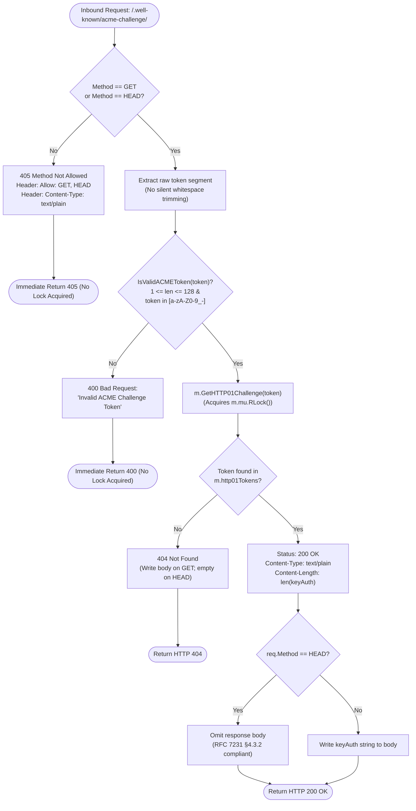

# 🔒 ACME Zero-Touch Production SSL & Protocol Hardening (`pkg/acme`)

Toron features a fully automated, zero-touch ACME (Automated Certificate Management Environment, [RFC 8555](https://datatracker.ietf.org/doc/html/rfc8555)) client engine with built-in HTTP-01 and TLS-ALPN-01 challenge responders, automatic background renewal, and on-disk certificate persistence.

---

## 🌟 Key Features

* **Zero External Dependencies**: Implemented strictly using Go standard library cryptography (`crypto/ecdsa`, `crypto/tls`, `crypto/x509`, `crypto/sha256`) and pure standard library HTTP networking.
* **HTTP-01 Challenge Responder**: Responds to Let's Encrypt automated challenge validation requests under `/.well-known/acme-challenge/<token>`.
* **TLS-ALPN-01 Challenge Responder**: Supports cleartext-free validation over port 443 using TLS ALPN negotiation (`acme-tls/1`) and id-pe-acmeIdentifier extension (`1.3.6.1.5.5.7.1.31`).
* **Hardened RFC 8555 Token Validation ([`SEC-38`](file:///Users/sneha/Developer/toron-research/toron/SECURITY_AUDIT.md#L539-L561))**: Zero-allocation single-pass byte scanner rejecting malformed tokens, traversal dots, whitespace, and padding before internal lock acquisition.
* **HTTP Method Hardening ([RFC 7231 §6.5.5](https://datatracker.ietf.org/doc/html/rfc7231#section-6.5.5))**: Rejects unauthorized HTTP methods with `405 Method Not Allowed` and mandatory `Allow: GET, HEAD` headers.
* **RFC 7231 §4.3.2 Compliant HEAD Probing**: Supports lightweight automated CA status checks via `HEAD` returning exact `Content-Length` with empty body.
* **Automatic Background Renewal**: Continuously monitors certificate expiration and initiates automated renewal 30 days prior to expiry without downtime.

---

## ⚙️ Configuration Reference (`config.yaml`)

Configure ACME under the `server.acme` section in `config.yaml`:

```yaml
server:
  host: "0.0.0.0"
  port: 8443
  tls:
    enabled: true

  # ACME Automated Production Certificate Management
  acme:
    enabled: true
    directory_url: "https://acme-v02.api.letsencrypt.org/directory" # Let's Encrypt production directory
    email: "admin@example.com"                                      # Notification contact email
    domains:
      - "example.com"
      - "api.example.com"
    cache_dir: "./certs/acme"                                       # Directory for cached certificates & account keys
    challenge_type: "http-01"                                       # "http-01" or "tls-alpn-01"
```

### Let's Encrypt Staging Environment (Testing)

For development and staging validation without hitting production Let's Encrypt rate limits, configure the ACME staging directory:

```yaml
server:
  acme:
    enabled: true
    directory_url: "https://acme-staging-v02.api.letsencrypt.org/directory"
    email: "test@example.com"
    domains:
      - "staging.example.com"
    cache_dir: "./certs/acme-staging"
    challenge_type: "http-01"
```

---

## 🛡️ HTTP-01 Challenge Protocol Hardening ([`SEC-38`])

### Threat Model & Vulnerability Remediation (CWE-20 / CWE-400 / CWE-703)

Prior to the remediation of [`SEC-38`](file:///Users/sneha/Developer/toron-research/toron/SECURITY_AUDIT.md#L539-L561) ([`REQ-100`](file:///Users/sneha/Developer/toron-research/toron/docs/requirements/REQ-100.md), [`ADR-100`](file:///Users/sneha/Developer/toron-research/toron/docs/architecture/ADR-100.md), [`TASK-123`](file:///Users/sneha/Developer/toron-research/toron/docs/tasks/TASK-123.md)), the HTTP-01 challenge responder in `pkg/acme/acme.go` accepted arbitrary string inputs from external callers, silently masked whitespace, permitted non-idempotent verbs, wrote bodies on `HEAD` requests, and acquired internal read locks on unvalidated requests.

The hardened implementation establishes six concrete security guarantees:

1. **Zero-Allocation RFC 8555 Base64URL Validation (`IsValidACMEToken`)**:
   [`IsValidACMEToken(token string) bool`](file:///Users/sneha/Developer/toron-research/toron/pkg/acme/acme.go#L202-L218) enforces that every challenge token conforms strictly to the unpadded base64url character set:
   $$\text{Alphabet} = \{ \text{'a'-'z'}, \text{'A'-'Z'}, \text{'0'-'9'}, \text{'-'}, \text{'_'} \}$$
   Tokens containing base64 padding (`=`), path separators (`/`, `\`), path traversal patterns (`..`), whitespace (`' '`, `\t`, `\r`, `\n`), control characters (`0x00`-`0x1F`), or UTF-8 multi-byte characters are rejected.
2. **Length Boundary Bounds ($1 \le \text{len} \le 128$)**:
   Token lengths are clamped to a minimum of 1 character and a maximum of 128 characters. Empty tokens or oversized inputs immediately trigger `400 Bad Request`.
3. **No Silent Whitespace Sanitization**:
   The legacy `strings.TrimSpace(token)` call was removed. Tokens with whitespace fail validation and return `400 Bad Request: Invalid ACME Challenge Token`.
4. **HTTP Method Hardening**:
   Only `GET` and `HEAD` requests are permitted. Any other method (`POST`, `PUT`, `DELETE`, `PATCH`, `OPTIONS`, `CONNECT`, `TRACE`) receives `405 Method Not Allowed` with `Allow: GET, HEAD` and `Content-Type: text/plain`.
5. **Fail-Fast Lock Isolation**:
   Method and token validation execute prior to calling `m.GetHTTP01Challenge(token)`. Malformed requests never acquire reader locks (`m.mu.RLock()`) or calculate map hashes, neutralizing hash flooding DoS attempts.
6. **RFC 7231 Compliant HEAD Responses**:
   `HEAD` requests return `200 OK` with exact `Content-Length` and headers while omitting the response body (`res.Body.Len() == 0`). Valid unregistered tokens return `404 Not Found`.

---

## 🔄 ACME Challenge Request Lifecycle



---

## 🧪 Testing and Verification

To verify the ACME challenge responder and token validation locally:

```bash
# 1. Valid Token GET (200 OK with key authorization)
curl -i http://localhost:8443/.well-known/acme-challenge/valid_token_123

# 2. Valid Token HEAD (200 OK with Content-Length, empty body)
curl -I http://localhost:8443/.well-known/acme-challenge/valid_token_123

# 3. Invalid Method POST (405 Method Not Allowed with Allow: GET, HEAD)
curl -i -X POST http://localhost:8443/.well-known/acme-challenge/valid_token_123

# 4. Malformed Token with Padding (400 Bad Request)
curl -i http://localhost:8443/.well-known/acme-challenge/token_with_padding=

# 5. Path Traversal Token (400 Bad Request)
curl -i http://localhost:8443/.well-known/acme-challenge/../etc/passwd
```

---

## 🔗 Related Documentation & Code References

* [`ACMEManager`](file:///Users/sneha/Developer/toron-research/toron/pkg/acme/acme.go#L35) – Core ACME manager struct in [`pkg/acme/acme.go`](file:///Users/sneha/Developer/toron-research/toron/pkg/acme/acme.go).
* [`IsValidACMEToken`](file:///Users/sneha/Developer/toron-research/toron/pkg/acme/acme.go#L202-L218) – Zero-allocation RFC 8555 token validation function.
* [`ServeHTTP01Handler`](file:///Users/sneha/Developer/toron-research/toron/pkg/acme/acme.go#L222-L262) – Hardened HTTP-01 challenge responder handler.
* [`acme_test.go`](file:///Users/sneha/Developer/toron-research/toron/pkg/acme/acme_test.go) – Automated test suite for HTTP-01 and TLS-ALPN-01 responders (`TC-100`).
* [`SEC-38`](file:///Users/sneha/Developer/toron-research/toron/SECURITY_AUDIT.md#L539-L561) – Security audit finding record for ACME token syntax and method validation.
* [`REQ-100`](file:///Users/sneha/Developer/toron-research/toron/docs/requirements/REQ-100.md) – Requirement specification for ACME token syntax validation and method hardening.
* [`ADR-100`](file:///Users/sneha/Developer/toron-research/toron/docs/architecture/ADR-100.md) – Architectural Decision Record for ACME token validation.
* [`TC-100`](file:///Users/sneha/Developer/toron-research/toron/docs/testCases/TC-100.md) – Test specification and automated verification suite for SEC-38.
* [`CR-096`](file:///Users/sneha/Developer/toron-research/toron/docs/codeReview/CR-096.md) – Code review report approving SEC-38 remediation.
* [`SR-100`](file:///Users/sneha/Developer/toron-research/toron/docs/securityReview/SR-100.md) – Security review report assessing SEC-38 remediation.
