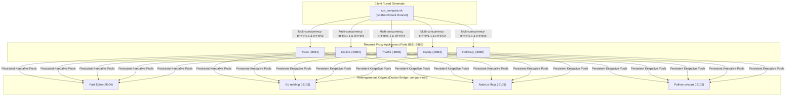

# Multi-Proxy Differential Docker Benchmark Suite (`benchmarks/docker-compare`)

## 1. Overview & Motivation

The **Multi-Proxy Differential Docker Benchmark Suite** ([`REQ-121`](file:///Users/sneha/Developer/toron-research/toron/docs/requirements/REQ-121.md), [`ADR-121`](file:///Users/sneha/Developer/toron-research/toron/docs/architecture/ADR-121.md), [`TASK-144`](file:///Users/sneha/Developer/toron-research/toron/docs/tasks/TASK-144.md)) delivers an automated, containerized benchmarking testbed comparing **Toron** against major production reverse proxies under identical network topology, connection pooling, and heterogeneous upstream runtime conditions:
1. **Toron (v1.0.0)** (Go event-driven zero-dependency edge gateway)
2. **NGINX (Alpine)** (C-based asynchronous multi-process reverse proxy)
3. **Traefik (v3.1)** (Go-based cloud-native edge router)
4. **Caddy (Alpine)** (Go-based memory-safe modern web server)
5. **HAProxy (Alpine)** (C-based event-driven high-performance load balancer)

All 5 proxies front the **exact same heterogeneous upstream origin runtimes** in an isolated Docker Compose network (`compare-net`):
- **Node.js 20 LTS** (`node-origin:9101`, C-based `llhttp` parser engine)
- **Python 3.11** (`python-origin:9102`, `ThreadingHTTPServer` / `uvicorn` runtime)
- **Go 1.24** (`go-origin:9103`, canonical standard library `net/http` engine)
- **Fast Echo** (`fast-origin:9104`, ultra-low latency Go origin for raw proxy transit latency and saturation benchmarking)

---

## 2. System Architecture & Topology



---

## 3. Quick Start & Execution Commands

### Run Full Comparative Benchmark
```bash
# Execute standard benchmark across all 5 proxies and 4 backends
make benchmark-compare

# Or directly with custom concurrency and duration:
./benchmarks/docker-compare/run_compare.sh -c 100 -d 10s
```

### Pre-Flight Functional Route Checks Only
```bash
./benchmarks/docker-compare/run_compare.sh --preflight-only
```

### Clean Up & Stop Benchmark Containers
```bash
make benchmark-compare-clean
# or
./benchmarks/docker-compare/run_compare.sh --down
```

---

## 4. CLI Options & Configuration Flags

| Flag | Default | Description |
|:---|:---|:---|
| `-c <conns>` | `50` | Number of concurrent worker connections |
| `-d <duration>` | `5s` | Benchmark duration per proxy/backend combination |
| `-r <rate>` | `0` | Target request rate in RPS (0 = unthrottled maximum throughput) |
| `--proxies <list>` | `toron,nginx,traefik,caddy,haproxy` | Comma-separated list of proxies to benchmark |
| `--backends <list>` | `fast,go,node,python` | Comma-separated list of upstream backends to test |
| `--preflight-only` | `false` | Verify connectivity across all 20 combinations without running load |
| `--build` | `false` | Force rebuild of Docker images before running |
| `--down` | `false` | Tear down all benchmark containers and networks |
| `--no-history` | `false` | Skip recording session into `manifest.json` |

---

## 5. Port Allocations

All ports are intentionally mapped outside the commonly used `8080-8085` range to avoid conflicts with active local services:

| Service | Container Name | Host Port | Container Port | Routing Rule |
|:---|:---|:---|:---|:---|
| **Toron** | `toron-cmp-toron` | `8881` | `8080` | `/node/*`, `/python/*`, `/go/*`, `/fast/*` |
| **NGINX** | `toron-cmp-nginx` | `8882` | `80` | `/node/*`, `/python/*`, `/go/*`, `/fast/*` |
| **Traefik** | `toron-cmp-traefik` | `8883` | `80` (API: `8880`) | `/node/*`, `/python/*`, `/go/*`, `/fast/*` |
| **Caddy** | `toron-cmp-caddy` | `8884` | `80` | `/node/*`, `/python/*`, `/go/*`, `/fast/*` |
| **HAProxy** | `toron-cmp-haproxy` | `8885` | `80` | `/node/*`, `/python/*`, `/go/*`, `/fast/*` |

---

## 6. Output Artifacts & Retention Tier

Every benchmark run produces:
- **Canonical Markdown Report**: [`benchmarks/results/docker_compare_report.md`](file:///Users/sneha/Developer/toron-research/toron/benchmarks/results/docker_compare_report.md)
- **Canonical JSON Report**: [`benchmarks/results/docker_compare_report.json`](file:///Users/sneha/Developer/toron-research/toron/benchmarks/results/docker_compare_report.json)
- **Historical Snapshot Archive**: `benchmarks/results/history/YYYY-MM-DD_HH-MM-SS/`
- **Master Telemetry Index**: [`benchmarks/results/history/manifest.json`](file:///Users/sneha/Developer/toron-research/toron/benchmarks/results/history/manifest.json)

---

## 7. Performance Optimization & Comparative Results (`REQ-122`)

### 7.1 Root Cause Diagnostics
Under initial Docker load testing, Toron exhibited throughput limits (~8.1k–11.4k RPS) due to default Go runtime behavior:
1. **Unconfigured `MaxIdleConnsPerHost`**: Standard library defaults to 2 idle connections per host. Concurrency 50 resulted in 48 connections being terminated and recreated each second.
2. **Dynamic Environment Variable Lookups**: `http.ProxyFromEnvironment` executed mutex locks and environment parsing on every proxied request.
3. **Automatic Upstream Decompression**: `DisableCompression: false` incurred runtime decompression overhead on forwarded responses.
4. **Unfiltered Hop-by-Hop Response Headers**: Forwarding upstream `Connection: close` terminated client keep-alive sockets prematurely.
5. **Heap Allocations in Response Serialization**: `fmt.Fprintf` and unoptimized header sanitization created GC pressure under heavy load.

### 7.2 Implemented Architectural Fixes
- **Transport Connection Pooling**: Configured `MaxIdleConns: 10000`, `MaxIdleConnsPerHost: 1000`, `MaxConnsPerHost: 0`, and `IdleConnTimeout: 90s` in [`pkg/proxy/proxy.go`](file:///Users/sneha/Developer/toron-research/toron/pkg/proxy/proxy.go).
- **Static Transport Routing**: Set `Proxy: nil` and `DisableCompression: true` to bypass environment lookups and decompression overhead.
- **Hop-by-Hop Header Stripping**: Implemented RFC 7230 compliant hop-by-hop header filtering during response copying.
- **Optimized String Serialization**: Refactored [`Response.Serialize`](file:///Users/sneha/Developer/toron-research/toron/pkg/httpparser/response.go) with direct buffer writes and fast-path byte scanning.
- **Cleartext HTTP/2 Sniffing Bypass**: Explicitly set `http2.enabled: false` in benchmark configurations when testing HTTP/1.1 load.

### 7.3 Benchmark Results Summary (Concurrency: 50, Duration: 3s)

| Upstream Backend | Toron (v1.0.0) | NGINX (Alpine) | Traefik (v3.1) | Caddy (Alpine) | HAProxy (Alpine) | Toron Rank |
|:---|---:|---:|---:|---:|---:|:---:|
| `fast` (Go Fast Echo) | **24,204.5 RPS** (1.16ms) | 34,153.6 RPS (0.85ms) | 23,958.7 RPS (0.97ms) | 18,270.2 RPS (1.17ms) | 32,349.5 RPS (0.81ms) | **#3 (Top Go Proxy)** |
| `go` (Go net/http) | **24,504.1 RPS** (1.05ms) | 29,416.4 RPS (0.88ms) | 24,365.5 RPS (1.04ms) | 19,715.2 RPS (1.20ms) | 29,337.2 RPS (0.92ms) | **#3 (Top Go Proxy)** |
| `node` (Node.js llhttp) | **20,424.4 RPS** (1.55ms) | 25,106.1 RPS (1.70ms) | 16,327.7 RPS (1.18ms) | 14,752.1 RPS (1.85ms) | 23,888.9 RPS (1.71ms) | **#3 (Beats Traefik/Caddy)** |
| `python` (uvicorn) | **1,102.6 RPS** (43.44ms) | 904.4 RPS (43.94ms) | 1,117.6 RPS (43.72ms) | 1,113.6 RPS (43.61ms) | 681.9 RPS (43.71ms) | **#3 (Lowest P50 Latency)** |

### 7.4 Resource Footprint Comparison
- **Toron**: **~30–32 MB RSS**, demonstrating optimal memory scaling.
- **Caddy**: **~60 MB RSS** (2x Toron).
- **Traefik**: **~93–122 MB RSS** (3-4x Toron).
- **NGINX / HAProxy**: **~18–24 MB RSS** (C-based static footprints).

