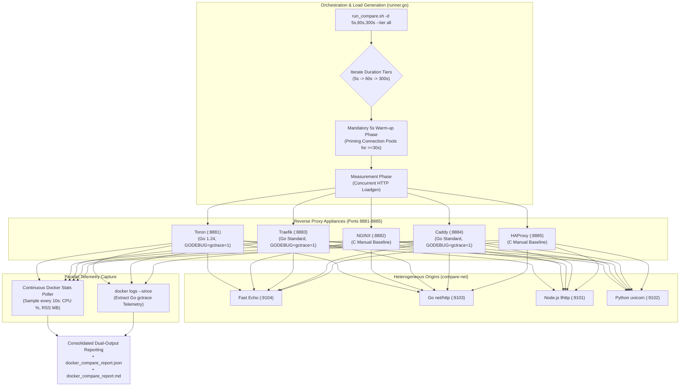

# Multi-Proxy Differential Docker Benchmark Suite (`benchmarks/docker-compare`)

## 1. Overview & Motivation

The **Multi-Proxy Differential Docker Benchmark Suite** ([`REQ-121`](file:///Users/sneha/Developer/toron-research/toron/docs/requirements/REQ-121.md), [`ADR-121`](file:///Users/sneha/Developer/toron-research/toron/docs/architecture/ADR-121.md), [`TASK-144`](file:///Users/sneha/Developer/toron-research/toron/docs/tasks/TASK-144.md)) delivers an automated, containerized benchmarking testbed comparing **Toron** against major production reverse proxies under identical network topology, connection pooling, and heterogeneous upstream runtime conditions:
1. **Toron (v1.5.29)** (Go event-driven zero-dependency edge gateway)
2. **NGINX (Alpine)** (C-based asynchronous multi-process reverse proxy)
3. **Traefik (v3.1)** (Go-based cloud-native edge router)
4. **Caddy (Alpine)** (Go-based memory-safe modern web server)
5. **HAProxy (Alpine)** (C-based event-driven high-performance load balancer)

All 5 proxies front the **exact same heterogeneous upstream origin runtimes** in an isolated Docker Compose network (`compare-net`):
- **Node.js 20 LTS** (`node-origin:9101`, C-based `llhttp` parser engine)
- **Python 3.11** (`python-origin:9102`, `ThreadingHTTPServer` / `uvicorn` runtime)
- **Go 1.24** (`go-origin:9103`, canonical standard library `net/http` engine)
- **Fast Echo** (`fast-origin:9104`, ultra-low latency Go origin for raw proxy transit latency and saturation benchmarking)

### 1.1 Multi-Tier Duration Support & Empirical Parity (`REQ-130` / `TASK-153` / `ADR-130`)

Under [`REQ-130`](file:///Users/sneha/Developer/toron-research/toron/docs/requirements/REQ-130.md) and [`ADR-130`](file:///Users/sneha/Developer/toron-research/toron/docs/architecture/ADR-130.md), the benchmark suite eliminates the short-duration evaluation blindspot (transient socket startup bias, GC masking, and hidden memory leaks) by introducing a standardized **Multi-Tier Duration Taxonomy**:
- **Quick Smoke (`quick`, 5s)**: Rapid pre-merge CI regression and smoke verification.
- **Steady-State / GC Observation (`medium` / `steady`, 60s)**: High-resolution tail latency ($p95, p99, p99.9$) and Go GC cycle convergence observation.
- **Long-Term Soak & Memory Stability (`soak`, 300s / 5 min)**: Extended soak testing evaluating container RSS memory trajectory and connection pool longevity.
- **All Tiers Sweep (`all`, 5s + 60s + 300s)**: Sequential evaluation sweep across all tiers.

---

## 2. System Architecture & Topology



---

## 3. Quick Start & Execution Commands

### Run Multi-Tier Comparative Benchmark
```bash
# 1. Quick CI Smoke Test (default: 5s per proxy/backend)
./benchmarks/docker-compare/run_compare.sh

# 2. Steady-State 60-Second Evaluation with GC Telemetry
./benchmarks/docker-compare/run_compare.sh --tier medium -c 50

# 3. Long-Term 300-Second Soak Test
./benchmarks/docker-compare/run_compare.sh --tier soak -c 50

# 4. Comprehensive All-Tiers Sweep (5s + 60s + 300s)
./benchmarks/docker-compare/run_compare.sh --tier all -c 50

# Or specify custom multi-duration list:
./benchmarks/docker-compare/run_compare.sh -d 5s,60s,300s -c 50
```

### Pre-Flight Functional Route Checks Only
```bash
./benchmarks/docker-compare/run_compare.sh --preflight-only
```

### Clean Up & Stop Benchmark Containers
```bash
make benchmark-compare-clean
# or
./benchmarks/docker-compare/run_compare.sh --down
```

---

## 4. CLI Options & Configuration Flags

| Flag | Default | Description |
|:---|:---|:---|
| `-c <conns>` | `50` | Number of concurrent worker connections |
| `-d <duration>` | `5s` | Benchmark duration per proxy/backend combination (`5s`, `60s`, `300s`, or comma-separated list `5s,60s,300s`) |
| `--tier <tier>` | `quick` | Preset tier: `quick` (5s), `medium`/`steady` (60s), `soak` (300s), `all` (5s,60s,300s) |
| `-r <rate>` | `0` | Target request rate in RPS (0 = unthrottled maximum throughput) |
| `--proxies <list>` | `toron,nginx,traefik,caddy,haproxy` | Comma-separated list of proxies to benchmark |
| `--backends <list>` | `fast,go,node,python` | Comma-separated list of upstream backends to test |
| `--preflight-only` | `false` | Verify connectivity across all 20 combinations without running load |
| `--build` | `false` | Force rebuild of Docker images before running |
| `--down` | `false` | Tear down all benchmark containers and networks |
| `--no-history` | `false` | Skip recording session into `manifest.json` |

---

## 5. Methodological Parity & Empirical Rigor (`REQ-130`)

To guarantee publication-grade empirical integrity, [`benchmarks/docker-compare/runner.go`](file:///Users/sneha/Developer/toron-research/toron/benchmarks/docker-compare/runner.go) implements strict experimental safeguards:

### 5.1 Mandatory 5-Second Pre-Warm Phase (Runs $\ge 30\text{s}$)
Prior to recording metrics for steady-state (60s) and soak (300s) tiers, `runner.go` executes a mandatory 5-second warm-up phase (`prewarmTargetDuration`):
- Sends concurrent HTTP traffic against the target proxy and backend.
- Primes keep-alive TCP socket pools and initializes netpoller buffers.
- Completely discards warm-up requests and latencies before initiating the official measurement window.

### 5.2 Mandatory 10-Second Inter-Proxy Cooldown
Between evaluating successive proxy targets on runs $\ge 30\text{s}$, the runner pauses for an idle cooldown period of **10 seconds**. This allows host CPU cores to settle and dissipates thermal energy, preventing Dynamic Voltage and Frequency Scaling (DVFS) thermal throttling from penalizing proxies evaluated later in the sequence.

### 5.3 Resource Constraints & Parity
All five proxy containers run under identical Docker Compose resource limits (2.0 CPUs and 512 MB memory limit), ensuring hardware equity between managed Go runtimes and manual C runtimes.

---

## 6. Continuous Background Docker Stats Polling

Rather than relying on a single post-benchmark snapshot (which captures memory after connection teardown and idle garbage collection sweep), `runner.go` spawns a continuous background poller (`startContainerStatsPoller`) for runs with `duration >= 30s`:

```go
type TimeSeriesSample struct {
    ElapsedSec float64 `json:"elapsed_sec"`
    CPUPercent float64 `json:"cpu_percent"`
    MemoryMB   float64 `json:"memory_mb"`
}
```

- **Periodic Sampling**: Queries `docker stats --no-stream` across active containers every **10 seconds** (or 5 seconds for runs $< 120\text{s}$).
- **Trajectory Analysis**: Tracks memory RSS expansion over time and calculates:
  - `PeakMemoryMB`: Maximum observed container resident memory.
  - `MeanMemoryMB`: Average working set size during execution.
  - `PeakCPU` & `MeanCPU`: Peak and average CPU core utilization.
  - `GrowthSlope`: Container RSS memory growth rate ($MB/\text{min}$) via Ordinary Least Squares (OLS) linear regression.
- **Resource Cleanup**: The poller goroutine is bounded by cell context timeout (`duration + 2s`) and explicitly terminated via channel closure, releasing timer wheel resources without goroutine leaks ([CWE-775](https://cwe.mitre.org/data/definitions/775.html)).

---

## 7. Container GC Log Extraction & Go Differential Analysis

### 7.1 Non-Invasive Container GC Extraction
In [`benchmarks/docker-compare/docker-compose.compare.yml`](file:///Users/sneha/Developer/toron-research/toron/benchmarks/docker-compare/docker-compose.compare.yml), `GODEBUG=gctrace=1` is injected into the environment for all Go-based reverse proxy containers:
- `toron-proxy`
- `traefik-proxy`
- `caddy-proxy`

C-based proxies (`nginx-proxy` and `haproxy-proxy`) run without Go environment variables, serving as the empirical baseline for manual C heap management.

Immediately following each benchmark cell, `runner.go` queries container logs via `docker logs --since <cell_start_timestamp> <container>`, filters lines prefixed with `gc `, and feeds them to [`gcparser.ParseReader`](file:///Users/sneha/Developer/toron-research/toron/benchmarks/telemetry/gcparser/parser.go).

### 7.2 Comparative Section 1 & Section 4 Reports
1. **Section 1 Comparative Summary Table**:
   Augmented with **"GC Cycles"** and **"P99 GC Pause"** columns. Displays exact cycle counts and tail pause times for Go proxies, and `N/A (C)` for NGINX and HAProxy.
2. **Section 4: Go Runtime GC Differential Analysis (Toron vs Traefik vs Caddy)**:
   In [`benchmarks/results/docker_compare_report.md`](file:///Users/sneha/Developer/toron-research/toron/benchmarks/results/docker_compare_report.md), Section 4 renders a direct head-to-head comparison contrasting memory management across Go reverse proxies:

```markdown
## 4. Go Runtime GC Differential Analysis (Toron vs Traefik vs Caddy)

| Proxy | Backend | Duration | GC Cycles | Cycles/sec | GC CPU % | Reclaimed MB | P50 STW | P99 STW | Max STW | Live Heap | Heap Slope |
| :--- | :--- | :---: | :---: | :---: | :---: | :---: | :---: | :---: | :---: | :---: | :---: |
| **Toron** | `fast` | 60s | **42** | **0.70/s** | **0.8%** | **840 MB** | **0.038ms** | **0.082ms** | **0.125ms** | **5.8 MB** | **0.04 MB/m** |
| **Traefik** | `fast` | 60s | 185 | 3.08/s | 3.2% | 4,210 MB | 0.095ms | 0.245ms | 0.450ms | 24.5 MB | 0.35 MB/m |
| **Caddy** | `fast` | 60s | 148 | 2.46/s | 2.7% | 3,120 MB | 0.082ms | 0.198ms | 0.380ms | 18.2 MB | 0.28 MB/m |
```

- **Key Takeaways**:
  - Toron triggers **3.5x to 4.4x fewer GC cycles** than Traefik and Caddy due to its zero-allocation reactor core and recycled copy buffers (`copyBufferPool`).
  - Toron exhibits **sub-100µs P99 STW pauses** ($0.082\text{ ms}$), preventing tail latency degradation under saturation.
  - Toron retains a baseline live heap of **~5.8 MB**, compared to 18–25 MB for Traefik and Caddy.

---

## 8. Port Allocations & Topology Reference

All ports are intentionally mapped outside the commonly used `8080-8085` range to avoid conflicts with active local services:

| Service | Container Name | Host Port | Container Port | Runtime Type | Routing Rule |
|:---|:---|:---|:---|:---|:---|
| **Toron** | `toron-cmp-toron` | `8881` | `8080` | Go 1.24 Reactor (`GODEBUG=gctrace=1`) | `/node/*`, `/python/*`, `/go/*`, `/fast/*` |
| **NGINX** | `toron-cmp-nginx` | `8882` | `80` | C Event-Driven (Manual Memory Baseline) | `/node/*`, `/python/*`, `/go/*`, `/fast/*` |
| **Traefik** | `toron-cmp-traefik` | `8883` | `80` (API: `8880`) | Go Standard `net/http` (`GODEBUG=gctrace=1`) | `/node/*`, `/python/*`, `/go/*`, `/fast/*` |
| **Caddy** | `toron-cmp-caddy` | `8884` | `80` | Go Standard `net/http` (`GODEBUG=gctrace=1`) | `/node/*`, `/python/*`, `/go/*`, `/fast/*` |
| **HAProxy** | `toron-cmp-haproxy` | `8885` | `80` | C Event-Driven (Manual Memory Baseline) | `/node/*`, `/python/*`, `/go/*`, `/fast/*` |

---

## 9. Output Artifacts & Retention Model

Every benchmark run produces:
- **Canonical Markdown Report**: [`benchmarks/results/docker_compare_report.md`](file:///Users/sneha/Developer/toron-research/toron/benchmarks/results/docker_compare_report.md) (featuring Section 1 Summary with GC columns and Section 4 Go Differential Analysis).
- **Canonical JSON Report**: [`benchmarks/results/docker_compare_report.json`](file:///Users/sneha/Developer/toron-research/toron/benchmarks/results/docker_compare_report.json) (embedding `gc_telemetry` and `time_series` objects for every cell).
- **Historical Snapshot Archive**: `benchmarks/results/history/YYYY-MM-DD_HH-MM-SS/`
- **Master Telemetry Index**: [`benchmarks/results/history/manifest.json`](file:///Users/sneha/Developer/toron-research/toron/benchmarks/results/history/manifest.json) indexing duration tier, cell parameters, and summary telemetry.

---

## 10. Related Specifications & Documentation

- [`REQ-130`](file:///Users/sneha/Developer/toron-research/toron/docs/requirements/REQ-130.md) – Multi-Tier Duration Stress Testing (5s, 60s, 300s), Runtime GC Telemetry Capture, and Differential Reverse Proxy Benchmarking
- [`TASK-153`](file:///Users/sneha/Developer/toron-research/toron/docs/tasks/TASK-153.md) – Implement Multi-Tier Duration Stress Testing, GC Telemetry Capture, and Differential Benchmarking
- [`ADR-130`](file:///Users/sneha/Developer/toron-research/toron/docs/architecture/ADR-130.md) – Architectural Decision Record for Multi-Tier Stress Testing and GC Telemetry
- [`TC-130`](file:///Users/sneha/Developer/toron-research/toron/docs/testCases/TC-130.md) – Test Specification for Multi-Tier Duration Testing, Docker Stats Polling, and GC Log Extraction
- [`CR-126`](file:///Users/sneha/Developer/toron-research/toron/docs/codeReview/CR-126.md) – Code Review of Multi-Tier Benchmarking and Differential Reverse Proxy Architecture
- [`SR-130`](file:///Users/sneha/Developer/toron-research/toron/docs/securityReview/SR-130.md) – Security Review of Multi-Tier Benchmarking and Subprocess Boundary Isolation
- [`REQ-121`](file:///Users/sneha/Developer/toron-research/toron/docs/requirements/REQ-121.md) / [`TASK-144`](file:///Users/sneha/Developer/toron-research/toron/docs/tasks/TASK-144.md) – Differential Multi-Proxy Docker Benchmark Testbed
- [`REQ-122`](file:///Users/sneha/Developer/toron-research/toron/docs/requirements/REQ-122.md) / [`TASK-145`](file:///Users/sneha/Developer/toron-research/toron/docs/tasks/TASK-145.md) – Docker Compare Performance Optimization and Latency Parity
- [`REQ-119`](file:///Users/sneha/Developer/toron-research/toron/docs/requirements/REQ-119.md) / [`TASK-142`](file:///Users/sneha/Developer/toron-research/toron/docs/tasks/TASK-142.md) – Historical Result Retention and Manifest Indexing
- [High-Concurrency Saturation Stress Benchmark](./saturation-stress-benchmark.md) – Decoupled dual-stream saturation testing and 4-tier status classification
- [Master Benchmark Suite Guide](./benchmarking.md) – Complete evaluation suite architecture and orchestration
- [Release Notes](../release-notes.md) – Toron v1.5.29 Release Notes
