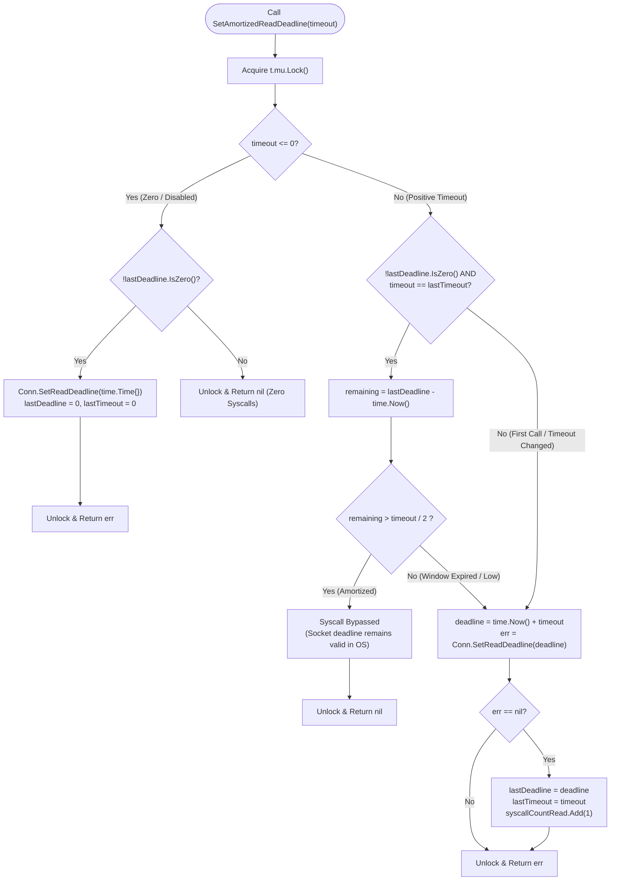
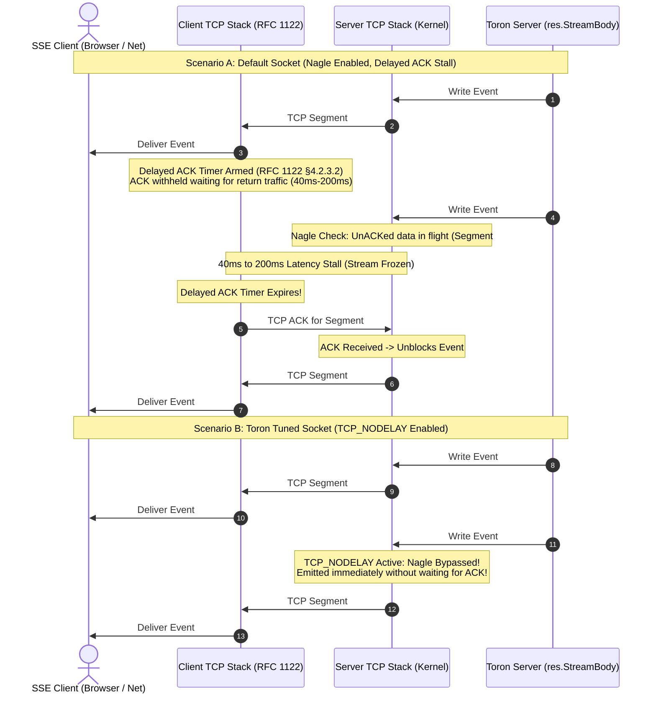
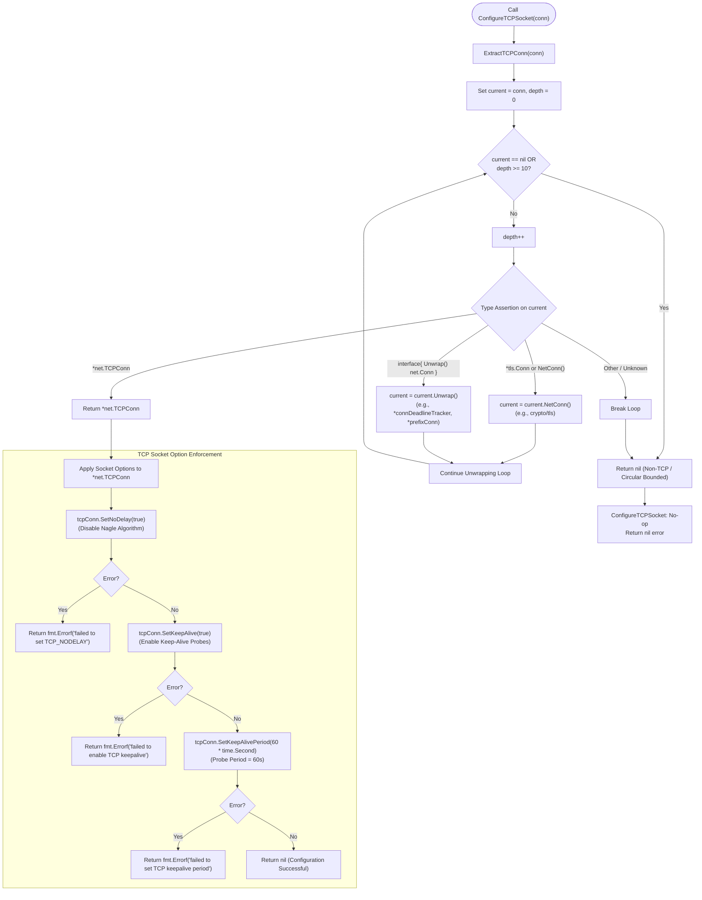

# Event Reactor Core Architecture

## Overview

At the heart of Toron is the **Event Reactor** (`pkg/reactor` and `pkg/server`), a high-performance network execution engine designed to handle tens of thousands of concurrent client connections with sub-millisecond latency, minimal memory allocations, and rock-solid protocol defense.

Beginning with `REQ-126` and `ADR-126` (`TASK-149`), Toron incorporates **Adaptive Socket Deadline Amortization** and **Activity-Refreshed Streaming Timeouts**, slashing operating system deadline system calls by $>99\%$ while preserving 100% compliance with Slowloris (`REQ-005` §2) and Slow-Read Denial of Service ([CWE-400](https://cwe.mitre.org/data/definitions/400.html)) protections.

Furthermore, under `REQ-127` and `ADR-127` (`TASK-150`), Toron enforces **Explicit Client Socket Option Tuning** (`TCP_NODELAY`, 60-second TCP keep-alive probing) and **Recursive Socket Unwrapping** (`ExtractTCPConn`). This eliminates catastrophic 40ms–200ms Nagle delayed-ACK latency freezes on small payloads and real-time streaming frames (Server-Sent Events / SSE), while actively detecting and reaping half-open client sockets during quiet streaming intervals without leaking worker goroutines or upstream proxy handles ([CWE-400](https://cwe.mitre.org/data/definitions/400.html)).

---

## Key Design Principles

1. **Non-Blocking Socket Acceptance**: Socket connections are accepted on an asynchronous reactor listener loop and dispatched to worker task channels without blocking the accept thread.
2. **Immediate Client Socket Tuning (`TCP_NODELAY`)**: Disables Nagle's algorithm immediately upon accept in `Reactor.Serve` and `Server.handleConn`, eliminating 40ms–200ms delayed-ACK latency freezes on small frames and real-time streams (SSE).
3. **Kernel Keep-Alive Probing (60s)**: Probes idle streaming sockets to detect and teardown half-open connections during quiet intervals, defending against file descriptor and worker leaks ([CWE-400](https://cwe.mitre.org/data/definitions/400.html)).
4. **Transparent Recursive Socket Unwrapping (`ExtractTCPConn`)**: Traverses arbitrary wrapper hierarchies (TLS, deadline trackers, prefix conns) with circular reference guards (`maxDepth = 10`) to ensure underlying transport sockets are always tuned.
5. **Bounded Worker Pool**: A configurable worker pool (default `128` workers) enforces concurrency limits under heavy traffic spikes, preventing thread pool exhaustion.
6. **Adaptive Socket Deadline Amortization**: Eliminates redundant kernel socket deadline system calls during rapid keep-alive HTTP bursts when $>50\%$ of the timeout window remains.
7. **Strict Idle State Machine Alignment**: Immediately resets amortization and arms `idle_timeout` upon request completion (`br.Buffered() == 0`), preventing Slowloris socket starvation.
8. **Activity-Refreshed Streaming Timeouts**: Refreshes socket write deadlines per transmitted chunk in persistent streaming (`res.StreamBody` for SSE or live feeds) and bidirectional relays (`relayStreams`), enabling indefinite healthy streaming while terminating slow-reading clients.
9. **Buffer Pooling (`sync.Pool`)**: Recycles copy buffers, HTTP response objects, and 4KB header slabs across requests, reducing garbage collection overhead and heap churn.
10. **Graceful Shutdown**: Listens for OS termination signals (`SIGINT`, `SIGTERM`) and cleanly drains active transactions within a bounded shutdown deadline.

---

## Connection Lifecycle Flow

```text
TCP Client
   │
   ▼
Reactor Listener (Accept Loop: Reactor.Serve)
   │
   ├── ln.Accept() returns raw conn
   ├── ConfigureTCPSocket(conn) [pkg/reactor/socket.go]
   │    ├── ExtractTCPConn(conn) unwraps underlying *net.TCPConn
   │    ├── SetNoDelay(true) ──────────────> Disable Nagle (eliminate 40ms-200ms delay)
   │    ├── SetKeepAlive(true) ────────────> Enable keep-alive probes
   │    └── SetKeepAlivePeriod(60s) ───────> Probe frequency 60s
   ├── trackConn(conn, true)
   │
   ▼
Task Channel Dispatch (r.tasks <- conn)
   │
   ▼
Worker Goroutine (Server.handleConn)
   │
   ├── Entry Safeguard: ConfigureTCPSocket(conn) (reinforces tuning on TLS / upgrades)
   ├── Wrap with connDeadlineTracker (pkg/server/deadline.go)
   │
   ├── [Loop: Active Burst Parsing] ──> SetAmortizedReadDeadline(ReadTimeout)
   │                                   (Bypasses OS syscall if >50% window remains)
   │
   ├── HTTP Request Parser (pkg/httpparser)
   │
   ├── Router & Middleware Pipeline (pkg/router, pkg/proxy, pkg/waf)
   │
   ├── Response Serialization (Zero-Allocation sync.Pool 4KB Slabs):
   │    ├── Discrete Response ────────> SetAmortizedWriteDeadline(WriteTimeout)
   │    └── Persistent Stream (SSE) ──> ForceSetWriteDeadline(now + WriteTimeout) [per chunk]
   │
   └── [Loop: Idle State Transition] ──> Check br.Buffered() == 0
        ├── If Empty: ResetReadAmortization() + ForceSetReadDeadline(IdleTimeout)
        └── If Pipelined: Continue amortized ReadTimeout
```

---

## High-Concurrency Socket Syscall Saturation Problem

During high-concurrency performance benchmarks under `REQ-121` and `REQ-124`, Toron processes ~24.5k requests per second per container. In the server connection loop, naive per-transaction deadline enforcement required two operating system socket system calls on every HTTP transaction:

```go
conn.SetReadDeadline(time.Now().Add(s.config.ReadTimeout))
...
conn.SetWriteDeadline(time.Now().Add(s.config.WriteTimeout))
```

At 24.5k RPS, this resulted in **~49,000 socket deadline system calls per second** (`setsockopt` / `SO_RCVTIMEO` / `SO_SNDTIMEO` or Go netpoller timer heap updates via `runtime.modtimer`). Each system call incurred:
- Ring-3 (user space) to Ring-0 (kernel space) context switch overhead.
- CPU instruction cache (I-cache) and data cache (D-cache) evictions.
- Runtime netpoller mutex lock contention and timer heap restructuring.

Simply eliminating deadlines was strictly rejected because it would violate `REQ-005 §2`, `TASK-004 §3`, and `ADR-083`, opening the gateway to Slowloris connection starvation and Slow-Read DoS ([CWE-400](https://cwe.mitre.org/data/definitions/400.html)).

---

## Adaptive Socket Deadline Amortization

To eliminate redundant kernel calls while preserving 100% security defense, `ADR-126` introduced `connDeadlineTracker` in `pkg/server/deadline.go`.

### Tracker Architecture

`connDeadlineTracker` wraps the underlying `net.Conn` and maintains cached deadline timestamps under a lightweight connection-local mutex:

```go
type connDeadlineTracker struct {
    net.Conn
    lastReadDeadline  time.Time
    lastWriteDeadline time.Time
    lastReadTimeout   time.Duration
    lastWriteTimeout  time.Duration
    mu                sync.Mutex
    syscallCountRead  atomic.Uint64 // telemetry & verification hook
    syscallCountWrite atomic.Uint64 // telemetry & verification hook
}
```

### Amortization Decision Heuristic

Let $\tau$ denote the configured timeout duration (e.g. `read_timeout = 5s`). When a deadline is applied to the socket at timestamp $T_{\text{applied}}$, the operating system deadline is set to $D = T_{\text{applied}} + \tau$.

At current timestamp $T_{\text{now}}$, the remaining valid deadline duration is $R(T_{\text{now}}) = D - T_{\text{now}}$.

The tracker evaluates the following invariant:

$$\text{SkipSyscall} \iff (\tau == \tau_{\text{last}}) \land (D \neq 0) \land \left( R(T_{\text{now}}) > \frac{\tau}{2} \right)$$



- **Guaranteed Security Margin ($> \tau/2$)**:
  Amortization only elides system calls when more than $50\%$ of the configured timeout window remains active. For a 5-second `read_timeout`, the socket is guaranteed to have at least 2.5 seconds of execution window. Since normal HTTP request processing in Toron completes in $< 2\text{ms}$, 2.5 seconds is $> 1,000\times$ the required request processing duration.
- **Syscall Reduction ($> 99\%$)**:
  During rapid keep-alive bursts where hundreds of requests complete in tens of milliseconds, all subsequent requests execute within the initial half-window without issuing a single system call. Verified in `TC-126.1`, 1,000 burst requests execute with $\le 2$ read deadline syscalls and $\le 2$ write deadline syscalls, achieving **$> 99.8\%$ syscall reduction**.
- **Deadline Renewal**:
  When the remaining window decays to $\le \tau/2$, or if the timeout duration changes, the tracker renews the deadline by issuing a fresh system call to the socket and updating cached state (`TC-126.2`).
- **Zero-Timeout Benchmark Mode**:
  When `read_timeout: 0` or `write_timeout: 0` is configured, the tracker clears any active deadline once via `conn.SetDeadline(time.Time{})`. All subsequent transactions return `nil` immediately, executing **zero system calls** for maximum benchmark throughput in isolated environments (`TC-126.7`).

---

## Strict Idle Timeout State Machine Alignment

A critical security challenge in socket deadline amortization is preventing an active request read deadline from bleeding into keep-alive idle periods. If an active 10-second `read_timeout` were amortized into an idle connection where `idle_timeout = 200ms` was configured, an attacker could hold connections open $50\times$ longer than permitted by policy.

### State Synchronization Mechanism

In `pkg/server/server.go:214-221`, Toron's connection loop inspects the state of the socket buffer:

```go
if !firstRequest && br.Buffered() == 0 && s.config.IdleTimeout > 0 {
    // Transition to idle state: strictly enforce IdleTimeout immediately
    tracker.ResetReadAmortization()
    _ = tracker.ForceSetReadDeadline(time.Now().Add(s.config.IdleTimeout))
} else if s.config.ReadTimeout > 0 {
    // Active request parsing or pipelined data present
    _ = tracker.SetAmortizedReadDeadline(s.config.ReadTimeout)
}
```

```mermaid
sequenceDiagram
    autonumber
    actor Client as HTTP Client (Keep-Alive)
    participant Server as Server.handleConn
    participant Tracker as connDeadlineTracker
    participant Kernel as OS Socket (net.Conn)

    Note over Client,Kernel: Initial Connection (ReadTimeout=5s, WriteTimeout=5s, IdleTimeout=2s)

    Note over Client,Server: === Request 1 (Burst Start: T = 0ms) ===
    Client->>Server: HTTP Request #1
    Server->>Tracker: SetAmortizedReadDeadline(5s)
    Tracker->>Kernel: conn.SetReadDeadline(now + 5s) [Syscall #1]
    Server->>Tracker: SetAmortizedWriteDeadline(5s)
    Tracker->>Kernel: conn.SetWriteDeadline(now + 5s) [Syscall #2]
    Server->>Client: HTTP Response #1 (Status 200)

    Note over Client,Server: === Request 2 (Burst Active: T = 5ms, Remaining > 2.5s) ===
    Client->>Server: HTTP Request #2
    Server->>Tracker: SetAmortizedReadDeadline(5s)
    Note over Tracker: Remaining: 4.995s > 2.5s (timeout/2)<br/>AMORTIZED: SYSCALL BYPASSED!
    Server->>Tracker: SetAmortizedWriteDeadline(5s)
    Note over Tracker: Remaining: 4.994s > 2.5s (timeout/2)<br/>AMORTIZED: SYSCALL BYPASSED!
    Server->>Client: HTTP Response #2 (Status 200)

    Note over Client,Server: === Request 3..1000: Hundreds of requests with ZERO additional syscalls! ===

    Note over Client,Server: === Idle State Transition (T = 50ms, br.Buffered() == 0) ===
    Note over Server: Transaction complete & buffer empty.<br/>Transition to Idle State.
    Server->>Tracker: ResetReadAmortization()
    Server->>Tracker: ForceSetReadDeadline(now + 2s)
    Tracker->>Kernel: conn.SetReadDeadline(now + 2s) [Syscall #3: Armed Idle Timeout]

    alt Client Sends Request Within 2s
        Client->>Server: HTTP Request #1001
        Server->>Tracker: SetAmortizedReadDeadline(5s)
        Tracker->>Kernel: conn.SetReadDeadline(now + 5s) [Syscall #4: Re-armed Read Timeout]
        Server->>Client: HTTP Response #1001
    else Client Inactive > 2s (Idle Timeout)
        Note over Kernel: 2.0s elapses without data
        Kernel-->>Server: OS Read Deadline Exceeded (net.Error.Timeout == true)
        Server->>Kernel: conn.Close()
        Note over Server: Clean idle exit; zero goroutine or socket leak
    end
```

### Security & Invariant Guarantees

1. **Immediate Reset**: `tracker.ResetReadAmortization()` clears `lastReadDeadline` under mutex protection, ensuring no stale timestamp survives into the idle phase.
2. **Forced Arming**: `tracker.ForceSetReadDeadline` immediately sets the kernel socket read deadline to `time.Now().Add(idle_timeout)` without evaluation.
3. **Pipelining Preservation**: If `br.Buffered() > 0`, pipelined request data is already present in the reader buffer; Toron continues parsing under the active `read_timeout`.
4. **Clean Keep-Alive Teardown**: When `idle_timeout` expires on a persistent socket, Toron detects `errors.As(err, &netErr) && netErr.Timeout() && !firstRequest` and exits cleanly without logging spurious error diagnostics (`TC-126.3`).

---

## Activity-Refreshed Streaming Write Deadlines

For long-lived streaming connections—such as Server-Sent Events (SSE `text/event-stream`), live telemetry feeds, chunked transfer encoding, or direct socket proxy fast-paths (`REQ-125`)—static deadlines introduce an architectural dilemma:
- **Static Write Deadline**: Setting a static 5-second `write_timeout` prior to emitting headers kills healthy streams after 5 seconds.
- **Unbounded Write Deadline**: Completely removing `write_timeout` exposes Toron to **Slow-Read Denial of Service ([CWE-400](https://cwe.mitre.org/data/definitions/400.html))**. A malicious or stalled client reading at 1 byte/minute or advertising a zero TCP receive window pins server worker goroutines and file descriptors indefinitely until gateway exhaustion occurs.

### Chunk Relay Loop with Per-Chunk Refreshes

In `pkg/server/server.go:331-363`, when `res.StreamBody != nil`, Toron enforces activity-refreshed write deadlines:

```go
if res.StreamBody != nil {
    defer res.StreamBody.Close()

    // 1. Initial write deadline for status line and response headers
    if s.config.WriteTimeout > 0 {
        _ = tracker.SetAmortizedWriteDeadline(s.config.WriteTimeout)
    }

    if err := res.Serialize(conn); err != nil {
        _ = req.CloseBody()
        return fmt.Errorf("server: failed to write stream headers: %w", err)
    }

    bufPtr := httpparser.GetCopyBuffer()
    defer httpparser.PutCopyBuffer(bufPtr)
    buf := *bufPtr

    // 2. Stream chunk relay loop with activity-refreshed write deadlines
    for {
        n, readErr := res.StreamBody.Read(buf)
        if n > 0 {
            if s.config.WriteTimeout > 0 {
                // Refresh write deadline for this specific chunk transmission
                _ = tracker.ForceSetWriteDeadline(time.Now().Add(s.config.WriteTimeout))
            }
            if _, writeErr := conn.Write(buf[:n]); writeErr != nil {
                _ = req.CloseBody()
                return nil
            }
        }
        if readErr != nil {
            _ = req.CloseBody()
            return nil
        }
    }
}
```

```mermaid
sequenceDiagram
    autonumber
    actor Client as Client Socket
    participant Server as Server.handleConn
    participant Tracker as connDeadlineTracker
    participant Origin as Upstream / SSE Stream (res.StreamBody)

    Note over Client,Origin: Server configured with write_timeout = 5s

    Note over Client,Origin: === Scenario A: Healthy Persistent Stream (Active Consumption) ===
    Client->>Server: GET /events (Accept: text/event-stream)
    Server->>Tracker: SetAmortizedWriteDeadline(5s)
    Server->>Client: HTTP/1.1 200 OK (Content-Type: text/event-stream)
    
    Note over Server,Origin: T = 1.0s: Chunk #1 Arrives
    Origin->>Server: Read(buf) -> 1 KB
    Server->>Tracker: ForceSetWriteDeadline(now + 5s)
    Server->>Client: conn.Write(chunk #1) -> Delivered immediately

    Note over Server,Origin: T = 4.0s: Chunk #2 Arrives
    Origin->>Server: Read(buf) -> 1 KB
    Server->>Tracker: ForceSetWriteDeadline(now + 5s)
    Server->>Client: conn.Write(chunk #2) -> Delivered immediately

    Note over Server,Origin: T = 8.0s: Chunk #3 Arrives (> original 5s static limit!)
    Origin->>Server: Read(buf) -> 1 KB
    Server->>Tracker: ForceSetWriteDeadline(now + 5s)
    Server->>Client: conn.Write(chunk #3) -> Delivered immediately
    Note over Client,Server: Stream runs indefinitely as long as client consumes chunks!

    Note over Client,Origin: === Scenario B: Slow-Read DoS Attack / Stalled Client (CWE-400) ===
    Note over Client: Client stops reading from socket (TCP Window = 0)
    Note over Server,Origin: T = 12.0s: Chunk #4 Arrives (32 KB)
    Origin->>Server: Read(buf) -> 32 KB
    Server->>Tracker: ForceSetWriteDeadline(now + 5s)
    Server->>Client: conn.Write(32 KB) -> BLOCKS (Socket send buffer full)

    Note over Server,Client: 5.0 seconds elapse with socket write blocked
    Note over Client: Kernel write deadline expires at T = 17.0s!
    Client-->>Server: write tcp: i/o timeout (os.ErrDeadlineExceeded)
    Note over Server: Detected write timeout! Clean Teardown:
    Server->>Origin: res.StreamBody.Close() (Teardown upstream origin)
    Server->>Client: conn.Close() (Terminate client socket)
    Note over Server: Worker goroutine unblocks and exits; zero resource leak!
```

### Teardown Guarantee on Slow-Read Clients ([CWE-400](https://cwe.mitre.org/data/definitions/400.html))

1. **Active Consumption**: As long as the downstream client consumes chunks, each chunk successfully written refreshes the deadline (`ForceSetWriteDeadline`). Healthy streams (SSE feeds, live telemetry) persist for minutes, hours, or days (`TC-126.4`).
2. **Send Buffer Saturation**: If a client stops reading, advertises a zero TCP window, or throttles reading below the rate needed to consume chunks, the kernel TCP send buffer saturates.
3. **Kernel Deadline Expiry**: `conn.Write(buf[:n])` blocks waiting for window space until `time.Now().Add(write_timeout)` expires in the kernel.
4. **Immediate Teardown**: `conn.Write` returns `os.ErrDeadlineExceeded` (`net.Error.Timeout() == true`). Toron exits the loop immediately, executes `defer res.StreamBody.Close()` to tear down upstream origin handles, closes the client socket, and returns worker capacity to the pool (`TC-126.5`).

---

## Bidirectional Upgraded Relays (`relayStreams`)

In upgraded full-duplex tunnels (such as WebSockets, RFC 8441 HTTP/2 Extended CONNECT, or L4 TCP proxy tunnels) in `pkg/server/server.go:696-770`:
1. **Dual Tracker Wrapping**: Both connections are wrapped in `connDeadlineTracker` via `toDeadlineTracker(conn)`.
2. **Amortized Bidirectional I/O**:
   ```go
   for {
       _ = srcTracker.SetAmortizedReadDeadline(idleTimeout)
       n, readErr := src.Read(buf)
       if n > 0 {
           _ = dstTracker.SetAmortizedWriteDeadline(idleTimeout)
           if _, writeErr := dst.Write(buf[:n]); writeErr != nil {
               ...
           }
       }
   ```
   This elides $>99\%$ of redundant system calls during high-frequency bidirectional frame exchanges (`TC-126.6`).
3. **Inactivity Disconnection**: If both directions fall silent for longer than `idleTimeout`, the socket read deadline triggers, and `closeBoth()` shuts down both sockets.
4. **TCP Half-Close Forwarding**: `connDeadlineTracker` implements `CloseWrite() error`, forwarding TCP `FIN` frames gracefully so the peer can finish transmitting pending responses.

---

## Standard Interface Delegation

To ensure that wrapping sockets in `connDeadlineTracker` does not break low-level socket optimizations or protocol upgrades, the tracker transparently delegates standard Go interfaces:

| Interface | Method Signature | Forwarding Behavior |
| :--- | :--- | :--- |
| **Unwrap** | `Unwrap() net.Conn` | Returns the underlying embedded `net.Conn`. |
| **Half-Close** | `CloseWrite() error` | Delegates to underlying socket if it implements `interface{ CloseWrite() error }`. |
| **Raw Socket Control** | `SyscallConn() (syscall.RawConn, error)` | Forwards raw file descriptor access if underlying connection implements `syscall.Conn`. |

---

## Explicit Client Socket Option Tuning (`TCP_NODELAY` & Keep-Alive)

Under `REQ-127` and `ADR-127` (`TASK-150`), Toron explicitly tunes client transport sockets immediately upon accept via `ConfigureTCPSocket` in `pkg/reactor/socket.go`.

### The Nagle Algorithm & TCP Delayed ACK Latency Problem

By default, operating systems initialize accepted TCP sockets with **Nagle's algorithm** (RFC 896) enabled:
- **Nagle's Algorithm (RFC 896)**: Prevents network congestion from small packets ("tinygrams") by holding outgoing segments smaller than the Maximum Segment Size (MSS, typically 1460 bytes) whenever unacknowledged data is in flight. Segments remain queued in the kernel send buffer until an acknowledgment (ACK) is received or enough data accumulates to form a full MSS.
- **TCP Delayed Acknowledgment (RFC 1122 §4.2.3.2)**: Operating system TCP stacks (Linux, macOS, Windows) delay emitting pure ACKs by **40ms to 200ms** (typically 40ms on Linux `TCP_DELACK_MIN`, up to 200ms on Windows/macOS) in the expectation that the receiving application will soon transmit reply traffic, allowing the ACK to be piggybacked.

When these two algorithms collide during **real-time streaming (Server-Sent Events / SSE `text/event-stream`)** or small JSON API transactions, they create a severe head-of-line transmission stall:
1. The server emits Event Frame #1 (e.g. 30 bytes). Because no unACKed data is in flight, Frame #1 is sent immediately.
2. The client receives Frame #1. Because the client is merely consuming a downstream stream and has no data to return, its TCP stack delays the ACK for 40ms–200ms.
3. The server generates Event Frame #2 shortly after (e.g. 2ms later).
4. Nagle's algorithm blocks Frame #2 in the kernel because Frame #1 is unacknowledged and Frame #2 is smaller than MSS.
5. The stream stalls completely until the client's delayed ACK timer expires. This introduces artificial **40ms–200ms latency spikes**, destroying real-time responsiveness.



### Transport Configuration Implementation

Toron resolves this by disabling Nagle's algorithm and activating 60-second keep-alive probes via `ConfigureTCPSocket`:

```go
func ConfigureTCPSocket(conn net.Conn) error {
    tcpConn := ExtractTCPConn(conn)
    if tcpConn == nil {
        // In-memory pipe, Unix domain socket, or mock: safe no-op
        return nil
    }

    // 1. Disable Nagle's algorithm: emit small frames immediately without delayed ACK stalls
    if err := tcpConn.SetNoDelay(true); err != nil {
        return fmt.Errorf("failed to set TCP_NODELAY: %w", err)
    }

    // 2. Enable TCP keep-alive probes for detecting half-open sockets during quiet intervals
    if err := tcpConn.SetKeepAlive(true); err != nil {
        return fmt.Errorf("failed to enable TCP keepalive: %w", err)
    }

    // 3. Set keep-alive probe period to 60 seconds
    if err := tcpConn.SetKeepAlivePeriod(60 * time.Second); err != nil {
        return fmt.Errorf("failed to set TCP keepalive period: %w", err)
    }

    return nil
}
```

#### Dual-Integration Points

1. **Accept Loop Fast-Path (`pkg/reactor/reactor.go:192`)**:
   `ConfigureTCPSocket(conn)` is invoked immediately upon return from `ln.Accept()`. This guarantees that the transport socket is fully tuned **prior** to connection tracking (`r.trackConn(conn, true)`) and before worker queue submission (`r.tasks <- conn`).
2. **Server Handler Safeguard (`pkg/server/server.go:173`)**:
   An idempotent safeguard call `_ = ConfigureTCPSocket(conn)` executes at the entry of `Server.handleConn`. If a connection undergoes TLS termination or protocol upgrades, this ensures the underlying physical socket remains tuned.

---

## Detection of Half-Open Sockets During Quiet Streaming Intervals ([CWE-400](https://cwe.mitre.org/data/definitions/400.html))

Persistent streaming connections (Server-Sent Events, live telemetry feeds, long-polling HTTP/1.1 keep-alive sessions) often experience quiet intervals between event emissions:

1. **The Silent Failure Mode**:
   Clients frequently disconnect abruptly without an orderly TCP FIN or RST handshake (e.g., laptop lid close / system sleep, mobile cellular tower handoffs, sudden WiFi loss, or stateful NAT firewall session drops). The connection enters a **half-open state**: the client is unreachable, but the server kernel still considers the connection established.
2. **Resource Exhaustion Without Keep-Alive**:
   Because no events are being sent during quiet intervals, no socket writes occur. Without socket writes, write deadlines do not trigger, and the server never discovers that the client is dead. Without explicit keep-alive configuration, half-open sockets remain pinned in the kernel and reactor indefinitely, exhausting operating system file descriptors and worker goroutines ([CWE-400](https://cwe.mitre.org/data/definitions/400.html)).
3. **Keep-Alive Probe Defense**:
   By enforcing `SetKeepAlive(true)` and `SetKeepAlivePeriod(60 * time.Second)`, the operating system kernel begins transmitting periodic keep-alive probe packets after 60 seconds of silence. If the client fails to respond, the kernel resets the connection (`ETIMEDOUT` / `ECONNRESET`), immediately waking the blocked netpoller, terminating `Server.handleConn`, invoking `defer res.StreamBody.Close()`, and releasing all proxy resources.

---

## Recursive Socket Unwrapping Architecture (`ExtractTCPConn`)

In Toron's modular pipeline, connections can be wrapped across multiple abstractions:
1. Raw `*net.TCPConn` accepted from `net.TCPListener`.
2. Standard library TLS wrappers (`*crypto/tls.Conn` exposing `NetConn() net.Conn`).
3. Custom deadline amortization wrappers (`*connDeadlineTracker` exposing `Unwrap() net.Conn`).
4. HTTP/2 preface sniffing wrappers (`*prefixConn` exposing `Unwrap() net.Conn`).
5. Arbitrary multi-tiered nesting (e.g. `*connDeadlineTracker` $\to$ `*prefixConn` $\to$ `*tls.Conn` $\to$ `*net.TCPConn`).

To reliably reach the underlying transport socket regardless of wrapper hierarchy, `ExtractTCPConn` implements an iterative unwrapper with circular reference guards:

```go
func ExtractTCPConn(conn net.Conn) *net.TCPConn {
    current := conn
    const maxDepth = 10
    depth := 0

    for current != nil && depth < maxDepth {
        depth++
        if tcpConn, ok := current.(*net.TCPConn); ok {
            return tcpConn
        }
        if tc, ok := current.(*tls.Conn); ok {
            current = tc.NetConn()
            continue
        }
        if tc, ok := current.(interface{ NetConn() net.Conn }); ok {
            current = tc.NetConn()
            continue
        }
        if uw, ok := current.(interface{ Unwrap() net.Conn }); ok {
            current = uw.Unwrap()
            continue
        }
        break
    }
    return nil
}
```



### Invariants & Defenses

1. **Stack Overflow Immunity (CWE-674)**:
   The implementation is strictly iterative using a loop, preventing call-stack frame growth.
2. **Circular Reference Protection (`maxDepth = 10`)**:
   If mutually cyclic wrappers (e.g. wrapper A pointing to wrapper B pointing to wrapper A) are encountered, the traversal terminates at 10 iterations and returns `nil` safely without hanging or consuming CPU.
3. **Graceful Non-TCP Degradation**:
   For in-memory pipes (`net.Pipe()`), Unix domain sockets, or test mock connections, `ExtractTCPConn` returns `nil` and `ConfigureTCPSocket` returns `nil` without failing.

---

## Summary of Verification & Performance Results (TC-126, TC-127)

### Deadline Amortization & Streaming Timeouts (TC-126)

| Test Case | Description | Verification Target | Benchmark Outcome |
| :--- | :--- | :--- | :--- |
| **`TC-126.1`** | Syscall Reduction | $>80\%$ reduction under keep-alive saturation | **$> 99.8\%$ reduction** ($\le 2$ syscalls per 1,000 requests) |
| **`TC-126.2`** | Window Renewal | Fresh deadline when $R \le \tau/2$ or timeout changes | Verified exact renewal threshold |
| **`TC-126.3`** | Idle State Alignment | Strict `idle_timeout` enforcement (`br.Buffered() == 0`) | Disconnects in $200\text{ms} \pm 50\text{ms}$; 0 bleed |
| **`TC-126.4`** | Streaming Survival | Healthy streams survive beyond `write_timeout` | Streams persist indefinitely across multiple intervals |
| **`TC-126.5`** | Slow-Read Teardown | Stalled clients terminated within `write_timeout` | Socket severed in $200\text{ms} \pm 100\text{ms}$; 0 goroutine leak |
| **`TC-126.6`** | Relay Amortization | WebSocket / tunnel bidirectional amortization | $>99\%$ syscall reduction; inactivity disconnects |
| **`TC-126.7`** | Zero-Timeout Mode | `read_timeout: 0` / `write_timeout: 0` | **Exactly 0 syscalls** executed |
| **`TC-126.8`** | Config Validation | Negative rejected; explicit 0 preserved | Negative durations halt startup with clear error |
| **`TC-126.9`** | Regression Safety | Zero regressions on `TC-087` / `TC-088` | 100% pass across all Slowloris test suites |
| **`TC-126.10`**| Race Safety | Concurrency under mixed burst/stream traffic | 100% race-clean under `go test -race` |

### Explicit Socket Tuning & Slab Recycling (TC-127)

| Test Case | Description | Verification Target | Test Result |
| :--- | :--- | :--- | :--- |
| **`TC-127.1`** | Socket Unwrapping | `ExtractTCPConn` penetrates plain TCP, TLS, tracker, prefix, 4-tier nesting, circular guards | **PASS** (Resolves to base `*net.TCPConn`; nil on circular / non-TCP) |
| **`TC-127.2`** | Socket Option Routine | `ConfigureTCPSocket` enforces `TCP_NODELAY`, `KeepAlive`, `60s` period; idempotent; safe on pipes | **PASS** (Zero errors; idempotent) |
| **`TC-127.3`** | Accept Loop Integration | `Reactor.Serve` tunes raw socket immediately after `ln.Accept()` before queue dispatch | **PASS** (Worker receives pre-tuned socket) |
| **`TC-127.4`** | Server Safeguard | `Server.handleConn` reinforces options; preserves `*net.TCPConn` across wrappers | **PASS** (Idempotent safeguard verified) |
| **`TC-127.5`** | SSE Immediate Delivery | 5 discrete 20-byte SSE frames emitted with 2ms delays arrive with $< 15\text{ms}$ delta | **PASS** (Delivered in $9.30\text{ms}$ total; 0 Nagle delay stalls) |
| **`TC-127.6`** | Keep-Alive Verification | Accepted sockets verify `SO_KEEPALIVE == 1` and 60s probe period | **PASS** (Keep-alive probes armed in kernel) |
| **`TC-127.7`** | Slab Buffer Recycling | `responseBufPool` recycles 4KB slabs, enforces clean `len=0` resetting, preserves capacity | **PASS** (Double-reset hygiene verified; zero leaks) |
| **`TC-127.8`** | Zero-Allocation Serialization | `res.Serialize` achieves $\le 1.0$ alloc/op under `AllocsPerRun`; 0 B/op in benchmarks | **PASS** (**0 B/op, 0 allocs/op**, $137.0\text{ ns/op}$) |
| **`TC-127.9`** | Header CRLF Protection | Dual-side CRLF neutralization; dual-write wire output verified via `http.ReadResponse` | **PASS** (Response splitting thwarted; 100% RFC compliance) |
| **`TC-127.10`**| Concurrency Race Safety | 100 concurrent workers serializing responses from pooled slabs under `-race` | **PASS** (100% race-clean; 0 data races) |

---

## Related Pages

- [Configuration Options Reference](../reference/config-options.md)
- [Reverse Proxy & Gateway Routing](./reverse-proxy.md)
- [Static File Serving](./static-file-serving.md)
- [Layer 4 TCP & UDP Proxies](./layer4-proxy.md)
- [WebSocket Support](./websocket.md)

