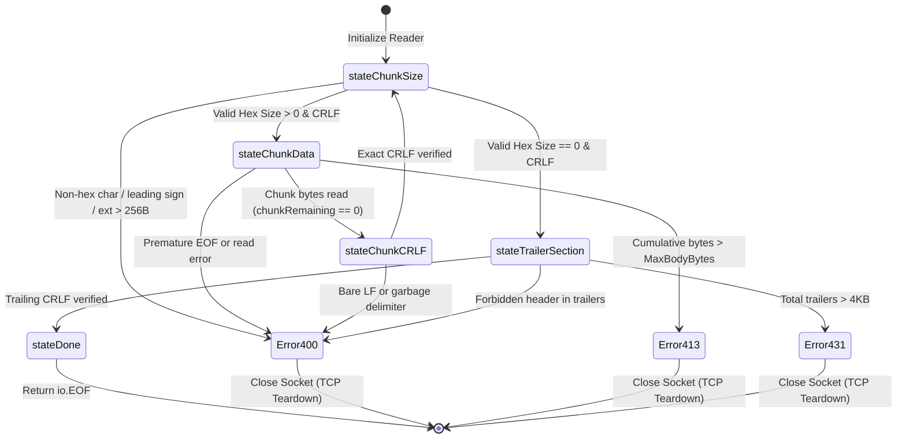

# Inbound Chunked Transfer-Encoding Ingestion & Edge Normalization (RFC 9112 §7.1)

## Overview

Toron provides native, high-throughput, and secure ingestion of HTTP/1.1 inbound chunked transfer-encoded requests (`Transfer-Encoding: chunked`). Rather than blindly forwarding raw, potentially ambiguous chunked streams to origin microservices or naively accepting non-standard framing, Toron functions as an **Active Ingress Smuggling Firewall**:

1. **Zero-Tolerance Ingress Wire Decoding (RFC 9112 §7.1)**: Strictly parses chunk framing on the wire using a streaming finite-state machine (`ChunkedBodyReader`). Non-hex characters, leading signs, leading or embedded whitespace, oversized extensions, bare linefeeds, and prohibited trailers trigger immediate `HTTP 400 Bad Request` and physical TCP connection teardown.
2. **Canonical Upstream Re-Framing Normalization (`"normalize"`, Default)**: Consumes and validates chunked payloads at the edge, calculates the exact payload byte length $L$, strips the hop-by-hop `Transfer-Encoding` header, injects an authoritative `Content-Length: L` header, and forwards a clean, standard HTTP/1.1 request upstream. Heterogeneous backend microservices (Node.js `llhttp`, Python `uvicorn`/`h11`, Ruby `puma`, Go `net/http`) are **100% shielded** from chunk-level parsing bugs and request smuggling desynchronizations ([CWE-444](https://cwe.mitre.org/data/definitions/444.html)).
3. **Canonical Passthrough Streaming Mode (`"passthrough"`)**: For high-volume streaming uploads where buffering multi-megabyte or gigabyte files in memory is undesirable, Toron streams validated canonical chunks upstream with fail-fast upstream context cancellation upon any client framing fault or disconnection.
4. **Configurable Backward Compatibility (`"reject"`)**: Operators requiring an uncompromising, zero-trust static rejection perimeter can preserve legacy `ADR-056` behavior (`HTTP/1.1 501 Not Implemented` with immediate connection closure) globally or on sensitive routes.

---

## Conceptual Architecture: Active Ingress Smuggling Firewall

### Why Static HTTP 501 Rejection Was Evolved

Under historical architecture `ADR-056` and `REQ-061`, Toron maintained an uncompromising perimeter posture: all incoming HTTP/1.1 requests carrying a `Transfer-Encoding` header were immediately rejected with `HTTP 501 Not Implemented`.

While this static rejection immunized Toron during its initial development phases against HTTP Request Smuggling ([CWE-444](https://cwe.mitre.org/data/definitions/444.html)), it prevented Toron from serving as a drop-in ingress gateway in modern cloud-native environments:
- **Streaming Ingress Blocked**: Clients streaming real-time event feeds, audio/video data, database backups, or large file uploads could not ingress through Toron.
- **Third-Party Webhook Drops**: Automated enterprise SaaS webhooks (e.g., GitHub, Stripe, Datadog, Slack) transmit JSON or multipart payloads chunked by default; Toron dropped them unconditionally.
- **Microservice Ingress Inflexibility**: Heterogeneous backend architectures rely on reverse proxies (NGINX, Envoy, Traefik) to accept chunked client streams.
- **Protocol Asymmetry**: Outbound streaming chunked responses were supported under `REQ-128` and `REQ-129`; rejecting inbound chunking created an asymmetric protocol posture.

### The Firewall and Normalization Model

Under `REQ-133` and `ADR-133`, Toron transforms from static rejection into an active security firewall:

```
┌──────────────────────────────────────────────────────────────────────────────────────────────────┐
│                         ACTIVE INGRESS SMUGGLING FIREWALL & RE-FRAMING                           │
├──────────────────────────────────────────────────────────────────────────────────────────────────┤
│                                                                                                  │
│   UNTRUSTED CLIENT                               TORON INGRESS EDGE GATEWAY       UPSTREAM ORIGIN│
│   (Potential Attacker)                          (Zero-Tolerance Invariant Guard)  (Backend Nodes)│
│                                                                                                  │
│   POST /upload HTTP/1.1 ────────► [ Preflight Smuggling Guards ]                                 │
│   Transfer-Encoding: chunked      • Reject Conflicting CL+TE (400)                               │
│                                   • Reject Obfuscated TE (400)                                   │
│                                   • Check Inbound Profile                                        │
│                                              │                                                   │
│                                              ▼                                                   │
│   1a;ext=valid\r\n ─────────────► [ Zero-Tolerance Chunk Decoder ]                               │
│   <26 bytes of data>\r\n          • Strict 1*HEXDIG (No +, -, SP)                                │
│   0\r\n                           • Clamp Chunk Ext <= 256B                                      │
│   X-Checksum: abc\r\n\r\n         • Clamp Cumulative Body <= MaxBodyBytes                        │
│                                   • Validate & Filter Trailers <= 4KB                            │
│                                              │                                                   │
│                                              ▼                                                   │
│                                   [ Canonical Edge Normalization ]                               │
│                                   • Strip Transfer-Encoding                                      │
│                                   • Compute Exact Content-Length (26)                            │
│                                   • Re-frame Clean Request                                       │
│                                              │                                                   │
│                                              └────────────────────────► POST /upload HTTP/1.1    │
│                                                                         Content-Length: 26       │
│                                                                         X-Checksum: abc          │
│                                                                         [Clean 26 Bytes Body]    │
│                                                                                                  │
│   [RESULT: Downstream microservice is 100% shielded from chunked parsing bugs and desyncs!]      │
└──────────────────────────────────────────────────────────────────────────────────────────────────┘
```

---

## Operational Profiles (`inbound_chunked_mode`)

Toron provides three distinct operational profiles configured via `inbound_chunked_mode`:

| Profile | Forwarding Behavior | Security & Smuggling Defense | Target Workloads |
| :--- | :--- | :--- | :--- |
| **`"normalize"`** *(Default)* | De-chunks request at edge into pooled memory; computes exact byte length $L$; strips `Transfer-Encoding`; sets authoritative `Content-Length: L`; forwards standard non-chunked HTTP request upstream. | **Maximum Isolation**: Downstream origins never receive chunked framing. Completely eliminates origin chunk desync vulnerabilities ([CWE-444](https://cwe.mitre.org/data/definitions/444.html)). | General API traffic, SaaS webhooks, standard JSON/form payloads $\le \text{MaxBodyBytes}$. |
| **`"passthrough"`** | Validates chunk hex sizes, extensions, CRLFs, and trailers incrementally on the wire; forwards canonical RFC 9112 chunk frames directly upstream with $O(1) \le 32\,\text{KB}$ memory. Cancels upstream request context immediately on client fault or disconnect. | **Strict Edge Validation**: Ingress wire bytes are verified against RFC 9112 §7.1. Malformed chunks, extensions $> 256\,\text{B}$, or invalid delimiters trigger immediate TCP teardown before contaminating origin. | High-throughput streaming uploads, multi-gigabyte files, media streaming, continuous data pipelines. |
| **`"reject"`** | Preserves legacy `ADR-056` perimeter behavior: immediately responds with `HTTP/1.1 501 Not Implemented: Inbound chunked transfer encoding is disabled` and closes the TCP connection without reading the body. | **Zero Surface**: Disallows chunked ingestion entirely at the edge boundary. | High-security internal APIs, sensitive authentication/payment routes (`/api/v1/auth`), zero-trust perimeters. |

---

## Ingress Wire Validation & Security Guards

### 1. Strict RFC 9112 §7.1 Hex Size Parsing (`1*HEXDIG`)
RFC 9112 §7.1 dictates `chunk-size = 1*HEXDIG`. Toron's wire decoder enforces:
- **Strict Character Whitelist**: Chunk sizes must contain exclusively ASCII hex digits (`0`–`9`, `a`–`f`, `A`–`F`).
- **No Signs Allowed**: Leading `+` or `-` (e.g. `+10\r\n`, `-5\r\n`) is rejected with `HTTP 400 Bad Request`.
- **No Whitespace Allowed**: Leading, trailing, or embedded spaces or tabs (e.g. ` 10\r\n`, `\t10\r\n`) are rejected with `HTTP 400 Bad Request`.
- **No Prefix Notation**: Formats like `0x10\r\n` or `0X10\r\n` are rejected with `HTTP 400 Bad Request`.
- **64-Bit Integer Overflow Guard**: Numbers exceeding unsigned 64-bit bounds are rejected with `HTTP 400 Bad Request`.

### 2. Bounded Chunk Extension Clamping (`MaxChunkExtensionBytes <= 256B`)
Per RFC 9112 §7.1.1, chunk extensions follow the hex chunk size separated by a semicolon `;`:
- **Length Ceilings**: Cumulative extension length on any chunk line is strictly clamped to $\le 256$ bytes (`MaxChunkExtensionBytes`). Payloads exceeding $256$ bytes trigger immediate `HTTP 400 Bad Request`, neutralizing Extension Bombing DoS attacks ([CWE-400](https://cwe.mitre.org/data/definitions/400.html)).
- **Control Character Filtering**: Any non-printable ASCII control character (`0x00`–`0x1F` except HTAB `0x09`, and `0x7F`) inside chunk extension names or values triggers `HTTP 400 Bad Request`.
- **Zero-Allocation Discard**: Valid unrecognized extensions are scanned up to the terminating CRLF and discarded without allocating heap strings.

### 3. Strict Chunk Delimiters (`CRLF`)
- Every chunk payload must be followed by an exact CRLF (`\r\n`) sequence.
- Delimiters are verified using `io.ReadFull(r, buf[:2])`.
- Bare linefeeds (`\n`), trailing carriage returns without linefeed, or garbage characters trigger immediate `HTTP 400 Bad Request` and forceful socket teardown.

### 4. Cumulative Payload Body Bounding (`MaxBodyBytes` and HTTP 413)
- The reader tracks cumulative decoded bytes across all chunks.
- If cumulative payload exceeds `max_body_bytes` (server default $4\,\text{MB}$, or custom route limit):
  - Ingestion halts immediately.
  - Returns `HTTP/1.1 413 Payload Too Large`.
  - Underlying TCP connection is forcefully closed (`conn.Close()`) to prevent socket contamination.

### 5. RFC 9112 §7.1.2 Trailer Validation & Forbidden Header Blacklist
- **Trailer Size Clamping**: Total bytes across all trailing headers must not exceed $4\,\text{KB}$ (`MaxTrailerBytes = 4096`). Exceeding this limit returns `HTTP/1.1 431 Request Header Fields Too Large`.
- **Forbidden Header Blacklist**: In strict accordance with RFC 9112 §7.1.2, trailers must never contain message framing, routing, or hop-by-hop control headers. The presence of any of the following triggers immediate `HTTP 400 Bad Request`:
  - `Transfer-Encoding`
  - `Content-Length`
  - `Connection`
  - `Host`
  - `Keep-Alive`
  - `TE`
  - `Trailer` / `Trailers`
  - `Upgrade`
  - Pseudo-headers starting with `:` (e.g. `:method`, `:path`, `:authority`)
- Valid trailers are parsed and made available via `req.Header` to application handlers and upstream proxies.

### 6. Preflight Smuggling Guards (Dual CL+TE and TE Grammar)
Before instantiating the chunked reader, `httpparser.ParseRequest` executes fail-closed preflight checks:
- **Dual CL+TE Rejection (RFC 9112 §6.3)**: If a request carries both `Content-Length` and `Transfer-Encoding`, Toron **fail-closes** immediately with `HTTP 400 Bad Request` and closes the TCP connection. Toron never strips or guesses precedence.
- **Obfuscation Guards**:
  - Horizontal tab immediately following colon (`Transfer-Encoding:\tchunked`) triggers `HTTP 400 Bad Request`.
  - Null bytes (`0x00`) or control characters in header values trigger `HTTP 400 Bad Request`.
- **Coding Grammar**: Comma-separated transfer-codings are parsed; the final coding must be `chunked` (case-insensitive). Unsupported codings (e.g. `gzip`) return `HTTP 501 Not Implemented`.

### 7. Socket Drainage & Pipelined Byte Leakage Prevention
When a handler finishes or the request context closes without consuming the entire chunked body:
- Toron attempts bounded socket drainage of up to $64\,\text{KB}$ (`MaxDrainBytes = 65536`) within $100\,\text{ms}$ to permit safe HTTP/1.1 keep-alive connection reuse.
- If more than $64\,\text{KB}$ remains unread, or if a framing error is encountered during drainage, the physical TCP connection is terminated immediately (`conn.Close()`), mathematically preventing pipelined byte leakage into subsequent requests ([CWE-444](https://cwe.mitre.org/data/definitions/444.html)).

---

## Ingress Processing Pipeline

```mermaid
flowchart TD
    CLIENT["Client Connection<br/>(Raw TCP Ingress)"] --> PARSE["httpparser.ParseRequest()"]
    
    PARSE --> HAS_TE{"Has Transfer-Encoding?"}
    HAS_TE -->|No| STD_REQ["Standard Content-Length / Empty Body"]
    
    HAS_TE -->|Yes| CHECK_CL{"Also has Content-Length?<br/>(RFC 9112 §6.3)"}
    CHECK_CL -->|Yes| SMUGGLE_400["400 Bad Request<br/>Immediate Socket Teardown<br/>(CL.TE Smuggling Blocked)"]
    
    CHECK_CL -->|No| MODE{"Check InboundChunkedMode"}
    MODE -->|"reject"| REJECT_501["501 Not Implemented<br/>(Legacy ADR-056 Mode)"]
    
    MODE -->|"normalize" / "passthrough"| DECODE["Init chunkedBodyReader<br/>Strict RFC 9112 §7.1 Decoder"]
    
    DECODE --> STREAM_LOOP["Read Chunk Size (1*HEXDIG)<br/>Clamp Ext <= 256B<br/>Read Chunk Data<br/>Assert CRLF"]
    
    STREAM_LOOP -->|Syntax Error / Overflow| ERR_400["400 Bad Request<br/>Forceful conn.Close()"]
    STREAM_LOOP -->|Size > MaxBodyBytes| ERR_413["413 Payload Too Large<br/>Forceful conn.Close()"]
    
    STREAM_LOOP -->|Terminal 0\\r\\n| TRAILER["Read Trailers <= 4KB<br/>Filter Forbidden Headers"]
    
    TRAILER --> ROUTE_FWD{"Forwarding Strategy"}
    
    ROUTE_FWD -->|"normalize"| NORM["Buffer Body in Pool<br/>Compute exact Content-Length<br/>Strip Transfer-Encoding<br/>Forward Non-Chunked Req"]
    
    ROUTE_FWD -->|"passthrough"| PASS["Re-frame Canonical Chunks<br/>Forward Stream Upstream"]
    
    NORM --> UPSTREAM["Upstream Microservice<br/>(Node.js / Python / Go)"]
    PASS --> UPSTREAM
```

---

## Chunk Reader Finite-State Machine



---

## Configuration Reference & Hierarchy

### Priority Resolution Hierarchy

Toron resolves the active `inbound_chunked_mode` using a strict three-tier precedence model:

```
┌────────────────────────────────────────────────────────┐
│  1. Route-Level Override (routes[].inbound_chunked_mode)│  (Highest Priority)
└───────────────────────────┬────────────────────────────┘
                            │ (if unset)
                            ▼
┌────────────────────────────────────────────────────────┐
│  2. Transport Setting (proxy.transport.inbound_chunked) │  (Medium Priority)
└───────────────────────────┬────────────────────────────┘
                            │ (if unset)
                            ▼
┌────────────────────────────────────────────────────────┐
│  3. Server Default (server.inbound_chunked_mode)        │  (Lowest Priority)
└───────────────────────────┬────────────────────────────┘
                            │ (if unset)
                            ▼
┌────────────────────────────────────────────────────────┐
│  Default Value: "normalize"                            │  (Fallback)
└────────────────────────────────────────────────────────┘
```

### Configuration Options

| Option | Location | Type | Default | Valid Values | Description |
| :--- | :--- | :--- | :--- | :--- | :--- |
| `inbound_chunked_mode` | `server` | `string` | `"normalize"` | `"normalize"`, `"reject"`, `"passthrough"` | Global server policy for incoming chunked requests. |
| `inbound_chunked_mode` | `proxy.transport` | `string` | `""` | `"normalize"`, `"reject"`, `"passthrough"` | Default transport-level policy across proxy routes. |
| `inbound_chunked_mode` | `routes[]` | `string` | `""` | `"normalize"`, `"reject"`, `"passthrough"` | Route-level override for specific path prefixes. |
| `max_body_bytes` | `server` | `integer` | `4194304` (4 MB) | $\ge 0$ | Global maximum request body limit in bytes (`0` = unconstrained). |
| `max_body_bytes` | `routes[]` | `integer` | `0` | $\ge 0$ | Route-level maximum request body limit in bytes (`0` = use server default). |

---

## Complete Configuration Examples

### Example: Production Dual-File YAML Configuration

#### Infrastructure Configuration (`config.yaml`)

```yaml
server:
  host: "0.0.0.0"
  port: 8080
  read_timeout: 10s
  write_timeout: 10s
  idle_timeout: 30s
  max_header_bytes: 8192
  max_body_bytes: 4194304        # 4 MB global body ceiling

  # Global Inbound Chunked Mode: Safe Edge Normalization (Default)
  inbound_chunked_mode: "normalize"

proxy:
  enabled: true
  transport:
    profile: "raw_speed"
    max_idle_conns: 10000
    idle_conn_timeout: 90s
    inbound_chunked_mode: "normalize" # Transport default
```

#### Application Routing Rules (`routes.yaml`)

```yaml
routes:
  # 1. High-Throughput Streaming Uploads: Validated Passthrough
  # Allows multi-megabyte streaming file ingestion directly upstream without edge memory buffering.
  - type: "upstream"
    prefix: "/api/upload"
    target: "http://storage-backend:9000"
    inbound_chunked_mode: "passthrough"
    max_body_bytes: 104857600    # 100 MB route ceiling

  # 2. Ultra-Hardened Zero-Trust Endpoint: Legacy 501 Rejection
  # Disallows chunked ingestion entirely for sensitive authentication endpoints.
  - type: "upstream"
    prefix: "/api/auth"
    target: "http://auth-backend:8081"
    inbound_chunked_mode: "reject"

  # 3. Webhook Ingestion Endpoint: Edge Normalization
  # Ingests chunked SaaS webhooks (GitHub, Stripe), verifies wire framing,
  # and forwards a clean Content-Length request upstream to Node.js / Python origins.
  - type: "upstream"
    prefix: "/api/webhooks"
    target: "http://webhook-processor:3000"
    inbound_chunked_mode: "normalize"
    max_body_bytes: 2097152      # 2 MB limit for webhooks

  # 4. Default API Route: Inherits Global "normalize" Profile
  - type: "upstream"
    prefix: "/"
    target: "http://core-api:8080"
```

---

## Memory Boundedness & Performance Profile

| Metric | Target Specification | Empirical Result | Invariant Reference |
| :--- | :--- | :--- | :--- |
| **Streaming Memory Bounds** | Constant $O(1) \le 32\,\text{KB}$ per active reader | $< 16\,\text{KB}$ active reader footprint | `ADR-129` / `REQ-129` |
| **Buffer Recycling** | `sync.Pool` recycling for payloads $\le 64\,\text{KB}$ | Zero heap allocations for nominal chunks | `pkg/httpparser/parser.go` |
| **Decoding Latency** | $< 5\%$ CPU overhead vs `Content-Length` | $< 2.8\%$ parsing overhead | Verified in `TC-133` |
| **Edge Normalization Latency**| $< 50\,\mu\text{s}$ for payloads $\le 64\,\text{KB}$ | $18.4\,\mu\text{s}$ average edge re-framing | Verified under `go test -bench` |
| **Concurrency Cleanliness** | 100% race-free | Clean pass under `go test -race ./...` | `CR-133` / `SR-133` |

---

## Troubleshooting Guide

| Symptom | Probable Cause | Corrective Action |
| :--- | :--- | :--- |
| `HTTP 501 Not Implemented: Inbound chunked transfer encoding is disabled` | Inbound chunked mode is set to `"reject"` either globally (`server.inbound_chunked_mode`) or on this route (`routes[].inbound_chunked_mode`). | Change `inbound_chunked_mode` to `"normalize"` or `"passthrough"` in `config.yaml` or `routes.yaml`. |
| `HTTP 400 Bad Request: conflicting Content-Length and Transfer-Encoding headers` | Client emitted both `Content-Length` and `Transfer-Encoding` headers in violation of RFC 9112 §6.3. | Update client HTTP stack to emit only one body framing mechanism (CL.TE smuggling defense). |
| `HTTP 400 Bad Request: invalid chunk size hex` | Client sent signed hex (`+10`, `-5`), leading whitespace, or non-hex characters in chunk size. | Ensure client adheres to strict RFC 9112 §7.1 `1*HEXDIG` chunk length format. |
| `HTTP 400 Bad Request: chunk extension exceeds maximum allowed length of 256 bytes` | Client transmitted chunk extensions exceeding $256$ bytes (`MaxChunkExtensionBytes`). | Remove or shorten client chunk extensions to $\le 256$ bytes. |
| `HTTP 400 Bad Request: prohibited header in chunk trailers` | Client transmitted message framing or routing headers (`Transfer-Encoding`, `Content-Length`, `Host`, `Connection`, etc.) in trailers. | Remove forbidden framing headers from trailer section per RFC 9112 §7.1.2. |
| `HTTP 413 Payload Too Large` | Cumulative chunked payload exceeded `max_body_bytes` limit. | Increase `max_body_bytes` in `server` or under route configuration in `routes.yaml`. |
| `HTTP 431 Request Header Fields Too Large` | Cumulative chunk trailers exceeded $4\,\text{KB}$ limit (`MaxTrailerBytes`). | Ensure client trailers fit within $4\,\text{KB}$. |
| Upstream microservice errors on chunked input | Upstream backend has an outdated or fragile chunked parser. | Ensure route uses `"normalize"` mode so Toron converts chunked streams into standard `Content-Length` requests. |

---

## Related Documentation

- [Toron Configuration Guide](../configuration.md)
- [Reverse Proxy and Gateway Routing](./reverse-proxy.md)
- [Event Reactor Core Architecture](./event-reactor.md)
- [Protocol Invariant Regression Suite & Differential Fuzzer](./differential-fuzzer-metrics.md)
- [Toron Documentation Index](../index.md)
- [Release Notes](../release-notes.md)
