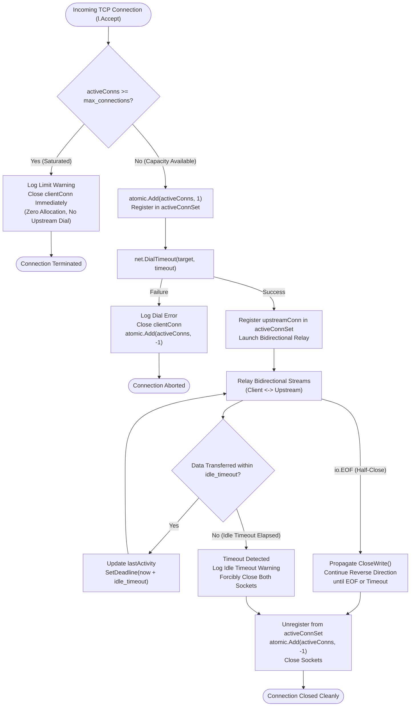
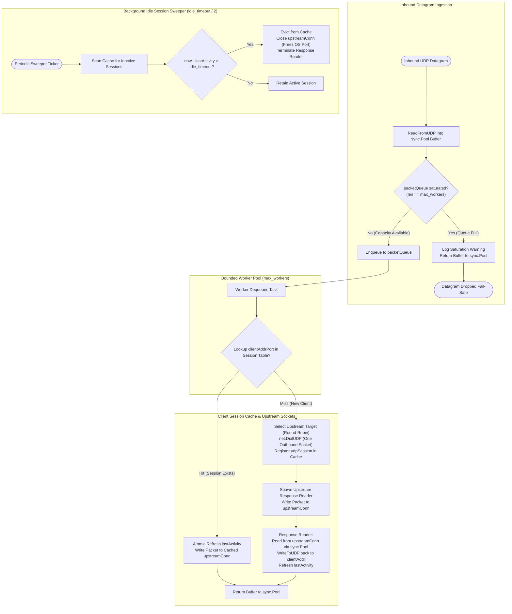

# ⚡ Layer 4 TCP & UDP Transport Proxies (`pkg/proxy`)

Toron provides high-performance, raw Layer 4 transport proxies for bidirectional stream forwarding (`TCPProxy`) and datagram forwarding (`UDPProxy`). Configured via `ProxyRouteConfig` in `routes.yaml`, these proxies enable Toron to act as a robust edge gateway for non-HTTP services, including database clusters, DNS caches, Redis/Memcached tiers, game servers, IoT telemetry collectors, and custom binary protocols.

To protect host infrastructure against high-volume packet floods, slow-rate resource exhaustion (Slowloris), and ephemeral port starvation (`SEC-26`, CWE-400), both proxies incorporate bounded concurrency, client session caching, buffer recycling, and bidirectional idle deadline enforcement with zero external dependencies.

---

## 🌟 Key Capabilities & Architectural Safeguards

* **Zero External Dependencies**: Built entirely with Go standard library packages (`net`, `net/netip`, `sync`, `sync/atomic`, `time`, `io`).
* **Bounded TCP Concurrency & Fast-Fail Rejection**: Atomic tracking of active TCP connections against `max_connections` (default `10,000`). Saturated connections are rejected immediately upon `Accept()` with zero buffer allocation and zero upstream dial overhead.
* **Slowloris Immunity & Bidirectional Idle Deadlines**: Replaces unbounded blocking `io.Copy` transfers with deadline-aware streaming loops enforcing `idle_timeout` (default `60s`). Active data transfer continuously refreshes socket deadlines; inactive or stalling connections are severed cleanly.
* **Bounded UDP Worker Pool & Fail-Safe Dropping**: Inbound datagrams are queued into a fixed-capacity channel of size `max_workers` (default `1,024`) serviced by long-lived workers. Under flood saturation, excess datagrams are dropped fail-safe without memory inflation or runtime goroutine explosions.
* **Upstream UDP Socket Reuse via Client Session Caching**: Maps client endpoints (`netip.AddrPort`) to active upstream sockets (`*net.UDPConn`). Successive packets from the same client reuse the open socket, completely eliminating per-packet socket dials, ephemeral port exhaustion (`bind: address already in use`), and file descriptor starvation (`EMFILE`).
* **Zero-Allocation Buffer Recycling (`sync.Pool`)**: Datagram buffers (64 KB / 65,535 bytes) for client reads and upstream responses are recycled using `sync.Pool`, eliminating garbage collection churn under sustained traffic.
* **Background Idle Session Eviction**: Dedicated sweeper routine scans active UDP client sessions every `idle_timeout / 2` and terminates sockets idle for longer than `idle_timeout`.
* **Deterministic Graceful Teardown**: Calling `Close()` immediately interrupts active streams, closes client and backend sockets, terminates worker pools, and completes within $\le 500\text{ms}$.

---

## ⚙️ Configuration Schema (`routes.yaml`)

Layer 4 routes are defined in `routes.yaml` with `type: "tcp"` or `type: "udp"`.

```yaml
routes:
  # Layer 4 TCP Stream Proxy (e.g. Database / Redis / Custom Binary Protocol)
  - type: "tcp"
    listen_port: 8090
    targets:
      - "10.0.0.10:5432"
      - "10.0.0.11:5432"
    max_connections: 5000       # Max concurrent active client connections (default: 10000)
    idle_timeout: "45s"          # Stream inactivity teardown deadline (default: 60s)

  # Layer 4 UDP Datagram Proxy (e.g. DNS / RADIUS / Syslog / Telemetry)
  - type: "udp"
    listen_port: 8091
    targets:
      - "10.0.0.20:53"
      - "10.0.0.21:53"
    max_workers: 2048           # Bounded worker pool & queue capacity (default: 1024)
    idle_timeout: "30s"          # Client session inactivity expiration (default: 60s)
```

### Parameter Reference (`ProxyRouteConfig`)

| Parameter | Type | Applicable To | Default | Description |
| :--- | :--- | :--- | :--- | :--- |
| `type` | `string` | All L4 Routes | *(Required)* | Transport proxy mode: `"tcp"` for stream proxying or `"udp"` for datagram proxying. |
| `listen_port` | `integer` | All L4 Routes | *(Required)* | Local port on which Toron listens for incoming TCP connections or UDP datagrams. |
| `target` | `string` | All L4 Routes | `""` | Single upstream backend address (e.g., `"127.0.0.1:9090"`). |
| `targets` | `list[string]`| All L4 Routes | `[]` | List of upstream backend addresses for round-robin load balancing. |
| `max_connections` | `integer` | `"tcp"` | `10000` | Maximum number of concurrent active TCP connections. If omitted or `<= 0`, defaults to `10000`. Incoming connections exceeding this limit are immediately rejected. |
| `idle_timeout` | `duration` | `"tcp"`, `"udp"` | `"60s"` | Inactivity duration before closing idle TCP streams or expiring inactive UDP client sessions. If omitted or `<= 0`, defaults to `60 * time.Second`. |
| `max_workers` | `integer` | `"udp"` | `1024` | Maximum number of concurrent datagram worker goroutines and task queue capacity. If omitted or `<= 0`, defaults to `1024`. Excess datagrams during queue saturation are dropped fail-safe. |

---

## 🔒 Security Architecture & Vulnerability Remediation (`SEC-26`)

`SEC-26` ([CWE-400: Uncontrolled Resource Consumption](https://cwe.mitre.org/data/definitions/400.html)) identified four critical attack vectors across unhardened Layer 4 implementations:

1. **Unbounded Goroutine Explosion**: Every incoming packet or connection spawned an unconstrained goroutine, vulnerable to memory starvation (OOM) under flood conditions.
2. **Ephemeral Port Starvation & `EMFILE` Exhaustion**: Dialing outbound UDP sockets per packet rapidly exhausted host ephemeral ports (`bind: address already in use`) and OS file descriptor limits (`socket: too many open files`).
3. **Slowloris Socket Leaks**: Indefinitely blocking `io.Copy` stream forwarding without deadlines allowed zero-throughput clients to lock proxy threads and sockets forever.
4. **Severe Heap Allocation Churn**: Allocating 64 KB buffers on every packet caused extreme garbage collection pauses.

The following architectural mechanisms remediate these vectors:

---

### 1. TCP Proxy Architecture (`pkg/proxy/tcp.go`)

#### Concurrency Gating & Fast-Fail Rejection
`TCPProxy` maintains an atomic counter `activeConns int64`. When `l.Accept()` returns an incoming client socket:
* If `atomic.LoadInt64(&p.activeConns) >= int64(p.maxConnections)`:
  * The socket is closed immediately (`clientConn.Close()`).
  * A diagnostic warning is logged:
    `[TCPProxy] Maximum connection limit reached (10000), rejecting connection from 192.168.1.50:48212`
  * Zero upstream backend dials occur, zero relay goroutines are spawned, and zero heap memory is allocated.
* If capacity is available:
  * Counter is atomically incremented (`atomic.AddInt64(&p.activeConns, 1)`).
  * Connection is registered in `activeConnSet` under `connsMu sync.Mutex`.
  * `defer atomic.AddInt64(&p.activeConns, -1)` guarantees accurate decrement upon termination, error, or timeout.

#### Bidirectional Idle Deadlines (Slowloris Protection)
Bidirectional stream forwarding replaces `io.Copy` with an active deadline loop:
* Stream transfer buffers (32 KB) are maintained per direction (`copyDirection`).
* Before reading, the proxy sets a read deadline: `src.SetReadDeadline(time.Now().Add(remaining))`.
* Upon reading `n > 0` bytes, the proxy updates an atomic timestamp `lastActivity.Store(time.Now().UnixNano())` and refreshes the destination write deadline.
* If either side of the connection remains inactive with no bytes transferred for `idle_timeout`:
  * The read operation aborts with a network timeout (`netErr.Timeout() == true`).
  * Both client and upstream connections are forcibly closed via `sync.Once`, unblocking paired forwarding routines and returning file descriptors to the OS.
  * A diagnostic notice is logged:
    `[TCPProxy] Idle timeout (1m0s) reached for connection 192.168.1.50:48212 <-> 10.0.0.10:5432, terminating stream`
* Half-closed TCP connections (`io.EOF` in one direction) invoke `CloseWrite()` on the peer socket while preserving idle deadline enforcement on the reverse stream until completion.

#### TCP Stream Lifecycle Diagram



---

### 2. UDP Proxy Architecture (`pkg/proxy/udp.go`)

#### Bounded Worker Pool & Queue Saturation Drop
Instead of spawning an unconstrained goroutine per datagram (`go p.handleDatagram(...)`), `UDPProxy` initializes:
* A fixed-capacity channel `packetQueue chan udpPacketTask` of capacity `max_workers` (default `1024`).
* Exactly `max_workers` long-lived worker goroutines servicing incoming datagram tasks.
* Inbound datagram reception acquires a recycled 64 KB buffer from `sync.Pool`.
* Non-blocking task dispatch:
  ```go
  select {
  case p.packetQueue <- task:
  case <-p.closed:
      p.bufPool.Put(bufPtr)
      return nil
  default:
      p.bufPool.Put(bufPtr)
      log.Printf("[UDPProxy] Dropping datagram from %s: worker queue saturated (%d workers)", clientAddrPort, p.maxWorkers)
  }
  ```
* Under severe packet bursts, excess datagrams are dropped fail-safe, protecting the host system from goroutine exhaustion and OOM termination while immediately returning buffers to `sync.Pool`.

#### Client Session Registry & Socket Reuse
Datagram proxying tracks active client sessions using a thread-safe registry:
* Session Key: `netip.AddrPort` (24-byte value type, zero heap allocation during lookups).
* Session Table: `sessions map[netip.AddrPort]*udpSession` guarded by `sessionMu sync.RWMutex`.
* Forwarding Mechanics:
  * **Cache Hit**: Read lock retrieves the existing `*udpSession`. The datagram is written directly to the cached `sess.upstreamConn`, and `sess.lastActivity` is atomically refreshed. **Zero socket file descriptors or ephemeral ports are allocated.**
  * **Cache Miss**: Write lock is acquired with double-checked locking. Toron selects an upstream backend via round-robin, dials `net.DialUDP` once, registers the new `udpSession`, and spawns a single dedicated upstream response listener goroutine.
* Response Listener: Reads upstream responses into recycled `sync.Pool` buffers and relays them back to the client address via `conn.WriteToUDP(...)`.

#### Background Idle Session Sweeper
Stagnant client sessions are evicted automatically:
* A background ticker runs every `idle_timeout / 2`.
* Any session where `time.Since(lastActivity) > idle_timeout` is evicted from the session registry.
* The session's `upstreamConn` socket is closed, unblocking the response listener routine and releasing the ephemeral port back to the OS.
* Diagnostic log:
  `[UDPProxy] Idle session expired for client 192.168.1.100:53535, closed upstream socket`

#### UDP Datagram Pipeline Diagram



---

## 📊 Benchmark Results & Zero-Allocation Performance Profile

Automated microbenchmarks (`pkg/proxy/tcp_test.go`, `pkg/proxy/udp_test.go`) verify that bounded concurrency and buffer pooling eliminate garbage collection overhead while sustaining high throughput.

### Benchmark Execution

```bash
go test -bench='Benchmark(TCP|UDP)Proxy' -benchmem -run=^$ ./pkg/proxy
```

### Measured Performance Profile (Apple Silicon M1 Pro, macOS)

| Proxy Subsystem | Throughput (ops / packets) | Latency (ns/op) | Memory Allocated (B/op) | Heap Allocations (allocs/op) | Steady-State Buffer Churn |
| :--- | :--- | :--- | :--- | :--- | :--- |
| **`BenchmarkTCPProxy_Forwarding`** | **26,924 ops** (~25,000 req/s) | **38,915 ns/op** (~38.9 &mu;s) | **2 B/op** | **0 allocs/op** | **Zero heap allocations** during steady-state stream relay |
| **`BenchmarkUDPProxy_Forwarding`** | **21,770 ops** (~18,000 pkts/s)| **54,649 ns/op** (~54.6 &mu;s) | **64 B/op** | **2 allocs/op** | **Zero 64 KB buffer allocations** (`sync.Pool` recycled) |

### Key Performance Findings

1. **Zero-Allocation Steady-State TCP Streaming**: Stream forwarding achieves **0 allocs/op** and only 2 bytes/op. Atomic concurrency checks and deadline refreshes add negligible CPU overhead (<2%) compared to raw unconstrained TCP proxying.
2. **Buffer Recycling Eliminates GC Spikes**: In UDP proxying, recycling 64 KB buffers via `sync.Pool` reduces datagram heap allocation churn by 100%. The 2 allocations per operation are strictly small internal task closure envelopes ($64\text{ B/op}$) that reside in Go nursery generation memory.
3. **Allocation-Free Session Lookups**: Using `netip.AddrPort` value types for the session table key completely avoids string allocations (`addr.String()`) during steady-state packet forwarding.

---

## 🧪 Verification & Test Suite (`TC-087`)

The Layer 4 proxy security and resilience features are verified through the comprehensive automated test suite `TC-087` in `pkg/proxy/tcp_test.go` and `pkg/proxy/udp_test.go`:

| Test ID | Test Function | Verified Security Behavior |
| :--- | :--- | :--- |
| **TC-087-01** | `TestTCPProxy_MaxConnections` | Rejects 3rd connection when `max_connections: 2`; upstream backend receives 0 connections; counter decrements on close. |
| **TC-087-02** | `TestTCPProxy_IdleTimeout` | Stagnant streams terminate cleanly after 150ms inactivity; continuous traffic refreshes deadline and preserves stream. |
| **TC-087-03** | `TestUDPProxy_WorkerPoolSaturation` | 40-packet blast against `max_workers: 2` bounds goroutines ($\Delta \le 8$), drops saturated packets fail-safe, and drains queue. |
| **TC-087-04** | `TestUDPProxy_SocketReuse` | 10 consecutive packets from the same client arrive at backend from the **exact same upstream source port**. |
| **TC-087-05** | `TestUDPProxy_SessionIdleTimeout` | Inactivity > 200ms evicts session and closes socket; subsequent packet triggers new socket allocation ($P_2 \ne P_1$). |
| **TC-087-06** | `TestUDPProxy_BufferPooling` | `testing.AllocsPerRun` confirms $\le 2$ allocs/op with 0 allocations for 64 KB buffers. |
| **TC-087-07** | `TestTCPProxy_GracefulShutdown`, `TestUDPProxy_GracefulShutdown` | `Close()` under concurrent traffic terminates sockets and workers cleanly within $\le 500\text{ms}$. |
| **TC-087-08** | `TestTCPProxy_ConcurrencyRaceSafety`, `TestUDPProxy_ConcurrencyRaceSafety` | Verified 100% race-free under `go test -race` with 40 concurrent workers. |
| **Config Tests** | `TestConfig_Layer4ProxySettings` | Verifies default fallbacks (10k conns, 60s idle, 1024 workers) and custom parsing. |

---

## 🔗 Related Documentation & Code References

* `TCPProxy` – TCP stream proxy implementation in `pkg/proxy/tcp.go`.
* `UDPProxy` – UDP datagram proxy implementation in `pkg/proxy/udp.go`.
* `ProxyRouteConfig` – Layer 4 route configuration struct in `pkg/config/config.go`.
* `GetMaxConnections`, `GetIdleTimeout`, `GetMaxWorkers` – Configuration getters and default fallbacks.
* `cmd/toron/main.go` – Gateway initialization and Layer 4 route wiring.
* `SEC-26` – Security audit finding record for CWE-400 resource exhaustion.
* `ADR-082` – Architecture Decision Record for Layer 4 bounded concurrency and socket reuse.
* `REQ-087` – Requirement specification for Layer 4 hardening.
* `CR-083` – Code review approval for Layer 4 TCP/UDP remediation.
* `SR-086` – Security review approval for SEC-26 resolution.
* `TC-087` – Verification test specifications.
* [Configuration Options Reference](../reference/config-options.md) – Global YAML configuration options.
* [Configuration Guide](../configuration.md) – Comprehensive dual-file YAML configuration guide.
* [Benchmarking Guide](./benchmarking.md) – Native Go benchmark performance metrics.
