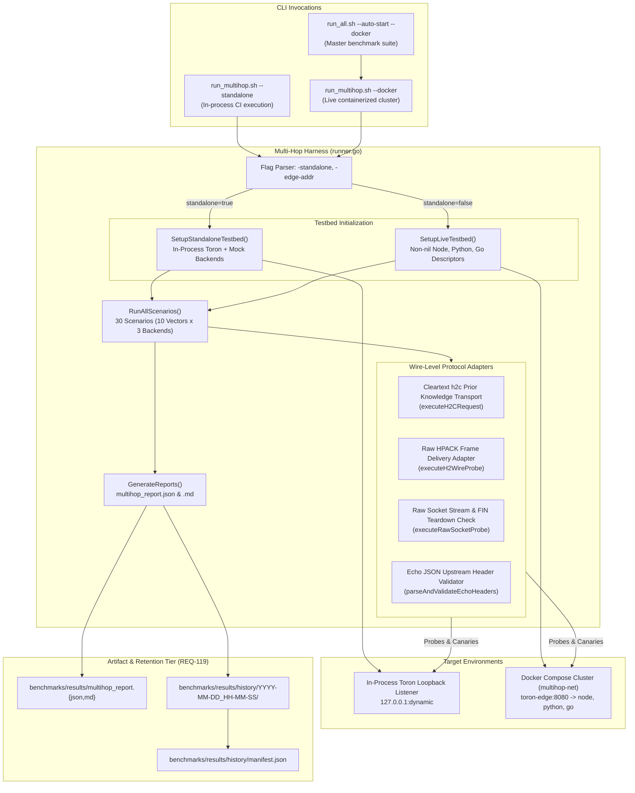
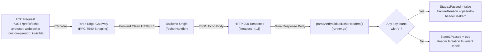

# Heterogeneous Multi-Hop Backend Origin Testbed Architecture (BMK-03 / REQ-120 / TASK-143)

## Overview

The **Heterogeneous Multi-Hop Backend Origin Testbed** (`benchmarks/multihop/runner.go`) evaluates Toron acting as an HTTP/2 and HTTP/1.1 edge gateway reverse-proxying requests to three distinct, live production backend HTTP parser runtimes across persistent connection pools:

1. **Node.js 20 LTS**: C-based `llhttp` parser engine (`/node/*` $\rightarrow$ port `9101`).
2. **Python 3.11**: ASGI `uvicorn` / `h11` parser engine (`/python/*` $\rightarrow$ port `9102`).
3. **Go 1.24**: Canonical standard library `net/http` parser engine (`/go/*` $\rightarrow$ port `9103`).

### Motivation & Empirical Scope
Introduced under **REQ-113** and formalized under **REQ-120** / **ADR-120** / **TASK-143**, this testbed directly resolves the "multi-hop ecological blindspot" critique (`AER-002` Issue 6, `AR-002` Alternative Explanation 3). By fronting heterogeneous third-party parser engines over real network sockets, it empirically demonstrates that Toron's edge protocol enforcement, RFC 7540 / RFC 9113 compliance, and HTTP/2-to-HTTP/1.1 translation layer completely prevent:
- Cross-protocol HTTP/2 to HTTP/1.1 request smuggling (CWE-444).
- Upstream HTTP/2 pseudo-header leakage (RFC 7540 §8.1.2.1).
- HTTP/1.1 dual-framing and whitespace obfuscation (RFC 7230 §3.2.4 / §3.3.3).
- CRLF header injection and response splitting (CWE-117).
- Persistent upstream connection pool poisoning and cross-tenant desynchronization (CWE-668).

---

## 1. System Architecture & Dual Execution Modes

The multi-hop harness provides two unified, schema-identical execution modes:



### 1.1 Standalone In-Process Mode (`--standalone`)
- **Zero-Dependency CI Verification**: Executes entirely using the Go standard library and vendored `golang.org/x/net/http2`, requiring no Docker daemon or external services.
- **Dynamic Loopback Listeners**: Initializes an in-process Toron Edge server on `127.0.0.1:0` via `SetupStandaloneTestbed()` alongside three in-process simulated backend mock listeners.
- **Execution Speed**: All 30 evaluation scenarios complete in approximately 1–2 seconds.

### 1.2 Live Multi-Container Mode (`--docker`)
- **Docker Compose Bridge Cluster**: Automated orchestration of 4 container services across an isolated bridge network `multihop-net` via `benchmarks/multihop/docker-compose.multihop.yml`.
- **Physical Host Routing**: The testbed runner connects to Toron Edge exposed at `127.0.0.1:8080`, evaluating the full operating system TCP/IP network stack, kernel buffers, socket framing, and cleartext h2c connection prefaces.
- **Heterogeneous Runtimes**: Real-world validation against production `llhttp` (Node.js), `uvicorn`/`h11` (Python), and `net/http` (Go).

---

## 2. Live Testbed Architecture (`SetupLiveTestbed`)

When launched with `-standalone=false -edge-addr 127.0.0.1:8080`, the harness initializes its runtime state through `SetupLiveTestbed(edgeAddr)`:

```go
func SetupLiveTestbed(edgeAddr string) *TestbedEnvironment {
    return &TestbedEnvironment{
        EdgeAddr: edgeAddr,
        IsLive:   true,
        NodeBackend: &SimulatedBackend{
            Runtime:      "Node.js 20 LTS",
            ParserEngine: "llhttp (C-based)",
            Prefix:       "node",
        },
        PyBackend: &SimulatedBackend{
            Runtime:      "Python 3.11",
            ParserEngine: "uvicorn / h11",
            Prefix:       "python",
        },
        GoBackend: &SimulatedBackend{
            Runtime:      "Go 1.24",
            ParserEngine: "net/http",
            Prefix:       "go",
        },
    }
}
```

### Architectural Invariants:
1. **Nil Pointer Dereference Immunity**: Non-nil backend target descriptors (`SimulatedBackend`) ensure that iteration over `backends := []*SimulatedBackend{env.NodeBackend, env.PyBackend, env.GoBackend}` in `RunAllScenarios` never encounters a nil pointer dereference when accessing `b.Runtime` or `b.Prefix`.
2. **Reverse Proxy Upstream Routing**: Toron Edge routes requests via `benchmarks/multihop/routes.multihop.yaml` using path prefix stripping:
   - `/node/*` $\longrightarrow$ `http://node-origin:9101/*`
   - `/python/*` $\longrightarrow$ `http://python-origin:9102/*`
   - `/go/*` $\longrightarrow$ `http://go-origin:9103/*`
3. **Safe Teardown Lifecycle Guards**: In live mode, backend processes are managed by Docker Compose. In `sb.Close()` and `env.Teardown()`, lifecycle cleanup verifies `sb.Server != nil` and `env.EdgeServer != nil` before closing listeners, preventing nil dereferences during exit traps.

---

## 3. Wire-Level Protocol Execution Adapters

All direct in-memory calls (`env.EdgeServer.HTTP2AdapterHandler().ServeHTTP(...)`) are eliminated in the live execution path. Instead, three wire-level protocol adapters interface with the target gateway:

### 3.1 Cleartext HTTP/2 (Prior Knowledge `h2c`) Adapter
Implemented in `executeH2CRequest`:
- Utilizes `golang.org/x/net/http2.Transport` configured with `AllowHTTP: true` and a custom dialer (`net.Dialer{Timeout: 2*time.Second}`).
- Transmits HTTP/2 requests directly over cleartext TCP, exercising Toron's HTTP/2 preface detection, SETTINGS exchange, and multiplexed stream routing.
- Automatically cleans up idle connections via deferred `tr.CloseIdleConnections()` and enforces bounded 3-second deadlines.

### 3.2 Raw HTTP/2 Wire Framing Adapter
Implemented in `executeH2WireProbe`:
- Standard Go HTTP clients sanitize or refuse to emit malformed HTTP/2 headers (e.g., `Transfer-Encoding: chunked`, duplicate `Content-Length`, or CRLF in header values).
- To test the edge gateway's RFC compliance directly over the wire, `executeH2WireProbe`:
  1. Opens a raw TCP connection to `env.EdgeAddr`.
  2. Transmits the 24-byte client connection preface (`PRI * HTTP/2.0\r\n\r\nSM\r\n\r\n`).
  3. Exchanges SETTINGS frames using `http2.NewFramer`.
  4. Encodes targeted attack headers using `golang.org/x/net/http2/hpack` without client-side normalization.
  5. Emits raw `HEADERS` and `DATA` frames onto the TCP connection.
  6. Captures response frames, recording HTTP `400 Bad Request` or protocol stream terminations (`RST_STREAM`, `GOAWAY`) as successful active defense rejections (`Stage1Passed = true`).

### 3.3 Raw TCP Socket Stream Probing
Implemented in `executeRawSocketProbe`:
- Evaluates HTTP/1.1 smuggling vectors (`VECTOR-04`, `VECTOR-05`, `VECTOR-06`) by writing raw byte streams to TCP sockets.
- Captures status line responses and verifies fail-fast socket teardown (`FIN`/`RST`) via `verifySocketClosed`, confirming that leftover unparsed bytes in socket buffers cannot trigger request pipeline desynchronization.

---

## 4. Upstream Header Isolation Verification (`VECTOR-08`)

RFC 7540 §8.1.2.1 explicitly prohibits HTTP/2 pseudo-headers (headers starting with `:`) from appearing in forwarded HTTP/1.1 requests. If an edge proxy forwards pseudo-headers, upstream parsers may reject the request (`HPE_INVALID_HEADER_TOKEN`) or suffer routing bypasses.

To verify pseudo-header stripping against containerized backends where in-memory reflection is impossible, `VECTOR-08` verifies upstream isolation over the wire:



### Verification Steps:
1. The harness transmits an h2c request to `POST /<prefix>/echo` containing `:protocol: websocket` and `:custom-pseudo: invisible`.
2. All three backend origins (`backends/node/server.js`, `backends/python/server.py`, `backends/go/main.go`) implement `POST /echo`, echoing all received upstream headers as JSON under `"headers"`.
3. In `parseAndValidateEchoHeaders`, the harness unmarshals the JSON response body and iterates over all keys.
4. If any key starts with `:` (`strings.HasPrefix(strings.TrimSpace(k), ":")`), the scenario fails immediately with `pseudo-header leaked to upstream: <key>`.

---

## 5. Two-Stage Desynchronization Protocol

Every evaluation scenario executes a two-stage verification sequence:

```mermaid
sequenceDiagram
    autonumber
    actor Runner as Testbed Runner (runner.go)
    participant Edge as Toron Edge Gateway (127.0.0.1:8080)
    participant Origin as Backend Origin (Node / Python / Go)

    Note over Runner,Edge: STAGE 1: Attack or Baseline Probe (r_poison)
    alt HTTP/2 Vector (VECTOR-01, 02, 03, 07, 08)
        Runner->>Edge: Cleartext h2c Wire Frame Stream (Preface + SETTINGS + HEADERS)
        alt Malformed Attack Vector (H2.TE / H2.CL-Duplicate / CRLF)
            Edge-->>Runner: 400 Bad Request / RST_STREAM (Active Defense)
        else Pseudo-Header Isolation Vector (VECTOR-08)
            Edge->>Edge: Strip Pseudo-Headers (:protocol, :custom-pseudo)
            Edge->>Origin: Forward Clean HTTP/1.1 POST /echo
            Origin-->>Edge: 200 OK {"headers": {...}}
            Edge-->>Runner: 200 OK {"headers": {...}}
            Runner->>Runner: parseAndValidateEchoHeaders() -> 0 colon headers
        end
    else HTTP/1.1 Smuggling Vector (VECTOR-04, 05, 06)
        Runner->>Edge: Raw TCP Bytes (CL.TE / Obfuscated TE / Pipelined Smuggle)
        Edge-->>Runner: 400 Bad Request + Socket FIN/RST Teardown
    else Baseline Reference Vector (VECTOR-09, 10)
        Runner->>Edge: Standard GET /health or POST /echo
        Edge->>Origin: Forward Valid Request
        Origin-->>Edge: 200 OK
        Edge-->>Runner: 200 OK
    end

    Note over Runner,Origin: STAGE 2: Benign Canary Verification (r_benign)
    Runner->>Edge: HTTP/1.1 GET /<prefix>/canary (Over Persistent Pool)
    Edge->>Origin: Forward GET /canary
    Origin-->>Edge: 200 OK {"status": "canary_ok"}
    Edge-->>Runner: 200 OK {"status": "canary_ok"}
    Runner->>Runner: Assert Canary Passed; Desynchronization == false; PoolIntegrity == true
```

### Protocol Stages:
- **Stage 1 ($r_{\text{poison}}$)**: Transmits attack or baseline vector. Edge rejections are asserted to return HTTP 400 or protocol stream errors.
- **Stage 2 ($r_{\text{benign}}$)**: Immediately transmits `GET /<prefix>/canary` over HTTP/1.1 keep-alive on the same persistent upstream connection pool.
  - The origin returns `200 OK` with JSON `{"status": "canary_ok", "sequence": N}`.
  - Assertions: `res.Stage2CanaryStatus == 200`, body contains `"canary_ok"`, `res.Desynchronization == false`, `res.PoolIntegrity == true`.
  - Proves that edge rejections physically close invalid transport sockets without poisoning backend pools.

---

## 6. Curated Vector Matrix (10 Vectors $\times$ 3 Backends = 30 Scenarios)

| Vector ID | Vector Name | Protocol | Attack Mechanism / Payload | Edge Defense Invariant |
| :--- | :--- | :---: | :--- | :--- |
| **`VECTOR-01`** | `H2.TE` | HTTP/2 (h2c) | HTTP/2 request with forbidden `Transfer-Encoding: chunked` | RFC 7540 §8.1.2.2: Rejection with `400 Bad Request` or `RST_STREAM` |
| **`VECTOR-02`** | `H2.CL-Duplicate` | HTTP/2 (h2c) | Duplicate conflicting `Content-Length` headers (`5` and `10`) | RFC 7540 §8.1.2.6: Rejection with `400 Bad Request` (`PROTOCOL_ERROR`) |
| **`VECTOR-03`** | `H2.CL-Mismatch` | HTTP/2 (h2c) | Declares `Content-Length: 50` but transmits only 5 body bytes | RFC 7540 §8.1.2.6: Rejection with `400 Bad Request` on premature `END_STREAM` |
| **`VECTOR-04`** | `H1-CL.TE` | HTTP/1.1 (TCP) | Ambiguous dual-framing with both `Content-Length` and `Transfer-Encoding` | RFC 7230 §3.3.3: Rejection with `400 Bad Request` + socket teardown (`FIN`/`RST`) |
| **`VECTOR-05`** | `H1-TE.CL-Obfuscated` | HTTP/1.1 (TCP) | Whitespace before colon (`Transfer-Encoding : chunked`) | RFC 7230 §3.2.4: Rejection with `400 Bad Request` + socket teardown |
| **`VECTOR-06`** | `H1-Pipelined-Smuggle` | HTTP/1.1 (TCP) | Pipelined prefix attempting pipeline buffer eviction | RFC 7230: Rejection with `400 Bad Request` + socket closure before pipeline execution |
| **`VECTOR-07`** | `CRLF-Header-Injection` | HTTP/2 (h2c) | Header value embedding carriage return and newline (`val\r\nEvil: injected`) | RFC 7540 §10.3: Rejection with `400 Bad Request` / stream reset |
| **`VECTOR-08`** | `Pseudo-Header-Isolation` | HTTP/2 (h2c) | Valid request with pseudo-headers (`:protocol`, `:custom-pseudo`) to `/echo` | RFC 7540 §8.1.2.1: Strips pseudo-headers; zero `:` headers in origin `/echo` JSON |
| **`VECTOR-09`** | `Baseline-Standard-GET` | HTTP/1.1 | Standard benign `GET /<prefix>/health` | Proxied cleanly; returns `200 OK` |
| **`VECTOR-10`** | `Baseline-Standard-POST` | HTTP/1.1 | Standard benign `POST /<prefix>/echo` with JSON body | Proxied cleanly; returns `200 OK` |

---

## 7. Execution Guide & CLI Reference

### 7.1 Running via Shell Wrapper (`run_multihop.sh`)

```bash
# 1. Standalone in-process mode (zero Docker dependency, ideal for CI)
bash benchmarks/multihop/run_multihop.sh --standalone

# 2. Live multi-container Docker Compose cluster mode
bash benchmarks/multihop/run_multihop.sh --docker

# 3. Target an existing running Edge Gateway instance
bash benchmarks/multihop/run_multihop.sh -e 127.0.0.1:8080
```

### 7.2 Running via Go Test Harness (with Race Detector)

```bash
go test -v -race -count=1 ./benchmarks/multihop/...
```

### 7.3 Master Benchmark Suite Integration

The multi-hop testbed is integrated into Stage 5 of the master benchmark orchestrator:
```bash
./benchmarks/run_all.sh --auto-start --docker
```

---

## 8. Artifact Retention & Schema Conformance (`REQ-119`)

Execution of `run_multihop.sh` generates matching reports in both modes:
- Canonical JSON: `benchmarks/results/multihop_report.json`
- Canonical Markdown: `benchmarks/results/multihop_report.md`
- Historical Snapshot: `benchmarks/results/history/<timestamp>/`
- Central Manifest: `benchmarks/results/history/manifest.json`

### JSON Report Schema Example:
```json
{
  "timestamp": "2026-09-12T14:33:47+05:30",
  "target_edge": "127.0.0.1:53123",
  "execution_mode": "Standalone In-Process (Pure Go)",
  "total_scenarios": 30,
  "passed_scenarios": 30,
  "failed_scenarios": 0,
  "overall_verdict": "PASS",
  "desynchronization_detected": false,
  "pool_poisoning_detected": false,
  "backends": [
    {
      "runtime": "Node.js 20 LTS",
      "parser_engine": "llhttp (C-based)",
      "prefix": "node",
      "scenarios_tested": 10,
      "scenarios_passed": 10
    },
    {
      "runtime": "Python 3.11",
      "parser_engine": "uvicorn / h11",
      "prefix": "python",
      "scenarios_tested": 10,
      "scenarios_passed": 10
    },
    {
      "runtime": "Go 1.24",
      "parser_engine": "net/http",
      "prefix": "go",
      "scenarios_tested": 10,
      "scenarios_passed": 10
    }
  ],
  "results": [...]
}
```
