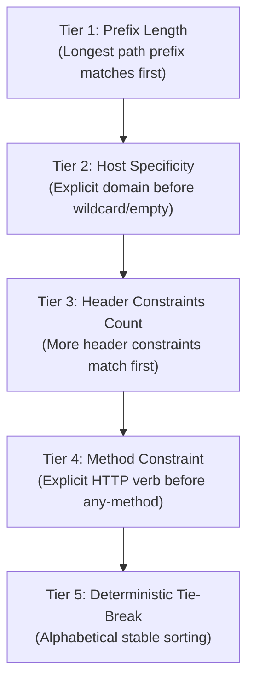

# 🐳 Vendor-Agnostic OCI Container Auto-Discovery Engine (`pkg/discovery`)

Toron Edge Gateway features a vendor-agnostic, zero-dependency **OCI Container Auto-Discovery Engine** ([`pkg/discovery`](file:///Users/sneha/Developer/toron-research/toron/pkg/discovery)). It monitors container runtime Unix domain sockets in real time, aggregates multi-replica service instances into high-performance round-robin load balancers, enforces strict specificity-based route ordering, and dynamically reconciles routing state with zero downtime.

---

## 🌟 Supported Container Runtimes & Engines

Toron communicates directly over Unix domain sockets (`unix://`) using the pure Go standard library HTTP transport, eliminating any external runtime SDKs, daemon dependencies, or binary bloat:

* **Docker Engine** (`/var/run/docker.sock`)
* **Podman** (`/run/podman/podman.sock` or rootless `/run/user/$UID/podman/podman.sock`)
* **Finch** (AWS OCI toolchain)
* **Nerdctl / Containerd** (`/run/containerd/containerd.sock`)
* **CRI-O** Unix domain sockets

---

## ⚙️ Gateway Configuration (`toron.yaml`)

To enable container auto-discovery, configure the `discovery:` block in `toron.yaml`:

```yaml
discovery:
  enabled: true
  engine: "auto"              # Options: "auto", "docker", "podman"
  socket_path: "auto"         # Auto-probes standard socket paths if "auto"
  poll_interval: 10s          # Fallback periodic scan interval
  default_weight: 1           # Default load balancing weight
```

When Toron boots, it initiates event streaming (`/events`) from the container runtime socket while running an initial scan of all active containers.

---

## 🏷️ Container Label Taxonomy & Routing Rules

Attach `toron.*` metadata labels or annotations when launching containers. Toron dynamically inspects these labels to register, balance, and route traffic.

| Label Key | Type | Default | Description | Example |
| :--- | :--- | :--- | :--- | :--- |
| **`toron.enable`** | `boolean` | `false` | **Required**. Opt-in flag (`"true"`, `"1"`, `"yes"`) | `toron.enable: "true"` |
| **`toron.host`** | `string` | `""` (any) | Domain host constraint (case-insensitive) | `toron.host: "api.example.com"` |
| **`toron.prefix`** | `string` | `""` | Path prefix routing rule (leading slash enforced) | `toron.prefix: "/v1/orders"` |
| **`toron.port`** | `integer` | First exposed / `80` | Internal container port to forward traffic to | `toron.port: "8080"` |
| **`toron.method`** | `string` | `""` (any) | HTTP method constraint (normalized to uppercase) | `toron.method: "POST"` |
| **`toron.header.<Name>`** | `string` | — | Exact key-value header match constraint | `toron.header.X-Version: "canary"` |
| **`toron.headers`** | `string` | — | Grouped header rules (JSON object or CSV) | `toron.headers: '{"X-Env":"staging"}'` |
| **`toron.weight`** | `integer` | `1` | Load balancing weight | `toron.weight: "5"` |
| **`toron.health_check`** | `string` | `""` | Active HTTP health check probe path | `toron.health_check: "/healthz"` |
| **`toron.health_check_interval`** | `duration`| `0` (disabled) | Health check probe interval (Go duration string) | `toron.health_check_interval: "5s"` |
| **`toron.strip_prefix`** | `boolean` | `true` | Strip matched route prefix before upstream forwarding | `toron.strip_prefix: "false"` |
| **`toron.rewrite_redirects`** | `boolean` | `true` | Rewrite upstream 3xx `Location` redirect headers | `toron.rewrite_redirects: "true"` |
| **`toron.rewrite_cookie_path`**| `boolean` | `true` | Rewrite upstream `Set-Cookie: Path=` attributes | `toron.rewrite_cookie_path: "true"` |

### Header Constraint Parsing Rules
1. **Grouped Format (`toron.headers`)**:
   - **JSON Object Format**: If the value is enclosed in curly braces `{ ... }`, it is parsed as a JSON map:
     ```yaml
     toron.headers: '{"X-Tenant":"alpha","X-Tier":"premium"}'
     ```
   - **Comma-Delimited (CSV) Format**: If not JSON, it is parsed as comma-separated `key=value` tokens:
     ```yaml
     toron.headers: "X-Tenant=alpha,X-Tier=premium"
     ```
2. **Individual Format (`toron.header.<Name>`)**:
   - Individual header labels can be specified independently:
     ```yaml
     toron.header.X-Region: "us-east-1"
     ```
3. **Additive Merging & Precedence**:
   - Individual `toron.header.<Name>` labels and grouped `toron.headers` are merged additively.
   - If the same header name appears in both, the specific `toron.header.<Name>` value takes precedence.
   - Malformed JSON falls back gracefully to CSV parsing or is ignored without panicking or rejecting the container.

---

## 🧩 4-Dimensional Partitioning via `CompositeRouteKey`

To prevent traffic collisions between distinct deployment stages (e.g., Canary vs Baseline) and between distinct HTTP verbs, discovered routes are **never** partitioned solely by `(Host, Prefix)`.

Instead, the discovery engine partitions containers using a 4-dimensional composite key:

$$\text{CompositeRouteKey} = (\text{Host}, \text{Prefix}, \text{Method}, \text{CanonicalHeaders})$$

```
+-------------------------------------------------------------------------------+
|                             CompositeRouteKey                                 |
|                                                                               |
|  Host:             "api.example.com"    (lowercase domain or "")              |
|  Prefix:           "/v1/checkout"       (normalized path prefix)              |
|  Method:           "POST"               (normalized uppercase or "")          |
|  CanonicalHeaders: "X-Region=us-east&X-Version=canary" (sorted query-format) |
+-------------------------------------------------------------------------------+
```

### Deterministic Header Canonicalization
In Go, iterating over `map[string]string` yields pseudo-random ordering. If headers were serialized naively, identical sets of container labels would produce fluctuating key strings across reconciliation passes, inducing route oscillation.

Toron guarantees determinism by:
1. Extracting all header keys.
2. Sorting keys alphabetically (`sort.Strings(keys)`).
3. Formatting keys and values into a canonical string: `key1=val1&key2=val2&...&keyN=valN`.
4. Storing empty string `""` when no header constraints exist.

### Separation of Routing Variants
Containers sharing `(Host, Prefix)` that differ in `Headers` or `Method` yield distinct composite keys and separate route entries:
- **Baseline Service** (`Headers: nil`, `Method: ""`):
  $$\text{Key}_{\text{base}} = (\text{"api.example.com"}, \text{"/v1"}, \text{""}, \text{""})$$
- **Canary Service** (`Headers: {"X-Version": "canary"}`, `Method: ""`):
  $$\text{Key}_{\text{canary}} = (\text{"api.example.com"}, \text{"/v1"}, \text{""}, \text{"X-Version=canary"})$$

Canary targets and baseline targets are grouped into completely isolated upstream pools. Canary traffic never leaks to baseline containers, and normal traffic never hits unreleased canary pods.

---

## ⚖️ Multi-Replica Target Aggregation & Fair Load Balancing

Prior versions of container discovery registered each container replica as an independent single-target route (`Targets: []string{containerIP}`). Because router evaluation performed a linear first-match lookup, **Replica #1 received 100% of incoming requests**, while subsequent replicas #2 through $M$ received 0% of traffic, defeating horizontal scaling.

Toron resolves this through **Target Aggregation**:

```
Container 1 (10.0.1.10:8080) \
Container 2 (10.0.1.11:8080)  ---> Consolidated Upstream Pool ---> [10.0.1.10:8080, 10.0.1.11:8080, 10.0.1.12:8080]
Container 3 (10.0.1.12:8080) /                                     (Round-Robin Load Balancer)
```

1. **Target Aggregation & Deduplication**:
   All active containers sharing an identical `CompositeRouteKey` have their target endpoints (`http://<IP>:<Port>`) gathered into a unified list, deduplicated, and sorted alphabetically.
2. **Fair Load Balancing**:
   The route is compiled with `proxy.AlgorithmRoundRobin`, ensuring traffic is distributed evenly across all $M$ active replicas:
   $$\text{Traffic Share} \approx \frac{1}{M} \quad \forall \text{ replica } i \in \{1, \dots, M\}$$
3. **Proxy Option Consolidation**:
   Shared attributes such as `StripPrefix`, `RewriteRedirects`, `RewriteCookiePath`, `HealthCheckPath`, and `HealthCheckInterval` are cleanly inherited from active containers in the group.

---

## 🎯 Specificity-Based Route Ordering (ADR-005 Compliance)

To eliminate **route shadowing**—where a broadly scoped route intercepts requests meant for a more specific endpoint—Toron's router organizes all prefix routes into a strict 5-tier specificity hierarchy:



### 5-Tier Specificity Ranking
1. **Tier 1 - Prefix Length**: Longer subpaths take precedence over shorter subpaths (e.g., `/api/v1/checkout` before `/api/v1` before `/api`).
2. **Tier 2 - Host Specificity**: Routes bound to a specific domain (`host: "api.example.com"`) evaluate before host-agnostic routes (`host: ""`).
3. **Tier 3 - Header Constraints Count**: Routes specifying more header matching criteria evaluate before routes with fewer or no headers. A canary route requiring `X-Version: canary` strictly precedes the unconstrained baseline route.
4. **Tier 4 - Method Constraint**: Specific HTTP verbs (e.g., `POST`, `DELETE`) evaluate before wildcard any-method routes (`""`).
5. **Tier 5 - Deterministic Tie-Break**: Stable lexicographical sorting across Host, Prefix, Method, and CanonicalHeaders.

### Guaranteed Anti-Shadowing Proof
Consider two routes configured for `/api`:
* **Route 1 (Baseline)**: `Prefix: "/api"`, `Headers: {}`, `Method: ""`
* **Route 2 (Canary)**: `Prefix: "/api"`, `Headers: {"X-Version": "canary"}`, `Method: ""`

Regardless of container startup order:
* Specificity sorting places **Route 2 ahead of Route 1** because Route 2 has 1 header constraint while Route 1 has 0.
* A client request bearing `X-Version: canary` is evaluated against Route 2 first, matching and routing to the canary container.
* A client request without the header evaluates Route 2, fails the header check, falls through to Route 1, and routes to the baseline container.
* Route shadowing is mathematically eliminated.

---

## 🔄 Dynamic Lifecycle & Zero-Downtime Scale Down

The container discovery manager uses declarative reconciliation via `router.ReplacePrefixRoutesBySource("oci-discovery", desiredSpecs)` for all lifecycle transitions (`EventStart`, `EventStop`, `EventDie`, and periodic resync).

### Non-Destructive Partial Scale-Down
When 1 replica of an $M$-replica service ($M \ge 2$) terminates, restarts, or crashes:
1. The runtime emits an `EventStop` or `EventDie` event.
2. The discovery manager updates its active container state and recalculates `desiredSpecs`.
3. The remaining $M-1$ healthy replicas are re-aggregated into the route's target slice.
4. `ReplacePrefixRoutesBySource` atomically swaps the route's upstream load balancer under write lock.
5. **Zero Downtime Guarantee**: Concurrent client requests continue seamlessly across the surviving $M-1$ replicas. No request encounters an HTTP 404, dropped TCP connection, or premature deletion window.

### Clean Proxy & Health Check Teardown
When the final replica ($M=1$) of a service terminates:
1. The route is omitted from `desiredSpecs`.
2. Toron identifies the evicted route and immediately invokes `.Close()` on the underlying `ReverseProxy`.
3. The reverse proxy terminates active background health check ticker goroutines (`StopActiveHealthCheck`) and closes idle connection pools.
4. Socket descriptors (`EMFILE`) and goroutines are promptly reclaimed, eliminating resource leakage on high-churn container clusters.

### Subsystem Source Isolation
Changes initiated by container discovery affect only routes tagged with `source: "oci-discovery"`. Prefix routes configured by Kubernetes Ingress (`"k8s-ingress"`), static configuration (`"config"`), or filesystem servers (`"static"`) remain unaffected.

---

## 🚀 Deployment Examples

### Example 1: Multi-Replica High-Availability Service

Deploy 3 container replicas sharing the same domain and path. Toron automatically consolidates them into a single round-robin load balancer.

```bash
# Replica 1
docker run -d \
  --name web-app-1 \
  --label "toron.enable=true" \
  --label "toron.host=app.example.com" \
  --label "toron.prefix=/service" \
  --label "toron.port=8080" \
  --label "toron.health_check=/healthz" \
  --label "toron.health_check_interval=5s" \
  my-web-service:v1.0

# Replica 2
docker run -d \
  --name web-app-2 \
  --label "toron.enable=true" \
  --label "toron.host=app.example.com" \
  --label "toron.prefix=/service" \
  --label "toron.port=8080" \
  --label "toron.health_check=/healthz" \
  --label "toron.health_check_interval=5s" \
  my-web-service:v1.0

# Replica 3
docker run -d \
  --name web-app-3 \
  --label "toron.enable=true" \
  --label "toron.host=app.example.com" \
  --label "toron.prefix=/service" \
  --label "toron.port=8080" \
  --label "toron.health_check=/healthz" \
  --label "toron.health_check_interval=5s" \
  my-web-service:v1.0
```

Toron aggregates the three container IPs into:
```
Target Pool: ["http://172.17.0.2:8080", "http://172.17.0.3:8080", "http://172.17.0.4:8080"]
Load Balancer: Round-Robin (33.3% load per container)
```

Stopping `web-app-1` automatically updates the pool to the remaining 2 containers with zero downtime and zero HTTP 404 errors.

---

### Example 2: Baseline Service vs Canary Release Deployment

Deploy a baseline service alongside a canary container testing a new release.

```bash
# 1. Baseline Service (Production v1.0)
docker run -d \
  --name payment-base-1 \
  --label "toron.enable=true" \
  --label "toron.host=checkout.example.com" \
  --label "toron.prefix=/pay" \
  --label "toron.port=9000" \
  payment-service:v1.0

docker run -d \
  --name payment-base-2 \
  --label "toron.enable=true" \
  --label "toron.host=checkout.example.com" \
  --label "toron.prefix=/pay" \
  --label "toron.port=9000" \
  payment-service:v1.0

# 2. Canary Release (Experimental v2.0 - Header-Gated)
docker run -d \
  --name payment-canary \
  --label "toron.enable=true" \
  --label "toron.host=checkout.example.com" \
  --label "toron.prefix=/pay" \
  --label "toron.port=9000" \
  --label "toron.header.X-Version=canary" \
  payment-service:v2.0
```

#### Routing Behavior:
* **Standard Client Request**:
  ```http
  GET /pay/process HTTP/1.1
  Host: checkout.example.com
  ```
  Evaluates Canary route $\to$ missing `X-Version: canary` header $\to$ falls through to Baseline route $\to$ load balanced between `payment-base-1` and `payment-base-2`.

* **Canary Client Request**:
  ```http
  GET /pay/process HTTP/1.1
  Host: checkout.example.com
  X-Version: canary
  ```
  Evaluates Canary route first due to ADR-005 specificity ordering $\to$ header matches $\to$ proxied directly to `payment-canary`.

---

### Example 3: Method-Specific Endpoint Routing

Direct `GET` requests to a read-replica caching container while routing `POST`/`PUT` operations to a primary transactional container.

```bash
# Read-Only Container (GET requests)
docker run -d \
  --name order-query-service \
  --label "toron.enable=true" \
  --label "toron.host=orders.example.com" \
  --label "toron.prefix=/orders" \
  --label "toron.method=GET" \
  --label "toron.port=8080" \
  order-read:latest

# Write Container (POST requests)
docker run -d \
  --name order-command-service \
  --label "toron.enable=true" \
  --label "toron.host=orders.example.com" \
  --label "toron.prefix=/orders" \
  --label "toron.method=POST" \
  --label "toron.port=8081" \
  order-write:latest
```

---

### Example 4: Grouped Headers via JSON or CSV

Specify multiple header matching conditions using `toron.headers`:

```bash
# JSON Object Syntax
docker run -d \
  --name admin-tool \
  --label "toron.enable=true" \
  --label "toron.host=mgmt.example.com" \
  --label "toron.prefix=/tools" \
  --label "toron.headers={\"X-Role\":\"admin\",\"X-Env\":\"production\"}" \
  --label "toron.port=7000" \
  admin-dashboard:latest

# CSV Syntax
docker run -d \
  --name beta-tester \
  --label "toron.enable=true" \
  --label "toron.host=app.example.com" \
  --label "toron.prefix=/beta" \
  --label "toron.headers=X-Feature=new-ui,X-Group=beta-testers" \
  --label "toron.port=8080" \
  ui-beta:latest
```

---

## 🔍 Observability & Telemetry Inspection

Inspect active container routes and load balancer targets at runtime via Toron's internal management API:

```bash
curl -H "X-Toron-Admin-Key: $ADMIN_KEY" http://127.0.0.1:8080/internal/api/routes | jq .
```

Discovered routes report their `source: "oci-discovery"`, aggregated `targets`, `method`, and `headers`:

```json
[
  {
    "host": "checkout.example.com",
    "prefix": "/pay",
    "method": "",
    "headers": {
      "X-Version": "canary"
    },
    "source": "oci-discovery",
    "targets": [
      "http://172.17.0.4:9000"
    ]
  },
  {
    "host": "checkout.example.com",
    "prefix": "/pay",
    "method": "",
    "source": "oci-discovery",
    "targets": [
      "http://172.17.0.2:9000",
      "http://172.17.0.3:9000"
    ]
  }
]
```
