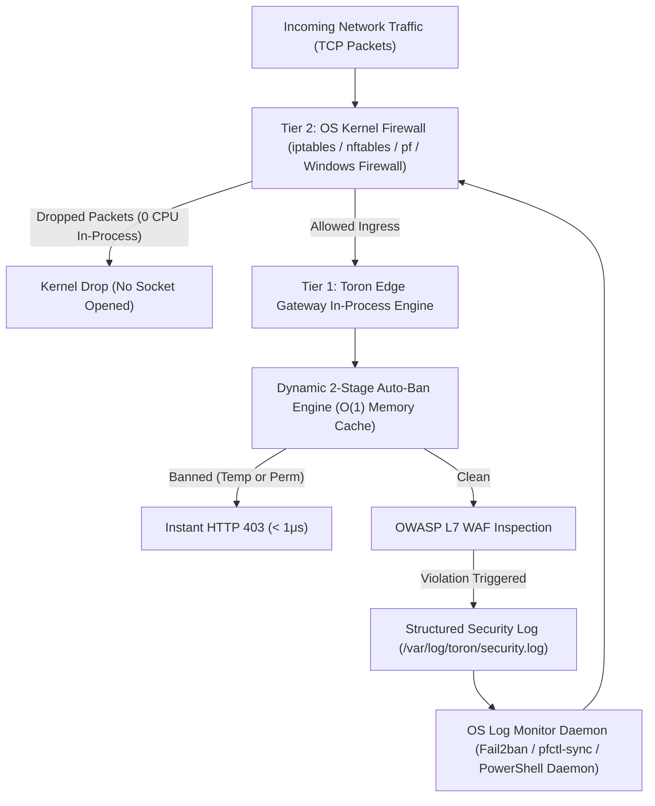

# Multi-Tier Threat Defense & OS-Level IP Blocking Guide

## 1. Architectural Model: Dual-Tier IP Defense

When deploying high-performance edge gateways on public networks, defending against malicious bots, automated vulnerability scanners, and brute-force tools requires a **Dual-Tier Defense Model**:



1. **Tier 1 (Application In-Process Defense)**:
   - Toron's built-in **Dynamic 2-Stage Auto-Ban Engine** monitors WAF anomaly scores, path traversal attempts, and protocol violations.
   - Malicious IPs receive **Stage 1 Temporary Bans** upon exceeding violation thresholds within sliding windows.
   - Chronic repeat offenders are automatically escalated to **Stage 2 Permanent Bans** persisted to `banned_ips.json`.
   - Banned IPs are rejected in $\mathcal{O}(1)$ time ($< 1\mu\text{s}$) with `HTTP 403 Forbidden` without regex or upstream processing.

2. **Tier 2 (Operating System & Kernel Firewall Defense)**:
   - To completely offload TCP connection handshakes and kernel socket allocations during volumetric bursts, Toron outputs structured JSON events to `/var/log/toron/security.log`.
   - Host-level security tools ingest these logs to inject kernel-level drop rules directly into the OS packet filter.

---

## 2. Linux: Fail2ban with iptables / nftables

### 2.1 Overview
Fail2ban dynamically monitors log files for malicious patterns and modifies `iptables` or `nftables` chains to drop packets at the kernel level.

### 2.2 Step 1: Create Fail2ban Filter Definition
Create `/etc/fail2ban/filter.d/toron-waf.conf`:

```ini
[Definition]
# Matches Toron JSON security log output for WAF blocks and auto-ban events
failregex = ^\{.*"event":"(waf_block|ip_acl_block|protocol_violation|auto_ban_drop)".*"client_ip":"<HOST>".*\}$
            ^\{.*"client_ip":"<HOST>".*"action":"blocked".*\}$

# Ignore loopback and internal RFC 1918 traffic
ignoreregex = "client_ip":"(127\.0\.0\.1|::1)"
```

### 2.3 Step 2: Configure the Toron Jail
Create `/etc/fail2ban/jail.d/toron.conf`:

```ini
[toron-waf]
enabled  = true
port     = http,https,80,443
filter   = toron-waf
logpath  = /var/log/toron/security.log
backend  = auto
maxretry = 1
findtime = 120
bantime  = 86400
# Multi-stage progressive banning in fail2ban
bantime.increment = true
bantime.factor = 2
bantime.maxtime = 604800
# Note: On systems using firewalld, 00-firewalld.conf provides 'banaction = firewallcmd-rich-rules' automatically.
# On Debian/Ubuntu iptables systems, action can be set explicitly:
# action = iptables-multiport[name=ToronWAF, port="http,https", protocol=tcp]
```

### 2.4 Step 3: Test and Activate
```bash
# Test regex against actual log file
fail2ban-regex /var/log/toron/security.log /etc/fail2ban/filter.d/toron-waf.conf

# Restart and check status
systemctl restart fail2ban
fail2ban-client status toron-waf

# To manually ban an IP immediately at the kernel layer:
fail2ban-client set toron-waf banip 198.51.100.1

# To manually unban an IP via Fail2ban:
fail2ban-client set toron-waf unbanip 198.51.100.1
```

---

## 3. macOS: Packet Filter (`pfctl`)

### 3.1 Overview
macOS features the BSD **Packet Filter (`pf`)**. By maintaining a persistent table in `pf`, a lightweight background script can ingest Toron security logs and instantly drop packets in the Darwin kernel.

### 3.2 Step 1: Configure `/etc/pf.anchors/toron.rules`
Create `/etc/pf.anchors/toron.rules`:

```pf
# Define table for banned IPs
table <toron_banned_ips> persist

# Drop all incoming TCP traffic on HTTP/HTTPS ports from banned table
block drop in quick proto tcp from <toron_banned_ips> to any port { 80, 443 }
```

### 3.3 Step 2: Include Anchor in `/etc/pf.conf`
Add the following anchor references to `/etc/pf.conf`:

```pf
anchor "toron"
load anchor "toron" from "/etc/pf.anchors/toron.rules"
```

Reload and enable `pf`:
```bash
sudo pfctl -f /etc/pf.conf
sudo pfctl -e
```

### 3.4 Step 3: Automated macOS Log Monitor Script
Create `/usr/local/bin/toron-pf-sync.sh`:

```bash
#!/bin/bash
# Tail Toron security log and insert banned IPs into pf table
LOG_FILE="/var/log/toron/security.log"

tail -Fn0 "$LOG_FILE" | while read -r line; do
    if echo "$line" | grep -q '"action":"blocked"'; then
        IP=$(echo "$line" | sed -n 's/.*"client_ip":"\([^"]*\)".*/\1/p')
        if [[ -n "$IP" && "$IP" != "127.0.0.1" && "$IP" != "::1" ]]; then
            sudo pfctl -t toron_banned_ips -T add "$IP"
            logger -t toron-pf "Kernel dropped client IP: $IP"
        fi
    fi
done
```

Make executable and manage table:
```bash
chmod +x /usr/local/bin/toron-pf-sync.sh

# View currently banned IPs in pf
sudo pfctl -t toron_banned_ips -T show

# Remove IP from pf table
sudo pfctl -t toron_banned_ips -T delete 198.51.100.1
```

---

## 4. Windows: Windows Defender Firewall via PowerShell

### 4.1 Overview
On Windows Server or Windows 10/11, Windows Defender Firewall can be automated via PowerShell to block offending IPs upon detection in Toron's security logs.

### 4.2 Step 1: PowerShell Log Monitor & Firewall Enforcer
Create `C:\Toron\scripts\Toron-FirewallSync.ps1`:

```powershell
# Toron Windows Defender Firewall Dynamic Blocking Script
$LogPath = "C:\Toron\logs\security.log"
$RuleNamePrefix = "Toron_AutoBan_"
$MaxViolations = 3
$Violations = @{}

Write-Host "Starting Toron Security Log Monitor on Windows..." -ForegroundColor Cyan

Get-Content -Path $LogPath -Wait -Tail 0 | ForEach-Object {
    $line = $_
    if ($line -match '"action":"blocked"') {
        if ($line -match '"client_ip":"([^"]+)"') {
            $ip = $matches[1]
            if ($ip -ne "127.0.0.1" -and $ip -ne "::1") {
                $Violations[$ip] = [int]$Violations[$ip] + 1
                Write-Host "[WAF Block] IP: $ip (Strikes: $($Violations[$ip]))" -ForegroundColor Yellow

                if ($Violations[$ip] -ge $MaxViolations) {
                    $RuleName = "$RuleNamePrefix$($ip.Replace(':', '_').Replace('.', '_'))"
                    
                    # Check if firewall rule already exists
                    $existing = Get-NetFirewallRule -Name $RuleName -ErrorAction SilentlyContinue
                    if (-not $existing) {
                        Write-Host "[FIREWALL DROP] Adding Windows Firewall Drop Rule for IP: $ip" -ForegroundColor Red
                        New-NetFirewallRule -Name $RuleName `
                            -DisplayName "Toron Auto-Ban: $ip" `
                            -Direction Inbound `
                            -Action Block `
                            -RemoteAddress $ip `
                            -Protocol TCP `
                            -LocalPort 80, 443 `
                            -Description "Blocked by Toron WAF Automated Threat Defense"
                    }
                }
            }
        }
    }
}
```

### 4.3 Step 2: Run as Windows Service or Scheduled Task
To run as a persistent background service, execute PowerShell with Administrator privileges:

```powershell
# Run the script in background
Start-Process powershell.exe -ArgumentList "-NoProfile -ExecutionPolicy Bypass -File C:\Toron\scripts\Toron-FirewallSync.ps1" -WindowStyle Hidden

# To list active Toron firewall drop rules:
Get-NetFirewallRule -DisplayName "Toron Auto-Ban:*" | Format-Table Name, DisplayName, Enabled, Action

# To remove a firewall ban:
Remove-NetFirewallRule -Name "Toron_AutoBan_198_51_100_1"
```

---

## 5. Summary & Best Practices

| Platform | Kernel Mechanism | Ingestion Method | Ban Type | Unban Command |
|---|---|---|---|---|
| **Toron (In-Process)** | `AutoBanManager` | Direct Engine Reactor | 2-Stage (Temp + Perm) | `POST /internal/api/security/unban` |
| **Linux** | `iptables` / `nftables` | `Fail2ban` Daemon | Progressive Exponential | `fail2ban-client set <jail> unbanip <IP>` |
| **macOS** | BSD Packet Filter (`pf`) | `pfctl` table script | Table Lookup | `sudo pfctl -t <table\> -T delete <IP>` |
| **Windows** | Windows Defender Firewall | PowerShell Daemon | NetFirewallRule | `Remove-NetFirewallRule -Name <RuleName>` |

Combining Toron's **Tier 1 Application-Layer Auto-Ban** with **Tier 2 Kernel-Level Packet Drops** ensures maximum security, instant sub-microsecond response times, and resilience against aggressive automated attacks.
