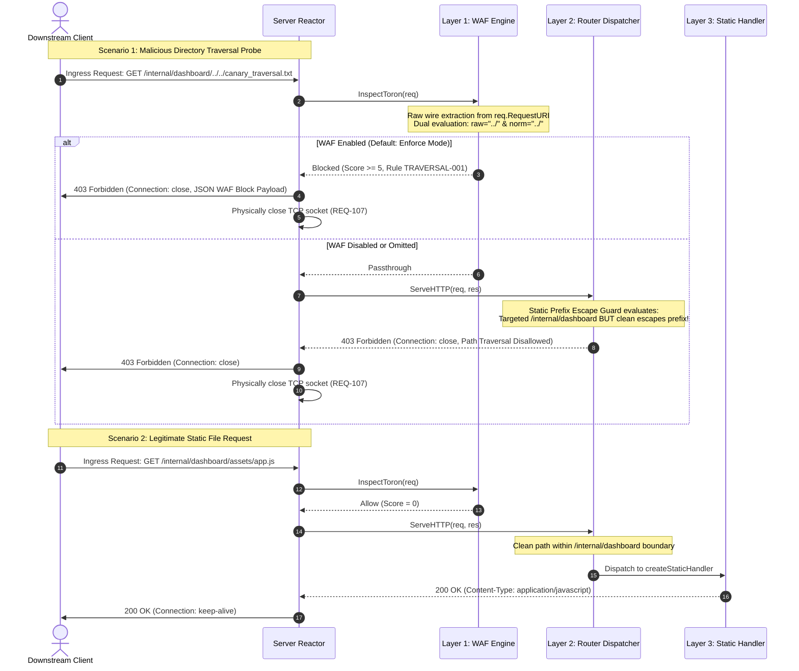
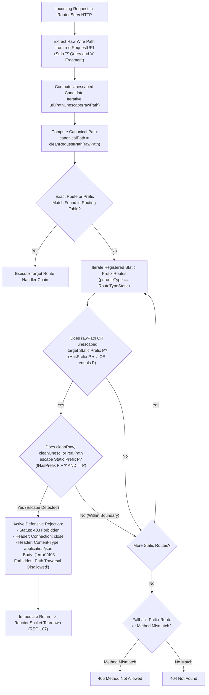

# Layered Route-Aware Path Traversal Defense Architecture (CWE-22)

## Overview

Toron implements a **Layered Route-Aware Path Traversal Defense Architecture** designed to comprehensively mitigate directory traversal vulnerabilities ([CWE-22](https://cwe.mitre.org/data/definitions/22.html)) across static file mounts, reverse proxy routes, and edge API endpoints.

Historically, edge gateways that canonicalize incoming URL paths (such as collapsing `/../` sequences) before route matching risk masking attack probes:
1. **Defensive Masking**: Collapsing dot-dot sequences prematurely transforms an attack path such as `/internal/dashboard/../../canary_traversal.txt` into `/canary_traversal.txt`. Because `/canary_traversal.txt` does not match the registered static prefix `/internal/dashboard`, the router fell through to `404 Not Found`, giving operators and SIEM systems the false impression of a harmless missing resource.
2. **Keep-Alive Transport Risks**: Returning `404 Not Found` left the TCP keep-alive socket open (`Connection: keep-alive`), exposing the gateway to HTTP request smuggling ([CWE-444](https://cwe.mitre.org/data/definitions/444.html)) and persistent connection exhaustion ([CWE-400](https://cwe.mitre.org/data/definitions/400.html)).
3. **Dead-Code Contradictions**: Filesystem boundary checks located inside static route handlers were rendered unreachable because escaped requests were diverted to `404 Not Found` before reaching the static handler.

Toron resolves these issues through a coordinated, two-tier active defense model:
- **Layer 1 (Layer 7 WAF Raw Wire URI Inspection)**: Evaluates raw wire URIs directly from the network socket before path mutation occurs.
- **Layer 2 (Route-Aware Static Prefix Escape Guard)**: Validates static prefix boundaries during router dispatch, actively rejecting prefix escapes even if the WAF is disabled or omitted.
- **Fail-Fast Transport Socket Teardown**: Enforces immediate physical closure of the underlying TCP connection on all security rejections via `Connection: close` ([`REQ-107`](file:///Users/sneha/Developer/toron-research/toron/docs/requirements/REQ-107.md)).

---

## Defense-in-Depth Architecture

Toron coordinates three distinct security boundaries to eliminate single points of failure:

```
[ Ingress TCP Connection: "GET /internal/dashboard/../../canary_traversal.txt HTTP/1.1" ]
                                      │
                                      ▼
             ┌──────────────────────────────────────────────────┐
             │ Layer 1: WAF Raw Wire URI Inspection (pkg/waf)   │
             │ - Extracts raw path from req.RequestURI          │
             │ - Strips query strings (?) and fragments (#)     │
             │ - Dual-path evaluation: raw wire & unescaped     │
             │ - Rule TRAVERSAL-001 matches -> Anomaly Score >=5│
             └──────────────────────────────────────────────────┘
                                      │
                   ┌──────────────────┴──────────────────┐
     [Match & Enforce Mode]                [WAF Disabled / Detection Mode]
                   │                                     │
                   ▼                                     ▼
        ┌─────────────────────┐       ┌─────────────────────────────────────┐
        │ HTTP 403 Forbidden  │       │ Layer 2: Router Static Prefix Guard │
        │ Connection: close   │       │ (pkg/router)                        │
        │ Structured JSON WAF │       │ - Detects targeted static prefix    │
        │ Socket Terminated   │       │ - Evaluates clean canonical path    │
        └─────────────────────┘       │ - Identifies prefix boundary escape │
                                      └─────────────────────────────────────┘
                                                         │
                                      ┌──────────────────┴──────────────────┐
                                [Escape Detected]                     [Within Boundary]
                                      │                                     │
                                      ▼                                     ▼
                           ┌─────────────────────┐               ┌─────────────────────┐
                           │ HTTP 403 Forbidden  │               │ Layer 3: Static     │
                           │ Connection: close   │               │ Filesystem Guard    │
                           │ Path Traversal      │               │ (createStaticHandler│
                           │ Disallowed          │               │ - filepath.Rel      │
                           │ Socket Terminated   │               │ - EvalSymlinks      │
                           └─────────────────────┘               └─────────────────────┘
```

### Layer 1: Layer 7 WAF Raw Wire URI Inspection (`pkg/waf/waf.go`)

Toron's WAF engine ([`pkg/waf/waf.go`](file:///Users/sneha/Developer/toron-research/toron/pkg/waf/waf.go)) inspects incoming requests using their raw wire representation:
- **Raw Wire Extraction**: Extracts the uncleaned request path directly from `req.RequestURI`. Query strings (following `?`) and URL fragments (following `#`) are cleanly stripped using zero-allocation byte slicing (`strings.IndexByte`). If `req.RequestURI` is empty, it safely falls back to `req.Path`.
- **Dual-Path Evaluation**: For all rules targeting `InspectURL`, pattern matching is evaluated against both:
  1. The raw wire URL path (`urlPath`, preserving `%2e%2e`, `/../`, `%2E%2E`).
  2. The unescaped candidate (`normPath = url.PathUnescape(urlPath)`).
- **Active Rejection**: In `enforce` mode (default), when rule `TRAVERSAL-001` or another URL-scoped rule matches and the accumulated threat score meets or exceeds `AnomalyThreshold`, the gateway actively terminates the request:
  - Status: `403 Forbidden`
  - Header: `Connection: close`
  - Header: `Content-Type: application/json`
  - Payload: Formatted via `FormatBlockedResponse(score, matched)`
  - Telemetry: Emits a structured `waf_block` SIEM audit event.

### Layer 2: Route-Aware Static Prefix Escape Guard (`pkg/router/router.go`)

To guarantee security even when WAF middleware is omitted, disabled, or configured in `detection` mode, Toron's core router ([`pkg/router/router.go`](file:///Users/sneha/Developer/toron-research/toron/pkg/router/router.go)) independently enforces static prefix containment:
- **Prefix Boundary Inspection**: During `Router.ServeHTTP`, when exact route matching fails, the router inspects all registered static routes (`pr.routeType == string(RouteTypeStatic)`).
- **Targeting vs Escaping Invariant**:
  - Checks if the ingress path (either raw wire path or iterative unescaped candidate) explicitly targeted a configured static mount prefix $P$ (e.g. `/internal/dashboard`):
    ```go
    targeted := rawPath == prefix || strings.HasPrefix(rawPath, prefixSlash) ||
        unescaped == prefix || strings.HasPrefix(unescaped, prefixSlash)
    ```
  - Checks if the canonicalized path escapes that prefix boundary:
    ```go
    cleanRaw := cleanRequestPath(rawPath)
    cleanUnesc := cleanRequestPath(unescaped)
    escapes := (!strings.HasPrefix(cleanRaw, prefixSlash) && cleanRaw != prefix) ||
        (!strings.HasPrefix(cleanUnesc, prefixSlash) && cleanUnesc != prefix) ||
        (req != nil && !strings.HasPrefix(req.Path, prefixSlash) && req.Path != prefix)
    ```
- **Active Rejection**: If `targeted && escapes`, the router immediately dispatches a defensive rejection handler:
  - Status: `403 Forbidden`
  - Header: `Connection: close`
  - Header: `Content-Type: application/json`
  - Body: `{"error":"403 Forbidden: Path Traversal Disallowed"}`
  - Transport: Closes the TCP socket immediately, permanently resolving the dead-code contradiction.

### Layer 3: Static Filesystem Containment (`Router.createStaticHandler`)

For legitimate requests that remain within the prefix boundary (e.g. `/internal/dashboard/assets/app.js`), [`createStaticHandler`](file:///Users/sneha/Developer/toron-research/toron/pkg/router/router.go) applies filesystem-level defense:
- Computes `cleanRel := filepath.Clean(filepath.FromSlash(strings.TrimPrefix(fileRelPath, "/")))`.
- Uses `filepath.Rel(absDir, targetPath)` to ensure the path does not resolve outside the target filesystem root.
- Uses `filepath.EvalSymlinks(targetPath)` to prevent directory escapes via symbolic links.
- Emits `403 Forbidden: Symlink Path Traversal Disallowed` with `Connection: close` on any violation.

---

## CWE-22 Threat Mitigation Matrix

| Threat Vector | Ingress Wire URI Example | Layer 1: WAF (Raw Wire URI) | Layer 2: Router (Prefix Escape Guard) | Layer 3: Static Handler (`filepath.Rel`) | Combined Gateway Defense |
| :--- | :--- | :--- | :--- | :--- | :--- |
| **Raw Dot-Dot Sequences** (`TRAVERSAL-001`) | `GET /internal/dashboard/../../canary_traversal.txt` | **Blocked**: `403 Forbidden`, `Connection: close` | **Blocked**: `403 Forbidden`, `Connection: close` | Blocked: `403 Forbidden`, `Connection: close` | **403 Forbidden** (Blocked at L1/L2) |
| **Uppercase Percent-Encoding** (`TRAVERSAL-002`) | `GET /internal/dashboard/%2E%2E/%2E%2E/canary_traversal.txt` | **Blocked**: `403 Forbidden`, `Connection: close` | **Blocked**: `403 Forbidden`, `Connection: close` | Blocked: `403 Forbidden`, `Connection: close` | **403 Forbidden** (Blocked at L1/L2) |
| **Double Percent-Encoding** (`TRAVERSAL-003`) | `GET /internal/dashboard/%252e%252e/%252e%252e/canary_traversal.txt` | **Blocked**: `403 Forbidden`, `Connection: close` | **Blocked**: `403 Forbidden`, `Connection: close` | Blocked: `403 Forbidden`, `Connection: close` | **403 Forbidden** (Blocked at L1/L2) |
| **Mixed / Nested Obfuscation** | `GET /internal/dashboard/..%2f%2e%2e/canary_traversal.txt` | **Blocked**: `403 Forbidden`, `Connection: close` | **Blocked**: `403 Forbidden`, `Connection: close` | Blocked: `403 Forbidden`, `Connection: close` | **403 Forbidden** (Blocked at L1/L2) |
| **WAF Disabled / Omitted** | `GET /internal/dashboard/../../canary_traversal.txt` | *Bypassed* (Disabled) | **Blocked**: `403 Forbidden`, `Connection: close` | Blocked: `403 Forbidden`, `Connection: close` | **403 Forbidden** (Blocked at L2) |
| **Legitimate Static File** | `GET /internal/dashboard/assets/app.js` | **Allowed** (Score = 0) | **Allowed** (Within boundary) | **Served**: `200 OK` | **200 OK** (Served cleanly) |
| **Legitimate API Relative Path** | `GET /public/../internal` | **Allowed** (Score = 0) | **Allowed** (Not static prefix route) | N/A (Dispatched to API) | **200 OK** (ADR-062 preserved) |

---

## Request Lifecycle Sequence Diagram



---

## Route-Aware Static Prefix Escape Decision Flow



---

## Configuration & Usage

### 1. Static Route Configuration in `routes.yaml`

Static directory mounts are declared in `routes.yaml`. The Static Prefix Escape Guard automatically protects all routes defined with `type: "static"`:

```yaml
routes:
  # 1. Admin Control Center & Dashboard (Protected by Static Prefix Escape Guard)
  - type: "static"
    prefix: "/internal/dashboard"
    dir: "./public"

  # 2. Frontend Single Page Application (SPA)
  - type: "static"
    prefix: "/app"
    dir: "./frontend/dist"
    spa: true
    fallback: "index.html"
```

### 2. Web Application Firewall Configuration in `config.yaml`

Global WAF threat inspection is configured in `config.yaml`:

```yaml
server:
  waf:
    enabled: true                 # Enable WAF Layer 7 threat inspection
    mode: "enforce"               # "enforce" (403 block) or "detection" (log-only)
    anomaly_threshold: 5          # Threat score threshold for blocking
    max_inspect_body_size: 65536  # Maximum body size inspected (64 KB)
    disabled_rules: []            # Optional rule IDs to bypass
```

### 3. Programmatic Route Registration in Go

When using Toron as a Go library, static routes registered via `Router.Static` or `Router.RoutePrefix` automatically inherit Layer 2 prefix boundary protections:

```go
package main

import (
    "toron/pkg/router"
    "toron/pkg/server"
)

func main() {
    r := router.New()

    // Static route automatically protected against prefix escapes
    r.Static("/internal/dashboard", "./public")

    // Exact API routes retain RFC 3986 / ADR-062 canonicalization
    r.GET("/api/v1/status", statusHandler)

    srv := server.NewServer(r, server.Config{
        Addr: ":8080",
    })
    srv.ListenAndServe()
}
```

---

## Upstream Proxy & API Route Preservation (ADR-062 Alignment)

A critical architectural invariant is that hardening static file routes does not break legitimate upstream reverse proxies or exact API endpoints:

1. **Exact API Routes (`r.GET`, `r.POST`, etc.)**:
   - Exact route lookup occurs *before* prefix evaluation.
   - Requests containing relative dot segments that resolve to valid exact routes (e.g. `GET /public/../internal` canonicalizing to `/internal`) match their registered handler and return `200 OK`.
   - The prefix escape guard is bypassed because `targetHandler != nil`.
2. **Upstream Reverse Proxy Routes (`RouteTypeUpstream`)**:
   - Upstream reverse proxy routes registered via `r.RoutePrefix(RouteTypeUpstream, ...)` are excluded from the static prefix escape check (`pr.routeType != string(RouteTypeStatic)`).
   - Upstream routes continue to adhere to ADR-062 two-stage canonicalization, forwarding sanitized target paths without false-positive blocks.

---

## Transport Socket Teardown Enforcement (`Connection: close`)

In accordance with [`REQ-107`](file:///Users/sneha/Developer/toron-research/toron/docs/requirements/REQ-107.md) and [`ADR-107`](file:///Users/sneha/Developer/toron-research/toron/docs/architecture/ADR-107.md), every path traversal rejection emitted by either Layer 1 (WAF) or Layer 2 (Router) injects:

```http
Connection: close
```

Upon serializing the response, Toron's reactor event loop terminates the persistent connection and physically closes the underlying TCP socket descriptor. This fail-fast transport teardown guarantees:
- **HTTP Smuggling Immunity**: Pipelined desynchronization attacks cannot smuggle follow-up requests behind a traversal probe.
- **Reactor Table Protection**: Malicious clients cannot hold keep-alive sockets open across thousands of exploratory probes, preventing file descriptor exhaustion (`EMFILE`).

---

## Telemetry, Metrics & SIEM Audit Logging

### Layer 1 WAF Rejection Response & Audit Log

When blocked by Layer 1 WAF:
- **HTTP Response** (`403 Forbidden`):
  ```json
  {
    "error": "Forbidden",
    "message": "WAF security violation detected",
    "threat_score": 5,
    "triggered_rules": ["TRAVERSAL-001"]
  }
  ```
- **Structured Audit Log** (SIEM JSON format):
  ```json
  {
    "timestamp": "2026-09-12T09:15:00Z",
    "event": "waf_block",
    "client_ip": "198.51.100.25",
    "method": "GET",
    "path": "/internal/dashboard/../../canary_traversal.txt",
    "category": "traversal",
    "rule_id": "TRAVERSAL-001",
    "anomaly_score": 5,
    "action": "blocked",
    "location": "url"
  }
  ```

### Layer 2 Router Prefix Escape Rejection Response

When blocked by Layer 2 Router Static Prefix Guard:
- **HTTP Response** (`403 Forbidden`):
  ```json
  {
    "error": "403 Forbidden: Path Traversal Disallowed"
  }
  ```
- **Prometheus Metrics**:
  - `toron_requests_total{method="GET", code="403", path="/internal/dashboard"}` is incremented.
  - `toron_waf_blocked_requests_total{category="traversal"}` is incremented when intercepted by WAF.

---

## Troubleshooting & Common Questions

| Issue / Symptom | Possible Cause | Solution |
| :--- | :--- | :--- |
| Legitimate asset returns `403 Forbidden: Path Traversal Disallowed` | File path within static mount contains unresolvable `..` sequences that escape the directory mount point. | Ensure all relative links remain strictly within the configured `dir` filesystem root. If assets reside in a different folder, configure a separate static route. |
| Malicious traversal request returns `403 Forbidden` with `"error":"Forbidden"` instead of `"Path Traversal Disallowed"` | The request was blocked by Layer 1 (WAF), which executes ahead of the Router. This is the expected defense-in-depth behavior. | No action required. Both layers actively reject with `403 Forbidden` and `Connection: close`. |
| Legitimate API endpoint using relative path `/api/v1/../v1/users` is blocked | The route was mistakenly configured as `type: "static"` instead of `type: "upstream"` or exact route. | Verify `routes.yaml` configuration. Only `type: "static"` routes enforce prefix escape guards. |
| Connection closes after a traversal probe | Transport socket teardown is explicitly enforced on all security rejections per `REQ-107`. | This is an intentional security design to prevent HTTP request smuggling and pipeline desynchronization. |

---

## Related Pages

- [Static File Serving](./static-file-serving.md)
- [Web Application Firewall (WAF) & Injection Protection](./waf.md)
- [Configuration Reference](../configuration.md)
- [Release Notes](../release-notes.md)
