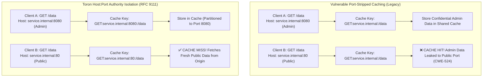

# In-Memory HTTP Response Caching (RFC 9111 Session Boundary Isolation & Host:Port Authority Derivation)

## Overview

Toron features an enterprise-grade, thread-safe in-memory HTTP response caching engine ([`pkg/router/cache.go`](file:///Users/sneha/Developer/toron-research/toron/pkg/router/cache.go)). Operating as a high-speed shared gateway proxy cache, Toron intercepts repeated idempotent `GET` and `HEAD` responses, caches eligible payloads in RAM, and serves subsequent matching requests with sub-millisecond latency while reducing CPU, database, and network overhead on upstream microservices.

Toron complies strictly with the modern **RFC 9111 HTTP Caching specification** (superseding RFC 7234) and **RFC 9110 HTTP Semantics**. Pursuing zero-trust security and complete session isolation ([`REQ-134`](file:///Users/sneha/Developer/toron-research/toron/docs/requirements/REQ-134.md), [`ADR-134`](file:///Users/sneha/Developer/toron-research/toron/docs/architecture/ADR-134.md), [`TASK-157`](file:///Users/sneha/Developer/toron-research/toron/docs/tasks/TASK-157.md)), Toron enforces:
1. **Host:Port Cache Key Authority Derivation**: Explicit preservation of network port numbers in cache keys, preventing cross-port cache key poisoning ([CWE-524](https://cwe.mitre.org/data/definitions/524.html)).
2. **RFC 9111 Protocol Session Boundary Isolation**: Mandatory refusal of unshared authenticated requests (RFC 9111 §3.5), dual-stage `Set-Cookie`/`Set-Cookie2` header purging ([CWE-384](https://cwe.mitre.org/data/definitions/384.html)), origin directive enforcement (`no-store`, `no-cache`, `private`), and SSE streaming exemptions ([`REQ-128`](file:///Users/sneha/Developer/toron-research/toron/docs/requirements/REQ-128.md)).
3. **Web Cache Deception Shared Responsibility Model**: Clear delineation between edge transparent reverse proxy guarantees and mandatory upstream application framework routing hygiene.

---

## Key Features

- **Host:Port Authority Preservation (RFC 9111 §2 / CWE-524)**: Preserves explicit port numbers in cache keys (e.g. `service.internal:8080` vs `service.internal:80`), guaranteeing origin isolation across multi-tenant, microservice, container, and multi-port gateway architectures.
- **Strict RFC 9111 §5.2.2.2 & §5.2.2.4 Directives Enforcement**: Origin responses bearing `Cache-Control: no-cache`, `no-store`, or `private` are strictly barred from cache storage. In the absence of origin revalidation, `no-cache` strictly overrides `max-age`.
- **Shared Cache Authorization Refusal (RFC 9111 §3.5)**: Requests bearing `Authorization` headers are excluded from shared cache lookup and storage unless the origin response explicitly contains `Cache-Control: public`.
- **Dual-Stage Cookie Stripping (RFC 9111 §8 / CWE-384)**: Purges `Set-Cookie` and `Set-Cookie2` headers at admission (before storing in RAM snapshot) and again upon cache hit delivery, mathematically neutralizing shared cache session fixation and credential leakage.
- **Streaming Response Exemption ([REQ-128](file:///Users/sneha/Developer/toron-research/toron/docs/requirements/REQ-128.md))**: Responses bearing `Content-Type: text/event-stream` (Server-Sent Events), `X-Accel-Buffering: no`, WebSocket upgrades (`101 Switching Protocols`), or dynamic socket streams (`res.StreamBody != nil`) unconditionally bypass cache storage.
- **Deterministic Telemetry Headers**: Cache misses and bypassed responses consistently emit `X-Cache: MISS` while strictly deleting any upstream `Age` header. Cache hits emit `X-Cache: HIT` and a dynamically computed `Age: <seconds>` header.
- **Zero-Allocation Exemption Guards**: Header inspection, streaming MIME detection, and authority extraction execute via zero-alloc string comparisons, maintaining Toron's zero-dependency, zero-overhead runtime profile.
- **Client Cache Refresh**: Honors client request headers `Cache-Control: no-cache`, `Cache-Control: no-store`, `Cache-Control: max-age=0`, and `Pragma: no-cache`, allowing clients to force live upstream fetches.
- **Memory Boundedness & LRU/TTL Eviction (CWE-400)**: Enforces configurable `max_entries` and `max_payload_size` ceilings, utilizing thread-safe mutex locking (`sync.RWMutex`) and TTL-based eviction to safeguard system RAM.
- **Selective Method & Status Whitelisting**: Only idempotent `GET` and `HEAD` methods with standard status codes (`200 OK`, `301 Moved Permanently`, `404 Not Found`) are eligible for caching. State-changing methods (`POST`, `PUT`, `DELETE`, `PATCH`) unconditionally bypass the cache.

---

## Host:Port Cache Key Authority Derivation

### Primary Cache Key Formula

Under **RFC 9110 §4.2** (*Authority*) and **RFC 9111 §2** (*Overview of Cache Keys*), the primary cache key for an HTTP resource consists of the request method, target URI, and the target URI's authority component (which includes both host and optional port number).

Toron constructs primary cache keys using the following canonical formula in [`pkg/router/cache.go:199`](file:///Users/sneha/Developer/toron-research/toron/pkg/router/cache.go#L199):

```go
cacheKey := req.Method + ":" + extractCacheHostPort(req) + ":" + uri
if ae := req.Header.Get("Accept-Encoding"); ae != "" {
    cacheKey += ":ae=" + ae
}
```

Where:
- `req.Method`: The HTTP method (`GET` or `HEAD`).
- `extractCacheHostPort(req)`: The dedicated authority extraction function ([`pkg/router/cache.go:327`](file:///Users/sneha/Developer/toron-research/toron/pkg/router/cache.go#L327)).
- `uri`: The raw request target (`req.RequestURI`, falling back to `req.Path`).
- `:ae=<encoding>`: Appended if `Accept-Encoding` is present, partitioning cached variants (e.g. gzip, br, zstd).

### Authority Normalization & Parsing (`extractCacheHostPort`)

The dedicated authority extractor [`extractCacheHostPort(req)`](file:///Users/sneha/Developer/toron-research/toron/pkg/router/cache.go#L327-L370) implements strict canonicalization without port loss:

1. **Whitespace Trimming**: Strips leading and trailing ASCII whitespace and tabs (`strings.TrimSpace`).
2. **Case Normalization**: Converts the domain hostname to lowercase (`strings.ToLower`), ensuring case-insensitive DNS equivalence (`API.EXAMPLE.COM:8080` matches `api.example.com:8080`).
3. **Bracketed IPv6 Literal Parsing**: Safely parses bracketed IPv6 literals (e.g., `[::1]:8080`, `[2001:0db8::1]:8443`, `[fe80::1]`). Isolates the closing bracket `]` and extracts the trailing port delimiter, preventing internal IPv6 hexadecimal colons from being misinterpreted as port separators.
4. **Explicit Port Preservation**: Retains the trailing port string (`:8080`, `:9090`). If no port is specified, returns the normalized host without port.
5. **Hostless Request Fallback**: For HTTP/1.0 requests lacking a `Host` header, safely returns `""`, resulting in `Method::URI` without runtime panic.

```
┌──────────────────────────────────────┬────────────────────────────────────────────────────────┐
│ Incoming Client Host Header          │ Normalized Output of extractCacheHostPort(req)         │
├──────────────────────────────────────┼────────────────────────────────────────────────────────┤
│ example.com                          │ example.com                                            │
│ EXAMPLE.COM                          │ example.com                                            │
│ example.com:8080                     │ example.com:8080                                       │
│ EXAMPLE.COM:8080                     │ example.com:8080                                       │
│    api.toron.local:9090              │ api.toron.local:9090                                   │
│ [::1]:8080                           │ [::1]:8080                                             │
│ [::1]                                │ [::1]                                                  │
│ [2001:0DB8::1]:8443                  │ [2001:0db8::1]:8443                                    │
│ 127.0.0.1:8000                       │ 127.0.0.1:8000                                         │
│ "" (Missing Host Header)             │ ""                                                     │
└──────────────────────────────────────┴────────────────────────────────────────────────────────┘
```

### Why Explicit Port Preservation is Critical ([CWE-524](https://cwe.mitre.org/data/definitions/524.html))

In earlier proxy implementations, host headers were frequently stripped of their port numbers to facilitate domain-level virtual host routing. However, reusing a port-stripped host for cache key derivation creates a severe security vulnerability ([CWE-524: Use of Cache Containing Sensitive Information](https://cwe.mitre.org/data/definitions/524.html)):



Explicit port preservation is mandatory in modern cloud architectures:

1. **Multi-Tenant Edge Gateways**: Multiple internal or external tenants share hostnames or load balancer IPs across distinct listener ports.
2. **Microservices on Shared Hosts**: A single physical or virtual host runs multiple microservices on different ports (e.g. `api.corp.local:8080` for public telemetry vs. `api.corp.local:8443` for financial billing). Collapsing ports would allow billing data to be served to telemetry clients.
3. **Container & Kubernetes Sidecars**: Ingress controllers and service mesh sidecars (e.g. Toron sidecar mode) expose internal management endpoints on dedicated ports (e.g. port 9090 or 15006) alongside application traffic on port 8080.
4. **Multi-Port Gateway Listeners**: Toron operates concurrent listeners across cleartext HTTP (port 80), TLS HTTPS (port 443), and HTTP/3 QUIC (port 8443). Preserving the port ensures cleartext and encrypted sessions remain partitioned in cache.

---

## Web Cache Deception & The Shared Responsibility Model

### The Classical Web Cache Deception Vulnerability

In classical Web Cache Deception (WCD; Gil, 2017), an attacker crafts a link pointing to a sensitive dynamic endpoint with an appended static file extension:

```http
GET /api/user/profile.css HTTP/1.1
Host: example.com
Cookie: session_token=victim_active_session
```

1. The attacker lures an authenticated victim into clicking the link.
2. The request passes through the edge reverse proxy to the upstream application backend.
3. The upstream backend framework strips the `.css` extension via route parameter normalization, invokes the `/api/user/profile` controller, and renders the victim's private profile data.
4. **The Vulnerability**: If the upstream application framework naively classifies `.css` requests as public static assets and **fails to emit `Cache-Control: private` or `no-store`**, a standard transparent shared cache will treat the response as public and store it under the key for `/api/user/profile.css`.
5. The attacker subsequently visits `/api/user/profile.css` without credentials, receives a cache `HIT`, and extracts the victim's private profile data!

### Scope of Transparent Reverse Proxies vs Application Frameworks

Toron operates strictly as an **RFC 9111-compliant transparent Layer 7 reverse proxy**. Under RFC 9111:
- A transparent proxy cache makes caching decisions based strictly on explicit HTTP header directives (`Cache-Control`, `Vary`, `Authorization`, `Expires`) and standard status codes.
- Toron **does not guess MIME types, inspect file extensions, or rewrite application paths**. Speculative file extension filtering by an edge proxy (e.g. refusing to cache any URL ending in `.css` if `Content-Type` is `application/json`) is fragile and breaks valid Single Page Applications, CSS-in-JS APIs, dynamic image generation services, and authenticated download endpoints.
- If an upstream origin application receives a path-confused request, renders private data, and **omits `Cache-Control: private, no-store`**, the vulnerability resides in the upstream application framework.

Therefore, effective defense against Web Cache Deception requires adhering to a **Shared Responsibility Model**:

```
┌──────────────────────────────────────────────────────────────────────────────────────────────────┐
│                         WEB CACHE DECEPTION: SHARED RESPONSIBILITY MODEL                         │
├──────────────────────────────────────────────────────────────────────────────────────────────────┤
│                                                                                                  │
│    INCOMING CLIENT REQUEST                                                                       │
│    GET /api/user/profile.css HTTP/1.1                                                            │
│    Host: example.com                                                                             │
│    Cookie: session=victim_token                                                                  │
│          │                                                                                       │
│          ▼                                                                                       │
│    ┌────────────────────────────────────────────────────────────────────────┐                    │
│    │               TORON EDGE GATEWAY RESPONSIBILITY (RFC 9111)             │                    │
│    │                                                                        │                    │
│    │  [✓] Protocol Session Boundary Isolation Enforced:                     │                    │
│    │      • Refuses caching requests with Authorization (unless public)     │                    │
│    │      • Bypasses cache if origin returns Cache-Control: private         │                    │
│    │      • Bypasses cache if origin returns Cache-Control: no-store        │                    │
│    │      • Bypasses cache if origin returns Cache-Control: no-cache        │                    │
│    │      • Strips Set-Cookie / Set-Cookie2 at storage and delivery         │                    │
│    │      • Partitions cache keys by Host:Port authority                    │                    │
│    │      • Exempts real-time streams (text/event-stream, X-Accel-Buf)      │                    │
│    │                                                                        │                    │
│    │  [!] Transparent Proxy Scope Limitation:                               │                    │
│    │      • Does NOT guess application semantics from path extensions       │                    │
│    │      • Relies on origin HTTP Cache-Control directives                  │                    │
│    └──────────────────────────────────┬─────────────────────────────────────┘                    │
│                                       │ (Forwarded Request)                                      │
│                                       ▼                                                          │
│    ┌────────────────────────────────────────────────────────────────────────┐                    │
│    │               UPSTREAM APPLICATION FRAMEWORK RESPONSIBILITY            │                    │
│    │                                                                        │                    │
│    │  Mandatory Application Framework Defenses:                             │                    │
│    │    1. MUST emit "Cache-Control: private, no-store" on all dynamic,      │                    │
│    │       authenticated, or personalized endpoints.                        │                    │
│    │    2. MUST reject requests with unexpected trailing static extensions  │                    │
│    │       on dynamic routes (strict path hygiene -> 404 Not Found).        │                    │
│    │    3. MUST emit "Vary: Cookie" or "Vary: Authorization" when           │                    │
│    │       responses depend on client identity.                             │                    │
│    └────────────────────────────────────────────────────────────────────────┘                    │
│                                                                                                  │
└──────────────────────────────────────────────────────────────────────────────────────────────────┘
```

### Toron Protocol Boundary Guarantees (RFC 9111 Invariants)

Toron provides bulletproof protocol-level session boundary isolation whenever directives are declared:

1. **Authorization Refusal (RFC 9111 §3.5)**:
   Any request bearing an `Authorization` header field is barred from shared cache admission and lookup unless the origin response explicitly includes `Cache-Control: public`. Unshared authenticated responses are never cached.
2. **Dual-Stage Cookie Stripping (RFC 9111 §8 / CWE-384)**:
   - *Stage 1 (Storage Purge)*: Clones headers for in-memory caching while explicitly omitting `Set-Cookie` and `Set-Cookie2`.
   - *Stage 2 (Delivery Purge)*: Explicitly deletes `Set-Cookie` and `Set-Cookie2` on cache hit delivery, ensuring no session tokens are ever leaked to downstream clients.
3. **Origin Directive Enforcement (RFC 9111 §5.2.2)**:
   Origin responses declaring `Cache-Control: private`, `no-store`, or `no-cache` are strictly excluded from storage.
4. **Streaming Response Exemption ([REQ-128](file:///Users/sneha/Developer/toron-research/toron/docs/requirements/REQ-128.md))**:
   Live streams (`text/event-stream`, `X-Accel-Buffering: no`, WebSocket upgrades) unconditionally bypass caching.
5. **Host:Port Authority Partitioning**:
   In-memory cache entries are partitioned by full `Host:Port` authority, preventing cross-tenant or cross-port session bleed.

### Developer Best Practices for Application Frameworks

To guarantee end-to-end immunity against Web Cache Deception across all edge caches and CDNs, application developers should implement the following best practices in upstream frameworks (Express, Django, Spring, Rails, Gin, FastAPI, ASP.NET Core):

1. **Explicit Private Cache-Control on Authenticated Routes**:
   Always configure authentication middleware to emit:
   ```http
   Cache-Control: private, no-store, max-age=0
   ```
   On every endpoint that renders authenticated, user-specific, or session-sensitive data. Never rely on edge caches guessing that an endpoint is private.

2. **Strict Route Path Hygiene**:
   Configure application routing engines to reject unexpected trailing static extensions. For example, if an API route is registered as `/api/user/profile`, requests for `/api/user/profile.css` or `/api/user/profile.jpg` should return `HTTP 404 Not Found` rather than trimming the extension.

3. **Emit `Vary: Cookie` or `Vary: Authorization`**:
   If an endpoint serves public content to anonymous users and personalized content to authenticated users, the application must emit:
   ```http
   Vary: Cookie, Authorization
   ```
   This ensures downstream caches partition entries by authentication state.

4. **Framework-Specific Guidance**:
   - **Express / Node.js**: Use `res.set('Cache-Control', 'private, no-store')` in session middleware; avoid wildcard route patterns like `app.get('/profile*')`.
   - **Django / Python**: Apply `@never_cache` decorator on all authenticated views.
   - **Spring Boot / Java**: Configure `HttpSecurity.headers().cacheControl()` or apply `CacheControl.noStore().mustRevalidate()`.
   - **Go / Gin**: Add middleware:
     ```go
     c.Header("Cache-Control", "private, no-store")
     ```

---

## Cache Admission & Exclusion Rules

The caching middleware evaluates responses following downstream route or proxy handler execution. Admission to in-memory storage requires satisfying every validation rule:

| Condition / Header | Value / Pattern | Cache Action | Rationale & Standard |
| :--- | :--- | :--- | :--- |
| **Origin `Cache-Control`** | `no-cache` | **Bypass** | RFC 9111 §5.2.2.4: Cannot store without origin revalidation. Overrides `max-age`. |
| **Origin `Cache-Control`** | `no-store` | **Bypass** | RFC 9111 §5.2.2.5: Explicit prohibition against storage. |
| **Origin `Cache-Control`** | `private` | **Bypass** | RFC 9111 §5.2.2.7: Private user response; forbidden in shared proxy cache. |
| **Origin `Cache-Control`** | `public, max-age=N` | **Cached for $N$ seconds** | Explicit shared cache authorization with duration. |
| **Origin `Cache-Control`** | *(omitted or no max-age)* | **Cached for `default_ttl`** | Fallback to configured route TTL (default: 60s). |
| **Content-Type** | `text/event-stream` (SSE) | **Bypass** | Real-time live feed; caching freezes stream snapshots ([REQ-128](file:///Users/sneha/Developer/toron-research/toron/docs/requirements/REQ-128.md)). |
| **X-Accel-Buffering** | `no` | **Bypass** | Reverse proxy hint requesting unbuffered streaming. |
| **Stream Body** | `res.StreamBody != nil` | **Bypass** | Active direct socket stream relay ([REQ-125](file:///Users/sneha/Developer/toron-research/toron/docs/requirements/REQ-125.md), [REQ-129](file:///Users/sneha/Developer/toron-research/toron/docs/requirements/REQ-129.md)). |
| **Upgraded Socket** | `101 Switching Protocols` | **Bypass** | WebSocket or hijacked raw TCP tunnel. |
| **Request Authorization** | `Authorization: ...` | **Bypass (unless `public`)** | RFC 9111 §3.5: Shared cache must protect authenticated endpoints. |
| **Set-Cookie Header** | `Set-Cookie`, `Set-Cookie2` | **Purged on Store & Hit** | RFC 9111 §8 / CWE-384: Dual-stage stripping prevents session token leaks. |
| **Host Port** | Preserved in authority key | **Partitioned** | RFC 9111 §2 / CWE-524: Cross-port isolation across services on distinct ports. |
| **Vary Header** | `Vary: *` or complex headers | **Bypass** | Only `Vary: Accept-Encoding` is supported for shared variant lookups. |
| **Payload Size** | `Body.Len() > max_payload_size` | **Bypass** | Memory protection against oversized responses (CWE-400). |
| **Payload Size** | `Body.Len() == 0` | **Bypass** | Empty responses bypass cache storage. |

---

## RFC 9111 Origin Cache-Control Enforcement

### The `no-cache` Directive and Precedence Rules

Under **RFC 9111 §5.2.2.4**, the `no-cache` response directive specifies that a cache must not use the response to satisfy subsequent requests without successful validation with the origin server (e.g. using `If-None-Match` or `If-Modified-Since`).

Because Toron's high-speed in-memory cache is designed as a zero-allocation shared proxy cache without origin conditional validator tracking, Toron strictly treats `no-cache` as an **absolute prohibition against cache storage**:

```go
resCC := ParseCacheControl(res.Header.Get("Cache-Control"))
if resCC.NoStore || resCC.NoCache || resCC.Private {
    return
}
```

> [!IMPORTANT]
> **`no-cache` Overrides `max-age`**: If an upstream origin returns `Cache-Control: no-cache, max-age=3600`, Toron's caching engine gives strict precedence to `no-cache`. The response is **never stored** in `ResponseCache`, eliminating Shared Cache Information Exposure ([CWE-524](https://cwe.mitre.org/data/definitions/524.html)).

---

## Streaming Response Cache Exemptions

### Preventing SSE Stream Snapshot Freezing

In real-time architectures, Server-Sent Events (`text/event-stream`) and telemetry streams emit continuous event chunks over persistent HTTP connections. Upstream servers commonly set `Content-Type: text/event-stream` and `Cache-Control: no-cache`.

If a caching proxy fails to inspect streaming MIME types or origin `no-cache` directives:
1. The proxy evaluates that `max-age` is absent and falls back to `default_ttl` (e.g. 60 seconds).
2. The proxy captures the initial events emitted into a static buffer snapshot.
3. Subsequent clients connecting to the stream receive the frozen snapshot with `X-Cache: HIT`, never receiving live updates.

### Content-Aware Exemption Guard

Toron neutralizes this failure mode at the entry point of cache post-processing ([`pkg/router/cache.go:246-249`](file:///Users/sneha/Developer/toron-research/toron/pkg/router/cache.go#L246-L249)):

```go
// Streaming MIME or unbuffered responses must never be cached (REQ-128)
if strings.HasPrefix(strings.ToLower(res.Header.Get("Content-Type")), "text/event-stream") || 
   strings.EqualFold(strings.TrimSpace(res.Header.Get("X-Accel-Buffering")), "no") {
    return
}
```

- **Server-Sent Events**: Any response starting with `text/event-stream` (case-insensitive, supporting parameters such as `text/event-stream; charset=utf-8`) is unconditionally excluded from storage.
- **Unbuffered Hints**: Any response with `X-Accel-Buffering: no` (case-insensitive) is unconditionally excluded from storage.
- **Active Socket Relays**: Any response where `res.StreamBody != nil` or `res.UpgradedConn != nil` immediately skips cache evaluation.

---

## Header Semantics on Cache Bypass

When a request bypasses caching—due to client directives, origin directives, streaming MIME types, or uncacheable status codes—Toron enforces clean header semantics:

1. **`X-Cache: MISS`**: Injected into downstream headers to inform the client that the response originated directly from the upstream backend.
2. **`Age` Header Omission**: The `Age` header is explicitly deleted (`res.Header.Del("Age")`), guaranteeing that downstream clients or intermediate CDN layers do not mistake the live response for a stale or cached asset.
3. **Zero Dynamic Allocation Overhead**: Header checks use zero-alloc string inspections. When an exemption fires, the middleware returns immediately without calling `cache.Set`, copying byte buffers, or allocating memory.

| Header | Cache Hit | Origin `no-cache` Bypass | Streaming (`text/event-stream`) Bypass | Client `no-cache` Bypass |
| :--- | :--- | :--- | :--- | :--- |
| **`X-Cache`** | `HIT` | `MISS` | `MISS` | `MISS` |
| **`Age`** | `<seconds>` (e.g. `14`) | *(omitted)* | *(omitted)* | *(omitted)* |
| **`Cache Memory`** | Read from RAM | 0 bytes allocated | 0 bytes allocated | 0 bytes allocated |
| **`Origin Contacted`**| No (served from RAM) | Yes (live upstream fetch) | Yes (direct socket stream) | Yes (live upstream fetch) |

---

## Client Cache Refresh

Toron supports forced cache revalidation initiated by HTTP clients or network operators:

- **`Cache-Control: no-cache`** or **`Cache-Control: no-store`**: Bypasses cache read lookup, fetching a fresh copy from origin.
- **`Cache-Control: max-age=0`**: Bypasses cached copies.
- **`Pragma: no-cache`**: Complies with legacy HTTP/1.0 client refresh headers.

When client bypass headers are detected during the request phase, Toron bypasses `cache.Get` and invokes downstream handlers directly.

---

## Configuration

Enable and tune response caching in `config.yaml`:

```yaml
server:
  cache:
    enabled: true             # Enable in-memory response caching
    default_ttl: 60s          # Fallback TTL if origin omits Cache-Control max-age
    max_entries: 10000        # Maximum number of responses retained in memory
    max_payload_size: 1048576 # 1 MB maximum body size per cached entry (bytes)
```

### Configuration Options

| Option | Type | Default | Description |
| :--- | :--- | :--- | :--- |
| `enabled` | `bool` | `false` | Enables or disables in-memory response caching. |
| `default_ttl` | `duration` | `60s` | Expiration duration for responses without explicit `max-age`. |
| `max_entries` | `int` | `1000` | Maximum number of cache entries stored before eviction. |
| `max_payload_size` | `int` | `1048576` | Maximum response body size (in bytes) eligible for caching (1 MB). |

---

## Troubleshooting & FAQ

### Problem: Two requests to the same path on different ports (e.g. `:80` and `:8080`) do not share cached entries. Is this intentional?
> **Answer**: Yes, this is an essential security invariant ([`REQ-134`](file:///Users/sneha/Developer/toron-research/toron/docs/requirements/REQ-134.md), [CWE-524](https://cwe.mitre.org/data/definitions/524.html)). Toron derives cache keys using full `Host:Port` authority (`Method:HostPort:URI`). Distinct ports represent independent network origins under RFC 9110 §4.2 and RFC 9111 §2. Preserving the port ensures that public services on port 80 never serve confidential cached responses from administrative services on port 8080.

### Problem: An attacker appended `.css` to an authenticated user endpoint (`/api/profile.css`), and Toron cached the response. How do I fix this?
> **Answer**: This is classical Web Cache Deception (Gil, 2017) caused by the upstream application framework omitting cache control headers. As an RFC 9111 transparent reverse proxy, Toron does not guess MIME types or rewrite application paths. To resolve this:
> 1. In your application framework, ensure that authenticated endpoints unconditionally emit `Cache-Control: private, no-store`.
> 2. Configure your application router to enforce strict path matching and return `404 Not Found` for requests with unexpected static extensions on dynamic endpoints.

### Problem: Real-time SSE streams return `X-Cache: MISS` on every connection. Is this an error?
> **Answer**: No, this is intended and correct behavior. Under [`REQ-128`](file:///Users/sneha/Developer/toron-research/toron/docs/requirements/REQ-128.md), Server-Sent Events (`text/event-stream`) are permanently exempted from cache storage to prevent stream freezing and Web Cache Deception ([CWE-524](https://cwe.mitre.org/data/definitions/524.html)). Every connection receives live events directly from origin.

### Problem: My origin returns `Cache-Control: no-cache, max-age=300`, but Toron never returns `X-Cache: HIT`.
> **Answer**: Under RFC 9111 §5.2.2.4, `no-cache` strictly overrides `max-age` in shared proxy caches without origin conditional validation. To make the response cacheable in Toron, configure your origin backend to emit `Cache-Control: public, max-age=300`.

### Problem: Authenticated requests (`Authorization: Bearer ...`) are not cached.
> **Answer**: Under RFC 9111 §3.5, shared caches must not store responses to authenticated requests unless the origin response explicitly specifies `Cache-Control: public`. Ensure your upstream origin emits `Cache-Control: public, max-age=...` if authenticated responses are safe for shared caching.

---

## Related Pages

- [Configuration Guide](../configuration.md)
- [Transparent Response Compression](./compression.md)
- [Reverse Proxy & Gateway Routing](./reverse-proxy.md)
- [Release Notes](../release-notes.md)
