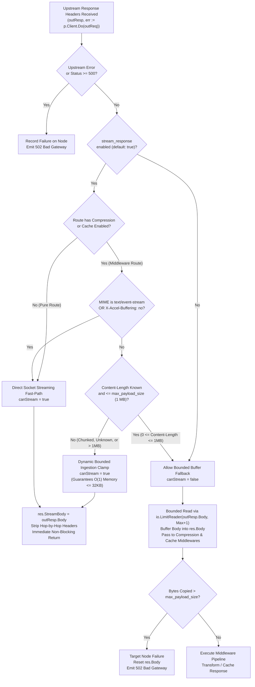

# Reverse Proxy and Gateway Routing

## Overview

Toron includes a native **Reverse Proxy** engine (`pkg/proxy`), allowing it to route incoming client traffic to upstream backend HTTP microservices with load balancing, header sanitization, and path rewriting.

## Features

- **Upstream Forwarding**: Forwards request methods, query parameters, HTTP headers, and streaming request bodies.
- **Forwarded Header Sanitization & Trusted Proxy Chaining**: Injects and sanitizes standard origin headers (`X-Forwarded-For`, `X-Forwarded-Host`, `X-Forwarded-Proto`, `X-Forwarded-Prefix`, `X-Real-IP`, and W3C `traceparent`) while preventing client IP spoofing ([`SEC-31`](file:///Users/sneha/Developer/toron-research/toron/SECURITY_AUDIT.md#L428-L436), [`REQ-092`](file:///Users/sneha/Developer/toron-research/toron/docs/requirements/REQ-092.md), [`ADR-087`](file:///Users/sneha/Developer/toron-research/toron/docs/architecture/ADR-087.md)).
- **Automatic 3xx Redirect Rewriting**: Intercepts upstream `Location` redirect headers (`301`, `302`, `303`, `307`, `308`) and automatically prepends the route prefix (`/login` $\rightarrow$ `/api/login`), preventing 404s on prefix-routed legacy applications.
- **Set-Cookie Path Rewriting**: Automatically rewrites upstream `Set-Cookie: Path=/` attributes to `Path=<prefix>` to keep cookies properly scoped to the gateway route.
- **Configurable Strip Prefix**: Supports stripping the route prefix before dispatching upstream, or preserving the full path for native prefix-aware backends.
- **Resilient Fallback**: Returns `502 Bad Gateway` if the upstream server is offline or times out.

## Forwarded Header Sanitization & Anti-Spoofing (`trusted_proxies`)

Toron prevents client-side IP spoofing by deriving network identity from the physical transport connection (`RemoteAddr`) across HTTP/1.1, HTTP/2, and HTTP/3 QUIC:

1. **Untrusted Connections (Default)**:
   - Client-supplied `X-Forwarded-For` and `X-Real-IP` headers are **stripped and discarded**.
   - Upstream headers are overwritten strictly with the verified physical client address (`peerIP`):
     ```http
     X-Forwarded-For: <peerIP>
     X-Real-IP: <peerIP>
     X-Forwarded-Proto: https
     ```
2. **Verified Trusted Proxies**:
   - If the client's physical socket IP matches a configured `trusted_proxies` CIDR block:
     - Existing `X-Forwarded-For` is preserved, and `peerIP` is appended (`<existingXFF>, <peerIP>`).
     - Existing `X-Real-IP` is preserved.
3. **Preserved Mobile Roaming Affinity (REQ-030)**:
   - Sticky session load balancing (`pkg/proxy/sticky.go`) operates independently from access control. For `ip_hash` balancing, client-level headers continue to be inspected so mobile devices maintain affinity across carrier IP handovers and CGNAT reassignments without regression.

## Configuration in `routes.yaml`

```yaml
routes:
  # 1. Header routing + Load balancing across ports 9001-9003
  - type: "upstream"
    prefix: "/api"
    headers:
      X-Version: "v2"
    algorithm: "round_robin"
    targets:
      - "http://localhost:9001"
      - "http://localhost:9002"
      - "http://localhost:9003"
    strip_prefix: true            # Strips /api before forwarding (default: true)
    rewrite_redirects: true       # Rewrites Location: /login -> /api/login (default: true)
    rewrite_cookie_path: true     # Rewrites Set-Cookie: Path=/ -> Path=/api (default: true)

  # 2. Secure upstream with trusted proxy chaining
  - type: "upstream"
    prefix: "/services/partner"
    target: "http://localhost:9005"
    trusted_proxies:
      - "198.51.100.0/24"         # Appends peerIP for requests from this CIDR; strips headers from all others

  # 3. Legacy backend with automatic redirect and cookie path rewriting
  - type: "upstream"
    prefix: "/services/auth"
    target: "http://localhost:9008"
    rewrite_redirects: true
    rewrite_cookie_path: true

  # 5. Tuned upstream with custom connection pooling and egress routing (REQ-123)
  - type: "upstream"
    prefix: "/services/microservice"
    target: "https://api.internal.corp:8443"
    transport:
      max_idle_conns_per_host: 500       # Keepalive socket pool sizing
      max_conns_per_host: 50             # Upstream backpressure limit
      idle_conn_timeout: 45s             # Socket reclamation timeout
      disable_compression: true          # Raw zero-allocation pass-through
      force_attempt_http2: true          # Enable upstream HTTP/2 ALPN multiplexing
      use_env_proxy: false               # Direct dialing (or true for HTTP_PROXY)
      propagate_upstream_close: false    # Isolate downstream client keep-alives
      tracing: false                     # false = raw speed; true = W3C traceparent context generation (REQ-124)
```
## Upstream Transport Configuration (`ProxyTransportConfig`)

Beginning with [`REQ-123`](file:///Users/sneha/Developer/toron-research/toron/docs/requirements/REQ-123.md), [`REQ-124`](file:///Users/sneha/Developer/toron-research/toron/docs/requirements/REQ-124.md), and [`REQ-129`](file:///Users/sneha/Developer/toron-research/toron/docs/requirements/REQ-129.md), Toron allows granular configuration of reverse proxy transport settings.

### Global Defaults (`config.yaml`)

```yaml
proxy:
  enabled: true
  transport:
    profile: "raw_speed"            # Presets: "raw_speed" (default) or "balanced"
    max_idle_conns: 10000           # Global max idle connections
    max_idle_conns_per_host: 1000   # Max idle keepalive connections per host
    max_conns_per_host: 0           # Concurrency limit (0 = unconstrained; >0 throttles & queues)
    idle_conn_timeout: 90s          # Keepalive socket retention
    disable_compression: true       # true = raw byte pass-through; false = auto-decompress gzip
    use_env_proxy: false            # true = honors HTTP_PROXY/NO_PROXY; false = direct socket dial
    proxy_url: ""                   # Explicit forward proxy URL (e.g. http://squid.corp:3128)
    propagate_upstream_close: false # false = isolates client keepalives; true = clean client teardown
    force_attempt_http2: false      # true = ALPN h2 stream multiplexing to TLS origins
    tracing: false                  # false = suppresses crypto/rand trace ID generation (raw speed); true = generates W3C traceparent
    stream_response: true           # true = streaming by default across both "raw_speed" and "balanced" profiles (REQ-129)
    max_payload_size: 1048576       # Ingestion buffer clamp threshold in bytes (default: 1 MB / 1048576) (REQ-129)
    response_header_timeout: 10s    # Bounded timeout for initial response headers; body streaming is decoupled
```

### Route-Level Overrides (`routes.yaml`)

Each route can override any transport knob under `transport`:
- **Delicate microservices**: Set `max_conns_per_host: 25` to protect origin from connection flooding.
- **External Partner APIs**: Set `use_env_proxy: true` or `proxy_url: "http://squid.corp:3128"`.
- **Payload Inspection**: Set `disable_compression: false` to allow downstream middleware to inspect plaintext.
- **Upstream Session Teardown**: Set `propagate_upstream_close: true` to let origin `Connection: close` tear down the client socket cleanly while still stripping hop-by-hop headers per RFC 7230.
- **Distributed Tracing**: Set `tracing: true` on observability-critical routes to generate W3C `traceparent` headers with cryptographic random IDs, or leave `tracing: false` for raw performance.
- **Streaming by Default**: `stream_response: true` is active by default across both `"raw_speed"` and `"balanced"` transport profiles. Large files, chunked streams, and real-time feeds stream with $O(1) \le 32\text{KB}$ memory boundedness.
- **Custom Buffer Limit**: Configure `max_payload_size: 2097152` (2 MB) on routes where larger responses require compression or caching middleware transformation before dynamically switching to streaming.
- **Buffered Fallback**: Set `stream_response: false` on specific routes where downstream inspection requires complete in-memory body capture regardless of payload size (still protected by `max_payload_size` safety clamping).

## Streaming-by-Default Reverse Proxy Architecture & Dynamic Bounded Clamping ([REQ-129](file:///Users/sneha/Developer/toron-research/toron/docs/requirements/REQ-129.md), [TASK-152](file:///Users/sneha/Developer/toron-research/toron/docs/tasks/TASK-152.md))

Beginning with Toron v1.5.28 ([`REQ-129`](file:///Users/sneha/Developer/toron-research/toron/docs/requirements/REQ-129.md), [`ADR-129`](file:///Users/sneha/Developer/toron-research/toron/docs/architecture/ADR-129.md)), Toron operates as a **streaming-by-default reverse proxy**. Responses are streamed directly to the client socket by default across both `"raw_speed"` and `"balanced"` transport profiles (`stream_response: true`).

### The Upstream Infinite Stream OOM Bomb ([SEC-36](file:///Users/sneha/Developer/toron-research/toron/SECURITY_AUDIT.md#L483-L491), CWE-400, CWE-770)

Prior to REQ-129, when routes enabled response caching or transparent compression (the standard production configuration for edge API gateways), generic HTTP responses that did not declare `Content-Type: text/event-stream` or `X-Accel-Buffering: no` evaluated `canStream = false` in [`pkg/proxy/proxy.go`](file:///Users/sneha/Developer/toron-research/toron/pkg/proxy/proxy.go). Toron fell back to unbounded in-memory ingestion:

```go
bufPtr := httpparser.GetCopyBuffer()
_, _ = io.CopyBuffer(res.Body, outResp.Body, *bufPtr)
httpparser.PutCopyBuffer(bufPtr)
```

`res.Body` (`*bytes.Buffer`) continuously accumulated payload bytes on the Go runtime heap. If an upstream origin emitted an oversized binary file, multi-gigabyte download, continuous telemetry feed, or endless data stream (`/dev/urandom`), heap memory expanded without bounds until the host OS Out-Of-Memory (OOM) killer forcibly terminated the Toron gateway, crashing all ingress traffic across the cluster ([`SEC-36`](file:///Users/sneha/Developer/toron-research/toron/SECURITY_AUDIT.md#L483-L491)).

### Dynamic Bounded Ingestion Clamping (`canStream`)

Under [`REQ-129`](file:///Users/sneha/Developer/toron-research/toron/docs/requirements/REQ-129.md) and [`ADR-129`](file:///Users/sneha/Developer/toron-research/toron/docs/architecture/ADR-129.md), Toron resolves this vulnerability by introducing **Dynamic Bounded Ingestion Clamping** in [`pkg/proxy/proxy.go:1118-1140`](file:///Users/sneha/Developer/toron-research/toron/pkg/proxy/proxy.go#L1118-L1140):

```go
contentType := strings.ToLower(outResp.Header.Get("Content-Type"))
isStreamingMIME := strings.HasPrefix(contentType, "text/event-stream")
isUnbuffered := strings.EqualFold(strings.TrimSpace(outResp.Header.Get("X-Accel-Buffering")), "no")

maxPayloadSize := 1048576 // 1MB default
if p.maxPayloadSize > 0 {
    maxPayloadSize = p.maxPayloadSize
}

canStream := false
if p.streamResponse {
    if !p.routeHasCompression && !p.routeHasCache {
        canStream = true
    } else if isStreamingMIME || isUnbuffered {
        canStream = true
    } else if outResp.ContentLength > int64(maxPayloadSize) || outResp.ContentLength < 0 || strings.EqualFold(outResp.Header.Get("Transfer-Encoding"), "chunked") {
        // Dynamic clamp: bypass compression/cache for oversized/chunked bodies
        canStream = true
    } else {
        // 0 <= ContentLength <= maxPayloadSize: buffer for compression/cache
        canStream = false
    }
}
```



#### Dynamic Bounded Clamping Decision Matrix

| Route Configuration | Upstream Response Profile | `canStream` | Execution Path & Memory Invariant |
| :--- | :--- | :--- | :--- |
| **Pure Proxy Route** (no cache/compression) | Any HTTP response | **`true`** | **Direct Socket Streaming Fast-Path**: Zero heap buffering; $O(1) \le 32\text{KB}$ memory bound. |
| **Middleware-Enabled Route** (cache/compression on) | `Content-Type: text/event-stream` | **`true`** | **Direct Socket Streaming Fast-Path**: Unbuffered SSE delivery bypassing cache and compression accumulators. |
| **Middleware-Enabled Route** (cache/compression on) | `X-Accel-Buffering: no` | **`true`** | **Direct Socket Streaming Fast-Path**: Explicit upstream unbuffered hint honors real-time delivery. |
| **Middleware-Enabled Route** (cache/compression on) | `Content-Length > max_payload_size` (e.g. 5 MB $> 1\text{MB}$) | **`true`** | **Dynamic Bounded Clamping Fast-Path**: Payloads exceeding buffer limit bypass cache/compression, streaming directly with $O(1)$ memory. |
| **Middleware-Enabled Route** (cache/compression on) | Chunked (`Transfer-Encoding: chunked`) or unknown length (`Content-Length < 0`) | **`true`** | **Dynamic Bounded Clamping Fast-Path**: Indefinite or chunked streams bypass buffer accumulators, preventing OOM crashes. |
| **Middleware-Enabled Route** (cache/compression on) | Bounded payload ($0 \le \text{Content-Length} \le \text{max_payload_size}$) | **`false`** | **Bounded Buffer Fallback**: Body buffers into `res.Body` for compression and cache storage, strictly bounded by `LimitReader`. |
| **Route Override** (`stream_response: false`) | Any HTTP response | **`false`** | **Bounded Buffer Fallback**: Forces full in-memory body capture, protected against overflow by `LimitReader`. |

### LimitReader Safety Clamp for Deceptive Upstreams

In the buffered branch (`canStream == false`), Toron prevents rogue or misconfigured upstream backends from declaring a small `Content-Length` (e.g. 1 KB) but writing gigabytes into the proxy buffer. In [`pkg/proxy/proxy.go:1203-1215`](file:///Users/sneha/Developer/toron-research/toron/pkg/proxy/proxy.go#L1203-L1215):

```go
defer outResp.Body.Close()

if outResp.Body != nil {
    bufPtr := httpparser.GetCopyBuffer()
    limitReader := io.LimitReader(outResp.Body, int64(maxPayloadSize)+1)
    n, _ := io.CopyBuffer(res.Body, limitReader, *bufPtr)
    httpparser.PutCopyBuffer(bufPtr)
    if n > int64(maxPayloadSize) {
        targetNode.RecordFailure()
        res.Body.Reset()
        p.writeBadGateway(res, "Upstream payload exceeded maximum allowed buffer limit")
        return
    }
}
```

- **Early Overflow Detection**: `io.LimitReader` ingests at most `maxPayloadSize + 1` bytes. If `n > maxPayloadSize`, the upstream payload is flagged as an overflow.
- **Immediate Memory Reclamation**: `res.Body.Reset()` discards all buffered bytes, preventing memory bloat.
- **Fail-Secure 502**: Toron records target node failure and returns HTTP `502 Bad Gateway` with `"Upstream payload exceeded maximum allowed buffer limit"`.

### Memory Boundedness Invariant ($O(1) \le 32\text{KB}$)

By combining streaming by default, dynamic clamping, and `LimitReader` fallback bounds, Toron guarantees constant $O(1) \le 32\text{KB}$ memory allocation per active connection from recycled copy buffer slabs (`copyBufferPool`). Relaying a 50 MB continuous stream consumes $< 64\text{KB}$ of heap delta ([`TC-129.6`](file:///Users/sneha/Developer/toron-research/toron/docs/testCases/TC-129.md#L368-L412)), completely neutralizing the Upstream Infinite Stream OOM Bomb ([`SEC-36`](file:///Users/sneha/Developer/toron-research/toron/SECURITY_AUDIT.md#L483-L491), CWE-400, CWE-770).

### Stream Ownership Transfer & Clean Teardown Protocol

When `canStream == true`, Toron executes a clean ownership hand-off protocol:
1. **Core Reactor Modularity Preservation ([ADR-001](file:///Users/sneha/Developer/toron-research/toron/docs/architecture/ADR-001.md))**: Reverse proxy and router layers express streaming intent purely via `res.StreamBody = outResp.Body` and never reference, cast, or manipulate the client physical socket (`net.Conn`).
2. **Context Binding & Upstream Cancellation**: Downstream client request contexts are bound directly to upstream requests (`outReq, err := http.NewRequestWithContext(req.Context(), ...)`). When a client disconnects, sends TCP RST, or times out, `req.Context().Done()` fires immediately, halting in-flight upstream reads in Go's `http.Transport`.
3. **Hop-by-Hop Cleanliness (RFC 7230 §6.1)**: Hop-by-hop headers (`Connection`, `Keep-Alive`, `Proxy-Authenticate`, `Proxy-Authorization`, `TE`, `Trailers`, `Transfer-Encoding`, `Upgrade`) are stripped before hand-off.
4. **Non-Blocking Proxy Return**: `ReverseProxy.ServeHTTPWithPrefix` returns immediately to the server reactor without blocking on payload transmission or closing `outResp.Body`.
5. **Guaranteed Upstream Teardown (CWE-775 Defense)**: In [`pkg/server/server.go`](file:///Users/sneha/Developer/toron-research/toron/pkg/server/server.go), `s.relayStreamBody` registers `defer res.StreamBody.Close()`. When the stream completes, encounters a network I/O error, or the downstream client disconnects, the upstream socket closes cleanly, preventing file descriptor leaks (`EMFILE`).

---

## Outbound RFC 7230 Chunked Response Framing & HTTP/1.1 Keep-Alive Reuse

Prior to REQ-129, when `res.StreamBody != nil`, Toron wrote headers and flushed raw stream chunks to the client socket without chunked transfer coding framing. Because dynamic streams lack a fixed `Content-Length`, HTTP/1.1 clients could not identify stream termination without connection closure, breaking HTTP/1.1 persistent keep-alive socket reuse.

Under [`REQ-129`](file:///Users/sneha/Developer/toron-research/toron/docs/requirements/REQ-129.md) and [`ADR-129`](file:///Users/sneha/Developer/toron-research/toron/docs/architecture/ADR-129.md), Toron introduces an outbound RFC 7230 chunked framing engine in [`pkg/server/server.go:384-470`](file:///Users/sneha/Developer/toron-research/toron/pkg/server/server.go#L384-L470).

### 1. HTTP/1.1 Chunk Wire Syntax & Zero-Allocation Serialization

For HTTP/1.1 streaming responses (`res.StreamBody != nil`), Toron sets `Transfer-Encoding: chunked`, strictly deletes any conflicting `Content-Length` header (RFC 7230 §3.3.3), and formats chunks:

$$\text{chunk} = \langle\text{hex-len}\rangle\backslash\text{r}\backslash\text{n}\langle\text{data}\rangle\backslash\text{r}\backslash\text{n}$$

```go
var hexBuf [32]byte
cleanEOF := false
for {
    n, readErr := res.StreamBody.Read(buf)
    if n > 0 {
        if s.config.WriteTimeout > 0 && tracker != nil {
            _ = tracker.ForceSetWriteDeadline(time.Now().Add(s.config.WriteTimeout))
        }
        if isRawStream {
            if _, writeErr := conn.Write(buf[:n]); writeErr != nil {
                _ = conn.Close()
                return false, nil
            }
        } else {
            // RFC 7230 chunk framing: <hex-len>\r\n<data>\r\n using net.Buffers
            h := strconv.AppendInt(hexBuf[:0], int64(n), 16)
            h = append(h, '\r', '\n')
            buffers := net.Buffers{h, buf[:n], crlfBytes}
            if _, writeErr := buffers.WriteTo(conn); writeErr != nil {
                _ = conn.Close()
                return false, nil
            }
        }
    }
    if readErr != nil {
        if readErr == io.EOF {
            cleanEOF = true
        }
        break
    }
}
```

- **Atomic Scatter-Gather Emission (`net.Buffers`)**: By combining chunk length `h`, payload `buf[:n]`, and package-level immutable `crlfBytes` (`[]byte("\r\n")`) into `net.Buffers`, Toron writes all three segments to the OS kernel in a single `writev` system call, eliminating fragmented TCP packet emission.
- **Zero Heap Allocations**: Hexadecimal chunk length formatting uses `strconv.AppendInt(hexBuf[:0], int64(n), 16)` backed by a stack-allocated byte array `[32]byte`.
- **Per-Chunk Write Deadline Refresh**: Prior to emitting each chunk (`n > 0`), Toron refreshes the socket write deadline: `tracker.ForceSetWriteDeadline(time.Now().Add(writeTimeout))`. Healthy streams persist indefinitely while stalled clients are timed out within `write_timeout` (Slow-Read DoS defense, CWE-400).

### 2. Clean EOF Terminal Chunk & HTTP/1.1 Persistent Socket Reuse

When upstream stream reading reaches clean EOF (`readErr == io.EOF`):
1. **Terminal Chunk**: Toron emits the RFC 7230 terminal chunk:
   ```go
   if cleanEOF && !isRawStream {
       if s.config.WriteTimeout > 0 && tracker != nil {
           _ = tracker.ForceSetWriteDeadline(time.Now().Add(s.config.WriteTimeout))
       }
       if _, writeErr := conn.Write([]byte("0\r\n\r\n")); writeErr != nil {
           _ = conn.Close()
           return false, nil
       }
       outConnHeader := strings.ToLower(res.Header.Get("Connection"))
       if connHeader == "close" || outConnHeader == "close" {
           return false, nil
       }
       return true, nil
   }
   ```
2. **Persistent Keep-Alive Reuse**: Unless client or origin signaled `Connection: close`, the server does **not** close the physical TCP connection. It resets deadlines to `idle_timeout` and loops back to parse the next incoming request on the same socket ([`TC-129.10`](file:///Users/sneha/Developer/toron-research/toron/docs/testCases/TC-129.md#L552-L589)), completely eliminating connection churn and `TIME_WAIT` socket exhaustion.

### 3. Fail-Closed Anti-Desynchronization Guard ([CWE-444](https://cwe.mitre.org/data/definitions/444.html))

If an upstream connection crashes, times out, drops mid-stream, or encounters an I/O error before reaching clean `io.EOF`:
- **Strict Invariant**: Toron **NEVER** emits `0\r\n\r\n`.
- **Why?** Emitting `0\r\n\r\n` on an aborted stream falsely signals complete transmission, inducing downstream caching proxies and browsers to cache truncated data ([CWE-444](https://cwe.mitre.org/data/definitions/444.html)).
- **Action**: Toron immediately terminates the client socket:
  ```go
  if !cleanEOF {
      // Fail-Closed Invariant: on error/abort, NEVER emit 0\r\n\r\n; immediately sever connection
      _ = conn.Close()
  }
  return false, nil
  ```
  Abrupt TCP connection termination forces downstream clients and caches to discard the partial stream and retry safely ([`TC-129.12`](file:///Users/sneha/Developer/toron-research/toron/docs/testCases/TC-129.md#L628-L661)).

### 4. HTTP/1.0 Raw Stream Passthrough (RFC 7230 §3.3.1)

RFC 7230 §3.3.1 explicitly forbids sending chunked transfer coding to HTTP/1.0 clients. When `req.Proto` is `"HTTP/1.0"`:
- Toron strips `Transfer-Encoding`.
- Injects `Connection: close`.
- Streams raw chunks directly to the wire.
- Closes the connection immediately upon stream end without emitting `0\r\n\r\n` ([`TC-129.11`](file:///Users/sneha/Developer/toron-research/toron/docs/testCases/TC-129.md#L591-L626)).

### 5. Multi-Protocol Streaming Parity (HTTP/2 & HTTP/3 Flusher)

In [`pkg/server/server.go:555-583`](file:///Users/sneha/Developer/toron-research/toron/pkg/server/server.go#L555-L583), Toron provides identical zero-buffering streaming parity across HTTP/2 multiplexed streams and HTTP/3 QUIC datagrams:
- Chunks are read using recycled 32KB slabs from `httpparser.GetCopyBuffer()`.
- Every chunk write immediately executes `http.Flusher.Flush()`, dispatching HTTP/2 binary `DATA` frames or HTTP/3 QUIC frames with $< 1\text{ms}$ wire latency ([`TC-129.15`](file:///Users/sneha/Developer/toron-research/toron/docs/testCases/TC-129.md#L716-L748)).
- **Client Stream Reset (`RST_STREAM`)**: Toron monitors `r.Context().Done()`. When a client resets the HTTP/2 stream or cancels the QUIC stream, the relay loop terminates instantly, executing `defer res.StreamBody.Close()` to release upstream backend handles without leaking goroutines ([`TC-129.16`](file:///Users/sneha/Developer/toron-research/toron/docs/testCases/TC-129.md#L750-L777)).

### 6. Ergonomic Response Body Abstraction (`BodyString()`, `BodyBytes()`)

Because streaming by default routes response data through `res.StreamBody` rather than `res.Body`, Toron provides uniform payload extraction methods on `Response` in [`pkg/httpparser/response.go:207-241`](file:///Users/sneha/Developer/toron-research/toron/pkg/httpparser/response.go#L207-L241):

```go
func (r *Response) BodyString() string {
    if r == nil {
        return ""
    }
    if r.StreamBody != nil {
        defer r.StreamBody.Close()
        b, _ := io.ReadAll(r.StreamBody)
        return string(b)
    }
    if r.Body != nil {
        return r.Body.String()
    }
    return ""
}
```

Callers and automated test suites transparently consume response bodies without manual type checks or stream draining logic.

---

## Zero-Allocation Response Serialization Architecture (`pkg/httpparser`)

During high-concurrency gateway forwarding ([`REQ-121`](file:///Users/sneha/Developer/toron-research/toron/docs/requirements/REQ-121.md)), Toron processes upwards of 25,000 requests per second. At this scale, naive response serialization creates massive garbage collection churn: dynamically creating `bytes.Buffer` structs, formatting status strings, and concatenating headers with payloads generates ~24,500 heap allocations per second, driving up GC pause spikes and CPU instruction cache pressure.

Under [`REQ-127`](file:///Users/sneha/Developer/toron-research/toron/docs/requirements/REQ-127.md) and [`ADR-127`](file:///Users/sneha/Developer/toron-research/toron/docs/architecture/ADR-127.md) ([`TASK-150`](file:///Users/sneha/Developer/toron-research/toron/docs/tasks/TASK-150.md)), Toron introduces a dedicated **Zero-Allocation Response Serialization Architecture** in [`pkg/httpparser/response.go`](file:///Users/sneha/Developer/toron-research/toron/pkg/httpparser/response.go).

### 1. Recycled 4KB Slabs via `sync.Pool` (`responseBufPool`)

Toron maintains a package-level buffer slab pool recycling 4096-byte (`*[]byte`) slices:

```go
var responseBufPool = sync.Pool{
    New: func() any {
        b := make([]byte, 0, 4096)
        return &b
    },
}

func getResponseBuf() *[]byte {
    b := responseBufPool.Get().(*[]byte)
    *b = (*b)[:0]
    return b
}

func putResponseBuf(b *[]byte) {
    if b == nil {
        return
    }
    *b = (*b)[:0]
    responseBufPool.Put(b)
}
```

- **4KB Capacity**: Sized to accommodate status lines and full HTTP/1.1 header sets for standard microservice responses with zero dynamic slice growth or reallocation.
- **Double-Reset Memory Hygiene**: The slice length is reset to zero (`*b = (*b)[:0]`) **both** when returned in `putResponseBuf` and defensively when acquired in `getResponseBuf`. This guarantees that recycled buffers never bleed residual headers, tokens, or cookies from previous transactions across requests ([CWE-200](https://cwe.mitre.org/data/definitions/200.html) / [CWE-226](https://cwe.mitre.org/data/definitions/226.html)).
- **Capacity Preservation**: Even if an atypical response with unusually large headers forces slice growth beyond 4096 bytes, `putResponseBuf` retains the enlarged capacity for subsequent requests without heap reallocations.

### 2. Fast Status Line Lookup Tables

To avoid string formatting allocations (`fmt.Sprintf` or `strconv.Itoa`), Toron evaluates status codes against pre-compiled static byte arrays:

```go
var (
    statusLine200 = []byte("HTTP/1.1 200 OK\r\n")
    statusLine204 = []byte("HTTP/1.1 204 No Content\r\n")
    statusLine301 = []byte("HTTP/1.1 301 Moved Permanently\r\n")
    statusLine302 = []byte("HTTP/1.1 302 Found\r\n")
    statusLine304 = []byte("HTTP/1.1 304 Not Modified\r\n")
    statusLine400 = []byte("HTTP/1.1 400 Bad Request\r\n")
    statusLine401 = []byte("HTTP/1.1 401 Unauthorized\r\n")
    statusLine403 = []byte("HTTP/1.1 403 Forbidden\r\n")
    statusLine404 = []byte("HTTP/1.1 404 Not Found\r\n")
    statusLine500 = []byte("HTTP/1.1 500 Internal Server Error\r\n")
    statusLine502 = []byte("HTTP/1.1 502 Bad Gateway\r\n")
    statusLine503 = []byte("HTTP/1.1 503 Service Unavailable\r\n")
)
```

For non-standard or custom HTTP status codes, status numbers are appended directly into the pooled byte slice using `strconv.AppendInt(buf, int64(code), 10)`, completely avoiding string allocation or interface boxing.

### 3. Zero-Allocation CRLF Header Sanitization

To protect against HTTP response splitting and cache poisoning attacks ([CWE-113](https://cwe.mitre.org/data/definitions/113.html)), headers are sanitized before wire serialization:

```go
func appendSanitizedHeader(buf []byte, s string) []byte {
    if strings.IndexByte(s, '\r') == -1 && strings.IndexByte(s, '\n') == -1 {
        return append(buf, s...)
    }
    for i := 0; i < len(s); i++ {
        c := s[i]
        if c != '\r' && c != '\n' {
            buf = append(buf, c)
        }
    }
    return buf
}
```

- **Zero-Allocation Fast-Path**: Using `strings.IndexByte(s, '\r')` and `strings.IndexByte(s, '\n')` utilizes SIMD-accelerated runtime byte scanning. For the vast majority of benign headers containing no line breaks, the string is appended directly to `buf` without allocating new string objects.
- **In-Place Sanitization**: If malicious or malformed `\r` or `\n` characters are present, they are filtered out in-place byte-by-byte without regex engines or dynamic string replacers. Both header keys and header values are sanitized.

### 4. Zero-Copy Dual-Write Wire Emission

Rather than allocating a massive contiguous buffer to combine status lines, headers, and body payloads into a single byte array, Toron executes a **Zero-Copy Dual-Write**:

```go
func (r *Response) Serialize(w io.Writer) error {
    bufPtr := getResponseBuf()
    defer putResponseBuf(bufPtr)

    buf := *bufPtr

    // 1. Format Status Line into pooled slab
    buf = appendStatusLine(buf, r.StatusCode)

    // 2. Format Headers into pooled slab with CRLF protection
    ...
    // 3. Header/Body separator
    buf = append(buf, '\r', '\n')
    *bufPtr = buf

    // 4. Dual-Write Step 1: Write header block to wire
    if _, err := w.Write(buf); err != nil {
        return err
    }

    // 5. Streaming Hand-Off: If StreamBody != nil, delegate body writing to server loop
    if r.StreamBody != nil {
        return nil
    }

    // 6. Dual-Write Step 2: Write payload directly to wire without intermediate concatenation
    if r.Body != nil && r.Body.Len() > 0 {
        _, err := w.Write(r.Body.Bytes())
        return err
    }

    return nil
}
```


### 5. Streaming Compatibility (`res.StreamBody`)

When streaming endpoints (such as Server-Sent Events or chunked reverse proxy transfers) return a response:
- `r.StreamBody != nil` signals to `Serialize` that the response body is dynamic and potentially unbounded.
- `Content-Length` is **strictly omitted** to comply with HTTP/1.1 streaming specifications.
- `Serialize` writes only the status line and headers to the wire, returning `nil` immediately.
- The server chunk relay loop takes over `conn.Write` operations, using activity-refreshed write deadlines and zero intermediate memory buffering.

### 6. Empirical Performance & Allocation Verification

Benchmarking under [`TC-127.8`](file:///Users/sneha/Developer/toron-research/toron/docs/testCases/TC-127.md#L420-L452) (`BenchmarkResponse_Serialize_Pooled`) confirms:
- **0 B/op heap allocation** for standard HTTP response serialization.
- **0 allocs/op** during hot-path execution.
- Sub-150ns serialization throughput ($137.0\text{ ns/op}$ on Apple M1 Pro).
- Zero data races under 100 concurrent workers (`go test -race`).

---

## Programmatic Route Registration

```go
r := router.New()

// Proxy all requests matching /api/v2/* to http://localhost:9090
if err := r.Proxy("/api/v2", "http://localhost:9090"); err != nil {
    log.Fatalf("Proxy error: %v", err)
}
```

## Related Pages

- [Configuration Guide](../configuration.md)
- [Configuration Options](../reference/config-options.md)
- [Multi-Proxy Docker Benchmark](./docker-compare-benchmark.md)
- [Web Application Firewall](../features/waf.md)
- [Troubleshooting](../troubleshooting.md)
