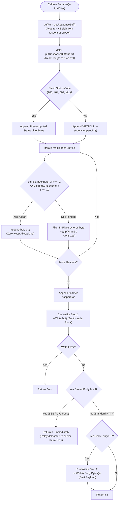

# Reverse Proxy and Gateway Routing

## Overview

Toron includes a native **Reverse Proxy** engine (`pkg/proxy`), allowing it to route incoming client traffic to upstream backend HTTP microservices with load balancing, header sanitization, and path rewriting.

## Features

- **Upstream Forwarding**: Forwards request methods, query parameters, HTTP headers, and streaming request bodies.
- **Forwarded Header Sanitization & Trusted Proxy Chaining**: Injects and sanitizes standard origin headers (`X-Forwarded-For`, `X-Forwarded-Host`, `X-Forwarded-Proto`, `X-Forwarded-Prefix`, `X-Real-IP`, and W3C `traceparent`) while preventing client IP spoofing ([`SEC-31`](file:///Users/sneha/Developer/toron-research/toron/SECURITY_AUDIT.md#L428-L436), [`REQ-092`](file:///Users/sneha/Developer/toron-research/toron/docs/requirements/REQ-092.md), [`ADR-087`](file:///Users/sneha/Developer/toron-research/toron/docs/architecture/ADR-087.md)).
- **Automatic 3xx Redirect Rewriting**: Intercepts upstream `Location` redirect headers (`301`, `302`, `303`, `307`, `308`) and automatically prepends the route prefix (`/login` $\rightarrow$ `/api/login`), preventing 404s on prefix-routed legacy applications.
- **Set-Cookie Path Rewriting**: Automatically rewrites upstream `Set-Cookie: Path=/` attributes to `Path=<prefix>` to keep cookies properly scoped to the gateway route.
- **Configurable Strip Prefix**: Supports stripping the route prefix before dispatching upstream, or preserving the full path for native prefix-aware backends.
- **Resilient Fallback**: Returns `502 Bad Gateway` if the upstream server is offline or times out.

## Forwarded Header Sanitization & Anti-Spoofing (`trusted_proxies`)

Toron prevents client-side IP spoofing by deriving network identity from the physical transport connection (`RemoteAddr`) across HTTP/1.1, HTTP/2, and HTTP/3 QUIC:

1. **Untrusted Connections (Default)**:
   - Client-supplied `X-Forwarded-For` and `X-Real-IP` headers are **stripped and discarded**.
   - Upstream headers are overwritten strictly with the verified physical client address (`peerIP`):
     ```http
     X-Forwarded-For: <peerIP>
     X-Real-IP: <peerIP>
     X-Forwarded-Proto: https
     ```
2. **Verified Trusted Proxies**:
   - If the client's physical socket IP matches a configured `trusted_proxies` CIDR block:
     - Existing `X-Forwarded-For` is preserved, and `peerIP` is appended (`<existingXFF>, <peerIP>`).
     - Existing `X-Real-IP` is preserved.
3. **Preserved Mobile Roaming Affinity (REQ-030)**:
   - Sticky session load balancing (`pkg/proxy/sticky.go`) operates independently from access control. For `ip_hash` balancing, client-level headers continue to be inspected so mobile devices maintain affinity across carrier IP handovers and CGNAT reassignments without regression.

## Configuration in `routes.yaml`

```yaml
routes:
  # 1. Header routing + Load balancing across ports 9001-9003
  - type: "upstream"
    prefix: "/api"
    headers:
      X-Version: "v2"
    algorithm: "round_robin"
    targets:
      - "http://localhost:9001"
      - "http://localhost:9002"
      - "http://localhost:9003"
    strip_prefix: true            # Strips /api before forwarding (default: true)
    rewrite_redirects: true       # Rewrites Location: /login -> /api/login (default: true)
    rewrite_cookie_path: true     # Rewrites Set-Cookie: Path=/ -> Path=/api (default: true)

  # 2. Secure upstream with trusted proxy chaining
  - type: "upstream"
    prefix: "/services/partner"
    target: "http://localhost:9005"
    trusted_proxies:
      - "198.51.100.0/24"         # Appends peerIP for requests from this CIDR; strips headers from all others

  # 3. Legacy backend with automatic redirect and cookie path rewriting
  - type: "upstream"
    prefix: "/services/auth"
    target: "http://localhost:9008"
    rewrite_redirects: true
    rewrite_cookie_path: true

  # 5. Tuned upstream with custom connection pooling and egress routing (REQ-123)
  - type: "upstream"
    prefix: "/services/microservice"
    target: "https://api.internal.corp:8443"
    transport:
      max_idle_conns_per_host: 500       # Keepalive socket pool sizing
      max_conns_per_host: 50             # Upstream backpressure limit
      idle_conn_timeout: 45s             # Socket reclamation timeout
      disable_compression: true          # Raw zero-allocation pass-through
      force_attempt_http2: true          # Enable upstream HTTP/2 ALPN multiplexing
      use_env_proxy: false               # Direct dialing (or true for HTTP_PROXY)
      propagate_upstream_close: false    # Isolate downstream client keep-alives
      tracing: false                     # false = raw speed; true = W3C traceparent context generation (REQ-124)

## Upstream Transport Configuration (`ProxyTransportConfig`)

Beginning with [`REQ-123`](file:///Users/sneha/Developer/toron-research/toron/docs/requirements/REQ-123.md) and [`REQ-124`](file:///Users/sneha/Developer/toron-research/toron/docs/requirements/REQ-124.md), Toron allows granular configuration of reverse proxy transport settings.

### Global Defaults (`config.yaml`)

```yaml
proxy:
  enabled: true
  transport:
    profile: "raw_speed"            # Presets: "raw_speed" (default) or "balanced"
    max_idle_conns: 10000           # Global max idle connections
    max_idle_conns_per_host: 1000   # Max idle keepalive connections per host
    max_conns_per_host: 0           # Concurrency limit (0 = unconstrained; >0 throttles & queues)
    idle_conn_timeout: 90s          # Keepalive socket retention
    disable_compression: true       # true = raw byte pass-through; false = auto-decompress gzip
    use_env_proxy: false            # true = honors HTTP_PROXY/NO_PROXY; false = direct socket dial
    proxy_url: ""                   # Explicit forward proxy URL (e.g. http://squid.corp:3128)
    propagate_upstream_close: false # false = isolates client keepalives; true = clean client teardown
    force_attempt_http2: false      # true = ALPN h2 stream multiplexing to TLS origins
    tracing: false                  # false = suppresses crypto/rand trace ID generation (raw speed); true = generates W3C traceparent
    stream_response: true           # true = zero-copy socket streaming fast-path (raw speed); false = buffers in memory (balanced)
    response_header_timeout: 10s    # Bounded timeout for initial response headers; body streaming is decoupled
```

### Route-Level Overrides (`routes.yaml`)

Each route can override any transport knob under `transport`:
- **Delicate microservices**: Set `max_conns_per_host: 25` to protect origin from connection flooding.
- **External Partner APIs**: Set `use_env_proxy: true` or `proxy_url: "http://squid.corp:3128"`.
- **Payload Inspection**: Set `disable_compression: false` to allow downstream middleware to inspect plaintext.
- **Upstream Session Teardown**: Set `propagate_upstream_close: true` to let origin `Connection: close` tear down the client socket cleanly while still stripping hop-by-hop headers per RFC 7230.
- **Distributed Tracing**: Set `tracing: true` on observability-critical routes to generate W3C `traceparent` headers with cryptographic random IDs, or leave `tracing: false` for raw performance.
- **Long-Lived Live Streams (SSE)**: Toron handles Server-Sent Events (`text/event-stream`) and unbuffered feeds (`X-Accel-Buffering: no`) via a WebSocket-aligned direct socket relay with activity-refreshed write deadlines, automatically bypassing caching and compression ([`REQ-125`](file:///Users/sneha/Developer/toron-research/toron/docs/requirements/REQ-125.md), [`REQ-126`](file:///Users/sneha/Developer/toron-research/toron/docs/requirements/REQ-126.md)).
- **Buffered Fallback**: Set `stream_response: false` on routes where downstream inspection requires complete in-memory body capture.

## Persistent Streaming & Slow-Read Protection ([REQ-125](file:///Users/sneha/Developer/toron-research/toron/docs/requirements/REQ-125.md), [REQ-126](file:///Users/sneha/Developer/toron-research/toron/docs/requirements/REQ-126.md))

When proxying real-time upstream endpoints—such as Server-Sent Events (SSE `text/event-stream`), live telemetry feeds, or unbuffered data pipelines (`stream_response: true`)—Toron uses an active streaming response handle (`res.StreamBody`) paired with **Activity-Refreshed Write Deadlines** implemented by [`connDeadlineTracker`](file:///Users/sneha/Developer/toron-research/toron/pkg/server/deadline.go#L14-L23).

### How It Works

1. **Header Phase**: Toron writes the HTTP status line and upstream response headers under an amortized `write_timeout` window.
2. **Chunk Relay Loop**: In [`pkg/server/server.go:347-363`](file:///Users/sneha/Developer/toron-research/toron/pkg/server/server.go#L347-L363), Toron allocates a pooled 32 KB copy buffer and transfers chunks from `res.StreamBody` to the downstream client socket.
3. **Per-Chunk Write Deadline Refresh**: Prior to transmitting each chunk (`n > 0`), Toron forces a write deadline update to `time.Now().Add(write_timeout)`:
   ```go
   if s.config.WriteTimeout > 0 {
       _ = tracker.ForceSetWriteDeadline(time.Now().Add(s.config.WriteTimeout))
   }
   if _, writeErr := conn.Write(buf[:n]); writeErr != nil {
       _ = req.CloseBody()
       return nil
   }
   ```
4. **Infinite Stream Longevity**: As long as the downstream client consumes chunks in a timely manner, each emitted chunk extends the socket deadline. Healthy SSE streams or live telemetry feeds can remain open indefinitely (hours, days, or weeks) without being killed by the static 5-second `write_timeout`.

### Slow-Read Denial of Service ([CWE-400](https://cwe.mitre.org/data/definitions/400.html)) Defense

Without write deadlines, malicious or stalled clients could advertise a zero TCP receive window (`win 0`) or consume bytes at 1 byte/minute, hanging proxy worker goroutines and pinning origin handles indefinitely until thread pool exhaustion occurs.

Toron prevents this exploit:
- If a client stops reading, the kernel socket send buffer saturates.
- `conn.Write(buf[:n])` blocks waiting for window space.
- After `write_timeout` (e.g. 5s) of write starvation, the operating system kernel times out the socket write.
- `conn.Write` unblocks with `os.ErrDeadlineExceeded`.
- Toron immediately exits the streaming loop, executes `defer res.StreamBody.Close()` to sever the upstream backend connection, and closes the client socket.
- The worker goroutine terminates immediately and frees all resources ([`TC-126.5`](file:///Users/sneha/Developer/toron-research/toron/docs/testCases/TC-126.md#L295-L324)).

For detailed low-level deadline amortization algorithms and idle timeout mechanics, see [Event Reactor Core Architecture](./event-reactor.md).

---

## Zero-Allocation Response Serialization Architecture (`pkg/httpparser`)

During high-concurrency gateway forwarding ([`REQ-121`](file:///Users/sneha/Developer/toron-research/toron/docs/requirements/REQ-121.md)), Toron processes upwards of 25,000 requests per second. At this scale, naive response serialization creates massive garbage collection churn: dynamically creating `bytes.Buffer` structs, formatting status strings, and concatenating headers with payloads generates ~24,500 heap allocations per second, driving up GC pause spikes and CPU instruction cache pressure.

Under [`REQ-127`](file:///Users/sneha/Developer/toron-research/toron/docs/requirements/REQ-127.md) and [`ADR-127`](file:///Users/sneha/Developer/toron-research/toron/docs/architecture/ADR-127.md) ([`TASK-150`](file:///Users/sneha/Developer/toron-research/toron/docs/tasks/TASK-150.md)), Toron introduces a dedicated **Zero-Allocation Response Serialization Architecture** in [`pkg/httpparser/response.go`](file:///Users/sneha/Developer/toron-research/toron/pkg/httpparser/response.go).

### 1. Recycled 4KB Slabs via `sync.Pool` (`responseBufPool`)

Toron maintains a package-level buffer slab pool recycling 4096-byte (`*[]byte`) slices:

```go
var responseBufPool = sync.Pool{
    New: func() any {
        b := make([]byte, 0, 4096)
        return &b
    },
}

func getResponseBuf() *[]byte {
    b := responseBufPool.Get().(*[]byte)
    *b = (*b)[:0]
    return b
}

func putResponseBuf(b *[]byte) {
    if b == nil {
        return
    }
    *b = (*b)[:0]
    responseBufPool.Put(b)
}
```

- **4KB Capacity**: Sized to accommodate status lines and full HTTP/1.1 header sets for standard microservice responses with zero dynamic slice growth or reallocation.
- **Double-Reset Memory Hygiene**: The slice length is reset to zero (`*b = (*b)[:0]`) **both** when returned in `putResponseBuf` and defensively when acquired in `getResponseBuf`. This guarantees that recycled buffers never bleed residual headers, tokens, or cookies from previous transactions across requests ([CWE-200](https://cwe.mitre.org/data/definitions/200.html) / [CWE-226](https://cwe.mitre.org/data/definitions/226.html)).
- **Capacity Preservation**: Even if an atypical response with unusually large headers forces slice growth beyond 4096 bytes, `putResponseBuf` retains the enlarged capacity for subsequent requests without heap reallocations.

### 2. Fast Status Line Lookup Tables

To avoid string formatting allocations (`fmt.Sprintf` or `strconv.Itoa`), Toron evaluates status codes against pre-compiled static byte arrays:

```go
var (
    statusLine200 = []byte("HTTP/1.1 200 OK\r\n")
    statusLine204 = []byte("HTTP/1.1 204 No Content\r\n")
    statusLine301 = []byte("HTTP/1.1 301 Moved Permanently\r\n")
    statusLine302 = []byte("HTTP/1.1 302 Found\r\n")
    statusLine304 = []byte("HTTP/1.1 304 Not Modified\r\n")
    statusLine400 = []byte("HTTP/1.1 400 Bad Request\r\n")
    statusLine401 = []byte("HTTP/1.1 401 Unauthorized\r\n")
    statusLine403 = []byte("HTTP/1.1 403 Forbidden\r\n")
    statusLine404 = []byte("HTTP/1.1 404 Not Found\r\n")
    statusLine500 = []byte("HTTP/1.1 500 Internal Server Error\r\n")
    statusLine502 = []byte("HTTP/1.1 502 Bad Gateway\r\n")
    statusLine503 = []byte("HTTP/1.1 503 Service Unavailable\r\n")
)
```

For non-standard or custom HTTP status codes, status numbers are appended directly into the pooled byte slice using `strconv.AppendInt(buf, int64(code), 10)`, completely avoiding string allocation or interface boxing.

### 3. Zero-Allocation CRLF Header Sanitization

To protect against HTTP response splitting and cache poisoning attacks ([CWE-113](https://cwe.mitre.org/data/definitions/113.html)), headers are sanitized before wire serialization:

```go
func appendSanitizedHeader(buf []byte, s string) []byte {
    if strings.IndexByte(s, '\r') == -1 && strings.IndexByte(s, '\n') == -1 {
        return append(buf, s...)
    }
    for i := 0; i < len(s); i++ {
        c := s[i]
        if c != '\r' && c != '\n' {
            buf = append(buf, c)
        }
    }
    return buf
}
```

- **Zero-Allocation Fast-Path**: Using `strings.IndexByte(s, '\r')` and `strings.IndexByte(s, '\n')` utilizes SIMD-accelerated runtime byte scanning. For the vast majority of benign headers containing no line breaks, the string is appended directly to `buf` without allocating new string objects.
- **In-Place Sanitization**: If malicious or malformed `\r` or `\n` characters are present, they are filtered out in-place byte-by-byte without regex engines or dynamic string replacers. Both header keys and header values are sanitized.

### 4. Zero-Copy Dual-Write Wire Emission

Rather than allocating a massive contiguous buffer to combine status lines, headers, and body payloads into a single byte array, Toron executes a **Zero-Copy Dual-Write**:

```go
func (r *Response) Serialize(w io.Writer) error {
    bufPtr := getResponseBuf()
    defer putResponseBuf(bufPtr)

    buf := *bufPtr

    // 1. Format Status Line into pooled slab
    buf = appendStatusLine(buf, r.StatusCode)

    // 2. Format Headers into pooled slab with CRLF protection
    ...
    // 3. Header/Body separator
    buf = append(buf, '\r', '\n')
    *bufPtr = buf

    // 4. Dual-Write Step 1: Write header block to wire
    if _, err := w.Write(buf); err != nil {
        return err
    }

    // 5. Streaming Hand-Off: If StreamBody != nil, delegate body writing to server loop
    if r.StreamBody != nil {
        return nil
    }

    // 6. Dual-Write Step 2: Write payload directly to wire without intermediate concatenation
    if r.Body != nil && r.Body.Len() > 0 {
        _, err := w.Write(r.Body.Bytes())
        return err
    }

    return nil
}
```



### 5. Streaming Compatibility (`res.StreamBody`)

When streaming endpoints (such as Server-Sent Events or chunked reverse proxy transfers) return a response:
- `r.StreamBody != nil` signals to `Serialize` that the response body is dynamic and potentially unbounded.
- `Content-Length` is **strictly omitted** to comply with HTTP/1.1 streaming specifications.
- `Serialize` writes only the status line and headers to the wire, returning `nil` immediately.
- The server chunk relay loop takes over `conn.Write` operations, using activity-refreshed write deadlines and zero intermediate memory buffering.

### 6. Empirical Performance & Allocation Verification

Benchmarking under [`TC-127.8`](file:///Users/sneha/Developer/toron-research/toron/docs/testCases/TC-127.md#L420-L452) (`BenchmarkResponse_Serialize_Pooled`) confirms:
- **0 B/op heap allocation** for standard HTTP response serialization.
- **0 allocs/op** during hot-path execution.
- Sub-150ns serialization throughput ($137.0\text{ ns/op}$ on Apple M1 Pro).
- Zero data races under 100 concurrent workers (`go test -race`).

---

## Programmatic Route Registration

```go
r := router.New()

// Proxy all requests matching /api/v2/* to http://localhost:9090
if err := r.Proxy("/api/v2", "http://localhost:9090"); err != nil {
    log.Fatalf("Proxy error: %v", err)
}
```

## Related Pages

- [Configuration Guide](../configuration.md)
- [Configuration Options](../reference/config-options.md)
- [Multi-Proxy Docker Benchmark](./docker-compare-benchmark.md)
- [Web Application Firewall](../features/waf.md)
- [Troubleshooting](../troubleshooting.md)
