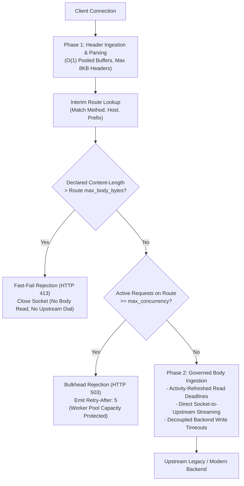
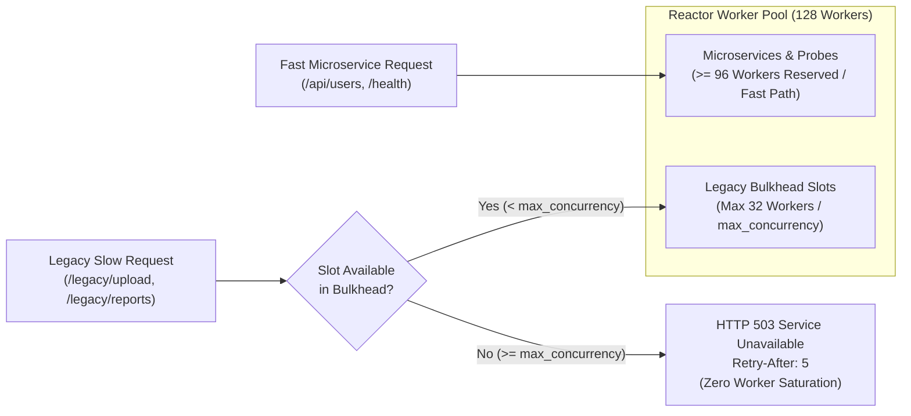
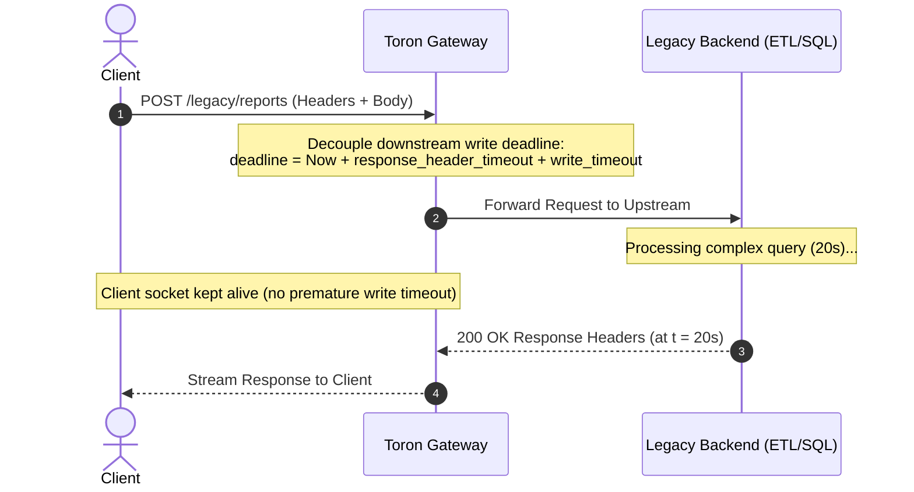

# Enterprise Legacy Workload & Route-Scoped Ingress Isolation

## 1. Overview & Operational Problem Statement

Toron is designed as an event-driven, high-performance edge reverse proxy and API gateway optimized for minimal memory overhead and rapid request multiplexing. To safeguard the gateway against resource exhaustion attacks and memory starvation, Toron enforces strict global security defaults across all client connections:

- **Global Body Ceiling**: 4 MB (`max_body_bytes: 4194304`).
- **Static Connection Deadlines**: 5s socket read timeout (`read_timeout: 5s`), 5s socket write timeout (`write_timeout: 5s`).
- **Upstream Response Header Timeout**: 10s (`response_header_timeout: 10s`).
- **Fixed Reactor Worker Pool**: 128 workers (`worker_pool_size: 128`).
- **In-Memory Body Ingestion for Small Payloads**: Small payloads are bounded and buffered in memory before proxying.

While these baseline defaults provide defense against Slowloris socket exhaustion and Out-Of-Memory (OOM) attacks, modern enterprise environments often run legacy services with operational profiles that clash with strict edge defaults:

1. **Large Enterprise File Uploads**: Multipart media files, database backups, CAD/CAM models, and disk images routinely exceed 200 MB. In standard gateways with static limits, these requests are rejected with `HTTP 413 Payload Too Large`.
2. **High-Latency Monolithic Backends**: Legacy enterprise applications, analytical report generators, ETL routines, and complex relational aggregations often require 15s to 60s+ to generate response headers, exceeding standard 5s write and 10s upstream response timeouts.
3. **Sustained Upload Durations over Constrained Links**: A 200 MB upload over a mobile link, branch office WAN, or throttled connection takes 30s to 120s+ of continuous transmission. Static 5-second socket read timeouts terminate these transfers mid-stream with `i/o timeout`.
4. **Reactor Worker Pool Saturation**: When multiple slow legacy requests occupy reactor worker goroutines for extended durations, the worker pool saturates, blocking listener accept queues and starving fast microservices, static assets, and operational health probes (`/health`).

### The Anti-Pattern: Global Relaxation vs. Route-Scoped Isolation

Relaxing global server parameters (e.g. setting global `max_body_bytes: 500MB` and `read_timeout: 300s`) introduces severe cluster-wide vulnerabilities:
- Monolithic heap allocations on arbitrary routes allow trivial Denial of Service via memory exhaustion.
- Lengthy static read timeouts leave edge sockets vulnerable to Slowloris attacks.
- A flurry of slow queries against legacy endpoints can exhaust the entire worker pool, bringing down the gateway for all workloads.

Toron solves this dilemma through **Route-Scoped Ingress Isolation**: retaining hardened, zero-trust security defaults globally while granting granular, route-specific ingress overrides with safety bulkheads, activity-refreshed sliding deadlines, and direct zero-copy body streaming.



---

## 2. Core Architectural Capabilities

### 2.1 Two-Phase Request Parsing Pipeline

To ensure that large payloads do not compromise gateway performance, Toron decouples HTTP request ingestion into two sequential phases:

- **Phase 1: Header Ingestion & Fast Matching**:
  - The request line and HTTP headers are parsed into request metadata using pre-allocated, pooled line buffers.
  - Phase 1 completes with **zero heap allocation** for the request body.
  - If request headers exceed `max_header_bytes` (default: 8 KB), the connection is immediately rejected with `HTTP 431 Request Header Fields Too Large`.
  - Immediately following header parsing, Toron executes **Interim Route Matching** (`pkg/router/router.go`) to resolve the target route configuration, its payload ceiling (`max_body_bytes`), concurrency limits (`max_concurrency`), and timeout thresholds before reading payload bytes from the network socket.

- **Phase 2: Governed Body Ingestion**:
  - The request body is ingested according to the specific parameters of the matched route.
  - If route matching fails (e.g. `404 Not Found`), the connection is terminated or handled without reading or buffering an unconsumed request body.

---

### 2.2 Tier-1 Fast-Fail Pre-Read Rejection (`HTTP 413`)

Toron enforces route payload ceilings using a two-tier validation mechanism:

1. **Declared `Content-Length` Pre-Read Check (Tier 1)**:
   - When a client sends a request with a declared `Content-Length` header exceeding the matched route's `max_body_bytes` (or the server default of 4 MB if unset), Toron immediately halts processing during Phase 1.
   - The gateway writes an `HTTP 413 Payload Too Large` JSON response:
     ```json
     {"error":"413 Payload Too Large: request Content-Length exceeds effective route limit"}
     ```
   - The connection is closed immediately (`Connection: close`).
   - **Zero body bytes are read from the socket**, preventing bandwidth waste, worker blocking, and memory allocation.

2. **Cumulative Streaming Clamping (Tier 2)**:
   - For chunked or streaming uploads where `Content-Length` is omitted (`Content-Length: -1`), Toron tracks cumulative uncompressed bytes read through `activityReader`.
   - The moment cumulative bytes exceed `max_body_bytes`, ingestion is aborted immediately, an `HTTP 413` response is returned, and the TCP connection is severed.

---

### 2.3 Route Bulkhead Concurrency Gates (`HTTP 503`)

To prevent slow, long-running legacy workloads from monopolizing the gateway's reactor workers, Toron introduces **Route Bulkhead Concurrency Gates** (`max_concurrency`).



#### Operational Mechanics
- Each route configured with `max_concurrency` maintains an atomic in-flight counter.
- **Over-Capacity Fast-Fail**: When an incoming request matches a route whose active count meets or exceeds `max_concurrency`, the gateway immediately rejects the request with `HTTP 503 Service Unavailable`:
  ```json
  {"error":"503 Service Unavailable: Route concurrency limit reached"}
  ```
- The response includes a `Retry-After: 5` header advising the client to back off.
- Rejection occurs immediately after Phase 1 routing, before body ingestion or upstream connection dialing.
- **Deterministic Release**: Active route slots are atomically released upon request completion, error response, or client socket termination.

#### Automated Safety Guardrail
If an administrator configures an elevated route ceiling (`max_body_bytes > 4MB`) or an elevated backend response timeout (`response_header_timeout > 10s`) but omits `max_concurrency`, Toron's configuration engine automatically applies an automated safety guardrail:

$$\text{effective\_max\_concurrency} = \min\left(32, \max\left(1, \frac{\text{worker\_pool\_size}}{4}\right)\right)$$

On a standard gateway with 128 reactor workers, an elevated legacy route without an explicit `max_concurrency` defaults to `32` concurrent slots. This mathematically guarantees that slow legacy workloads cannot consume more than 25% of reactor capacity, reserving at least 75% ($\ge 96$ workers) for fast microservices, static assets, and operational probes (`/health`, `/metrics`).

---

### 2.4 Activity-Refreshed Sliding Read Deadlines

Standard HTTP gateways rely on absolute static read deadlines (e.g. `read_timeout: 5s`). Under an absolute deadline, any upload taking longer than 5 seconds is aborted with an `i/o timeout`, regardless of connection health.

Toron implements **Activity-Refreshed Sliding Deadlines** (`pkg/server/activity_reader.go`):

```
Time  0s             5s            10s            15s            20s            25s
──────┼──────────────┼──────────────┼──────────────┼──────────────┼──────────────┼─────►
      [=== Read 1 ===]
                     [=== Read 2 ===]
                                    [=== Read 3 ===]
                                                   [=== Read 4 ===]
      ▲              ▲              ▲              ▲              ▲
      Deadline @ 5s  Deadline @ 10s Deadline @ 15s Deadline @ 20s Deadline @ 25s
      (Sliding deadline resets forward on steady data arrival)
```

1. **Progress-Based Renewal**:
   - The socket read deadline is initialized to the route's `read_timeout` (or server default).
   - As data arrives steadily across the wire, each successful read operation refreshes the socket deadline forward by `read_timeout`.
   - This allows large transfers (e.g. 200 MB uploads over 30s to 120s) to complete successfully without premature connection drops.
2. **Anti-Drip Rate Clamping (Slowloris Defense)**:
   - To prevent malicious clients from holding connections open indefinitely by trickling bytes (e.g. transmitting 1 byte every 4.9 seconds), `activityReader` tracks progress within each timeout window.
   - Connections must transfer at least a minimum progress threshold (default: 1 KB per window). If cumulative data in a window falls below this rate, or if transmission pauses for longer than `read_timeout`, the connection is immediately severed, unblocking the worker.
3. **Adaptive Syscall Amortization**:
   - Deadline updates use `connDeadlineTracker` to skip redundant operating system calls when more than half of the current deadline window remains, achieving minimal CPU overhead during high-speed transfers.

---

### 2.5 Decoupled Backend Response Timeouts (`HTTP 504`)

Legacy reporting, SQL aggregation, and batch processing backends often require 15s to 60s+ to process data and emit response headers. In traditional edge servers, two issues arise:
1. Downstream client write timeouts (`write_timeout: 5s`) fire while waiting for the upstream backend, abruptly terminating the client connection.
2. Upstream transport timeouts terminate backend requests prematurely.

Toron solves this with **Decoupled Backend Response Timeouts**:



- **Downstream Deadline Decoupling**: While waiting for upstream response headers, Toron decouples the downstream client socket write deadline, setting it to `now + response_header_timeout + write_timeout`. The downstream connection is maintained without premature drops while the backend computes the result.
- **Bounded Timeout Handling**: If the upstream backend does not return response headers within `response_header_timeout`, Toron aborts the upstream context and returns `HTTP 504 Gateway Timeout`:
  ```json
  {"error":"504 Gateway Timeout: Upstream response header timeout expired"}
  ```
- **Connection Failure Handling**: If the upstream backend prematurely drops or resets the TCP socket, Toron returns `HTTP 502 Bad Gateway`.

---

### 2.6 Direct Zero-Copy Body Streaming

For large payloads, buffering entire request bodies in gateway heap memory creates severe Out-Of-Memory (OOM) risks. Toron implements **Direct Zero-Copy Body Streaming** (`pkg/proxy/proxy.go`):

- **Constant $O(1)$ Memory**: Payloads of any size (from 1 MB to 2 GB+) stream directly from the client socket reader to the upstream transport connection using pooled 32 KB / 64 KB buffers. Memory consumption remains strictly bounded at $\le 64\,\text{KB}$ per active connection.
- **Automatic Activation**:
  - Any request body $> 64\,\text{KB}$ (`Content-Length > 65536`) automatically streams directly to the upstream backend without in-memory buffering.
  - Chunked requests (`Content-Length: -1`) on streaming routes stream directly upstream.
  - Operators can explicitly enforce streaming via `stream_request_body: true` or force in-memory buffering via `stream_request_body: false`.
- **Bidirectional Abort Propagation**:
  - If the downstream client disconnects or aborts the transfer midway, Toron immediately cancels the upstream request context (`req.Context()`), closing the upstream connection and halting backend execution.
  - If the upstream backend aborts midway, Toron immediately closes the downstream socket fail-closed, ensuring the client detects the truncated transfer.

---

## 3. Configuration Reference

Route-level ingress parameters are configured per route under `routes[]` in `routes.yaml`:

| Parameter | Type | Default | Description |
| :--- | :--- | :--- | :--- |
| `max_body_bytes` | `integer` | `0` (inherits `server.max_body_bytes`, 4 MB) | Route-scoped maximum request body ceiling in bytes. Declared `Content-Length` exceeding this limit triggers immediate pre-read `HTTP 413 Payload Too Large` rejection. |
| `max_concurrency` | `integer` | `0` (or auto guardrail) | Maximum concurrent active requests permitted on this route. Excess requests receive immediate `HTTP 503 Service Unavailable` with `Retry-After: 5`. If omitted on elevated routes (`max_body_bytes > 4MB` or `response_header_timeout > 10s`), defaults to $\min(32, \text{worker\_pool\_size}/4)$. |
| `read_timeout` | `duration` | `0s` (inherits `server.read_timeout`, 5s) | Route-scoped socket read timeout duration. Supported by activity-refreshed sliding deadlines, resetting forward upon data progress while clamping Slowloris drips. |
| `write_timeout` | `duration` | `0s` (inherits `server.write_timeout`, 5s) | Route-scoped downstream client socket write timeout duration. |
| `response_header_timeout` | `duration` | `0s` (inherits `proxy.transport.response_header_timeout`, 10s) | Route-level maximum duration waiting for upstream response headers. Expiration emits `HTTP 504 Gateway Timeout`. Downstream client write deadline is decoupled during backend execution. |
| `stream_request_body` | `boolean` | `nil` (auto) | Enables direct zero-copy body streaming from client socket directly to upstream backend ($O(1) \le 64\,\text{KB}$ memory). Automatically active for bodies $> 64\,\text{KB}$ or chunked transfers when unset. |

---

## 4. Configuration Recipes

### Recipe 1: 200 MB Large File Ingestion Route

Allows 200 MB uploads on `/legacy/upload` with concurrency isolation, activity deadlines, and direct zero-copy streaming, while the global server maintains a strict 4 MB limit:

```yaml
# config.yaml (Hardened Perimeter Defaults)
server:
  host: "0.0.0.0"
  port: 8080
  worker_pool_size: 128
  read_timeout: 5s
  write_timeout: 5s
  max_body_bytes: 4194304             # 4 MB global ceiling
  inbound_chunked_mode: "normalize"
```

```yaml
# routes.yaml (Application Routes)
routes:
  # Enterprise Large File Upload Route
  - type: "upstream"
    prefix: "/legacy/upload"
    target: "http://storage-backend:9000"
    max_body_bytes: 209715200          # 200 MB route ceiling
    max_concurrency: 16                # Bulkhead gate: max 16 concurrent uploads
    read_timeout: 10s                  # Activity sliding deadline (10s inactivity tolerance)
    stream_request_body: true          # Zero-copy streaming (O(1) heap memory)

  # Standard Fast Microservice API (Protected by global defaults)
  - type: "upstream"
    prefix: "/api"
    target: "http://api-service:8080"
```

### Recipe 2: Long-Running Legacy SQL / ETL Analytics Route

Supports legacy monolithic reporting endpoints requiring up to 60 seconds to execute queries without dropping client connections or exhausting workers:

```yaml
routes:
  # Long-Running Batch Reporting & SQL Analytics
  - type: "upstream"
    prefix: "/legacy/reports"
    target: "http://analytics-backend:8080"
    max_concurrency: 8                 # Bulkhead gate: max 8 concurrent reports
    response_header_timeout: 60s       # Wait up to 60s for upstream headers (504 on timeout)
    write_timeout: 30s                 # Downstream client write deadline
```

### Recipe 3: Chunked Streaming Ingestion with Bulkhead Guardrail

Accepts large streaming or chunked uploads with passthrough chunk framing and automated bulkhead sizing:

```yaml
routes:
  - type: "upstream"
    prefix: "/legacy/stream-upload"
    target: "http://ingest-node:9002"
    inbound_chunked_mode: "passthrough"
    max_body_bytes: 524288000          # 500 MB ceiling
    # max_concurrency omitted: automatically defaults to min(32, 128/4) = 32
    read_timeout: 15s
    stream_request_body: true
```

---

## 5. Security & Threat Mitigation Summary

| Threat Vector | Standard Gateway Behavior | Toron Route-Scoped Ingress Behavior |
| :--- | :--- | :--- |
| **OOM Heap Allocation Bomb** | Eager buffering of 200MB+ payloads causes heap spikes and Out-Of-Memory crashes. | Tier-1 fast-fail pre-read check rejects oversized `Content-Length` before reading body. Streaming proxy uses $O(1) \le 64\,\text{KB}$ constant memory. |
| **Worker Pool Starvation** | Slow legacy requests occupy worker goroutines, blocking accept loops and starving `/health`. | Route Bulkhead Concurrency Gates (`max_concurrency`) reject excess requests with `HTTP 503` (`Retry-After: 5`). Automated guardrails reserve $\ge 75\%$ of reactor capacity. |
| **Slowloris Connection Holding** | Relaxing global read timeouts allows attackers to hold sockets open with byte trickles. | Sliding deadlines refresh only on steady data arrival. Anti-drip rate clamping terminates connections falling below minimum throughput. |
| **Slow Backend Dropped Connections** | Static client write timeouts terminate connections while the backend processes complex queries. | Downstream write deadline is decoupled while awaiting upstream headers up to `response_header_timeout`. Clean `HTTP 504` emitted on backend expiration. |
| **Orphaned Backend Processing** | Client disconnects during long upload; proxy continues sending stale data to backend. | Bidirectional context cancellation terminates upstream requests immediately upon client disconnection. |

---

## 6. Related Documentation

- [Configuration Guide](../configuration.md) – Comprehensive dual-file configuration manual.
- [Configuration Options Reference](../reference/config-options.md) – Complete reference of server and routing options.
- [Reverse Proxy & Gateway Routing](./reverse-proxy.md) – Upstream reverse proxy engine and transport configuration.
- [Inbound Chunked Transfer-Encoding Ingestion](./inbound-chunked-ingestion.md) – Active Ingress Smuggling Firewall and chunked wire decoding.
- [Event Reactor Core](./event-reactor.md) – Reactor worker pool architecture and connection deadline tracker.
- [Troubleshooting Guide](../troubleshooting.md) – Diagnosing timeouts and status codes.
