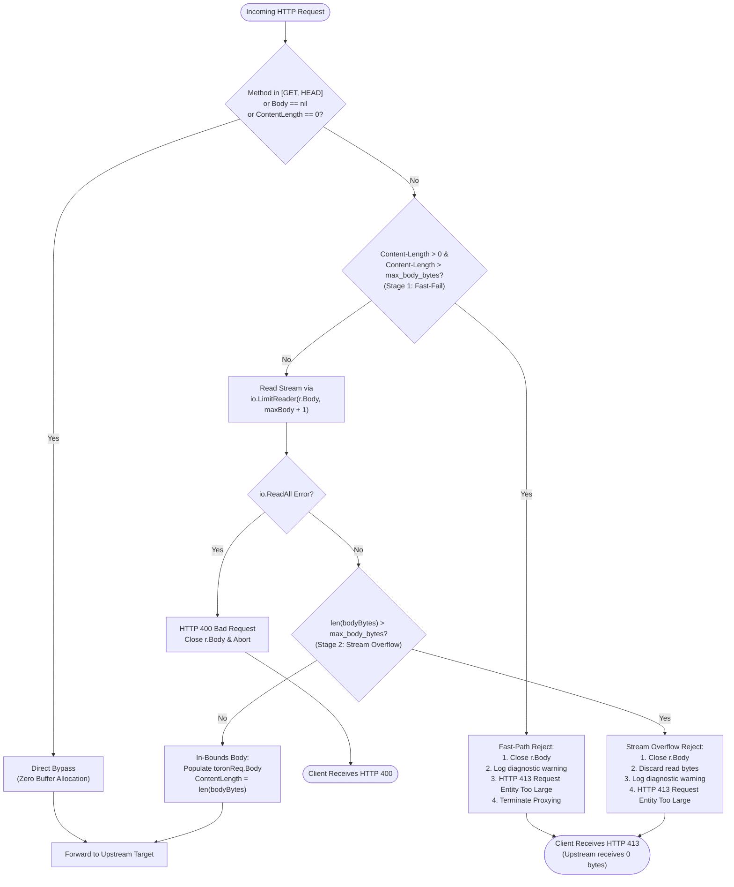
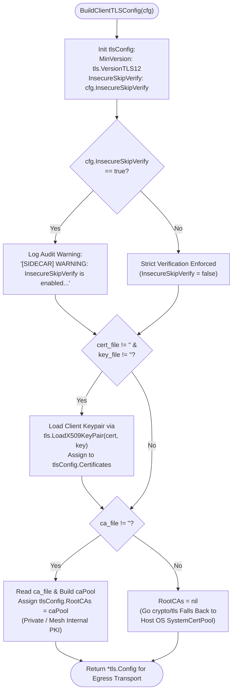

# 🕸️ Service Mesh Sidecar Mode (`pkg/sidecar`)

Toron Edge Gateway features a lightweight, zero-dependency **Service Mesh Sidecar Mode** ([`pkg/sidecar`](file:///Users/sneha/Developer/toron-research/toron/pkg/sidecar/proxy.go)). In Sidecar Mode, Toron runs alongside pod application containers (`127.0.0.1`), transparently enforcing pod-to-pod Mutual TLS (mTLS) zero-trust encryption, dynamic weighted traffic splitting (e.g. 80/20 canary releases), and configurable request body bounding with fail-fast HTTP 413 rejection with minimal memory overhead (<10MB RAM).

---

## 🌟 Key Features

* **Zero External Dependencies**: Implements mTLS certificate verification, weighted traffic splitting, and bounded body ingestion using Go standard library `crypto/tls`, `net/http`, and `io`.
* **Pod-to-Pod Strict mTLS**: Enforces `client_auth: "require_and_verify"` with Root CA certificate pools (`ca_file`).
* **Weighted Traffic Splitting**: Distributes outbound egress traffic across multiple canary backends according to assigned integer weights (e.g. 80% to v1, 20% to v2).
* **Ingress / Egress / Dual Modes**: Flexible operational modes running on dedicated local ports (Ingress: 15006, Egress: 15001, Application: 8080).
* **Configurable Request Body Limit & HTTP 413 Protection ([`SEC-25`](file:///Users/sneha/Developer/toron-research/toron/SECURITY_AUDIT.md#L366-L374))**: Configurable request payload threshold via [`SidecarConfig.MaxBodyBytes`](file:///Users/sneha/Developer/toron-research/toron/pkg/config/config.go#L109) (`max_body_bytes`), defaulting to a 10 MB fallback. Prevents silent truncation and upstream data corruption by rejecting oversized payloads immediately with `413 Request Entity Too Large` (`http.StatusRequestEntityTooLarge`).

---

## ⚙️ Configuration Reference (`toron.yaml` / `config.yaml`)

```yaml
sidecar:
  enabled: true
  mode: "dual"              # Operational mode: "ingress", "egress", or "dual"
  ingress_port: 15006       # Pod inbound mTLS listener port
  egress_port: 15001        # Pod outbound proxy listener port
  app_port: 8080            # Local app container target port (127.0.0.1:8080)
  max_body_bytes: 10485760  # Maximum request body size in bytes (default: 10MB)
  strict_mtls: true         # Enforce RequireAndVerifyClientCert mTLS
  cert_file: "./certs/sidecar.crt"
  key_file: "./certs/sidecar.key"
  ca_file: "./certs/ca.crt"
  insecure_skip_verify: false # Strict upstream TLS verification (default: false)
  traffic_splits:           # Weighted canary traffic splitting
    - prefix: "/api"
      backends:
        - target: "http://service-v1:8080"
          weight: 80
        - target: "http://service-v2:8080"
          weight: 20
```

### Parameter Reference

| Parameter | Type | Default | Description |
| :--- | :--- | :--- | :--- |
| `enabled` | `boolean` | `false` | Enables or disables Service Mesh Sidecar mode. |
| `mode` | `string` | `"dual"` | Operational proxy mode: `"ingress"` (inbound mTLS), `"egress"` (outbound traffic routing), or `"dual"` (both). |
| `ingress_port` | `integer` | `15006` | Inbound mTLS listener port for incoming pod-to-pod traffic. |
| `egress_port` | `integer` | `15001` | Outbound proxy listener port for outgoing application traffic. |
| `app_port` | `integer` | `8080` | Local target application port (`127.0.0.1:<app_port>`). |
| `max_body_bytes` | `integer` (`int64`) | `10485760` (10 MB) | Maximum permitted request body size in bytes for mutating requests. If omitted, `0`, or negative (`<= 0`), automatically defaults to 10 MB (`10 * 1024 * 1024` bytes). |
| `strict_mtls` | `boolean` | `false` | Enforce strict client certificate authentication (`RequireAndVerifyClientCert`). |
| `cert_file` | `string` | `""` | Path to sidecar X.509 public certificate file. |
| `key_file` | `string` | `""` | Path to sidecar private key file. |
| `ca_file` | `string` | `""` | Path to trusted Root CA certificate bundle for mTLS validation. If omitted (`""`), falls back to host system trust roots (`x509.SystemCertPool()`). |
| `insecure_skip_verify` | `boolean` | `false` | Explicit opt-in flag to disable upstream TLS certificate verification on outbound egress connections. Default: `false`. **WARNING**: Enabling this in production disables hostname, expiration, and chain validation, exposing egress traffic to Man-in-the-Middle (MitM) attacks. Emits a high-visibility warning log when enabled. |
| `traffic_splits` | `list` | `[]` | List of weighted routing rules for canary releases (`prefix`, `backends: [{target, weight}]`). |

---

## 🛡️ Request Body Size Limits & HTTP 413 Rejection ([`SEC-25`](file:///Users/sneha/Developer/toron-research/toron/SECURITY_AUDIT.md#L366-L374))

### Background & Security Remediation

Prior to the remediation of [`SEC-25`](file:///Users/sneha/Developer/toron-research/toron/SECURITY_AUDIT.md#L366-L374) (addressed in [`REQ-086`](file:///Users/sneha/Developer/toron-research/toron/docs/requirements/REQ-086.md), [`ADR-081`](file:///Users/sneha/Developer/toron-research/toron/docs/architecture/ADR-081.md), and [`TASK-090`](file:///Users/sneha/Developer/toron-research/toron/docs/tasks/TASK-090.md)–[`TASK-092`](file:///Users/sneha/Developer/toron-research/toron/docs/tasks/TASK-092.md)), the sidecar proxy engine used a hardcoded 10 MB limit and an unbounded `io.LimitReader` when proxying mutating request bodies. When a client transmitted a payload exceeding 10 MB, the proxy silently truncated the incoming data, updated the request `Content-Length` to the truncated length, and forwarded the partial payload upstream.

This resulted in silent data corruption, truncated JSON payloads, and desynchronization in backend microservices without error visibility.

The enhanced sidecar architecture resolves this vulnerability through:
1. **Configurable Limits**: Exposed via [`SidecarConfig.MaxBodyBytes`](file:///Users/sneha/Developer/toron-research/toron/pkg/config/config.go#L109) (`max_body_bytes`).
2. **Safe Fallback**: Any configuration with `max_body_bytes <= 0` or missing defaults to 10 MB (`10,485,760` bytes) in [`DefaultAppConfig`](file:///Users/sneha/Developer/toron-research/toron/pkg/config/config.go#L466), [`validateConfigDefaults`](file:///Users/sneha/Developer/toron-research/toron/pkg/config/loader.go#L153), and [`NewProxyEngine`](file:///Users/sneha/Developer/toron-research/toron/pkg/sidecar/proxy.go#L37).
3. **Dual-Stage Overflow Protection**: Oversized requests are caught either before body reading (via `Content-Length`) or during bounded stream ingestion (via `io.LimitReader(r.Body, maxBody+1)`), returning HTTP `413 Request Entity Too Large` (`http.StatusRequestEntityTooLarge`).
4. **Zero Partial Forwarding**: When rejected, `r.Body` is cleanly closed and zero bytes are dispatched to upstream application backends.
5. **Byte-Fidelity Forwarding**: Valid requests below the limit are forwarded intact with exact byte fidelity.
6. **Non-Mutating Bypass**: `GET` and `HEAD` requests, or requests with `r.Body == nil` or `ContentLength == 0`, bypass body buffering entirely.

### Overflow Detection Pipeline



### Diagnostic Logging on 413 Rejection

When an incoming payload exceeds `max_body_bytes`, the sidecar proxy engine logs a structured diagnostic warning:

```text
[SIDECAR] 413 Payload Too Large: POST /api/upload declared Content-Length 20971520 exceeds limit 10485760
[SIDECAR] 413 Payload Too Large: POST /api/stream request body exceeds limit 10485760
```

---

## 🔒 Strict Egress TLS Certificate Validation & System Trust Root Fallback ([`SEC-35`](file:///Users/sneha/Developer/toron-research/toron/SECURITY_AUDIT.md#L481-L489))

### Background & Vulnerability Analysis (CWE-295)

Prior to the remediation of [`SEC-35`](file:///Users/sneha/Developer/toron-research/toron/SECURITY_AUDIT.md#L481-L489) (addressed in [`REQ-097`](file:///Users/sneha/Developer/toron-research/toron/docs/requirements/REQ-097.md), [`ADR-097`](file:///Users/sneha/Developer/toron-research/toron/docs/architecture/ADR-097.md), [`TASK-120`](file:///Users/sneha/Developer/toron-research/toron/docs/tasks/TASK-120.md), and [`TC-097`](file:///Users/sneha/Developer/toron-research/toron/docs/testCases/TC-097.md)), the sidecar egress TLS configuration builder ([`BuildClientTLSConfig`](file:///Users/sneha/Developer/toron-research/toron/pkg/sidecar/mtls.go#L47)) contained a critical architectural defect:

```go
// VULNERABLE HISTORICAL CODE:
if cfg.CAFile != "" {
    caBytes, err := os.ReadFile(cfg.CAFile)
    ...
    tlsConfig.RootCAs = caPool
} else {
    // Default to insecure verify if custom CA is omitted in test environments
    tlsConfig.InsecureSkipVerify = true
}
```

Whenever an operator configured a sidecar without specifying an explicit internal CA file path (`ca_file: ""`)—the standard pattern when connecting to upstreams secured by public cloud certificates (AWS ACM, Cloudflare, Let's Encrypt) or host OS trust roots—the proxy automatically defaulted `InsecureSkipVerify = true`.

This hardcoded default completely disabled peer certificate validation, certificate chain verification, expiration checks, and hostname matching in Go's `crypto/tls` runtime. Network-adjacent attackers in shared Kubernetes pods, container networks, or compromised network gateways could easily intercept, eavesdrop, or tamper with outbound egress traffic by presenting arbitrary self-signed or forged certificates (CWE-295).

### Secure-by-Default Architecture

The enhanced sidecar client TLS constructor eliminates this vulnerability across six defense layers:

1. **Strict Verification by Default**: [`SidecarConfig.InsecureSkipVerify`](file:///Users/sneha/Developer/toron-research/toron/pkg/config/config.go#L114) defaults strictly to `false` in [`defaultConfig()`](file:///Users/sneha/Developer/toron-research/toron/pkg/config/config.go#L580). Full X.509 certificate chain validation, expiration checks, and SAN/hostname verification are enforced on all outbound egress connections.
2. **Host Operating System Trust Root Fallback**: When `ca_file` is omitted or empty (`""`), `BuildClientTLSConfig` leaves `tlsConfig.RootCAs = nil`. The Go standard library `crypto/tls` automatically defaults to the host operating system's system root certificate pool (`x509.SystemCertPool()`). Services backed by public PKI validate seamlessly without requiring custom certificate bundles.
3. **Custom CA Bundle Integration (`ca_file`)**: When `ca_file` is specified (e.g. `./certs/ca.crt`), certificates are parsed and loaded into an isolated `x509.CertPool` assigned to `tlsConfig.RootCAs`. Outbound egress connections strictly validate that upstream certificates chain up to this custom CA, providing end-to-end zero-trust validation for private enterprise PKI.
4. **Explicit Opt-In & Mandatory Warning Log**: Bypassing certificate verification is strictly restricted to intentional test or debugging scenarios and requires explicit configuration (`insecure_skip_verify: true`). Whenever enabled, `BuildClientTLSConfig` emits a high-visibility audit warning:
   ```text
   [SIDECAR] WARNING: InsecureSkipVerify is enabled for sidecar egress TLS. Certificate verification is disabled.
   ```
5. **Cryptographic Protocol Floor (`tls.VersionTLS12`)**: All client TLS egress configurations enforce `MinVersion: tls.VersionTLS12`. Legacy, cryptographically broken protocol versions (SSLv3, TLS 1.0, TLS 1.1) are rejected, preventing protocol downgrade attacks.
6. **Client mTLS Authentication**: If `cert_file` and `key_file` are configured, the sidecar loads its client X.509 keypair (`tls.LoadX509KeyPair`), authenticating itself to upstream destination pods in mutual TLS handshakes.

### Client TLS Decision Flow



---

## 🚀 Running Sidecar Mode Example

### Dual Ingress/Egress Command

```bash
# Start Toron in Sidecar Mode alongside local app container
./toron -config ./sidecar-config.yaml
```

### Verification with cURL

```bash
# 1. Valid request within limit (200 OK)
curl -v -X POST http://127.0.0.1:15006/api/data \
  -H "Content-Type: application/json" \
  -d '{"status":"active"}'

# 2. Oversized declared Content-Length (Immediate 413 Payload Too Large)
curl -v -X POST http://127.0.0.1:15006/api/data \
  -H "Content-Length: 20000000" \
  --data-binary @huge-file.bin

# 3. Oversized chunked stream (Stream bounded 413 Payload Too Large)
curl -v -X POST http://127.0.0.1:15006/api/upload \
  -H "Transfer-Encoding: chunked" \
  --data-binary @huge-stream.bin
```

---

## 🔗 Related Documentation & Code References

* [`SidecarConfig`](file:///Users/sneha/Developer/toron-research/toron/pkg/config/config.go#L103) – Sidecar configuration struct in [`pkg/config/config.go`](file:///Users/sneha/Developer/toron-research/toron/pkg/config/config.go).
* [`SidecarConfig.MaxBodyBytes`](file:///Users/sneha/Developer/toron-research/toron/pkg/config/config.go#L109) – Maximum request body size field definition.
* [`SidecarConfig.InsecureSkipVerify`](file:///Users/sneha/Developer/toron-research/toron/pkg/config/config.go#L114) – Explicit egress TLS verification opt-in boolean.
* [`validateConfigDefaults`](file:///Users/sneha/Developer/toron-research/toron/pkg/config/loader.go#L153) – 10 MB normalization fallback in [`pkg/config/loader.go`](file:///Users/sneha/Developer/toron-research/toron/pkg/config/loader.go).
* [`NewProxyEngine`](file:///Users/sneha/Developer/toron-research/toron/pkg/sidecar/proxy.go#L37) – Sidecar proxy constructor and fallback in [`pkg/sidecar/proxy.go`](file:///Users/sneha/Developer/toron-research/toron/pkg/sidecar/proxy.go).
* [`ProxyEngine.proxyToURL`](file:///Users/sneha/Developer/toron-research/toron/pkg/sidecar/proxy.go#L192) – HTTP 413 rejection and payload forwarding implementation.
* [`BuildClientTLSConfig`](file:///Users/sneha/Developer/toron-research/toron/pkg/sidecar/mtls.go#L47) – Secure client TLS configuration constructor in [`pkg/sidecar/mtls.go`](file:///Users/sneha/Developer/toron-research/toron/pkg/sidecar/mtls.go).
* [`BuildServerTLSConfig`](file:///Users/sneha/Developer/toron-research/toron/pkg/sidecar/mtls.go#L14) – Ingress server-side mTLS configuration constructor.
* [`sidecar_test.go`](file:///Users/sneha/Developer/toron-research/toron/pkg/sidecar/sidecar_test.go) – Automated test suite verifying SEC-25 and SEC-35 fixes.
* [`SEC-25`](file:///Users/sneha/Developer/toron-research/toron/SECURITY_AUDIT.md#L366-L374) – Security audit finding record for sidecar payload truncation.
* [`SEC-35`](file:///Users/sneha/Developer/toron-research/toron/SECURITY_AUDIT.md#L481-L489) – Security audit finding record for sidecar client TLS certificate validation.
* [`REQ-086`](file:///Users/sneha/Developer/toron-research/toron/docs/requirements/REQ-086.md) – Requirement specification for configurable sidecar body limits.
* [`REQ-097`](file:///Users/sneha/Developer/toron-research/toron/docs/requirements/REQ-097.md) – Requirement specification for secure default sidecar client TLS validation.
* [`ADR-081`](file:///Users/sneha/Developer/toron-research/toron/docs/architecture/ADR-081.md) – Architecture decision record for sidecar body limiting and rejection.
* [`ADR-097`](file:///Users/sneha/Developer/toron-research/toron/docs/architecture/ADR-097.md) – Architecture decision record for secure default client TLS validation.
* [`TASK-120`](file:///Users/sneha/Developer/toron-research/toron/docs/tasks/TASK-120.md) – Implementation task for SEC-35 remediation.
* [`TC-086`](file:///Users/sneha/Developer/toron-research/toron/docs/testCases/TC-086.md) – Test case specification for sidecar body bounding.
* [`TC-097`](file:///Users/sneha/Developer/toron-research/toron/docs/testCases/TC-097.md) – Test case specification for sidecar client TLS verification.
* [`CR-093`](file:///Users/sneha/Developer/toron-research/toron/docs/codeReview/CR-093.md) – Code review record for SEC-35 remediation.
* [`SR-097`](file:///Users/sneha/Developer/toron-research/toron/docs/securityReview/SR-097.md) – Security review and vulnerability assessment for SEC-35 remediation.
* [Configuration Options Reference](../reference/config-options.md) – Global configuration options.
* [Configuration Guide](../configuration.md) – Dual-file YAML configuration guide.
