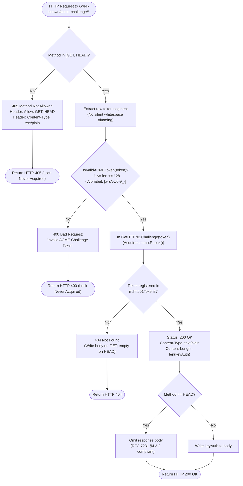

# HTTPS TLS Encryption and Certificate Guide

## Overview

Toron features built-in HTTPS TLS transport layer security with automatic development certificate generation, ALPN HTTP/2 negotiation (`h2`, `http/1.1`), and TLS 1.2+ protocol enforcement.

## Configuration in `config.yaml`

Enable HTTPS and configure certificate paths under the `server.tls` section of `config.yaml`:

```yaml
server:
  host: "0.0.0.0"
  port: 8443
  tls:
    enabled: true
    cert_file: "./certs/server.crt"
    key_file: "./certs/server.key"
    auto_dev_cert: false
```

### Auto Development Mode (Self-Signed Certificates)

For local development without existing certificate files, enable `auto_dev_cert`:

```yaml
server:
  tls:
    enabled: true
    auto_dev_cert: true
```

Toron automatically generates an in-memory ECDSA P-256 certificate for `localhost` and `127.0.0.1`.

## Per-Host Dynamic SNI & Mutual TLS (mTLS) in `routes.yaml`

Toron supports configuring dedicated X.509 certificates, Mutual TLS (mTLS) client certificate verification, and minimum TLS versions per virtual host domain directly within `routes.yaml`:

```yaml
routes:
  # 1. Standard Multi-Tenant Virtual Host with Dedicated Certificate
  - type: "upstream"
    host: "app.example.com"
    prefix: "/"
    target: "http://localhost:9001"
    tls:
      cert_file: "./certs/app.crt"
      key_file: "./certs/app.key"

  # 2. High-Security Internal Host with Strict Mutual TLS (mTLS) & TLS 1.3
  - type: "upstream"
    host: "secure.internal.local"
    prefix: "/"
    target: "http://localhost:9002"
    tls:
      cert_file: "./certs/internal.crt"
      key_file: "./certs/internal.key"
      ca_file: "./certs/internal_ca.crt"
      client_auth: "require_and_verify" # "no_client_cert", "request_client_cert", "require_any_client_cert", "verify_client_cert_if_given", "require_and_verify"
      min_version: "tls1.3"             # "tls1.2", "tls1.3"
```

### Supported Client Authentication Policies (`client_auth`)
* `no_client_cert`: Standard TLS without requesting client certificates (default).
* `request_client_cert`: Requests a client certificate during handshake but allows unauthenticated clients.
* `require_any_client_cert`: Requires the client to present a certificate without verifying against a CA.
* `verify_client_cert_if_given`: Verifies client certificate against `ca_file` only if provided.
* `require_and_verify`: Strictly mandates and validates client certificates signed by the configured `ca_file` (mTLS).

---

## 🛡️ ACME Zero-Touch SSL & Hardened HTTP-01 Challenge Responder ([SEC-38])

Toron provides automated, zero-touch certificate issuance and background renewal via ACME ([RFC 8555](https://datatracker.ietf.org/doc/html/rfc8555), e.g. Let's Encrypt). The gateway automatically registers endpoints, proves domain ownership via the HTTP-01 challenge responder (`/.well-known/acme-challenge/<token>`), and hot-reloads issued certificates into the TLS runtime.

### HTTP-01 Protocol Hardening & Validation Standards ([SEC-38])

Prior to `SEC-38` (`REQ-100`, `ADR-100`, `TASK-123`), incoming challenge validation requests (`/.well-known/acme-challenge/<token>`) were processed without strict input validation, allowing arbitrary string payloads to query internal challenge tables under lock contention.

The hardened ACME challenge responder enforces six security and protocol compliance guarantees:

1. **RFC 8555 §8.3 Base64URL Token Validation**:
   All tokens are strictly validated via the public zero-allocation validator `IsValidACMEToken`. Tokens must consist strictly of characters from the unpadded base64url alphabet (`[a-zA-Z0-9_-]`). Padding characters (`=`), directory traversal patterns (`..`), path separators (`/`, `\`), control characters, and high-order Unicode bytes are strictly rejected with `400 Bad Request`.
2. **Strict Length Boundary Enforcement**:
   Tokens are strictly bounded to $1 \le \text{len}(token) \le 128$ bytes. Empty tokens (`/.well-known/acme-challenge/`) or oversized tokens (>128 bytes) fail fast with `400 Bad Request`.
3. **Elimination of Silent Whitespace Trimming**:
   Unlike permissive implementations, Toron eliminates silent `strings.TrimSpace(token)`. Tokens with leading, trailing, or embedded whitespace strictly trigger `400 Bad Request`.
4. **HTTP Method Hardening (RFC 7231 §6.5.5 Compliance)**:
   The HTTP-01 challenge responder permits only `GET` and `HEAD` methods. Disallowed methods (`POST`, `PUT`, `DELETE`, `PATCH`, `OPTIONS`, `CONNECT`, `TRACE`) immediately receive `405 Method Not Allowed` with mandatory headers `Allow: GET, HEAD` and `Content-Type: text/plain`.
5. **Fail-Fast Lock Isolation (CWE-20 / CWE-400 Protection)**:
   Method, syntax, and length validations execute before querying the challenge registry, ensuring invalid or malicious requests never acquire reader locks (`m.mu.RLock()`) or trigger hash computations on the gateway's token registry.
6. **RFC 7231 §4.3.2 HEAD Semantics**:
   Automated CA validation probes issuing `HEAD` requests receive `200 OK`, `Content-Type: text/plain`, and exact `Content-Length: len(keyAuth)`, while the response body is strictly omitted (`res.Body.Len() == 0`). Valid unregistered tokens return `404 Not Found` (with empty body on `HEAD`).

### ACME Challenge Validation Flow



