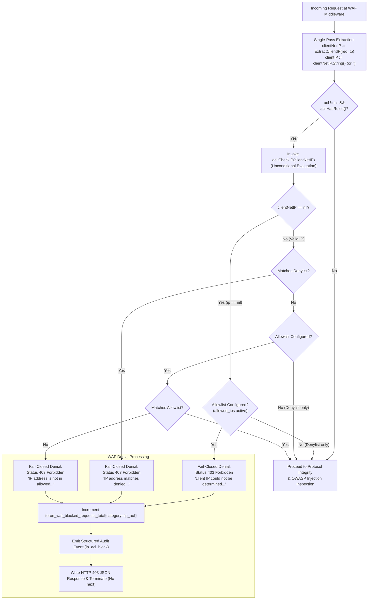

# Web Application Firewall (WAF) & OWASP Injection Protection

## Overview

Toron includes a native, high-throughput **Web Application Firewall (WAF)** middleware engine (`pkg/waf`) designed to intercept and mitigate Layer 7 security threats (OWASP Top 10) before they reach downstream application handlers or backend microservices.

## Key Capabilities

1. **OWASP Top 10 Injection Mitigation**:
   - **SQL Injection (SQLi)**: Detects `UNION SELECT`, `' OR 1=1`, and destructive DDL statements (`DROP TABLE`, `INSERT INTO`).
   - **Cross-Site Scripting (XSS)**: Intercepts script tags (`<script>`), inline event handlers (`onerror=`, `onload=`), and `javascript:` URIs.
   - **Path Traversal / LFI**: Detects directory escape sequences (`../`, `%2e%2e/`) and sensitive system files (`/etc/passwd`) via raw wire URI evaluation and layered route-aware defense (see [Path Traversal Defense](./path-traversal-defense.md)).
   - **Command Injection / RCE**: Intercepts shell command chaining (`; /bin/sh`, `| bash`) and PHP/system execution primitives (`eval()`, `system()`).
2. **Flexible Evaluation Modes**:
   - `enforce`: Immediately blocks malicious requests with HTTP `403 Forbidden` and a structured JSON error response.
   - `detection`: Passes requests through to application handlers while logging anomaly threat scores and attaching `X-Toron-WAF-Anomaly-Score` headers.
3. **Protocol Integrity & HTTP Request Smuggling Guard**:
   - **Request Smuggling Prevention**: Rejects requests containing both `Content-Length` and `Transfer-Encoding` headers or mismatched duplicate `Content-Length` header values with `400 Bad Request`.
   - **Control Character Filtering**: Rejects non-printable ASCII control characters (`0x00–0x1F`, `0x7F`) in paths, query parameters, or header fields.
   - **Payload Size Limits**: Enforces strict byte limits on single header values (4 KB), query strings (4 KB), and parameters (2 KB) returning `413 Payload Too Large`.
4. **CIDR-Based IP Access Control Lists (ACLs) & Anti-Spoofing**:
   - **Allowed IPs (`allowed_ips`)**: Configurable list of IPv4 and IPv6 CIDR blocks (e.g. `10.0.0.0/8`, `192.168.1.0/24`) or single IP addresses. When configured, requests originating from client IPs outside these ranges shall be immediately rejected with HTTP `403 Forbidden`.
   - **Denied IPs (`denied_ips`)**: Configurable list of IPv4 and IPv6 CIDR blocks (e.g. `198.51.100.0/24`) or single IP addresses returning `403 Forbidden`.
   - **Physical RemoteAddr Prioritization**: Client IP identity is anchored to the physical network connection address (`req.RemoteIP()`, `req.RemoteAddr`) across HTTP/1.1, HTTP/2, and HTTP/3 QUIC ([`SEC-31`](file:///Users/sneha/Developer/toron-research/toron/SECURITY_AUDIT.md#L428-L436), [`REQ-092`](file:///Users/sneha/Developer/toron-research/toron/docs/requirements/REQ-092.md), [`ADR-087`](file:///Users/sneha/Developer/toron-research/toron/docs/architecture/ADR-087.md)).
   - **Trusted Proxy Gating (`trusted_proxies`)**: Client-supplied `X-Forwarded-For` and `X-Real-IP` headers are discarded unless the client's physical socket IP is verified against configured `trusted_proxies`. Attackers cannot bypass IP blocks or evade allowlists by forging forwarded headers.
   - **Fail-Closed Allowlist Enforcement**: When `allowed_ips` is active, any request whose client IP cannot be determined or is malformed is rejected fail-closed with HTTP `403 Forbidden` and exact JSON payload `{"error":"Forbidden","message":"client IP could not be determined and allowed IP list is enforced"}` ([`SEC-32`](file:///Users/sneha/Developer/toron-research/toron/SECURITY_AUDIT.md#L439-L447), [`REQ-093`](file:///Users/sneha/Developer/toron-research/toron/docs/requirements/REQ-093.md), [`ADR-088`](file:///Users/sneha/Developer/toron-research/toron/docs/architecture/ADR-088.md)).
   - **Denylist-Only Fail-Open Pass-Through**: When only `denied_ips` is configured without an active allowlist, unidentifiable client IPs pass through the IP ACL stage (fail-open) to subsequent WAF stages and downstream handlers ([`REQ-093`](file:///Users/sneha/Developer/toron-research/toron/docs/requirements/REQ-093.md)).
   - **Single-Pass Hot-Path IP Extraction**: Client IP resolution via [`ExtractClientIP`](file:///Users/sneha/Developer/toron-research/toron/pkg/waf/ip_acl.go#L181-L207) executes exactly once at the entry of the middleware closure, caching parsed `net.IP` for unconditional access evaluation and structured telemetry.
   - **Fast-Path $O(1)$ Pre-Inspection**: IP access checking executes before deep regex scanning or body buffering.
5. **Per-Route WAF Customization & Overrides (`routes.yaml`)**:
   - Any individual route in `routes.yaml` can define its own `waf:` block to selectively override global settings (e.g. tuning anomaly thresholds, disabling specific rules like `SQLI-001` for legacy backends, or setting dedicated CIDR allowlists).
6. **Multi-Location & Bounded Inspection**:
   - Scans URL paths, raw query strings, HTTP headers, and request body payloads up to a configurable maximum size (`max_inspect_body_size`), preserving payload streams for downstream handlers.

## Configuration in `config.yaml`

```yaml
server:
  # Web Application Firewall (WAF) & Layer 7 OWASP Injection Protection Engine
  waf:
    enabled: true             # Enable WAF Layer 7 threat inspection middleware
    mode: "enforce"           # Evaluation mode: "enforce" (403 block) or "detection" (log-only score)
    anomaly_threshold: 5      # Threat score limit above which request is blocked
    max_inspect_body_size: 65536 # Maximum payload body bytes scanned (64 KB)
    disabled_rules: []        # Optional list of rule IDs to bypass (e.g. ["SQLI-002"])
    allowed_ips:              # Optional global CIDR IP allowlist
      - "10.0.0.0/8"
      - "127.0.0.1"
    denied_ips:               # Optional global CIDR IP denylist
      - "198.51.100.0/24"
    trusted_proxies:          # Optional CIDR subnets allowed to supply forwarded client IPs
      - "10.0.0.1/32"
    auto_ban:                 # 2-Stage Native Dynamic Auto-Ban Engine
      enabled: true           # Enable automated IP banning on repeated security violations
      max_violations: 1       # Violations within window triggering Stage 1 temporary ban (1 for instant ban)
      window: 60s             # Sliding time window for counting client security strikes
      ban_duration: 24h       # Stage 1 temporary ban duration (e.g. 24h, 1h)
      max_temporary_bans: 2   # Stage 1 bans before automatic escalation to Stage 2 Permanent Ban
      persistence_file: "/etc/toron/banned_ips.json" # Atomic state storage file
      whitelist:              # Exempted CIDR subnets (never banned)
        - "127.0.0.1/32"
        - "::1/128"
```

## 2-Stage Dynamic Auto-Ban Engine

Toron includes a high-performance **2-Stage Native Auto-Ban Engine** (`pkg/waf/auto_ban.go`) that tracks client security violations in real-time and escalates repeated malicious scanners to persistent bans.

### Ban Lifecycle & Escalation Tiers

1. **Strike Tracking (Sliding Window)**:
   - When a client triggers any WAF rule, path traversal attempt, IP ACL denial, or RCE exploit, Toron logs a security violation strike.
   - Strikes are evaluated across a configurable sliding time window (`window: 60s`).
2. **Stage 1: Temporary Ban**:
   - When an IP reaches `max_violations` (e.g., `1` for instant ban on zero-day probes, or `3` for rate-limited tuning), it is immediately placed in a **Stage 1 Temporary Ban**.
   - During the ban duration (`ban_duration: 24h`), all incoming requests from the client IP are dropped at the connection entrypoint (`auto_ban_drop`) returning HTTP `403 Forbidden`.
   - The IP accumulates `temp_ban_count` in persistent state.
3. **Stage 2: Permanent Ban**:
   - If a client IP accumulates `max_temporary_bans` (e.g. 2 temporary bans), the engine automatically escalates the IP to **Stage 2: Permanent Ban**.
   - Permanent bans persist indefinitely (`expires_at: 0`) across service restarts and system reboots.
   - Administrators can also immediately promote any IP to a Permanent Ban directly from the dashboard or management API.

### Atomic Disk State Persistence

- All active bans, strike histories, and expiration timestamps are written atomically to disk (`persistence_file: /etc/toron/banned_ips.json`) using temporary file staging (`banned_ips.json.tmp`) followed by atomic filesystem rename (`os.Rename`).
- State is preserved across daemon restarts, configuration reloads (`systemctl reload toron`), power loss, and crashes without data corruption.

### Management APIs

Toron exposes protected RESTful endpoints on `/internal/api/security/*`:

- **`GET /internal/api/security/banned-ips`**:
  Returns the complete list of active temporary and permanent bans, remaining TTL seconds, strike counts, and ban reasons.
- **`POST /internal/api/security/ban`**:
  Manually applies an immediate temporary or permanent ban:
  ```bash
  curl -X POST https://127.0.0.1/internal/api/security/ban \
    -H 'Content-Type: application/json' \
    -d '{"ip":"198.51.100.25","type":"permanent","reason":"Compromised scanner node"}'
  ```
- **`POST /internal/api/security/unban`**:
  Instantly lifts an active ban in memory and persists the change to disk:
  ```bash
  curl -X POST https://127.0.0.1/internal/api/security/unban \
    -H 'Content-Type: application/json' \
    -d '{"ip":"198.51.100.25"}'
  ```

## Route-Level WAF Overrides in `routes.yaml`

```yaml
routes:
  # 1. Admin route with strict CIDR IP access control & trusted proxy delegation
  - type: "upstream"
    prefix: "/services/secure-admin"
    target: "http://localhost:9001"
    waf:
      enabled: true
      mode: "enforce"
      allowed_ips:
        - "10.0.0.0/8"
        - "127.0.0.1"
      denied_ips:
        - "10.99.0.0/16"
      trusted_proxies:
        - "10.0.0.1/32"

  # 2. Legacy API route with SQLI-001 rule disabled
  - type: "upstream"
    prefix: "/services/legacy-api"
    target: "http://localhost:9002"
    waf:
      enabled: true
      mode: "enforce"
      disabled_rules:
        - "SQLI-001"
```

## Fail-Closed IP Access Control on Unidentifiable Client IP (SEC-32, REQ-093)

### Security Problem & Vulnerability Remediation

In earlier releases, when an IP allowlist (`allowed_ips`) was enforced, incoming requests lacking resolvable client IP metadata (e.g., stripped connection addresses, intermediate proxy header drops, synthetic test requests, or malformed non-IP headers) bypassed access control checks because the middleware guarded evaluation with `if ip != nil` and [`CheckIP(nil)`](file:///Users/sneha/Developer/toron-research/toron/pkg/waf/ip_acl.go#L76-L87) defaulted to fail-open (`true, ""`). This critical vulnerability was tracked as [`SEC-32`](file:///Users/sneha/Developer/toron-research/toron/SECURITY_AUDIT.md#L439-L447) ([CWE-284](https://cwe.mitre.org/data/definitions/284.html), [CWE-1188](https://cwe.mitre.org/data/definitions/1188.html), [CWE-693](https://cwe.mitre.org/data/definitions/693.html), [`SR-091 Finding 2`](file:///Users/sneha/Developer/toron-research/toron/docs/securityReview/SR-091.md#L102-L127)).

Toron v1.5.13 remediates this vulnerability under [`REQ-093`](file:///Users/sneha/Developer/toron-research/toron/docs/requirements/REQ-093.md) and [`ADR-088`](file:///Users/sneha/Developer/toron-research/toron/docs/architecture/ADR-088.md) by enforcing **fail-closed** access control on allowlists, context-aware policy evaluation, and single-pass client IP extraction.

### Behavior Under Active Allowlist (`allowed_ips` Enforced — Fail-Closed)

When an IP allowlist (`allowed_ips` or `allowedSubnets`) is configured and active globally in `config.yaml` or on a specific route in `routes.yaml`:

1. **Strict Positive Security Invariant**: Any request whose client IP cannot be verified against the configured allowlist is immediately rejected fail-closed.
2. **Evaluation Invariant**: If client IP extraction yields `nil` (due to missing `RemoteAddr`, unverified forwarded headers behind untrusted proxies, or malformed/unparseable values like `"unknown"`, `"localhost"`, `"999.999.999.999"`, `":::invalid"`), [`IPAccessList.CheckIP(nil)`](file:///Users/sneha/Developer/toron-research/toron/pkg/waf/ip_acl.go#L76-L87) returns `allowed: false` with reason `"client IP could not be determined and allowed IP list is enforced"`.
3. **HTTP 403 Forbidden Response**:
   - Status code: `403 Forbidden`
   - Header: `Content-Type: application/json`
   - Exact Body:
     ```json
     {"error":"Forbidden","message":"client IP could not be determined and allowed IP list is enforced"}
     ```
4. **Immediate Execution Termination**: Middleware immediately halts request processing without calling `next(req, res)` or forwarding traffic to upstream services.
5. **Observability & Audit Trail**:
   - Increments Prometheus counter `toron_waf_blocked_requests_total{category="ip_acl", route="..."}`.
   - Emits a structured [`SecurityEvent`](file:///Users/sneha/Developer/toron-research/toron/pkg/waf/audit.go#L28-L43) to the WAF audit logger with `Event: "ip_acl_block"`, `Action: "blocked"`, `Category: "ip_acl"`, `Location: "remote_addr"`, and `ClientIP: ""` (empty string, safe from null-pointer dereference panics).

### Behavior Under Denylist-Only Configurations (`denied_ips` Configured — Fail-Open Pass-Through)

When only `denied_ips` is configured without an active `allowed_ips` allowlist:

1. **Negative Security Model**: Denylists are exclusionary filters designed to block known malicious actors while allowing all other legitimate traffic.
2. **Fail-Open Pass-Through**: If the incoming client IP cannot be determined (`ExtractClientIP` returns `nil`), [`IPAccessList.CheckIP(nil)`](file:///Users/sneha/Developer/toron-research/toron/pkg/waf/ip_acl.go#L76-L87) returns `allowed: true, reason: ""`.
3. **Subsequent Stage Inspection**: The request passes through the IP ACL stage and proceeds to subsequent WAF inspection layers (Protocol Integrity, Custom Rules, OWASP Injection Rules) and downstream routing.
4. **Operational Availability**: Preserves availability for internal service mesh calls, synthetic health probes, or intermediate proxies that do not provide client IP headers, eliminating false-positive outages.

### Single-Pass Client IP Extraction Optimization

To eliminate redundant CPU overhead and minimize request latency on the hot path:

1. **Single Extraction per Request**: In [`pkg/waf/middleware.go`](file:///Users/sneha/Developer/toron-research/toron/pkg/waf/middleware.go), [`ExtractClientIP(req, tp)`](file:///Users/sneha/Developer/toron-research/toron/pkg/waf/ip_acl.go#L181-L207) is executed exactly once at the entry of the WAF middleware closure:
   ```go
   clientNetIP := ExtractClientIP(req, tp)
   clientIP := ""
   if clientNetIP != nil {
       clientIP = clientNetIP.String()
   }
   ```
2. **Unconditional ACL Evaluation**: The cached `clientNetIP net.IP` is passed directly to `acl.CheckIP(clientNetIP)` whenever `acl != nil && acl.HasRules()` evaluates to `true`, removing the vulnerable `if ip != nil` guard.
3. **Telemetry & Audit Parity**: The string representation `clientIP` is computed once and reused across all subsequent security telemetry:
   - IP ACL denial events (`ip_acl_block`)
   - Protocol integrity violation events (`protocol_violation`)
   - Custom rules and OWASP injection rule evaluation and audit logging
4. **Zero-Allocation Hot Path**: Eliminates duplicate socket host/port parsing, repeated CIDR lookups against `trusted_proxies`, and unnecessary heap allocations on benign requests.

### Policy Evaluation Matrix

| Client IP State | Allowlist (`allowed_ips`) | Denylist (`denied_ips`) | WAF IP ACL Verdict | HTTP Status | Response Payload | Next WAF Stages Executed? |
| :--- | :--- | :--- | :--- | :--- | :--- | :--- |
| **Unidentifiable / Nil / Malformed** | **Active** | *Any* | **Blocked (Fail-Closed)** | `403` | `{"error":"Forbidden","message":"client IP could not be determined and allowed IP list is enforced"}` | No (Immediate Halt) |
| **Unidentifiable / Nil / Malformed** | **None** | **Active** | **Allowed (Fail-Open)** | N/A | N/A (Pass-Through) | Yes |
| **Identified (Valid IP)** | Matches Allowed CIDR | Does Not Match Denied | **Allowed** | N/A | N/A (Pass-Through) | Yes |
| **Identified (Valid IP)** | Outside Allowed CIDR | *Any* | **Blocked** | `403` | `{"error":"Forbidden","message":"IP address is not in the allowed IP list"}` | No (Immediate Halt) |
| **Identified (Valid IP)** | *Any* | Matches Denied CIDR | **Blocked** | `403` | `{"error":"Forbidden","message":"IP address matches denied IP list"}` | No (Immediate Halt) |

### Architecture & Evaluation Flow



## Triggered Block Response Format

When a request is blocked in `enforce` mode, Toron returns `403 Forbidden` with an `application/json` payload depending on the violation:

### 1. OWASP Top 10 Injection Violations

```json
{
  "error": "Forbidden",
  "message": "WAF security violation detected",
  "threat_score": 5,
  "triggered_rules": ["SQLI-001"]
}
```

### 2. Fail-Closed Unidentifiable Client IP (Allowlist Enforced - SEC-32)

```json
{
  "error": "Forbidden",
  "message": "client IP could not be determined and allowed IP list is enforced"
}
```

### 3. IP Access Control List Violations (Identified IP)

- **Denied IP Address**:
  ```json
  {
    "error": "Forbidden",
    "message": "IP address matches denied IP list"
  }
  ```
- **Disallowed IP Address**:
  ```json
  {
    "error": "Forbidden",
    "message": "IP address is not in the allowed IP list"
  }
  ```

## Prometheus Observability & Metrics

Toron exports real-time WAF telemetry at the standard `/metrics` endpoint:

- **`toron_waf_blocked_requests_total{category="sqli|xss|traversal|rce|protocol|ip_acl", route="/..."}`**: Total number of blocked requests categorized by threat vector and route.
- **`toron_waf_anomalies_detected_total{category="...", mode="detection"}`**: Total threat anomalies detected in detection mode.
- **`toron_waf_inspection_duration_seconds`**: Histogram tracking WAF inspection execution latency.

```promql
# Example Prometheus Alert Query for SQLi spikes:
sum(rate(toron_waf_blocked_requests_total{category="sqli"}[5m])) > 10
```

## Structured Security Audit Logging

Toron emits structured, SIEM-ready JSON log lines for all security violations to `stdout`, `stderr`, or a dedicated log file:

```json
{
  "timestamp": "2026-08-15T14:30:00Z",
  "event": "waf_block",
  "client_ip": "198.51.100.45",
  "method": "POST",
  "path": "/api/users",
  "category": "sqli",
  "rule_id": "SQLI-001",
  "anomaly_score": 5,
  "action": "blocked",
  "location": "query",
  "payload_snippet": "1 UNION SELECT username, password FROM users"
}
```

## Web Control Center Security Dashboard & Real-Time Incidents Feed

Toron's Web Control Center served at `/internal/dashboard/` includes a dedicated **Security & WAF Dashboard**:

1. **Security & WAF Overview Tab**:
   - Live indicators for WAF Engine Mode (`ENFORCE` / `DETECTION`), Intercepted Threat Count, Active Inspection Rules count, and CIDR IP Access Lists.
   - **Security Policy Matrix**: Visual verification of active WAF rulesets, CIDR subnets, Enterprise Security Headers, CORS, and Mutual TLS policies.

2. **Real-Time Security Audit Stream**:
   - Live incident feed table displaying intercepted security threats in real-time.
   - Categorized threat badges (`SQLi`, `XSS`, `Traversal`, `RCE`, `IP ACL`, `Protocol`), client IP, triggered rule ID, HTTP method & path, threat score, and action taken (`BLOCKED` / `LOGGED`).
   - Powered by the `/internal/api/security/incidents` management endpoint.

3. **Interactive WAF Attack Presets**:
   - The Live API Tester composer includes pre-configured WAF attack payloads (SQL Injection, Path Traversal, Command Injection, XSS header) allowing administrators to validate WAF threat interception right from the web dashboard.


